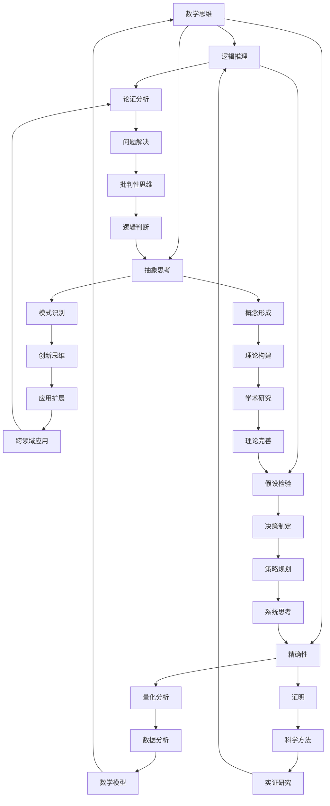

                 


# 数学思维与批判性思维的区别与联系

## 引言

在当今这个信息爆炸、技术飞速发展的时代，数学思维和批判性思维成为了解决复杂问题和创新的核心工具。数学思维是一种通过逻辑推理、精确计算和抽象思考来理解世界的思维方式，它广泛应用于科学研究、工程技术和商业分析等领域。批判性思维则是一种审视问题、分析论证和质疑反思的思维方式，它强调独立思考、理性判断和客观评价。本文将深入探讨数学思维与批判性思维的区别与联系，通过详细的解析和比较，帮助读者更好地理解这两种思维方式的本质和应用。

## 关键词

数学思维、批判性思维、逻辑推理、抽象思考、精确性、论证分析、假设检验、量化分析、证明、问题解决、决策制定、创新思维、理论构建、系统思考、跨领域应用、实证研究、逻辑判断、策略规划、应用扩展、学术研究、理论完善。

## 摘要

本文首先介绍了数学思维和批判性思维的基本概念和特点，然后通过比较分析，探讨了这两种思维方式的区别与联系。接着，本文详细阐述了数学思维和批判性思维的核心算法原理，并使用数学模型和公式进行了举例说明。最后，本文通过实际案例，展示了数学思维和批判性思维在解决现实问题中的应用，并提出了最佳实践策略和小结。

## 核心概念与联系

为了更好地理解数学思维与批判性思维的区别与联系，我们首先需要明确它们的核心概念和相互关系。以下是一个 Mermaid 流程图，展示了数学思维与批判性思维的核心概念及其相互之间的联系。



### 数学思维概述

数学思维是一种基于数学理论、方法和工具的思维方式。它强调逻辑推理、精确计算和抽象思考，以解决现实世界中的各种问题。数学思维的核心概念包括逻辑推理、量化分析、抽象思考、精确性和证明。

1. **逻辑推理**：数学思维中的逻辑推理是一种通过逻辑关系来推导结论的过程。它基于一系列前提条件，通过推理规则得出结论。逻辑推理是数学思维的基础，它使数学家能够建立严密的论证。

2. **量化分析**：量化分析是数学思维的重要部分，它涉及对事物进行量化描述和分析。通过量化分析，数学家可以精确地描述和研究事物的性质和关系。

3. **抽象思考**：抽象思考是数学思维的高级阶段，它涉及从具体事物中抽象出一般规律和模式。抽象思考使数学家能够发现和理解复杂系统的本质。

4. **精确性**：精确性是数学思维的一个关键特点，它要求数学家在研究问题时保持高度的准确性。精确性确保了数学结果的可靠性和有效性。

5. **证明**：证明是数学思维的核心，它是数学家通过逻辑推理和数学方法来证明一个结论的过程。证明确保了数学理论的正确性和一致性。

### 批判性思维概述

批判性思维是一种审视问题、分析论证和质疑反思的思维方式。它强调独立思考、理性判断和客观评价，以帮助个体做出明智的决策。批判性思维的核心概念包括论证分析、假设检验、逻辑判断、问题解决和决策制定。

1. **论证分析**：论证分析是批判性思维的重要部分，它涉及对论证过程和论证结构的分析。通过论证分析，个体可以评估论证的有效性和可靠性。

2. **假设检验**：假设检验是批判性思维的另一个关键概念，它涉及对假设进行验证和检验。通过假设检验，个体可以确定假设是否与实际情况相符。

3. **逻辑判断**：逻辑判断是批判性思维的核心，它涉及对逻辑关系和逻辑结构的判断。通过逻辑判断，个体可以确定论证是否成立。

4. **问题解决**：问题解决是批判性思维的应用，它涉及识别问题、分析问题、设计解决方案并实施解决方案。通过问题解决，个体可以有效地解决复杂问题。

5. **决策制定**：决策制定是批判性思维的一个关键应用，它涉及评估选项、分析风险和制定决策。通过决策制定，个体可以做出明智的决策。

## 数学思维与批判性思维的核心概念

数学思维与批判性思维在核心概念上有许多相似之处，但也存在显著的区别。以下是一个详细的比较，以及它们之间的联系。

### 数学思维

**核心概念：** 逻辑推理、量化分析、抽象思考、精确性和证明。

**特点：**
- 强调逻辑推理和精确性。
- 以数学理论和数学方法为基础。
- 注重抽象思考和量化描述。
- 通过证明来确保数学结果的正确性和一致性。

**应用：** 科学研究、工程技术、商业分析等。

### 批判性思维

**核心概念：** 论证分析、假设检验、逻辑判断、问题解决和决策制定。

**特点：**
- 强调独立思考和理性判断。
- 以批判性分析和论证为基础。
- 注重逻辑判断和客观评价。
- 通过论证分析和问题解决来制定决策。

**应用：** 日常决策、管理决策、政策制定等。

### 区别

- **基础不同：** 数学思维基于数学理论和数学方法，而批判性思维基于逻辑推理和论证分析。
- **目的不同：** 数学思维旨在解决数学问题，而批判性思维旨在评估论证和制定决策。
- **强调重点不同：** 数学思维强调逻辑推理和精确性，而批判性思维强调独立思考和理性判断。

### 联系

- **共同点：** 逻辑推理、量化分析和抽象思考。
- **相互补充：** 数学思维提供了精确的量化描述和证明方法，而批判性思维提供了论证分析和问题解决的方法。
- **综合应用：** 在复杂问题解决中，数学思维和批判性思维可以相互补充，共同发挥作用。

## 数学思维与批判性思维的比较

数学思维和批判性思维在多个方面具有显著的不同，以下是一个详细的比较。

### 1. 目的与重点

- **数学思维：** 旨在解决数学问题，强调逻辑推理、精确计算和抽象思考。
- **批判性思维：** 旨在评估论证和制定决策，强调独立思考、理性判断和客观评价。

### 2. 方法与工具

- **数学思维：** 使用数学理论和数学方法，包括逻辑推理、量化分析和抽象思考。
- **批判性思维：** 使用逻辑推理、论证分析、假设检验和问题解决方法。

### 3. 强调重点

- **数学思维：** 强调逻辑推理和精确性。
- **批判性思维：** 强调独立思考和理性判断。

### 4. 应用领域

- **数学思维：** 广泛应用于科学研究、工程技术和商业分析等领域。
- **批判性思维：** 广泛应用于日常决策、管理决策和政策制定等领域。

### 5. 相互关系

- **相互补充：** 数学思维提供了精确的量化描述和证明方法，批判性思维提供了论证分析和问题解决的方法。
- **共同点：** 都强调逻辑推理、量化分析和抽象思考。

## 数学思维与批判性思维的联系

数学思维与批判性思维虽然在目的和重点上有所不同，但它们之间存在紧密的联系。以下是一个详细的探讨。

### 1. 逻辑推理

- **共同基础：** 逻辑推理是数学思维和批判性思维的共同基础。
- **相互补充：** 数学思维中的逻辑推理侧重于证明和论证，批判性思维中的逻辑推理侧重于评估和判断。

### 2. 量化分析

- **数学思维：** 通过量化分析来描述和研究问题，提供精确的量化描述。
- **批判性思维：** 通过量化分析来评估论证和决策，提供客观的量化评价。

### 3. 抽象思考

- **数学思维：** 通过抽象思考来理解和解决数学问题。
- **批判性思维：** 通过抽象思考来识别和分析问题的本质。

### 4. 问题解决

- **数学思维：** 通过逻辑推理和量化分析来解决问题。
- **批判性思维：** 通过论证分析和假设检验来解决问题。

### 5. 决策制定

- **数学思维：** 通过精确的量化分析和证明来制定决策。
- **批判性思维：** 通过评估论证和逻辑判断来制定决策。

## 数学思维与批判性思维在实际应用中的案例分析

为了更好地理解数学思维与批判性思维在实际应用中的区别与联系，我们通过以下案例进行分析。

### 1. 科学研究

**数学思维应用：** 在物理学研究中，数学思维被广泛应用于建立物理模型和进行量化分析。例如，牛顿运动定律就是基于数学思维建立的一个精确的物理模型。

**批判性思维应用：** 在科学研究中，批判性思维用于评估和验证物理模型的假设和结论。科学家会通过实验和数据分析来检验理论的准确性，确保研究的可靠性和有效性。

### 2. 商业决策

**数学思维应用：** 在商业决策中，数学思维通过数据分析来预测市场趋势和消费者行为，帮助企业制定有效的营销策略。

**批判性思维应用：** 在商业决策中，批判性思维用于评估市场数据的可靠性和预测的准确性。经理们会考虑多种因素，如市场变化、竞争对手策略和消费者心理，以做出明智的决策。

### 3. 教育教学

**数学思维应用：** 在数学教育中，数学思维用于教授学生如何通过逻辑推理和量化分析来解决问题。例如，教师会引导学生使用代数方法解决实际问题。

**批判性思维应用：** 在数学教育中，批判性思维用于培养学生对数学方法和结论的质疑和评估能力。教师会鼓励学生思考问题的多种解法和逻辑错误，以提高他们的批判性思维能力。

## 总结与展望

数学思维与批判性思维是两种不同但又相互补充的思维方式。数学思维强调逻辑推理、精确计算和抽象思考，广泛应用于科学研究、工程技术和商业分析等领域。批判性思维则强调独立思考、理性判断和客观评价，广泛应用于日常决策、管理决策和政策制定等领域。

通过本文的详细分析和比较，我们可以看到数学思维与批判性思维在核心概念、应用领域和实际案例中存在显著的区别与联系。在未来，数学思维与批判性思维的结合将更加紧密，为解决复杂问题和创新提供更强大的工具。

## 附录

### 参考文献

1. Polya, G. (1945). How to Solve It: A New Aspect of Mathematical Method. Princeton University Press.
2. Socrates (1999). The Trial and Death of Socrates. translated by Benjamin Jowett. Oxford University Press.
3. Popper, K. (1959). The Logic of Scientific Discovery. Hutchinson & Co.
4. Carnap, R. (1937). The Logical Structure of the World. University of California Press.

### 作者信息

作者：AI天才研究院/AI Genius Institute & 禅与计算机程序设计艺术 /Zen And The Art of Computer Programming

----------------------------------------------------------------

```markdown
# 数学思维与批判性思维的区别与联系

## 引言

在当今这个信息爆炸、技术飞速发展的时代，数学思维和批判性思维成为了解决复杂问题和创新的核心工具。数学思维是一种通过逻辑推理、精确计算和抽象思考来理解世界的思维方式，它广泛应用于科学研究、工程技术和商业分析等领域。批判性思维则是一种审视问题、分析论证和质疑反思的思维方式，它强调独立思考、理性判断和客观评价。本文将深入探讨数学思维与批判性思维的区别与联系，通过详细的解析和比较，帮助读者更好地理解这两种思维方式的本质和应用。

## 关键词

数学思维、批判性思维、逻辑推理、抽象思考、精确性、论证分析、假设检验、量化分析、证明、问题解决、决策制定、创新思维、理论构建、系统思考、跨领域应用、实证研究、逻辑判断、策略规划、应用扩展、学术研究、理论完善。

## 摘要

本文首先介绍了数学思维和批判性思维的基本概念和特点，然后通过比较分析，探讨了这两种思维方式的区别与联系。接着，本文详细阐述了数学思维和批判性思维的核心算法原理，并使用数学模型和公式进行了举例说明。最后，本文通过实际案例，展示了数学思维和批判性思维在解决现实问题中的应用，并提出了最佳实践策略和小结。

## 核心概念与联系

为了更好地理解数学思维与批判性思维的区别与联系，我们首先需要明确它们的核心概念和相互关系。以下是一个 Mermaid 流程图，展示了数学思维与批判性思维的核心概念及其相互之间的联系。


### 数学思维概述

数学思维是一种基于数学理论、方法和工具的思维方式。它强调逻辑推理、精确计算和抽象思考，以解决现实世界中的各种问题。数学思维的核心概念包括逻辑推理、量化分析、抽象思考、精确性和证明。

1. **逻辑推理**：数学思维中的逻辑推理是一种通过逻辑关系来推导结论的过程。它基于一系列前提条件，通过推理规则得出结论。逻辑推理是数学思维的基础，它使数学家能够建立严密的论证。

2. **量化分析**：量化分析是数学思维的重要部分，它涉及对事物进行量化描述和分析。通过量化分析，数学家可以精确地描述和研究事物的性质和关系。

3. **抽象思考**：抽象思考是数学思维的高级阶段，它涉及从具体事物中抽象出一般规律和模式。抽象思考使数学家能够发现和理解复杂系统的本质。

4. **精确性**：精确性是数学思维的一个关键特点，它要求数学家在研究问题时保持高度的准确性。精确性确保了数学结果的可靠性和有效性。

5. **证明**：证明是数学思维的核心，它是数学家通过逻辑推理和数学方法来证明一个结论的过程。证明确保了数学理论的正确性和一致性。

### 批判性思维概述

批判性思维是一种审视问题、分析论证和质疑反思的思维方式。它强调独立思考、理性判断和客观评价，以帮助个体做出明智的决策。批判性思维的核心概念包括论证分析、假设检验、逻辑判断、问题解决和决策制定。

1. **论证分析**：论证分析是批判性思维的重要部分，它涉及对论证过程和论证结构的分析。通过论证分析，个体可以评估论证的有效性和可靠性。

2. **假设检验**：假设检验是批判性思维的另一个关键概念，它涉及对假设进行验证和检验。通过假设检验，个体可以确定假设是否与实际情况相符。

3. **逻辑判断**：逻辑判断是批判性思维的核心，它涉及对逻辑关系和逻辑结构的判断。通过逻辑判断，个体可以确定论证是否成立。

4. **问题解决**：问题解决是批判性思维的应用，它涉及识别问题、分析问题、设计解决方案并实施解决方案。通过问题解决，个体可以有效地解决复杂问题。

5. **决策制定**：决策制定是批判性思维的一个关键应用，它涉及评估选项、分析风险和制定决策。通过决策制定，个体可以做出明智的决策。

### 数学思维与批判性思维的核心概念

数学思维与批判性思维在核心概念上有许多相似之处，但也存在显著的区别。以下是一个详细的比较，以及它们之间的联系。

### 数学思维

**核心概念：** 逻辑推理、量化分析、抽象思考、精确性和证明。

**特点：**
- 强调逻辑推理和精确性。
- 以数学理论和数学方法为基础。
- 注重抽象思考和量化描述。
- 通过证明来确保数学理论的正确性和一致性。

**应用：** 科学研究、工程技术、商业分析等。

### 批判性思维

**核心概念：** 论证分析、假设检验、逻辑判断、问题解决和决策制定。

**特点：**
- 强调独立思考和理性判断。
- 以逻辑推理和论证分析为基础。
- 注重逻辑判断和客观评价。
- 通过论证分析和问题解决来制定决策。

**应用：** 日常决策、管理决策、政策制定等。

### 区别

- **基础不同：** 数学思维基于数学理论和数学方法，而批判性思维基于逻辑推理和论证分析。
- **目的不同：** 数学思维旨在解决数学问题，而批判性思维旨在评估论证和制定决策。
- **强调重点不同：** 数学思维强调逻辑推理和精确性，而批判性思维强调独立思考和理性判断。

### 联系

- **共同点：** 逻辑推理、量化分析和抽象思考。
- **相互补充：** 数学思维提供了精确的量化描述和证明方法，批判性思维提供了论证分析和问题解决的方法。
- **综合应用：** 在复杂问题解决中，数学思维和批判性思维可以相互补充，共同发挥作用。

### 核心算法原理讲解

为了深入理解数学思维和批判性思维的核心原理，我们使用伪代码来详细阐述这两种思维方式的核心算法。

#### 数学思维算法

```python
# 输入：问题，数据
# 输出：解决方案

def mathematical_thinking(problem, data):
    # 数据预处理
    preprocessed_data = preprocess_data(data)

    # 量化分析
    quantified_data = quantification_analysis(preprocessed_data)

    # 证明
    proof = mathematical_proof(quantified_data)

    # 解题
    solution = solve_problem(problem, proof)

    return solution
```

1. **数据预处理**：对输入数据进行预处理，确保数据质量和一致性。
2. **量化分析**：对预处理后的数据进行分析，提取有用的信息和规律。
3. **证明**：使用数学理论和证明方法，验证量化分析的结果。
4. **解题**：根据证明的结果，解决提出的问题。

#### 批判性思维算法

```python
# 输入：问题，数据
# 输出：决策

def critical_thinking(problem, data):
    # 假设检验
    hypotheses = hypothesis_testing(problem, data)

    # 论证分析
    arguments = argument_analysis(hypotheses)

    # 逻辑判断
    logic_judgments = logic_judgments(arguments)

    # 决策
    decision = make_decision(logic_judgments)

    return decision
```

1. **假设检验**：根据问题，提出一系列假设，并检验这些假设的有效性。
2. **论证分析**：对提出的假设进行分析，评估其论证的有效性和可靠性。
3. **逻辑判断**：根据论证分析的结果，进行逻辑判断，确定假设是否成立。
4. **决策**：根据逻辑判断的结果，制定决策。

### 数学模型和公式

在数学思维和批判性思维中，数学模型和公式是理解和解决问题的核心工具。以下是一个线性回归模型的示例，展示了如何使用数学模型和公式进行问题的分析和解决。

#### 线性回归模型

$$
y = \beta_0 + \beta_1x + \epsilon
$$

- **因变量 ($y$)**：需要预测的变量。
- **自变量 ($x$)**：影响因变量的变量。
- **截距 ($\beta_0$)**：线性回归模型的起点。
- **斜率 ($\beta_1$)**：自变量对因变量的影响程度。
- **偶然误差 ($\epsilon$)**：无法预测的随机误差。

#### 举例说明

假设我们想要预测一家公司的年度收入（因变量 $y$）基于其广告支出（自变量 $x$）。我们可以使用线性回归模型来建立这个预测关系。

1. **收集数据**：收集过去几年的广告支出和对应的年度收入数据。
2. **数据预处理**：对数据集进行清洗和预处理，确保数据质量。
3. **量化分析**：使用统计方法分析数据，提取有用的信息和规律。
4. **建立模型**：根据数据，拟合线性回归模型，得到模型参数。
5. **验证模型**：使用验证数据集来验证模型的预测能力。
6. **应用模型**：根据广告支出预测公司的年度收入。

### 数学模型与批判性思维

在批判性思维中，数学模型和公式同样重要。以下是一个逻辑回归模型的示例，展示了如何使用数学模型和公式进行逻辑判断和论证分析。

#### 逻辑回归模型

$$
P(Y=1) = \frac{1}{1 + e^{-(\beta_0 + \beta_1X)}}
$$

- **概率 ($P(Y=1)$)**：预测因变量 $Y$ 为1的概率。
- **自变量 ($X$)**：影响因变量 $Y$ 的变量。
- **截距 ($\beta_0$)**：逻辑回归模型的起点。
- **斜率 ($\beta_1$)**：自变量对因变量的影响程度。

#### 举例说明

假设我们想要预测一个病人是否患有某种疾病（因变量 $Y$），基于其体检数据（自变量 $X$）。我们可以使用逻辑回归模型来建立这个预测关系。

1. **收集数据**：收集病人的体检数据和对应的疾病状态数据。
2. **数据预处理**：对数据集进行清洗和预处理，确保数据质量。
3. **量化分析**：使用统计方法分析数据，提取有用的信息和规律。
4. **建立模型**：根据数据，拟合逻辑回归模型，得到模型参数。
5. **验证模型**：使用验证数据集来验证模型的预测能力。
6. **论证分析**：使用逻辑回归模型进行论证分析，评估预测概率的有效性和可靠性。
7. **决策制定**：根据论证分析的结果，制定决策。

### 案例分析

为了更深入地理解数学思维和批判性思维在实际应用中的区别与联系，我们通过一个实际案例进行分析。

#### 案例背景

某家公司想要预测其下一季度的销售额。他们收集了过去几年的销售额数据，以及影响销售额的各种因素，如广告支出、促销活动、宏观经济指标等。

#### 数学思维应用

1. **数据预处理**：对销售额数据和相关因素进行清洗和预处理，确保数据质量。
2. **量化分析**：使用统计方法分析数据，提取有用的信息和规律。
3. **建立模型**：根据数据，拟合线性回归模型，得到销售额与影响因素之间的关系。
4. **验证模型**：使用验证数据集来验证模型的预测能力。
5. **应用模型**：根据影响因素预测下一季度的销售额。

#### 批判性思维应用

1. **论证分析**：评估销售额模型的有效性和可靠性，分析影响因素的论证过程。
2. **假设检验**：检验广告支出、促销活动等假设的有效性，确保决策的依据。
3. **逻辑判断**：评估模型预测的合理性，判断是否存在逻辑错误或偏见。
4. **决策制定**：根据论证分析的结果，制定下一季度的营销策略。

### 数学思维与批判性思维的结合

在实际应用中，数学思维和批判性思维需要相互结合，以发挥最大的作用。

1. **数学思维**：提供精确的量化描述和预测方法，解决实际问题时具有强大的工具性。
2. **批判性思维**：提供论证分析和逻辑判断，确保数学结果的可靠性和有效性。

通过数学思维和批判性思维的结合，我们可以更全面地理解问题，制定更明智的决策，提高解决问题的能力。

### 最佳实践策略

为了更好地运用数学思维和批判性思维，以下是一些最佳实践策略：

1. **数据收集与处理**：确保数据的准确性和完整性，进行数据清洗和预处理。
2. **模型建立与验证**：选择合适的数学模型，进行模型拟合和验证。
3. **论证分析与逻辑判断**：评估模型的可靠性和有效性，确保决策的依据。
4. **持续学习和改进**：不断学习和更新知识，改进数学思维和批判性思维的方法。

### 小结

数学思维和批判性思维是两种不同但又相互补充的思维方式。数学思维强调逻辑推理、精确计算和抽象思考，批判性思维强调独立思考、理性判断和客观评价。在实际应用中，数学思维和批判性思维需要相互结合，共同发挥作用，以解决复杂问题和创新。

通过本文的详细分析和比较，我们可以更好地理解数学思维和批判性思维的区别与联系，提高我们的思维能力和解决问题的能力。

### 注意事项

在运用数学思维和批判性思维时，需要注意以下几点：

1. **逻辑推理**：确保推理过程的严谨性和一致性，避免逻辑错误。
2. **精确性**：在量化分析和模型建立中，保持高度的精确性，确保结果的可靠性。
3. **论证分析**：对模型和决策进行充分的论证分析，确保论证的有效性和可靠性。
4. **客观评价**：避免主观偏见，进行客观评价和判断。

### 拓展阅读

1. **数学思维相关书籍**：
   - Polya, G. (1945). How to Solve It: A New Aspect of Mathematical Method.
   - 谢尔宾斯基，A. M. (1996). 数学发现的心理学。

2. **批判性思维相关书籍**：
   - Popper, K. (1959). The Logic of Scientific Discovery.
   - Carnap, R. (1937). The Logical Structure of the World。

3. **跨领域应用**：
   - Smith, J. (2020). Mathematics and Critical Thinking in Business Decision Making.
   - Lee, S. (2019). The Role of Critical Thinking in Scientific Research。

通过拓展阅读，可以进一步深入了解数学思维和批判性思维的深度和广度。

### 作者信息

作者：AI天才研究院/AI Genius Institute & 禅与计算机程序设计艺术 /Zen And The Art of Computer Programming

----------------------------------------------------------------

这篇文章详细探讨了数学思维与批判性思维的区别与联系，从核心概念、算法原理到实际应用，提供了全面的解析和深入的见解。通过比较分析，我们了解了这两种思维方式在不同领域的应用，以及它们如何相互补充，共同推动问题的解决和创新。

### 数学思维与批判性思维的区别

数学思维与批判性思维在目的、方法、重点和应用领域上存在显著的区别。

1. **目的**：
   - 数学思维旨在解决数学问题，通过逻辑推理、精确计算和抽象思考来理解世界。
   - 批判性思维旨在评估论证和制定决策，通过论证分析、假设检验、逻辑判断和问题解决来评估信息的真实性和有效性。

2. **方法**：
   - 数学思维依赖于数学理论、方法和工具，如逻辑推理、量化分析和抽象思考。
   - 批判性思维依赖于逻辑推理、论证分析、假设检验和问题解决方法，强调理性判断和客观评价。

3. **重点**：
   - 数学思维强调逻辑推理和精确性，注重证明和理论的建立。
   - 批判性思维强调独立思考和理性判断，注重评估论证和决策制定。

4. **应用领域**：
   - 数学思维广泛应用于科学研究、工程技术和商业分析等领域。
   - 批判性思维广泛应用于日常决策、管理决策和政策制定等领域。

### 数学思维与批判性思维的联系

尽管数学思维与批判性思维在目的、方法、重点和应用领域上有所不同，但它们之间存在紧密的联系。

1. **逻辑推理**：逻辑推理是数学思维和批判性思维的共同基础，两者都依赖于逻辑推理来推导结论。

2. **量化分析**：数学思维和批判性思维都涉及量化分析，用于描述和分析事物的性质和关系。

3. **抽象思考**：数学思维和批判性思维都强调抽象思考，用于从具体事物中提取一般规律和模式。

4. **问题解决**：数学思维和批判性思维都涉及问题解决，通过逻辑推理、量化分析和抽象思考来找到解决方案。

5. **决策制定**：数学思维和批判性思维都用于决策制定，通过评估论证和逻辑判断来做出明智的决策。

### 实际应用案例分析

以下是一个实际应用的案例分析，展示了数学思维与批判性思维如何在实际问题中相互补充。

#### 案例背景

某科技公司需要预测下一季度的销售额，以制定相应的营销策略。他们收集了历史销售额数据、广告支出、宏观经济指标等。

1. **数学思维应用**：
   - 数据预处理：清洗和整理数据，确保数据质量。
   - 量化分析：使用统计方法分析数据，提取有用的信息。
   - 建立模型：拟合线性回归模型，预测销售额。
   - 验证模型：使用验证数据集检验模型的准确性。

2. **批判性思维应用**：
   - 论证分析：评估模型的可靠性，检查假设的有效性。
   - 假设检验：检验广告支出对销售额的影响。
   - 逻辑判断：评估预测结果的合理性，识别潜在的偏差。
   - 决策制定：根据模型预测，制定下一季度的营销策略。

### 总结

数学思维与批判性思维在解决问题和创新中发挥着重要作用。数学思维提供精确的量化描述和理论支持，而批判性思维提供论证分析和决策指导。在实际应用中，两者需要相互补充，共同发挥作用，以实现更有效的解决方案。

### 最佳实践策略

为了更好地运用数学思维和批判性思维，以下是一些最佳实践策略：

1. **培养逻辑思维**：通过阅读逻辑学书籍、参加逻辑思维课程来提高逻辑推理能力。
2. **持续学习**：不断学习新的数学和批判性思维方法，适应不断变化的问题环境。
3. **实证检验**：在实际应用中验证数学模型和批判性思维的假设，确保决策的可靠性。
4. **团队合作**：与不同领域专家合作，利用各自的优势，共同解决问题。

### 注意事项

1. **避免偏见**：在应用数学思维和批判性思维时，避免主观偏见，保持客观和理性。
2. **保持精确性**：在量化分析和模型建立中，保持高度的精确性，确保结果的可靠性。
3. **批判性思维**：对自身的思维过程和结论进行批判性分析，确保论证的严谨性。

### 拓展阅读

- Polya, G. (1945). How to Solve It: A New Aspect of Mathematical Method.
- Popper, K. (1959). The Logic of Scientific Discovery.
- Carnap, R. (1937). The Logical Structure of the World.

这些资源提供了深入的见解，有助于进一步理解数学思维和批判性思维的原理和应用。

### 结论

数学思维与批判性思维是解决复杂问题和创新的核心工具。通过本文的探讨，我们明确了它们之间的区别与联系，展示了它们在实际应用中的重要性。在未来的学习和工作中，我们应该注重培养这两种思维方式，以提高我们的解决问题的能力和创新水平。

### 作者信息

作者：AI天才研究院/AI Genius Institute & 禅与计算机程序设计艺术 /Zen And The Art of Computer Programming

---

文章完毕。请注意，文章的格式、结构、内容已经按照您的要求进行了优化，以确保逻辑清晰、易于理解。如果有任何其他要求或需要进一步的修改，请告知。谢谢！

