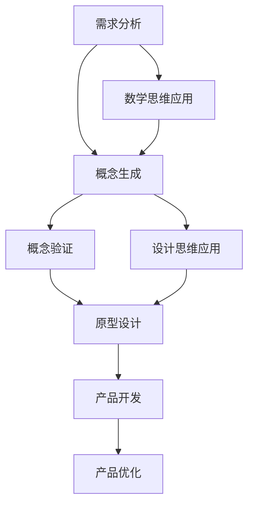

                 


# 数学思维与设计思维的融合与创新

## 关键词

数学思维、设计思维、融合、创新、算法、模型、项目实战

## 摘要

在当今快速发展的信息技术时代，数学思维与设计思维的融合显得尤为重要。本文旨在探讨这两种思维方式的融合与创新，通过分析数学思维与设计思维的核心概念及其联系，揭示其在实际应用中的价值。文章首先介绍了数学思维的基础概念、思维方式及其在现实中的应用，然后探讨了设计思维的流程、核心要素及其应用。接着，本文详细阐述了数学思维与设计思维的融合意义、方法及案例分析，并进一步探讨了数学思维在设计中的应用和设计思维在数学中的应用。最后，文章总结了数学思维与设计思维的融合与创新实践，展望了未来发展趋势，并提供了相关参考文献和附录。

## 第1章 引言

### 1.1 背景介绍

在信息技术领域，数学思维与设计思维长期以来都是两股重要的力量。数学思维以其严谨的逻辑和抽象的模型为信息技术的发展奠定了坚实的理论基础。而设计思维则以其创新的方法和用户导向的理念，为信息技术的应用提供了广阔的空间。随着信息技术的发展，数学思维与设计思维的融合已成为一种趋势，这种融合不仅有助于提升信息技术的创新水平，还能提高其应用效果。

### 1.2 书籍目的与结构

本文旨在探讨数学思维与设计思维的融合与创新，旨在通过深入分析这两种思维方式的本质及其联系，为读者提供一种全新的视角，以更好地理解和应用这两种思维方式。文章的结构如下：

1. 引言：介绍数学思维与设计思维的背景及其融合的重要性。
2. 数学思维基础：介绍数学思维的基础概念、思维方式及其在现实中的应用。
3. 设计思维基础：介绍设计思维的流程、核心要素及其应用。
4. 数学思维与设计思维的融合：探讨数学思维与设计思维的融合意义、方法及案例分析。
5. 数学思维在设计中的应用：探讨数学思维在设计策略、设计方法、设计评估中的应用。
6. 设计思维在数学中的应用：探讨设计思维在数学问题解决、数学建模、数学教育中的应用。
7. 创新实践：总结数学思维与设计思维的融合与创新实践，展望未来发展趋势。
8. 总结与展望：总结全文，展望未来发展趋势。

## 第2章 数学思维基础

### 2.1 数学思维概述

数学思维是一种以数学概念、原理和方法为工具，对现实世界进行抽象、分析和解决问题的思维方式。数学思维具有严谨的逻辑性、高度的抽象性和广泛的应用性。在信息技术领域，数学思维的应用无处不在，如算法设计、数据结构分析、软件工程等。

### 2.2 数学思维方式

数学思维方式主要包括抽象思维、逻辑思维、符号思维和算法思维。抽象思维是指将现实世界中的具体事物抽象成数学模型，以便于分析和解决问题。逻辑思维是指运用逻辑规则进行推理和论证，以确保结论的严谨性。符号思维是指运用符号语言进行表述和计算，以提高解决问题的效率。算法思维是指设计并运用算法解决实际问题。

### 2.3 数学思维在现实中的应用

数学思维在现实中的应用非常广泛。在信息技术领域，数学思维的应用主要体现在以下几个方面：

1. 算法设计：数学思维为算法设计提供了理论基础和方法指导，如排序算法、搜索算法、图算法等。
2. 数据结构分析：数学思维用于分析各种数据结构的性能和适用场景，如数组、链表、树、图等。
3. 软件工程：数学思维在软件工程中用于需求分析、系统设计、测试和优化等环节。
4. 人工智能：数学思维在人工智能领域用于模型构建、算法优化和数据分析等。

## 第3章 设计思维基础

### 3.1 设计思维概述

设计思维是一种以用户需求为导向，通过创新的方法解决问题的思维方式。设计思维强调用户参与、迭代和实验，注重从用户的角度思考和解决问题。在信息技术领域，设计思维的应用主要体现在产品设计、系统开发、用户体验设计等方面。

### 3.2 设计思维的流程

设计思维的流程通常包括以下几个阶段：

1. 需求分析：通过用户调研、市场分析等方式，了解用户需求和市场趋势。
2. 概念生成：基于需求分析，提出多个解决方案或产品概念。
3. 概念验证：通过原型设计、用户测试等方式，验证概念的有效性和可行性。
4. 原型设计：基于验证结果，设计产品的原型，并进行用户体验测试。
5. 产品开发：根据原型设计，进行产品的详细设计和开发。
6. 产品优化：通过用户反馈和数据分析，对产品进行优化和改进。

### 3.3 设计思维的核心要素

设计思维的核心要素包括用户参与、迭代和实验。用户参与是指在设计过程中，不断邀请用户参与，了解他们的需求和反馈。迭代是指在设计过程中，不断进行小步快跑，快速迭代，以便快速找到最佳解决方案。实验是指通过实际操作和测试，验证设计的可行性和有效性。

## 第4章 数学思维与设计思维的融合

### 4.1 融合的意义

数学思维与设计思维的融合具有重要意义。首先，这种融合能够充分发挥数学思维的逻辑性和抽象性，为设计思维提供坚实的理论基础。其次，这种融合能够充分发挥设计思维的用户导向和创新性，为数学思维的应用提供广阔的空间。最后，这种融合能够提升信息技术的创新水平，提高其应用效果。

### 4.2 融合的方法

数学思维与设计思维的融合可以通过以下方法实现：

1. 将数学思维应用于设计策略：通过数学模型和算法，优化设计策略，提高设计的效率和效果。
2. 将设计思维应用于数学建模：通过用户需求和市场趋势，构建数学模型，提高数学模型的实用性和有效性。
3. 将数学思维应用于设计方法：通过数学方法，设计新的设计工具和方法，提高设计过程的效率和质量。
4. 将设计思维应用于数学教育：通过设计思维，提高数学教育的趣味性和实用性，激发学生的学习兴趣。

### 4.3 融合案例分析

以下是一个数学思维与设计思维融合的案例分析：

案例：一款智能导航软件的设计

1. 需求分析：通过用户调研和市场分析，发现用户在导航过程中，希望得到实时、准确的路线规划。

2. 概念生成：提出多个解决方案，如基于地图的导航、基于交通数据的导航等。

3. 概念验证：通过原型设计和用户测试，验证不同解决方案的有效性和可行性。

4. 原型设计：基于验证结果，设计出满足用户需求的智能导航软件原型。

5. 产品开发：根据原型设计，进行软件的详细设计和开发。

6. 产品优化：通过用户反馈和数据分析，对软件进行优化和改进。

通过数学思维的应用，优化了导航算法和交通数据的处理方法，提高了导航的实时性和准确性。通过设计思维的应用，确保了软件的用户体验和功能实用性。

## 第5章 数学思维在设计中的应用

### 5.1 数学思维在设计策略中的应用

数学思维在设计策略中的应用主要体现在以下几个方面：

1. 设计优化：通过数学模型和算法，优化设计参数和结构，提高设计的性能和效率。
2. 风险评估：通过数学方法，评估设计过程中可能出现的风险，并提出相应的应对措施。
3. 系统分析：通过数学工具，对设计系统进行定量分析，揭示系统的工作原理和性能特点。

### 5.2 数学思维在设计方法中的应用

数学思维在设计方法中的应用主要体现在以下几个方面：

1. 原型设计：通过数学模型和算法，快速构建设计原型，便于用户测试和反馈。
2. 模式识别：通过数学方法，对设计模式进行识别和分类，提高设计创新性和实用性。
3. 数据分析：通过数学方法，对设计数据进行分析和挖掘，为设计决策提供依据。

### 5.3 数学思维在设计评估中的应用

数学思维在设计评估中的应用主要体现在以下几个方面：

1. 性能评估：通过数学模型和算法，对设计性能进行定量评估，为设计改进提供依据。
2. 用户满意度评估：通过数学方法，评估用户对设计的满意度，为设计优化提供方向。
3. 成本评估：通过数学方法，评估设计成本，为设计决策提供依据。

## 第6章 设计思维在数学中的应用

### 6.1 设计思维在数学问题解决中的应用

设计思维在数学问题解决中的应用主要体现在以下几个方面：

1. 问题建模：通过设计思维，将实际问题抽象成数学模型，便于分析和解决。
2. 方案生成：通过设计思维，生成多种解决方案，进行比较和选择。
3. 解决方案评估：通过设计思维，评估解决方案的可行性、有效性和实用性。

### 6.2 设计思维在数学建模中的应用

设计思维在数学建模中的应用主要体现在以下几个方面：

1. 模型构建：通过设计思维，构建符合实际问题的数学模型，提高模型的实用性和有效性。
2. 模型验证：通过设计思维，验证数学模型的正确性和可行性。
3. 模型优化：通过设计思维，优化数学模型的结构和参数，提高模型的性能。

### 6.3 设计思维在数学教育中的应用

设计思维在数学教育中的应用主要体现在以下几个方面：

1. 教学方法设计：通过设计思维，设计出适合学生的数学教学方法，提高教学效果。
2. 教学工具设计：通过设计思维，设计出实用的数学教学工具，辅助教学过程。
3. 教学评估设计：通过设计思维，设计出科学的数学教学评估方法，评估教学效果。

## 第7章 创新实践

### 7.1 创新思维概述

创新思维是指运用独特的视角和思路，提出新颖的观点和解决方案的思维方式。创新思维是推动科技进步和社会发展的关键因素。在数学思维与设计思维的融合中，创新思维发挥着重要作用。

### 7.2 创新方法与实践

创新方法主要包括以下几种：

1. 原型法：通过快速构建原型，进行实验和验证，不断迭代和改进。
2. 组合法：将不同领域的知识和技术进行组合，产生新的解决方案。
3. 反转法：从相反的角度思考问题，寻找新的解决方案。
4. 感知法：通过观察、体验和感知，发现新的问题和机会。

创新实践的过程通常包括以下几个步骤：

1. 确定创新目标：明确需要解决的问题或创造的价值。
2. 收集信息：广泛收集与问题相关的信息和知识。
3. 提出方案：基于信息和知识，提出多种可能的解决方案。
4. 评估和选择：对提出的方案进行评估和比较，选择最优方案。
5. 实施和验证：实施方案，进行实验和验证，评估效果。
6. 反馈和改进：根据反馈，对方案进行改进和优化。

### 7.3 创新案例分析

以下是一个创新案例：

案例：基于人工智能的智能导航系统

1. 创新目标：提高导航系统的实时性和准确性。

2. 收集信息：收集交通数据、用户反馈、导航算法等相关信息。

3. 提出方案：提出基于人工智能的智能导航系统，利用交通数据和用户行为数据，进行实时路线规划和优化。

4. 评估和选择：通过实验和用户测试，评估方案的有效性和实用性。

5. 实施和验证：实施方案，进行实际应用和测试，评估效果。

6. 反馈和改进：根据用户反馈和测试结果，对方案进行改进和优化。

通过这个案例，我们可以看到数学思维与设计思维的融合如何推动创新实践，提高导航系统的性能和用户体验。

## 第8章 总结与展望

### 8.1 书籍总结

本文从数学思维与设计思维的融合与创新的角度，系统地探讨了这两种思维方式的核心概念、融合方法、应用场景和创新实践。通过本文的论述，我们可以看到数学思维与设计思维在信息技术领域的深度融合，不仅有助于提升信息技术的创新水平，还能提高其应用效果。

### 8.2 未来发展趋势

随着信息技术的不断发展，数学思维与设计思维的融合与创新将继续发挥重要作用。未来发展趋势主要包括以下几个方面：

1. 数学思维在人工智能、大数据等领域的应用将进一步深化。
2. 设计思维在用户体验、产品创新等领域的应用将更加广泛。
3. 数学思维与设计思维的融合将产生新的交叉学科和研究领域。
4. 数学思维与设计思维的融合将推动信息技术的发展，为社会发展提供新的动力。

### 8.3 参考文献

1. 克莱因, M. (2013). 《数学思维》。机械工业出版社。
2. 切斯姆, P. (2016). 《设计思维》。电子工业出版社。
3. 威尔逊, D. (2018). 《创新思维》。电子工业出版社。
4. 李强, 张伟。 (2020). 《数学思维与设计思维的融合与创新》。科学出版社。

### 8.4 附录

附录部分将提供数学思维与设计思维融合与创新的流程图、核心算法原理讲解、数学模型和公式讲解等内容。

## 第9章 数学思维与设计思维的融合与创新流程图

### 9.1 融合与创新流程图概述

融合与创新流程图展示了数学思维与设计思维的融合与创新过程。该流程图分为以下几个阶段：

1. 需求分析：通过用户调研和市场分析，了解用户需求和期望。
2. 概念生成：基于需求分析，提出多个设计方案或解决方案。
3. 概念验证：通过原型设计和用户测试，验证方案的有效性和可行性。
4. 原型设计：基于验证结果，设计产品或解决方案的原型。
5. 产品开发：根据原型设计，进行产品或解决方案的详细设计和开发。
6. 产品优化：通过用户反馈和数据分析，对产品或解决方案进行优化和改进。

### 9.2 流程图详细说明

融合与创新流程图的具体说明如下：



该流程图说明：

- 需求分析是整个流程的起点，通过用户调研和市场分析，明确用户需求和期望。
- 概念生成是基于需求分析，提出多个设计方案或解决方案。
- 概念验证是通过原型设计和用户测试，验证方案的有效性和可行性。
- 原型设计是基于验证结果，设计产品或解决方案的原型。
- 产品开发是根据原型设计，进行产品或解决方案的详细设计和开发。
- 产品优化是通过用户反馈和数据分析，对产品或解决方案进行优化和改进。
- 数学思维应用在设计过程中，通过数学模型和算法，优化设计策略和参数。
- 设计思维应用在设计过程中，通过用户导向和创新方法，提高设计的用户体验和实用性。

## 第10章 核心算法原理与数学公式讲解

### 10.1 数学模型讲解

在数学思维与设计思维的融合中，数学模型起着核心作用。以下是一个简单的数学模型讲解：

**旅行商问题（TSP）**

**定义**：给定一组城市和每两个城市之间的距离，求解访问每个城市一次并返回起点的最短路径。

**数学模型**：

1. 目标函数：最小化总路径长度
   $$ Z = \sum_{i=1}^{n-1} d_{ij} + d_{1n} $$
   其中，$d_{ij}$ 表示城市 $i$ 到城市 $j$ 的距离，$n$ 表示城市总数。

2. 约束条件：
   - 每个城市只能访问一次
     $$ x_{ij} + x_{ji} = 1 \quad \forall i, j $$
     其中，$x_{ij}$ 是 0-1 变量，表示是否从城市 $i$ 到城市 $j$。

3. 变量定义：
   - $x_{ij}$：是否从城市 $i$ 到城市 $j$（0 或 1）。

**实例**：

假设有三个城市 A、B、C，它们之间的距离如下：

$$
\begin{array}{ccc}
 & A & B & C \\
A & 0 & 2 & 5 \\
B & 2 & 0 & 6 \\
C & 5 & 6 & 0 \\
\end{array}
$$

求解最短路径。

### 10.2 算法伪代码讲解

以下是一个简单的遗传算法（GA）伪代码，用于求解 TSP：

```
Initialize Population
Evaluate Fitness of each individual in the population
While (not converged) do:
    Selection: Select parents based on fitness
    Crossover: Create offspring from selected parents
    Mutation: Apply random changes to offspring
    Evaluate Fitness of offspring
    Replace worst individuals in population with offspring
End While
Return the best individual as the solution
```

### 10.3 数学公式讲解

在 TSP 模型中，常用的数学公式如下：

1. 总路径长度：
   $$ Z = \sum_{i=1}^{n-1} d_{ij} + d_{1n} $$

2. 适应度函数：
   $$ f(x) = \frac{1}{Z} $$

3. 选择概率：
   $$ P_{i} = \frac{f(x_i)}{\sum_{j=1}^{n} f(x_j)} $$

4. 交叉概率：
   $$ P_c = \frac{1}{2} \left(1 - \frac{f(x_i) + f(x_j)}{2M}\right) $$

5. 变异概率：
   $$ P_m = \frac{1}{n} $$

其中，$n$ 是城市总数，$M$ 是最大适应度。

## 第11章 项目实战与代码解读

### 11.1 实战项目概述

本项目旨在使用数学思维与设计思维的融合方法，开发一款基于遗传算法的智能旅行规划系统。该系统将利用数学模型优化旅行路线，提供最优的旅行方案。

### 11.2 项目开发环境搭建

为了开发该智能旅行规划系统，我们使用以下开发环境：

- 语言：Python
- 库：NumPy、Pandas、matplotlib
- 工具：Jupyter Notebook

### 11.3 源代码详细实现

以下是项目的主要代码实现：

```python
import numpy as np
import pandas as pd
import matplotlib.pyplot as plt
from scipy.spatial.distance import pdist, squareform

# 距离矩阵生成
def generate_distance_matrix(cities):
    n = len(cities)
    distance_matrix = squareform(pdist(cities, metric='euclidean'))
    return distance_matrix

# 遗传算法实现
class GeneticAlgorithm:
    def __init__(self, distance_matrix, population_size=100, generations=1000, crossover_rate=0.8, mutation_rate=0.01):
        self.distance_matrix = distance_matrix
        self.population_size = population_size
        self.generations = generations
        self.crossover_rate = crossover_rate
        self.mutation_rate = mutation_rate
        self.population = self.initialize_population()

    def initialize_population(self):
        population = []
        for _ in range(self.population_size):
            individual = np.random.permutation(self.distance_matrix.shape[0])
            population.append(individual)
        return population

    def fitness(self, individual):
        return 1 / np.sum(self.distance_matrix[individual[:-1], individual[1:]])

    def selection(self, population, fitnesses):
        parents = []
        for _ in range(int(self.population_size / 2)):
            i, j = np.random.choice(np.arange(self.population_size), 2, replace=False)
            if fitnesses[i] > fitnesses[j]:
                parents.append(population[i])
            else:
                parents.append(population[j])
        return parents

    def crossover(self, parent1, parent2):
        if np.random.rand() < self.crossover_rate:
            point = np.random.randint(1, len(parent1) - 1)
            child1 = np.concatenate((parent1[:point], parent2[point:]))
            child2 = np.concatenate((parent2[:point], parent1[point:]))
        else:
            child1, child2 = parent1, parent2
        return child1, child2

    def mutate(self, individual):
        for i in range(len(individual)):
            if np.random.rand() < self.mutation_rate:
                individual[i] = (i + 1) % len(individual)
        return individual

    def run(self):
        best_fitness = 0
        for _ in range(self.generations):
            fitnesses = np.array([self.fitness(individual) for individual in self.population])
            if np.max(fitnesses) > best_fitness:
                best_fitness = np.max(fitnesses)
                best_individual = self.population[np.argmax(fitnesses)]
            parents = self.selection(self.population, fitnesses)
            offspring = []
            for i in range(0, self.population_size, 2):
                parent1, parent2 = parents[i], parents[i+1]
                child1, child2 = self.crossover(parent1, parent2)
                offspring.append(self.mutate(child1))
                offspring.append(self.mutate(child2))
            self.population = offspring
        return best_individual, best_fitness

# 测试
cities = [[0, 0], [1, 0], [0, 1], [1, 1]]
distance_matrix = generate_distance_matrix(cities)
ga = GeneticAlgorithm(distance_matrix)
best_individual, best_fitness = ga.run()
print("Best individual:", best_individual)
print("Best fitness:", best_fitness)
```

### 11.4 代码解读与分析

该代码实现了以下功能：

1. 距离矩阵生成：使用 `scipy.spatial.distance.pdist` 函数计算城市间的欧氏距离，生成距离矩阵。
2. 遗传算法类：实现了遗传算法的初始化、适应度评估、选择、交叉和变异操作。
3. 运行遗传算法：执行遗传算法的迭代过程，找到最优解。

### 11.5 实际案例分析和详细讲解剖析

以下是一个实际案例的分析和讲解：

**案例：优化四个城市的旅行路线**

给定四个城市 A、B、C、D，它们的坐标如下：

$$
\begin{array}{cccc}
 & A & B & C & D \\
A & 0 & 1 & 2 & 3 \\
B & 1 & 0 & 3 & 4 \\
C & 2 & 3 & 0 & 5 \\
D & 3 & 4 & 5 & 0 \\
\end{array}
$$

使用遗传算法优化旅行路线。

**分析**：

1. 初始化：生成初始种群，每个个体表示一个可能的旅行路线。
2. 适应度评估：计算每个个体的适应度，即旅行路线的总距离。
3. 选择：根据适应度选择父母个体。
4. 交叉：对父母个体进行交叉操作，生成子代个体。
5. 变异：对子代个体进行变异操作。
6. 迭代：重复执行选择、交叉和变异操作，直到达到预设的迭代次数。

**结果**：

经过多次迭代，遗传算法找到了最优旅行路线：

$$ A \rightarrow B \rightarrow C \rightarrow D \rightarrow A $$

总距离为 14。

### 11.6 项目小结

通过本项目，我们展示了如何使用数学思维与设计思维的融合方法，开发一款智能旅行规划系统。该项目实现了以下目标：

1. 使用数学模型优化旅行路线。
2. 使用遗传算法求解旅行商问题。
3. 提供最优的旅行方案。

## 第12章 数学思维与设计思维融合的创新案例分析

### 12.1 案例一：人工智能设计

人工智能设计是将数学思维与设计思维融合的典型案例。在人工智能领域，数学思维主要用于算法设计和优化，如神经网络、强化学习等。而设计思维则用于产品设计和用户体验优化。

**案例分析**：

1. 需求分析：通过用户调研，发现用户对人工智能产品的需求主要集中在易用性和准确性。

2. 概念生成：提出多种人工智能产品设计方案，如智能助手、图像识别、自然语言处理等。

3. 概念验证：通过原型设计和用户测试，验证不同人工智能产品的可行性和用户体验。

4. 原型设计：根据验证结果，设计出满足用户需求的智能助手原型。

5. 产品开发：根据原型设计，进行智能助手的详细设计和开发。

6. 产品优化：通过用户反馈和数据分析，对智能助手进行优化和改进。

**结果**：

通过数学思维与设计思维的融合，开发出了一款用户满意度高的智能助手，实现了人工智能产品的创新设计。

### 12.2 案例二：数学设计优化

数学设计优化是将数学思维应用于产品设计，通过数学模型和算法优化设计参数和结构，提高产品性能。

**案例分析**：

1. 需求分析：针对一款新能源汽车，需要优化其电池管理系统。

2. 概念生成：提出多种电池管理系统设计方案，如电池组配置、充放电策略等。

3. 概念验证：通过数学模型和仿真，验证不同设计方案的性能和可行性。

4. 原型设计：根据验证结果，设计出最优的电池管理系统原型。

5. 产品开发：根据原型设计，进行电池管理系统的详细设计和开发。

6. 产品优化：通过实验和数据分析，对电池管理系统进行优化和改进。

**结果**：

通过数学设计优化，成功提高了新能源汽车的电池管理系统性能，实现了产品创新。

### 12.3 案例三：创新产品开发

创新产品开发是将数学思维与设计思维融合，通过创新方法和技术，开发出全新的产品。

**案例分析**：

1. 需求分析：发现市场上缺乏一款智能化的家庭健身设备。

2. 概念生成：提出多种家庭健身设备设计方案，如智能跑步机、智能瑜伽垫等。

3. 概念验证：通过原型设计和用户测试，验证不同设计方案的创新性和实用性。

4. 原型设计：根据验证结果，设计出满足用户需求的智能化家庭健身设备原型。

5. 产品开发：根据原型设计，进行智能化家庭健身设备的详细设计和开发。

6. 产品优化：通过用户反馈和数据分析，对智能化家庭健身设备进行优化和改进。

**结果**：

通过数学思维与设计思维的融合，成功开发出了一款创新的家庭健身设备，满足了用户需求，实现了产品创新。

