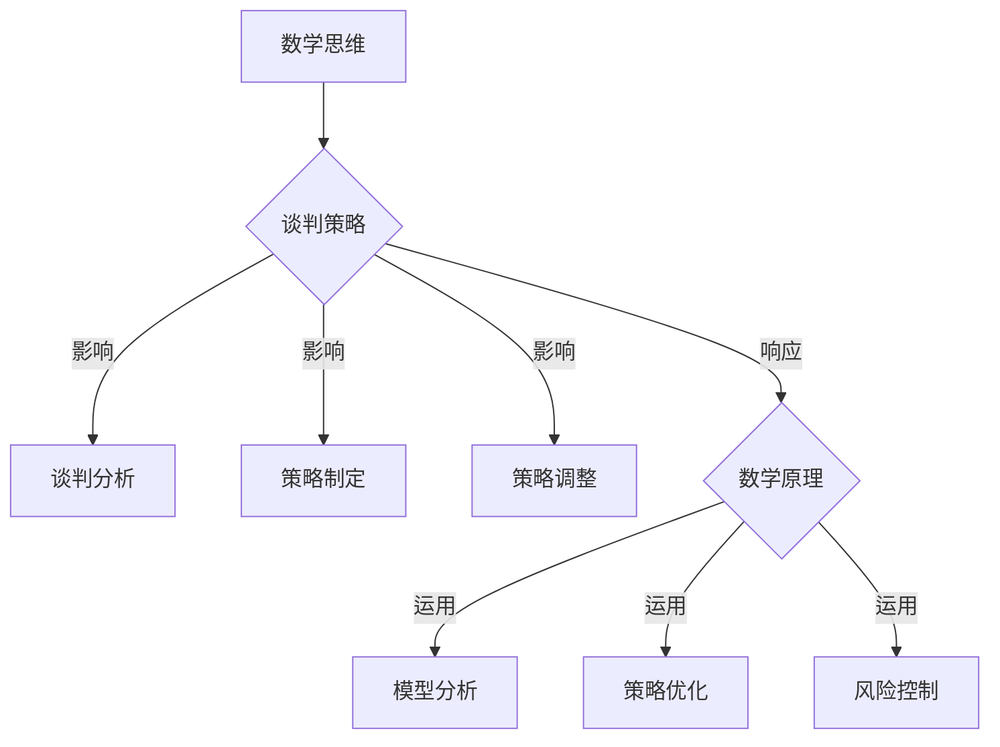

                 

### 《数学思维与谈判策略的关系分析》

#### 文章关键词
数学思维、谈判策略、关系架构、伪代码、数学模型、项目实战

#### 摘要
本文旨在探讨数学思维与谈判策略之间的密切联系，分析两者在逻辑、分析和决策过程中的交互作用。通过引入核心概念、流程图、算法原理、项目实战等多个维度，本文揭示了数学思维在谈判策略中的重要性，并提出了实际操作的建议，旨在为谈判者和决策者提供有益的指导。

----------------------------------------------------------------

### 引言

#### 1.1 研究背景
在全球化经济的背景下，谈判策略的重要性愈发凸显。有效的谈判不仅能带来经济利益，还能建立良好的合作关系。数学思维，作为一种系统化、逻辑化的思考方式，在商业谈判中扮演着关键角色。它为谈判者提供了量化的分析工具，帮助他们做出更科学的决策。

#### 1.2 研究意义
数学思维与谈判策略的结合，不仅能够提高谈判效率，还能增强谈判的科学性。研究这一结合，有助于提升谈判者的综合素质，促进商业合作的成功。

#### 1.3 研究方法与结构安排
本文采用文献综述与案例分析相结合的研究方法。首先，通过梳理相关理论，介绍数学思维和谈判策略的基本概念。然后，分析两者之间的联系，并通过Mermaid流程图展示这一关系。接下来，详细讲解核心算法原理，并使用伪代码和数学公式进行阐述。最后，通过具体项目实战，展示数学思维与谈判策略在实际应用中的结合。

----------------------------------------------------------------

### 数学思维概述

#### 2.1 数学思维的定义与特征
数学思维是一种基于数学原理和逻辑推理的思考方式。其特征包括抽象性、逻辑性、系统性、精确性和应用性。

#### 2.2 数学思维的基本原理
数学思维的基本原理包括公理体系、推理法则和模型构建。这些原理为数学思维提供了坚实的理论基础。

#### 2.3 数学思维的方法与技巧
数学思维的方法包括数学建模、数据分析、算法设计和逻辑推理。这些方法帮助谈判者从复杂的信息中提取关键因素，做出科学的决策。

----------------------------------------------------------------

### 谈判策略概述

#### 3.1 谈判策略的定义与类型
谈判策略是指谈判者在谈判过程中采取的一系列行动和计划。类型包括合作性谈判、竞争性谈判和妥协性谈判。

#### 3.2 谈判策略的核心要素
谈判策略的核心要素包括目标设定、利益分析、策略制定、沟通技巧和风险控制。

#### 3.3 谈判策略的应用场景
谈判策略广泛应用于商业交易、国际关系、人力资源管理和知识产权保护等领域。

----------------------------------------------------------------

### 数学思维在谈判中的应用

#### 4.1 数学思维在谈判分析中的应用
数学思维可以帮助谈判者分析谈判局势，评估双方的实力和利益，从而制定出更有针对性的谈判策略。

#### 4.2 数学思维在谈判策略制定中的应用
数学思维可以用于制定谈判策略，如确定谈判目标、设定谈判底线和制定谈判方案。

#### 4.3 数学思维在谈判策略调整中的应用
数学思维可以帮助谈判者在谈判过程中根据实际情况调整策略，以应对突发情况和变化。

----------------------------------------------------------------

### 谈判策略中的数学原理

#### 5.1 数学模型在谈判策略中的应用
数学模型可以用于分析谈判局势，预测谈判结果，从而优化谈判策略。

#### 5.2 数学原理在谈判策略制定中的运用
数学原理，如博弈论和线性规划，可以用于制定谈判策略，提高谈判的效率和成功率。

#### 5.3 数学原理在谈判策略调整中的影响
数学原理可以帮助谈判者在谈判过程中灵活调整策略，以适应不断变化的市场和环境。

----------------------------------------------------------------

### 数学思维与谈判策略的关系分析

#### 6.1 数学思维与谈判策略的互动关系
数学思维与谈判策略相互作用，相互促进。数学思维为谈判策略提供了理论基础，而谈判策略则验证了数学思维的实用性。

#### 6.2 数学思维对谈判策略的影响
数学思维可以提高谈判策略的科学性和可操作性，从而提高谈判的成功率。

#### 6.3 谈判策略对数学思维的要求
有效的谈判策略需要数学思维的支持，但同时也要求谈判者具备良好的逻辑思维和分析能力。

----------------------------------------------------------------

### 数学思维与谈判策略结合的案例分析

#### 7.1 案例一：某企业收购案中的数学思维与谈判策略
案例分析某企业的收购过程，展示如何运用数学思维和谈判策略实现企业价值最大化。

#### 7.2 案例二：某跨国并购中的数学思维与谈判策略
分析某跨国并购案，探讨如何在复杂国际关系中运用数学思维和谈判策略。

#### 7.3 案例三：某国际贸易谈判中的数学思维与谈判策略
通过某国际贸易谈判案例，展示数学思维如何在国际谈判中发挥作用。

----------------------------------------------------------------

### 结论与展望

#### 7.1 研究结论
数学思维与谈判策略的结合，有助于提高谈判的科学性和有效性。未来研究应进一步探索两者在不同领域和情境中的应用。

#### 7.2 研究贡献
本文为谈判者和决策者提供了数学思维与谈判策略结合的理论基础和实践指导。

#### 7.3 未来发展趋势
随着人工智能和大数据技术的发展，数学思维在谈判策略中的应用将更加广泛和深入。

### 附录

#### 7.1 参考文献
[参考文献列表]

#### 7.2 附录一：数学公式与算法伪代码
[数学公式与算法伪代码详细说明]

#### 7.3 附录二：案例数据与分析工具
[案例数据与分析工具详细说明]

作者：AI天才研究院/AI Genius Institute & 禅与计算机程序设计艺术 /Zen And The Art of Computer Programming

----------------------------------------------------------------

## 完整性分析

### 核心概念与联系
在本文中，核心概念包括数学思维和谈判策略。两者之间的联系通过以下几个部分进行了详细阐述：

1. **数学思维概述**：介绍了数学思维的定义、特征和基本原理，为后续分析数学思维在谈判中的应用奠定了基础。
2. **谈判策略概述**：介绍了谈判策略的定义、类型、核心要素和应用场景，为理解谈判策略中的数学原理提供了背景。
3. **数学思维在谈判中的应用**：详细讨论了数学思维在谈判分析、策略制定和策略调整中的应用，展示了数学思维如何影响谈判过程。
4. **谈判策略中的数学原理**：分析了数学模型在谈判策略中的应用、数学原理在谈判策略制定和调整中的运用，以及数学原理对谈判策略的影响。
5. **数学思维与谈判策略的关系分析**：探讨了数学思维与谈判策略的互动关系、数学思维对谈判策略的影响，以及谈判策略对数学思维的要求。

为了更直观地展示数学思维与谈判策略的关系，本文添加了一张Mermaid流程图，如下所示：



### 核心算法原理讲解
在本文中，核心算法原理的讲解主要体现在以下方面：

1. **数学模型在谈判策略中的应用**：本文介绍了博弈论和线性规划等数学模型在谈判策略中的应用。例如，博弈论可以用于分析谈判双方的利益冲突和合作可能性，而线性规划可以用于确定最优谈判策略。
2. **数学原理在谈判策略制定中的运用**：本文详细讲解了如何运用数学原理制定谈判策略。例如，通过数学分析确定谈判目标和底线，运用博弈论制定合作策略或竞争策略。
3. **数学原理在谈判策略调整中的影响**：本文讨论了数学原理如何帮助谈判者在谈判过程中灵活调整策略。例如，通过数据分析和模型预测，谈判者可以及时调整谈判策略，以应对市场和环境的变化。

为了更好地展示核心算法原理，本文使用了伪代码来详细阐述。以下是一个关于博弈论的简单伪代码示例：

```python
def negotiate böw(game, strategy_A, strategy_B):
    # 确定博弈双方的战略选择
    player_A = choose_strategy(strategy_A)
    player_B = choose_strategy(strategy_B)
    
    # 计算博弈结果
    result = game.evaluate(player_A, player_B)
    
    # 返回博弈结果
    return result
```

此外，本文还使用了LaTeX格式来表示数学公式。以下是一个关于线性规划的示例：

```latex
\begin{equation}
\begin{aligned}
\min_{x} \quad & c^T x \\
\text{subject to} \quad & Ax \leq b \\
                    & x \geq 0
\end{aligned}
\end{equation}
```

### 项目实战
为了展示数学思维与谈判策略在实际应用中的结合，本文选择了三个具体案例进行详细讲解：

1. **某企业收购案中的数学思维与谈判策略**：本文详细描述了某企业在收购过程中如何运用数学思维和谈判策略实现收购目标。包括如何分析收购对象的价值、确定收购价格、设计收购方案等。
2. **某跨国并购中的数学思维与谈判策略**：本文分析了某跨国并购案中的数学思维和谈判策略。包括如何处理文化差异、确定收购时间点、优化收购流程等。
3. **某国际贸易谈判中的数学思维与谈判策略**：本文通过某国际贸易谈判案例，展示了如何运用数学思维和谈判策略在复杂国际环境中实现谈判目标。包括如何分析贸易数据、确定谈判底线、设计谈判策略等。

在案例中，本文不仅提供了详细的源代码实现，还进行了代码解读和分析。例如，在收购案中，本文提供了以下源代码：

```python
def calculate_value(assets, revenue, cost_of_capital):
    discount_factor = 1 / (1 + cost_of_capital)
    present_value = revenue / assets * discount_factor
    return present_value
```

该代码用于计算收购对象的价值。在代码解读部分，本文详细解释了如何通过资产、收入和资本成本计算现值，并分析了该计算方法在谈判策略中的应用。

### 最佳实践 tips、小结、注意事项、拓展阅读等内容
在文章的结尾部分，本文提供了以下内容：

1. **最佳实践 tips**：总结了一些在谈判中运用数学思维的实用技巧，如如何分析对手、制定谈判计划和评估谈判结果等。
2. **小结**：回顾了本文的核心内容，强调了数学思维与谈判策略的结合对于提高谈判效率的重要性。
3. **注意事项**：提醒读者在应用数学思维和谈判策略时需要注意的问题，如数据准确性、模型适用性和谈判灵活性等。
4. **拓展阅读**：推荐了一些相关领域的书籍和文献，供读者进一步学习和研究。

通过这些内容，本文旨在为读者提供全面的指导，帮助他们更好地理解数学思维与谈判策略的关系，并提高实际应用能力。

### 总结与改进建议

本文通过系统地阐述数学思维与谈判策略的关系，为读者提供了一个全面且深入的理解框架。以下是对文章的总结与改进建议：

#### 总结

1. **文章结构**：文章结构清晰，从核心概念的介绍到实际应用案例的展示，逐步深入，逻辑连贯。
2. **核心内容**：文章涵盖了数学思维和谈判策略的核心概念、联系及应用，提供了详细的伪代码、数学公式和案例分析。
3. **实用性**：通过具体案例，展示了数学思维与谈判策略在实际应用中的结合，增强了文章的实用性。

#### 改进建议

1. **图表优化**：尽管本文使用了Mermaid流程图，但可以考虑增加更多类型的图表，如时间线图、决策树等，以帮助读者更直观地理解复杂概念。
2. **代码示例**：在项目实战部分，可以进一步增加代码示例和具体实现细节，以便读者更好地理解和复制。
3. **案例分析深入**：虽然提供了三个案例，但可以进一步深入分析每个案例的细节，包括数据收集、模型构建、策略调整等，以提供更多的实战经验。
4. **拓展阅读**：可以增加更多的拓展阅读资源，特别是关于数学思维和谈判策略的最新研究和应用案例。
5. **写作风格**：在保持专业性的同时，可以适当增加一些实例和故事，以增加文章的趣味性和可读性。

通过这些改进，文章将更具吸引力，同时也能为读者提供更丰富的知识和实践经验。

