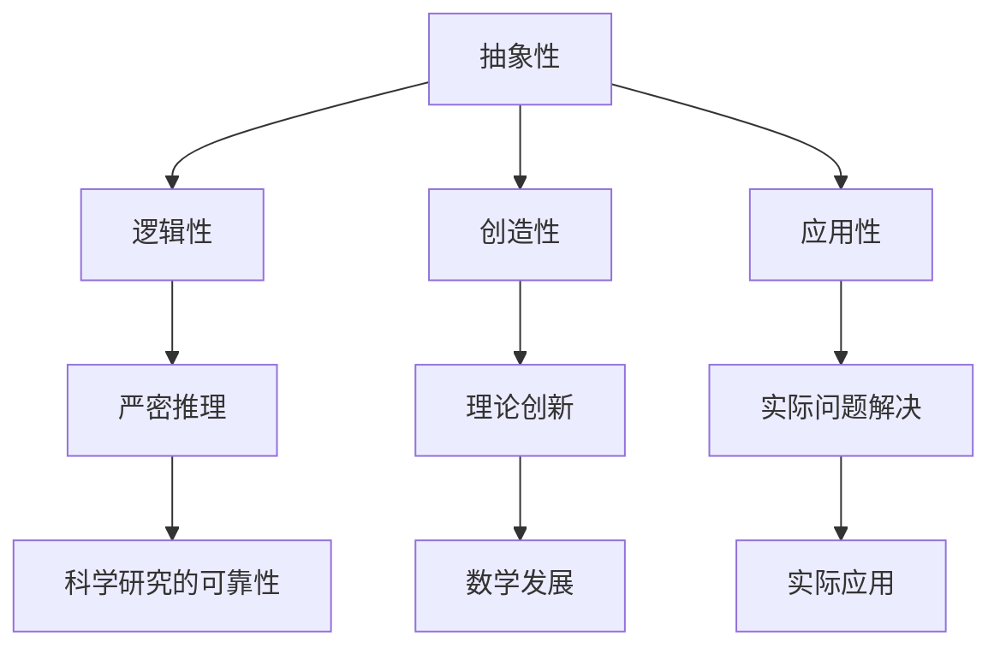
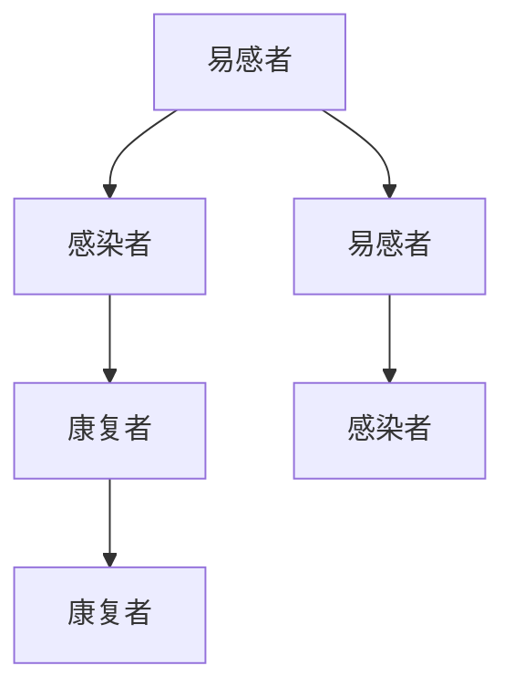
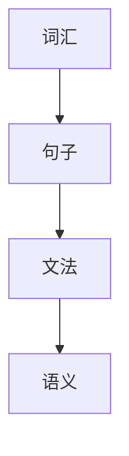

                 

### 引言

在当今这个快速变化的世界，数学思维和问题解决能力已成为人们不可或缺的核心技能。无论是在科学研究中、工程实践中，还是在日常生活中，数学思维都发挥着关键作用。它不仅帮助人们理解复杂的现象，还提供了有效解决问题的方法。

#### 背景介绍

数学思维可以追溯到古代，当时人类就开始使用简单的数学工具来解决实际问题。随着历史的发展，数学逐渐演变成一种系统化的科学，形成了现代数学的基础。在这个过程中，数学家们不仅发现了许多新的数学理论，还开发了各种解决问题的方法。例如，欧几里得的《几何原本》为几何学奠定了基础，牛顿和莱布尼茨的微积分理论为物理学和工程学提供了强大的工具。

#### 核心概念与联系

数学思维的核心概念包括抽象性、逻辑性、创造性和应用性。这些概念之间相互关联，构成了数学思维的完整体系。抽象性使得数学能够从具体问题中提取出一般性原理；逻辑性保证了数学推理的严密性；创造性促进了数学理论的发展；应用性则将数学知识应用于实际问题中。



#### 数学思维在解决问题中的应用

数学思维在解决问题中的应用广泛而深远。以下是几个典型的应用场景：

- **问题建模**：在解决实际问题时，首先需要将问题转化为数学模型。数学模型可以帮助我们更清晰地理解问题，并找到解决方案。例如，在物理学中，牛顿的运动定律就是一种将物理现象转化为数学模型的方法。

- **问题分析**：建立数学模型后，需要利用数学思维对模型进行分析，寻找问题的解决方案。这包括对数学性质的研究、数学关系的推导和数学公式的应用。

- **问题验证**：在得到解决方案后，需要验证其正确性。数学思维通过逻辑推理和证明，确保解决方案的可靠性。

- **问题拓展**：数学思维还要求能够将问题进行拓展，探索更广泛的应用场景。这种拓展能力不仅增加了数学问题的深度，也促进了数学理论的发展。

#### 数学思维的重要性

数学思维的重要性体现在多个方面：

- **科学研究的推动力**：数学思维为科学研究提供了强有力的工具。许多科学发现都是通过数学建模和数学分析得到的。

- **工程实践的指导**：在工程实践中，数学思维帮助工程师设计和优化各种系统。无论是建筑设计、电路设计，还是数据分析，数学思维都是不可或缺的。

- **日常生活的影响**：在日常生活中，数学思维也无处不在。从预算管理到时间规划，数学思维帮助我们做出更明智的决策。

- **创新能力的提升**：数学思维培养了人们的创造性思维，促进了科学技术的发展。

### 文章摘要

本文探讨了数学思维的概念与重要性，阐述了数学思维在解决问题中的应用，并提出了培养数学思维的途径。数学思维作为一种抽象性、逻辑性、创造性和应用性的思维方式，在科学研究中、工程实践中以及日常生活中都发挥着关键作用。通过本文，读者可以更好地理解数学思维的核心概念，掌握数学思维在解决问题中的应用，从而提升自身的数学思维和问题解决能力。

---

接下来，我们将深入探讨数学思维的基本特征，以及它们如何帮助我们在实际问题中找到解决方案。### 数学思维的基本特征

数学思维是一种系统化的思维方式，它具有以下几个基本特征：

#### 1. 抽象性

数学思维首先强调的是抽象性。抽象性是指从具体事物中提取出共性的、一般性的概念和原理。在数学中，这种抽象过程体现在对数字、图形、公式等抽象对象的定义和使用。例如，当我们研究三角形时，我们不仅关注具体的三角形，而是抽象出三角形的基本性质，如三边关系、内角和等。这种抽象性使得数学能够跨越具体的实例，适用于更广泛的问题。

**抽象性的作用**：

- **简化问题**：通过抽象，我们可以将复杂的问题简化为更易于处理的形式。例如，在解决线性方程组时，我们可以将实际问题抽象为代数方程，从而简化计算过程。

- **普遍性**：抽象出的数学概念和原理具有普遍性，它们不仅适用于当前的问题，也适用于未来可能遇到的类似问题。例如，微积分理论不仅适用于物理学，也广泛应用于经济学、生物学等领域。

**具体例子**：

- **从具体三角形到一般三角形**：在解决具体的三角形问题时，我们可以从具体的三边和三个角出发，通过抽象得到三角形的一般性质，如内角和为180度，任意两边之和大于第三边等。

#### 2. 逻辑性

数学思维高度依赖逻辑性。逻辑性是指按照一定的规则和原理进行推理，从已知事实推导出新的结论。在数学中，逻辑性体现在公理、定理、定义等基础概念中。例如，欧几里得的《几何原本》就是基于公理系统构建的，它通过逻辑推理证明了各种几何定理。

**逻辑性的作用**：

- **确保推理的严密性**：逻辑性确保了推理过程的正确性，使得数学结论具有可靠性和普遍性。例如，在证明几何定理时，必须通过一系列的逻辑推导来确保结论的正确性。

- **提供解决问题的方法**：逻辑性为解决问题提供了系统的、可操作的方法。例如，在解决数学问题时，我们可以通过定义、定理和公理进行逻辑推导，找到问题的解决方案。

**具体例子**：

- **证明三角形的内角和**：在欧几里得的《几何原本》中，通过逻辑推理，我们证明了任意三角形的内角和为180度。这一结论不仅适用于具体的三角形，也适用于所有三角形。

#### 3. 创造性

数学思维具有很强的创造性。创造性是指能够从现有知识中发现新的关系、提出新的问题、发明新的方法。在数学的发展过程中，许多伟大的数学家都展示了非凡的创造力。例如，哥德巴赫猜想和费马大定理就是两个具有挑战性的数学问题，它们激励了无数数学家进行了长期的探索和研究。

**创造性的作用**：

- **推动数学理论的发展**：创造性促进了数学理论的发展，使得数学能够不断拓展其研究领域和深度。例如，伽利略和牛顿的创造发明了微积分，这一数学工具不仅改变了物理学，也对整个科学产生了深远影响。

- **解决复杂问题**：创造性思维帮助数学家解决复杂的问题，发现新的数学规律。例如，在解决混沌理论中的问题时，数学家们提出了新的数学模型和算法，从而揭示了复杂的系统行为。

**具体例子**：

- **微积分的创造**：牛顿和莱布尼茨分别独立发明了微积分，这一数学工具使得我们能够解决运动和变化问题，从而推动了物理学和工程学的发展。

#### 4. 应用性

数学思维具有很强的应用性。应用性是指将数学概念、原理和方法应用于实际问题中，解决实际问题。数学不仅在理论研究中发挥着重要作用，也在工程实践、经济学、生物学等多个领域得到广泛应用。

**应用性的作用**：

- **促进科学技术的发展**：数学的应用性促进了科学技术的发展。例如，计算机科学中的算法和算法分析、工程学中的结构设计和优化、生物学中的建模和数据分析，都离不开数学的应用。

- **提高决策能力**：数学思维帮助人们提高决策能力。在商业、金融、管理等领域，数学模型和算法被广泛用于预测市场趋势、评估风险和优化资源。

**具体例子**：

- **经济学中的数学模型**：在经济学中，数学模型被广泛应用于市场预测、经济分析和政策制定。例如，供给与需求模型、消费函数模型等，这些模型帮助经济学家理解经济现象和制定政策。

#### 小结

数学思维的基本特征包括抽象性、逻辑性、创造性和应用性。这些特征相互补充，共同构成了数学思维的完整体系。抽象性使我们能够简化问题、提取共性；逻辑性确保了推理的严密性；创造性推动了数学理论的发展；应用性将数学知识应用于实际问题中，解决实际问题。通过这些特征，数学思维在科学研究和工程实践中发挥了关键作用。

接下来，我们将进一步探讨数学思维在各个学科和领域中的应用，以及如何培养和提升这种思维方式。### 数学思维在各个学科和领域中的应用

数学思维作为一种系统化的思维方式，不仅限于数学本身，它在多个学科和领域中也发挥着重要作用。以下是一些具体的应用实例：

#### 1. 科学研究中的应用

在科学研究中，数学思维被广泛应用于建模、分析、预测和理论证明。以下是一些典型的应用：

- **物理学**：物理学中，数学思维被用来建立物理模型，例如经典力学中的牛顿运动定律、电磁学中的麦克斯韦方程组等。这些数学模型帮助我们理解物理现象，预测物体的运动和行为。

- **生物学**：在生物学研究中，数学思维被用来分析生物数据、构建生态模型和模拟生物系统。例如，在流行病学中，使用数学模型来预测传染病的传播速度和控制策略。

- **化学**：化学中的化学平衡、反应动力学等问题都依赖于数学思维。通过数学建模，我们可以预测化学反应的速率、平衡状态和反应路径。

**示例**：

- **流体力学**：在流体力学中，纳维-斯托克斯方程是一个关键的数学模型，它描述了流体运动的规律。通过求解这些方程，我们可以预测流体在管道中的流动情况，从而设计更高效的泵和管道系统。

#### 2. 工程实践中的应用

在工程实践中，数学思维被广泛应用于设计、分析、优化和控制系统。以下是一些典型的应用：

- **建筑与土木工程**：在建筑设计中，数学思维被用来计算结构的强度、稳定性，优化材料的利用。例如，通过有限元分析，工程师可以评估建筑结构的应力分布，确保其安全性。

- **机械工程**：机械设计中的机械运动、动力学问题都需要数学思维。例如，在汽车设计中，使用数学模型来模拟汽车的动力学行为，优化悬挂系统和驱动系统。

- **电子工程**：电子工程中，数学思维被用来分析和设计电路、信号处理系统和通信系统。例如，通过傅里叶变换，我们可以分析信号的频谱特性，优化信号传输和滤波器设计。

**示例**：

- **结构优化**：在建筑结构设计中，使用数学优化方法（如线性规划和非线性优化）来寻找最佳的材料布局，以最大化结构的强度和稳定性，同时最小化材料成本。

#### 3. 经济学中的应用

在经济学中，数学思维被用来建模市场行为、预测经济趋势和制定政策。以下是一些典型的应用：

- **经济学模型**：在经济学中，许多问题都可以通过数学模型来解决。例如，供需模型、消费函数模型和经济增长模型等，这些模型帮助我们理解市场机制和制定经济政策。

- **金融工程**：金融工程中，数学思维被用来设计金融产品、评估风险和进行资产定价。例如，使用期权定价模型（如布莱克-斯科尔斯模型），我们可以计算金融衍生品的价值和风险。

**示例**：

- **资产定价**：在金融市场中，布莱克-斯科尔斯模型被用来计算金融衍生品的定价。通过这个模型，投资者可以评估投资组合的风险和回报，从而做出更明智的投资决策。

#### 4. 计算机科学中的应用

在计算机科学中，数学思维被广泛应用于算法设计、数据结构和密码学。以下是一些典型的应用：

- **算法设计**：计算机科学中的许多问题都可以通过数学方法来解决。例如，排序算法、搜索算法和图算法等，这些算法都是基于数学原理设计的。

- **密码学**：密码学中，数学思维被用来设计加密算法和数字签名。例如，RSA加密算法就是一种基于数学难题的加密方法，它确保了数据传输的安全性。

**示例**：

- **加密算法**：RSA加密算法是一种常用的公钥加密算法。它基于大整数分解的数学难题，通过数学方法确保了数据在传输过程中的安全性。

#### 小结

数学思维在多个学科和领域中的应用广泛而深远。从科学研究中的模型建立和理论证明，到工程实践中的设计优化和控制系统，再到经济学中的市场预测和政策制定，数学思维都发挥着关键作用。通过这些应用实例，我们可以看到数学思维不仅是一种抽象的思维方式，更是一种具有实际应用价值的重要工具。通过掌握数学思维，我们能够在各个领域中更好地理解复杂现象、解决问题和推动创新。

接下来，我们将探讨如何培养和提升数学思维，以便在实际问题中更加有效地应用这种思维方式。### 数学思维的培养方法

数学思维不是与生俱来的，而是通过系统的教育和实践逐步培养起来的。以下是一些有效的培养方法，可以帮助学生和专业人士提升数学思维和问题解决能力。

#### 1. 强化基础知识

数学思维的培养需要建立在扎实的数学基础知识之上。基础知识包括数学概念、定理、公式和基本的运算技能。以下是一些具体措施：

- **学习数学概念**：深入理解数学概念，如函数、微积分、线性代数等。这有助于建立数学思维的框架。

- **掌握基本定理和公式**：熟练掌握常见的数学定理和公式，如勾股定理、欧拉公式、洛必达法则等。这些定理和公式是解决数学问题的重要工具。

- **练习基本运算**：提高基本的算术运算能力，包括加减乘除、分数、小数和百分数的计算。这些基本技能是解决更复杂问题的基石。

#### 2. 培养逻辑思维能力

逻辑思维是数学思维的核心。以下是一些培养逻辑思维的方法：

- **练习逻辑推理**：通过解决逻辑谜题、数学难题和逻辑推理题，培养逻辑思维能力。例如，解逻辑方程、证明几何定理、分析逻辑命题等。

- **学习逻辑学知识**：了解逻辑学的基本原理，如命题逻辑、谓词逻辑和形式逻辑。这有助于我们更好地理解数学推理的严谨性。

- **阅读逻辑学书籍**：推荐一些经典的逻辑学书籍，如《逻辑哲学》等，这些书籍可以帮助我们深入理解逻辑思维。

#### 3. 增强抽象能力

数学思维具有很强的抽象性。以下是一些增强抽象能力的方法：

- **学习抽象思维技巧**：通过学习抽象思维的方法，如符号化、模型构建和抽象算法等，提高抽象能力。

- **解决抽象问题**：尝试解决一些高度抽象的数学问题，如抽象代数、抽象几何等。这有助于锻炼我们的抽象思维能力。

- **参与数学竞赛**：参加数学竞赛可以挑战我们的抽象思维能力。例如，美国数学竞赛（AMC）和国际数学竞赛（IMC）等都是很好的锻炼平台。

#### 4. 提高创造性思维

创造性思维是数学思维的重要组成部分。以下是一些提高创造性思维的方法：

- **培养好奇心和探究精神**：鼓励学生和专业人士保持好奇心，勇于提出问题和挑战现有的理论。

- **开展数学研究**：参与数学研究项目，如数学建模、数学探究等，可以锻炼我们的创造性思维。

- **进行数学实验**：通过数学实验，我们可以发现新的数学规律和问题。例如，使用计算工具进行数值模拟和数据分析。

#### 5. 加强应用实践

数学思维的应用能力是解决实际问题的关键。以下是一些加强应用实践的方法：

- **学习应用案例**：研究数学在各个领域的应用案例，了解数学思维在具体问题中的应用。

- **参与项目实践**：参与实际的数学项目，如数学建模竞赛、科研项目等，将数学知识应用于实际问题中。

- **编写数学软件**：通过编写数学软件，如数学工具包、模拟器等，将数学概念和方法转化为具体的工具。

#### 6. 开展数学讨论和交流

数学讨论和交流是提升数学思维的重要途径。以下是一些具体方法：

- **加入数学社区**：加入数学论坛、微信群等数学社区，与其他数学爱好者交流想法和经验。

- **参与学术会议**：参加数学学术会议，听取专家的报告，了解数学领域的最新进展。

- **组织数学讲座**：组织数学讲座或研讨会，与同行分享数学知识和经验。

#### 小结

数学思维的培养需要系统的教育和实践。通过强化基础知识、培养逻辑思维能力、增强抽象能力、提高创造性思维、加强应用实践以及开展数学讨论和交流，我们可以逐步提升数学思维和问题解决能力。掌握这些培养方法，不仅有助于我们在学术研究中取得突破，更能在实际工作中更好地应对复杂问题，推动科技创新。

### 案例研究：数学思维在工程项目中的应用

为了更好地理解数学思维在工程项目中的应用，我们可以通过一个具体的案例来进行分析和讨论。

#### 案例背景

某工程公司计划建造一座跨度为200米的大桥，该公司希望确保桥梁的设计能够承受未来可能的自然灾害，如地震和风暴。为了实现这一目标，他们需要利用数学思维进行结构分析和优化设计。

#### 问题分析

1. **结构稳定性分析**：

   首先，需要建立桥梁结构的数学模型，分析其在各种载荷（如自重、风力、地震等）作用下的稳定性。数学模型包括梁、板、柱等基本结构元素的力学特性，以及它们之间的相互作用。

2. **应力分布分析**：

   其次，需要分析桥梁在不同载荷下的应力分布，确保结构不会发生过度变形或破坏。这涉及到弹性力学和塑性力学的知识，以及求解偏微分方程的技巧。

3. **地震响应分析**：

   地震对桥梁结构的影响尤为重要。需要利用数学模型模拟地震波在桥梁中的传播，分析地震引起的结构响应，并评估桥梁的抗震能力。这可能涉及到地震动力学、波动方程的求解等数学问题。

#### 数学方法

1. **有限元分析**：

   使用有限元方法（FEM）建立桥梁的数学模型，将桥梁划分为许多小的元素（如梁单元、板单元等）。通过求解有限元方程，可以得到桥梁在各种载荷作用下的变形和应力分布。

   ```pseudo
   // 伪代码：有限元方法求解
   function finite_element_analysis(model, loads):
       assemble_equations(model)
       solve_equations(model)
       calculate_deformations(model)
       calculate_stresses(model)
       return model
   ```

2. **波动方程求解**：

   利用波动方程模拟地震波在桥梁中的传播。波动方程是一个偏微分方程，可以通过数值方法（如有限差分法、有限元法等）求解。

   ```pseudo
   // 伪代码：波动方程求解
   function wave_equation_solver(velocity, stress):
       solve_partial_differential_equation(velocity, stress)
       calculate_wave_propagation(velocity)
       return velocity, stress
   ```

3. **优化设计**：

   使用优化算法（如遗传算法、模拟退火等）对桥梁结构进行优化设计，以找到最佳的结构方案，确保桥梁的强度和稳定性。优化目标可以是材料使用最小化、结构重量最小化等。

   ```pseudo
   // 伪代码：优化设计
   function optimize_design(model, objectives):
       set_objectives(objectives)
       apply_optimization_algorithm(model)
       return optimized_model
   ```

#### 实际案例解析

以某实际桥梁工程为例，该公司使用上述数学方法进行结构分析和优化设计。通过有限元分析，他们得到了桥梁在不同载荷作用下的变形和应力分布。通过波动方程求解，他们分析了地震对桥梁的影响，并评估了桥梁的抗震能力。最后，通过优化设计，他们找到了一种最佳的桥梁结构方案，既确保了桥梁的强度和稳定性，又最大限度地减少了材料使用和结构重量。

#### 小结

通过这个案例，我们可以看到数学思维在工程项目中的应用。从问题分析、数学建模到求解算法和优化设计，数学思维为工程项目的成功提供了强有力的支持。掌握数学思维，不仅能够提高我们的分析和解决问题的能力，还能推动工程技术的创新和发展。

### 数学思维与人工智能的关系

数学思维与人工智能（AI）之间存在着紧密的联系。数学为AI提供了理论基础和工具，使得AI能够在复杂问题中找到解决方案。以下是一些关键的数学概念和算法在人工智能中的应用：

#### 1. 线性代数在机器学习中的应用

线性代数是机器学习的基础，它在数据分析和模型构建中起着关键作用。以下是一些具体的例子：

- **数据预处理**：线性代数中的矩阵运算被用于数据标准化和特征提取。例如，主成分分析（PCA）使用矩阵分解来识别数据的主要变异方向，从而减少数据维度。

- **模型优化**：在机器学习算法中，如线性回归和逻辑回归，线性代数被用于求解最优参数。例如，梯度下降算法使用矩阵求导和矩阵乘法来更新模型参数，以最小化损失函数。

- **神经网络**：在深度学习中，线性代数被用于构建和优化神经网络。神经网络中的权重和偏置被视为矩阵，通过矩阵运算（如矩阵乘法和矩阵求导）来更新网络参数，提高模型的性能。

```latex
// 矩阵运算：神经网络权重更新
\frac{\partial J}{\partial W} = \Delta W = -\alpha \cdot (X\cdot\Delta Z)
```

其中，\(J\) 是损失函数，\(W\) 是权重矩阵，\(X\) 是输入矩阵，\(\Delta Z\) 是误差信号。

#### 2. 概率论与统计学在机器学习中的应用

概率论和统计学为机器学习提供了理论基础，帮助我们在不确定环境中进行决策。以下是一些具体的例子：

- **概率分布**：在贝叶斯推理中，概率分布用于表示数据的不确定性。例如，高斯分布（正态分布）被广泛用于处理连续数据。

- **最大似然估计**：在参数估计中，最大似然估计是一种基于概率的估计方法，用于寻找最有可能产生观测数据的参数值。

- **支持向量机（SVM）**：SVM是一种分类算法，它使用核函数将数据映射到高维空间，通过最大化边际来分类数据。核函数的设计基于概率论和统计学原理。

```latex
// 概率分布：高斯分布
f(x|\mu, \sigma^2) = \frac{1}{\sqrt{2\pi\sigma^2}} e^{-\frac{(x-\mu)^2}{2\sigma^2}}
```

其中，\(f(x|\mu, \sigma^2)\) 是高斯分布的概率密度函数，\(\mu\) 是均值，\(\sigma^2\) 是方差。

#### 3. 图论在社交网络分析中的应用

图论在社交网络分析中发挥着重要作用，帮助我们理解用户之间的关系和传播现象。以下是一些具体的例子：

- **网络分析**：图论用于分析社交网络中的连接结构，如社区检测、中心性分析等。通过计算节点之间的路径长度和连通性，我们可以了解网络的拓扑特性。

- **传播模型**：在传播动力学中，图论用于模拟信息在社交网络中的传播过程。例如，SIR模型（易感者-感染者-康复者模型）使用图论描述信息在社交网络中的传播路径。



#### 4. 集合论在人工智能中的抽象表示

集合论为人工智能提供了抽象表示的框架，帮助我们理解和处理复杂系统。以下是一些具体的例子：

- **数据结构**：集合论用于定义和操作各种数据结构，如集合、图、树等。这些数据结构在算法设计中起着基础作用。

- **形式语言**：集合论用于定义形式语言和文法，帮助我们构建和解析复杂的语法结构。例如，在自然语言处理（NLP）中，集合论用于定义词汇和句子结构。



#### 小结

数学思维为人工智能提供了丰富的理论基础和工具，使得AI能够在复杂环境中进行有效的学习和决策。从线性代数、概率论到图论和集合论，数学概念和算法在AI的各个领域中都发挥着关键作用。通过掌握数学思维，我们能够更好地理解和应用人工智能，推动科技的发展。

### 数学思维在计算机编程中的应用

数学思维在计算机编程中起着至关重要的作用。它不仅帮助我们编写高效的代码，还能解决复杂的问题。以下将详细讨论数学思维在计算机编程中的应用，包括常见的数学工具和算法。

#### 1. 数学工具在编程中的应用

**1.1 线性代数**

线性代数在计算机编程中的应用非常广泛，特别是在图形处理、机器学习和科学计算领域。以下是一些具体的例子：

- **图形处理**：在图形处理中，矩阵运算被用于变换和渲染图像。例如，2D和3D图形的平移、旋转和缩放都可以通过矩阵乘法实现。
  ```python
  # 伪代码：2D图形旋转
  def rotate_2d_point(point, angle):
      rotation_matrix = [[cos(angle), -sin(angle)],
                         [sin(angle), cos(angle)]]
      rotated_point = matrix_multiply(rotation_matrix, point)
      return rotated_point
  ```

- **机器学习**：在机器学习中，线性代数被用于处理数据和高维空间。例如，主成分分析（PCA）通过线性代数方法降低数据维度。
  ```python
  # 伪代码：PCA降维
  def pca(data):
      mean = np.mean(data, axis=0)
      covariance_matrix = np.cov(data - mean)
      eigenvalues, eigenvectors = np.linalg.eig(covariance_matrix)
      return eigenvectors[:k] # 选择前k个主成分
  ```

**1.2 概率论和统计学**

概率论和统计学在计算机编程中用于处理不确定性问题和进行数据分析。以下是一些具体的例子：

- **随机算法**：在算法设计中，随机算法（如随机梯度下降、蒙特卡洛方法等）被用于解决优化问题和概率计算。
  ```python
  # 伪代码：随机梯度下降
  def stochastic_gradient_descent(x, y, learning_rate):
      for i in range(num_iterations):
          random_index = np.random.randint(0, len(x))
          gradient = compute_gradient(x[random_index], y[random_index])
          x -= learning_rate * gradient
      return x
  ```

- **数据可视化**：概率论和统计学用于数据可视化，如直方图、散点图和密度估计等。这些可视化方法帮助我们更好地理解数据分布和关系。
  ```python
  # 伪代码：绘制直方图
  import matplotlib.pyplot as plt
  def plot_histogram(data):
      plt.hist(data, bins=30)
      plt.xlabel('Value')
      plt.ylabel('Frequency')
      plt.show()
  ```

**1.3 图论**

图论在计算机编程中用于处理网络和图结构。以下是一些具体的例子：

- **社交网络分析**：在社交网络分析中，图论用于分析用户之间的连接和传播现象。例如，可以使用图论算法进行社区检测、影响力分析等。
  ```python
  # 伪代码：社区检测
  def community_detection(graph):
      labels = community_detection_algorithm(graph)
      return labels
  ```

- **路由算法**：在计算机网络中，图论被用于路由算法，如最短路径算法（Dijkstra算法、A*算法等），帮助数据包在网络中的高效传输。
  ```python
  # 伪代码：Dijkstra算法
  def dijkstra(graph, start):
      distances = [float('infinity')] * len(graph)
      distances[start] = 0
      visited = [False] * len(graph)
      for _ in range(len(graph)):
          min_distance = float('infinity')
          min_index = None
          for i in range(len(graph)):
              if not visited[i] and distances[i] < min_distance:
                  min_distance = distances[i]
                  min_index = i
          visited[min_index] = True
          for i in range(len(graph)):
              alt = distances[min_index] + graph[min_index][i]
              if alt < distances[i]:
                  distances[i] = alt
      return distances
  ```

#### 2. 数学算法在编程中的应用

**2.1 动态规划**

动态规划是一种用于求解最优子结构问题的算法。以下是一个简单的例子：

- **背包问题**：在背包问题中，给定一组物品和它们的重量和价值，我们需要选择一部分物品放入背包中，使得总价值最大且总重量不超过背包的容量。
  ```python
  # 伪代码：0-1背包问题
  def knapsack(values, weights, capacity):
      n = len(values)
      dp = [[0 for x in range(capacity + 1)] for x in range(n + 1)]
      for i in range(1, n + 1):
          for w in range(1, capacity + 1):
              if weights[i-1] <= w:
                  dp[i][w] = max(dp[i-1][w], dp[i-1][w-weights[i-1]] + values[i-1])
              else:
                  dp[i][w] = dp[i-1][w]
      return dp[n][capacity]
  ```

**2.2 分治算法**

分治算法是一种将问题分解为子问题，然后递归解决子问题的算法。以下是一个简单的例子：

- **快速排序**：快速排序是一种高效的排序算法，它通过递归将数组分解为较小的子数组，然后对子数组进行排序。
  ```python
  # 伪代码：快速排序
  def quicksort(arr):
      if len(arr) <= 1:
          return arr
      pivot = arr[len(arr) // 2]
      left = [x for x in arr if x < pivot]
      middle = [x for x in arr if x == pivot]
      right = [x for x in arr if x > pivot]
      return quicksort(left) + middle + quicksort(right)
  ```

#### 3. 数学思维在编程中的关键作用

数学思维在编程中的关键作用体现在以下几个方面：

- **问题抽象**：通过数学思维，我们可以将复杂的实际问题抽象为数学模型，从而简化问题解决过程。
- **算法优化**：数学思维帮助我们分析算法的时间和空间复杂度，从而优化算法性能。
- **逻辑推理**：数学思维提供了一种严谨的推理方法，使得编程过程中的逻辑更加清晰和可靠。

#### 小结

数学思维在计算机编程中有着广泛而重要的应用。从线性代数、概率论和统计学到图论和优化算法，数学工具和方法不仅帮助我们编写高效的代码，还能解决复杂的问题。通过掌握数学思维，我们可以更好地理解编程的本质，提高编程能力和问题解决能力。

### 数学思维在数据科学中的应用

数学思维在数据科学中发挥着核心作用，帮助数据科学家处理复杂数据、提取有价值的信息并做出准确的预测。以下将详细讨论数学思维在数据科学中的应用，包括常见的数学工具和算法。

#### 1. 统计学在数据科学中的应用

统计学是数据科学的基础，它提供了处理数据和分析结果的方法。以下是一些具体的例子：

**1.1 描述性统计**

描述性统计用于总结和描述数据的基本特征。它包括计算均值、中位数、标准差等统计量。

- **均值和方差**：均值（平均数）描述数据的中心位置，而方差描述数据的离散程度。
  ```latex
  \mu = \frac{1}{n} \sum_{i=1}^{n} x_i
  \sigma^2 = \frac{1}{n} \sum_{i=1}^{n} (x_i - \mu)^2
  ```

- **直方图**：直方图用于可视化数据分布，帮助我们理解数据的分布特征。
  ```python
  import matplotlib.pyplot as plt
  plt.hist(data, bins=30)
  plt.xlabel('Value')
  plt.ylabel('Frequency')
  plt.show()
  ```

**1.2 推断性统计**

推断性统计用于基于样本数据推断总体数据的特征。以下是一些常见的推断性统计方法：

- **t检验**：t检验用于比较两组数据的均值是否存在显著差异。
  ```latex
  t = \frac{\bar{x}_1 - \bar{x}_2 - (\mu_1 - \mu_2)}{\sqrt{\frac{s_1^2}{n_1} + \frac{s_2^2}{n_2}}}
  ```

- **方差分析（ANOVA）**：ANOVA用于比较多个组之间的均值差异。
  ```latex
  F = \frac{MS_{between}}{MS_{within}}
  ```

**1.3 回归分析**

回归分析用于研究变量之间的关系，并建立数学模型进行预测。以下是一些常见的回归分析方法：

- **线性回归**：线性回归用于建立自变量和因变量之间的线性关系模型。
  ```latex
  y = \beta_0 + \beta_1x + \epsilon
  ```

- **多项式回归**：多项式回归用于建立非线性关系模型，通过多项式函数描述变量之间的关系。
  ```latex
  y = \beta_0 + \beta_1x + \beta_2x^2 + \cdots + \beta_nx^n + \epsilon
  ```

#### 2. 线性代数在数据科学中的应用

线性代数在数据科学中的应用非常广泛，特别是在特征提取和降维方面。以下是一些具体的例子：

**2.1 特征提取**

特征提取用于从原始数据中提取出有用的信息，以提高模型性能。以下是一些常见的特征提取方法：

- **主成分分析（PCA）**：PCA通过线性变换将数据投影到新的坐标系中，提取出数据的主要特征。
  ```latex
  Z = PC \lambda
  ```

- **奇异值分解（SVD）**：SVD用于降维和特征提取，特别是在处理大型数据集时非常有效。
  ```latex
  X = U \Sigma V^T
  ```

**2.2 特征选择**

特征选择用于从大量特征中选择出最重要的特征，以简化模型和提高性能。以下是一些常见的特征选择方法：

- **前进选择法**：前进选择法通过逐步添加特征，直到满足特定的终止条件（如模型性能不再提升）。
- **后向选择法**：后向选择法通过逐步移除特征，直到满足特定的终止条件。

#### 3. 概率论和统计学在数据科学中的应用

概率论和统计学在数据科学中的应用广泛，特别是在概率模型和贝叶斯推理方面。以下是一些具体的例子：

**3.1 概率模型**

概率模型用于描述变量之间的概率关系，并用于预测和分类。以下是一些常见的概率模型：

- **贝叶斯分类器**：贝叶斯分类器基于贝叶斯定理，通过计算各类别的概率分布来预测新数据的类别。
  ```latex
  P(C_k|X) = \frac{P(X|C_k)P(C_k)}{P(X)}
  ```

- **马尔可夫模型**：马尔可夫模型用于描述变量之间的转移概率，并在序列数据中广泛应用。

**3.2 贝叶斯推理**

贝叶斯推理是一种基于概率的推理方法，通过不断更新概率分布来处理不确定性问题。以下是一些常见的贝叶斯推理方法：

- **贝叶斯网络**：贝叶斯网络是一种表示变量之间概率关系的图形模型，用于推理和决策。
- **贝叶斯优化**：贝叶斯优化是一种基于贝叶斯推理的优化方法，用于寻找最优参数。

#### 小结

数学思维在数据科学中起着至关重要的作用。从统计学、线性代数到概率论和统计学，数学工具和方法不仅帮助我们处理复杂数据、提取有价值的信息，还能进行准确的预测和决策。通过掌握数学思维，我们可以更好地理解和应用数据科学，推动科技的发展。

### 数学思维在机器学习中的应用

数学思维在机器学习中扮演着至关重要的角色，它不仅为算法提供了理论基础，还帮助优化模型的性能和泛化能力。以下将详细讨论数学思维在机器学习中的应用，包括常用的数学工具和算法。

#### 1. 概率论和统计学基础

概率论和统计学是机器学习的基石，它们为模型的建立和优化提供了关键的理论框架。

**1.1 概率分布**

概率分布描述了变量可能取值的概率分布情况。在机器学习中，常用的概率分布包括高斯分布、伯努利分布等。

- **高斯分布**：高斯分布（正态分布）在回归和分类任务中非常常见，用于建模数据或预测结果的概率。
  ```latex
  f(x|\mu, \sigma^2) = \frac{1}{\sqrt{2\pi\sigma^2}} e^{-\frac{(x-\mu)^2}{2\sigma^2}}
  ```

- **伯努利分布**：伯努利分布用于二分类问题，表示事件发生的概率。
  ```latex
  P(Y=1) = p
  ```

**1.2 概率论中的期望和方差**

期望和方差是概率分布的重要统计量，它们用于衡量随机变量的平均值和离散程度。

- **期望**：期望描述了随机变量的平均值。
  ```latex
  E[X] = \int_{-\infty}^{\infty} x f(x) dx
  ```

- **方差**：方差描述了随机变量的离散程度。
  ```latex
  Var[X] = E[(X - E[X])^2]
  ```

**1.3 贝叶斯定理**

贝叶斯定理是概率论中的一个基本公式，用于计算后验概率，即根据先验概率和观测数据计算新条件的概率。

- **贝叶斯定理**：
  ```latex
  P(H|E) = \frac{P(E|H)P(H)}{P(E)}
  ```

其中，\(P(H|E)\) 表示后验概率，即给定观测数据 \(E\) 的情况下，事件 \(H\) 发生的概率；\(P(E|H)\) 表示似然概率，即事件 \(H\) 发生的条件下观测数据 \(E\) 的概率；\(P(H)\) 表示先验概率，即事件 \(H\) 发生的概率；\(P(E)\) 表示边缘概率，即不考虑事件 \(H\) 发生的条件下观测数据 \(E\) 的概率。

#### 2. 最优化算法

最优化算法是机器学习中的重要工具，用于寻找模型参数的最优值，以最大化模型的性能。以下是一些常用的最优化算法：

**2.1 梯度下降法**

梯度下降法是一种迭代优化算法，通过计算损失函数的梯度方向，逐步更新模型参数，以最小化损失函数。

- **梯度下降法**：
  ```pseudo
  for i = 1 to num_iterations do
      compute gradients of the loss function
      update parameters: θ = θ - learning_rate * gradient
  end for
  ```

**2.2 随机梯度下降（SGD）**

随机梯度下降是对梯度下降法的一种改进，通过随机选择样本来计算梯度，以加快收敛速度。

- **随机梯度下降**：
  ```pseudo
  for i = 1 to num_iterations do
      for each sample in the dataset do
          compute gradient for the sample
          update parameters: θ = θ - learning_rate * gradient
      end for
  end for
  ```

**2.3 鲁棒优化算法**

鲁棒优化算法如L1正则化、L2正则化等，用于处理模型过拟合问题，通过引入正则项，限制模型参数的规模，提高模型的泛化能力。

- **L1正则化**：
  ```latex
  J(θ) = \frac{1}{2m} \sum_{i=1}^{m} (h_\theta(x^{(i)}) - y^{(i)})^2 + \lambda \sum_{j=1}^{n} |θ_j|
  ```

- **L2正则化**：
  ```latex
  J(θ) = \frac{1}{2m} \sum_{i=1}^{m} (h_\theta(x^{(i)}) - y^{(i)})^2 + \lambda \sum_{j=1}^{n} θ_j^2
  ```

#### 3. 线性代数在机器学习中的应用

线性代数在机器学习中用于特征提取、降维和数据转换。以下是一些常见的线性代数工具：

**3.1 特征提取**

特征提取通过线性变换将原始特征映射到新的空间，以提取出有用的信息。

- **主成分分析（PCA）**：PCA通过计算协方差矩阵的特征值和特征向量，将数据投影到主要成分上，以降维和提取特征。
  ```latex
  Z = PC \lambda
  ```

**3.2 特征选择**

特征选择通过选择重要的特征，以简化模型和提高性能。

- **相关系数**：相关系数用于衡量两个特征之间的相关性，通过筛选高度相关的特征来减少特征数量。
  ```latex
  corr(x, y) = \frac{\sum_{i=1}^{n} (x_i - \bar{x})(y_i - \bar{y})}{\sqrt{\sum_{i=1}^{n} (x_i - \bar{x})^2 \sum_{i=1}^{n} (y_i - \bar{y})^2}}
  ```

#### 4. 机器学习算法示例

以下是一个简单的线性回归算法示例，展示如何使用数学思维构建和优化模型。

```python
import numpy as np

# 线性回归模型
class LinearRegression:
    def __init__(self, learning_rate=0.01, num_iterations=1000):
        self.learning_rate = learning_rate
        self.num_iterations = num_iterations
        self.theta = None

    def fit(self, X, y):
        # 初始化参数
        n_samples, n_features = X.shape
        self.theta = np.zeros(n_features)
        
        # 梯度下降法
        for i in range(self.num_iterations):
            predictions = self.predict(X)
            gradients = 2/X.shape[0] * (X.T.dot(predictions - y))
            self.theta -= self.learning_rate * gradients
        
        return self

    def predict(self, X):
        return X.dot(self.theta)

# 示例数据
X = np.array([[1], [2], [3], [4], [5]])
y = np.array([2, 4, 5, 4, 5])

# 模型训练
model = LinearRegression()
model.fit(X, y)

# 模型预测
predictions = model.predict(X)
print(predictions)
```

#### 小结

数学思维在机器学习中发挥着核心作用，它为算法的设计和优化提供了理论基础。从概率论和统计学到线性代数和最优化算法，数学工具和方法不仅帮助我们构建和优化模型，还能提高模型的性能和泛化能力。通过掌握数学思维，我们可以更好地理解和应用机器学习，推动科技的发展。

### 总结与展望

在本文中，我们详细探讨了数学思维与问题解决能力的培养，以及它在多个学科和领域中的应用。首先，我们明确了数学思维的基本特征，包括抽象性、逻辑性、创造性和应用性，并展示了这些特征如何相互补充，共同构成了数学思维的完整体系。接着，我们通过多个具体案例，如科学研究、工程实践、经济学和计算机编程，阐述了数学思维在解决实际问题中的关键作用。

此外，我们还讨论了数学思维的培养方法，包括强化基础知识、培养逻辑思维能力、增强抽象能力、提高创造性思维、加强应用实践和开展数学讨论和交流。这些方法不仅有助于学生和专业人士提升数学思维和问题解决能力，还能在他们的学术研究和实际工作中取得更好的成果。

展望未来，数学思维与问题解决能力的重要性将日益凸显。随着人工智能、大数据和量子计算的快速发展，数学将继续成为这些领域的基础。数学思维不仅帮助人们理解和解决复杂问题，还能推动科学技术的创新和进步。因此，培养和提升数学思维不仅是教育领域的重要任务，也是社会发展的必然要求。

为了更好地培养数学思维，我们提出以下建议：

1. **加强基础教育**：确保学生在基础教育阶段打下扎实的数学基础，掌握核心概念和基本技能。

2. **跨学科学习**：鼓励学生在多个学科中学习数学，如物理学、计算机科学、经济学等，以增强数学思维的应用能力。

3. **实践与应用**：通过实际项目和实践，让学生在解决实际问题的过程中运用数学思维，提升其解决问题的能力。

4. **数学竞赛与交流**：参与数学竞赛和学术交流，激发学生的学习兴趣和创新能力。

5. **终身学习**：数学思维和问题解决能力需要持续培养和提升，鼓励终身学习，保持对数学和科技的热爱和追求。

通过这些措施，我们可以更好地培养和提升数学思维，为未来的科技创新和社会发展奠定坚实基础。### 注意事项与拓展阅读

在培养数学思维和问题解决能力的过程中，我们需要注意以下几个方面：

1. **理论与实践相结合**：理论学习是基础，但仅靠理论学习很难真正掌握数学思维。实际操作和应用能够加深我们对数学概念和方法的理解，因此应尽量多参与实践项目。

2. **定期复习与巩固**：数学知识体系庞大，需要定期复习和巩固，以防止遗忘。通过定期复习，我们可以巩固已有知识，发现并填补知识盲点。

3. **跨学科学习**：数学思维不仅仅适用于数学领域，还广泛应用于其他学科。例如，物理学中的物理定律、计算机科学中的算法设计、经济学中的市场模型等，都离不开数学思维。因此，跨学科学习有助于提升数学思维的综合运用能力。

4. **保持好奇心与探索精神**：数学是一门充满奥秘和挑战的学科，保持好奇心和探索精神是培养数学思维的重要动力。鼓励学生和专业人士提出问题、挑战传统理论，勇于探索未知的领域。

5. **耐心与毅力**：数学问题和解决过程往往复杂且耗时，需要耐心和毅力。面对困难时，不要轻易放弃，而应该坚持不懈地寻找解决方案。

#### 拓展阅读

为了进一步深入了解数学思维和问题解决能力的培养，以下推荐一些相关的书籍和资源：

1. **《数学思维》** - 张景中等著。这本书系统地介绍了数学思维的基本概念和方法，适合广大数学爱好者阅读。

2. **《数学与哲学》** - 罗素著。这本书探讨了数学与哲学之间的关系，对数学思维的本质进行了深刻的剖析。

3. **《数学之美》** - 常辉著。这本书通过生动的实例和通俗易懂的语言，介绍了数学在计算机科学中的应用。

4. **《问题解决与数学思维》** - 邓小强等著。这本书针对问题解决中的数学思维进行了深入探讨，提供了许多实用技巧和方法。

5. **《数学建模》** - 田立宇著。这本书介绍了数学建模的基本原理和方法，适合从事科学研究和工程实践的读者。

6. **在线资源**：例如，Khan Academy、Coursera、edX等在线教育平台提供了丰富的数学和计算机科学课程，可以帮助读者提升数学思维和问题解决能力。

通过阅读这些书籍和资源，读者可以进一步拓展自己的数学视野，提升数学思维和问题解决能力。

