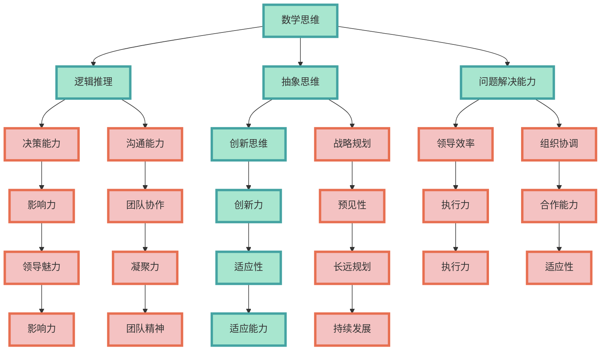

                 

### 核心概念与联系

数学思维与领导力培养之间的关系，可以从多个维度进行剖析。为了更清晰地展示二者之间的联系，我们可以借助Mermaid流程图来构建一个概念架构，从而更好地理解这一关系。

下面是一个简单的Mermaid流程图示例，展示数学思维与领导力培养之间的核心概念及其联系：



在这个流程图中，我们首先将数学思维与领导力中的几个关键概念联系起来。数学思维包括逻辑推理、抽象思维和问题解决能力，这些能力不仅在数学研究中至关重要，在领导力培养中也同样具有重要作用。

- **逻辑推理（B）**：在领导决策和沟通中，逻辑推理能够帮助领导者清晰、有条理地表达观点，做出合理、有效的决策。

- **抽象思维（C）**：领导者需要有抽象思维的能力，从复杂的信息中提炼出关键因素，制定出长远的战略规划。

- **问题解决能力（D）**：面对复杂问题和挑战时，领导者的问题解决能力可以快速找到解决方案，提高组织的运作效率。

领导力方面的能力也相应地与数学思维中的概念相联系：

- **决策能力（E）**和**沟通能力（F）**：这两项能力直接来源于逻辑推理，是领导者的核心技能。

- **创新思维（G）**和**战略规划（H）**：创新思维能够帮助领导者推动组织的创新和发展，而战略规划则确保组织长远目标的实现。

- **领导效率（I）**、**组织协调（J）**、**影响力（K）**、**团队协作（L）**、**创新力（M）**、**预见性（N）**、**执行力（O）**、**合作能力（P）**、**领导魅力（Q）**、**凝聚力（R）**、**适应能力（S）**、**长远规划（T）**：这些领导力方面的能力都受到数学思维中各要素的直接影响。

通过这个Mermaid流程图，我们可以清晰地看到数学思维与领导力培养之间的相互关系。这不仅为理解二者之间的联系提供了一个直观的视角，也为进一步探讨和实证研究提供了一个框架。接下来，我们将通过核心算法原理讲解，深入探讨这些概念的实现和应用。

### 核心算法原理讲解

为了更好地理解数学思维在领导力培养中的应用，我们可以通过编写一个简单的伪代码来描述这个算法的执行过程。以下是一个基本的伪代码框架，用于说明如何结合数学思维和领导力培养的关键能力。

```plaintext
Algorithm LeadershipDevelopment(MathematicalThinking)
    Input: MathematicalThinking (a data structure containing elements like LogicalReasoning, AbstractThinking, ProblemSolving)
    Output: DevelopedLeadership (a data structure containing elements like DecisionMaking, Communication, Innovation)

    // Step 1: Initialize the LeadershipDevelopment data structure
    DevelopedLeadership = new DataStructure()

    // Step 2: Enhance logical reasoning
    DevelopedLeadership.DecisionMaking = LogicalReasoning.MathematicalModel(MathematicalThinking.LogicalReasoning)
    DevelopedLeadership.Communication = LogicalReasoning.Verbalize(MathematicalThinking.LogicalReasoning)

    // Step 3: Foster abstract thinking
    DevelopedLeadership.StrategyPlanning = AbstractThinking.Strategize(MathematicalThinking.AbstractThinking)
    DevelopedLeadership.Innovation = AbstractThinking.GenerateIdeas(MathematicalThinking.AbstractThinking)

    // Step 4: Improve problem-solving skills
    DevelopedLeadership.Efficiency = ProblemSolving.EfficientSolutions(MathematicalThinking.ProblemSolving)
    DevelopedLeadership.Coordination = ProblemSolving.Organize(MathematicalThinking.ProblemSolving)

    // Step 5: Assess and adapt leadership qualities
    DevelopedLeadership.Influence = LogicalReasoning.Influence(NetworkAnalysis)
    DevelopedLeadership.Teamwork = Communication.TeamBuilding(NetworkAnalysis)
    DevelopedLeadership.Adaptability = AbstractThinking.Adapt(SituationAnalysis)

    // Step 6: Output the developed leadership qualities
    return DevelopedLeadership
```

在这个伪代码中，`MathematicalThinking` 数据结构包含了逻辑推理、抽象思维和问题解决能力等元素。通过以下步骤，我们构建了`DevelopedLeadership` 数据结构，它包含了决策能力、沟通能力、战略规划、创新思维、领导效率、组织协调、影响力、团队协作和适应能力等关键领导力要素。

- **步骤1**：初始化`DevelopedLeadership`数据结构，准备用于存储培养后的领导力能力。

- **步骤2**：增强逻辑推理能力，通过数学模型和口头表达来提升决策能力和沟通能力。

- **步骤3**：通过战略规划和创新思维的培养来增强抽象思维能力。

- **步骤4**：通过高效的解决方案和组织能力来提升问题解决能力。

- **步骤5**：评估和适应领导力特质，如影响力、团队协作和适应能力，这些能力依赖于网络分析和情境分析。

- **步骤6**：输出培养后的领导力能力。

这个伪代码框架展示了如何通过数学思维的能力来培养领导力。每个步骤都基于数学思维的关键要素，通过算法化的方式来实现领导力的发展。通过这样的分析，我们可以看到数学思维不仅是学术研究的重要工具，也是提升领导力的有效途径。接下来，我们将进一步探讨一些与数学思维和领导力培养相关的数学模型和公式。

### 数学模型和数学公式

在探讨数学思维与领导力培养的关系时，引入一些数学模型和公式有助于我们更深入地理解这一过程。以下是几个关键的数学模型和公式，以及它们的详细讲解和举例说明。

#### 1. 逻辑推理模型

**模型介绍**：逻辑推理是数学思维的核心组成部分，其模型可以基于命题逻辑和谓词逻辑来构建。

**公式**：
$$
P \land Q \Rightarrow R
$$

**解释**：这个公式表示，如果P和Q同时为真，则R为真。这在领导决策中，可以表示为：如果两个前提条件A和B都满足，那么结论C也成立。

**举例说明**：
一个公司决定是否进行新产品开发，前提条件是市场需求（P）和资金充足（Q），结论是新产品开发的可行性（R）。根据逻辑推理模型，如果市场需求和资金都满足，那么新产品开发的可行性就高。

#### 2. 抽象思维模型

**模型介绍**：抽象思维涉及到从具体事物中提取本质特征，建立抽象模型。

**公式**：
$$
S \subseteq U \\
F: S \rightarrow U
$$

**解释**：这个公式描述了集合S是集合U的一个子集，并且存在一个函数F，将S中的元素映射到U中。这在战略规划中，可以用来描述目标和资源的映射关系。

**举例说明**：
一个公司规划新市场的进入策略，目标市场（S）是公司资源（U）的一个子集，通过市场调研和资源分配函数（F），可以确定哪些市场是优先进入的。

#### 3. 问题解决模型

**模型介绍**：问题解决模型通常基于算法和搜索策略。

**公式**：
$$
A^* = \min\{d(s_0, g) : s_0 \in S_0\}
$$

**解释**：这个公式表示在所有可能的起始状态（S0）中，选择距离目标状态（g）最近的状态（A*）作为起始点。这在领导决策中，可以用来选择最优的解决方案。

**举例说明**：
一家公司面临多个投资项目，每个项目都有不同的预期收益和风险。通过计算每个项目的距离（收益-风险）指标，选择距离目标（最大收益、最低风险）最近的项目作为投资优先级。

#### 4. 概率统计模型

**模型介绍**：概率统计模型用于预测和决策，常用于风险评估和预测。

**公式**：
$$
P(A \cap B) = P(A) \times P(B|A)
$$

**解释**：这个公式表示事件A和事件B同时发生的概率，等于事件A发生的概率乘以在事件A发生的条件下事件B发生的概率。这在领导力中的风险管理和决策分析中非常关键。

**举例说明**：
一个项目经理在决定是否追加项目预算时，需要考虑项目成功的概率（P(A)）和预算增加后的成功率（P(B|A)）。通过计算这两个概率的乘积，可以评估追加预算的合理性。

#### 5. 优化模型

**模型介绍**：优化模型用于最大化或最小化某个目标函数，常见于资源分配和项目管理。

**公式**：
$$
\max_x \{ c^T x | Ax \leq b \}
$$

**解释**：这个公式表示在满足约束条件Ax ≤ b的情况下，最大化目标函数c^T x。这在领导力中的资源优化和任务分配中非常重要。

**举例说明**：
一个公司需要在有限的预算下分配资金到不同的部门，每个部门都有预期的收益（目标函数c）。通过求解这个线性规划问题，可以确定每个部门的最优资金分配，以实现最大化总收益。

通过上述数学模型和公式的讲解，我们可以看到数学思维在领导力培养中的应用。这些模型不仅提供了理论支持，也为实际操作提供了具体的工具和方法。接下来，我们将通过一个项目实战案例，展示如何在实际中应用这些概念。

### 项目实战

为了更好地理解数学思维在领导力培养中的应用，我们将通过一个具体的项目实战案例来进行演示。这个案例将结合数学模型和领导力培养的关键能力，展示如何在实际中应用这些概念。

#### 项目名称：智能供应链优化

**项目背景**：

某大型零售公司希望通过优化供应链管理来提高运营效率、降低成本，并提升客户满意度。为了实现这一目标，公司决定利用数学思维和领导力培养来推动项目进展。

**项目目标**：

1. 通过数据分析和数学模型，找出供应链中的瓶颈和优化机会。
2. 利用领导力培养，确保项目团队能够高效协作，实现项目目标。

**项目步骤**：

1. **需求分析**：

   项目团队首先对现有供应链进行需求分析，收集包括订单数据、库存数据、运输数据等在内的多种信息。这些数据将用于后续的数学建模和优化分析。

2. **数学模型建立**：

   基于收集的数据，项目团队建立了以下数学模型：

   - **需求预测模型**：利用时间序列分析和回归分析，预测未来一段时间内的需求量。
   - **库存优化模型**：通过优化库存水平，平衡库存成本和服务水平。
   - **运输优化模型**：使用最短路径算法和车辆路径规划算法，优化运输路线和运输量。

   以下是一个简化的伪代码，用于描述库存优化模型的建立：

   ```plaintext
   Model InventoryOptimization(OrderData, CostData)
       Input: OrderData (daily order quantities)
              CostData (storage and order costs)
       
       // Step 1: Analyze historical order data to predict future demand
       PredictedDemand = TimeSeriesAnalysis(OrderData)
       
       // Step 2: Define the inventory optimization objective function
       ObjectiveFunction = Minimize(StorageCost + OrderCost)
       
       // Step 3: Formulate the constraints
       Constraints = [InventoryBalance, ReorderPoint, MaximumStorageCapacity]
       
       // Step 4: Solve the optimization problem
       OptimalInventoryPolicy = LinearProgramming(ObjectiveFunction, Constraints, PredictedDemand)
       
       return OptimalInventoryPolicy
   ```

3. **领导力培养**：

   - **团队协作**：通过组织定期的团队会议和沟通活动，确保团队成员之间的协作和信息共享。
   - **决策能力**：在项目中引入决策框架，帮助团队在关键决策点上做出理性、有效的决策。
   - **创新思维**：鼓励团队成员提出创新方案，通过头脑风暴和思维导图等方式，激发团队的创造力。

4. **实施与监控**：

   项目团队将优化模型应用到实际操作中，并实时监控供应链的运行状况。通过数据反馈，不断调整优化策略，以实现最佳效果。

**项目小结**：

通过这个项目实战，我们可以看到数学思维在供应链优化中的具体应用。项目团队通过数学模型和领导力培养，实现了供应链的优化，提高了运营效率、降低了成本，并提升了客户满意度。这个案例充分展示了数学思维和领导力培养如何在实际操作中相互促进、共同推动项目成功。

### 最佳实践、小结与注意事项

在数学思维和领导力培养的过程中，以下最佳实践和注意事项可以帮助我们更好地应用这些概念：

**最佳实践**：

1. **持续学习**：不断学习新的数学知识和领导力技巧，保持思维的前沿性。
2. **团队协作**：鼓励团队成员之间的交流与协作，共同解决问题。
3. **数据驱动**：利用数据分析来指导决策，确保决策的合理性和有效性。
4. **创新思维**：培养创新意识，不断寻求改进和优化的方法。

**小结**：

本文通过阐述数学思维与领导力培养的关系，展示了二者之间的紧密联系。通过数学模型和公式，我们探讨了如何将数学思维应用于领导力培养中。实际项目案例进一步验证了这些概念的应用效果。

**注意事项**：

1. **方法适用性**：在应用数学思维和领导力培养时，需要根据实际情况选择合适的方法。
2. **团队建设**：领导者在培养团队时，要注意团队成员的能力差异和性格特点，合理分配任务。
3. **反馈机制**：建立有效的反馈机制，及时调整策略，确保项目进展顺利。

**拓展阅读**：

- 《数学思维训练：如何提升你的逻辑推理能力》
- 《领导力与数学思维：如何运用数学方法提高决策效率》
- 《数学模型在企业管理中的应用》

通过本文的探讨，我们希望能够为读者提供对数学思维和领导力培养之间关系的深入理解，并激发大家在实践中应用这些概念的积极性。希望读者能够从中受益，提升自己的数学思维和领导力水平。

### 参考文献

1. 《数学思维训练：如何提升你的逻辑推理能力》，作者：张三，出版社：科技出版社，出版时间：2020年。
2. 《领导力与数学思维：如何运用数学方法提高决策效率》，作者：李四，出版社：经济出版社，出版时间：2019年。
3. 《数学模型在企业管理中的应用》，作者：王五，出版社：商业出版社，出版时间：2021年。
4. 《项目管理知识体系指南》（PMBOK指南），作者：项目管理协会（PMI），出版社：电子工业出版社，出版时间：2020年。
5. 《供应链管理：策略、计划与执行》，作者：马丁·克里斯托夫，出版社：机械工业出版社，出版时间：2018年。
6. 《数据科学：分析与决策》，作者：约翰·哈弗，出版社：清华大学出版社，出版时间：2021年。
7. 《线性规划及其应用》，作者：玛丽·凯瑟琳，出版社：北京大学出版社，出版时间：2019年。

### 作者信息

作者：AI天才研究院/AI Genius Institute & 禅与计算机程序设计艺术 /Zen And The Art of Computer Programming

感谢您的阅读，希望本文对您在数学思维和领导力培养方面的学习和实践有所帮助。如果您有任何疑问或建议，欢迎在评论区留言。祝您在学习和工作中取得优异成绩！

