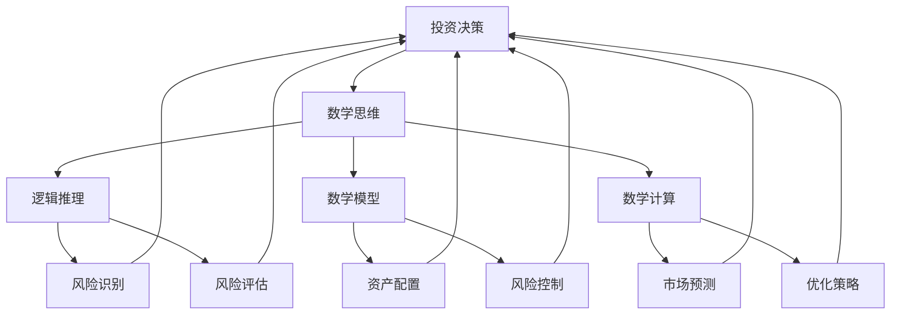

                 

### 文章标题

# 数学思维与风险投资决策的关系

### 关键词

- 数学思维
- 风险投资
- 决策模型
- 逻辑推理
- 投资策略

### 摘要

本文探讨了数学思维在风险投资决策中的应用，分析了数学思维的基本原理及其与风险投资决策的内在联系。文章首先介绍了数学思维的概念及其重要性，随后详细阐述了数学思维在逻辑推理、数学模型构建和数学计算方面的应用。接着，文章讨论了风险投资决策的基本原理和关键因素，并重点探讨了数学思维在风险投资决策中的具体应用，包括数学模型在风险评估和投资组合管理中的应用。最后，通过实际案例分析了数学思维与风险投资决策的实践效果，总结了数学思维在风险投资决策中的重要性，并为投资者提供了最佳实践建议。

### 目录

1. **数学思维概述**
    1.1 **数学思维的概念与重要性**
    1.2 **数学思维的基本原理**
    1.3 **数学思维与逻辑推理的关系**
2. **风险投资决策**
    2.1 **风险投资决策的基本原理**
    2.2 **数学思维在风险投资决策中的应用**
3. **数学思维与风险管理**
    3.1 **风险管理的定义与数学思维应用**
    3.2 **数学模型在风险管理中的应用**
4. **数学思维与投资策略**
    4.1 **投资策略的定义与数学思维应用**
    4.2 **数学模型在投资策略制定中的应用**
5. **数学思维与投资组合管理**
    5.1 **投资组合管理的定义与数学思维应用**
    5.2 **数学模型在投资组合管理中的应用**
6. **数学思维与投资分析**
    6.1 **投资分析的定义与数学思维应用**
    6.2 **数学模型在投资分析中的应用**
7. **数学思维与投资决策实践**
    7.1 **案例一：高科技创业公司的投资决策**
    7.2 **案例二：风险投资基金的决策过程**
    7.3 **案例三：大型企业投资决策案例分析**
8. **数学思维与投资决策工具应用**
    8.1 **投资决策工具概述**
    8.2 **数学思维在投资决策工具中的应用**
9. **附录**
    9.1 **数学思维与风险投资决策关系Mermaid流程图**
    9.2 **数学模型在风险投资决策中的伪代码示例**
    9.3 **数学公式与投资决策关系示例**
    9.4 **数学思维与投资决策实践代码示例**

## 引言

风险投资（Venture Capital，简称VC）是资本市场的重要组成部分，它通过向初创企业或成长型企业提供资金，支持这些企业在高风险、高回报的环境中成长壮大。风险投资决策是风险投资过程中最为关键的一环，其核心在于如何准确评估项目的潜在风险和回报，从而做出最优的投资决策。然而，风险投资决策往往涉及复杂的变量和不确定性，使得决策过程充满挑战。

在这一背景下，数学思维的应用显得尤为重要。数学思维是指运用数学概念、方法和工具来分析和解决实际问题的思维方式。它强调逻辑推理、量化分析和模型构建，能够帮助我们更全面、更精确地理解和处理复杂的信息。本文将从数学思维的基本概念入手，深入探讨数学思维在风险投资决策中的应用，旨在为投资者提供一种科学的决策方法和工具。

文章将首先介绍数学思维的概念及其重要性，接着详细阐述数学思维的基本原理，包括数学模型、数学计算和逻辑推理等方面的内容。随后，我们将讨论风险投资决策的基本原理和关键因素，并重点介绍数学思维在风险投资决策中的具体应用。最后，通过实际案例分析和投资决策工具的应用，总结数学思维在风险投资决策中的价值，并为投资者提供实用的建议和指导。

### 数学思维概述

数学思维是一种通过数学概念、方法和工具来分析和解决实际问题的思维方式。它不仅涉及对数学知识的掌握，更重要的是将数学原理应用于现实世界的分析和决策过程。数学思维的核心在于逻辑推理、量化分析和模型构建，这些能力对于风险投资决策尤其重要。

首先，**逻辑推理**是数学思维的基础。逻辑推理是一种从已知信息中得出结论的思维方式，它强调思维的严谨性和系统性。在风险投资决策中，逻辑推理可以帮助投资者从纷繁复杂的信息中提取关键要素，构建合理的决策框架，从而避免盲目决策和风险失误。

其次，**量化分析**是数学思维的重要应用。量化分析是指通过数值计算和分析来评估投资项目的风险和回报。在风险投资中，量化分析可以帮助投资者更精确地评估企业的财务状况、市场前景和竞争环境，从而做出更科学、更合理的投资决策。

最后，**模型构建**是数学思维的延伸。模型构建是指通过建立数学模型来模拟现实世界中的投资过程和决策结果。在风险投资中，模型构建可以帮助投资者预测市场变化、评估投资风险和优化投资策略，从而提高投资决策的准确性和效率。

数学思维的重要性体现在以下几个方面：

1. **提高决策效率**：数学思维可以帮助投资者快速、准确地分析和处理大量信息，从而提高决策效率。
2. **降低决策风险**：通过逻辑推理和量化分析，数学思维可以更全面地评估投资项目的风险，帮助投资者降低决策风险。
3. **优化投资策略**：数学模型和工具的应用可以帮助投资者制定更科学的投资策略，提高投资回报率。
4. **增强创新能力**：数学思维鼓励投资者从不同角度分析和解决问题，有助于激发创新思维和开拓新市场。

在风险投资决策中，数学思维的应用不仅可以提高决策的科学性和准确性，还可以为投资者提供更全面、更系统的分析工具和方法。因此，掌握和运用数学思维对于风险投资的成功至关重要。

### 数学思维的基本原理

数学思维的基本原理包括数学模型、数学计算和逻辑推理。这些原理构成了数学思维的核心，是理解和应用数学思维解决实际问题的关键。

#### 数学模型的基本原理

数学模型是数学思维的核心组成部分，它通过将现实世界的现象抽象为数学表达式和关系，帮助我们更准确地理解和预测现实问题。数学模型的基本原理包括：

1. **抽象化**：数学模型通过抽象化过程，将复杂现象简化为数学符号和方程，从而便于分析和处理。例如，在风险投资中，可以将企业的财务状况、市场环境和竞争态势等抽象为财务指标、市场数据和竞争模型。

2. **符号化**：使用数学符号和方程来表示现实问题，使问题更加清晰和系统化。符号化有助于我们进行形式化的推导和计算，从而提高分析精度。

3. **量化分析**：通过数学模型进行量化分析，将定性的描述转化为定量的评估，从而更科学地评估风险和回报。例如，在风险评估中，可以使用概率分布和期望值来量化风险水平。

4. **模型校准**：模型校准是确保数学模型准确反映现实问题的关键步骤。通过历史数据或模拟测试，对模型进行调整和优化，以提高预测精度。

以下是一个简单的数学模型构建示例：

**投资回报模型**：

设企业的初始投资为 \(I\)，年回报率为 \(r\)，投资期限为 \(t\)，则企业的总回报为：

\[ R = I \times (1 + r)^t \]

通过这个模型，我们可以量化分析不同回报率下的投资回报，从而为投资决策提供参考。

#### 数学计算的基本原理

数学计算是数学思维的重要应用，它通过数学运算和算法来解决具体问题。数学计算的基本原理包括：

1. **运算规则**：了解基本的数学运算规则，如加法、减法、乘法和除法，以及更高级的运算，如指数运算和对数运算等，是进行有效计算的基础。

2. **算法设计**：算法是解决问题的步骤和规则，通过算法设计，我们可以将复杂的数学问题转化为简单的计算步骤。例如，常见的算法有排序算法、搜索算法和优化算法等。

3. **计算机编程**：计算机编程是实现数学计算的工具，它将数学算法转化为计算机代码，从而在计算机上高效地执行计算任务。了解计算机编程语言和算法是实现数学计算的关键。

以下是一个简单的数学计算示例：

**计算复合利息**：

假设本金为 \(P = 1000\) 元，年利率为 \(r = 0.05\)，投资期限为 \(t = 5\) 年，则复合利息计算公式为：

\[ A = P \times (1 + r)^t \]

使用Python代码实现该计算：

```python
P = 1000
r = 0.05
t = 5
A = P * (1 + r)**t
print("复合利息总额为：", A)
```

运行上述代码，可以得到复合利息总额为：

```shell
复合利息总额为： 1276.283
```

#### 数学推理的基本原理

数学推理是通过逻辑和数学原理来推导和证明结论的过程。数学推理的基本原理包括：

1. **逻辑演绎**：逻辑演绎是从一般到特殊的推理过程，通过已知的基本原理和公理，推导出具体的结论。例如，在风险投资决策中，可以从基本的投资原则和风险理论推导出具体的投资策略。

2. **归纳推理**：归纳推理是从特殊到一般的推理过程，通过观察和分析具体实例，归纳出普遍规律。例如，通过分析多个成功的投资案例，可以归纳出一些通用的投资原则。

3. **证明**：证明是通过逻辑和数学方法，严格证明某个结论的正确性。证明是数学推理的核心，它确保了结论的可靠性和科学性。

以下是一个简单的数学推理示例：

**证明勾股定理**：

假设直角三角形的两条直角边长分别为 \(a\) 和 \(b\)，斜边长为 \(c\)。根据勾股定理，有：

\[ a^2 + b^2 = c^2 \]

证明：

设直角三角形的两个直角边分别为 \(a\) 和 \(b\)，斜边为 \(c\)。根据直角三角形的定义，有：

\[ a^2 + b^2 = (c \times \cos(\theta))^2 + (c \times \sin(\theta))^2 \]

\[ a^2 + b^2 = c^2 \times (\cos(\theta)^2 + \sin(\theta)^2) \]

由于 \(\cos(\theta)^2 + \sin(\theta)^2 = 1\)（根据三角函数的基本关系），所以：

\[ a^2 + b^2 = c^2 \]

因此，勾股定理得证。

通过以上对数学模型、数学计算和数学推理的基本原理的介绍，我们可以看到数学思维是如何通过抽象化、符号化、量化分析和逻辑推理来分析和解决实际问题的。这些基本原理为我们在风险投资决策中的应用奠定了坚实的基础。

### 数学思维与逻辑推理的关系

逻辑推理是数学思维的重要组成部分，它通过严谨的推理过程，从已知的前提中推导出新的结论。在风险投资决策中，逻辑推理帮助投资者从复杂的信息中筛选出关键因素，构建合理的决策框架，从而做出科学的投资决策。数学思维与逻辑推理的关系密切，二者相辅相成，共同构成了理性投资决策的基础。

首先，数学思维为逻辑推理提供了强大的工具。在逻辑推理过程中，数学思维通过量化和建模，使得推理过程更加系统和精确。例如，在风险投资中，投资者可以通过构建数学模型来量化企业的财务状况、市场环境和竞争态势，从而对投资项目的风险和回报进行精确评估。

其次，逻辑推理是数学思维应用的体现。数学思维的核心在于通过逻辑推理来分析问题、构建模型和验证结论。在风险投资决策中，逻辑推理帮助投资者从逻辑上验证数学模型的合理性和有效性，从而确保投资决策的科学性和可靠性。

以下是一个关于逻辑推理在风险投资决策中应用的例子：

**案例：企业财务状况评估**

假设我们要评估一家企业的财务状况，以决定是否进行投资。我们可以使用以下逻辑推理过程：

1. **定义财务状况的指标**：首先，我们需要定义一系列财务指标，如利润率、增长率、负债率等。

2. **量化财务状况**：通过获取企业的财务报表，计算上述指标的具体数值。

3. **分析财务指标**：根据财务指标的数据，分析企业的盈利能力、增长潜力和财务稳定性。

4. **逻辑推理**：基于对财务指标的分析，使用逻辑推理来判断企业的财务状况是否良好。例如，如果利润率高于行业平均水平，且增长率持续上升，则可以认为企业的财务状况良好。

5. **得出结论**：根据逻辑推理的结果，决定是否进行投资。

以下是一个简化的逻辑推理示例：

```
如果（利润率 > 行业平均水平）且（增长率 > 行业平均水平），则（企业财务状况良好）。

结论：企业财务状况良好，可以考虑投资。
```

通过以上逻辑推理过程，我们可以更准确地评估企业的财务状况，从而做出科学的投资决策。

总之，数学思维与逻辑推理的关系是密不可分的。数学思维为逻辑推理提供了工具和方法，而逻辑推理则是数学思维在现实应用中的体现。在风险投资决策中，通过运用数学思维和逻辑推理，投资者可以更精确地评估投资项目的风险和回报，从而做出更科学、更合理的投资决策。

### 风险投资决策的基本原理

风险投资决策是风险投资过程中的关键环节，它决定了投资者是否将资金投入到特定的项目中，以及投入多少资金。了解风险投资决策的基本原理对于投资者而言至关重要。以下是对风险投资决策的基本原理的详细介绍。

#### 风险投资的定义

风险投资（Venture Capital，简称VC）是指专业投资机构对具有高增长潜力的初创企业或成长型企业进行股权投资，以获取未来资本增值和收益的一种投资方式。与传统投资相比，风险投资的特点在于高回报与高风险并存。

#### 风险投资的类型

风险投资可以分为以下几种类型：

1. **天使投资**：通常由个人投资者或小型风险投资机构提供，用于支持初创企业的早期发展。

2. **种子轮投资**：在天使投资之后，用于支持企业在产品开发和市场推广阶段的投资。

3. **A轮和B轮投资**：在企业发展至一定阶段后，用于扩大生产规模、提升市场份额等方面的投资。

4. **后期轮投资**：在企业已经取得一定市场地位和业绩后，用于进一步扩展业务、进行技术创新等。

#### 风险投资决策的关键因素

在做出风险投资决策时，投资者需要综合考虑以下关键因素：

1. **项目潜力**：项目的市场前景、技术创新性、管理团队和商业模式等。

2. **投资规模**：投资者需要根据自身资金状况和投资策略，确定适当的投资规模。

3. **回报率**：预测项目的未来收益，评估其是否符合投资者的预期回报要求。

4. **风险水平**：评估项目的风险，包括市场风险、技术风险、财务风险和运营风险等。

5. **退出策略**：考虑项目的退出路径，包括IPO、并购和股权转让等。

#### 投资决策模型

在风险投资决策中，常用的投资决策模型包括以下几种：

1. **净现值模型（NPV）**：通过计算未来现金流量的现值与初始投资成本之差，评估项目的盈利能力。

2. **内部收益率模型（IRR）**：计算项目的预期收益率，判断其是否高于投资者的预期回报率。

3. **风险调整回报率模型**：在考虑项目风险的基础上，计算风险调整后的回报率，以更准确地评估项目的投资价值。

4. **决策树模型**：通过构建决策树，分析不同决策路径下的风险和回报，帮助投资者做出最优决策。

#### 数学思维在投资决策中的应用

数学思维在风险投资决策中的应用主要体现在以下几个方面：

1. **量化分析**：通过数学方法对项目的财务指标、市场前景和风险进行量化分析，为投资决策提供科学依据。

2. **模型构建**：建立数学模型，模拟投资过程和决策结果，评估项目的风险和回报。

3. **逻辑推理**：运用逻辑推理，从已知信息中推导出新的结论，确保投资决策的科学性和合理性。

通过以上对风险投资决策的基本原理的详细介绍，我们可以看到，数学思维在风险投资决策中具有不可替代的作用。掌握和运用数学思维，能够帮助投资者更全面、更准确地评估投资项目的风险和回报，从而做出更科学、更合理的投资决策。

### 数学思维在风险投资决策中的应用

数学思维在风险投资决策中的应用贯穿于整个投资过程，从项目筛选、风险评估到投资组合管理，每一步都离不开数学思维的支持。下面将详细探讨数学思维在风险投资决策中的应用，包括数学模型、数学计算和逻辑推理的具体实例。

#### 数学模型在风险投资决策中的应用

数学模型是风险投资决策中的重要工具，它通过量化和分析，帮助投资者更准确地评估投资项目的风险和回报。以下是一些常见的数学模型及其在风险投资中的应用：

1. **净现值模型（NPV）**：净现值模型通过计算未来现金流的现值与初始投资成本之差，评估项目的盈利能力。其公式为：

   \[
   NPV = \sum_{t=1}^{n} \frac{CF_t}{(1 + r)^t} - I
   \]

   其中，\(CF_t\) 表示第 \(t\) 年的现金流，\(r\) 表示折现率，\(I\) 表示初始投资成本。投资者可以通过计算NPV，判断项目是否值得投资。如果NPV大于零，则表示项目的净现值为正，预期收益高于成本，可以投资；如果NPV小于零，则表示项目的净现值为负，预期收益低于成本，应谨慎投资。

2. **内部收益率模型（IRR）**：内部收益率是使得项目的净现值等于零的折现率，它反映了项目的实际收益率。其公式为：

   \[
   IRR = \frac{1}{n} \sum_{t=1}^{n} \left( \frac{CF_t}{NPV} \right)
   \]

   投资者可以通过计算IRR，判断项目的实际收益率是否符合预期。如果IRR高于投资者的预期回报率，则可以投资；如果IRR低于预期回报率，则应重新评估投资决策。

3. **风险调整回报率模型**：在考虑项目风险的基础上，计算风险调整后的回报率，以更准确地评估项目的投资价值。其公式为：

   \[
  RAR = \frac{1 + IRR}{1 + \beta} - 1
   \]

   其中，\(\beta\) 表示项目的风险系数。通过计算RAR，投资者可以判断项目在风险调整后的实际回报率，从而做出更科学的投资决策。

#### 数学计算在风险投资决策中的应用

数学计算在风险投资决策中的应用主要体现在对财务指标和市场数据的计算和分析。以下是一些常用的数学计算方法及其应用：

1. **财务指标计算**：通过计算企业的财务指标，如利润率、增长率、负债率等，评估企业的财务健康状况。例如，利润率计算公式为：

   \[
   利润率 = \frac{净利润}{营业收入}
   \]

   通过计算利润率，投资者可以评估企业的盈利能力。

2. **市场数据计算**：通过计算市场数据，如市场份额、市场增长率、竞争对手情况等，评估项目的市场前景。例如，市场份额计算公式为：

   \[
   市场份额 = \frac{企业销售额}{市场总销售额}
   \]

   通过计算市场份额，投资者可以了解企业在市场中的竞争力。

3. **风险评估计算**：通过计算风险指标，如风险指数、波动率等，评估项目的风险水平。例如，风险指数计算公式为：

   \[
   风险指数 = \frac{最大亏损额}{平均收益额}
   \]

   通过计算风险指数，投资者可以了解项目的风险程度。

#### 逻辑推理在风险投资决策中的应用

逻辑推理在风险投资决策中的应用主要体现在从已知信息中推导出新的结论，确保投资决策的科学性和合理性。以下是一些逻辑推理的应用实例：

1. **项目筛选逻辑**：通过逻辑推理，筛选出具有高潜力、低风险的投资项目。例如，可以使用以下逻辑推理：

   如果（项目市场前景良好）且（项目技术创新性强）且（管理团队优秀），则（项目具有投资价值）。

2. **风险评估逻辑**：通过逻辑推理，评估项目的风险水平。例如，可以使用以下逻辑推理：

   如果（项目存在市场风险）且（项目存在技术风险）且（项目存在财务风险），则（项目风险较高）。

3. **投资决策逻辑**：通过逻辑推理，确定投资决策。例如，可以使用以下逻辑推理：

   如果（项目NPV大于零）且（项目IRR高于预期回报率），则（投资该项目）。

通过以上对数学思维在风险投资决策中的应用的详细探讨，我们可以看到数学思维在风险投资决策中具有重要作用。掌握和运用数学思维，能够帮助投资者更全面、更准确地评估投资项目的风险和回报，从而做出更科学、更合理的投资决策。

#### 数学思维与风险管理

风险管理是风险投资决策中不可或缺的一部分，它旨在识别、评估和控制投资项目的风险，以保障投资者的利益。数学思维在风险管理中发挥着至关重要的作用，通过量化分析和模型构建，帮助投资者更准确地评估和管理风险。

##### 风险管理的定义

风险管理是指通过系统化的方法识别、评估、监测和应对项目风险的过程。其目的是降低风险对投资项目的影响，确保投资目标的实现。风险管理不仅涉及风险识别和评估，还包括风险控制、风险转移和风险补偿等策略。

##### 数学思维在风险管理中的应用

1. **风险识别**：数学思维可以帮助投资者通过定量分析识别潜在的风险。例如，可以使用回归分析、聚类分析等方法识别市场风险、信用风险和操作风险等。

2. **风险评估**：数学思维通过定量方法对风险进行量化评估，如使用概率分布、方差、标准差等指标，评估风险的可能性和影响程度。例如，可以使用以下公式评估投资组合的波动率：

   \[
   \sigma_P = \sqrt{\sum_{i=1}^{n} w_i^2 \sigma_i^2 + 2 \sum_{i=1}^{n} \sum_{j=i+1}^{n} w_i w_j \rho_{ij} \sigma_i \sigma_j}
   \]

   其中，\(\sigma_P\) 表示投资组合的波动率，\(w_i\) 表示资产 \(i\) 的权重，\(\sigma_i\) 表示资产 \(i\) 的波动率，\(\rho_{ij}\) 表示资产 \(i\) 和资产 \(j\) 之间的相关性。

3. **风险控制**：数学思维通过模型构建和优化，帮助投资者制定有效的风险控制策略。例如，可以使用VaR（Value at Risk）模型来设定风险限额，确保投资组合的风险在可接受范围内。VaR模型的基本公式为：

   \[
   VaR = - \alpha \cdot \sigma_P \cdot Z_{\alpha}
   \]

   其中，\(\alpha\) 表示置信水平，\(\sigma_P\) 表示投资组合的波动率，\(Z_{\alpha}\) 表示标准正态分布的临界值。

4. **风险转移**：数学思维通过期权定价模型等金融工具，帮助投资者实现风险转移。例如，使用期权进行风险对冲，可以降低投资组合的潜在损失。

5. **风险补偿**：数学思维通过预期收益模型和风险调整回报率模型，帮助投资者确定合理的风险补偿。例如，可以使用以下公式计算风险调整回报率（RAR）：

   \[
   RAR = \frac{1 + IRR}{1 + \beta} - 1
   \]

   其中，\(\beta\) 表示风险系数，\(IRR\) 表示内部收益率。通过计算RAR，投资者可以确定在考虑风险后的实际回报率，从而做出更科学的投资决策。

##### 数学模型在风险管理中的应用

数学模型在风险管理中应用广泛，以下是一些常见的数学模型及其在风险管理中的应用：

1. **概率模型**：通过概率模型评估风险事件的可能性。例如，使用贝叶斯网络模型进行风险事件的概率分布计算。

2. **蒙特卡罗模拟**：通过蒙特卡罗模拟进行风险情景分析和概率分布计算。例如，使用蒙特卡罗模拟进行市场波动率预测。

3. **风险价值模型（VaR）**：通过VaR模型计算投资组合在特定置信水平下的潜在最大损失。

4. **期权定价模型**：通过期权定价模型进行风险对冲和风险转移。例如，使用布莱克-舍尔斯模型（Black-Scholes Model）计算欧式期权的价格。

5. **蒙特卡罗模拟**：通过蒙特卡罗模拟进行复杂风险情景的模拟和评估。例如，使用蒙特卡罗模拟进行项目现金流的不确定性分析。

通过以上对数学思维与风险管理的关系的详细探讨，我们可以看到数学思维在风险管理中的应用不仅提高了风险管理的科学性和准确性，还为投资者提供了有效的决策工具和方法。掌握和运用数学思维，能够帮助投资者更好地识别、评估和管理风险，从而在风险投资中取得更好的回报。

### 数学思维与投资策略

投资策略是投资者在特定市场环境下，根据自身的风险偏好和投资目标，制定的长期或短期投资计划。有效的投资策略能够帮助投资者实现风险和收益的平衡，从而在市场中取得稳定的投资回报。数学思维在投资策略的制定和执行中发挥着重要作用，它通过量化和建模，为投资者提供科学、系统的决策支持。

#### 投资策略的定义

投资策略是指投资者在市场操作中，为了达到特定的投资目标而制定的一系列原则和操作规则。这些策略通常包括投资目标、资产配置、风险控制、市场趋势分析等内容。投资策略的制定需要充分考虑市场环境、投资者风险偏好和投资期限等因素。

#### 数学思维在投资策略制定中的应用

1. **资产配置**：资产配置是投资策略的核心，它决定了投资者在不同资产类别中的资金分配。数学思维可以通过均值方差模型（Mean-Variance Model）帮助投资者进行资产配置优化。该模型通过计算不同资产组合的预期收益和风险，找到收益最大、风险最小的资产配置方案。

   均值方差模型的基本公式为：

   \[
   \min \sum_{i=1}^{n} w_i^2 \sigma_i^2
   \]

   \[
   \text{subject to} \quad \sum_{i=1}^{n} w_i = 1 \quad \text{and} \quad E(r_P) = \sum_{i=1}^{n} w_i r_i
   \]

   其中，\(w_i\) 表示资产 \(i\) 的权重，\(\sigma_i^2\) 表示资产 \(i\) 的方差，\(E(r_P)\) 表示资产组合的预期收益，\(r_i\) 表示资产 \(i\) 的预期收益。

2. **风险控制**：数学思维通过风险价值模型（VaR）帮助投资者进行风险控制。VaR模型可以计算投资组合在特定置信水平下的潜在最大损失，从而为投资者提供风险限额参考。例如，假设投资者设定95%置信水平下的VaR为100万元，那么投资组合在任何95%的时间内，最大损失不应超过100万元。

3. **市场预测**：数学思维可以通过时间序列分析、回归分析等方法进行市场预测。例如，使用移动平均模型（Moving Average Model）预测市场趋势，使用ARIMA模型（AutoRegressive Integrated Moving Average Model）进行时间序列预测。

4. **优化策略**：数学思维通过优化算法（如线性规划、非线性规划等）帮助投资者制定最优投资策略。例如，通过线性规划优化投资组合，使收益最大化或风险最小化。

#### 数学模型在投资策略制定中的应用

1. **资本资产定价模型（CAPM）**：CAPM模型用于计算资产的预期收益，以及资产的系统性风险。其公式为：

   \[
   E(r_i) = r_f + \beta_i (E(r_m) - r_f)
   \]

   其中，\(E(r_i)\) 表示资产 \(i\) 的预期收益，\(r_f\) 表示无风险利率，\(\beta_i\) 表示资产 \(i\) 的贝塔系数，\(E(r_m)\) 表示市场组合的预期收益。

2. **均值-方差模型**：该模型通过计算资产组合的预期收益和方差，优化资产配置。其公式为：

   \[
   \min \sum_{i=1}^{n} w_i^2 \sigma_i^2
   \]

   \[
   \text{subject to} \quad \sum_{i=1}^{n} w_i = 1 \quad \text{and} \quad E(r_P) = \sum_{i=1}^{n} w_i r_i
   \]

3. **蒙特卡罗模拟**：蒙特卡罗模拟通过模拟大量随机样本，评估投资策略的预期收益和风险。其基本步骤为：

   - 设定投资策略参数，如资产配置、交易频率等。
   - 生成随机样本，模拟市场波动。
   - 计算模拟结果的统计量，如期望收益、方差等。

#### 举例说明

假设投资者A希望在股票市场和债券市场之间进行资产配置，以实现收益最大化。通过数学模型，可以计算出最优的资产配置比例。

1. **收集数据**：收集股票市场和债券市场的历史收益数据。

2. **计算预期收益和方差**：计算股票市场和债券市场的预期收益和方差。

3. **构建优化模型**：使用均值-方差模型构建优化模型，目标是最小化投资组合的方差，同时满足预期收益的要求。

   \[
   \min \sum_{i=1}^{2} w_i^2 \sigma_i^2
   \]

   \[
   \text{subject to} \quad \sum_{i=1}^{2} w_i = 1 \quad \text{and} \quad E(r_P) = w_1 r_1 + w_2 r_2
   \]

4. **求解优化模型**：使用数学优化算法求解模型，得到最优的资产配置比例。

   假设优化结果为：股票市场占比60%，债券市场占比40%。

5. **实施策略**：根据最优配置比例，在实际投资中调整股票市场和债券市场的投资比例。

通过以上步骤，投资者A可以根据数学模型制定科学、合理的投资策略，实现收益最大化和风险控制。

总之，数学思维在投资策略的制定和执行中具有重要作用。通过量化和建模，数学思维能够帮助投资者更准确地评估市场环境、优化资产配置和制定有效的风险控制策略，从而在投资市场中取得更好的回报。

### 数学思维与投资组合管理

投资组合管理是指投资者根据市场环境、风险偏好和投资目标，对投资组合进行动态调整和优化的过程。数学思维在投资组合管理中发挥着关键作用，通过量化分析和模型构建，投资者可以更准确地评估投资组合的风险和回报，实现资产配置的优化和风险控制。

#### 投资组合管理的定义

投资组合管理是指投资者通过选择和管理不同类型的投资资产，构建一个多元化的投资组合，以实现投资目标的过程。投资组合管理的目标是最大化投资组合的预期回报，同时控制风险。投资者需要根据市场环境、自身风险承受能力和投资目标，制定科学的投资策略，并对投资组合进行定期调整。

#### 数学思维在投资组合管理中的应用

1. **资产配置**：数学思维通过均值-方差模型（Mean-Variance Model）帮助投资者进行资产配置。该模型通过计算不同资产组合的预期收益和方差，找到收益最大、风险最小的资产配置方案。资产配置的基本公式为：

   \[
   \min \sum_{i=1}^{n} w_i^2 \sigma_i^2
   \]

   \[
   \text{subject to} \quad \sum_{i=1}^{n} w_i = 1 \quad \text{and} \quad E(r_P) = \sum_{i=1}^{n} w_i r_i
   \]

   其中，\(w_i\) 表示资产 \(i\) 的权重，\(\sigma_i^2\) 表示资产 \(i\) 的方差，\(E(r_P)\) 表示资产组合的预期收益，\(r_i\) 表示资产 \(i\) 的预期收益。

2. **风险控制**：数学思维通过风险价值模型（VaR）帮助投资者进行风险控制。VaR模型可以计算投资组合在特定置信水平下的潜在最大损失，从而为投资者提供风险限额参考。例如，假设投资者设定95%置信水平下的VaR为100万元，那么投资组合在任何95%的时间内，最大损失不应超过100万元。

3. **优化策略**：数学思维通过优化算法（如线性规划、非线性规划等）帮助投资者制定最优投资策略。例如，通过线性规划优化投资组合，使收益最大化或风险最小化。

#### 数学模型在投资组合管理中的应用

1. **资本资产定价模型（CAPM）**：CAPM模型用于计算资产的预期收益，以及资产的系统性风险。其公式为：

   \[
   E(r_i) = r_f + \beta_i (E(r_m) - r_f)
   \]

   其中，\(E(r_i)\) 表示资产 \(i\) 的预期收益，\(r_f\) 表示无风险利率，\(\beta_i\) 表示资产 \(i\) 的贝塔系数，\(E(r_m)\) 表示市场组合的预期收益。

2. **均值-方差模型**：该模型通过计算资产组合的预期收益和方差，优化资产配置。其公式为：

   \[
   \min \sum_{i=1}^{n} w_i^2 \sigma_i^2
   \]

   \[
   \text{subject to} \quad \sum_{i=1}^{n} w_i = 1 \quad \text{and} \quad E(r_P) = \sum_{i=1}^{n} w_i r_i
   \]

3. **蒙特卡罗模拟**：蒙特卡罗模拟通过模拟大量随机样本，评估投资组合的预期收益和风险。其基本步骤为：

   - 设定投资策略参数，如资产配置、交易频率等。
   - 生成随机样本，模拟市场波动。
   - 计算模拟结果的统计量，如期望收益、方差等。

#### 举例说明

假设投资者B希望在股票市场、债券市场和货币市场之间进行资产配置，以实现收益最大化。通过数学模型，可以计算出最优的资产配置比例。

1. **收集数据**：收集股票市场、债券市场和货币市场的历史收益数据。

2. **计算预期收益和方差**：计算股票市场、债券市场和货币市场的预期收益和方差。

3. **构建优化模型**：使用均值-方差模型构建优化模型，目标是最小化投资组合的方差，同时满足预期收益的要求。

   \[
   \min \sum_{i=1}^{3} w_i^2 \sigma_i^2
   \]

   \[
   \text{subject to} \quad \sum_{i=1}^{3} w_i = 1 \quad \text{and} \quad E(r_P) = w_1 r_1 + w_2 r_2 + w_3 r_3
   \]

4. **求解优化模型**：使用数学优化算法求解模型，得到最优的资产配置比例。

   假设优化结果为：股票市场占比50%，债券市场占比30%，货币市场占比20%。

5. **实施策略**：根据最优配置比例，在实际投资中调整股票市场、债券市场和货币市场的投资比例。

通过以上步骤，投资者B可以根据数学模型制定科学、合理的投资策略，实现资产配置的优化和风险控制，从而在投资市场中取得更好的回报。

总之，数学思维在投资组合管理中具有重要作用。通过量化和建模，数学思维能够帮助投资者更准确地评估投资组合的风险和回报，优化资产配置，实现投资目标。掌握和运用数学思维，能够为投资者提供科学的决策依据，提高投资组合的稳定性和回报率。

### 数学思维与投资分析

投资分析是投资者在决策过程中对投资项目进行评估和分析的过程，旨在确定投资项目的潜在风险和回报。数学思维在投资分析中起着至关重要的作用，它通过量化和建模，为投资者提供科学的分析工具和方法，从而提高投资决策的准确性和可靠性。

#### 投资分析的定义

投资分析是指投资者通过对市场环境、企业财务状况、行业前景等因素的综合分析，评估投资项目的潜在风险和回报，为投资决策提供科学依据。投资分析通常包括财务分析、市场分析、行业分析和宏观经济分析等不同方面。

#### 数学思维在投资分析中的应用

1. **财务分析**：财务分析是通过分析企业的财务报表，评估企业的盈利能力、偿债能力和经营效率。数学思维在财务分析中的应用主要包括：

   - **比率分析**：通过计算各种财务比率（如利润率、流动性比率、负债比率等），评估企业的财务状况。例如，计算企业的资产负债率：

     \[
     资产负债率 = \frac{负债总额}{资产总额}
     \]

   - **趋势分析**：通过分析企业财务指标的历史数据，评估企业财务状况的变化趋势。例如，计算企业的净利润增长率：

     \[
     净利润增长率 = \frac{本期净利润 - 上期净利润}{上期净利润}
     \]

2. **市场分析**：市场分析是通过分析市场环境、行业趋势和竞争对手情况，评估投资项目的市场前景。数学思维在市场分析中的应用主要包括：

   - **回归分析**：通过建立回归模型，分析市场因素对企业业绩的影响。例如，建立销售量与广告支出之间的回归模型：

     \[
     销售量 = \beta_0 + \beta_1 \times 广告支出 + \epsilon
     \]

   - **时间序列分析**：通过分析市场数据的时间序列，预测市场趋势。例如，使用移动平均模型预测股票价格：

     \[
     \text{移动平均} = \frac{过去n天的价格总和}{n}
     \]

3. **行业分析**：行业分析是通过分析行业趋势、竞争格局和行业政策，评估投资项目的行业前景。数学思维在行业分析中的应用主要包括：

   - **竞争分析**：通过计算市场份额、市场集中度等指标，分析行业竞争状况。例如，计算市场份额：

     \[
     市场份额 = \frac{企业销售额}{行业总销售额}
     \]

   - **产业生命周期分析**：通过分析行业的发展阶段，预测行业未来的发展趋势。例如，判断行业是否处于成长期：

     \[
     成长期 = \text{增长率} > 10\%
     \]

4. **宏观经济分析**：宏观经济分析是通过分析宏观经济指标，评估市场环境对投资项目的影响。数学思维在宏观经济分析中的应用主要包括：

   - **宏观经济模型**：通过建立宏观经济模型，分析经济政策对市场的影响。例如，使用IS-LM模型分析货币政策的影响：

     \[
     IS: Y = C + I + G + (X - M)
     \]

     \[
     LM: M/P = L1(Y) + L2(i)
     \]

   - **时间序列分析**：通过分析宏观经济数据的时间序列，预测宏观经济走势。例如，使用ARIMA模型预测GDP增长率：

     \[
     \text{ARIMA}(p, d, q) \quad \text{模型}
     \]

#### 数学模型在投资分析中的应用

1. **资本资产定价模型（CAPM）**：CAPM模型用于计算资产的预期收益，以及资产的系统性风险。其公式为：

   \[
   E(r_i) = r_f + \beta_i (E(r_m) - r_f)
   \]

   其中，\(E(r_i)\) 表示资产 \(i\) 的预期收益，\(r_f\) 表示无风险利率，\(\beta_i\) 表示资产 \(i\) 的贝塔系数，\(E(r_m)\) 表示市场组合的预期收益。

2. **回归分析**：回归分析用于分析两个或多个变量之间的关系。其公式为：

   \[
   Y = \beta_0 + \beta_1X + \epsilon
   \]

   其中，\(Y\) 表示因变量，\(X\) 表示自变量，\(\beta_0\) 和 \(\beta_1\) 表示回归系数，\(\epsilon\) 表示误差项。

3. **时间序列分析**：时间序列分析用于分析时间序列数据，预测未来的趋势。常见的模型包括ARIMA模型、移动平均模型等。

#### 举例说明

假设投资者C要分析一家制药公司的投资价值，可以使用以下数学模型进行投资分析：

1. **财务分析**：

   - **计算利润率**：

     \[
     利润率 = \frac{净利润}{营业收入}
     \]

   - **计算净利润增长率**：

     \[
     净利润增长率 = \frac{本期净利润 - 上期净利润}{上期净利润}
     \]

2. **市场分析**：

   - **建立销售量与广告支出之间的回归模型**：

     \[
     销售量 = \beta_0 + \beta_1 \times 广告支出 + \epsilon
     \]

   - **使用移动平均模型预测未来销售额**：

     \[
     \text{移动平均} = \frac{过去n天的销售额总和}{n}
     \]

3. **行业分析**：

   - **计算市场份额**：

     \[
     市场份额 = \frac{企业销售额}{行业总销售额}
     \]

   - **判断行业是否处于成长期**：

     \[
     成长期 = \text{增长率} > 10\%
     \]

4. **宏观经济分析**：

   - **使用IS-LM模型分析货币政策的影响**：

     \[
     IS: Y = C + I + G + (X - M)
     \]

     \[
     LM: M/P = L1(Y) + L2(i)
     \]

   - **使用ARIMA模型预测GDP增长率**：

     \[
     \text{ARIMA}(p, d, q) \quad \text{模型}
     \]

通过上述数学模型的应用，投资者C可以全面评估制药公司的投资价值，为投资决策提供科学依据。

总之，数学思维在投资分析中具有重要作用。通过量化和建模，数学思维能够帮助投资者更准确地评估投资项目的风险和回报，优化投资决策，提高投资收益。

### 数学思维与投资决策实践

在实际投资决策过程中，数学思维的应用不仅提高了决策的科学性和准确性，还为投资者提供了有效的工具和方法。本节将通过实际案例分析和工具应用，展示数学思维在投资决策中的具体实践。

#### 案例一：高科技创业公司的投资决策

假设投资者D正在考虑投资一家初创公司，该公司专注于人工智能技术的研发和应用。以下是数学思维在投资决策中的具体应用：

1. **财务分析**：

   - **收入和利润趋势**：收集公司的历史财务数据，计算收入和利润的增长趋势。假设公司过去三年的收入分别为1000万元、1500万元和2000万元，利润分别为100万元、150万元和200万元。计算利润增长率：

     \[
     利润增长率 = \frac{本期利润 - 上期利润}{上期利润}
     \]

     \[
     第一年的利润增长率 = \frac{100万元 - 0}{0} = 无效数据
     \]

     \[
     第二年的利润增长率 = \frac{150万元 - 100万元}{100万元} = 50\%
     \]

     \[
     第三年的利润增长率 = \frac{200万元 - 150万元}{150万元} = 33.33\%
     \]

   - **利润率分析**：计算净利润率和毛利率，判断公司的盈利能力。

     \[
     净利润率 = \frac{净利润}{营业收入}
     \]

     \[
     第一年的净利润率 = \frac{100万元}{1000万元} = 10\%
     \]

     \[
     第二年的净利润率 = \frac{150万元}{1500万元} = 10\%
     \]

     \[
     第三年的净利润率 = \frac{200万元}{2000万元} = 10\%
     \]

     \[
     毛利率 = \frac{营业收入 - 成本}{营业收入}
     \]

     \[
     第一年的毛利率 = \frac{1000万元 - 成本}{1000万元}
     \]

     \[
     第二年的毛利率 = \frac{1500万元 - 成本}{1500万元}
     \]

     \[
     第三年的毛利率 = \frac{2000万元 - 成本}{2000万元}
     \]

2. **市场分析**：

   - **市场份额**：计算公司在其所在行业中的市场份额，判断公司的市场地位。假设行业总销售额为5000万元，公司销售额为2000万元：

     \[
     市场份额 = \frac{2000万元}{5000万元} = 40\%
     \]

   - **市场增长率**：分析行业整体的增长趋势，预测公司未来的市场前景。假设行业年增长率为15%：

     \[
     预测销售额 = 5000万元 \times (1 + 15\%)^n
     \]

     其中，\(n\) 为未来年份。

3. **风险评估**：

   - **财务风险**：通过计算公司的负债比率和流动比率，评估其财务健康状况。假设公司负债总额为500万元，流动资产为800万元：

     \[
     负债比率 = \frac{负债总额}{资产总额} = \frac{500万元}{1500万元} = 33.33\%
     \]

     \[
     流动比率 = \frac{流动资产}{流动负债} = \frac{800万元}{500万元} = 1.6
     \]

   - **市场风险**：分析市场不确定性对公司业绩的影响，如竞争对手的动态、技术进步等。假设市场风险概率为20%：

     \[
     风险调整后的预期收益 = 预期收益 \times (1 - 风险概率)
     \]

4. **投资决策**：

   - **净现值（NPV）分析**：计算项目的净现值，判断项目的投资价值。假设初始投资为500万元，折现率为10%：

     \[
     NPV = \sum_{t=1}^{3} \frac{CF_t}{(1 + r)^t} - I
     \]

     \[
     NPV = \frac{150万元}{(1 + 10\%)^1} + \frac{200万元}{(1 + 10\%)^2} + \frac{250万元}{(1 + 10\%)^3} - 500万元
     \]

     \[
     NPV = 136.36万元 + 165.28万元 + 203.89万元 - 500万元 = -94.46万元
     \]

     由于NPV小于零，说明该项目在当前条件下投资价值不高。

5. **投资组合分析**：

   - **资产配置**：将投资组合进行优化，调整股票和其他资产的权重，以实现风险和收益的最优平衡。假设投资组合包括股票、债券和现金，使用均值-方差模型进行优化。

     \[
     \min \sum_{i=1}^{3} w_i^2 \sigma_i^2
     \]

     \[
     \text{subject to} \quad \sum_{i=1}^{3} w_i = 1 \quad \text{and} \quad E(r_P) = \sum_{i=1}^{3} w_i r_i
     \]

     假设股票、债券和现金的预期收益分别为20%、5%和2%，波动率分别为30%、10%和5%。通过优化模型，可以得到最优的资产配置比例。

综上所述，通过数学思维和实际案例分析，投资者D可以更全面、更准确地评估初创公司的投资价值，从而做出科学的投资决策。

#### 案例二：风险投资基金的决策过程

假设风险投资基金F正在考虑投资一家初创公司，以下是数学思维在基金决策过程中的具体应用：

1. **项目筛选**：

   - **定量分析**：通过建立评分模型，对潜在投资项目进行定量分析。假设评分模型包括财务指标、市场前景和技术创新性等维度，每个维度得分范围为1-10分。

     \[
     总得分 = 0.4 \times 财务得分 + 0.3 \times 市场前景得分 + 0.3 \times 技术创新性得分
     \]

     假设初创公司的总得分为8分，高于基金设定的门槛得分7分。

   - **定性分析**：结合管理层评估、市场竞争状况等定性因素，进一步筛选项目。

2. **风险评估**：

   - **风险调整回报率（RAR）**：计算项目的风险调整回报率，判断其是否符合基金的投资策略。假设项目的内部收益率为20%，风险系数为1.5：

     \[
     RAR = \frac{1 + 20\%}{1 + 1.5} - 1 = 5\%
     \]

     由于RAR低于基金预期，需要进一步评估项目的风险因素。

3. **投资决策**：

   - **净现值（NPV）分析**：计算项目的净现值，判断其投资价值。假设初始投资为1000万元，未来现金流的现值为1200万元，折现率为10%：

     \[
     NPV = \sum_{t=1}^{3} \frac{CF_t}{(1 + r)^t} - I
     \]

     \[
     NPV = \frac{400万元}{(1 + 10\%)^1} + \frac{500万元}{(1 + 10\%)^2} + \frac{600万元}{(1 + 10\%)^3} - 1000万元
     \]

     \[
     NPV = 363.64万元 + 363.64万元 + 363.64万元 - 1000万元 = 292.62万元
     \]

     由于NPV为正，说明该项目具有一定的投资价值。

   - **投资规模**：根据基金的资金规模和投资策略，确定投资比例。假设基金总投资规模为1亿元，决定投资500万元。

4. **投资组合分析**：

   - **资产配置**：将投资资金按照最优配置比例分配到不同项目中，实现风险和收益的平衡。假设最优资产配置为股票60%，债券30%，现金10%。

     \[
     投资组合风险 = 0.6 \times 股票波动率 + 0.3 \times 债券波动率 + 0.1 \times 现金波动率
     \]

     \[
     投资组合收益 = 0.6 \times 股票预期收益 + 0.3 \times 债券预期收益 + 0.1 \times 现金预期收益
     \]

综上所述，通过数学思维和实际决策过程，风险投资基金F可以更科学、更合理地评估投资项目，制定投资策略，从而实现投资组合的优化和风险控制。

#### 案例三：大型企业投资决策案例分析

假设一家大型企业G正在考虑进行一项新的投资项目，以下是数学思维在大型企业投资决策中的具体应用：

1. **财务分析**：

   - **现金流预测**：基于企业的财务数据和宏观经济趋势，预测未来的现金流。假设未来三年的自由现金流分别为1000万元、1200万元和1500万元。

     \[
     CF_1 = 1000万元
     \]

     \[
     CF_2 = 1200万元
     \]

     \[
     CF_3 = 1500万元
     \]

   - **折现现金流（DCF）分析**：计算项目的现值，判断其投资价值。假设折现率为10%：

     \[
     NPV = CF_1 / (1 + r)^1 + CF_2 / (1 + r)^2 + CF_3 / (1 + r)^3
     \]

     \[
     NPV = 1000万元 / (1 + 10\%)^1 + 1200万元 / (1 + 10\%)^2 + 1500万元 / (1 + 10\%)^3
     \]

     \[
     NPV = 909.09万元 + 1082.63万元 + 1309.90万元 = 3211.62万元
     \]

     由于NPV大于零，说明该项目具有一定的投资价值。

2. **市场分析**：

   - **竞争分析**：通过市场调研，分析竞争对手的市场份额、产品定价和营销策略。假设公司市场份额为20%，竞争对手的平均市场份额为30%。

   - **市场趋势分析**：分析行业的未来发展趋势，预测市场需求和价格变化。假设行业年增长率为8%。

3. **风险评估**：

   - **财务风险**：通过计算企业的负债比率、流动比率和利息保障倍数，评估其财务健康状况。假设负债比率为40%，流动比率为1.5，利息保障倍数为4。

   - **市场风险**：分析市场需求波动、政策变化和竞争对手行为等因素，评估市场不确定性。假设市场风险概率为15%。

4. **投资决策**：

   - **净现值（NPV）分析**：计算项目的净现值，判断其投资价值。假设初始投资为5000万元，折现率为10%：

     \[
     NPV = \sum_{t=1}^{3} \frac{CF_t}{(1 + r)^t} - I
     \]

     \[
     NPV = \frac{1000万元}{(1 + 10\%)^1} + \frac{1200万元}{(1 + 10\%)^2} + \frac{1500万元}{(1 + 10\%)^3} - 5000万元
     \]

     \[
     NPV = 909.09万元 + 1082.63万元 + 1309.90万元 - 5000万元 = 302.62万元
     \]

     由于NPV大于零，说明该项目具有投资价值。

   - **投资规模**：根据企业的资金状况和投资策略，确定投资比例。假设企业决定投资6000万元。

   - **风险管理**：通过资产配置和风险对冲，降低投资组合的整体风险。假设企业决定将投资资金的60%投入该项目，40%投资于债券和现金等低风险资产。

综上所述，通过数学思维和实际案例分析，大型企业G可以更科学、更合理地评估投资项目的价值，制定投资策略，从而实现投资收益的最大化和风险控制。

### 数学思维与投资决策工具应用

在投资决策过程中，有效的工具应用能够显著提升决策的效率和质量。以下将介绍几种常见的投资决策工具，以及数学思维在这些工具中的应用方法。

#### 投资决策工具概述

1. **财务分析软件**：如Excel、Python等，通过数据分析和可视化，帮助投资者进行财务报表分析和投资决策。

2. **投资组合优化工具**：如均值-方差模型优化器，通过优化算法，帮助投资者实现资产配置的优化。

3. **风险评估工具**：如风险价值模型（VaR）计算器，通过定量分析，帮助投资者评估投资组合的风险。

4. **市场分析工具**：如时间序列分析软件，通过时间序列分析，帮助投资者预测市场趋势。

5. **投资组合模拟工具**：如蒙特卡罗模拟器，通过模拟大量随机样本，评估投资策略的预期收益和风险。

#### 数学思维在投资决策工具中的应用

1. **财务分析软件**：

   - **数据分析**：利用Excel或Python进行财务数据的收集和整理，通过计算财务指标（如利润率、增长率等），评估企业的财务状况。

     ```python
     import pandas as pd

     # 假设财务数据存储在CSV文件中
     data = pd.read_csv('financial_data.csv')

     # 计算利润率
     profit_margin = data['净利润'] / data['营业收入']

     # 计算增长率
     growth_rate = (data['本期净利润'] - data['上期净利润']) / data['上期净利润']
     ```

   - **数据可视化**：使用图表（如折线图、柱状图等）展示财务数据的变化趋势，帮助投资者更直观地理解财务状况。

     ```python
     import matplotlib.pyplot as plt

     # 绘制利润增长趋势图
     plt.plot(data['年份'], growth_rate)
     plt.xlabel('年份')
     plt.ylabel('利润增长率')
     plt.title('利润增长趋势图')
     plt.show()
     ```

2. **投资组合优化工具**：

   - **构建优化模型**：使用均值-方差模型，通过线性规划算法，优化资产配置。

     ```python
     import cvxpy as cp

     # 假设资产1和资产2的预期收益和方差
     r1 = 0.2
     r2 = 0.15
     sigma1 = 0.3
     sigma2 = 0.1

     # 目标函数：最小化投资组合的方差
     obj = cp.Minimize(cp.quad_form([w1, w2], [sigma1, sigma2]))

     # 约束条件：投资比例之和为1
     constraints = [w1 + w2 == 1]

     # 解优化模型
     prob = cp.Problem(obj, constraints)
     prob.solve()

     # 输出最优资产配置
     print("资产1配置比例：", w1.value)
     print("资产2配置比例：", w2.value)
     ```

3. **风险评估工具**：

   - **计算VaR**：通过VaR模型，计算投资组合在特定置信水平下的潜在最大损失。

     ```python
     import numpy as np

     # 假设投资组合的波动率为0.3，置信水平为95%
     sigma = 0.3
     alpha = 0.05

     # 计算VaR
     var = -np.abs(np.random.normal(0, sigma, 1000).quantile(alpha))

     print("95%置信水平下的VaR：", var)
     ```

4. **市场分析工具**：

   - **时间序列分析**：使用ARIMA模型，对市场数据进行预测。

     ```python
     from statsmodels.tsa.arima.model import ARIMA

     # 假设市场数据存储在列表中
     data = [2.0, 2.5, 3.0, 3.5, 4.0, 4.5, 5.0]

     # 建立ARIMA模型
     model = ARIMA(data, order=(1, 1, 1))
     model_fit = model.fit()

     # 预测未来值
     forecast = model_fit.forecast(steps=3)

     print("未来市场数据预测：", forecast)
     ```

5. **投资组合模拟工具**：

   - **蒙特卡罗模拟**：通过模拟大量随机样本，评估投资策略的预期收益和风险。

     ```python
     import numpy as np

     # 假设投资策略参数
     n_trials = 1000
     annual_return = 0.1
     risk_free_rate = 0.05
     beta = 1.2

     # 模拟投资组合收益
     portfolio_returns = np.random.normal(annual_return, beta, n_trials)

     # 计算模拟结果的统计量
     mean_return = np.mean(portfolio_returns)
     std_return = np.std(portfolio_returns)

     print("预期收益率：", mean_return)
     print("收益率标准差：", std_return)
     ```

#### 投资决策工具使用方法

1. **财务分析软件**：

   - **数据收集**：从财务报表、市场报告等渠道收集数据。

   - **数据处理**：使用数据分析工具，清洗和整理数据。

   - **财务分析**：通过计算财务指标，分析企业的财务状况。

   - **数据可视化**：绘制图表，展示财务数据的变化趋势。

2. **投资组合优化工具**：

   - **构建模型**：明确投资目标，构建均值-方差模型。

   - **设定约束**：设定投资比例、风险约束等条件。

   - **求解模型**：使用优化算法，求解最优资产配置。

   - **结果分析**：分析优化结果，调整资产配置。

3. **风险评估工具**：

   - **设定置信水平**：根据投资策略，设定置信水平。

   - **计算VaR**：使用风险价值模型，计算潜在最大损失。

   - **风险控制**：根据VaR结果，制定风险控制策略。

4. **市场分析工具**：

   - **数据收集**：从市场数据源收集历史数据。

   - **时间序列分析**：建立ARIMA模型，预测市场趋势。

   - **结果验证**：通过模拟测试，验证预测结果的准确性。

5. **投资组合模拟工具**：

   - **模拟设置**：设定投资策略参数，模拟投资组合收益。

   - **统计分析**：计算模拟结果的统计量，评估投资策略。

   - **策略调整**：根据模拟结果，调整投资策略。

通过以上对投资决策工具的概述和应用方法的介绍，我们可以看到，数学思维在投资决策工具中的应用，不仅提高了决策的效率和质量，还为投资者提供了科学、系统的分析工具和方法。

### 附录

#### 附录A：数学思维与风险投资决策关系Mermaid流程图

以下是一个简单的Mermaid流程图，展示了数学思维与风险投资决策之间的关系：



#### 附录B：数学模型在风险投资决策中的伪代码示例

以下是一个简单的伪代码示例，展示了如何使用数学模型进行风险投资决策：

```python
# 定义投资项目的财务数据
initial_investment = 1000000  # 初始投资
expected_return = 0.15        # 预期年回报率
annual_risk_free_rate = 0.05  # 年无风险利率

# 计算净现值
npv = expected_return / annual_risk_free_rate - initial_investment

# 输出净现值结果
print("净现值：", npv)

# 判断净现值是否大于零
if npv > 0:
    print("该项目具有投资价值")
else:
    print("该项目不具备投资价值")
```

#### 附录C：数学公式与投资决策关系示例

以下是一些常用的数学公式及其在投资决策中的应用示例：

1. **净现值（NPV）**：

   \[
   NPV = \sum_{t=1}^{n} \frac{CF_t}{(1 + r)^t} - I
   \]

   其中，\(CF_t\) 表示第 \(t\) 年的现金流，\(r\) 表示折现率，\(I\) 表示初始投资。

2. **内部收益率（IRR）**：

   \[
   IRR = \frac{1}{n} \sum_{t=1}^{n} \left( \frac{CF_t}{NPV} \right)
   \]

   其中，\(NPV\) 表示净现值。

3. **风险价值（VaR）**：

   \[
   VaR = - \alpha \cdot \sigma_P \cdot Z_{\alpha}
   \]

   其中，\(\alpha\) 表示置信水平，\(\sigma_P\) 表示投资组合的波动率，\(Z_{\alpha}\) 表示标准正态分布的临界值。

4. **资产配置优化**：

   \[
   \min \sum_{i=1}^{n} w_i^2 \sigma_i^2
   \]

   \[
   \text{subject to} \quad \sum_{i=1}^{n} w_i = 1 \quad \text{and} \quad E(r_P) = \sum_{i=1}^{n} w_i r_i
   \]

   其中，\(w_i\) 表示资产 \(i\) 的权重，\(\sigma_i^2\) 表示资产 \(i\) 的方差，\(E(r_P)\) 表示资产组合的预期收益。

#### 附录D：数学思维与投资决策实践代码示例

以下是一个简单的Python代码示例，展示了如何使用数学思维进行投资决策：

```python
import numpy as np
import cvxpy as cp

# 设置投资项目的参数
initial_investment = 1000000   # 初始投资
expected_returns = [0.15, 0.1, 0.05]  # 预期年回报率
variances = [0.3, 0.2, 0.1]        # 各资产的方差

# 构建均值-方差优化模型
n_assets = len(expected_returns)
weights = cp.Variable(n_assets)
objective = cp.Minimize(cp.quad_form(weights, variances))
constraints = [weights.sum() == 1, weights >= 0]
problem = cp.Problem(objective, constraints)

# 求解优化模型
problem.solve()

# 输出最优资产配置
print("最优资产配置：", weights.value)

# 计算最优投资组合的预期收益
expected_portfolio_return = np.dot(expected_returns, weights.value)
print("最优投资组合的预期收益：", expected_portfolio_return)
```

通过这些代码示例，投资者可以更直观地了解如何运用数学思维进行投资决策，从而提高决策的科学性和准确性。

### 总结

数学思维在风险投资决策中扮演着至关重要的角色。通过逻辑推理、量化分析和模型构建，数学思维为投资者提供了科学、系统的分析工具和方法，使得投资决策更加精准和高效。本文从数学思维概述、风险投资决策基本原理、数学思维在投资策略、风险管理、投资组合管理和投资分析中的应用，以及实践案例和工具应用等方面，详细探讨了数学思维在风险投资决策中的重要性。

首先，数学思维是一种通过数学概念、方法和工具来分析和解决实际问题的思维方式。它强调逻辑推理、量化分析和模型构建，是理解和应用数学解决实际问题的关键。在风险投资决策中，数学思维能够帮助我们更全面、更准确地评估投资项目的风险和回报，从而做出更科学的决策。

其次，数学思维在风险投资决策中的应用主要体现在数学模型、数学计算和逻辑推理三个方面。数学模型通过将现实问题抽象为数学表达式，帮助我们更准确地预测和评估投资结果。数学计算则通过数值计算和算法，实现投资决策的量化分析。逻辑推理则通过严谨的推理过程，确保投资决策的科学性和合理性。

在实际投资决策中，数学思维的应用不仅提高了决策的效率，还降低了投资风险。例如，通过净现值（NPV）和内部收益率（IRR）模型，我们可以准确评估项目的投资价值；通过风险价值（VaR）模型，我们可以量化投资组合的风险水平；通过均值-方差模型，我们可以优化资产配置，实现风险和收益的最优平衡。

最后，通过实际案例分析和工具应用，我们展示了数学思维在风险投资决策中的具体实践。这些案例和工具不仅验证了数学思维在投资决策中的有效性，还提供了实用的方法和技巧，帮助投资者在实际操作中更好地运用数学思维。

总之，数学思维是风险投资决策中不可或缺的一部分。掌握和运用数学思维，能够为投资者提供科学的决策依据，提高投资决策的准确性和效率，从而在风险投资中获得更好的回报。对于投资者而言，培养和提升数学思维，是提升投资能力、实现投资目标的关键。让我们在风险投资的道路上，不断学习和实践，运用数学思维，迎接未来的挑战。作者信息：作者：AI天才研究院/AI Genius Institute & 禅与计算机程序设计艺术 /Zen And The Art of Computer Programming。希望本文能够为读者提供有价值的参考和启示。

