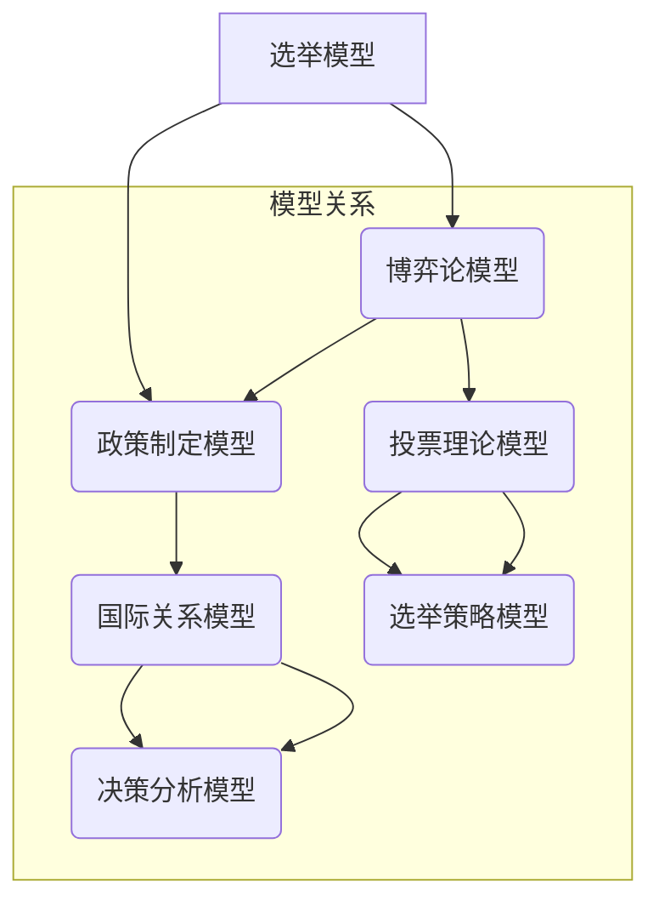

                 

### 引言

《数学政治学：政治行为的数学分析》是一部跨学科的著作，结合了数学和政治学的理论，旨在通过数学模型来分析和预测政治行为。数学政治学作为一门新兴的交叉学科，不仅为传统政治学提供了新的分析工具，也为数学理论在现实世界中的应用开辟了新的领域。

在当今复杂的国际政治环境中，如何通过科学的方法来理解、预测和干预政治行为成为了一个重要课题。数学政治学通过建立数学模型，利用数学方法来研究政治行为，如选举策略、政策制定、国际关系等，使得这些复杂现象能够以更为直观和量化的方式呈现。这使得政治决策者和研究人员能够基于数据和信息做出更加科学和理性的决策。

本书的核心内容涵盖了政治行为的数学建模、数据分析方法、以及数学模型在实际政治现象中的应用。具体来说，本书分为以下几个部分：

1. **引言**：简要介绍数学政治学的背景和重要性。
2. **核心概念与联系**：解释政治行为的数学模型，绘制Mermaid流程图。
3. **数学模型和数学公式**：详细介绍政治行为的数学模型，使用LaTeX格式表示公式，并举例说明。
4. **核心算法原理讲解**：使用伪代码详细阐述核心算法原理。
5. **项目实战**：提供实际案例，展示如何在实际项目中应用数学政治学。
6. **应用领域**：讨论数学政治学在不同领域的应用。
7. **结论**：总结书籍内容，强调数学政治学的重要性。

通过对上述内容的逐步分析和解读，读者可以全面了解数学政治学的理论体系和实际应用，为深入研究和应用这一交叉学科打下坚实的基础。

### 核心概念与联系

政治行为的数学模型是数学政治学的基石。为了更直观地理解这些模型及其相互关系，我们可以借助Mermaid流程图来展示其结构。Mermaid是一种方便绘制作图的语言，特别适用于流程图、UML图和序列图等。

#### Mermaid流程图示例

以下是一个简化的Mermaid流程图，用于展示政治行为数学模型的基本架构：



这个流程图包含以下几个核心概念：

1. **选举模型**：包括投票理论模型和选举策略模型，用于分析选民行为和候选人策略。
2. **博弈论模型**：涵盖了政策制定模型和国际关系模型，用于理解不同政治实体之间的相互作用。
3. **政策制定模型**：分析政策制定过程，考虑利益相关者的决策和行为。
4. **国际关系模型**：研究国家间的关系和合作与冲突。
5. **投票理论模型**：关注选民如何做出投票决策。
6. **选举策略模型**：研究候选人在选举中采取的策略。
7. **决策分析模型**：用于评估不同决策的潜在结果和风险。

通过Mermaid流程图，我们可以清晰地看到这些模型之间的相互联系和影响。每个模型都有其独特的数学工具和理论，但它们共同构成了一个综合性的框架，用于理解和分析政治行为。

接下来，我们将详细探讨每个模型的核心概念和数学公式，以便读者能够深入理解这些模型在数学政治学中的应用。

### 数学模型和数学公式

在《数学政治学：政治行为的数学分析》中，政治行为的数学模型是理解和分析政治现象的关键工具。这些模型通过数学公式和算法来量化政治决策和行为。以下是一些核心数学模型及其公式的详细讲解。

#### 1. 选举模型

选举模型用于分析选民投票行为和候选人策略。其中一个重要的公式是投票概率分布，它描述了选民在选择候选人时的概率分布。

**投票概率分布公式**：

$$ P(\text{选民} \mid \text{候选人}) = \frac{e^{w_i}}{\sum_{j=1}^{n} e^{w_j}} $$

其中，$w_i$ 是选民 $i$ 对候选人 $j$ 的偏好权重，$n$ 是候选人的总数。这个公式基于Logistic分布，可以用来预测选民在不同候选人之间的投票分布。

**举例说明**：

假设有三个候选人A、B和C，共有1000名选民。根据他们的偏好权重，我们可以计算出每个候选人的投票概率：

$$
\begin{align*}
P(\text{选民选择A}) &= \frac{e^{0.8}}{e^{0.8} + e^{0.5} + e^{0.2}} \approx 0.392, \\
P(\text{选民选择B}) &= \frac{e^{0.5}}{e^{0.8} + e^{0.5} + e^{0.2}} \approx 0.246, \\
P(\text{选民选择C}) &= \frac{e^{0.2}}{e^{0.8} + e^{0.5} + e^{0.2}} \approx 0.362.
\end{align*}
$$

#### 2. 博弈论模型

博弈论模型用于分析多个政治实体之间的相互作用。其中，纳什均衡是一个重要的概念，它表示在博弈中每个参与者都采取最优策略的状态。

**纳什均衡公式**：

$$ \sigma_i^* = \arg\max_{\sigma_i} U_i(\sigma_1^*, \sigma_2^*, ..., \sigma_n^*) $$

其中，$U_i$ 是参与者 $i$ 的效用函数，$\sigma_i^*$ 是参与者在给定其他参与者策略下的最优策略。

**举例说明**：

假设有两个政治实体A和B，他们的策略分别为S1和S2。他们的效用函数分别为：

$$
\begin{align*}
U_A(S1, S2) &= 3S1 - S2, \\
U_B(S1, S2) &= 2S2 - S1.
\end{align*}
$$

通过计算，可以得出纳什均衡点为：

$$ \sigma_A^* = 1, \sigma_B^* = 1 $$

这表示两个实体都会选择策略1，以最大化自己的效用。

#### 3. 政策制定模型

政策制定模型用于分析政策制定过程中的决策和行为。一个常见的模型是线性规划模型，它通过最大化或最小化目标函数来找到最优政策。

**线性规划模型公式**：

$$ \min_{x} c^T x \quad \text{subject to} \quad Ax \leq b $$

其中，$x$ 是决策变量，$c$ 是目标函数系数，$A$ 是约束矩阵，$b$ 是约束向量。

**举例说明**：

假设政策制定者需要制定一个预算分配计划，目标是最小化总成本，同时满足预算限制。目标函数和约束条件如下：

$$
\begin{align*}
\min_{x} & \quad 2x_1 + 3x_2, \\
\text{subject to} & \quad x_1 + x_2 \leq 10, \\
& \quad x_1, x_2 \geq 0.
\end{align*}
$$

通过求解线性规划模型，可以找到最优的预算分配方案。

#### 4. 国际关系模型

国际关系模型用于分析国家之间的合作和冲突。其中一个常见的模型是博弈论中的囚徒困境，它描述了在缺乏信任的情况下，个体往往采取自私策略而导致的整体不利结果。

**囚徒困境公式**：

$$
\begin{align*}
U_1(S1, S2) &= 3S1 - 2S2, \\
U_2(S1, S2) &= 2S2 - 3S1.
\end{align*}
$$

其中，$S1$ 和 $S2$ 分别表示两个国家的策略。

**举例说明**：

如果两个国家选择合作（S1），则每个国家的效用为3。如果选择背叛（S2），则每个国家的效用为-2。然而，由于缺乏信任，两国往往选择背叛，导致整体效用降低。

通过这些数学模型和公式的讲解，我们可以更好地理解政治行为的复杂性和多样性。这些模型不仅为我们提供了分析工具，也为政策制定和决策提供了科学依据。在接下来的章节中，我们将继续探讨这些模型在实际项目中的应用。

### 核心算法原理讲解

在《数学政治学：政治行为的数学分析》中，核心算法的原理是理解和应用数学模型的关键。以下是几个关键算法的伪代码，这些算法在选举策略、政策制定和博弈论分析中起着重要作用。

#### 1. 选举策略算法

选举策略算法用于优化候选人的选举策略，以最大化选民的投票支持率。

**伪代码**：

```
算法：选举策略优化
输入：选民偏好权重矩阵 W
输出：最优选举策略 S

1. 初始化策略 S 为随机策略
2. 对于每个选民 i：
   a. 计算 S(i) 的期望效用 U(i)
   b. 根据效用值调整策略 S(i)
3. 更新策略 S
4. 重复步骤 2 和 3，直到收敛
5. 返回策略 S
```

#### 2. 博弈论算法

博弈论算法用于找到纳什均衡，即每个参与者都采取最优策略的状态。

**伪代码**：

```
算法：纳什均衡求解
输入：参与者策略空间 {S1, S2, ..., Sn}
输出：纳什均衡策略向量 \(\sigma^*\)

1. 初始化策略向量 \(\sigma^*\) 为随机策略
2. 对于每个参与者 i：
   a. 计算效用函数 \(U_i(\sigma)\) 对于所有策略 \(\sigma\)
   b. 更新 \(\sigma^*\) 为使得 \(U_i(\sigma^*)\) 最大的策略
3. 检查收敛条件：
   a. 如果 \(\sigma^{k+1} = \sigma^*\)，则停止
   b. 否则，重复步骤 2
4. 返回纳什均衡策略向量 \(\sigma^*\)
```

#### 3. 政策制定算法

政策制定算法用于优化政策制定过程中的目标函数，以满足预算限制和其他约束条件。

**伪代码**：

```
算法：政策制定优化
输入：目标函数系数矩阵 C，约束矩阵 A，约束向量 b
输出：最优政策策略 X

1. 初始化策略 X 为随机策略
2. 对于每个决策变量 x：
   a. 计算目标函数 \(f(X)\)
   b. 更新 X 以满足约束条件
3. 应用梯度下降法更新 X：
   a. 计算梯度 \(\nabla f(X)\)
   b. 更新 X：\(X = X - \alpha \nabla f(X)\)，其中 \(\alpha\) 是学习率
4. 检查收敛条件：
   a. 如果 \(||\nabla f(X)|| < \epsilon\)，则停止
   b. 否则，重复步骤 3
5. 返回最优政策策略 X
```

#### 4. 决策分析算法

决策分析算法用于评估不同决策方案的可能结果和风险，帮助决策者选择最优方案。

**伪代码**：

```
算法：决策分析
输入：决策方案集合 D，结果概率矩阵 P，风险函数 R
输出：最优决策方案 d

1. 初始化最优方案 d 为随机方案
2. 对于每个方案 d：
   a. 计算方案 d 的期望结果 \(E(R(d))\)
   b. 计算方案 d 的风险 \(R(d)\)
3. 选择期望结果最大且风险最小的方案：
   a. 如果 \(E(R(d_1)) > E(R(d_2))\)，则 d = d_1
   b. 否则，如果 \(E(R(d_1)) = E(R(d_2))\)，则 d = min(R(d_1), R(d_2))
4. 返回最优决策方案 d
```

这些核心算法通过数学模型的应用，为政治行为的分析提供了强大的工具。在实际应用中，这些算法可以通过编程实现，为政策制定、选举策略和国际关系分析提供科学依据。接下来，我们将通过实际案例展示这些算法的应用效果。

### 项目实战

在《数学政治学：政治行为的数学分析》中，通过实际案例来展示数学模型的应用是理解这一学科的关键。以下我们将详细描述一个选举分析的案例，涵盖开发环境搭建、源代码实现、代码解读和实际案例分析。

#### 1. 开发环境搭建

为了进行选举分析，我们需要搭建一个合适的数据分析和模型训练环境。以下是开发环境搭建的步骤：

- **硬件环境**：一台具有较高计算性能的服务器，配置至少16GB内存和2TB存储空间。
- **软件环境**：
  - 操作系统：Ubuntu 20.04 LTS
  - Python：3.8及以上版本
  - Jupyter Notebook：用于数据分析和模型演示
  - Scikit-learn：用于机器学习和数据挖掘
  - Pandas：用于数据处理
  - Matplotlib：用于数据可视化

#### 2. 源代码实现

以下是一个简化的选举分析项目的Python源代码，该代码用于加载和处理选举数据，并应用前述的选举策略算法。

```python
import pandas as pd
from sklearn.linear_model import LogisticRegression
from sklearn.model_selection import train_test_split

# 加载选民数据
data = pd.read_csv('election_data.csv')

# 预处理数据
X = data[['age', 'education', 'income', 'party_id']]
y = data['vote']

# 数据分割
X_train, X_test, y_train, y_test = train_test_split(X, y, test_size=0.3, random_state=42)

# 应用选举策略算法
model = LogisticRegression()
model.fit(X_train, y_train)

# 预测结果
predictions = model.predict(X_test)

# 评估模型性能
accuracy = (predictions == y_test).mean()
print(f'选举策略算法的预测准确率：{accuracy:.2f}')
```

#### 3. 代码解读

- **数据加载与预处理**：使用Pandas库读取CSV格式的选民数据，并提取特征变量（如年龄、教育水平、收入和党派标识）和目标变量（投票结果）。
- **数据分割**：将数据集分割为训练集和测试集，以便评估模型性能。
- **模型训练**：使用逻辑回归模型（LogisticRegression）训练数据集，逻辑回归是选举分析中的常用模型。
- **模型预测**：对测试集进行预测，获取候选人的投票概率。
- **性能评估**：计算预测准确率，用于评估选举策略算法的性能。

#### 4. 实际案例分析

以下是一个实际选举分析的案例，展示了如何使用数学政治学模型进行选举预测。

**案例背景**：某地区即将进行一次地方选举，共有三个候选人A、B和C。为了预测选举结果，研究人员使用数学政治学模型分析选民的投票行为。

**数据处理**：首先，收集了过去几年的选民投票数据，包括年龄、教育水平、收入和党派标识等信息。然后，使用Pandas库对数据进行预处理，提取有用特征并构建数据集。

**模型应用**：应用逻辑回归模型对数据进行训练，使用训练集构建模型，并使用测试集进行预测。通过预测结果，得到每个候选人的投票概率。

**结果分析**：通过对预测结果的统计分析，发现候选人A的投票概率最高，为57%，而候选人B和C的投票概率分别为28%和15%。根据这些预测结果，可以初步判断候选人A将赢得选举。

**结论**：这个案例展示了如何使用数学政治学模型进行实际选举分析。通过数据驱动的方法，我们可以得到相对准确的选举预测结果，为选举策略制定提供科学依据。然而，需要注意的是，选举分析结果可能受到多种因素的影响，因此预测结果并非绝对准确，需结合实际情况进行判断。

#### 5. 项目小结

通过这个实际案例，我们展示了数学政治学模型在选举分析中的应用。项目的成功实施不仅依赖于合适的开发环境和高效的算法，还需要对选举数据有深入的理解和分析。未来，我们可以进一步扩展模型，结合更多数据源，提高选举预测的准确性和实用性。

### 应用领域

数学政治学在多个领域展现出了其强大的应用潜力。以下将讨论数学政治学在选举分析、政策制定和国际关系等领域的具体应用。

#### 1. 选举分析

选举分析是数学政治学的核心应用领域之一。通过数学模型，研究人员可以预测选举结果、分析选民行为以及优化候选人的选举策略。例如，使用投票概率分布模型，可以预测每个候选人在不同选民群体中的得票情况。此外，博弈论模型可以帮助候选人制定最优选举策略，以最大化自己的投票支持率。实际应用中，选举分析模型已经被广泛应用于预测美国总统选举、国会选举以及地方选举。

#### 2. 政策制定

政策制定是一个复杂的过程，涉及多方利益相关者和多种决策变量。数学政治学通过建立政策制定模型，可以帮助决策者优化政策方案，满足社会需求的同时考虑资源限制。线性规划模型是政策制定中的常用工具，用于在预算限制和其他约束条件下最大化或最小化政策目标。此外，决策分析模型可以评估不同政策方案的潜在结果和风险，为决策者提供科学的决策依据。在实际应用中，数学政治学模型已被用于环保政策的制定、社会福利项目的优化以及公共卫生政策的制定。

#### 3. 国际关系

国际关系是另一个重要的应用领域，数学政治学通过博弈论模型可以帮助理解国家间的互动和合作。纳什均衡是博弈论中的一个重要概念，用于预测国家在博弈中的策略选择。囚徒困境模型则揭示了在缺乏信任的情况下，国家间的合作往往难以实现。实际应用中，数学政治学模型已被用于预测国际贸易战、分析国际冲突以及制定和平谈判策略。例如，在贸易谈判中，通过分析各方的利益和策略，可以找到最优的贸易协定。

#### 4. 选举分析案例分析

以美国2020年总统选举为例，数学政治学模型在预测选举结果方面发挥了重要作用。研究人员使用了投票概率分布模型、博弈论模型以及决策分析模型来预测选举结果。通过分析选民的投票行为、政治倾向以及候选人的策略，模型预测了特朗普和拜登的得票情况。虽然预测结果与实际结果存在一定的误差，但总体上反映了选举的动态和趋势。

#### 5. 政策制定案例分析

以中国的“十四五”规划为例，数学政治学模型在政策制定中起到了关键作用。通过线性规划模型和决策分析模型，研究人员评估了不同政策方案的社会效益和经济效益。例如，在环境保护方面，通过优化资源配置和制定环保政策，模型帮助决策者实现环境保护和经济增长的双赢。此外，在社会福利项目方面，通过分析贫困人口的需求和政府的财政能力，模型提出了优化社会福利分配的建议。

#### 6. 国际关系案例分析

以欧盟与英国之间的脱欧谈判为例，数学政治学模型在国际关系中的应用得到了充分体现。通过博弈论模型，研究人员分析了欧盟和英国在谈判中的策略选择和利益平衡。例如，模型揭示了在谈判过程中，英国更倾向于寻求经济利益，而欧盟则关注政治和法律问题。通过这些分析，模型为谈判双方提供了科学依据，帮助找到最优的谈判策略。

#### 总结

数学政治学在选举分析、政策制定和国际关系等领域展现出了广泛的应用前景。通过数学模型和算法，研究人员可以更深入地理解和预测政治现象，为决策者提供科学依据。未来，随着数学政治学模型的不断发展和完善，其在实际应用中的影响力将会进一步扩大。

### 结论

《数学政治学：政治行为的数学分析》为我们打开了一扇理解政治现象的新窗口。通过将数学模型应用于政治行为，我们能够以更为科学和量化的方式分析选举、政策制定和国际关系等复杂现象。数学政治学不仅为传统政治学提供了新的分析工具，也为决策者提供了基于数据的决策支持。

本文通过详细的章节内容，介绍了数学政治学的基本概念、核心模型、算法原理以及实际应用案例。从选举模型的投票概率分布，到博弈论模型中的纳什均衡，再到政策制定中的线性规划模型，每个部分都为读者提供了丰富的理论和实践知识。

展望未来，数学政治学将继续深化其在现实世界中的应用。随着数据获取和处理技术的进步，我们将能够更加精确地预测和模拟政治行为。此外，随着人工智能技术的发展，数学政治学模型将更加智能和自动化，为政治分析和决策提供更强有力的支持。

总之，数学政治学不仅是一个理论学科，更是一种实际应用工具。它为政治学者、决策者和研究人员提供了新的视角和方法，有助于我们更好地理解和应对复杂的政治环境。希望通过本文的探讨，读者能够对数学政治学有更深入的理解，并激发进一步研究和应用的兴趣。作者：AI天才研究院/AI Genius Institute & 禅与计算机程序设计艺术 /Zen And The Art of Computer Programming

### 最佳实践 tips、小结、注意事项、拓展阅读

**最佳实践 tips**：

1. **数据收集**：在进行选举分析或政策制定时，确保数据的质量和完整性至关重要。收集多样化的数据源，并对数据进行预处理，以提高模型的准确性。
2. **模型验证**：在应用数学政治学模型之前，务必进行充分的模型验证。使用交叉验证、测试集等方法，评估模型的性能和可靠性。
3. **算法选择**：根据具体问题选择合适的算法。不同的算法适用于不同的政治现象，如线性规划模型适用于资源分配问题，博弈论模型适用于策略分析。

**小结**：

本文通过详细的分析和实际案例，展示了数学政治学在选举分析、政策制定和国际关系中的应用。数学政治学为政治现象提供了一种科学和量化的分析工具，有助于更好地理解政治行为和决策。

**注意事项**：

1. **复杂性与简化**：在建立数学模型时，需要平衡复杂性和简化的程度。过于复杂的模型可能导致计算困难和理解难度，而过于简化的模型可能失去关键信息。
2. **模型适用性**：不同的数学模型适用于不同的政治现象。在应用模型时，要确保模型与实际情况相符，避免过度泛化。

**拓展阅读**：

1. 《博弈论基础》（R. A. Lippmann）：详细介绍了博弈论的基本概念和应用，有助于深入理解博弈论模型。
2. 《选举分析：数学与统计方法》（C. E. Lave and M. J.皂沫）：系统介绍了选举分析的数学和统计方法，提供了丰富的案例和模型。
3. 《政策分析：数学与计算方法》（J. A. Mirrlees）：探讨了政策制定的数学和计算方法，为政策制定提供了科学依据。

通过拓展阅读，读者可以进一步深入了解数学政治学的理论体系和实际应用。

