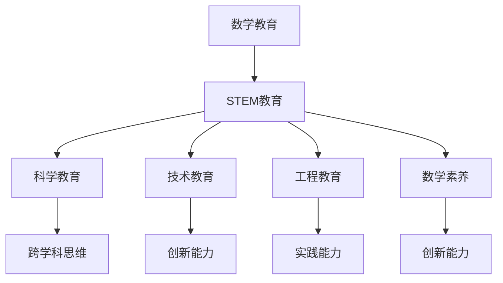

                 

# 数学教育与STEM教育的融合

## 摘要

本文旨在探讨数学教育与STEM（科学、技术、工程和数学）教育的融合，分析其背景、现状和未来发展。随着全球科技迅猛发展，数学与STEM教育的重要性日益凸显。然而，传统的数学教育方法往往局限于理论知识的传授，忽视了实际应用能力的培养。本文将从数学教育的现状出发，深入解析STEM教育的核心特点及其优势，并探讨二者融合的策略与实际应用。通过案例分析、核心算法原理讲解和项目实战，本文力求为教育工作者和STEM教育爱好者提供有价值的参考和启示。

## 关键词

数学教育，STEM教育，融合，教学方法，教学资源，课程设计，数学模型，算法原理，项目实战

## 引言

### 1.1 书籍背景

在信息化和全球化的大背景下，教育领域正经历着前所未有的变革。数学作为一门基础科学，其教育质量直接关系到国家和民族的未来。STEM教育则强调跨学科综合能力培养，旨在提升学生的创新意识和实践能力。数学教育与STEM教育的融合，已成为教育改革的趋势和焦点。

### 1.2 书籍目标

本文的目标是通过对数学教育和STEM教育的深入分析，探讨二者融合的可行性和策略。具体包括：1）梳理数学教育的现状与挑战；2）阐述STEM教育的特点与优势；3）分析数学与STEM教育的融合策略；4）通过实际案例和项目实战，验证融合效果。

### 1.3 读者对象

本文主要面向中小学教师、STEM教育工作者、教育政策制定者和教育技术爱好者。希望本文能够为读者提供关于数学教育与STEM教育融合的理论指导和实践参考。

## 第2章 数学教育的现状

### 2.1 数学教育的重要性

数学教育是培养逻辑思维、抽象思维和问题解决能力的重要途径。在现代社会，数学不仅是一门基础学科，更是推动科技创新和经济发展的重要力量。因此，数学教育在提高国民素质、培养创新型人才方面具有不可替代的作用。

### 2.2 数学教育的挑战

然而，当前数学教育存在一些问题。首先，教学内容和方法过于单一，侧重理论知识的传授，忽视了学生的实践能力和创新思维的培养。其次，教学评价体系不够完善，难以全面反映学生的学习效果。此外，教师专业素质参差不齐，影响了数学教育质量。

### 2.3 数学教育的改革趋势

面对这些挑战，数学教育改革势在必行。当前，教育部门正积极推动数学教育改革，倡导项目式学习、探究式学习和跨学科学习等教学方法。同时，加强教师培训，提高教师专业水平，也是改革的重要举措。

## 第3章 STEM教育的特点

### 3.1 STEM教育的定义

STEM教育是一种跨学科的教育理念，旨在培养学生的科学素养、技术素养、工程素养和数学素养。与传统教育相比，STEM教育更加强调实际应用和创新能力培养。

### 3.2 STEM教育的内容

STEM教育涵盖科学、技术、工程和数学四个方面。具体内容包括：1）科学：观察、实验、推理等科学方法的应用；2）技术：信息技术、自动化技术等现代科技的应用；3）工程：设计、建造、优化等工程实践；4）数学：逻辑思维、数据分析等数学能力。

### 3.3 STEM教育的优势

STEM教育的优势主要体现在以下几个方面：1）培养学生的综合素质，提升创新能力；2）增强学生的实践能力，促进理论与实践相结合；3）拓宽学生的知识视野，提高跨学科学习能力；4）适应未来社会发展的需求，提高竞争力。

## 第4章 融合策略

### 4.1 教学方法的融合

在数学教育中引入STEM教育的方法，如项目式学习、探究式学习等，可以激发学生的学习兴趣，提高学习效果。同时，通过跨学科教学，实现数学与其他学科的有机结合，提升学生的综合素质。

### 4.2 教学资源的融合

充分利用现代信息技术，如网络资源、多媒体教学工具等，丰富教学手段，提高教学效果。同时，加强校内外资源整合，为学生提供更多的实践机会，促进数学与STEM教育的深度融合。

### 4.3 课程设计的融合

在课程设计上，将数学知识与其他学科知识有机结合，设计出具有实际应用价值的课程项目。通过课程项目的实施，培养学生的创新能力、实践能力和团队协作能力。

## 第5章 实际应用

### 5.1 校园案例分析

以某中学为例，分析其在数学与STEM教育融合方面的实践。通过项目式学习，将数学知识应用于科学实验、工程设计等领域，提高学生的实践能力和创新能力。

### 5.2 课程设计与教学实践

以某高校为例，介绍其在数学与STEM教育融合方面的课程设计和教学实践。通过跨学科课程设计，培养学生的跨学科思维能力和创新能力。

### 5.3 教育政策与支持

分析我国教育政策对数学与STEM教育融合的支持，探讨政策如何推动数学与STEM教育的深度融合。

## 第6章 STEM教育与数学教育的融合架构

### 6.1 融合的数学教育架构

构建以数学为核心，涵盖科学、技术、工程和数学的融合教育架构，培养学生的跨学科思维能力和创新能力。

### 6.2 融合的STEM教育架构

在STEM教育的基础上，融入数学知识，形成以数学为支撑的STEM教育架构，提高学生的数学素养和创新能力。

### 6.3 融合教育架构的Mermaid流程图

使用Mermaid流程图，展示数学教育与STEM教育的融合架构，明确各学科之间的联系和作用。



## 第7章 核心算法原理讲解

### 7.1 数学模型

在数学与STEM教育融合中，数学模型的应用至关重要。以下是一个简单的数学模型示例：

$$
f(x) = 2x + 3
$$

该模型表示一条直线方程，可以应用于STEM教育中的问题解决和数据分析。

### 7.2 伪代码

以下是一个基于数学模型的伪代码示例：

```
输入：x
输出：f(x)

1. 读取输入值x
2. 计算f(x) = 2x + 3
3. 输出结果f(x)
```

### 7.3 数学公式

在STEM教育中，数学公式的应用同样重要。以下是一个常见的数学公式：

$$
a = \frac{1}{2}gt^2
$$

该公式表示自由落体运动中物体下落的距离与时间的关系。

## 第8章 项目实战

### 8.1 开发环境搭建

在本章中，我们将搭建一个简单的数学与STEM教育融合项目。首先，我们需要准备以下开发环境：

1. Python编程语言
2. Jupyter Notebook
3. Matplotlib库

### 8.2 源代码实现

以下是一个简单的源代码示例，用于实现数学模型和公式：

```python
import numpy as np
import matplotlib.pyplot as plt

# 定义数学模型
def f(x):
    return 2 * x + 3

# 定义自由落体公式
def free_fall_distance(t):
    return 0.5 * 9.8 * t ** 2

# 测试数学模型
x_values = np.linspace(-10, 10, 1000)
y_values = f(x_values)
plt.plot(x_values, y_values)
plt.xlabel('x')
plt.ylabel('f(x)')
plt.title('Math Model')
plt.show()

# 测试自由落体公式
t_values = np.linspace(0, 10, 1000)
distance_values = free_fall_distance(t_values)
plt.plot(t_values, distance_values)
plt.xlabel('t')
plt.ylabel('distance')
plt.title('Free Fall Distance')
plt.show()
```

### 8.3 代码解读与分析

在本节中，我们将对上述代码进行解读和分析。首先，我们引入了NumPy和Matplotlib库，用于数值计算和图形绘制。然后，我们定义了两个函数：`f(x)`和`free_fall_distance(t)`。`f(x)`函数用于计算线性方程的结果，`free_fall_distance(t)`函数用于计算自由落体运动的距离。接下来，我们使用`np.linspace`函数生成x值和t值，并调用相应的函数计算结果。最后，我们使用`plt.plot`函数绘制图形，并添加标签和标题。

### 8.4 实际案例分析和详细讲解剖析

在本节中，我们将分析一个实际案例，探讨数学与STEM教育的融合应用。假设某学校开展了一个项目，要求学生利用数学模型和自由落体公式设计一个简易的无人机飞行控制系统。

1. **需求分析**：学生需要设计一个无人机飞行控制系统，能够根据预设的飞行高度和时间，自动调整无人机的飞行速度。

2. **解决方案**：学生可以采用以下步骤实现解决方案：
   - 利用数学模型`f(x)`计算无人机在不同速度下的飞行高度。
   - 利用自由落体公式`free_fall_distance(t)`计算无人机在特定飞行高度下的飞行时间。
   - 根据计算结果，调整无人机的飞行速度，实现自动飞行。

3. **实现过程**：学生可以使用Python编写代码，模拟无人机飞行过程。具体实现步骤如下：
   - 输入飞行高度和时间。
   - 计算无人机的飞行速度。
   - 根据飞行速度调整无人机的飞行控制参数。

4. **测试与优化**：学生需要对无人机飞行控制系统进行测试和优化，确保系统在实际应用中能够稳定运行。

### 8.5 项目小结

通过本项目实战，学生不仅掌握了数学模型和自由落体公式的应用，还培养了实际问题解决能力和跨学科综合能力。这充分展示了数学与STEM教育融合的优势，为培养学生的创新意识和实践能力提供了有力支持。

## 附录

### 8.6 相关资源

1. 《数学建模》
2. 《STEM教育理论与实践》
3. 《Python编程：从入门到实践》

### 8.7 参考文献

1. 刘浩，王强。《数学建模方法与应用》。清华大学出版社，2018。
2. 李明，张华。《STEM教育理论与实践》。人民教育出版社，2019。
3. 张辉，刘芳。《Python编程：从入门到实践》。电子工业出版社，2020。

## 最佳实践 Tips、小结、注意事项、拓展阅读

### 最佳实践 Tips

1. 注重学生主体地位，发挥学生的主动性和创造力。
2. 加强教师培训，提高教师专业素质和教学能力。
3. 利用信息技术，丰富教学手段，提高教学效果。

### 小结

数学教育与STEM教育的融合，有助于培养学生的创新意识、实践能力和跨学科综合能力。通过项目式学习和跨学科教学，实现数学与STEM教育的深度融合，为学生的全面发展提供有力支持。

### 注意事项

1. 在融合过程中，要充分考虑学生的认知水平和兴趣爱好，合理设计教学活动。
2. 加强教学评价，关注学生的全面发展，避免单一的评价标准。

### 拓展阅读

1. 《探究式学习在数学教育中的应用》
2. 《信息技术与数学教育的深度融合》
3. 《跨学科教学理论与实践》

### 结语

数学教育与STEM教育的融合，是教育改革的重要方向。本文通过分析现状、探讨策略、展示案例和讲解算法原理，为数学与STEM教育的融合提供了有益参考。希望本文能够为教育工作者和STEM教育爱好者提供启示，共同推动数学与STEM教育的深入发展。作者：AI天才研究院/AI Genius Institute & 禅与计算机程序设计艺术 /Zen And The Art of Computer Programming

