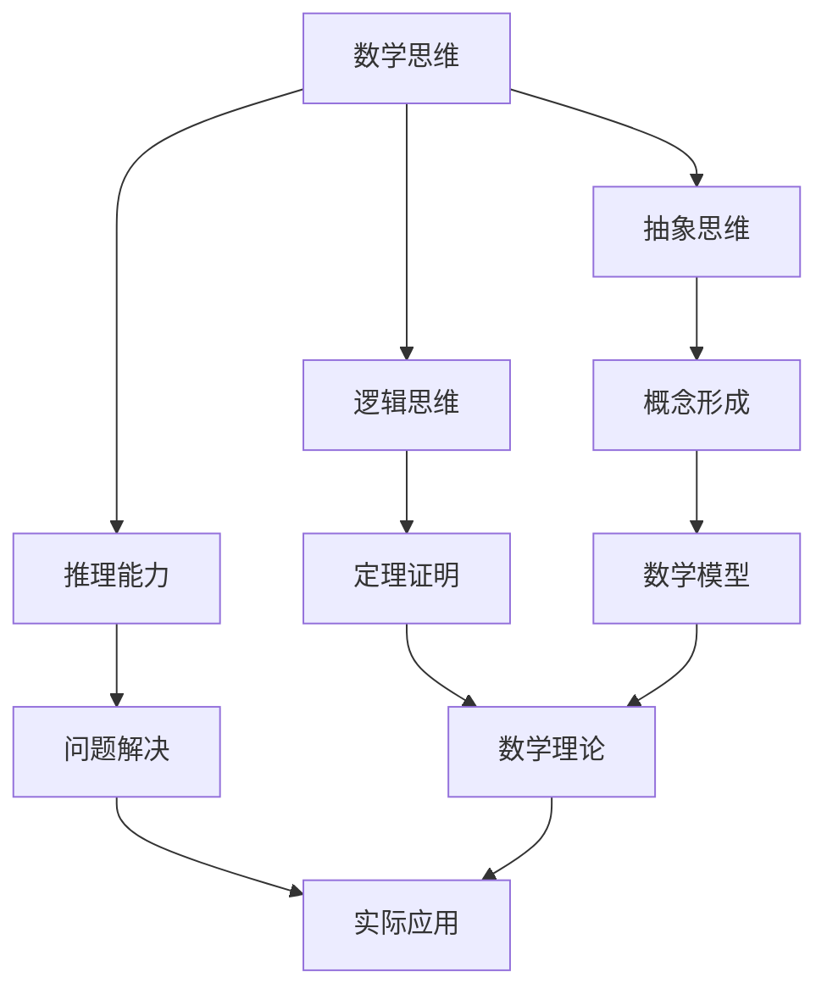
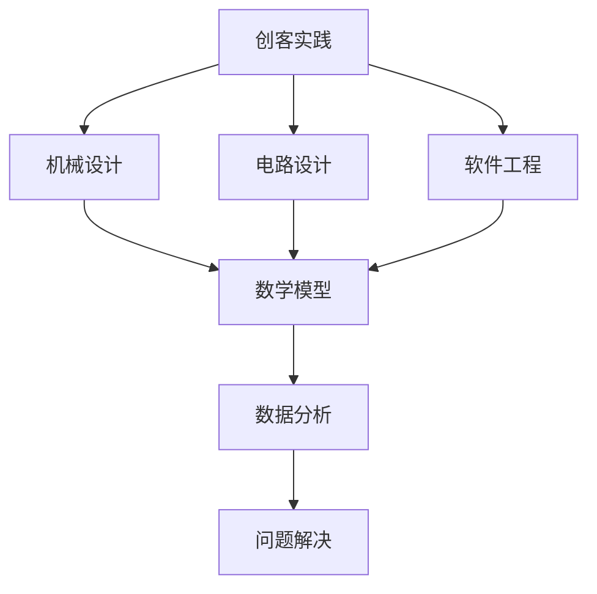
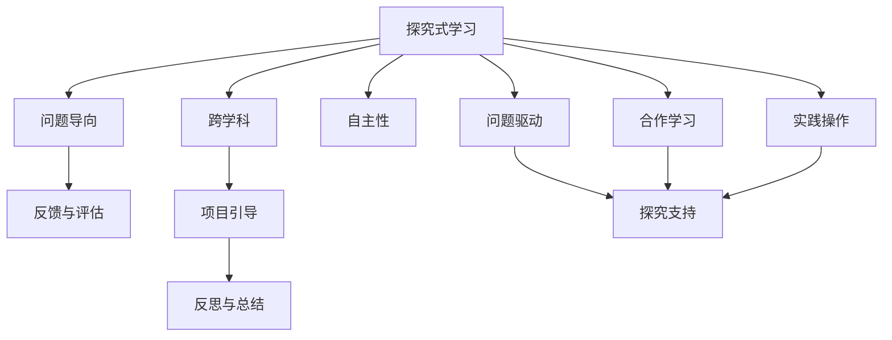
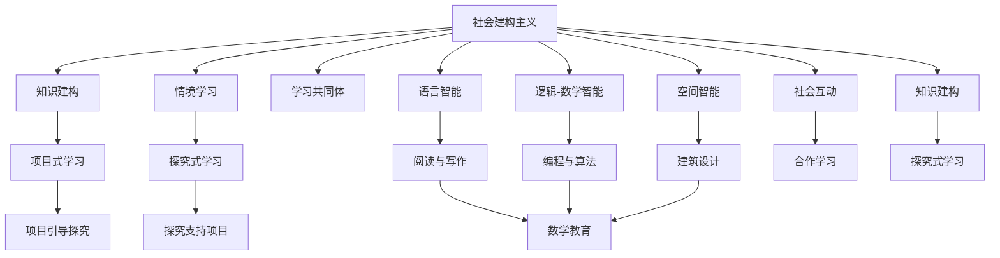
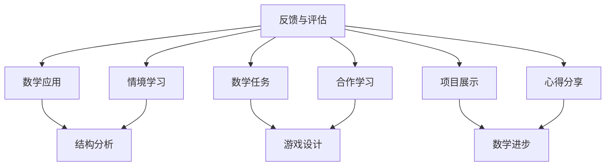

                 

### 数学教育与创客空间的课程设计

**关键词**：数学教育、创客空间、课程设计、项目式学习、探究式学习

**摘要**：
本文旨在探讨数学教育在创客空间中的课程设计，分析数学教育在创客空间中的重要性、挑战与机遇。文章将首先概述创客空间的定义、发展和核心特征，然后深入讨论数学教育在其中的应用。接着，我们将引入数学教育中的关键概念，并通过Mermaid流程图展示这些概念之间的关系。文章随后将描述创客空间课程设计的原理，结合具体课程案例展示数学教育在创客空间中的应用。最后，我们将分析实际项目案例，总结课程设计实践与反思，并探讨未来发展趋势。

### 第一部分：数学教育在创客空间中的概述

#### 1.1 创客空间的概念与发展

创客空间，也称为“创客实验室”或“创客工坊”，是一种以创新和创造为核心的学习环境。它通常配备了各种工具、材料和设备，供学生或爱好者进行创新项目的设计和制作。创客空间的概念起源于20世纪末的美国，随后在全球范围内迅速传播。根据美国国家教育统计中心（NCES）的报告，到2020年，全球已有超过6000个正式注册的创客空间。

创客空间的核心特征包括：

1. **开放性**：创客空间通常对所有人开放，无论年龄、背景或技能水平。
2. **协作性**：创客空间鼓励成员之间的合作与交流，共同解决问题和实现项目。
3. **实践性**：创客空间强调实际操作和动手能力，鼓励成员通过实践学习知识。
4. **多样性**：创客空间中的项目和活动涵盖多个领域，如工程、设计、艺术等。

创客空间的发展经历了几个阶段：

1. **初期阶段**：以个人爱好和DIY（自己动手做）为核心。
2. **发展阶段**：随着技术的进步和互联网的普及，创客空间逐渐成为教育和创新的重要平台。
3. **成熟阶段**：创客空间开始与教育机构、企业、政府等合作，形成更为完善的生态系统。

#### 1.2 数学教育的重要性与挑战

数学教育在创客空间中的重要性不言而喻。数学不仅是科学和技术的基石，也是培养逻辑思维和问题解决能力的重要工具。在创客空间中，数学不仅用于设计和分析项目，还用于理解复杂的系统和技术。以下是一些具体的应用场景：

1. **工程与设计**：在创客空间中，成员常常需要使用数学原理来设计和构建机械结构、电路板、软件系统等。
2. **数据分析**：创客空间中的项目往往产生大量数据，需要使用数学方法进行分析和可视化。
3. **编程与算法**：编程本身就是一种数学活动，创客空间中的编程项目需要应用数学知识来优化代码和算法。

然而，数学教育也面临一些挑战：

1. **学习难度**：数学概念和理论往往较为抽象，不易理解。
2. **应用难度**：将数学知识应用于实际问题需要一定的实践经验和技巧。
3. **教学方法**：传统的数学教育方法强调记忆和计算，而创客空间需要更多注重实践和应用。

#### 1.3 数学教育在创客空间中的应用前景

数学教育在创客空间中的应用前景广阔。一方面，创客空间提供了丰富的实践机会，使数学学习更加生动和具体。另一方面，数学知识在创客空间中的应用可以激发学生的学习兴趣和创造力。以下是一些应用前景：

1. **项目式学习**：通过设计数学相关的项目，学生可以在实践中学习数学知识，如数学建模、算法设计等。
2. **探究式学习**：学生可以自主探究数学问题，通过实验和数据分析来发现和理解数学原理。
3. **跨学科学习**：数学教育可以与其他学科如物理、工程、计算机科学等相结合，形成跨学科的学习体验。
4. **创新与创业**：数学知识在创客空间中的创新项目中扮演关键角色，有助于培养创新思维和创业能力。

### 第二部分：数学教育核心概念与联系

#### 2.1 数学思维与数学方法

数学思维是数学教育的重要组成部分。它包括抽象思维、逻辑思维、推理能力等。数学方法则是实现数学思维的工具，包括公理法、归纳法、反证法等。数学思维和数学方法之间的关系可以理解为：

- **数学思维**：是解决问题的指导思想，强调从抽象的数学概念出发，通过逻辑推理解决实际问题。
- **数学方法**：是实现数学思维的具体手段，通过特定的方法来验证或推翻某个假设。

以下是一个Mermaid流程图，展示数学思维和数学方法之间的关系：



#### 2.2 数学模型与创客实践

数学模型是将现实世界中的问题抽象成数学形式的过程。在创客实践中，数学模型可以用于设计、分析和优化项目。以下是一个简单的数学模型示例，用于分析一个杠杆系统的平衡条件：

```latex
$$
F_1 \cdot L_1 = F_2 \cdot L_2
$$

其中，\(F_1\) 和 \(F_2\) 分别为杠杆两端的力，\(L_1\) 和 \(L_2\) 分别为杠杆两端的力臂长度。
```

数学模型在创客实践中的应用包括：

1. **机械设计**：使用数学模型进行机械结构的强度和稳定性分析。
2. **电路设计**：使用数学模型分析电路的电压、电流和电阻。
3. **软件工程**：使用数学模型进行算法分析和性能优化。

以下是一个Mermaid流程图，展示数学模型与创客实践之间的关系：



#### 2.3 Mermaid流程图展示概念联系

为了更好地展示数学思维、数学方法、数学模型之间的关系，我们可以使用Mermaid流程图。以下是一个示例：


通过这个流程图，我们可以清晰地看到数学教育中的核心概念是如何相互关联和作用的。

### 第三部分：创客空间课程设计原理

#### 3.1 项目式学习与探究式学习

创客空间课程设计的一个重要原则是采用项目式学习和探究式学习。这两种学习方式能够有效激发学生的兴趣和创造力，同时培养他们的实践能力和解决问题的能力。

**项目式学习**（Project-Based Learning, PBL）是一种以学生为中心的学习方法，强调通过实际项目来学习知识。项目式学习的核心特征包括：

1. **问题导向**：学生通过解决真实问题来学习知识。
2. **跨学科**：项目通常涉及多个学科领域，促进跨学科知识的整合。
3. **自主性**：学生拥有一定的自主权，可以自主决定项目的方向和进度。
4. **反馈与评估**：学生在完成项目后，会接受教师和其他同学的反馈，并进行自我评估。

**探究式学习**（Inquiry-Based Learning, IBL）是一种以探究为导向的学习方法，强调学生通过自主探究来发现和理解知识。探究式学习的核心特征包括：

1. **问题驱动**：学生通过提出问题和解决疑问来学习知识。
2. **合作学习**：学生通常需要与同伴合作，共同解决问题。
3. **实践操作**：学生在探究过程中需要进行实践操作，以验证或推翻假设。
4. **反思与总结**：学生在探究后需要反思自己的学习过程，并总结经验教训。

**项目式学习与探究式学习的结合**：

在创客空间课程设计中，项目式学习和探究式学习可以相互结合，形成一种综合性的学习模式。具体来说：

1. **项目引导探究**：在项目初期，学生可以通过探究来了解项目的背景和目标，明确自己的研究方向。
2. **探究支持项目**：在项目实施过程中，学生可以通过探究来解决问题，优化项目方案。
3. **反思与总结**：在项目完成后，学生可以反思自己的学习过程，总结项目中的收获和不足。

以下是一个Mermaid流程图，展示项目式学习和探究式学习的结合方式：



#### 3.2 创客空间课程设计的理论基础

创客空间课程设计的理论基础包括建构主义学习理论、多元智能理论和社会建构主义等。

**建构主义学习理论**：

建构主义学习理论认为，知识不是通过教师的传授获得的，而是学生在一定情境下，借助其他人的帮助，通过意义建构获得的。建构主义学习理论的核心观点包括：

1. **知识建构**：学生通过将新信息与已有知识相联系，主动建构知识。
2. **情境学习**：知识建构发生在具体的情境中，学生需要通过实际操作来学习。
3. **学习共同体**：学生在一个共同的学习环境中，通过与他人的交流和合作，共同建构知识。

**多元智能理论**：

多元智能理论是由心理学家霍华德·加德纳提出的，认为人类拥有多种智能，包括语言智能、逻辑-数学智能、空间智能、身体-运动智能、音乐智能、人际智能、自我认知智能和自然认知智能等。创客空间课程设计可以结合多元智能理论，设计多样化的学习活动，以满足学生的不同智能需求。

**社会建构主义**：

社会建构主义认为，知识是在社会互动中建构的，学习是一个社会文化过程。创客空间提供了一个良好的社会文化环境，学生可以通过合作、交流和共享来建构知识。

以下是一个Mermaid流程图，展示创客空间课程设计的理论基础：



#### 3.3 数学知识与创客实践的融合

在创客空间课程设计中，如何将数学知识与创客实践相结合是一个关键问题。以下是一些具体的方法：

1. **项目引导**：通过设计数学相关的项目，引导学生主动应用数学知识。例如，设计一个机械结构项目，学生需要使用数学方法进行结构分析。
2. **情境学习**：将数学知识融入到具体的情境中，让学生在解决问题的过程中学习数学。例如，在电路设计中，学生需要使用数学模型来分析电路的电压、电流和电阻。
3. **任务驱动**：设计一些任务，让学生通过完成任务来学习数学知识。例如，设计一个游戏项目，学生需要使用数学方法来设计游戏规则。
4. **合作学习**：鼓励学生进行合作学习，共同解决数学问题。例如，在团队项目中，学生可以分工合作，分别负责不同的数学任务。
5. **反馈与评估**：通过定期的反馈和评估，帮助学生了解自己在数学学习中的进步和不足。例如，在项目完成后，教师可以组织学生进行项目展示和讨论，让学生分享自己在数学学习中的心得体会。

以下是一个Mermaid流程图，展示数学知识与创客实践的融合方式：



### 第四部分：数学教育在创客空间课程中的应用

#### 4.1 课程案例一：数学逻辑思维培养

**课程目标**：培养学生的数学逻辑思维能力，提高他们解决复杂问题的能力。

**课程内容**：

1. **数理逻辑基础**：介绍数理逻辑的基本概念，如命题、逻辑运算、推理规则等。
2. **命题逻辑应用**：通过设计逻辑谜题和逻辑游戏，让学生练习逻辑推理能力。
3. **谓词逻辑应用**：通过设计复杂的逻辑问题，让学生应用谓词逻辑解决实际问题。

**实施方法**：

1. **项目式学习**：设计一个逻辑游戏项目，让学生通过设计和分析游戏规则来学习命题逻辑。
2. **探究式学习**：让学生自主探究谓词逻辑的应用，解决现实生活中的逻辑问题。
3. **情境学习**：通过模拟现实场景，让学生在解决问题的过程中应用数学逻辑。

**评估标准**：

1. **知识掌握程度**：通过测验和作业评估学生对数理逻辑知识的掌握程度。
2. **问题解决能力**：通过项目展示和讨论评估学生解决复杂问题的能力。
3. **团队合作能力**：通过团队合作项目的表现评估学生的合作能力。

#### 4.2 课程案例二：数学建模与机器学习

**课程目标**：培养学生运用数学建模和机器学习技术解决实际问题的能力。

**课程内容**：

1. **数学建模基础**：介绍数学建模的基本概念和方法，如线性规划、非线性规划、微分方程等。
2. **机器学习基础**：介绍机器学习的基本概念和技术，如监督学习、无监督学习、强化学习等。
3. **应用案例**：通过具体案例，展示如何使用数学建模和机器学习解决实际问题。

**实施方法**：

1. **项目式学习**：设计一个应用案例项目，让学生通过实际操作学习数学建模和机器学习技术。
2. **探究式学习**：让学生自主设计并实现一个机器学习模型，解决特定问题。
3. **情境学习**：通过模拟现实场景，让学生在解决问题的过程中应用数学建模和机器学习。

**评估标准**：

1. **模型设计能力**：通过项目展示和讨论评估学生对数学模型的设计能力。
2. **算法实现能力**：通过代码实现和性能评估评估学生实现机器学习算法的能力。
3. **问题解决能力**：通过项目结果和案例分析评估学生解决实际问题的能力。

#### 4.3 课程案例三：数学实验与创新设计

**课程目标**：培养学生的创新能力和实践能力，提高他们运用数学知识进行创新设计的能力。

**课程内容**：

1. **数学实验基础**：介绍数学实验的基本概念和方法，如实验设计、数据分析、可视化等。
2. **创新设计方法**：介绍创新设计的基本方法，如头脑风暴、原型设计、用户测试等。
3. **创新项目案例**：通过具体案例，展示如何运用数学知识进行创新设计。

**实施方法**：

1. **项目式学习**：设计一个创新设计项目，让学生通过实际操作学习数学实验和创新设计方法。
2. **探究式学习**：让学生自主设计并实现一个数学实验，探索新的设计思路。
3. **情境学习**：通过模拟现实场景，让学生在解决问题的过程中应用数学知识和创新设计。

**评估标准**：

1. **实验设计能力**：通过项目展示和讨论评估学生对数学实验的设计能力。
2. **创新设计能力**：通过项目结果和案例分析评估学生运用创新设计方法的能力。
3. **实践能力**：通过实验操作和项目完成情况评估学生的实践能力。

### 第五部分：项目实战与案例分析

#### 5.1 项目案例一：数学游戏设计与开发

**项目背景**：随着游戏产业的发展，数学游戏逐渐成为热门领域。该项目旨在通过设计一个数学游戏，让学生学习并应用数学知识。

**开发环境搭建**：

1. **工具选择**：使用Unity游戏引擎进行游戏开发，使用C#作为编程语言。
2. **环境配置**：安装Unity Hub，创建一个新的Unity项目，并配置开发环境。

**源代码实现**：

1. **游戏逻辑**：设计游戏逻辑，实现数学题目的生成和解答。
2. **用户交互**：设计用户界面，实现用户与游戏之间的交互。
3. **音效与动画**：添加音效和动画效果，提升游戏体验。

**代码解读与分析**：

1. **游戏逻辑代码**：分析游戏逻辑的实现方式，解释数学题目的生成和解答过程。
2. **用户交互代码**：分析用户交互的实现方式，解释用户与游戏之间的交互流程。
3. **音效与动画代码**：分析音效和动画的实现方式，解释其如何提升游戏体验。

**代码应用解读与分析**：

1. **数学知识应用**：分析游戏中应用的数学知识，解释如何通过游戏教学。
2. **编程技巧应用**：分析编程技巧的应用，解释如何通过代码优化游戏性能。

**实际案例分析和详细讲解剖析**：

1. **游戏设计分析**：分析游戏的设计思路，解释如何设计一个具有教学意义的数学游戏。
2. **开发经验总结**：总结项目开发过程中的经验教训，提出改进建议。

**项目小结**：

1. **项目成果展示**：展示项目的最终成果，包括游戏演示和教学效果。
2. **学习收获**：总结学生在项目中的学习收获，提出对未来学习的展望。

#### 5.2 项目案例二：数学建模与人工智能应用

**项目背景**：随着人工智能技术的不断发展，数学建模在人工智能中的应用越来越广泛。该项目旨在通过数学建模和人工智能技术，解决一个实际问题。

**开发环境搭建**：

1. **工具选择**：使用Python进行数学建模和数据分析，使用TensorFlow作为深度学习框架。
2. **环境配置**：安装Python和TensorFlow，配置Jupyter Notebook进行开发和测试。

**源代码实现**：

1. **数据预处理**：清洗和预处理数据，为数学建模和人工智能应用做准备。
2. **数学模型建立**：建立数学模型，使用线性回归、逻辑回归等模型进行数据分析。
3. **深度学习模型训练**：使用TensorFlow建立深度学习模型，进行训练和测试。

**代码解读与分析**：

1. **数学模型代码**：分析数学模型的建立过程，解释模型的选择和参数调整。
2. **深度学习代码**：分析深度学习模型的训练过程，解释模型的优化和评估。
3. **数据分析代码**：分析数据预处理和数据分析的实现方式，解释数据的重要性和影响。

**代码应用解读与分析**：

1. **数学知识应用**：分析项目中应用的数学知识，解释如何通过数学建模解决实际问题。
2. **人工智能知识应用**：分析项目中应用的人工智能知识，解释如何通过人工智能技术优化问题解决。

**实际案例分析和详细讲解剖析**：

1. **项目应用分析**：分析项目在解决实际问题中的应用效果，解释项目的成功原因。
2. **开发经验总结**：总结项目开发过程中的经验教训，提出改进建议。

**项目小结**：

1. **项目成果展示**：展示项目的最终成果，包括模型和算法的应用效果。
2. **学习收获**：总结学生在项目中的学习收获，提出对未来学习的展望。

#### 5.3 项目案例三：数学实验与创新设计

**项目背景**：创新设计是培养学生创造力和实践能力的重要途径。该项目旨在通过数学实验和创新设计，培养学生的创新能力。

**开发环境搭建**：

1. **工具选择**：使用MATLAB进行数学实验，使用SolidWorks进行创新设计。
2. **环境配置**：安装MATLAB和SolidWorks，配置开发环境。

**源代码实现**：

1. **数学实验设计**：设计数学实验，使用MATLAB进行实验仿真和数据分析。
2. **创新设计实现**：基于数学实验的结果，进行创新设计，使用SolidWorks进行模型设计和渲染。

**代码解读与分析**：

1. **数学实验代码**：分析数学实验的实现过程，解释实验的目的和结果。
2. **创新设计代码**：分析创新设计的实现过程，解释设计思路和关键参数。

**代码应用解读与分析**：

1. **数学知识应用**：分析项目中应用的数学知识，解释如何通过数学实验验证设计。
2. **创新设计知识应用**：分析项目中应用的创新设计知识，解释如何通过创新设计解决问题。

**实际案例分析和详细讲解剖析**：

1. **项目应用分析**：分析项目在解决实际问题中的应用效果，解释项目的创新之处。
2. **开发经验总结**：总结项目开发过程中的经验教训，提出改进建议。

**项目小结**：

1. **项目成果展示**：展示项目的最终成果，包括数学实验的结果和创新设计模型。
2. **学习收获**：总结学生在项目中的学习收获，提出对未来学习的展望。

### 第六部分：课程设计实践与反思

#### 6.1 课程设计实践经验总结

在创客空间课程设计实践中，我们积累了许多宝贵的经验，以下是一些主要经验总结：

1. **项目驱动学习**：通过项目驱动学习，学生能够更直观地理解数学知识，提高学习兴趣和动力。
2. **情境教学**：将数学知识融入具体情境，有助于学生更好地理解和应用数学知识。
3. **多元化教学方法**：结合项目式学习和探究式学习，能够充分调动学生的学习积极性。
4. **团队合作**：鼓励学生进行团队合作，有助于提高他们的沟通能力和协作能力。
5. **持续反馈与评估**：通过定期的反馈和评估，能够及时发现和解决学生在学习过程中遇到的问题。
6. **跨学科整合**：将数学与其他学科相结合，有助于拓宽学生的知识视野，提高他们的综合能力。

#### 6.2 课程设计的未来发展趋势

随着创客教育和数学教育的不断发展和创新，课程设计的未来发展趋势包括：

1. **个性化学习**：利用大数据和人工智能技术，实现个性化学习，为学生提供更精准的学习支持。
2. **智能化教学**：引入智能教学系统，实现智能推荐、智能评估等功能，提高教学效率。
3. **跨学科整合**：加强数学与其他学科的结合，形成跨学科的学习模式，提高学生的综合素质。
4. **国际化交流**：加强国际间的交流与合作，借鉴国际先进的教育理念和方法，推动课程设计的创新发展。
5. **创新人才培养**：注重创新能力和实践能力的培养，为未来社会培养更多具备创新精神和实践能力的人才。

#### 6.3 课程设计面临的挑战与解决方案

尽管创客空间课程设计取得了显著成果，但仍然面临一些挑战：

1. **教学资源不足**：创客空间的教学资源，如设备和材料，有时难以满足学生需求。
   - **解决方案**：加强学校与企业、社区的合作，拓宽教学资源渠道，提高资源利用率。
2. **师资力量不足**：创客空间课程设计对教师的专业素质要求较高，但部分学校师资力量不足。
   - **解决方案**：开展教师培训，提高教师的专业能力和教学水平，鼓励优秀教师跨学科合作。
3. **学生兴趣差异**：不同学生对于数学和创客的兴趣和天赋存在差异，难以满足所有学生的需求。
   - **解决方案**：采用差异化教学策略，根据学生的兴趣和需求，设计不同难度和类型的课程，鼓励学生自主选择和探索。
4. **课程评估困难**：创客空间课程设计涉及多个领域，评估标准难以统一。
   - **解决方案**：制定多元化的评估标准，结合定量评估和定性评估，全面评价学生的学习成果。

### 附录

#### 附录 A：数学教育相关资源与工具

1. **数学教育书籍**：
   - 《数学之美》（吴军）
   - 《数学思维》（徐德み）
   - 《数学与哲学》（罗素）

2. **数学教育网站**：
   - [Khan Academy](https://www.khanacademy.org/)
   - [Coursera](https://www.coursera.org/)
   - [edX](https://www.edx.org/)

3. **数学教育工具**：
   - [MATLAB](https://www.mathworks.com/products/matlab.html)
   - [Python](https://www.python.org/)
   - [GeoGebra](https://www.geogebra.org/)

#### 附录 B：创客空间课程设计工具清单

1. **开发工具**：
   - Unity（游戏开发）
   - TensorFlow（机器学习）
   - SolidWorks（创新设计）

2. **编程语言**：
   - C#
   - Python
   - Java

3. **硬件设备**：
   - 3D打印机
   -Arduino开发板
   - Raspberry Pi

#### 附录 C：数学教育在创客空间中的应用案例集锦

1. **案例一：数学游戏设计与开发**
   - **目标**：提高学生的数学逻辑思维能力和编程技能。
   - **工具**：Unity、C#

2. **案例二：数学建模与人工智能应用**
   - **目标**：培养学生运用数学建模和人工智能技术解决实际问题的能力。
   - **工具**：Python、TensorFlow

3. **案例三：数学实验与创新设计**
   - **目标**：提高学生的创新能力和实践能力。
   - **工具**：MATLAB、SolidWorks

### 结束语

数学教育与创客空间的课程设计是一个复杂且富有挑战性的过程。通过本文的探讨，我们深入分析了数学教育在创客空间中的重要性、核心概念、课程设计原理、应用案例和项目实战，总结了实践经验与反思，并展望了未来发展趋势。希望本文能为教育工作者和创客空间提供一些有益的参考和启示。在未来的研究和实践中，我们将继续探索数学教育在创客空间中的更多可能性，为培养具有创新精神和实践能力的人才贡献力量。

### 参考文献

1. 吴军.《数学之美》[M].电子工业出版社，2010.
2. 徐德み.《数学思维》[M].机械工业出版社，2015.
3. 罗素.《数学与哲学》[M].北京理工大学出版社，2012.
4. Khan Academy. [Khan Academy](https://www.khanacademy.org/). 2023.
5. Coursera. [Coursera](https://www.coursera.org/). 2023.
6. edX. [edX](https://www.edx.org/). 2023.
7. MATLAB. [MATLAB](https://www.mathworks.com/products/matlab.html). 2023.
8. Python. [Python](https://www.python.org/). 2023.
9. GeoGebra. [GeoGebra](https://www.geogebra.org/). 2023.
10. Unity. [Unity](https://unity.com/). 2023.
11. TensorFlow. [TensorFlow](https://www.tensorflow.org/). 2023.
12. SolidWorks. [SolidWorks](https://www.solidworks.com/). 2023.

