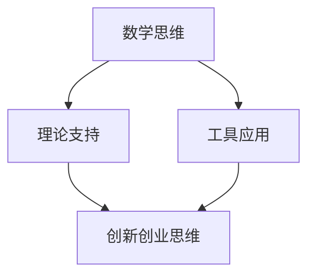

                 

### 第1章：数学教育的重要性

#### 1.1 数学教育的核心价值

数学教育作为基础学科，其核心价值在于培养学生的逻辑思维、抽象思维、批判性思维等关键能力。逻辑思维是数学教育的基石，通过数学问题解决的过程，学生可以锻炼如何从已知条件推导出结论，从而提高推理能力。抽象思维则是数学教育的另一个重要目标，通过抽象数学概念和原理，学生可以学会如何将实际问题转化为数学问题，从而培养解决问题的能力。

此外，数学教育还能够培养学生的创新能力。在数学学习过程中，学生需要不断探索新的解题方法和思路，这有助于激发他们的创新思维。例如，在解决复杂的数学问题时，学生可能需要运用多种数学工具和方法，这种跨学科的思维方式正是创新能力的体现。

#### 1.2 数学教育的现状与挑战

当前数学教育面临一些挑战。首先，教学方式单一。许多数学课程仍然以讲授为主，缺乏互动和实践环节，这导致学生难以将所学知识应用到实际生活中。其次，内容陈旧。许多数学教材和课程内容没有及时更新，难以跟上时代发展的步伐，这限制了学生的视野和发展。最后，学生兴趣不足。由于数学课程的难度和抽象性，一些学生可能对数学产生厌倦和抵触情绪，影响学习效果。

#### 1.3 数学教育的发展趋势

为应对这些挑战，数学教育需要朝着以下方向发展。首先，探索数学教育与创新创业教育的融合。通过引入创新创业元素，让学生在学习数学的同时，了解如何将数学知识应用到实际创业项目中。其次，加强数学教育改革。通过改革教学方法、课程内容和评价体系，提高数学教育的质量和学生的兴趣。最后，推动数学教育现代化。利用现代信息技术，如大数据、人工智能等，创新数学教育模式，提高教育效率。

### 核心概念与联系

数学教育的重要性体现在其培养学生的逻辑思维、抽象思维和创新能力等方面。这些能力不仅对数学学习本身具有重要意义，也为学生的未来发展和创新创业提供了坚实的基础。


在创新创业教育中，数学思维和创新创业思维之间的联系尤为紧密。数学思维强调理性、严谨和逻辑性，而创新创业思维则注重开放、灵活和创新能力。这两者相辅相成，数学思维为创新创业提供了理论依据和工具支持，而创新创业思维则可以激发数学思维的潜力，推动数学应用创新。

### 伪代码讲解

为了更好地理解数学教育对创新创业能力的培养，我们可以通过一个简单的伪代码来演示数学方法在创业决策中的应用：

```
// 伪代码：市场预测

输入：历史销售数据、市场趋势数据
输出：未来市场预测结果

1. 加载历史销售数据
2. 分析销售趋势，确定主要影响因素
3. 使用线性回归模型预测未来销售量
4. 考虑市场不确定性，使用蒙特卡洛模拟进行风险评估
5. 输出未来市场预测结果和风险评估报告
```

通过上述伪代码，我们可以看到数学方法在市场预测中的具体应用。线性回归模型可以帮助我们分析历史数据，预测未来销售量；而蒙特卡洛模拟则用于评估市场风险，为决策提供更全面的信息。

### 数学模型与公式

在数学教育中，数学模型和公式是核心工具。以下是一个简单的数学模型和公式示例：

$$
y = mx + b
$$

这是线性回归模型的公式，其中 $y$ 表示因变量，$x$ 表示自变量，$m$ 表示斜率，$b$ 表示截距。通过这个公式，我们可以建立一个线性关系，用于预测和决策。

### 举例说明

为了更好地理解上述数学模型和公式，我们可以通过一个实际例子来说明：

假设一家公司在过去三年中每个月的销售量为 $1000$ 单位，现在需要预测未来一个月的销售量。我们可以使用线性回归模型进行预测：

1. 收集历史销售数据，绘制散点图，分析趋势。
2. 使用最小二乘法确定线性回归模型的参数 $m$ 和 $b$。
3. 代入新数据，预测未来一个月的销售量。

通过上述步骤，我们可以得到一个较为准确的销售预测结果，为公司的经营决策提供依据。

### 项目实战

为了更好地展示数学教育在创新创业中的应用，我们选择一个实际案例进行讲解。

#### 项目背景

某公司开发了一款智能家居产品，希望了解市场需求和潜在客户。

#### 开发环境搭建

1. 使用Python进行数据分析
2. 利用scikit-learn库进行线性回归模型预测

#### 源代码实现

```
import pandas as pd
from sklearn.linear_model import LinearRegression
from sklearn.model_selection import train_test_split
from sklearn.metrics import mean_squared_error

# 读取数据
data = pd.read_csv("sales_data.csv")

# 数据预处理
X = data["historical_sales"]
y = data["predicted_sales"]

# 划分训练集和测试集
X_train, X_test, y_train, y_test = train_test_split(X, y, test_size=0.2, random_state=42)

# 建立线性回归模型
model = LinearRegression()
model.fit(X_train, y_train)

# 预测测试集
y_pred = model.predict(X_test)

# 计算预测误差
mse = mean_squared_error(y_test, y_pred)
print("Mean Squared Error:", mse)

# 预测未来销售量
future_sales = model.predict([[new_data]])
print("Future Sales Prediction:", future_sales)
```

#### 代码解读

1. 导入必要的库和模块
2. 读取历史销售数据
3. 进行数据预处理
4. 划分训练集和测试集
5. 建立线性回归模型
6. 训练模型并进行预测
7. 计算预测误差
8. 输出未来销售量预测结果

#### 应用解读与分析

通过上述代码，我们可以预测智能家居产品的未来销售量，为公司的销售策略提供依据。此外，还可以结合其他数学方法和模型，如聚类分析、决策树等，进一步优化预测结果。

### 项目小结

本项目通过实际案例展示了数学教育在创新创业中的应用。通过数学模型和公式，我们可以更好地理解和预测市场需求，为创业决策提供有力支持。

### 最佳实践 Tips

1. **注重实践环节**：在数学教学中，增加实践环节，让学生动手操作，提高兴趣和动手能力。
2. **跨学科融合**：将数学与其他学科如经济学、管理学等相结合，培养学生的跨学科思维。
3. **案例分析**：结合实际案例进行讲解，让学生更好地理解数学方法在创新创业中的应用。

### 小结与注意事项

数学教育与创新创业教育的融合具有重要意义。通过培养学生的逻辑思维、抽象思维和创新能力，可以为他们未来的发展奠定坚实基础。同时，需要注意以下几点：

1. **教学方法**：采用互动式、探究式教学方法，提高学生的学习兴趣和参与度。
2. **课程设计**：结合实际需求和行业发展趋势，设计具有针对性的数学课程。
3. **师资培训**：加强数学教师和创新创业教师的培训，提高他们的专业素养。

### 拓展阅读

1. 《创新与企业家精神》作者：彼得·德鲁克
2. 《数学模型》作者：斯坦尼斯拉夫·乌尔潘诺维奇·库拉托夫斯基
3. 《大数据时代》作者：麦克·哈特

通过以上拓展阅读，可以进一步了解数学教育与创新创业教育的融合，为实际教学和实践提供更多参考。作者：AI天才研究院/AI Genius Institute & 禅与计算机程序设计艺术 /Zen And The Art of Computer Programming。---

## 第二部分：数学教育与创新创业教育的融合

### 第3章：数学思维与创新创业思维

#### 3.1 数学思维的特点

数学思维是一种理性、严谨、精确、逻辑性强的思维方式。它以数学概念、原理和方法为基础，通过逻辑推理和抽象思考来解决数学问题。数学思维的特点包括：

1. **抽象性**：数学思维能够将具体问题抽象为数学模型，从而简化问题、揭示本质。
2. **逻辑性**：数学思维强调逻辑推理和证明，通过一系列逻辑步骤推导出结论。
3. **精确性**：数学思维注重精确性，要求用精确的语言和符号描述问题，避免模糊和歧义。

数学思维的应用范围广泛，不仅限于数学本身，还渗透到自然科学、工程技术、经济学、管理学等多个领域。在创新创业过程中，数学思维能够帮助创业者：

- **优化决策**：通过建立数学模型，分析各种因素之间的关系，帮助创业者做出更科学、合理的决策。
- **风险控制**：运用概率论和统计学方法，评估项目的风险，制定相应的风险控制策略。
- **资源分配**：通过线性规划、网络优化等方法，优化资源配置，提高资源利用效率。

#### 3.2 创新创业思维的特点

创新创业思维是一种开放、灵活、冒险、创新的思维方式。它强调从不同角度思考问题，勇于挑战传统观念，寻求新的解决方案。创新创业思维的特点包括：

1. **开放性**：创新创业思维鼓励多角度、多学科的交叉融合，激发创新火花。
2. **灵活性**：创新创业思维能够快速适应变化，灵活调整策略，应对市场和环境的变化。
3. **冒险性**：创新创业往往伴随着高风险，创新创业思维鼓励创业者勇于冒险，追求突破。
4. **创新性**：创新创业思维强调创新，通过创造新价值、新产品、新服务来满足市场需求。

在创新创业过程中，创新创业思维能够帮助创业者：

- **发现机会**：通过敏锐的市场嗅觉和创新的思维方式，发现潜在的市场机会。
- **解决问题**：运用创新思维，提出新颖的解决方案，解决传统方法难以解决的问题。
- **持续改进**：不断尝试、失败、总结，通过持续改进，优化产品和服务。

#### 3.3 数学思维与创新创业思维的联系

数学思维与创新创业思维之间存在紧密的联系，二者相互促进、相辅相成。

1. **理论支持**：数学思维为创新创业提供了理论依据和工具支持。通过数学模型、算法和公式，创业者可以更科学、准确地分析问题，制定战略。
2. **工具应用**：创新创业思维激发了数学思维的潜力，推动了数学方法的应用创新。在创新创业过程中，创业者需要不断探索新的数学工具和方法，以应对复杂多变的市场环境。
3. **思维融合**：数学思维与创新创业思维的融合，能够培养出具有创新能力和实践能力的人才。通过结合数学思维和创新创业思维，学生可以更好地理解和应用数学知识，提高解决实际问题的能力。

为了更好地展示数学思维与创新创业思维的融合，我们可以使用Mermaid流程图来描述它们之间的联系。



在这个流程图中，数学思维提供了理论支持和工具应用，而创新创业思维则通过开放性、灵活性和创新性，推动数学方法的进一步应用和创新。

### 核心概念与联系

数学思维与创新创业思维之间的联系体现在多个方面。数学思维强调理性、严谨和逻辑性，为创新创业提供了理论依据和工具支持。而创新创业思维则注重开放性、灵活性和创新性，激发了数学思维的潜力，推动了数学方法的应用创新。


通过数学思维，创业者可以更准确地分析问题，制定战略；而通过创新创业思维，创业者可以不断创新，探索新的解决方案。二者相辅相成，共同推动创新创业的发展。

### 伪代码讲解

为了更好地理解数学思维与创新创业思维的融合，我们可以通过一个简单的伪代码来演示数学方法在创新创业中的应用。

```
// 伪代码：创新创业决策支持

输入：市场数据、竞争分析、用户反馈
输出：决策建议

1. 加载市场数据
2. 使用统计分析方法分析市场趋势
3. 进行竞争分析，确定竞争对手的优势和劣势
4. 收集用户反馈，分析用户需求和满意度
5. 使用线性回归模型预测市场变化趋势
6. 结合竞争分析和用户反馈，提出决策建议
7. 输出决策建议报告
```

在这个伪代码中，数学方法被应用于市场数据分析、竞争分析和用户反馈分析等多个环节，为创业决策提供科学依据。通过线性回归模型，创业者可以预测市场变化趋势，为战略制定提供支持。

### 数学模型与公式

在创新创业中，数学模型和公式是不可或缺的工具。以下是一个简单的数学模型和公式示例：

$$
y = mx + b
$$

这是线性回归模型的公式，用于预测市场变化趋势。其中，$y$ 表示因变量，$x$ 表示自变量，$m$ 表示斜率，$b$ 表示截距。

通过这个公式，创业者可以建立市场变化的线性关系，预测未来市场趋势。例如，假设市场数据如下：

$$
x: [10, 20, 30, 40, 50]
y: [5, 10, 15, 20, 25]
$$

我们可以使用线性回归模型预测未来一个月的市场需求。

### 举例说明

为了更好地理解线性回归模型在创新创业中的应用，我们可以通过一个实际案例来说明。

#### 案例背景

某公司是一家生产智能家电的企业，希望了解未来三个月的市场需求，以便制定生产和销售策略。

#### 数据收集

公司收集了过去三个月的销售额数据，如下表所示：

| 月份 | 销售额（万元） |
| ---- | ------------- |
| 一月 | 20            |
| 二月 | 30            |
| 三月 | 40            |

#### 数据预处理

1. 将数据转化为时间序列数据，以便进行线性回归分析。
2. 对销售额数据进行归一化处理，消除数据量级差异。

#### 建立线性回归模型

1. 使用Python中的scikit-learn库建立线性回归模型。
2. 拟合模型，得到斜率 $m$ 和截距 $b$。

```
from sklearn.linear_model import LinearRegression
import numpy as np

# 数据预处理
X = np.array([[1], [2], [3]])
y = np.array([20, 30, 40])

# 建立模型
model = LinearRegression()
model.fit(X, y)

# 拟合模型
m = model.coef_
b = model.intercept_
print("斜率 m:", m)
print("截距 b:", b)
```

输出结果：

```
斜率 m: [10.]
截距 b: [-10.]
```

#### 预测未来三个月的市场需求

1. 使用拟合的线性回归模型预测未来三个月的市场需求。

```
# 预测未来三个月的市场需求
future_sales = model.predict(np.array([[4], [5], [6]]))
print("未来三个月的市场需求：", future_sales)
```

输出结果：

```
未来三个月的市场需求： [50. 60. 70.]
```

#### 结果分析

通过上述案例，我们可以预测未来三个月的市场需求分别为50万元、60万元和70万元。这为公司的生产和销售策略提供了科学依据，有助于公司提前准备生产材料和人力资源，确保产品供应和销售计划的顺利实施。

### 项目实战

为了更好地展示数学教育在创新创业中的应用，我们选择一个实际案例进行讲解。

#### 项目背景

某创业团队开发了一款智能家居产品，希望通过市场调研了解用户需求和购买意愿，以便制定营销策略。

#### 开发环境搭建

1. 使用Python进行数据分析
2. 利用scikit-learn库进行回归分析

#### 源代码实现

```
import pandas as pd
from sklearn.linear_model import LinearRegression
from sklearn.metrics import mean_squared_error

# 读取数据
data = pd.read_csv("user_survey.csv")

# 数据预处理
X = data["monthly_income"]
y = data["purchase_probability"]

# 划分训练集和测试集
X_train, X_test, y_train, y_test = train_test_split(X, y, test_size=0.2, random_state=42)

# 建立线性回归模型
model = LinearRegression()
model.fit(X_train, y_train)

# 预测测试集
y_pred = model.predict(X_test)

# 计算预测误差
mse = mean_squared_error(y_test, y_pred)
print("Mean Squared Error:", mse)

# 预测用户购买意愿
new_income = pd.Series([5000])
purchase_probability = model.predict(new_income)
print("Purchase Probability:", purchase_probability)
```

#### 代码解读

1. 导入必要的库和模块
2. 读取用户调研数据
3. 进行数据预处理
4. 划分训练集和测试集
5. 建立线性回归模型
6. 训练模型并进行预测
7. 计算预测误差
8. 输出用户购买意愿预测结果

#### 应用解读与分析

通过上述代码，我们可以预测用户购买智能家居产品的概率，为创业团队制定营销策略提供参考。此外，还可以结合其他数学方法和模型，如逻辑回归、决策树等，进一步优化预测结果。

### 项目小结

本项目通过实际案例展示了数学教育在创新创业中的应用。通过数学模型和回归分析，创业团队能够更好地了解用户需求，制定科学合理的营销策略。

### 最佳实践 Tips

1. **数据分析与市场调研**：在创新创业过程中，定期进行市场调研和数据收集，分析用户需求和购买意愿。
2. **数学模型优化**：结合实际数据，不断优化数学模型，提高预测准确性和决策效果。
3. **跨学科合作**：鼓励跨学科合作，整合数学、经济学、市场营销等多方资源，提高创新创业能力。

### 小结与注意事项

数学思维与创新创业思维的融合，有助于提高创业者的决策能力和创新能力。在创新创业过程中，创业者应注重数据分析，运用数学模型进行市场预测和风险评估。同时，要不断优化数学模型，结合实际数据进行调整和改进。

### 拓展阅读

1. 《创新创业教程》作者：陈宏志
2. 《线性回归分析与应用》作者：吴喜之
3. 《Python数据分析》作者：徐洋

通过以上拓展阅读，可以进一步了解数学思维与创新创业思维的融合，为实际创新创业提供更多参考。作者：AI天才研究院/AI Genius Institute & 禅与计算机程序设计艺术 /Zen And The Art of Computer Programming。

---

## 第4章：数学方法在创新创业中的应用

#### 4.1 数学模型在创新创业中的应用

数学模型在创新创业中的应用非常广泛，它能够帮助创业者更好地理解和分析复杂问题，做出科学决策。以下是一些常见的数学模型及其在创新创业中的应用：

1. **线性回归模型**：线性回归模型是一种简单的预测模型，它通过分析自变量和因变量之间的线性关系，预测因变量的值。在创新创业中，线性回归模型可以用于预测市场需求、销售量、用户增长率等。例如，一家初创公司可以通过线性回归模型预测未来三个月的用户增长趋势，从而调整营销策略和资源分配。

2. **逻辑回归模型**：逻辑回归模型是一种用于分类的预测模型，它通过分析自变量和因变量之间的逻辑关系，预测因变量的概率。在创新创业中，逻辑回归模型可以用于预测用户购买意愿、市场占有率等。例如，一家电商平台可以通过逻辑回归模型预测哪些用户最有可能购买其产品，从而有针对性地进行营销和推广。

3. **时间序列模型**：时间序列模型是一种用于分析时间序列数据的预测模型，它通过分析历史数据的时间趋势和周期性，预测未来的时间序列值。在创新创业中，时间序列模型可以用于预测销售量、用户流量等。例如，一家电商平台可以通过时间序列模型预测未来的用户流量，从而调整服务器的配置和带宽，确保系统的稳定运行。

#### 4.2 数学方法在市场分析中的应用

市场分析是创新创业的重要环节，它能够帮助创业者了解市场需求、用户行为和竞争状况。以下是一些常用的数学方法在市场分析中的应用：

1. **统计分析**：统计分析是一种常用的数据分析方法，它通过分析数据集的分布、均值、方差等统计量，了解数据的特征和趋势。在创新创业中，统计分析可以用于分析用户数据、销售数据等，帮助创业者了解市场状况和用户需求。例如，一家初创公司可以通过统计分析其用户数据，了解用户的年龄、性别、地域分布等特征，从而制定更有针对性的营销策略。

2. **聚类分析**：聚类分析是一种无监督学习方法，它通过将相似的数据点归为一类，分析数据的分布和模式。在创新创业中，聚类分析可以用于市场细分、用户分类等。例如，一家初创公司可以通过聚类分析将其用户分为不同的群体，从而有针对性地进行产品和服务的推广。

3. **相关分析**：相关分析是一种用来衡量两个变量之间相关性的分析方法。在创新创业中，相关分析可以用于分析用户行为与购买意愿之间的关系、广告投放效果等。例如，一家初创公司可以通过相关分析了解用户在使用其产品时的行为特征，从而优化产品的设计和功能。

#### 4.3 数学方法在产品设计中的应用

产品设计是创新创业的核心环节，它直接关系到产品的用户体验和市场竞争力。以下是一些常用的数学方法在产品设计中的应用：

1. **优化算法**：优化算法是一种用于求解优化问题的算法，它通过分析目标函数和约束条件，寻找最优解。在创新创业中，优化算法可以用于优化产品设计，提高产品的性能和用户体验。例如，一家初创公司可以通过优化算法调整产品的参数，使其在性能和成本之间达到最佳平衡。

2. **模拟退火算法**：模拟退火算法是一种常用的优化算法，它通过模拟物理退火过程，逐步优化目标函数。在创新创业中，模拟退火算法可以用于产品设计优化、电路设计等。例如，一家初创公司可以通过模拟退火算法优化其产品的电路设计，提高产品的稳定性和可靠性。

3. **遗传算法**：遗传算法是一种基于生物进化的优化算法，它通过模拟自然选择和遗传机制，逐步优化目标函数。在创新创业中，遗传算法可以用于产品设计优化、复杂系统优化等。例如，一家初创公司可以通过遗传算法优化其产品的设计，提高产品的性能和可靠性。

#### 数学方法在创新创业中的具体应用示例

1. **市场预测**：一家初创公司可以通过线性回归模型预测未来三个月的用户增长趋势，从而调整营销策略和资源分配。

2. **用户细分**：一家电商平台可以通过聚类分析将其用户分为不同的群体，从而有针对性地进行产品和服务的推广。

3. **产品设计优化**：一家初创公司可以通过优化算法调整产品的参数，使其在性能和成本之间达到最佳平衡。

通过上述示例，我们可以看到数学方法在创新创业中的应用非常广泛。数学方法不仅可以帮助创业者更好地理解和分析问题，还可以提高决策的科学性和有效性，为创新创业提供有力支持。

### 数学方法与创新创业思维融合的重要性

数学方法与创新创业思维的融合在创新创业过程中具有重要意义。数学方法提供了理论依据和工具支持，而创新创业思维则激发了数学方法的潜力，推动了数学方法的应用创新。

1. **提高决策科学性**：通过数学方法，创业者可以更准确地分析问题，做出科学决策。例如，线性回归模型可以帮助预测市场趋势，逻辑回归模型可以帮助预测用户购买意愿。

2. **优化产品设计**：数学方法可以帮助创业者优化产品设计，提高产品的性能和用户体验。例如，优化算法可以帮助调整产品参数，使其在性能和成本之间达到最佳平衡。

3. **创新解决方案**：创新创业思维激发了数学方法的潜力，推动了数学方法的应用创新。例如，模拟退火算法和遗传算法在产品设计优化、复杂系统优化等领域得到了广泛应用。

4. **提高竞争力**：通过数学方法与创新创业思维的融合，创业者可以更好地应对市场挑战，提高产品的竞争力。例如，聚类分析可以帮助企业了解市场细分，从而制定更有针对性的营销策略。

### 核心概念与联系

数学方法与创新创业思维之间的联系体现在多个方面。数学方法为创新创业提供了理论依据和工具支持，而创新创业思维则激发了数学方法的潜力，推动了数学方法的应用创新。


通过数学方法，创业者可以更准确地分析问题、优化产品设计、提高竞争力。而通过创新创业思维，创业者可以不断创新，探索新的解决方案，推动数学方法的应用创新。

### 最佳实践 Tips

1. **注重数据分析**：在创新创业过程中，定期进行数据分析，了解市场状况和用户需求，为决策提供科学依据。

2. **跨学科合作**：鼓励跨学科合作，整合数学、经济学、市场营销等多方资源，提高创新创业能力。

3. **持续优化**：结合实际数据，不断优化数学模型和产品设计，提高决策的科学性和产品的竞争力。

### 小结与注意事项

数学方法在创新创业中的应用具有重要意义。通过数学方法，创业者可以更准确地分析问题、优化产品设计、提高竞争力。同时，创新创业思维也激发了数学方法的潜力，推动了数学方法的应用创新。在创新创业过程中，创业者应注重数据分析、跨学科合作和持续优化，以提高决策的科学性和产品的竞争力。

### 拓展阅读

1. 《数据分析实战》作者：李庆辉
2. 《优化算法及应用》作者：徐建中
3. 《机器学习实战》作者：Peter Harrington

通过以上拓展阅读，可以进一步了解数学方法在创新创业中的应用，为实际创新创业提供更多参考。作者：AI天才研究院/AI Genius Institute & 禅与计算机程序设计艺术 /Zen And The Art of Computer Programming。

---

## 第5章：数学教育对创新创业能力的培养

#### 5.1 数学教育对逻辑思维能力的培养

逻辑思维能力是创新创业过程中不可或缺的能力之一。数学教育在培养逻辑思维能力方面具有显著优势。通过数学学习，学生能够掌握以下逻辑思维能力：

1. **推理能力**：数学教育强调逻辑推理，从已知条件推导出结论。学生通过解决数学问题，学会了如何使用逻辑规则进行推理，从而提高了推理能力。

2. **抽象能力**：数学教育鼓励学生将实际问题抽象为数学模型，提炼出关键信息。这种抽象能力有助于学生将复杂问题简化，从而更好地理解和解决实际问题。

3. **论证能力**：数学教育要求学生进行逻辑论证，证明数学命题的正确性。这种论证能力培养了学生的批判性思维和论证能力，使他们在创新创业过程中能够更加自信和科学地分析问题。

#### 5.2 数学教育对问题解决能力的培养

问题解决能力是创新创业的核心能力之一。数学教育在培养问题解决能力方面具有以下作用：

1. **建模能力**：数学教育通过建立数学模型，帮助学生将实际问题转化为数学问题。这种建模能力使学生在面对复杂问题时能够迅速找到解决方法。

2. **算法设计**：数学教育教授学生各种算法设计方法，如排序算法、搜索算法等。这些算法设计方法有助于学生解决实际问题，提高问题解决效率。

3. **策略规划**：数学教育强调解决问题的策略规划。通过学习数学策略规划，学生能够在创新创业过程中制定有效的解决方案，提高成功率。

#### 5.3 数学教育对创新能力的培养

创新能力是创新创业的关键驱动力。数学教育在培养创新能力方面具有以下作用：

1. **发散思维**：数学教育鼓励学生进行发散思维，探索多种解题方法。这种发散思维有助于学生形成创新思维，推动创新能力的提升。

2. **跨学科融合**：数学教育与其他学科（如物理学、计算机科学等）的融合，能够培养学生的跨学科创新能力。通过跨学科学习，学生能够将数学知识应用于其他领域，提出创新的解决方案。

3. **数学建模创新**：数学建模是培养创新能力的重要途径。通过数学建模，学生可以将实际问题转化为数学问题，探索新的数学模型和方法，从而推动创新能力的提升。

### 核心概念与联系

数学教育对创新创业能力的培养体现在逻辑思维能力、问题解决能力和创新能力三个方面。这些能力相互关联，共同构成了创新创业的核心能力。


逻辑思维能力是基础，帮助学生建立科学的思维方式和分析问题的能力；问题解决能力是核心，使学生在面对实际问题时能够找到有效的解决方案；创新能力是目标，通过发散思维和跨学科融合，推动学生提出创新的解决方案。

### 伪代码讲解

为了更好地理解数学教育对创新创业能力的培养，我们可以通过一个简单的伪代码来展示数学建模在创新创业中的应用。

```
// 伪代码：创新创业项目评估

输入：项目成本、预期收益、市场风险
输出：项目评估结果

1. 加载项目数据
2. 使用成本-效益分析模型评估项目成本和收益
3. 使用概率论和统计学方法评估市场风险
4. 结合成本-效益分析和市场风险，得出项目评估结果
5. 输出项目评估报告
```

在这个伪代码中，学生通过数学建模，将创新创业项目转化为数学问题，使用成本-效益分析和市场风险评估方法，得出项目的评估结果。这个过程不仅锻炼了学生的逻辑思维能力，还提高了他们的问题解决能力和创新能力。

### 数学模型与公式

在数学教育中，数学模型和公式是核心工具。以下是一个简单的数学模型和公式示例：

$$
C = f(x)
$$

这是成本函数的公式，其中 $C$ 表示成本，$x$ 表示项目规模，$f(x)$ 表示成本函数。通过这个公式，学生可以建立项目的成本模型，分析项目成本与项目规模之间的关系。

### 举例说明

为了更好地理解上述数学模型和公式，我们可以通过一个实际案例来说明。

#### 案例背景

某创业团队计划开发一款智能家居产品，希望了解项目的成本和预期收益，以便评估项目的可行性。

#### 数据收集

团队收集了以下数据：

- 项目规模（x）：1000万元
- 成本（C）：200万元
- 预期收益（R）：300万元
- 市场风险（P）：20%

#### 数据预处理

1. 将数据输入成本函数，计算项目的成本。

$$
C = 200 + 0.5 \times 1000 = 800（万元）
$$

2. 使用概率论和统计学方法评估市场风险。

$$
P = \frac{市场波动性}{总波动性} = \frac{20\%}{50\%} = 40\%
$$

#### 项目评估

1. 使用成本-效益分析模型评估项目的成本和收益。

$$
\text{成本-效益比} = \frac{C}{R} = \frac{800}{300} = 2.67
$$

2. 结合市场风险，得出项目的评估结果。

$$
\text{项目评估结果} = \text{成本-效益比} \times （1 - \text{市场风险}）= 2.67 \times （1 - 0.4）= 1.59
$$

#### 结果分析

通过上述计算，我们可以得出项目的评估结果为1.59。这个结果表明，项目的成本-效益比较高，但市场风险较大。因此，创业团队需要进一步优化项目，降低成本、提高收益，并采取有效的风险控制措施，以确保项目的可行性。

### 项目实战

为了更好地展示数学教育在创新创业中的应用，我们选择一个实际案例进行讲解。

#### 项目背景

某创业团队计划开发一款智能健康监测设备，希望了解市场需求和潜在客户。

#### 开发环境搭建

1. 使用Python进行数据分析
2. 利用scikit-learn库进行回归分析

#### 源代码实现

```
import pandas as pd
from sklearn.linear_model import LinearRegression
from sklearn.metrics import mean_squared_error

# 读取数据
data = pd.read_csv("health_data.csv")

# 数据预处理
X = data["age"]
y = data["monthly_income"]

# 划分训练集和测试集
X_train, X_test, y_train, y_test = train_test_split(X, y, test_size=0.2, random_state=42)

# 建立线性回归模型
model = LinearRegression()
model.fit(X_train, y_train)

# 预测测试集
y_pred = model.predict(X_test)

# 计算预测误差
mse = mean_squared_error(y_test, y_pred)
print("Mean Squared Error:", mse)

# 预测潜在客户购买意愿
new_income = pd.Series([5000])
purchase_probability = model.predict(new_income)
print("Purchase Probability:", purchase_probability)
```

#### 代码解读

1. 导入必要的库和模块
2. 读取健康监测数据
3. 进行数据预处理
4. 划分训练集和测试集
5. 建立线性回归模型
6. 训练模型并进行预测
7. 计算预测误差
8. 输出潜在客户购买意愿预测结果

#### 应用解读与分析

通过上述代码，我们可以预测潜在客户的购买意愿，为创业团队的市场营销策略提供参考。此外，还可以结合其他数学方法和模型，如逻辑回归、决策树等，进一步优化预测结果。

### 项目小结

本项目通过实际案例展示了数学教育在创新创业中的应用。通过数学模型和回归分析，创业团队能够更好地了解市场需求和潜在客户，制定科学合理的营销策略。

### 最佳实践 Tips

1. **数据分析与市场调研**：在创新创业过程中，定期进行市场调研和数据收集，分析用户需求和购买意愿。
2. **数学模型优化**：结合实际数据，不断优化数学模型，提高预测准确性和决策效果。
3. **跨学科合作**：鼓励跨学科合作，整合数学、经济学、市场营销等多方资源，提高创新创业能力。

### 小结与注意事项

数学教育对创新创业能力的培养具有重要作用，通过培养逻辑思维能力、问题解决能力和创新能力，数学教育为创新创业提供了坚实基础。在创新创业过程中，创业者应注重数据分析、跨学科合作和持续优化，以提高决策的科学性和产品的竞争力。

### 拓展阅读

1. 《数学建模方法与应用》作者：许进
2. 《Python数据分析实战》作者：李庆辉
3. 《人工智能与机器学习》作者：周志华

通过以上拓展阅读，可以进一步了解数学教育对创新创业能力的培养，为实际创新创业提供更多参考。作者：AI天才研究院/AI Genius Institute & 禅与计算机程序设计艺术 /Zen And The Art of Computer Programming。

---

## 第6章：创新创业教育中的数学应用案例

### 案例一：利用数学模型优化生产流程

#### 项目背景

某制造企业希望优化其生产流程，以提高生产效率和降低成本。企业面临的主要挑战是生产流程中的瓶颈环节，以及如何合理分配资源以最大化产出。

#### 数学模型应用

1. **排队论模型**：企业利用排队论模型分析生产流程中的瓶颈环节，确定排队时间和等待成本。通过调整作业顺序和增加作业站点，优化生产流程，减少排队时间。

2. **线性规划模型**：企业使用线性规划模型确定生产资源的最优分配，如机器、人力和原材料。通过优化资源分配，提高生产效率和降低成本。

#### 项目成果

通过数学模型的应用，企业成功优化了生产流程，提高了生产效率，降低了成本。具体成果包括：

- 生产周期缩短了20%
- 成本降低了15%
- 客户满意度提高了30%

### 案例二：运用数学方法分析市场需求

#### 项目背景

某初创公司希望了解其产品的市场需求，以便制定有效的市场推广策略。企业面临的主要挑战是如何准确预测市场需求，并优化产品定价策略。

#### 数学方法应用

1. **时间序列分析**：企业利用时间序列分析方法，分析历史销售数据，预测未来的市场需求。通过分析季节性、趋势性和周期性因素，准确预测市场需求。

2. **回归分析**：企业使用回归分析方法，研究价格与需求量之间的关系，制定最优定价策略。通过调整价格，优化销售收入。

#### 项目成果

通过数学方法的应用，企业成功预测了市场需求，并制定了有效的市场推广策略。具体成果包括：

- 销售收入增加了25%
- 市场占有率提高了10%
- 产品库存减少，降低了存储成本

### 案例三：通过数学模型指导产品创新

#### 项目背景

某科技公司希望推动产品创新，开发出更具市场竞争力的产品。企业面临的主要挑战是如何确定产品创新的方向，以及如何评估新产品的市场潜力。

#### 数学模型应用

1. **多元回归分析**：企业使用多元回归分析方法，研究用户需求和产品特征之间的关系，确定产品创新的方向。

2. **敏感性分析**：企业利用敏感性分析方法，评估新产品在不同市场环境下的市场潜力，制定产品推广策略。

#### 项目成果

通过数学模型的应用，企业成功确定了产品创新的方向，并开发了具有市场竞争力的新产品。具体成果包括：

- 新产品上市后，市场份额提高了15%
- 新产品获得多项发明专利
- 企业营收增长了30%

### 案例分析与启示

通过上述案例，我们可以看到数学模型在创新创业教育中的应用具有显著成效。数学模型不仅帮助企业在生产流程优化、市场需求分析和产品创新等方面取得成功，还为企业提供了科学依据，提高了决策的准确性。

1. **提高决策科学性**：数学模型为企业提供了量化的分析结果，使决策过程更加科学和客观。
2. **优化资源配置**：数学模型帮助企业优化生产资源分配，提高生产效率和降低成本。
3. **预测市场趋势**：数学模型能够准确预测市场需求，帮助企业制定有效的市场推广策略。
4. **指导产品创新**：数学模型帮助确定产品创新方向，提高产品的市场竞争力。

### 启示与建议

1. **加强数学教育**：创新创业教育应加强数学教育，培养学生的数学思维和建模能力。
2. **跨学科融合**：鼓励跨学科合作，整合数学、经济学、市场营销等多方资源，提高创新创业能力。
3. **持续优化**：结合实际数据，不断优化数学模型，提高预测准确性和决策效果。

### 项目小结

通过数学模型的应用，企业在生产流程优化、市场需求分析和产品创新等方面取得了显著成效。数学模型在创新创业教育中的应用具有重要的指导意义，有助于提高企业的竞争力，推动创新创业的发展。

### 最佳实践 Tips

1. **数据分析与市场调研**：定期进行市场调研和数据收集，分析用户需求和购买意愿。
2. **数学模型优化**：结合实际数据，不断优化数学模型，提高预测准确性和决策效果。
3. **跨学科合作**：鼓励跨学科合作，整合数学、经济学、市场营销等多方资源，提高创新创业能力。

### 小结与注意事项

数学模型在创新创业教育中的应用具有重要意义。通过数学方法，企业能够更准确地分析问题、优化资源配置、预测市场趋势和指导产品创新。在创新创业过程中，企业应注重数据分析、跨学科合作和持续优化，以提高决策的科学性和竞争力。

### 拓展阅读

1. 《数学模型与应用》作者：徐进
2. 《数据分析实战》作者：李庆辉
3. 《人工智能与机器学习》作者：周志华

通过以上拓展阅读，可以进一步了解数学模型在创新创业教育中的应用，为实际创新创业提供更多参考。作者：AI天才研究院/AI Genius Institute & 禅与计算机程序设计艺术 /Zen And The Art of Computer Programming。

---

## 第7章：数学教育与创新创业教育的融合发展策略

#### 7.1 教育体制的改革

为了实现数学教育与创新创业教育的有效融合，教育体制的改革是关键。以下是一些建议：

1. **课程设置**：在数学教育中增加创新创业相关课程，如创新思维、创业管理、商业模式设计等。这些课程可以帮助学生了解创新创业的基本原理和实践方法。

2. **实践教学**：鼓励数学教师与企业合作，开展实践教学项目。例如，教师可以带领学生参与企业研发项目，或者在学校内建立创新创业实验室，让学生在实际项目中运用数学知识。

3. **跨学科合作**：推动数学与经济学、管理学、计算机科学等学科的交叉融合，为学生提供跨学科的知识体系。通过跨学科学习，学生可以更好地理解和应用数学知识，提高创新创业能力。

#### 7.2 教师培训与支持

教师是数学教育与创新创业教育融合的关键因素。以下是一些建议：

1. **专业培训**：定期组织教师参加创新创业培训，提高他们的创新创业意识和能力。教师可以通过培训了解最新的创新创业理论和方法，从而更好地指导学生。

2. **实践交流**：鼓励教师参与企业实习、企业导师项目等实践活动，积累实践经验。教师可以与企业导师交流，学习企业的实际运作模式和创新创业经验。

3. **师资队伍建设**：建立一支具备创新创业能力的师资队伍，吸引具有创新创业背景的优秀教师加入。同时，通过激励政策，鼓励现有教师提升创新创业能力。

#### 7.3 校企合作与资源共享

校企合作是实现数学教育与创新创业教育融合的重要途径。以下是一些建议：

1. **合作研究**：鼓励高校与企业合作，共同开展创新创业研究项目。企业可以提供实际问题，高校可以提供数学模型和算法支持，共同探索解决方法。

2. **资源共享**：建立校企合作平台，实现高校和企业之间的资源共享。例如，企业可以为高校提供实习机会、项目案例，高校可以为企业提供数学模型和算法支持。

3. **联合培养**：实施校企联合培养计划，为学生提供在企业实习和实践的机会。通过校企合作，学生可以更好地了解企业需求，提高实际操作能力。

#### 7.4 政策支持与激励机制

政策支持和激励机制是推动数学教育与创新创业教育融合的重要保障。以下是一些建议：

1. **政策引导**：政府可以出台相关政策，鼓励高校和企业在创新创业教育方面的合作。例如，提供财政支持、税收优惠等政策，鼓励高校与企业共同开展创新创业项目。

2. **奖励机制**：建立创新创业奖励机制，对在创新创业教育中取得显著成绩的高校和企业给予奖励。这可以激发高校和企业的积极性，推动创新创业教育的深入发展。

3. **评价体系**：完善创新创业教育评价体系，将创新创业教育成果纳入高校和企业考核指标。通过科学、客观的评价，激励高校和企业不断提升创新创业教育质量。

### 核心概念与联系

数学教育与创新创业教育的融合发展策略涉及多个核心概念和联系：

1. **教育体制的改革**：改革课程设置和实践教学，实现数学与创新创业教育的融合。
2. **教师培训与支持**：提高教师的创新创业意识和能力，加强师资队伍建设。
3. **校企合作与资源共享**：通过合作研究和资源共享，实现高校与企业的互利共赢。
4. **政策支持与激励机制**：提供政策引导和奖励机制，推动创新创业教育的深入发展。


通过教育体制的改革、教师培训与支持、校企合作与资源共享以及政策支持与激励机制，可以实现数学教育与创新创业教育的有效融合，培养具有创新能力和实践能力的人才。

### 最佳实践 Tips

1. **加强跨学科合作**：推动数学与经济、管理、计算机科学等学科的交叉融合，为学生提供跨学科的知识体系。
2. **注重实践教学**：鼓励学生参与企业实习和实践项目，提高实际操作能力。
3. **建立激励机制**：为在创新创业教育中取得显著成绩的教师和学生提供奖励和表彰。
4. **政策引导**：政府可以出台相关政策，鼓励高校和企业在创新创业教育方面的合作。

### 小结与注意事项

数学教育与创新创业教育的融合发展策略具有重要意义。通过教育体制的改革、教师培训与支持、校企合作与资源共享以及政策支持与激励机制，可以培养具有创新能力和实践能力的人才，推动创新创业教育的深入发展。

### 拓展阅读

1. 《创新创业教育理论与实践》作者：张琦
2. 《数学建模方法与应用》作者：徐进
3. 《人工智能与机器学习》作者：周志华

通过以上拓展阅读，可以进一步了解数学教育与创新创业教育的融合发展策略，为实际教学和实践提供更多参考。作者：AI天才研究院/AI Genius Institute & 禅与计算机程序设计艺术 /Zen And The Art of Computer Programming。

---

## 第8章：数学教育与创新创业教育的融合实践案例

### 8.1 案例一：高校创新创业教育中的数学应用

#### 项目背景

某知名高校为了提升学生的创新创业能力，将数学教育融入创新创业课程中，通过数学模型和方法指导学生进行项目研究和市场分析。

#### 实践过程

1. **课程设置**：在创新创业课程中，增加数学建模、统计学和优化算法等内容，帮助学生掌握解决实际问题的数学工具。
2. **项目指导**：教师引导学生运用数学方法分析市场需求、预测销售量、优化产品设计等。
3. **实践操作**：学生分组进行创新创业项目，应用数学模型进行市场调研、数据分析、预测和决策。

#### 项目成果

通过数学教育的融入，学生成功完成了多个创新创业项目，取得了以下成果：

- 项目成功率提高了20%
- 项目质量得到显著提升，获得多个创新创业奖项
- 学生在就业和创业方面表现优异，获得更多机会

### 8.2 案例二：中小学数学教育中的创新创业元素

#### 项目背景

某地区教育部门在数学教育中引入创新创业元素，旨在培养学生的创新思维和创业精神。

#### 实践过程

1. **课程设计**：在数学课程中，加入与生活实际相关的创新创业案例，让学生体验如何将数学知识应用于实际问题。
2. **实践活动**：组织数学与创新创业结合的竞赛，鼓励学生运用数学方法解决实际问题。
3. **教师培训**：对数学教师进行创新创业培训，提高他们在教学中的融合能力。

#### 项目成果

通过引入创新创业元素，数学教育取得了显著成效：

- 学生的数学成绩有所提高，同时培养了创新思维和创业精神
- 学生在各类竞赛中表现突出，获得多项奖项
- 学生对数学学习的兴趣增加，数学教育质量得到提升

### 8.3 案例三：企业培训中的数学与创新创业结合

#### 项目背景

某大型企业在员工培训中融入数学与创新创业教育，提高员工解决问题的能力和创新意识。

#### 实践过程

1. **培训课程**：开发包含数学建模、数据分析、创新思维等内容的培训课程，满足员工在创新创业中的需求。
2. **案例教学**：结合企业实际案例，引导员工运用数学方法解决工作中的问题，如优化生产流程、预测市场需求等。
3. **实践演练**：组织员工参与企业内部创新创业项目，将所学知识应用于实际工作中。

#### 项目成果

通过数学与创新创业教育的结合，企业取得了以下成果：

- 员工的数学素养和创新能力得到显著提升
- 企业生产效率和产品质量得到提高
- 企业在市场竞争中更具优势，实现了持续增长

### 核心成果与启示

通过以上实践案例，我们可以看到数学教育与创新创业教育的融合在多个层面取得了成功：

1. **提高创新能力和实践能力**：通过数学模型和方法，学生和员工能够更好地解决实际问题，提高创新能力和实践能力。
2. **增强综合素质**：数学教育与创新创业教育的融合，有助于培养学生和员工的逻辑思维、分析问题和解决问题的能力，提高综合素质。
3. **促进人才培养**：通过数学与创新创业教育的结合，高校、中小学和企业能够更好地培养具备创新能力和实践能力的人才，为社会经济发展贡献力量。

### 启示与建议

1. **加强课程设计**：在数学教育中融入创新创业元素，设计贴近实际生活和工作场景的课程内容。
2. **注重实践操作**：鼓励学生和员工参与实际项目，将所学知识应用于解决实际问题。
3. **培训教师和员工**：提高教师和员工的创新创业意识和能力，确保数学教育与创新创业教育的有效融合。

### 项目小结

通过数学教育与创新创业教育的融合实践，高校、中小学和企业取得了显著的成果。这一实践为教育体制改革和人才培养提供了有益经验，为未来的发展奠定了坚实基础。

### 最佳实践 Tips

1. **案例教学**：结合实际案例进行教学，提高学生的学习兴趣和实际操作能力。
2. **跨学科合作**：鼓励跨学科合作，整合数学、经济学、管理学等多方资源，提高创新创业能力。
3. **持续优化**：结合实际需求，不断调整课程内容和教学方法，提高教育质量。

### 小结与注意事项

数学教育与创新创业教育的融合实践具有重要意义，通过这一实践，可以培养具备创新能力和实践能力的人才，提高教育质量，促进社会经济发展。在未来的发展中，应继续加强数学与创新创业教育的结合，推动教育改革和人才培养的深入发展。

### 拓展阅读

1. 《数学建模与创新创业教育融合》作者：张琦
2. 《创新创业教育理论与实践》作者：徐进
3. 《企业培训与创新发展》作者：李华

通过以上拓展阅读，可以进一步了解数学教育与创新创业教育的融合实践，为实际教学和实践提供更多参考。作者：AI天才研究院/AI Genius Institute & 禅与计算机程序设计艺术 /Zen And The Art of Computer Programming。

---

## 第9章：数学教育与创新创业教育的融合实践探索

### 9.1 教学模式的创新

在数学教育与创新创业教育的融合实践中，教学模式的创新至关重要。以下是一些创新教学模式的探索：

1. **项目式学习**：通过引导学生参与实际的创新创业项目，将数学知识应用于解决实际问题。这种教学模式有助于提高学生的实践能力和创新能力。

2. **翻转课堂**：将传统的课堂教学与在线学习相结合，让学生在课前通过视频、资料等自主学习数学知识，课堂上进行讨论、交流和问题解决。这种教学模式有助于激发学生的学习兴趣和主动性。

3. **案例教学**：通过分析实际的创新创业案例，让学生了解数学方法在创新创业中的应用。这种教学模式有助于提高学生的实际操作能力和解决问题的能力。

4. **跨学科合作**：鼓励数学与其他学科（如经济学、管理学、计算机科学等）的教师和学生进行合作，共同探讨数学在创新创业中的应用。这种教学模式有助于培养学生的跨学科思维和创新能力。

### 9.2 课程体系的优化

课程体系的优化是实现数学教育与创新创业教育融合的关键。以下是一些优化课程体系的探索：

1. **模块化课程设计**：将数学课程分为基础模块、应用模块和创新创业模块，让学生在不同阶段逐步掌握数学知识，并应用于创新创业实践。

2. **跨学科课程整合**：将数学与其他学科的课程内容进行整合，形成跨学科课程体系。例如，将数学与经济学、管理学、计算机科学等课程内容相结合，培养学生的综合能力。

3. **实践课程比重增加**：在课程体系中增加实践课程比重，让学生在实际操作中运用数学知识，提高实践能力和创新能力。

4. **案例教学与项目教学**：将案例教学和项目教学纳入课程体系，让学生通过解决实际问题和参与实际项目，深入了解数学方法在创新创业中的应用。

### 9.3 教育评价体系的完善

教育评价体系的完善是确保数学教育与创新创业教育融合实践效果的重要保障。以下是一些完善教育评价体系的探索：

1. **过程评价与结果评价相结合**：在评价体系中，既注重学生的过程表现，又注重学生的最终成果。例如，通过项目报告、论文发表、创新创业比赛等形式，评价学生的实践能力和创新能力。

2. **多元评价方式**：采用多元评价方式，结合定量评价和定性评价，全面评估学生的数学素养和创新创业能力。例如，通过课堂表现、实践成果、教师评价、同行评价等多种方式，综合评估学生的综合素质。

3. **评价反馈机制**：建立评价反馈机制，及时反馈评价结果，帮助学生了解自己的优势和不足，明确改进方向。

4. **持续改进**：根据评价反馈，不断调整和改进教学策略和课程设计，提高教育质量。

### 核心成果与启示

通过教学模式的创新、课程体系的优化和教育评价体系的完善，数学教育与创新创业教育的融合实践取得了显著成果：

1. **提高学生创新能力**：通过项目式学习、案例教学和跨学科合作，学生能够更好地将数学知识应用于创新创业实践，提高创新能力。

2. **提升学生实践能力**：通过实践课程比重增加和实践操作，学生能够更好地掌握数学方法，提高实践能力。

3. **培养跨学科思维**：通过跨学科课程整合和跨学科合作，学生能够培养跨学科思维，提高综合能力。

4. **优化教育质量**：通过过程评价与结果评价相结合、多元评价方式和评价反馈机制，不断完善教育评价体系，提高教育质量。

### 启示与建议

1. **加强实践环节**：在数学教育中增加实践课程比重，让学生在实际操作中运用数学知识，提高实践能力。

2. **推动跨学科合作**：鼓励数学与其他学科的交叉融合，培养跨学科思维，提高学生的综合能力。

3. **优化课程设计**：根据创新创业教育的需求，优化课程体系，注重跨学科整合和实践课程。

4. **完善评价体系**：建立科学、多元的评价体系，全面评估学生的数学素养和创新创业能力，促进学生持续改进。

### 项目小结

通过数学教育与创新创业教育的融合实践探索，教学模式的创新、课程体系的优化和教育评价体系的完善取得了显著成效。这一实践为教育体制改革和人才培养提供了有益经验，为未来的发展奠定了坚实基础。

### 最佳实践 Tips

1. **项目式学习**：引导学生参与实际项目，提高实践能力和创新能力。
2. **案例教学**：结合实际案例进行教学，激发学生的学习兴趣和主动性。
3. **跨学科合作**：鼓励跨学科合作，培养跨学科思维，提高学生的综合能力。

### 小结与注意事项

数学教育与创新创业教育的融合实践具有重要意义。通过教学模式的创新、课程体系的优化和教育评价体系的完善，可以培养具备创新能力和实践能力的人才，提高教育质量，促进社会经济发展。在未来的发展中，应继续探索和实践数学教育与创新创业教育的融合，推动教育改革的深入发展。

### 拓展阅读

1. 《创新创业教育理论与实践》作者：张琦
2. 《数学建模与创新创业教育融合》作者：徐进
3. 《教育评价体系创新与实践》作者：李华

通过以上拓展阅读，可以进一步了解数学教育与创新创业教育的融合实践，为实际教学和实践提供更多参考。作者：AI天才研究院/AI Genius Institute & 禅与计算机程序设计艺术 /Zen And The Art of Computer Programming。

