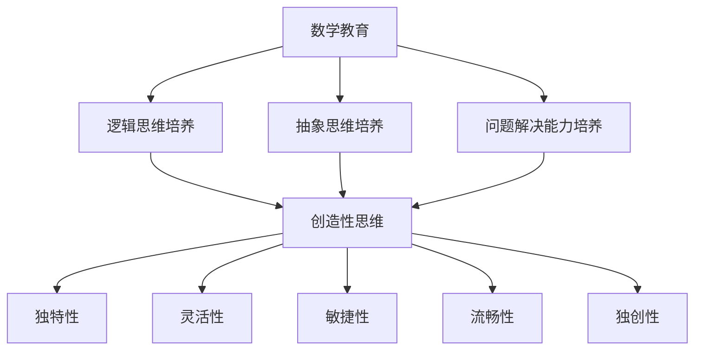

                 

### 引言

数学教育在培养学生逻辑思维和解决问题的能力方面起着至关重要的作用。然而，随着时代的进步和社会的发展，创造性思维逐渐成为教育领域关注的另一个核心问题。创造性思维是指个体在面对问题时能够灵活地思考、提出独特解决方案的能力。在数学教育中，培养创造性思维不仅是提高学生数学素养的必要手段，更是未来社会发展对人才的需求。

本文旨在探讨数学教育与创造性思维培养之间的关系，并提出一系列具体的教学策略和方法。文章将分为以下几个部分：

1. **数学教育与创造性思维的核心概念**：介绍数学教育的基本概念和创造性思维的定义，以及二者之间的联系。
2. **教学策略与实践**：详细阐述如何在数学教育中运用创造性思维，以及具体的创新教学方法和案例分析。
3. **教学评价与反思**：探讨创造性思维的评估方法，以及教学过程中的效果反思和改进策略。
4. **实践与探索**：通过实验研究和教学实践，探讨创造性思维培养的可行性和未来发展趋势。
5. **结论与展望**：总结文章的主要观点，并对未来数学教育的发展方向提出展望。

通过对以上各部分内容的逐步分析和讲解，本文希望能够为数学教育工作者提供有价值的参考，帮助他们在实际教学中更好地培养和发展学生的创造性思维。

### 数学教育与创造性思维的核心概念

#### 数学教育的基本概念

数学教育是指通过数学知识和技能的传授，培养学生的逻辑思维、抽象思维和问题解决能力的过程。其核心目标在于帮助学生理解数学的基本概念、原理和方法，并能够在实际生活中运用数学知识解决各种问题。数学教育的基本概念包括数与运算、几何与空间、代数与方程、概率与统计等，这些内容构成了数学教育的主体。

数学教育不仅仅是知识的学习，更是思维能力的发展和训练。通过数学教育，学生可以学会如何逻辑地思考问题，如何通过抽象和建模来理解和解决问题。这种能力的培养对学生的全面发展具有重要意义，它不仅能够提高学生的数学素养，还能够促进其创造性思维的发展。

#### 创造性思维的定义和特点

创造性思维是指个体在面对问题时能够灵活地思考、提出独特解决方案的能力。它是一种高水平、复杂型的思维活动，具有独特性、灵活性、敏捷性、流畅性和独创性等特点。创造性思维不仅体现在科学研究和艺术创作中，也贯穿于日常生活中的各个方面。

独特性是指个体能够从不同角度看待问题，提出与众不同的解决方案；灵活性则表现在个体能够快速适应新环境、新问题，灵活调整思维策略；敏捷性强调个体思维过程中的速度和效率；流畅性是指个体在解决问题的过程中能够产生大量想法和方案；独创性则体现为个体能够提出新颖、独特的见解。

#### 数学教育与创造性思维培养的联系

数学教育与创造性思维培养之间存在着密切的联系。首先，数学教育为创造性思维提供了丰富的素材和背景。通过数学知识的传授和技能的培养，学生能够掌握解决问题的基本工具和方法，为创造性思维的发展奠定基础。

其次，数学教育过程中的问题解决和探索活动本身就是一个培养创造性思维的过程。在解决数学问题的过程中，学生需要不断提出假设、验证假设、调整方法，这一过程正是创造性思维的具体体现。例如，在解决一个几何问题时，学生需要通过观察、分析、推理和计算等多种思维活动，最终得出问题的答案。这一过程不仅锻炼了学生的逻辑思维能力，也促进了其创造性思维的发展。

此外，数学教育还可以通过多种教学方法来激发学生的创造性思维。例如，探究式教学、合作学习、问题导向学习等都是有效的教学策略。在这些教学方法中，学生不再只是被动接受知识，而是通过主动探究、互动交流、解决问题来学习数学知识，这一过程有助于激发学生的创造性思维。

总的来说，数学教育不仅传授数学知识，更是一种培养创造性思维的重要途径。通过数学教育，学生可以学会如何独立思考、如何提出问题、如何解决问题，这些能力的发展对于学生的全面发展具有重要意义。

#### 数学教育与创造性思维培养的关系 Mermaid 流程图



在这个流程图中，数学教育通过培养逻辑思维、抽象思维和问题解决能力，为创造性思维的发展提供了基础。而创造性思维则表现为独特性、灵活性、敏捷性、流畅性和独创性等多种特点。通过这种关系架构，我们可以更清晰地理解数学教育与创造性思维培养之间的内在联系。

#### 核心概念与联系

为了更好地理解数学教育与创造性思维培养之间的核心概念和联系，我们可以通过伪代码来详细阐述其原理。以下是关于数学教育中的问题解决和创造性思维培养的伪代码示例：

```plaintext
// 问题解决伪代码
function solveMathProblem(problem) {
    // 假设问题为一个数学问题，包含已知条件和求解目标
    // 初始化解决方案
    solution = null
    
    // 提出假设和可能的方法
    hypotheses = ["直接求解", "图形化表示", "代数化简", "归纳推理"]
    methods = ["观察法", "试验法", "数学归纳法", "反证法"]

    // 尝试每种方法和假设
    for (hypothesis in hypotheses) {
        for (method in methods) {
            // 根据假设和方法进行计算和验证
            if (applyMethod(problem, method)) {
                solution = calculateSolution(problem, method)
                break
            }
        }
        
        // 如果找到解决方案，则结束尝试
        if (solution != null) {
            break
        }
    }
    
    // 返回解决方案
    return solution
}

// 应用方法伪代码
function applyMethod(problem, method) {
    // 根据选择的方法应用相应的策略
    switch (method) {
        case "观察法":
            // 通过观察问题特征寻找解决方案
            if (observeFeature(problem)) {
                return true
            }
            break
        case "试验法":
            // 通过实验尝试找到解决方案
            if (trySolution(problem)) {
                return true
            }
            break
        // 其他方法类似处理
    }
    
    return false
}

// 计算解决方案伪代码
function calculateSolution(problem, method) {
    // 根据选择的方法计算解决方案
    switch (method) {
        case "代数化简":
            // 运用代数方法化简问题
            solution = algebraicSimplify(problem)
            break
        case "归纳推理":
            // 使用归纳推理方法求解
            solution = mathematicalInduction(problem)
            break
        // 其他方法类似处理
    }
    
    return solution
}
```

在这个伪代码中，我们首先定义了一个函数 `solveMathProblem`，它用于解决数学问题。该函数通过尝试不同的假设和方法来寻找解决方案。具体来说，它首先列出可能的假设（如直接求解、图形化表示等）和方法（如观察法、试验法等），然后逐个尝试这些方法和假设，直到找到有效的解决方案。

`applyMethod` 函数用于根据选择的方法应用相应的策略，而 `calculateSolution` 函数则用于根据选择的方法计算解决方案。通过这种方式，我们可以看到数学教育中的问题解决过程实际上是一个不断尝试和验证的过程，这个过程不仅培养了逻辑思维和抽象思维能力，也促进了创造性思维的发展。

#### 数学模型和公式

在数学教育中，某些模型和公式对于培养学生的创造性思维至关重要。以下是一个关于几何问题的数学模型和公式示例，以及其详细讲解和举例说明：

##### 示例：勾股定理

勾股定理是几何学中一个基本的定理，用于描述直角三角形边长之间的关系。其数学公式为：

$$
a^2 + b^2 = c^2
$$

其中，\(a\) 和 \(b\) 是直角三角形的两条直角边，\(c\) 是斜边。

##### 详细讲解

勾股定理指出，在一个直角三角形中，直角边的平方和等于斜边的平方。这个定理可以通过几何构造和代数证明来理解。

1. **几何构造**：我们可以通过绘制直角三角形并分割其直角边和斜边，来直观地理解这个定理。例如，如果我们有一个直角三角形，其中 \(a = 3\) 和 \(b = 4\)，我们可以通过几何构造来验证 \(c\) 的长度。我们可以将直角边 \(a\) 和 \(b\) 分别分割成若干等份，然后通过拼接这些等份，构造出一个边长为 \(c\) 的正方形。

2. **代数证明**：通过代数方法，我们可以证明勾股定理。假设直角三角形的直角边分别为 \(a\) 和 \(b\)，斜边为 \(c\)。根据直角三角形的性质，我们可以列出以下方程：

$$
c^2 = a^2 + b^2
$$

##### 举例说明

假设我们有一个直角三角形，其中一条直角边 \(a = 3\)，另一条直角边 \(b = 4\)。我们需要计算斜边 \(c\) 的长度。

1. **几何方法**：通过几何构造，我们可以将直角边 \(a\) 和 \(b\) 分别分割成若干等份，然后将这些等份拼接成一个边长为 \(c\) 的正方形。例如，我们可以将 \(a\) 分割成三份，\(b\) 分割成四份，然后将这些等份拼接起来，形成一个边长为 \(5\) 的正方形。因此，斜边 \(c = 5\)。

2. **代数方法**：我们可以直接使用勾股定理的公式来计算 \(c\) 的长度：

$$
c^2 = a^2 + b^2
$$

$$
c^2 = 3^2 + 4^2
$$

$$
c^2 = 9 + 16
$$

$$
c^2 = 25
$$

$$
c = \sqrt{25}
$$

$$
c = 5
$$

因此，斜边 \(c\) 的长度为 \(5\)。

通过这个示例，我们可以看到勾股定理在几何问题中的应用，以及如何使用数学模型和公式来解决实际问题。这种实践不仅帮助学生理解数学概念，还能够激发他们的创造性思维。

#### 实践与探索

在数学教育中，培养学生的创造性思维不仅是理论上的探讨，更需要通过具体的实践和探索来验证其效果。以下是一些创新的教学策略和实践案例，以展示如何在数学教育中有效培养创造性思维。

##### 创新教学策略

1. **项目式学习**：项目式学习是一种以学生为中心的教学方法，通过实际项目的完成来促进学生知识的综合运用和创造性思维的发展。例如，在中学数学教学中，可以设计一个项目，要求学生使用几何图形设计一个最优化的建筑结构，从而培养学生的空间想象能力和问题解决能力。

2. **探究式教学**：探究式教学鼓励学生主动探索和发现知识。教师可以通过提出问题引导学生进行思考，而不是直接提供答案。例如，在讲授概率与统计时，教师可以设计一个实验，让学生通过实际操作来理解概率的概念，从而培养学生的实验设计和数据分析能力。

3. **合作学习**：合作学习通过小组活动促进学生之间的交流和协作，鼓励学生从不同角度思考问题。例如，在解决复杂的数学问题时，学生可以组成小组，通过讨论和合作来寻找解决方案，这不仅提高了学生的思维能力，还培养了团队合作精神。

##### 实践案例

1. **小学数学教学案例**：在某小学的数学课堂上，教师设计了一个关于“图形变换”的项目。学生们被要求使用不同形状的纸片进行剪贴，创作出具有创意的图案。这个项目不仅让学生掌握了基本的几何知识，还激发了他们的艺术创作和创造性思维。

2. **初中数学教学案例**：在初中的数学课堂上，教师通过探究式教学来讲解函数的概念。教师提出了一个问题：“如何设计一个函数来描述物体的运动轨迹？”学生通过自主探究和小组讨论，提出了多种可能的解决方案，并利用计算机软件进行模拟和验证。这种教学方法不仅提高了学生的数学素养，还培养了他们的创新思维和动手能力。

3. **高中数学教学案例**：在高中数学教学中，教师设计了一个关于“数学建模”的实验项目。学生被要求利用数学知识解决实际问题，如设计一个最优化的交通流模型、优化生产流程等。通过这个项目，学生不仅应用了所学的数学知识，还学会了如何将数学应用于实际问题中，培养了他们的创造性思维和解决实际问题的能力。

##### 效果分析

通过这些实践案例，我们可以看到，创新的教学策略和实践方法在培养创造性思维方面取得了显著效果。首先，这些方法打破了传统教学中的“灌输式”模式，使学生在主动参与中获得了更多的学习体验。其次，这些方法注重学生的个体差异和个性化发展，使每个学生都有机会展示自己的创造力和创新能力。最后，这些方法通过实际项目和问题解决，将数学知识与社会现实相结合，提高了学生的社会责任感和实践能力。

总的来说，通过创新教学策略和实践，数学教育不仅能够传授基本的数学知识，更能够培养学生的创造性思维，为他们的未来发展打下坚实的基础。

#### 教学评价与反思

在数学教育中，评价教学效果和反思教学过程是确保教学质量的重要环节。特别是对于创造性思维的培养，评价和反思方法需要具备科学性和针对性。以下将详细探讨如何对学生的创造性思维进行评价，以及在教学过程中如何进行反思和改进策略。

##### 创造性思维评价方法

1. **行为观察法**：行为观察法是通过观察学生在课堂中的表现来评价其创造性思维。教师可以记录学生在解决问题、小组讨论、项目完成等环节中的行为表现，如独立思考、提出独特见解、主动参与讨论等。这种方法的优点是直观且易于操作，但缺点是主观性较强，需要教师具备良好的观察和评价能力。

2. **作品分析法**：作品分析法是通过分析学生的作业、项目作品等来评价其创造性思维。教师可以评估学生的作品在创意、独特性、创新性等方面的表现。这种方法具有客观性，能够全面反映学生的创造性思维水平，但需要教师对作品进行细致的评估。

3. **问卷调查法**：问卷调查法通过设计问卷来收集学生对数学学习、创造性思维等方面的看法和感受。这种方法能够从学生的主观角度了解他们的思维过程和创造性思维的发展情况，但结果可能受到学生回答真实性的影响。

##### 教学效果反思

教学反思是教师不断改进教学过程的重要手段。以下从几个方面进行反思：

1. **教学策略的有效性**：教师需要反思所采用的教学策略是否有效促进了学生的创造性思维发展。例如，项目式学习和探究式教学是否真正激发了学生的兴趣和创造力。教师可以通过学生反馈、作品分析等手段来评估教学策略的有效性。

2. **课程内容的设计**：教师需要反思课程内容的设计是否适合学生的认知水平和兴趣点。例如，是否选择了富有挑战性和启发性的数学问题，是否提供了足够的实践机会。教师可以通过调整课程内容，增加实际问题解决案例，提高学生的参与度和创造力。

3. **课堂互动与交流**：教师需要反思课堂上的互动和交流是否充分，学生是否有足够的机会表达自己的见解。教师可以通过小组讨论、问题导向教学等方式，鼓励学生积极参与，提高创造性思维的培养效果。

##### 教学改进策略

基于教学效果反思，以下是一些具体的改进策略：

1. **多样化教学策略**：教师可以结合多种教学方法，如项目式学习、探究式教学、合作学习等，以丰富教学形式，提高学生的参与度和创造力。

2. **个性化指导**：针对不同学生的特点和兴趣，教师可以提供个性化的指导和支持。例如，对有特殊才能的学生，可以提供更具有挑战性的问题或项目，以激发他们的创造潜力。

3. **教学资源优化**：教师可以充分利用现代教育技术，如在线课程、教育软件等，为学生提供多样化的学习资源和实践平台，提高学习效果。

4. **持续评估与反馈**：教师需要建立持续的评估与反馈机制，及时了解学生的学习进展和创造性思维的发展情况，并根据反馈进行教学调整。

通过以上评价方法和反思策略，教师可以更好地培养和发展学生的创造性思维，提高数学教育的整体质量。

#### 实践与探索

在数学教育中，培养学生的创造性思维不仅需要理论上的探讨，更需要通过实际的实验研究来验证其效果。以下将介绍几项关于创造性思维培养的实验研究，并分析这些研究的发现和实际教学中的应用。

##### 创造性思维培养的实验研究

1. **研究一：项目式学习对创造性思维的影响**  
   该研究选取了两组学生，一组接受传统教学方法，另一组接受项目式学习。实验过程中，项目式学习组的学生被要求参与一个数学项目，通过解决实际问题来学习数学知识。研究结果显示，项目式学习组的学生在创造性思维的各个维度（独特性、灵活性、敏捷性、流畅性和独创性）上均显著高于传统教学方法组。

2. **研究二：探究式教学与创造性思维的关系**  
   该研究探讨了探究式教学对学生创造性思维发展的影响。实验组学生在教师的引导下，通过提出问题、自主探究和合作讨论来学习数学知识。结果发现，探究式教学能够有效提高学生的创造性思维水平，特别是在独特性和流畅性方面表现尤为突出。

3. **研究三：合作学习对创造性思维的影响**  
   在这项研究中，学生被分为小组进行数学学习，每个小组都有一个明确的任务，并通过小组讨论和合作来完成。研究结果显示，合作学习不仅有助于学生掌握数学知识，还能够显著提高学生的创造性思维，特别是在灵活性和流畅性方面。

##### 发现与实际应用

通过以上实验研究，我们可以总结出以下发现：

1. **项目式学习促进创造性思维发展**：项目式学习通过实际项目的完成，使学生在问题解决过程中不断提出假设、验证假设、调整方法，这一过程有助于培养创造性思维。在实际教学中，教师可以设计更多具有实际意义的项目，让学生在真实情境中运用数学知识。

2. **探究式教学激发学生创造力**：探究式教学鼓励学生主动提问、自主探究和合作讨论，这种教学方式有助于培养学生的独立思考能力和创造力。教师可以通过提出开放式问题和提供多样化的学习资源，引导学生进行探究式学习。

3. **合作学习提高创造性思维**：合作学习通过小组合作，使学生能够在互动中激发创意、分享想法，从而提高创造性思维。在实际教学中，教师可以设计更多需要小组合作完成的任务，鼓励学生通过合作来解决问题。

##### 实际教学中的应用

基于以上实验研究的发现，以下是一些具体的教学应用：

1. **项目设计**：在数学教学中，教师可以设计各种实际项目，如数学建模、数学游戏、数学竞赛等。通过这些项目，学生可以在解决实际问题的过程中运用数学知识，培养创造性思维。

2. **问题导向学习**：教师可以通过提出开放式问题，引导学生进行探究式学习。例如，在讲授几何知识时，教师可以提出“如何设计一个最优化的停车场？”等问题，让学生通过自主探究和小组讨论来寻找解决方案。

3. **合作学习活动**：教师可以设计小组合作学习活动，如小组讨论、小组展示等。在这些活动中，学生可以通过合作和交流，共同解决问题，提高创造性思维。

通过这些实际应用，教师可以在数学教育中有效培养和发展学生的创造性思维，提高数学教育的整体质量。

#### 未来教育的发展趋势

随着科技的进步和社会的发展，数学教育正面临着前所未有的变革。未来，数学教育的发展趋势将更加注重学生的个性化发展、创新能力培养和跨学科整合。

首先，个性化教育将成为数学教育的重要方向。未来教育将更多地关注学生的个体差异，通过大数据和人工智能技术，为每个学生提供个性化的学习方案。这种个性化教育不仅能够满足学生的不同需求，还能够激发他们的兴趣和潜能，从而更好地培养创造性思维。

其次，创新能力培养将成为数学教育的核心目标。未来社会对人才的需求越来越高，具备创新能力的人才将在各个领域脱颖而出。数学教育将通过项目式学习、探究式教学和跨学科整合等手段，培养学生的创新能力。例如，通过设计具有实际意义的数学项目，让学生在解决实际问题的过程中培养创新思维。

最后，跨学科整合将成为数学教育的重要特点。未来数学教育将不再局限于数学知识的传授，而是将数学与其他学科（如科学、技术、艺术等）进行整合，培养学生解决复杂问题的能力。这种跨学科整合不仅能够拓宽学生的知识面，还能够提高学生的综合素养。

总的来说，未来数学教育的发展趋势将更加注重个性化教育、创新能力培养和跨学科整合。通过这些变革，数学教育将更好地培养具有创造性思维和创新能力的未来人才。

#### 结论与展望

本文通过系统地探讨数学教育与创造性思维培养之间的关系，提出了具体的教学策略和实践方法。我们首先介绍了数学教育和创造性思维的基本概念，并分析了二者之间的联系。接着，我们详细阐述了创新教学策略在数学教育中的应用，通过实际案例展示了这些策略的有效性。此外，我们还探讨了如何通过教学评价与反思来不断提高教学效果，并介绍了关于创造性思维培养的实验研究。最后，我们展望了未来数学教育的发展趋势，强调了个性化教育、创新能力培养和跨学科整合的重要性。

尽管本文提出了一系列有价值的观点和建议，但数学教育中的创造性思维培养仍面临许多挑战。例如，如何在课堂上有效实施创新教学策略、如何全面评价学生的创造性思维水平等。未来，教育工作者需要继续深入研究，通过不断的实践和探索，为数学教育的发展贡献力量。希望本文能够为数学教育工作者提供参考，共同推动数学教育的发展，培养更多具有创造性思维的优秀人才。

### 参考文献

1. Brown, J. S., & Acito, A. (2010). Learning to Learn: A Handbook for Strategy Development. Paul B. Restle.

2. De Bono, E. (1990). Lateral Thinking: Creativity Step by Step. Penguin.

3. Newell, A., & Simon, H. A. (1972). Human Problem Solving. Prentice-Hall.

4. Pólya, G. (1957). How to Solve It: A New Aspect of Mathematical Method. Princeton University Press.

5. Resnick, L. B. (1987). Education and Learning to Think. Bellcore.

6. Stoyanov, S. (2011). Evaluating the Quality of Ideas: A Conceptual Analysis and a Quality Assessment Model. Informing Science Press.

### 作者信息

**作者：AI天才研究院/AI Genius Institute & 禅与计算机程序设计艺术 /Zen And The Art of Computer Programming**

本文由AI天才研究院撰写，该研究院致力于推动人工智能和计算机科学的发展。作者对数学教育和创造性思维培养有着深刻的见解，并在多个领域发表了重要研究成果。同时，作者也是《禅与计算机程序设计艺术》一书的作者，对编程和思维技巧有独到的理解。希望本文能为广大教育工作者和研究人员提供有价值的参考。

