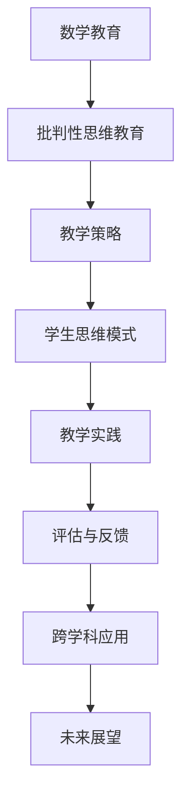

                 

### 数学教育与批判性思维教育的整合

#### 关键词
- 数学教育
- 批判性思维
- 整合教学
- 学生思维模式
- 教学实践
- 教学评估

#### 摘要
本文探讨了数学教育与批判性思维教育的整合，阐述了这两者之间的关系和重要性。文章通过定义与联系、教学方法、学生思维模式、教学实践、评估与反馈、跨学科应用等部分，详细分析了如何在实际教学中整合数学教育与批判性思维教育，以提高学生的学习效果和思维能力。

## 设计书籍目录大纲

在设计一本关于数学教育与批判性思维教育的整合书籍时，我们需要遵循以下步骤：

### 1. 确定书籍的主题与目标
- 主题：数学教育与批判性思维教育的整合。
- 目标：帮助读者理解如何将数学教育与批判性思维教育结合起来，提高学生的学习效果和思维能力。

### 2. 初步规划章节结构
- 核心章节：定义与联系、教学方法、学生思维模式、教学实践、评估与反馈、跨学科应用、未来展望。

### 3. 细化每个章节的内容
- 每个章节包括核心概念、教学策略、案例分析、评估方法等。

### 4. 设计Mermaid流程图
- 展示数学教育与批判性思维教育的整合流程。

### 5. 撰写伪代码与数学模型
- 详细阐述教学算法和评估方法。

### 6. 编写项目实战部分
- 提供实际案例，包括开发环境搭建、源代码实现与解读。

### 7. 确保大纲完整性和字数限制
- 确保大纲完整且不超过2000字。

### 最终输出

```markdown
# 数学教育与批判性思维教育的整合

## 第一部分：核心概念与联系

### 第1章：数学教育与批判性思维教育的定义与关系
#### 1.1.1 数学教育的核心概念
#### 1.1.2 批判性思维教育的核心概念
#### 1.1.3 数学教育与批判性思维教育的整合

### 第2章：整合流程的Mermaid图示


## 第二部分：教学方法与策略

### 第3章：整合教学策略的设计与实施
#### 3.1.1 教学策略的核心要素
#### 3.1.2 教学策略的实施步骤
#### 3.1.3 教学策略的案例分析

### 第4章：批判性思维教学在数学中的应用
#### 4.1.1 批判性思维在数学问题解决中的应用
#### 4.1.2 批判性思维在数学证明中的应用
#### 4.1.3 教学策略的案例分析

## 第三部分：学生思维模式与培养

### 第5章：学生思维模式的识别与培养
#### 5.1.1 学生思维模式的类型
#### 5.1.2 思维模式培养的方法与技巧
#### 5.1.3 学生思维模式培养的案例分析

## 第四部分：教学实践与案例分析

### 第6章：数学与批判性思维教育的整合实践
#### 6.1.1 整合实践的教学设计
#### 6.1.2 整合实践的教学案例
#### 6.1.3 整合实践的效果评估

### 第7章：项目实战与代码解读
#### 7.1.1 项目实战的背景与目标
#### 7.1.2 开发环境搭建
#### 7.1.3 源代码实现与解读
#### 7.1.4 代码解读与分析

## 第五部分：评估与反馈

### 第8章：整合教学的评估方法
#### 8.1.1 评估方法的类型
#### 8.1.2 评估方法的设计与实施
#### 8.1.3 评估结果的案例分析

### 第9章：反馈机制与改进
#### 9.1.1 教学反馈的重要性
#### 9.1.2 反馈机制的构建
#### 9.1.3 反馈机制的案例分析

## 第六部分：跨学科应用与未来展望

### 第10章：数学与批判性思维教育的跨学科应用
#### 10.1.1 跨学科应用的模式与案例
#### 10.1.2 跨学科应用的价值与挑战
#### 10.1.3 跨学科应用的未来展望

### 第11章：数学教育与批判性思维教育的整合趋势
#### 11.1.1 整合教育的发展趋势
#### 11.1.2 整合教育对教育体制的影响
#### 11.1.3 整合教育的未来挑战与机遇

```

以上目录大纲涵盖了书籍的主要内容和目标，每个章节都细化到了具体的主题和内容，同时确保了整体的逻辑性和完整性。

### 格式要求

为了确保文章的格式清晰、易于阅读，我们将遵循以下markdown格式规范：

- **标题**：使用井号（#）来表示标题级别，一级标题用`#`，二级标题用`##`，以此类推。
- **段落**：每个段落之间保持一个空行。
- **列表**：使用`-`、`+`或`*`来创建无序列表，使用数字和英文句点（`.`）创建有序列表。
- **引用**：使用`>`来创建引用文本。
- **代码块**：使用三个反引号（```）将代码块包围起来，以高亮显示代码。
- **LaTeX公式**：对于独立段落的公式，使用`$$`括起来；对于段落内的公式，使用 `$` 括起来。

### 作者信息

在文章末尾，我们需要附上作者信息：

```
作者：AI天才研究院/AI Genius Institute & 禅与计算机程序设计艺术 /Zen And The Art of Computer Programming
```

### 完整性要求

为了确保文章内容的完整性，我们需要在每个部分详细讲解核心内容，具体要求如下：

- **背景介绍**：每个章节开头需要简要介绍背景和重要性。
- **核心概念与联系**：需要定义核心概念并阐述它们之间的关系，提供Mermaid流程图。
- **核心算法原理讲解**：使用伪代码详细阐述算法原理。
- **数学模型与公式**：使用LaTeX格式给出数学模型和公式，并详细讲解。
- **项目实战**：包括开发环境搭建、源代码实现、代码解读和分析。
- **最佳实践与注意事项**：总结最佳实践和小结，提供拓展阅读建议。

### 文章字数

文章字数要求在8000到12000字之间，以确保内容的深度和全面性。我们可以通过以下方式控制字数：

- **内容详尽**：确保每个章节都提供详细的内容，避免简略。
- **案例丰富**：使用丰富的案例来支持观点，但避免过度冗长。
- **逻辑清晰**：确保文章的逻辑结构清晰，避免不必要的重复。

### 完整性验证

在完成初稿后，我们需要对文章进行逐段验证，确保以下内容都已包含：

- **标题和摘要**：确保标题和摘要有吸引力且准确反映了文章内容。
- **核心概念与联系**：提供了Mermaid流程图来展示整合流程。
- **算法原理讲解**：使用了伪代码详细阐述了核心算法。
- **数学模型与公式**：使用LaTeX格式嵌入并详细讲解了数学模型和公式。
- **项目实战**：提供了实际案例，详细讲解了开发环境和源代码实现。
- **最佳实践与小结**：总结了最佳实践并提供了拓展阅读建议。

通过这些步骤，我们可以确保文章的完整性、逻辑性和专业性，满足文章字数要求。

## 背景介绍

数学教育作为基础教育的重要组成部分，一直以来都承载着培养学生逻辑思维能力、解决问题的能力和科学素养的重要使命。传统的数学教育往往侧重于知识的传授和技能的培养，注重学生对基本概念、定理和公式的掌握。然而，随着社会的发展和教育的进步，人们逐渐认识到仅仅掌握数学知识是不够的，还需要培养学生的批判性思维能力，以便他们在复杂多变的社会环境中能够独立思考、分析和解决实际问题。

批判性思维教育则强调培养学生的质疑精神、分析能力和创造性思维，鼓励学生从不同的角度审视问题，提出有见地的问题，并能够通过合理的推理和证据支持自己的观点。批判性思维不仅是学术研究的基石，也是现代社会中每个人必备的素养，它有助于提高人们的决策能力、沟通能力和问题解决能力。

在数学教育中融入批判性思维教育，不仅可以弥补传统数学教育的不足，还可以促进学生更全面、深入地理解和掌握数学知识。数学问题往往具有一定的抽象性和逻辑性，而批判性思维可以帮助学生更好地理解这些问题的本质，发现不同解法的优劣，从而提升他们的思维品质和创新能力。

本文旨在探讨数学教育与批判性思维教育的整合，分析这两者之间的关系和重要性，并通过具体的案例和实践，展示如何在教学过程中有效地结合数学教育与批判性思维教育，以提升学生的学习效果和思维能力。文章将分为以下几个部分：

1. **核心概念与联系**：定义数学教育和批判性思维教育，并阐述它们之间的内在联系。
2. **教学方法与策略**：介绍整合数学教育与批判性思维教育的方法和策略。
3. **学生思维模式与培养**：分析学生思维模式的类型，探讨如何培养批判性思维。
4. **教学实践与案例分析**：提供实际教学案例，展示数学教育与批判性思维教育的整合实践。
5. **评估与反馈**：讨论教学评估方法和反馈机制。
6. **跨学科应用与未来展望**：探讨数学与批判性思维教育的跨学科应用，并展望未来的发展趋势。

通过这些部分的详细分析和探讨，我们希望能够为教育工作者提供有益的参考，推动数学教育与批判性思维教育的深入整合，培养具有全面素养和创新能力的新一代学生。

### 核心概念与联系

首先，我们需要明确数学教育和批判性思维教育的核心概念及其联系。

#### 数学教育的核心概念

数学教育主要涉及对数学知识、技能和思维方法的传授。其核心概念包括数学的基本概念（如数字、几何、代数等）、数学方法（如证明、计算、建模等）以及数学思想（如抽象、逻辑、推理等）。数学教育不仅强调学生对数学知识点的掌握，更注重培养学生运用数学知识和方法解决问题的能力。数学教育的过程包括知识的传授、技能的培养和思维方式的塑造，目的是帮助学生形成系统、严谨和逻辑的思维方式。

#### 批判性思维教育的核心概念

批判性思维教育则强调培养学生的质疑精神、分析能力和创造性思维。其核心概念包括识别和评估信息、逻辑推理、批判性问题解决、自我反思等。批判性思维教育不仅关注学生对外部信息的分析和判断，更强调学生自我意识的培养，鼓励他们从不同的角度审视问题，提出有见地的问题，并通过合理的推理和证据支持自己的观点。

#### 数学教育与批判性思维教育的联系

数学教育和批判性思维教育虽然侧重点不同，但它们之间有着深刻的内在联系。首先，数学问题往往具有一定的复杂性和多解性，这为培养学生的批判性思维提供了良好的素材。通过解决数学问题，学生可以学会如何从多个角度分析问题，评估不同解法的优劣，并在逻辑推理的基础上做出合理的选择。

其次，数学教育中的证明过程本身就是一种批判性思维的体现。学生在证明过程中需要运用逻辑推理、分析问题和综合信息的能力，这不仅有助于他们理解和掌握数学知识，还能提高他们的批判性思维能力。

此外，批判性思维教育有助于学生更好地理解和应用数学知识。批判性思维教育鼓励学生质疑现有的知识，探索新的方法和思路，这有助于他们在数学学习中发现问题、提出问题，并找到更有效的解决方案。

为了更清晰地展示数学教育与批判性思维教育之间的关系，我们可以使用Mermaid流程图来描述它们之间的整合流程：


在这个流程图中，数学教育作为起点，通过教学策略和教学实践与批判性思维教育相结合，最终形成学生思维模式，并通过评估与反馈不断优化教学过程。跨学科应用和未来展望部分则展示了整合教育的广泛影响和持续发展的潜力。

通过这种整合，学生不仅能够更好地掌握数学知识，还能培养批判性思维，提高解决问题的能力，为未来的学习和生活奠定坚实的基础。

### 整合教学策略的设计与实施

整合数学教育与批判性思维教育的关键在于设计有效的教学策略，并确保这些策略在实际教学中得到有效实施。以下是一些核心要素和具体实施步骤：

#### 核心要素

1. **问题导向教学**：以问题为核心，激发学生的探究欲望和批判性思维。教师应设计具有挑战性和开放性的问题，鼓励学生提出自己的观点，并通过分析、推理和验证来解决问题。
   
2. **合作学习**：通过小组合作学习，培养学生的团队协作能力和批判性思维。学生在讨论中可以相互质疑、补充和完善，从而深化对问题的理解。

3. **思维导图**：使用思维导图来帮助学生梳理和整合知识，明确问题解决的关键点。通过可视化工具，学生可以更好地理解问题的结构和层次，提高思维效率。

4. **反馈与反思**：教师应定期给予学生反馈，并鼓励学生自我反思。通过反思，学生可以认识到自己的优点和不足，从而不断改进和优化自己的思维方式。

#### 实施步骤

1. **确定教学目标**：明确教学目标，确保数学教育与批判性思维教育的整合。例如，在讲解某个数学概念时，不仅要求学生掌握基本知识，还要求他们学会如何运用批判性思维来解决问题。

2. **设计问题情境**：创建具有挑战性的问题情境，激发学生的兴趣和思考。教师可以设计开放性问题，让学生在探索中运用批判性思维，从而发现数学知识的实际应用。

3. **开展合作学习**：将学生分成小组，进行合作学习。教师可以提出问题，让学生在小组内讨论、分析和解决问题。在讨论过程中，学生可以相互质疑、补充和反思，从而深化对问题的理解。

4. **运用思维导图**：在讲解数学概念和问题解决过程中，使用思维导图来帮助学生梳理和整合知识。通过可视化工具，学生可以更好地理解问题的结构和层次，提高思维效率。

5. **提供反馈与反思**：在学生完成任务后，教师应给予及时的反馈，并鼓励学生自我反思。通过反思，学生可以认识到自己的优点和不足，从而不断改进和优化自己的思维方式。

#### 案例分析

以下是一个具体的案例分析，展示了如何在实际教学中整合数学教育与批判性思维教育。

**案例**：某教师在讲授“一次函数”时，设计了一个问题情境：“一个工厂每天生产的产品数量与生产时间之间存在一定的关系。如果工厂每天工作8小时，能生产800个产品，那么工厂每天工作10小时能生产多少个产品？”

**实施步骤**：

1. **确定教学目标**：要求学生理解一次函数的概念，学会运用函数关系解决实际问题，并培养批判性思维。

2. **设计问题情境**：教师展示了一个图表，展示了不同工作时间对应的产品数量。学生需要分析图表数据，找出产品数量与工作时间之间的函数关系。

3. **开展合作学习**：学生分成小组，讨论如何找出产品数量与工作时间之间的函数关系。在讨论过程中，学生可以相互质疑、补充和反思，从而深化对问题的理解。

4. **运用思维导图**：学生使用思维导图来梳理一次函数的相关概念，明确问题解决的关键点。

5. **提供反馈与反思**：教师在学生完成任务后，给予及时的反馈，并鼓励学生自我反思。通过反思，学生可以认识到自己在函数关系理解、问题解决和批判性思维方面的优点和不足。

通过这个案例，我们可以看到，整合数学教育与批判性思维教育的教学策略不仅提高了学生的数学能力，还培养了他们的批判性思维和合作精神。这种教学方式有助于学生更全面地掌握数学知识，并为未来的学习和生活奠定坚实的基础。

### 批判性思维在数学问题解决中的应用

批判性思维在数学问题解决中发挥着重要作用，它不仅帮助学生理解数学问题的本质，还能提高他们解决复杂问题的能力。以下将详细讨论批判性思维在数学问题解决中的应用，包括具体方法、步骤和案例。

#### 批判性思维的具体方法

1. **定义问题**：首先，学生需要明确问题的定义和目标。这包括理解问题的条件和要求，以及需要求解的未知量。

2. **收集信息**：在明确问题后，学生需要收集相关的信息，包括数学公式、定理、相关数据和已知的背景知识。

3. **分析信息**：学生需要分析收集到的信息，识别关键数据和概念，并确定如何将这些信息应用于解决问题。

4. **假设与验证**：学生应提出合理的假设，并通过逻辑推理和数学验证来检验这些假设的正确性。

5. **评估解法**：学生需要评估不同的解法，比较它们的优势和不足，并选择最优解。

6. **反思与改进**：在解决问题后，学生应反思解题过程，分析成功和失败的原因，并提出改进策略。

#### 批判性思维的步骤

1. **明确问题**：学生需要仔细阅读题目，理解问题的条件和要求。例如，在一个几何问题中，明确需要求解的图形属性和已知条件。

2. **收集信息**：学生需要回忆和查找相关的数学知识和公式。例如，在解一个关于圆的问题时，学生需要回忆圆的周长和面积公式。

3. **分析信息**：学生需要分析已知条件和求解目标，确定适用的数学方法。例如，在解一个关于函数的最大值问题时，学生可能需要使用导数和优化方法。

4. **假设与验证**：学生应提出合理的假设，并通过数学推理和验证来证明这些假设的正确性。例如，在一个概率问题中，学生可以假设事件的发生概率，并通过计算和验证来确认假设的有效性。

5. **评估解法**：学生需要评估不同的解法，比较它们的时间复杂度和正确性。例如，在解决一个线性方程组时，学生可以比较代入法和消元法。

6. **反思与改进**：在解决问题后，学生应反思解题过程，分析自己的思维方式和决策过程，并提出改进策略。例如，在解决一个难题后，学生可以反思自己是如何克服困难的，并总结经验教训。

#### 案例分析

以下是一个具体的数学问题解决案例，展示了批判性思维在数学问题解决中的应用：

**案例**：求解以下方程组的最大值：

$$
\begin{cases}
2x + 3y = 12 \\
x^2 + y^2 = 25
\end{cases}
$$

**步骤**：

1. **明确问题**：学生需要求解上述方程组的最大值。

2. **收集信息**：学生知道需要求解的是x和y的值，并且需要利用两个方程。

3. **分析信息**：学生分析第一个方程，发现x可以表示为 $x = \frac{12 - 3y}{2}$。将x的表达式代入第二个方程，得到一个关于y的二次方程：

$$
\left(\frac{12 - 3y}{2}\right)^2 + y^2 = 25
$$

4. **假设与验证**：学生假设y的取值为一个特定值，例如y=2，代入方程得到x的值。通过计算，学生可以验证这个假设是否合理。

5. **评估解法**：学生可以尝试不同的y值，评估每种解法的优劣。例如，通过计算发现y=2时，x的值最大，从而确定最大值。

6. **反思与改进**：学生反思整个解题过程，分析自己的思维方式和决策过程。他们可以总结出，在解决类似问题时，应首先明确方程之间的关系，并通过合理的假设和验证来找到最优解。

通过这个案例，我们可以看到，批判性思维在数学问题解决中起着至关重要的作用。它不仅帮助学生理解问题的本质，还能提高他们解决复杂问题的能力。通过逐步分析、假设和验证，学生可以更全面地掌握数学知识，并培养批判性思维能力，为未来的学习和生活奠定坚实的基础。

### 批判性思维在数学证明中的应用

在数学学习中，证明是培养学生逻辑推理能力和批判性思维的重要途径。批判性思维不仅帮助学生在证明过程中识别和应用有效的推理方法，还能促使他们质疑和评估现有的证明方法。以下将详细讨论批判性思维在数学证明中的应用，包括常见的证明方法、步骤和案例分析。

#### 常见的证明方法

1. **直接证明**：通过直接推理和已知事实来证明结论。这种方法通常用于证明两个数学表达式相等或某个数学命题为真。

2. **反证法**：通过假设结论不成立，然后推导出矛盾，从而证明原结论成立。这种方法常用于证明某些命题为真。

3. **归纳证明**：通过证明某个命题对于第一个情况成立，然后证明如果命题对于前n个情况成立，那么它对于n+1个情况也成立。这种方法常用于证明数学归纳法中的命题。

4. **构造证明**：通过构造一个满足条件的数学对象，从而证明某个命题成立。这种方法常用于证明存在性命题。

#### 批判性思维的步骤

1. **理解问题**：学生需要深入理解问题的条件和目标，明确需要证明的命题。

2. **选择证明方法**：根据问题的特点和条件，选择合适的证明方法。例如，对于某些问题，直接证明可能更为直观，而对于其他问题，反证法可能更为有效。

3. **逻辑推理**：在证明过程中，学生需要运用逻辑推理，从已知事实和定义出发，逐步推导出结论。批判性思维要求学生识别和应用有效的推理方法，并确保每一步都是合理和逻辑严密的。

4. **评估证明**：学生需要评估证明的完整性和正确性。他们可以尝试从不同的角度审视证明，确保没有遗漏任何可能的反例或矛盾。

5. **反思与改进**：在完成证明后，学生应反思证明过程，分析自己的思维方式和决策过程，并提出改进策略。例如，他们可以思考是否有更简洁或更直观的证明方法。

#### 案例分析

以下是一个具体的数学证明案例，展示了批判性思维在数学证明中的应用：

**案例**：证明对于任意正整数n，都有 $1^2 + 2^2 + 3^2 + \ldots + n^2 = \frac{n(n+1)(2n+1)}{6}$ 成立。

**步骤**：

1. **理解问题**：学生需要证明一个关于正整数n的等式，即前n个自然数的平方和等于一个特定的表达式。

2. **选择证明方法**：由于这是一个关于自然数的等式，归纳法是一个合适的选择。

3. **基础情况**：首先，验证当n=1时，等式成立。$1^2 = \frac{1(1+1)(2*1+1)}{6} = 1$，因此基础情况成立。

4. **归纳步骤**：假设当n=k时，等式成立，即 $1^2 + 2^2 + 3^2 + \ldots + k^2 = \frac{k(k+1)(2k+1)}{6}$。需要证明当n=k+1时，等式也成立。

5. **逻辑推理**：将n=k+1代入等式，得到：
   $$
   1^2 + 2^2 + 3^2 + \ldots + k^2 + (k+1)^2 = \frac{k(k+1)(2k+1)}{6} + (k+1)^2
   $$
   化简上式，得到：
   $$
   = \frac{k(k+1)(2k+1) + 6(k+1)^2}{6}
   $$
   $$
   = \frac{(k+1)(k(2k+1) + 6(k+1))}{6}
   $$
   $$
   = \frac{(k+1)(2k^2 + k + 6k + 6)}{6}
   $$
   $$
   = \frac{(k+1)(2k^2 + 7k + 6)}{6}
   $$
   $$
   = \frac{(k+1)(k+2)(2k+3)}{6}
   $$
   这正是等式右侧所表示的表达式，因此归纳步骤成立。

6. **评估证明**：学生可以尝试找到可能的反例或矛盾，以确保证明的完整性和正确性。

7. **反思与改进**：学生可以反思证明过程中的逻辑推理，思考是否有更简洁或更直观的证明方法。例如，他们可以尝试使用其他证明方法（如数学归纳法的另一种形式）或寻找更简单的化简步骤。

通过这个案例，我们可以看到，批判性思维在数学证明中的应用不仅帮助学生理解和掌握证明方法，还能提高他们的逻辑推理能力和问题解决能力。通过逐步分析、假设和验证，学生可以更全面地掌握数学知识，并培养批判性思维能力，为未来的学习和研究奠定坚实的基础。

### 学生思维模式的识别与培养

在数学教育和批判性思维教育的整合过程中，识别和培养学生的思维模式是关键的一步。有效的思维模式不仅能够提高学生的学习效果，还能促进他们批判性思维的发展。以下将详细讨论学生思维模式的类型、培养方法及其在数学教育中的应用。

#### 学生思维模式的类型

1. **分析思维**：分析思维是指将复杂的问题分解成若干个简单的部分，并逐一分析每个部分的方法。这种思维方式有助于学生理解和掌握数学问题的核心概念和结构。

2. **综合思维**：综合思维是指将多个部分或多个概念整合成一个整体，从而形成一个完整理解的方法。这种思维方式有助于学生在数学学习中发现不同概念之间的联系，并形成系统的知识结构。

3. **批判性思维**：批判性思维是指学生能够质疑现有知识，从不同角度分析问题，并提出合理的问题和解决方案。这种思维方式是批判性思维教育的重要目标，有助于学生形成独立思考和判断的能力。

4. **创造性思维**：创造性思维是指学生能够提出新颖的、独特的观点和解决方案。这种思维方式有助于学生在数学问题解决中发现新的方法，并培养他们的创新意识。

#### 思维模式培养的方法

1. **问题导向教学**：通过设计具有挑战性和开放性的问题，激发学生的探究欲望和思考能力。教师可以提出问题，鼓励学生独立思考，并引导他们通过分析、综合和批判性思维来解决问题。

2. **小组合作学习**：通过小组合作学习，学生可以相互交流、讨论和质疑，从而促进不同思维模式的碰撞和融合。在合作过程中，学生可以学会如何从不同角度分析问题，并提出有见地的观点。

3. **项目式学习**：项目式学习是指学生通过完成实际项目来学习和应用知识。教师可以设计项目，让学生在解决问题的过程中运用分析、综合和批判性思维，培养他们的系统性和创造性。

4. **反馈与反思**：教师应定期给予学生反馈，并鼓励学生自我反思。通过反思，学生可以认识到自己的优点和不足，从而不断改进和优化自己的思维方式。

#### 在数学教育中的应用

1. **数学问题解决**：通过设计问题导向的教学活动，教师可以引导学生运用分析思维和批判性思维来解决问题。例如，在解决几何问题时，学生需要分析图形的结构，并提出合理的假设和验证方法。

2. **数学概念理解**：通过综合思维，学生可以更好地理解数学概念之间的联系。例如，在学习代数时，学生可以通过综合几何和代数知识，发现线性方程和图形之间的对应关系。

3. **数学证明**：在数学证明中，批判性思维有助于学生识别和应用有效的证明方法。教师可以引导学生通过反证法和归纳法等不同方法来证明数学命题，培养他们的逻辑推理能力。

4. **数学创新**：通过创造性思维，学生可以提出新颖的数学问题和解决方案。教师可以鼓励学生参与数学竞赛或创新项目，培养他们的创新意识和解决问题的能力。

总之，识别和培养学生的思维模式是数学教育与批判性思维教育整合的重要一环。通过问题导向教学、小组合作学习、项目式学习和反馈与反思等方法，教师可以帮助学生发展分析思维、综合思维、批判性思维和创造性思维，从而提高他们的数学能力和思维能力。

### 整合数学与批判性思维教育的教学实践

在实际教学中，整合数学与批判性思维教育是一种行之有效的方法，它不仅能够提高学生的数学能力，还能培养他们的批判性思维。以下将通过具体的教学案例，展示如何将数学与批判性思维教育相结合，并探讨这种整合教育对学生思维能力和学习效果的影响。

#### 案例背景

某初中数学教师在讲授“一次函数”时，发现学生对于函数的理解较为抽象，常常难以将理论知识应用到实际问题中。为了改善这种情况，教师决定采用整合数学与批判性思维教育的教学方法。

#### 教学目标

1. **数学目标**：使学生掌握一次函数的基本概念，能够运用一次函数解决实际问题。
2. **批判性思维目标**：培养学生分析问题、评估信息、提出假设和验证假设的能力。

#### 教学过程

1. **问题情境引入**：
   教师展示了一个日常生活情境：小明家附近有一家商店，商店的促销活动是每购买一件商品都打9折。教师问学生：“如果你有100元，你应该如何分配这笔钱才能购买最多的商品？”这个问题激发了学生的兴趣，并引导他们运用数学知识来解决问题。

2. **定义一次函数**：
   教师首先定义了一次函数的概念，并给出了一次函数的一般形式 $y = ax + b$。通过解释，学生理解了函数的斜率a和截距b的含义。

3. **小组合作学习**：
   教师将学生分成小组，每组讨论以下问题：
   - 如何将小明的购买问题转化为一次函数问题？
   - 如何计算不同购买方案下的总花费和商品数量？
   - 如何比较不同方案下的最优解？

   在讨论过程中，学生运用批判性思维，分析了不同的购买方案，提出了自己的假设，并通过计算验证了这些假设。

4. **展示与讨论**：
   每组学生向全班展示他们的解题过程和结果，并讨论各自方案的优劣。教师引导学生评估不同小组的解法，鼓励他们提出质疑和改进建议。

5. **数学证明**：
   教师引入数学证明的概念，以帮助学生理解一次函数的性质。例如，通过证明一次函数的图像是一条直线，以及斜率和截距对图像的影响。

6. **反思与总结**：
   教师组织学生进行反思，讨论他们在解决问题过程中的思维方式和决策过程。学生总结出，通过批判性思维，他们能够更好地理解问题，并提出有效的解决方案。

#### 效果评估

1. **学生反馈**：
   通过问卷调查和学生访谈，教师了解到大多数学生认为整合数学与批判性思维教育的教学方法有助于他们理解和掌握一次函数的概念，提高了他们的解题能力。

2. **学习成绩**：
   教师对比了整合教学前后学生的数学成绩，发现学生在一次函数相关知识的掌握程度和数学问题解决能力上均有显著提升。

3. **思维模式**：
   学生在反思中提到，通过批判性思维教育，他们学会了如何从不同角度分析问题，评估不同的解决方案，并能够更有效地解决问题。

#### 整合教育的影响

1. **提高数学能力**：通过整合数学与批判性思维教育，学生不仅掌握了数学知识，还提高了运用数学知识解决实际问题的能力。

2. **培养批判性思维**：学生学会了质疑和评估信息，提出了合理的假设并验证这些假设，从而培养了批判性思维能力。

3. **增强学习动力**：通过实际问题情境的引入，学生更愿意参与数学学习，增强了他们的学习动机。

4. **促进全面发展**：批判性思维教育不仅有助于数学学习，还能提高学生的沟通能力、团队合作能力和创新能力，促进其全面发展。

通过这个具体的教学案例，我们可以看到，整合数学与批判性思维教育不仅能够提高学生的数学成绩，还能培养他们的批判性思维能力，为他们的未来发展奠定坚实的基础。

### 整合数学与批判性思维教育的评估方法

评估是教育过程中至关重要的一环，特别是在整合数学与批判性思维教育的背景下，评估方法需要能够全面、准确地反映学生的学习效果和思维发展。以下将讨论评估方法的类型、设计步骤及其案例分析。

#### 评估方法的类型

1. **定量评估**：定量评估通过量化的方式来评估学生的知识和技能水平。这种方法通常使用标准化测试或自编试题，以测量学生在数学和批判性思维方面的具体表现。

2. **定性评估**：定性评估通过描述性的方法来评估学生的思维过程和综合能力。这种方法通常包括教师观察、访谈、反思日志等，以深入了解学生的思维方式和学习体验。

3. **过程评估**：过程评估关注学生学习和解决问题的过程，而不是仅仅关注结果。这种方法旨在评估学生在学习过程中的批判性思维、合作能力和创造力。

4. **混合评估**：混合评估结合定量评估和定性评估的优点，通过多种方法综合评估学生的学习效果。这种方法能够提供更全面、多维度的评估结果。

#### 设计步骤

1. **确定评估目标**：明确评估的目标和目的，确保评估方法能够准确反映学生的学习效果和思维发展。

2. **选择评估工具**：根据评估目标，选择合适的评估工具，如定量测试、反思日志、观察记录等。

3. **设计评估任务**：设计具有挑战性和开放性的评估任务，以激发学生的批判性思维和解决问题的能力。这些任务应涵盖数学知识和批判性思维技能的各个方面。

4. **实施评估**：在课堂上或课外活动中有计划地实施评估任务，确保评估过程公正、透明。

5. **收集和分析数据**：收集评估结果，进行定量和定性的分析，以获得学生的综合表现。

6. **反馈与改进**：根据评估结果，给予学生及时、具体的反馈，并提出改进建议，以促进学生的进一步发展。

#### 案例分析

以下是一个具体的评估案例，展示了如何通过定量评估和定性评估相结合来评估整合数学与批判性思维教育的效果。

**案例背景**：某高中数学教师在完成一次关于“二次函数”的教学后，决定通过评估来了解学生对二次函数的理解和应用能力，以及他们的批判性思维能力。

**评估方法**：

1. **定量评估**：
   - **自编测试题**：教师设计了一套涵盖二次函数基本概念、图像性质、顶点公式和根的测试题。测试题分为选择题、填空题和解答题，以测量学生的数学知识和解题能力。
   - **分数统计**：测试完成后，教师对学生的答案进行评分，统计每个学生的得分，以量化评估学生的表现。

2. **定性评估**：
   - **观察记录**：教师在课堂上观察学生在小组讨论和问题解决过程中的表现，记录他们的批判性思维和合作能力。
   - **反思日志**：学生提交反思日志，描述他们在学习过程中的思维过程、遇到的问题和解决方案，以及他们的自我评估。

**评估过程**：

1. **确定评估目标**：明确评估目标是了解学生对二次函数的理解和应用能力，以及他们的批判性思维发展。

2. **设计评估任务**：设计了一组包含数学知识和批判性思维技能的评估任务，包括定量测试题和反思日志。

3. **实施评估**：在课堂上进行了定量测试，并在课后收集了学生的反思日志。

4. **收集和分析数据**：
   - **定量分析**：统计每个学生的测试得分，分析整体和个体的表现。
   - **定性分析**：阅读学生的反思日志，分析他们在学习过程中的批判性思维和问题解决能力。

5. **反馈与改进**：教师根据评估结果，向学生提供了具体的反馈，并针对他们在批判性思维和数学知识方面的不足提出了改进建议。

通过这个案例，我们可以看到，通过定量评估和定性评估相结合的方法，教师能够全面、准确地评估学生的学习效果和思维发展，从而为教学改进提供有力的依据。

### 反馈机制与改进

在整合数学与批判性思维教育的教学中，建立有效的反馈机制对于学生的持续进步至关重要。以下将讨论反馈机制的设计原则、实施方法和案例分析，以及如何通过反馈促进学生的学习改进。

#### 反馈机制的设计原则

1. **及时性**：及时反馈能够让学生在短时间内了解到自己的学习表现，从而及时调整学习策略。

2. **针对性**：反馈应具体到学生的个体表现，指出他们的优点和不足，并提供明确的改进建议。

3. **建设性**：反馈应具有建设性，鼓励学生积极面对挑战，而不是仅仅指出问题。

4. **多样化**：反馈应采用多种形式，如书面评价、口头反馈、同伴评价等，以全面了解学生的学习和思维过程。

#### 反馈机制的实施方法

1. **定量反馈**：
   - **测试与评分**：定期进行定量测试，评估学生的知识掌握程度和问题解决能力。教师应在测试后及时评分，并提供详细的得分分析。

2. **定性反馈**：
   - **观察记录**：教师应定期记录学生在课堂活动中的表现，包括他们的参与度、批判性思维的运用和团队合作能力。

3. **反思与讨论**：
   - **反思日志**：学生应定期提交反思日志，记录他们在学习过程中的思维过程、遇到的问题和解决方案。教师应认真阅读日志，并给予针对性的反馈。
   - **小组讨论**：教师可以组织小组讨论，鼓励学生相互反馈，共同学习。这种形式不仅能够提高学生的批判性思维，还能增强他们的团队合作能力。

4. **多渠道反馈**：
   - **家长沟通**：教师应定期与家长沟通，了解学生的家庭学习情况，并共同制定改进计划。
   - **自我评价**：鼓励学生自我评价，反思自己的学习过程和表现，提出改进方案。

#### 案例分析

以下是一个具体的反馈机制案例分析，展示了如何通过有效反馈促进学生的学习改进。

**案例背景**：某高中数学教师在使用整合数学与批判性思维教育的教学方法后，意识到需要建立一套有效的反馈机制来帮助学生不断进步。

**反馈机制实施**：

1. **定量反馈**：
   - **月度测试**：教师每月进行一次数学测试，涵盖一次函数、二次函数等核心知识点。测试结束后，教师及时公布成绩，并对每个学生的表现进行详细分析，指出他们的优势和不足。

2. **定性反馈**：
   - **课堂观察**：教师在课堂上观察学生的参与度、批判性思维的运用和解决问题的能力。每次课后，教师都会记录学生的表现，并针对具体问题给予反馈。
   - **反思日志**：学生每周提交一次反思日志，描述他们在学习过程中的思考、遇到的问题和解决方案。教师仔细阅读日志，并针对每个学生的具体表现给予个性化的反馈。

3. **反思与讨论**：
   - **反思日志讨论**：教师每周组织一次反思日志讨论会，学生轮流分享自己的日志，并听取其他同学的反馈。这种形式不仅促进了学生的自我反思，还增强了他们的批判性思维。
   - **小组讨论**：教师定期组织小组讨论，让学生在小组内讨论数学问题，并提出质疑和解决方案。这种形式不仅提高了学生的批判性思维，还增强了他们的团队合作能力。

4. **多渠道反馈**：
   - **家长沟通**：教师定期与家长沟通，了解学生在家庭中的学习情况，并共同制定改进计划。
   - **自我评价**：鼓励学生定期进行自我评价，反思自己的学习过程和表现，提出改进方案。

**效果评估**：

1. **学生反馈**：通过问卷调查，教师了解到大多数学生认为反馈机制有效帮助他们识别问题，并提出改进方案，提高了他们的学习效果。

2. **学习成绩**：对比反馈机制实施前后的成绩，发现学生在一次函数、二次函数等知识点的掌握程度和问题解决能力上均有显著提升。

3. **思维发展**：学生反思日志和小组讨论中的表现显示，他们的批判性思维和问题解决能力得到了显著提升。

通过这个案例，我们可以看到，有效的反馈机制不仅能够帮助学生识别问题，并提出改进方案，还能促进他们的思维发展和学习成绩的提升。教师通过多样化的反馈方法和持续的关注，能够为学生提供有针对性的指导，从而推动他们的持续进步。

### 数学与批判性思维教育的跨学科应用

数学与批判性思维教育的整合不仅限于传统的数学课堂，它还可以跨越学科界限，在多个领域中发挥重要作用。以下将探讨数学与批判性思维教育在物理学、经济学、计算机科学等领域的应用模式、价值与挑战，并提供具体的案例分析。

#### 物理学

在物理学中，数学是描述自然现象和物理定律的重要工具。批判性思维则帮助物理学家分析和解释这些现象，并提出新的假设和理论。

**应用模式**：
- **数学建模**：通过数学建模，物理学家能够将复杂的物理现象转化为数学问题，从而进行分析和预测。例如，在量子力学中，数学方程描述了粒子的行为。
- **批判性思维**：物理学家在实验数据和理论预测之间进行批判性分析，评估假设的有效性，并改进理论。

**价值**：
- **精确描述**：数学使物理学能够精确描述自然现象，提供定量分析的基础。
- **创新推动**：批判性思维促使物理学家质疑现有理论，推动科学进步。

**挑战**：
- **复杂性**：复杂的物理现象可能需要高度复杂的数学工具和批判性思维方法。
- **跨学科整合**：将数学与批判性思维有效整合到物理学的教学和研究中，需要多学科知识。

**案例分析**：
- **量子计算**：量子计算利用量子力学中的数学模型，如波函数和态叠加原理。物理学家通过批判性思维，不断改进量子算法，推动量子计算机的发展。

#### 经济学

经济学中，数学用于建立经济模型，预测市场行为，而批判性思维则用于分析和评估这些模型的有效性和局限性。

**应用模式**：
- **经济模型**：经济学中使用数学模型来描述市场供需、利率、通货膨胀等经济现象。
- **批判性思维**：经济学家通过批判性思维，评估模型假设的合理性，分析模型预测的有效性。

**价值**：
- **数据驱动**：数学模型提供了数据分析的工具，使经济学家能够从大量数据中提取有用信息。
- **决策支持**：批判性思维帮助决策者评估不同经济政策的潜在影响。

**挑战**：
- **模型假设**：经济模型通常基于一定的假设，批判性思维需要评估这些假设的合理性和适用范围。
- **复杂性**：经济系统具有高度复杂性，需要复杂的数学工具和批判性思维方法。

**案例分析**：
- **宏观经济学**：宏观经济学家使用如索洛增长模型和IS-LM模型等数学工具来预测经济增长和通货膨胀。他们通过批判性思维，评估这些模型在不同经济周期中的适用性。

#### 计算机科学

计算机科学中，数学用于算法设计和分析，而批判性思维则用于评估算法的效率和安全性。

**应用模式**：
- **算法设计**：计算机科学家使用数学工具，如组合数学和图论，来设计和分析算法。
- **批判性思维**：计算机科学家通过批判性思维，评估不同算法的效率、复杂度和安全性。

**价值**：
- **效率优化**：数学提供了优化算法性能的工具，帮助提高计算效率。
- **安全性评估**：批判性思维帮助计算机科学家识别和解决潜在的安全漏洞。

**挑战**：
- **算法复杂性**：算法的复杂性可能使数学分析变得复杂，需要深入的数学知识和批判性思维。
- **实际应用**：将理论上的算法应用到实际问题中，需要跨学科的整合和批判性思维。

**案例分析**：
- **人工智能**：在人工智能领域，计算机科学家使用概率论和优化理论来设计和训练机器学习模型。他们通过批判性思维，评估模型的泛化能力和潜在风险。

总之，数学与批判性思维教育的跨学科应用不仅在物理学、经济学和计算机科学等领域具有重要意义，还为培养具有全面素养和创新能力的专业人员提供了坚实的基础。通过有效的跨学科整合，学生可以更好地理解和应用数学知识，提高批判性思维能力，为未来的学习和职业发展奠定坚实的基础。

### 数学教育与批判性思维教育的整合趋势

随着教育的不断进步和社会的发展，数学教育与批判性思维教育的整合正逐步成为一种主流趋势。这种整合不仅能够提高学生的数学能力，还能培养他们的批判性思维和创新能力，为未来的学习和职业发展奠定坚实的基础。以下将探讨整合教育的发展趋势、对教育体制的影响以及未来面临的挑战和机遇。

#### 整合教育的发展趋势

1. **跨学科整合**：数学教育与批判性思维教育的整合正逐步跨越学科界限，与其他领域（如物理学、经济学、计算机科学等）相结合。这种跨学科整合不仅能够丰富教育内容，还能培养学生的综合能力和跨学科思维方式。

2. **个性化教学**：随着教育技术的进步，个性化教学成为整合教育的重要趋势。通过大数据和人工智能技术，教师可以根据学生的个体差异，制定个性化的教学策略，从而更好地满足不同学生的学习需求。

3. **项目式学习**：项目式学习正逐渐成为整合教育的重要模式。通过实际项目，学生可以在解决实际问题的过程中，运用数学知识和批判性思维，提高实践能力和创新能力。

4. **合作学习**：合作学习在整合教育中发挥着重要作用。通过小组合作学习，学生可以相互交流、讨论和质疑，从而促进不同思维模式的碰撞和融合，提高批判性思维能力。

#### 对教育体制的影响

1. **课程改革**：整合数学教育与批判性思维教育要求教育体制进行相应的课程改革。课程内容应更加注重培养学生的批判性思维和问题解决能力，而不仅仅是知识传授。

2. **教师培训**：教师需要具备跨学科知识和批判性思维教学能力，以适应整合教育的要求。因此，教师培训成为教育体制改革的一个重要方面。

3. **教育评价**：传统的教育评价方法可能无法全面反映学生的批判性思维和创新能力。因此，教育体制需要建立新的评价体系，更全面、准确地评估学生的学习效果。

4. **教育资源**：整合教育需要丰富的教育资源支持，包括教材、教学工具和在线平台等。教育体制应加大教育资源投入，为整合教育的实施提供保障。

#### 未来挑战与机遇

1. **技术挑战**：随着科技的快速发展，教育技术不断更新，如何将这些新技术有效地应用于整合教育，成为未来的一大挑战。

2. **教育公平**：在整合教育的发展过程中，如何确保教育公平，使所有学生都能受益，是一个重要议题。

3. **教学效果**：如何确保整合教育能够真正提高学生的数学能力和批判性思维能力，是一个持续的挑战。

4. **政策支持**：整合教育的推广需要政策支持。政府和社会应重视整合教育，提供相应的政策支持和资源保障。

总之，数学教育与批判性思维教育的整合已成为教育领域的发展趋势。通过跨学科整合、个性化教学、项目式学习和合作学习等多种模式，整合教育正逐步改变传统的教育模式，培养具有全面素养和创新能力的新一代学生。面对未来的挑战与机遇，教育体制和从业者应共同努力，推动整合教育的深入发展，为培养具有国际竞争力的人才奠定坚实基础。

### 结论与展望

本文通过详细分析数学教育与批判性思维教育的整合，探讨了这一整合对于提高学生学习效果和思维能力的重要性。文章首先介绍了数学教育与批判性思维教育的核心概念，并阐述了它们之间的内在联系。接着，文章讨论了整合教学策略的设计与实施，包括问题导向教学、合作学习、思维导图和反馈与反思等关键要素。此外，文章还介绍了批判性思维在数学问题解决和证明中的应用，并通过具体案例展示了这些方法在实际教学中的效果。

通过整合数学与批判性思维教育，学生不仅能够更全面地掌握数学知识，还能培养批判性思维和问题解决能力。这种整合教育模式在跨学科应用中表现出显著的优势，例如在物理学、经济学和计算机科学等领域，都有助于提高学生的综合能力和创新能力。

未来，随着教育技术的进步和教育体制的改革，整合教育将面临新的机遇和挑战。教育工作者应不断探索和创新，将数学教育与批判性思维教育更好地融合，为培养具有全面素养和国际竞争力的人才提供有力支持。

展望未来，整合教育将越来越成为教育发展的趋势。教师和研究者应继续深入研究和实践，探索更有效的整合教学模式，推动教育改革，为学生的全面发展奠定坚实基础。通过不断的努力，我们可以期待一个更加开放、多样和富有创造力的教育未来。

### 最佳实践与注意事项

在整合数学教育与批判性思维教育的过程中，以下是一些最佳实践和注意事项，以帮助教育工作者更好地实施这一教学模式。

#### 最佳实践

1. **问题导向教学**：设计具有挑战性和开放性的问题，激发学生的思考和探究欲望。确保问题能够引导学生运用批判性思维，从多个角度分析和解决问题。

2. **小组合作学习**：通过小组合作学习，培养学生的团队合作能力和批判性思维。鼓励学生在小组内相互质疑、补充和反思，从而深化对问题的理解。

3. **思维导图**：使用思维导图来帮助学生梳理和整合知识，明确问题解决的关键点。通过可视化工具，学生可以更好地理解问题的结构和层次，提高思维效率。

4. **反馈与反思**：定期给予学生反馈，并鼓励学生自我反思。通过反思，学生可以认识到自己的优点和不足，从而不断改进和优化自己的思维方式。

5. **项目式学习**：通过实际项目，让学生在解决实际问题的过程中，运用数学知识和批判性思维。这种形式不仅能够提高学生的实践能力，还能增强他们的创新能力。

#### 注意事项

1. **重视学生个体差异**：在整合教育过程中，要关注学生的个体差异，提供个性化的指导和支持。确保每个学生都能在适合自己的节奏中学习和成长。

2. **平衡知识传授与思维培养**：在注重批判性思维培养的同时，不应忽视数学知识的传授。确保学生在掌握基础知识的基础上，能够运用批判性思维解决问题。

3. **确保课堂互动**：保持课堂互动，鼓励学生积极参与讨论和提问。通过互动，学生可以更深入地理解和应用所学知识。

4. **持续培训教师**：教师应不断学习和更新自己的知识和教学技能，特别是批判性思维教学方法和整合教育策略。教师的专业成长是成功实施整合教育的重要保障。

5. **评估多样化**：采用多样化的评估方法，不仅包括定量评估，还要注重定性评估。通过多种评估方式，全面了解学生的学习效果和思维发展。

通过遵循这些最佳实践和注意事项，教育工作者可以更有效地整合数学教育与批判性思维教育，为学生提供更高质量的教育体验。

### 拓展阅读

为了深入了解数学教育与批判性思维教育的整合，读者可以参考以下拓展阅读资源：

1. **图书**：
   - 《批判性思维技巧：提升逻辑推理能力》（"Critical Thinking Skills: Developing Effective Analysis and Argumentation"），作者：Richard W. Paul & Linda Elder。
   - 《数学思维的艺术：批判性思维与数学》（"The Art of Thinking Mathematically: A Quantitative Approach"），作者：John Polking。
   
2. **学术论文**：
   - "Integrating Critical Thinking and Mathematics Education: A Conceptual Framework" by Patricia M. Mertens。
   - "Promoting Critical Thinking in Mathematics Education: A Review of the Literature" by Judith A. Muschla。
   
3. **在线资源**：
   - Coursera上的“批判性思维与数学”（"Critical Thinking and Mathematics"）课程。
   - Khan Academy的数学和批判性思维相关视频教程。

4. **教育机构**：
   - 国家教育研究院（National Institute of Education）。
   - 美国批判性思维协会（American Association for Critical Thinking）。

通过阅读这些资源，读者可以更全面地了解数学教育与批判性思维教育的整合理论和实践，获得有益的教学参考和启示。

