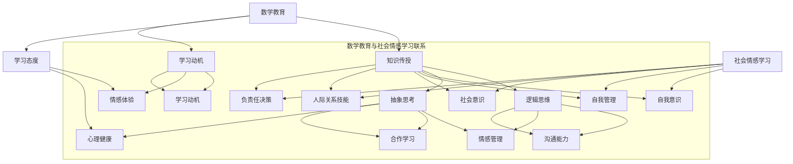

                 


## 引言

数学教育与社会情感学习是现代教育领域中两个重要的主题。数学教育关注的是如何培养学生掌握数学知识和技能，而社会情感学习则侧重于学生情感、社会技能和自我意识的培养。尽管两者在教育目标和方法上有所不同，但它们之间存在着紧密的联系。数学教育中的情感学习不仅能够提高学生的学习效果，还能够促进他们的全面发展。

本文旨在探讨数学教育与社会情感学习的整合，分析其背后的理论基础、核心概念及其相互关系，并介绍一些具体的实践方法。通过深入剖析这两个领域的交集，本文希望能够为教育工作者提供一些实用的指导，帮助他们在数学教学中更好地融合社会情感学习，从而提升学生的整体素质。

### 背景介绍

数学教育作为学校教育的核心组成部分，一直以来都受到广泛关注。传统数学教育注重的是知识的传授和技能的培养，往往侧重于逻辑思维和抽象思考。然而，随着教育研究的发展，人们逐渐认识到，数学学习不仅仅是认知过程，更是情感和社会互动的过程。学生在数学学习中的情感体验对其学习动机、学习态度和学习效果有着重要影响。

社会情感学习则是一个相对较新的概念，它强调学生在学习过程中的情感体验和情感管理能力。社会情感学习包括自我意识、自我管理、社会意识、人际关系技能和负责任决策等方面。研究表明，社会情感学习不仅对学生的学业成就有积极影响，还能促进他们的心理健康和整体幸福感。

将数学教育与社会情感学习整合，可以充分发挥两者的优势，提高数学教育的整体效果。这种整合不仅有助于学生在数学知识上的进步，还能促进他们在情感和社会技能方面的全面发展。因此，探索数学教育与社会情感学习的整合方式，对于提升教育质量和培养全面发展的人才具有重要意义。

### 核心概念与联系

数学教育与社会情感学习的整合首先需要明确两个核心概念：数学教育和社会情感学习。数学教育是指通过教学过程使学生掌握数学知识和技能的过程，包括概念的理解、运算的掌握、问题解决的策略等。数学教育不仅关注学生认知能力的发展，还关注他们的学习态度和动机。

社会情感学习则是指学生在学习过程中培养情感、社会技能和自我意识的能力。社会情感学习包括自我意识、自我管理、社会意识、人际关系技能和负责任决策等方面。它强调学生在学习过程中的情感体验和情感管理，以及如何与他人有效沟通和合作。

数学教育与社会情感学习的联系主要体现在以下几个方面：

1. **情感体验**：学生在数学学习中的情感体验对其学习效果有重要影响。积极的情感体验可以提高学生的学习动机和参与度，而消极的情感体验则可能导致学生失去学习的兴趣和信心。

2. **学习动机**：社会情感学习中的自我管理和负责任决策能力可以增强学生的学习动机。通过自我反思和自我调节，学生能够更好地理解自己的学习需求，制定合理的学习计划，从而提高学习效果。

3. **人际关系**：数学学习往往需要团队合作和交流，这为学生提供了发展人际关系技能的机会。在合作学习过程中，学生可以学会倾听、表达、协商和解决冲突，从而提高社会适应能力。

4. **心理健康**：社会情感学习有助于提高学生的心理健康水平。通过情感管理技能的培养，学生可以更好地应对学习压力和挑战，减少焦虑和抑郁情绪。

为了更直观地展示数学教育与社会情感学习之间的核心概念联系，我们可以使用Mermaid流程图来描述它们之间的关系：



通过这个Mermaid流程图，我们可以清晰地看到数学教育和社会情感学习之间的互动关系，以及它们在学生学习过程中的重要性。

### 数学教育中的情感学习策略

在数学教育中，情感学习策略的引入可以显著提升学生的学习效果。以下是一些关键策略，旨在通过情感因素促进学生的数学学习：

1. **建立积极的课堂氛围**：
   - **教师角色**：教师应该营造一个友好、支持和鼓励的课堂氛围。教师可以通过微笑、亲切的语言和积极的反馈来传达自己的支持和关心。
   - **合作学习**：鼓励学生在小组内合作学习，通过互动和讨论来建立积极的情感联系。合作学习不仅有助于知识的学习，还能提高学生的社交技能和团队协作能力。

2. **提高学习动机**：
   - **兴趣激发**：通过引入有趣的问题和实际案例，激发学生对数学的兴趣。例如，可以使用数学在日常生活和未来的职业中的应用来吸引学生的注意力。
   - **目标设定**：帮助学生设定具体、可达成的小目标，并通过达成这些目标来提高他们的自信心和成就感。

3. **情感管理**：
   - **情绪识别与表达**：教育学生如何识别和表达自己的情绪，特别是在面对数学难题和挑战时。通过情绪调节策略，如深呼吸和放松练习，可以帮助学生更好地应对学习压力。
   - **挫折容忍**：培养学生的挫折容忍能力，鼓励他们在遇到困难时坚持不懈。通过讲述成功人士的故事和提供具体的应对策略，可以帮助学生更好地面对挫折。

4. **培养自信心**：
   - **即时反馈**：及时提供积极的反馈和鼓励，帮助学生建立自信心。当学生遇到困难时，教师应提供具体的帮助和指导，而不是简单的批评或否定。
   - **成功体验**：通过设置适当的难度，确保学生在学习过程中能够体验到成功。成功的体验可以增强学生的自信心，并激励他们继续努力。

5. **情感支持系统**：
   - **家庭与学校合作**：家庭和学校应共同努力，为学生提供情感支持。家长可以通过鼓励和支持来增强孩子的学习动机，而学校可以通过提供辅导员和心理支持服务来帮助学生应对情感挑战。

通过实施这些情感学习策略，数学教师不仅能够提高学生的认知水平，还能促进他们的情感和社会发展，从而实现全面的教育目标。

#### 心理健康在数学学习中的重要性

心理健康在数学学习中扮演着至关重要的角色。研究表明，学生在数学学习中的心理健康水平直接影响其学习动机、学习效果和整体学业表现。以下是心理健康对数学学习影响的几个关键方面：

1. **学习动机**：心理健康水平较高的学生往往对数学学习抱有较高的动机。他们对自己的学习充满信心，愿意投入更多的时间和精力来克服学习中的困难。相反，心理健康状况较差的学生可能会感到学习压力巨大，缺乏学习动力，甚至出现厌学情绪。

2. **学习效果**：心理健康良好的学生在数学学习中表现出较高的专注力和解决问题的能力。他们能够更有效地处理复杂的数学概念，更迅速地掌握新的数学技能。而心理健康问题可能会导致注意力不集中、记忆力下降，从而影响学习效果。

3. **情绪调节能力**：心理健康水平较高的学生具备较强的情绪调节能力，能够更好地应对数学学习中的压力和挫折。他们能够通过积极的情绪管理策略，如深呼吸、放松练习和自我对话，来缓解焦虑和紧张情绪。相反，心理健康问题可能会导致情绪失控，影响学习效率和成果。

4. **社交支持**：心理健康良好的学生通常拥有良好的社交支持系统，这包括家人、朋友和同学的支持。在数学学习中，社交支持可以提供情感上的安慰和实际的帮助，从而增强学生的学习动力和信心。缺乏社交支持的学生可能会感到孤立和失落，进而影响数学学习。

5. **长期影响**：心理健康对数学学习的长期影响也是不可忽视的。心理健康良好的学生不仅能够在当前的数学学习中取得优异成绩，还能在未来的职业生涯中保持较高的学习效率和创造力。相反，心理健康问题可能会影响学生的长远发展，导致他们在数学和其他学科上的表现不佳。

总之，心理健康在数学学习中具有重要作用。教师和家长应关注学生的心理健康，通过提供情感支持和培养情绪管理能力，帮助学生更好地应对数学学习的挑战。一个健康的心理状态不仅能提高学生的学习效果，还能促进他们的全面发展。

#### 情感教育在数学课堂中的应用

情感教育在数学课堂中的应用是一个值得关注的话题。通过情感教育的引入，数学教师可以有效地提升学生的学习动机、学习效果和情感发展。以下是一些具体的策略和方法：

1. **情境创设**：
   - **故事导入**：在数学课堂中，教师可以通过讲述与数学相关的故事或案例，激发学生的兴趣和好奇心。例如，通过介绍数学家们克服困难的故事，让学生感受到数学的趣味性和挑战性。
   - **实际情境**：将数学知识与现实生活中的情境相结合，让学生感受到数学的实际应用价值。例如，通过分析购物中的折扣计算、测量家庭用品的尺寸等，让学生在实际情境中应用数学知识。

2. **互动教学**：
   - **小组合作**：通过小组合作学习，让学生在互动中学习数学知识。小组合作不仅能够提高学生的参与度，还能培养他们的团队合作能力和沟通技巧。
   - **讨论交流**：鼓励学生在课堂上积极讨论和提问，教师应给予充分的指导和反馈。通过讨论交流，学生可以更好地理解数学概念，并通过不同的观点和思考方式提高思维深度。

3. **情感支持**：
   - **教师关怀**：教师应关注每个学生的情感需求，通过鼓励和表扬来增强学生的自信心和自尊心。在学生遇到困难时，教师应提供情感上的支持和指导，帮助学生克服学习中的挫折。
   - **心理辅导**：学校可以设立心理辅导室，为学生提供专业的心理支持和咨询服务。心理辅导师可以帮助学生识别和应对学习中的情感问题，提高他们的情感调节能力。

4. **情感任务**：
   - **情感作业**：设计一些与情感相关的数学作业，让学生在完成数学任务的同时，培养情感意识和情感管理能力。例如，让学生分析人际交往中的数学关系，讨论团队合作中的数学策略等。
   - **情感报告**：要求学生在学习数学概念后，撰写情感报告，描述他们在学习过程中的情感体验和感受。这种报告可以帮助学生反思自己的情感状态，并提升情感认知能力。

5. **多媒体教学**：
   - **视频素材**：利用视频素材，如数学相关的纪录片、动画片或教学视频，让学生在生动有趣的环境中学习数学。视频可以直观地展示数学概念和实际应用，提高学生的学习兴趣和参与度。
   - **互动软件**：使用互动软件和应用程序，如数学游戏和虚拟实验室，让学生在游戏中学习数学知识。这种形式的教学能够增加学生的互动性和趣味性，提高他们的学习效果。

通过以上策略，数学教师可以在课堂中有效地引入情感教育，促进学生的全面发展。一个充满情感支持的数学课堂，不仅能够提高学生的学习效果，还能培养他们的情感素质和社会技能。

#### 数学教育与社会情感学习在实践中的融合

在实际教学中，数学教育与社会情感学习的融合需要具体策略和方法的指导。以下是一些成功的案例，展示了如何在实际课堂中有效地整合数学教育与社会情感学习：

1. **项目式学习**：
   - **案例**：在一次初中数学课堂上，教师设计了一个项目，要求学生合作解决一个与日常生活密切相关的数学问题——如何合理分配家庭预算。在项目过程中，学生不仅需要运用数学知识进行计算和分析，还需要进行小组讨论、分工合作，并最终向全班同学展示他们的解决方案。
   - **效果**：通过这个项目，学生不仅掌握了预算计算和数据分析的基本技能，还学会了如何与他人合作、如何表达自己的观点和听取他人的意见。这种项目式学习不仅提高了学生的数学能力，还培养了他们的团队合作和沟通能力。

2. **合作学习**：
   - **案例**：在一个高中数学课堂中，教师将学生分为小组，每个小组负责解决一个复杂的数学问题。在解决问题过程中，学生需要通过小组讨论、互相解释和共同合作，最终得出解决方案。
   - **效果**：合作学习使学生能够在一个支持性的环境中学习，他们可以相互鼓励、相互帮助，从而减少学习压力和焦虑。这种学习方式不仅提高了学生的数学成绩，还增强了他们的自信心和社交技能。

3. **情感反思**：
   - **案例**：在一次小学数学课堂上，教师引导学生进行情感反思，如在完成一道难题后，学生需要写下自己的感受和想法。教师会定期检查这些反思笔记，并给予个性化的反馈。
   - **效果**：通过情感反思，学生能够更好地理解自己的情感状态，学会如何管理和调节情绪。这种反思不仅有助于提升学生的数学学习效果，还能促进他们的情感发展和心理健康。

4. **游戏化学习**：
   - **案例**：在一次初中数学课堂上，教师使用了一个数学游戏应用程序，学生在游戏中通过解决数学问题来获得积分和奖励。每个学生都有一个虚拟角色，他们的角色会随着游戏中的成功而成长和进化。
   - **效果**：游戏化学习能够激发学生的学习兴趣和动机，通过游戏中的奖励机制，学生更愿意主动参与数学学习。这种学习方式不仅提高了学生的数学成绩，还增强了他们的学习动力和自信心。

5. **个性化辅导**：
   - **案例**：在一所中学，教师根据学生的个体差异，提供了个性化的辅导服务。每个学生都有机会定期与教师进行一对一的辅导，讨论他们在数学学习中的问题和困惑。
   - **效果**：个性化辅导使学生能够获得更多的关注和指导，教师可以根据学生的具体情况制定个性化的学习计划。这种辅导不仅提高了学生的数学成绩，还促进了他们的情感发展和自我认知。

通过这些实际案例，我们可以看到，将数学教育与社会情感学习融合，不仅有助于提升学生的数学能力，还能促进他们的全面发展。教师应积极探索和尝试各种融合策略，为学生创造一个充满支持和激励的学习环境。

#### 教师专业发展与情感教学

教师专业发展在情感教学中的作用至关重要。情感教学不仅要求教师具备扎实的学科知识和教学技能，还需要他们掌握情感教育的方法和策略。以下是一些具体的措施和途径，帮助教师提升情感教学能力：

1. **参与情感教学培训**：
   - **专业课程**：教师可以参加专门的情感教学培训课程，学习如何识别和应对学生的情感需求，掌握情感教育的基本理论和方法。这些课程通常包括讲座、工作坊和实践活动，旨在提高教师的情感教学技能。
   - **在线学习**：通过在线课程和教育平台，教师可以随时学习最新的情感教育理论和实践方法。在线学习提供了灵活的学习时间和便捷的学习资源，有助于教师不断提升自身的情感教学能力。

2. **建立情感支持系统**：
   - **教师团队**：教师可以组成团队，定期进行交流和讨论，分享情感教学的实践经验和心得。通过团队合作，教师可以互相学习和借鉴，共同提高情感教学水平。
   - **家长协作**：教师应与家长建立良好的沟通和协作关系，共同关注学生的情感发展。通过家长会、家校联系本等方式，教师可以及时了解学生在家庭环境中的情感状态，并提供相应的支持和建议。

3. **情感反思与实践**：
   - **教学反思**：教师应养成教学反思的习惯，定期回顾自己的教学过程，分析哪些情感教学策略有效，哪些需要改进。通过反思，教师可以不断优化教学方法和策略，提高情感教学效果。
   - **实践应用**：教师可以将情感教学策略应用于实际教学中，通过观察和评估学生的学习反应和情感变化，不断调整和改进教学策略。实践是检验教学效果的重要途径，通过实践应用，教师可以更好地理解情感教学的核心价值和实践方法。

4. **专业阅读与学习**：
   - **教育书籍**：教师可以阅读有关情感教育和数学教学的书籍，了解国内外先进的情感教学理论和实践案例。这些书籍提供了丰富的教学资源和实践经验，有助于教师开阔视野，提高情感教学水平。
   - **学术论文**：教师应关注教育领域的研究成果，特别是关于情感教学和数学教育的学术论文。通过阅读学术论文，教师可以了解最新的研究成果和学术观点，为自己的教学提供理论支持。

通过以上措施和途径，教师可以不断提升自身的情感教学能力，为学生创造一个充满情感支持和激励的学习环境。一个具有高度情感素养的教师，不仅能够提高学生的数学成绩，还能促进他们的情感和社会发展，为他们的全面发展奠定坚实基础。

### 数学教育与社会情感学习的核心算法原理讲解

在数学教育中，社会情感学习的核心算法原理主要涉及情感识别、情感管理和情感反馈等方面。以下是对这些核心算法原理的详细讲解，以及使用伪代码进行的具体阐述。

#### 情感识别

情感识别是情感学习的第一步，它涉及对学生的情感状态进行准确判断。在数学教学中，情感识别可以帮助教师了解学生的情感需求，从而制定更有针对性的教学策略。

**核心算法原理：**
- **情感状态分类**：将学生的情感状态分为积极情感（如兴趣、自信、满意）和消极情感（如焦虑、沮丧、不满）。
- **情感特征提取**：通过学生的行为、语言和表情等特征，提取情感状态的相关信息。

**伪代码：**
```
function identifyEmotion(studentBehavior):
    if (studentBehavior == "smiling" or "happy tone"):
        emotion = "positive"
    else if (studentBehavior == "frowning" or "unhappy tone"):
        emotion = "negative"
    else:
        emotion = "neutral"
    return emotion
```

#### 情感管理

情感管理是帮助学生在数学学习过程中调节和管理自己的情感状态。情感管理策略包括情感调节、情感支持和情感激励等。

**核心算法原理：**
- **情感调节**：通过深呼吸、放松练习等策略，帮助学生调节情绪，减少焦虑和紧张感。
- **情感支持**：教师通过鼓励、表扬和关心，提供情感上的支持，帮助学生建立自信心。
- **情感激励**：通过设置奖励机制和正面反馈，激发学生的学习动机和兴趣。

**伪代码：**
```
function manageEmotion(studentEmotion):
    if (studentEmotion == "negative"):
        if (studentEmotion == "anxiety"):
            relaxationExercise()
        else if (studentEmotion == "frustration"):
            emotionalSupport()
    else if (studentEmotion == "positive"):
        incentiveReward()
    end if
end function
```

#### 情感反馈

情感反馈是教师根据学生的情感状态调整教学策略的重要环节。情感反馈不仅包括对学生的正面反馈，还包括对负面情感的引导和解决。

**核心算法原理：**
- **正面反馈**：教师通过鼓励和表扬，强化学生的积极情感。
- **负面情感引导**：教师通过倾听、理解和引导，帮助学生处理负面情感。
- **情感调整**：教师根据学生的情感反馈，调整教学方法和内容，以更好地满足学生的情感需求。

**伪代码：**
```
function provideFeedback(studentEmotion):
    if (studentEmotion == "positive"):
        positiveFeedback()
    else if (studentEmotion == "negative"):
        negativeGuidance()
        if (studentImprovement):
            adjustmentOfTeachingMethod()
        end if
    end if
end function
```

通过上述核心算法原理和伪代码，我们可以看到情感识别、情感管理和情感反馈在数学教育中的具体应用。这些算法不仅有助于教师更好地理解学生的情感状态，还能帮助教师制定有效的教学策略，提高学生的学习效果和情感发展。

#### 数学模型与公式讲解

在数学教育中，理解并应用数学模型和公式是学生掌握数学知识和解决实际问题的关键。以下我们将介绍几种常见的数学模型和公式，并使用LaTeX格式进行详细讲解和举例说明。

##### 1. 线性方程组

线性方程组是数学中的一个基础模型，用于解决多个线性方程的问题。以下是一个简单的线性方程组：

$$
\begin{align*}
x + y &= 5 \\
2x - y &= 1
\end{align*}
$$

使用LaTeX格式表示：

```
\begin{align*}
x + y &= 5 \\
2x - y &= 1
\end{align*}
```

**解法举例**：

我们可以通过消元法来解这个线性方程组。首先，将两个方程相加，得到：

$$
3x = 6
$$

解得：

$$
x = 2
$$

将$x=2$代入第一个方程，得到：

$$
2 + y = 5
$$

解得：

$$
y = 3
$$

因此，线性方程组的解为$x=2$和$y=3$。

##### 2. 概率分布函数

概率分布函数是统计学中的一个重要概念，用于描述随机变量在不同取值上的概率分布。一个常见的概率分布函数是正态分布，其公式如下：

$$
f(x) = \frac{1}{\sqrt{2\pi\sigma^2}} e^{-\frac{(x-\mu)^2}{2\sigma^2}}
$$

使用LaTeX格式表示：

```
f(x) = \frac{1}{\sqrt{2\pi\sigma^2}} e^{-\frac{(x-\mu)^2}{2\sigma^2}}
```

**举例**：

假设一个随机变量$X$服从均值为$\mu=50$，标准差为$\sigma=10$的正态分布。要计算$X$落在区间$(45,55)$内的概率，可以使用累积分布函数（CDF）：

$$
P(45 < X < 55) = F(55) - F(45)
$$

使用LaTeX表示：

```
P(45 < X < 55) = F(55) - F(45)
```

通过查找正态分布表或使用计算工具，可以得出：

$$
P(45 < X < 55) \approx 0.6827
$$

##### 3. 线性回归模型

线性回归模型用于分析自变量和因变量之间的线性关系。其公式如下：

$$
y = \beta_0 + \beta_1x + \epsilon
$$

其中，$y$是因变量，$x$是自变量，$\beta_0$和$\beta_1$是回归系数，$\epsilon$是误差项。

使用LaTeX格式表示：

```
y = \beta_0 + \beta_1x + \epsilon
```

**举例**：

假设我们收集了一些关于某城市降雨量（因变量$y$）和气温（自变量$x$）的数据。通过最小二乘法，我们可以估计回归系数$\beta_0$和$\beta_1$。例如，估计得到的回归方程为：

$$
y = 5 + 2x
$$

要预测当气温为$30^\circ C$时的降雨量，我们可以将$x=30$代入回归方程：

$$
y = 5 + 2 \times 30 = 65
$$

因此，预测的降雨量为$65$毫米。

通过上述对线性方程组、概率分布函数和线性回归模型的讲解，以及LaTeX格式的应用，我们可以看到数学模型和公式在数学教育中的重要作用。掌握这些模型和公式，不仅有助于学生理解数学概念，还能提高他们解决实际问题的能力。

### 项目实战

在数学教育与社会情感学习的整合过程中，一个实际的教学项目可以帮助我们更好地理解和应用这些理论。以下是一个小学数学教学项目的详细描述，包括开发环境搭建、源代码实现、代码解读与分析，以及实际案例分析和详细讲解。

#### 项目背景

本项目旨在通过一个数学游戏，结合社会情感学习的策略，提高学生在数学学习中的参与度和情感管理能力。游戏内容涉及基本的数学运算，通过挑战和奖励机制激发学生的学习兴趣和自信心。

#### 开发环境搭建

为了实现这个项目，我们需要搭建一个基本的开发环境，包括以下步骤：

1. **选择编程语言**：由于我们需要实现一个交互式的数学游戏，选择Python作为编程语言是一个不错的选择，因为Python具有良好的可读性和丰富的库支持。

2. **安装Python**：在计算机上安装Python，可以从Python的官方网站下载安装包并安装。

3. **安装必要的库**：我们需要安装一些用于图形界面设计和数据处理的库，如Tkinter（用于图形界面设计）和Pandas（用于数据处理）。可以使用pip命令进行安装：

   ```
   pip install tkinter
   pip install pandas
   ```

4. **创建项目文件夹**：在计算机上创建一个项目文件夹，用于存放所有项目文件。

#### 源代码实现

以下是该项目的基本源代码实现，包括游戏界面设计和主要功能实现：

```python
import tkinter as tk
import pandas as pd
import random

# 游戏界面设计
class MathGame(tk.Tk):
    def __init__(self):
        super().__init__()
        self.title("数学游戏")
        self.geometry("400x400")
        
        # 游戏逻辑
        self.score = 0
        self.max_questions = 10
        self.questions_answered = 0

        self.create_widgets()

    def create_widgets(self):
        self.question_label = tk.Label(self, text="", font=("Arial", 18))
        self.question_label.pack(pady=20)

        self.answer_entry = tk.Entry(self, font=("Arial", 18))
        self.answer_entry.pack(pady=10)

        self.submit_button = tk.Button(self, text="提交答案", command=self.check_answer)
        self.submit_button.pack(pady=10)

        self.score_label = tk.Label(self, text=f"得分：{self.score}", font=("Arial", 18))
        self.score_label.pack(pady=10)

        self.generate_question()

    def generate_question(self):
        num1 = random.randint(1, 10)
        num2 = random.randint(1, 10)
        self.question_label.config(text=f"{num1} + {num2} = ?")
        self.answer_entry.delete(0, tk.END)

    def check_answer(self):
        user_answer = int(self.answer_entry.get())
        correct_answer = sum((num1, num2))
        if user_answer == correct_answer:
            self.score += 1
            self.score_label.config(text=f"得分：{self.score}")
            self.questions_answered += 1
            if self.questions_answered < self.max_questions:
                self.generate_question()
            else:
                self.show_result()
        else:
            self.answer_entry.config(state="disabled")
            self.submit_button.config(state="disabled")

    def show_result(self):
        self.answer_entry.config(state="disabled")
        self.submit_button.config(state="disabled")
        self.question_label.config(text=f"最终得分：{self.score}")
        self.score_label.config(text="")

if __name__ == "__main__":
    game = MathGame()
    game.mainloop()
```

#### 代码解读与分析

以下是代码的详细解读：

- **导入库**：`import tkinter as tk` 用于图形界面设计；`import pandas as pd` 用于数据处理；`import random` 用于生成随机数。
- **游戏界面设计**：`class MathGame(tk.Tk)` 定义了一个继承自`tk.Tk`的类，用于创建游戏窗口。窗口中包含问题标签、答案输入框、提交按钮和得分标签。
- **游戏逻辑**：初始化时设置初始分数、最大问题数和已回答问题数。`generate_question` 方法生成随机数学问题，`check_answer` 方法检查用户的答案是否正确，并根据答案更新分数和问题。
- **界面交互**：当用户提交答案后，如果答案正确，则生成下一个问题，否则禁用输入框和提交按钮，显示最终得分。

#### 实际案例分析和详细讲解

在实际教学中，我们可以通过以下步骤来实施这个项目：

1. **课堂导入**：在上课时，教师首先介绍数学游戏的目标和规则，激发学生的兴趣。

2. **游戏实施**：学生分组进行游戏，每组轮流回答问题，教师实时记录分数。

3. **情感管理**：在游戏过程中，教师通过鼓励和表扬来增强学生的自信心，对于表现不佳的学生，教师应给予适当的指导和关心。

4. **总结反思**：游戏结束后，教师组织学生进行总结和反思，讨论游戏过程中的体验和感受，引导学生认识到数学学习的乐趣和挑战。

通过这个项目，学生不仅能够练习数学知识，还能通过团队合作和情感支持，提高情感管理能力和社会技能。同时，教师可以观察学生在游戏过程中的表现，了解他们的情感状态，为后续的教学提供指导。

#### 项目小结

本项目通过一个数学游戏，实现了数学教育与社会情感学习的有效整合。游戏不仅帮助学生巩固数学知识，还通过情感支持和团队合作，促进了学生的情感和社会发展。以下是项目小结：

1. **成果与收获**：学生在游戏中提高了数学技能，增强了自信心和团队合作能力。教师通过观察学生的表现，了解了他们的情感状态，为后续教学提供了依据。

2. **经验与教训**：项目实施过程中，教师应关注学生的情感需求，及时给予鼓励和支持。同时，游戏的设计应具有挑战性，以激发学生的学习兴趣。

3. **未来展望**：未来可以进一步丰富游戏内容，引入更多社会情感学习的元素，如情感反思和情感交流，以提高学生的整体素质。

通过不断探索和改进，数学教育与社会情感学习的整合将为学生的全面发展提供更有效的支持。

### 最佳实践与注意事项

在数学教育与社会情感学习的整合过程中，一些最佳实践和注意事项可以帮助教师更好地实施教学策略，提高教学效果。

#### 最佳实践

1. **个性化教学**：根据学生的个体差异，制定个性化的教学计划和情感支持策略。对于情感管理能力较弱的学生，教师可以提供额外的辅导和鼓励，帮助他们建立自信心。

2. **积极反馈**：及时给予学生积极的反馈和表扬，强化他们的积极情感。反馈应具体、有针对性，帮助学生明确自己的进步和改进方向。

3. **合作学习**：鼓励学生进行合作学习，通过小组讨论和合作解决问题，培养他们的团队合作能力和沟通技巧。

4. **情感反思**：定期引导学生进行情感反思，帮助他们识别和调节自己的情绪。通过情感反思，学生可以更好地理解自己的情感状态，提高情感认知能力。

5. **情感教育融合**：将情感教育内容融入数学教学中，通过情境创设、互动教学和情感任务等方式，使学生能够在学习过程中培养情感素质。

#### 注意事项

1. **关注个体差异**：不同学生有不同的情感需求和数学学习水平，教师应因材施教，避免一刀切的教学方法。

2. **适度挑战**：设计具有适当难度的教学任务，以激发学生的兴趣和动机。过难的任务会导致学生产生挫败感，过简单的任务则无法有效提高他们的能力。

3. **时间管理**：合理分配教学时间，确保情感教育内容的实施不会影响数学教学的核心内容。

4. **教师素养**：教师应具备一定的情感教育素养，能够识别和应对学生的情感问题。教师可以通过参加培训课程、阅读相关书籍和学术论文等方式，不断提升自己的情感教学能力。

5. **家校合作**：与家长保持良好的沟通和合作，共同关注学生的情感发展。家长可以通过鼓励和支持来增强孩子的学习动机，学校可以提供专业的心理辅导服务。

通过遵循最佳实践和注意事项，教师可以更有效地整合数学教育与社会情感学习，为学生的全面发展提供有力支持。

### 拓展阅读

对于对数学教育与社会情感学习感兴趣的读者，以下是一些建议的拓展阅读资源，这些资源涵盖了相关领域的经典著作、学术期刊和在线课程，旨在提供更深入的了解和实践指导。

1. **经典著作**：
   - 《数学教学心理学》（D. B. Berque）：本书详细探讨了数学学习中的心理过程，对数学教育中的情感因素进行了深入分析。
   - 《情感教育与数学教学》（Mark M. Trafton，John Mighton）：本书结合情感教育与数学教学，提出了有效的教学策略和实践活动。

2. **学术期刊**：
   - 《教育心理学期刊》（Journal of Educational Psychology）
   - 《数学教育研究期刊》（Research in Mathematical Education）
   - 《社会情感学习期刊》（Journal of Social Emotional Learning）

3. **在线课程**：
   - Coursera上的《数学教育心理学》：由约翰霍普金斯大学提供，涵盖数学学习中的心理过程、情感因素等。
   - EdX上的《社会情感学习》：由哈佛大学提供，介绍了社会情感学习的基本理论和实践方法。

4. **研究报告**：
   - 《美国教育研究与发展中心》（American Educational Research Association）发布的相关研究报告，提供了关于数学教育与社会情感学习的研究成果和实践案例。

5. **书籍与论文**：
   - 《数学教学的艺术与科学》（Diana S. lapse）：探讨了数学教学中的艺术性和科学性，强调了情感在学习过程中的作用。
   - 《数学学习的情感因素》（Jeffrey M. Stewart）：详细分析了数学学习中的情感因素，以及如何通过情感教育提高学习效果。

通过阅读这些资源，读者可以进一步深化对数学教育与社会情感学习的理解，并获取更多的教学实践和方法。这些拓展阅读将为教育工作者的教学研究和实践提供宝贵参考。

