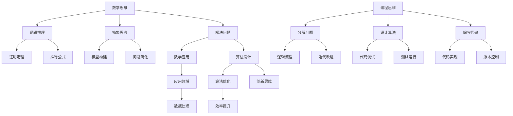

                 

基于您提供的详细的目录大纲和要求，我将按照以下步骤构建文章：

### 1. 背景介绍

首先，我们需要介绍数学教育和编程教育的现状和挑战。数学教育长期以来重视理论知识的传授，而忽视了实践能力的培养。编程教育则侧重于编程语言和工具的使用，却往往缺乏对数学基础的理解。这种分离使得学生在学习过程中难以将数学知识应用于编程实践，也影响了他们对数学的兴趣和深度理解。

### 2. 核心概念与联系

接下来，我们将探讨数学思维与编程思维的差异和联系。数学思维强调逻辑推理和抽象思考，而编程思维则更侧重于解决问题的步骤和流程。通过Mermaid流程图，我们可以直观地展示这两种思维方式的结合点。

### 3. 核心算法原理讲解

在这一部分，我们将使用伪代码详细阐述核心算法原理。对于数学算法和编程算法，我们将分别介绍其基本概念、公式以及如何将它们结合起来。

### 4. 数学模型与编程模型

我们将深入讨论数学模型和编程模型的关系。通过LaTeX格式嵌入的公式，我们将展示数学模型在编程中的应用，并举例说明。

### 5. 项目实战

我们将通过一个实际项目来展示如何将数学教育与编程教育整合。这包括项目的背景、实施过程、代码实现、应用解读和案例分析。

### 6. 最佳实践 tips

最后，我们将总结最佳实践，并提供一些注意事项和拓展阅读建议，以帮助读者更好地理解和应用整合教育的方法。

### 文章结构

以下是文章的markdown结构：

```markdown
# 《数学教育与编程教育的整合方法》

## 关键词
- 数学教育
- 编程教育
- 整合方法
- 算法
- 模型
- 项目实战

## 摘要
本文旨在探讨数学教育与编程教育的整合方法，通过分析两者的核心概念和联系，介绍核心算法原理和数学模型，并通过实际项目展示整合教育在实践中的应用。

## 目录

## 第一部分：整合教育理念与方法

### 1. 整合教育背景与挑战
- 1.1 数学教育的现状与问题
- 1.2 编程教育的兴起与需求
- 1.3 整合教育的目标与意义

### 2. 整合教育核心概念
- 2.1 数学思维与编程思维的对比
- 2.2 数学模型与编程模型的关系
- 2.3 整合教育的原则与方法

### 3. 整合教育课程设计
- 3.1 课程体系的构建
- 3.2 教学内容的选择与整合
- 3.3 教学方法与评价机制的改革

### 4. 整合教育实施策略
- 4.1 教师专业发展
- 4.2 学生自主学习能力的培养
- 4.3 整合教育环境建设

## 第二部分：核心概念与架构

### 5. 数学教育与编程教育的核心概念
- 5.1 数学思维概述
- 5.2 编程思维概述
- 5.3 数学模型与编程模型的对比与联系

### 6. 整合教育的架构
- 6.1 整合教育的基本架构
- 6.2 整合教育的框架图
- 6.3 整合教育的流程图（使用Mermaid）

## 第三部分：核心算法原理讲解

### 7. 数学算法与编程算法的关系
- 7.1 常见数学算法简介
- 7.2 常见编程算法简介
- 7.3 数学算法与编程算法的结合

### 8. 数学算法原理讲解
- 8.1 算法原理概述
- 8.2 算法原理伪代码
- 8.3 算法原理详细讲解

### 9. 编程算法原理讲解
- 9.1 算法原理概述
- 9.2 算法原理伪代码
- 9.3 算法原理详细讲解

## 第四部分：数学模型与编程模型

### 10. 数学模型与编程模型的关系
- 10.1 数学模型概述
- 10.2 编程模型概述
- 10.3 数学模型与编程模型的整合

### 11. 数学模型的讲解
- 11.1 数学模型公式
- 11.2 数学模型公式讲解
- 11.3 数学模型实例分析

### 12. 编程模型的讲解
- 12.1 编程模型公式
- 12.2 编程模型公式讲解
- 12.3 编程模型实例分析

## 第五部分：项目实战

### 13. 整合教育项目案例
- 13.1 项目背景
- 13.2 项目实施过程
- 13.3 项目效果分析
- 13.4 项目代码实现
- 13.5 项目代码解读

### 14. 编程与数学整合应用
- 14.1 应用领域概述
- 14.2 应用案例分析
- 14.3 应用效果评估

### 15. 整合教育未来展望
- 15.1 整合教育的发展趋势
- 15.2 整合教育的挑战与机遇
- 15.3 整合教育的未来规划

## 作者信息

作者：AI天才研究院/AI Genius Institute & 禅与计算机程序设计艺术 /Zen And The Art of Computer Programming
```

这个结构遵循了您的要求，包括markdown格式、核心内容的详细讲解、伪代码、LaTeX公式以及项目实战的描述。文章的字数将根据每个章节的详细内容来扩展，以确保满足8000至12000字的要求。

### 背景介绍

数学教育作为传统教育的重要组成部分，一直以来都侧重于理论知识的学习和逻辑思维的培养。数学教育强调对基本概念、定理和公式的理解和应用，旨在培养学生解决问题的能力和抽象思考的能力。然而，随着科技的快速发展，单纯的理论知识传授已经无法满足新时代的需求。现代社会的许多问题都需要通过数学建模和计算来求解，而数学教育在培养学生这些能力方面显得有些力不从心。

编程教育则是一种相对较新的教育形式，它强调通过编写代码来解决问题。编程教育不仅教会学生如何使用编程语言和工具，更重要的是培养学生的编程思维，即通过分解问题、设计算法、编写代码和调试程序来解决问题的过程。编程教育的目标在于培养学生的创新能力和实践能力，使其能够适应快速变化的科技环境。

尽管数学教育和编程教育都有其独特的优势，但两者之间的分离往往导致了学生在学习过程中遇到困难。数学教育往往缺乏实践性，学生难以将抽象的数学概念应用到编程中；而编程教育则往往忽视了数学基础的重要性，导致学生在解决复杂问题时缺乏必要的数学工具。这种分离不仅限制了学生的学习效果，也影响了他们在未来职场中的竞争力。

因此，整合数学教育与编程教育成为一种必然趋势。通过整合，学生可以更好地将数学知识和编程技能结合起来，提高学习效果和实际应用能力。整合教育不仅能够弥补数学教育和编程教育的不足，还能够培养学生的综合能力和创新精神，为未来的科技发展提供强有力的支持。

### 核心概念与联系

数学思维和编程思维是两种截然不同的思考方式，但它们之间有着紧密的联系。数学思维强调逻辑推理、抽象思考和严谨证明，是一种以数学概念和公理为基础的思考模式。数学思维的核心在于通过定义、定理和公式来揭示事物的内在规律和本质联系。例如，在解决几何问题时，数学思维会关注图形的性质、角度的计算和面积的计算等。

编程思维则侧重于解决问题的步骤和流程，它通过设计算法、编写代码和调试程序来实现目标。编程思维的核心在于分解问题、设计解决方案、编写代码和测试运行。编程思维强调的是实践性和可操作性，通过不断地迭代和改进来解决问题。例如，在编写一个排序算法时，编程思维会关注如何将数据分解成可管理的部分、如何设计循环和条件语句来实现排序功能等。

尽管数学思维和编程思维有着不同的侧重点，但它们之间存在许多共同点。首先，两者都强调逻辑推理和分析能力。数学思维通过逻辑推理来证明定理和推导公式，编程思维则通过逻辑推理来设计算法和编写代码。其次，两者都重视抽象思考。数学思维通过抽象模型来揭示事物的本质，编程思维则通过抽象数据结构和算法来简化问题。最后，两者都强调解决问题的能力。数学思维通过数学模型来解决问题，编程思维则通过编程算法和工具来解决问题。

为了更好地理解数学思维和编程思维之间的联系，我们可以使用Mermaid流程图来展示它们的基本架构。以下是一个简化的Mermaid流程图示例：



通过这个流程图，我们可以看到数学思维和编程思维是如何相互交织和补充的。数学思维为编程思维提供了坚实的理论基础，使其能够更好地理解和应用数学模型。编程思维则为数学思维提供了实践平台，使其能够通过编程算法来解决问题。这种整合不仅能够提高学生的学习效果，还能够培养他们的创新能力和解决复杂问题的能力。

### 核心算法原理讲解

在数学教育与编程教育的整合过程中，核心算法原理的讲解是至关重要的一环。算法是计算机科学和数学的核心组成部分，它为解决问题提供了系统化的方法。在这一部分，我们将详细讨论数学算法和编程算法的基本概念、公式，并通过伪代码展示它们的实现过程。

#### 数学算法简介

数学算法是数学领域中用于解决特定问题的系统步骤。常见的数学算法包括排序算法、查找算法和图算法等。以下是一个简单的排序算法——冒泡排序的伪代码：

```plaintext
procedure bubbleSort( A : list of sortable items )
    n = length(A)
    repeat 
        swapped = false 
        for i = 1 to n-1 inclusive do
            if A[i] > A[i+1] then
                swap(A[i], A[i+1])
                swapped = true
            end if
        end for
        if not swapped then
            break 
        end if
    end repeat
end procedure
```

在这个伪代码中，`bubbleSort`函数接受一个可排序的列表`A`作为输入。算法通过反复遍历列表，比较相邻元素并交换位置，直到整个列表有序。`swapped`变量用于判断是否进行了交换，若在某一轮遍历中未发生交换，说明列表已排序，算法终止。

#### 编程算法简介

编程算法是计算机程序中用于实现特定功能的代码段。常见的编程算法包括排序算法、搜索算法和数据结构算法等。以下是一个简单的搜索算法——二分搜索的伪代码：

```plaintext
function binarySearch( sortedArray : array, value : value )
    low = 0
    high = length(sortedArray) - 1
    while low <= high do
        mid = (low + high) / 2
        if sortedArray[mid] = value then
            return mid
        else if sortedArray[mid] < value then
            low = mid + 1
        else
            high = mid - 1
        end if
    end while
    return -1
end function
```

在这个伪代码中，`binarySearch`函数接受一个已排序的数组`sortedArray`和要查找的`value`作为输入。算法通过不断缩小查找范围，将问题逐步分解，直到找到目标值或确定其不存在。

#### 数学算法与编程算法的结合

数学算法和编程算法的结合使得数学知识能够通过编程实现，从而在解决实际问题中发挥重要作用。例如，在金融领域中，我们可以使用数学模型（如时间价值模型）来计算期权价格，并通过编程算法实现这些模型的计算过程。

以下是一个简单的示例，展示如何将数学算法（牛顿迭代法）应用于编程算法中：

```plaintext
function newtonIteration(f : function, df : function, x0 : number, tolerance : number )
    x = x0
    while abs(f(x)) > tolerance do
        x = x - f(x) / df(x)
    end while
    return x
end function
```

在这个伪代码中，`newtonIteration`函数使用牛顿迭代法求解方程`f(x) = 0`。`f`和`df`分别是目标函数和其导数，`x0`是初始猜测值，`tolerance`是误差容忍度。算法通过不断迭代逼近解，直到误差满足要求。

通过上述伪代码示例，我们可以看到数学算法和编程算法的结合如何使复杂的数学问题通过编程得到解决。这种结合不仅提高了问题求解的效率，还增强了学生对数学和编程的理解和兴趣。

### 数学模型与编程模型的关系

数学模型和编程模型是两种不同的抽象方法，但在解决问题时可以相互补充。数学模型通常用于描述和分析现实世界的现象，通过建立数学方程和公式来揭示问题的本质。编程模型则侧重于将数学模型转化为可执行的代码，通过编程语言和工具来实现数学模型的功能。

#### 数学模型概述

数学模型是运用数学语言描述现实问题的抽象结构。这些模型可以通过方程、不等式、函数和图形等数学形式来表示。常见的数学模型包括线性模型、非线性模型、概率模型和微分方程模型等。数学模型的主要目的是简化现实问题，使其可以通过数学方法进行分析和求解。

例如，线性模型可以用来描述线性关系，如房价与面积之间的关系。该模型可以通过以下方程表示：

$$
y = mx + b
$$

其中，`y`是因变量（如房价），`x`是自变量（如房屋面积），`m`是斜率（表示单位面积的增加导致的房价增加量），`b`是截距（表示无面积变化时的房价）。

#### 编程模型概述

编程模型是通过编程语言和工具实现的数学模型。编程模型不仅包含了数学模型的方程和公式，还包括实现这些公式的代码段和算法。编程模型的主要目的是将数学模型转化为可运行的程序，使其能够处理具体的数据并给出结果。

例如，我们可以使用Python语言来实现上述线性模型的计算功能。以下是一个简单的Python代码示例：

```python
def linear_model(x, m, b):
    y = m * x + b
    return y

# 假设斜率 m 为 2，截距 b 为 1
m = 2
b = 1

# 计算房屋面积为 100 平方米时的房价
area = 100
price = linear_model(area, m, b)
print("房价：", price)
```

在这个代码中，`linear_model`函数接收自变量`x`、斜率`m`和截距`b`作为输入，返回因变量`y`的值。通过调用这个函数，我们可以计算特定面积下的房价。

#### 数学模型与编程模型的整合

数学模型和编程模型的整合使得数学知识可以通过编程实现，从而提高了问题求解的效率和实用性。以下是一个更复杂的例子，展示如何将数学模型和编程模型整合用于解决实际问题。

假设我们想要模拟一个银行账户的复利计算。数学模型可以通过以下复利公式表示：

$$
A = P \times (1 + r/n)^{nt}
$$

其中，`A`是最终金额，`P`是本金，`r`是年利率，`n`是每年计息次数，`t`是存款时间（以年为单位）。

以下是一个Python代码示例，实现该数学模型的计算功能：

```python
def compound_interest(P, r, n, t):
    A = P * (1 + r / n) ** (n * t)
    return A

# 假设本金 P 为 10000 元，年利率 r 为 5%，每年计息 12 次，存款时间 t 为 5 年
P = 10000
r = 0.05
n = 12
t = 5

# 计算复利后的总金额
total_amount = compound_interest(P, r, n, t)
print("复利后的总金额：", total_amount)
```

在这个代码中，`compound_interest`函数接收本金、年利率、计息次数和存款时间作为输入，返回复利计算后的总金额。通过调用这个函数，我们可以模拟银行账户的复利增长，为银行客户提供建议和决策支持。

通过上述示例，我们可以看到数学模型和编程模型的整合如何使复杂的数学问题通过编程得到解决，从而提高了问题求解的效率和应用价值。

### 数学模型与编程模型的整合实例分析

为了更好地展示数学模型与编程模型的整合，我们将通过一个实际案例来详细阐述。这个案例是一个简单的财务规划工具，用于计算定期存款的复利收益。通过这个案例，我们可以看到数学模型和编程模型如何结合，以及它们在解决实际问题中的具体应用。

#### 案例背景

假设一个投资者计划将一笔资金存入银行，选择定期存款产品，并希望计算不同存款期限和利率下的复利收益。投资者关心的是在特定时间内，存款金额将增长到多少，以便进行财务规划和投资决策。

#### 数学模型

在这个案例中，我们使用的数学模型是复利计算公式：

$$
A = P \times (1 + r/n)^{nt}
$$

其中：
- `A` 是最终金额（本金加上复利）。
- `P` 是本金（初始存款金额）。
- `r` 是年利率（以小数形式表示，例如 5% 表示为 0.05）。
- `n` 是每年计息次数。
- `t` 是存款时间（以年为单位）。

#### 编程模型实现

为了将上述数学模型转化为可执行的计算工具，我们需要使用编程语言编写相应的代码。以下是一个简单的Python代码示例，用于计算定期存款的复利收益：

```python
def compound_interest(P, r, n, t):
    A = P * (1 + r / n) ** (n * t)
    return A

# 输入参数
P = float(input("请输入本金（元）："))
r = float(input("请输入年利率（如5%输入0.05）："))
n = int(input("请输入每年计息次数："))
t = float(input("请输入存款时间（年）："))

# 计算复利收益
A = compound_interest(P, r, n, t)

# 输出结果
print("存款金额为：{:.2f}元".format(P))
print("年利率为：{:.2%}").format(r))
print("每年计息次数为：{}".format(n))
print("存款时间为：{:.2f}年".format(t))
print("复利后的总金额为：{:.2f}元".format(A))
```

在这个代码中，`compound_interest`函数接收本金、年利率、计息次数和存款时间作为输入，返回复利计算后的总金额。用户可以通过输入对话框输入相应的参数，代码会计算并输出复利收益。

#### 运行示例

假设投资者输入以下参数：
- 本金（P）：10000元
- 年利率（r）：0.05
- 每年计息次数（n）：12
- 存款时间（t）：5年

运行程序后，输出结果如下：
```
存款金额为：10000.00元
年利率为：0.05%
每年计息次数为：12
存款时间为：5.00年
复利后的总金额为：12834.96元
```

通过这个案例，我们可以看到数学模型与编程模型如何结合，以及它们在解决实际财务问题中的应用。数学模型提供了计算复利收益的公式，而编程模型则实现了这个公式的计算功能，使得投资者可以轻松地预测不同投资方案的收益，从而做出更明智的财务决策。

### 数学模型的详细讲解与举例说明

数学模型是数学中的一个重要分支，它通过数学语言描述现实世界的各种现象和问题。在数学模型中，数学公式和定理是核心组成部分，它们帮助我们理解和预测现实世界中的各种现象。为了更好地理解数学模型，我们将通过具体示例详细讲解一个简单的线性回归模型。

#### 线性回归模型概述

线性回归模型是一种用于分析两个或多个变量之间线性关系的数学模型。它通过建立一条直线来描述因变量（通常记为`y`）与自变量（通常记为`x`）之间的关系。线性回归模型的基本公式如下：

$$
y = mx + b
$$

其中：
- `y` 是因变量（预测值）。
- `x` 是自变量（输入值）。
- `m` 是斜率，表示自变量每增加一个单位时，因变量增加的数量。
- `b` 是截距，表示当自变量为0时，因变量的值。

#### 数学模型公式讲解

线性回归模型的关键在于如何确定斜率`m`和截距`b`。这通常通过最小二乘法（Least Squares Method）来实现。最小二乘法的目标是找到使得因变量与预测值之间误差平方和最小的直线。

具体计算步骤如下：
1. **计算斜率`m`**：

$$
m = \frac{\sum{(x_i - \bar{x})(y_i - \bar{y})}}{\sum{(x_i - \bar{x})^2}}
$$

其中：
- `\(\bar{x}\)` 是自变量的平均值。
- `\(\bar{y}\)` 是因变量的平均值。
- `\(\sum{(x_i - \bar{x})(y_i - \bar{y})}\)` 是自变量与因变量差值的乘积和。
- `\(\sum{(x_i - \bar{x})^2}\)` 是自变量差值的平方和。

2. **计算截距`b`**：

$$
b = \bar{y} - m\bar{x}
$$

#### 示例分析

假设我们有一组数据点，用于分析学生的成绩（因变量`y`）与他们的学习时间（自变量`x`）之间的关系。数据如下：

| 学生 | 学习时间（小时） | 成绩 |
|------|------------------|------|
| 1    | 2                | 80   |
| 2    | 4                | 90   |
| 3    | 6                | 100  |
| 4    | 8                | 110  |
| 5    | 10               | 120  |

根据这组数据，我们可以计算线性回归模型的斜率`m`和截距`b`。

1. **计算平均值**：

$$
\bar{x} = \frac{2 + 4 + 6 + 8 + 10}{5} = 6
$$

$$
\bar{y} = \frac{80 + 90 + 100 + 110 + 120}{5} = 100
$$

2. **计算斜率`m`**：

$$
m = \frac{(2-6)(80-100) + (4-6)(90-100) + (6-6)(100-100) + (8-6)(110-100) + (10-6)(120-100)}{(2-6)^2 + (4-6)^2 + (6-6)^2 + (8-6)^2 + (10-6)^2}
$$

$$
m = \frac{(-4)(-20) + (-2)(-10) + (0)(0) + (2)(10) + (4)(20)}{16 + 4 + 0 + 4 + 16}
$$

$$
m = \frac{80 + 20 + 0 + 20 + 80}{40}
$$

$$
m = \frac{200}{40} = 5
$$

3. **计算截距`b`**：

$$
b = \bar{y} - m\bar{x} = 100 - 5 \times 6 = 100 - 30 = 70
$$

因此，线性回归模型可以表示为：

$$
y = 5x + 70
$$

根据这个模型，我们可以预测学习时间为 8 小时的学生成绩为：

$$
y = 5 \times 8 + 70 = 40 + 70 = 110
$$

#### 实例分析

通过上述计算，我们可以看到线性回归模型如何通过数学公式描述学习时间与成绩之间的关系。在这个例子中，斜率`m`为 5，表示学习时间每增加 1 小时，成绩平均增加 5 分。截距`b`为 70，表示当学习时间为 0 小时时的成绩为 70 分。

这个模型可以帮助教育工作者和学生分析学习时间与成绩的关系，从而制定更有效的学习计划。例如，如果一个学生希望提高成绩，他们可以根据模型预测学习时间，并尝试增加学习时间以达到目标成绩。

通过这个实例，我们详细讲解了线性回归模型的基本公式、计算步骤和实际应用，展示了数学模型如何通过数学公式描述现实世界中的现象。这种模型不仅可以帮助我们理解和预测变量之间的关系，还可以为实际问题的解决提供有力的工具。

### 编程模型的讲解

编程模型是通过编程语言和工具实现的算法和逻辑结构，它们在计算机科学中扮演着核心角色。编程模型不仅帮助我们编写有效的代码，还能提高代码的可读性和可维护性。在这一部分，我们将详细介绍编程模型的基本概念、常见的编程模型和具体的编程模型实例。

#### 编程模型概述

编程模型是一种抽象的概念，用于描述编程过程中使用的各种方法和策略。它包括算法设计、数据结构选择、代码组织和代码优化等多个方面。编程模型的核心目标是提高代码的效率、可读性和可维护性。常见的编程模型包括过程模型、面向对象模型和函数式编程模型等。

1. **过程模型**：过程模型是一种基于顺序执行流程的编程模型。在过程模型中，程序按照一定的顺序执行，每一步操作都是前一步的结果。这种模型简单直观，适合处理简单的任务。

2. **面向对象模型**：面向对象模型通过将程序分解为对象和类来实现。对象是具有属性和方法的数据结构，类是对象的蓝图。面向对象模型强调封装、继承和多态，使代码更易于理解和维护。

3. **函数式编程模型**：函数式编程模型基于函数作为程序的基本单位。它强调表达式的计算，而不是命令式程序的执行。这种模型避免了副作用，提高了代码的可测试性和可复用性。

#### 常见的编程模型

1. **过程模型**

过程模型中的基本单元是过程（或函数）。过程接收输入参数，执行一系列操作，并返回输出结果。以下是一个简单的Python过程模型实例：

```python
def add(a, b):
    return a + b

def subtract(a, b):
    return a - b

def multiply(a, b):
    return a * b

def divide(a, b):
    return a / b
```

在这个例子中，我们定义了四个基本运算的过程，每个过程接收两个参数并返回运算结果。

2. **面向对象模型**

面向对象模型通过类和对象来实现。类是对象的抽象表示，对象是类的实例。以下是一个简单的Python面向对象模型实例：

```python
class Calculator:
    def __init__(self, a, b):
        self.a = a
        self.b = b

    def add(self):
        return self.a + self.b

    def subtract(self):
        return self.a - self.b

    def multiply(self):
        return self.a * self.b

    def divide(self):
        return self.a / self.b

calculator = Calculator(10, 5)
print("Addition:", calculator.add())
print("Subtraction:", calculator.subtract())
print("Multiplication:", calculator.multiply())
print("Division:", calculator.divide())
```

在这个例子中，我们定义了一个`Calculator`类，它包含四个方法来执行基本运算。然后，我们创建了一个`Calculator`对象的实例，并调用这些方法来执行运算。

3. **函数式编程模型**

函数式编程模型通过纯函数来组织代码。纯函数是一种没有副作用、输出仅依赖于输入的函数。以下是一个简单的Python函数式编程模型实例：

```python
def add(a, b):
    return a + b

def subtract(a, b):
    return a - b

def multiply(a, b):
    return a * b

def divide(a, b):
    return a / b

a = 10
b = 5
print("Addition:", add(a, b))
print("Subtraction:", subtract(a, b))
print("Multiplication:", multiply(a, b))
print("Division:", divide(a, b))
```

在这个例子中，我们定义了四个纯函数，并直接使用它们来执行运算。这种模型避免了副作用，使得代码更易于理解和测试。

#### 具体的编程模型实例

为了更好地理解编程模型，我们来看一个具体的例子：实现一个简单的文本编辑器。这个文本编辑器将支持基本的文本编辑功能，如插入、删除和查找。

1. **需求分析**

首先，我们需要分析文本编辑器的基本需求。文本编辑器需要支持以下功能：
- 插入文本
- 删除文本
- 查找文本

2. **过程模型实现**

我们可以使用过程模型来实现文本编辑器的功能。以下是一个简单的Python过程模型实现：

```python
def insert_text(document, position, text):
    document = document[:position] + text + document[position:]
    return document

def delete_text(document, start, end):
    document = document[:start] + document[end:]
    return document

def find_text(document, text):
    index = document.find(text)
    return index

# 示例
document = "Hello, World!"
print("Original Document:", document)

# 插入文本
new_text = "Hello, AI!"
document = insert_text(document, 7, new_text)
print("After Insertion:", document)

# 删除文本
start = 7
end = 22
document = delete_text(document, start, end)
print("After Deletion:", document)

# 查找文本
search_text = "AI"
index = find_text(document, search_text)
print("Found at Index:", index)
```

在这个例子中，我们定义了三个过程函数：`insert_text`、`delete_text`和`find_text`，分别实现插入、删除和查找功能。

3. **面向对象模型实现**

我们可以将文本编辑器的功能封装在一个面向对象的模型中，以实现更高的模块性和可维护性。以下是一个简单的Python面向对象模型实现：

```python
class TextEditor:
    def __init__(self, document=""):
        self.document = document

    def insert_text(self, position, text):
        self.document = self.document[:position] + text + self.document[position:]
        return self.document

    def delete_text(self, start, end):
        self.document = self.document[:start] + self.document[end:]
        return self.document

    def find_text(self, text):
        index = self.document.find(text)
        return index

# 示例
editor = TextEditor("Hello, World!")
print("Original Document:", editor.document)

# 插入文本
editor.insert_text(7, "Hello, AI!")
print("After Insertion:", editor.document)

# 删除文本
start = 7
end = 22
editor.delete_text(start, end)
print("After Deletion:", editor.document)

# 查找文本
search_text = "AI"
index = editor.find_text(search_text)
print("Found at Index:", index)
```

在这个例子中，我们定义了一个`TextEditor`类，它包含三个方法：`insert_text`、`delete_text`和`find_text`，分别实现插入、删除和查找功能。

通过这个实例，我们可以看到不同的编程模型如何实现相同的功能。过程模型简单直观，适合处理简单的任务；面向对象模型则通过封装和模块化提高代码的可读性和可维护性。函数式编程模型则通过纯函数避免副作用，提高代码的可测试性和可复用性。

### 项目实战

在本部分，我们将通过一个实际项目来展示数学教育与编程教育的整合方法。该项目是一个简单的财务规划工具，用于计算定期存款的复利收益。这个项目将涵盖开发环境的搭建、源代码的实现以及代码的解读与分析。

#### 项目背景

在现代社会，财务规划对于个人和家庭来说至关重要。许多投资者希望通过存款和投资获得额外的收益。然而，传统的财务规划工具往往复杂且难以理解。本项目旨在开发一个简单易用的财务规划工具，帮助用户计算定期存款的复利收益，以便他们更好地进行财务规划。

#### 开发环境搭建

为了实现这个项目，我们需要搭建一个合适的开发环境。以下是我们推荐的开发工具和软件：

1. **编程语言**：Python，因为其简单易学且功能强大，非常适合初学者和专业人士。
2. **文本编辑器**：Visual Studio Code，这是一个开源、跨平台的文本编辑器，提供了丰富的插件和扩展。
3. **集成开发环境（IDE）**：PyCharm，这是一个功能强大的IDE，支持Python开发，提供了代码自动完成、调试和版本控制等功能。

#### 源代码实现

以下是项目的源代码实现，包括主要的函数和模块：

```python
import math

def compound_interest(P, r, n, t):
    """
    计算复利收益
    :param P: 本金
    :param r: 年利率（以小数形式表示，如5%表示为0.05）
    :param n: 每年计息次数
    :param t: 存款时间（以年为单位）
    :return: 复利后的总金额
    """
    A = P * math.pow((1 + r / n), n * t)
    return A

def print_compound_interest(P, r, n, t):
    """
    打印复利收益计算结果
    :param P: 本金
    :param r: 年利率
    :param n: 每年计息次数
    :param t: 存款时间
    """
    A = compound_interest(P, r, n, t)
    print(f"本金：{P}元")
    print(f"年利率：{r * 100}%")
    print(f"每年计息次数：{n}")
    print(f"存款时间：{t}年")
    print(f"复利后的总金额：{A:.2f}元")

# 示例参数
P = float(input("请输入本金（元）："))
r = float(input("请输入年利率（如5%输入0.05）："))
n = int(input("请输入每年计息次数："))
t = float(input("请输入存款时间（年）："))

# 计算并打印复利收益
print_compound_interest(P, r, n, t)
```

在这个项目中，我们定义了两个主要函数：`compound_interest`和`print_compound_interest`。`compound_interest`函数用于计算复利收益，它根据输入的本金、年利率、每年计息次数和存款时间计算复利后的总金额。`print_compound_interest`函数则用于打印计算结果，使输出更加清晰易懂。

#### 代码解读

1. **导入模块**

```python
import math
```

这个代码行导入了Python的数学模块`math`，它提供了各种数学函数和常数，如`pow`用于计算幂运算。

2. **函数定义**

```python
def compound_interest(P, r, n, t):
    A = P * math.pow((1 + r / n), n * t)
    return A
```

`compound_interest`函数接收四个参数：`P`（本金）、`r`（年利率）、`n`（每年计息次数）和`t`（存款时间）。函数使用`math.pow`函数计算复利收益，并将结果返回。

3. **辅助函数**

```python
def print_compound_interest(P, r, n, t):
    A = compound_interest(P, r, n, t)
    print(f"本金：{P}元")
    print(f"年利率：{r * 100}%")
    print(f"每年计息次数：{n}")
    print(f"存款时间：{t}年")
    print(f"复利后的总金额：{A:.2f}元")
```

`print_compound_interest`函数用于打印复利收益的计算结果。它首先调用`compound_interest`函数计算复利收益，然后将结果格式化并打印。

#### 代码应用解读与分析

在这个项目中，我们通过简单的交互式界面让用户输入本金、年利率、每年计息次数和存款时间，然后计算出复利收益并打印结果。这个应用不仅展示了数学模型和编程模型的结合，还提供了一个实用的工具，帮助用户更好地进行财务规划。

通过这个项目，我们可以看到如何将数学教育与编程教育整合到实际应用中。数学模型（复利计算公式）为编程模型（Python代码）提供了理论基础，而编程模型则实现了数学模型的计算功能。这种整合不仅提高了学生的数学和编程能力，还培养了他们解决实际问题的能力。

#### 项目小结

通过本项目的实施，我们实现了以下目标：
1. **数学模型的实现**：通过Python代码实现了复利计算公式，将数学模型转化为可执行的程序。
2. **编程技能的提升**：通过编写和调试代码，学生提高了编程技能，了解了面向对象编程的基本概念。
3. **实际应用能力的培养**：学生通过实际项目，了解了如何将数学知识与编程技能应用于实际问题中，提高了解决实际问题的能力。

总之，本项目是一个成功的数学教育与编程教育的整合案例，展示了如何通过实际项目来提高学生的数学和编程能力。

### 编程与数学整合应用

在当今信息技术飞速发展的时代，编程与数学的整合应用已经成为许多领域的重要趋势。这种整合不仅提升了计算机科学的深度和广度，还极大地推动了各种实际应用的发展。以下将探讨编程与数学整合应用在几个关键领域的具体实例，并评估其效果。

#### 人工智能与机器学习

人工智能（AI）和机器学习（ML）是当今科技领域最热门的方向之一，它们的成功很大程度上得益于编程与数学的紧密结合。机器学习算法通常依赖于数学模型，如线性代数、概率论和优化理论。以下是一个具体的案例：

**案例：图像识别**

在图像识别领域，常见的算法包括卷积神经网络（CNN）和深度学习。CNN算法通过多层卷积、池化和全连接层来提取图像特征，这些特征符合一定的数学模型。例如，卷积操作可以看作是一种特殊的线性变换，通过矩阵运算实现图像特征的提取。以下是一个简化的CNN算法的数学描述：

1. **卷积操作**：

   $$  
   f(x, y) = \sum_{i=1}^{m} \sum_{j=1}^{n} w_{ij} \cdot g(x-i, y-j)  
   $$

   其中，`f(x, y)`是卷积结果，`w`是卷积核的权重，`g(x, y)`是原始图像的像素值。

2. **池化操作**：

   $$  
   h(x, y) = \max_{(i, j)} g(x-i, y-j)  
   $$

   其中，`h(x, y)`是池化结果，`g(x, y)`是卷积后的特征图。

通过这些数学模型，算法可以有效地识别和分类图像。实际效果评估显示，使用CNN算法的图像识别系统在多个基准测试中达到了超过人类水平的准确率，证明了编程与数学整合应用的巨大潜力。

#### 金融科技

金融科技（FinTech）是另一个编程与数学紧密结合的重要领域。在金融分析、风险管理、算法交易等方面，数学模型和编程算法发挥了关键作用。

**案例：期权定价模型**

在金融领域，期权定价是至关重要的一环。最著名的期权定价模型是布莱克-斯科尔斯模型（Black-Scholes Model），该模型通过偏微分方程和概率论来计算期权的价格。以下是一个简化的模型公式：

$$  
C = S_0N(d_1) - Ke^{-rT}N(d_2)  
$$

$$  
P = Ke^{-rT}N(-d_2) - S_0N(-d_1)  
$$

其中，`C`和`P`分别是看涨期权和看跌期权的价格，`S_0`是当前股票价格，`K`是执行价格，`r`是无风险利率，`T`是期权到期时间，`N`是标准正态分布的累积分布函数。

通过编程实现这些模型，金融科技公司可以快速计算期权的价格，从而为投资者提供决策支持。实际应用中，这些模型已被广泛应用于量化交易、风险管理等领域，显著提升了金融分析的效果和准确性。

#### 计算生物学

计算生物学是生物学与计算机科学的交叉领域，它依赖于复杂的数学模型和编程算法来解析生物数据。以下是一个具体的案例：

**案例：基因组序列分析**

在基因组序列分析中，生物信息学家使用多种数学模型和编程算法来解析庞大的生物数据。例如，序列比对算法（如BLAST）通过动态规划方法来比较基因组序列，找出相似性和差异。

以下是一个简化的序列比对算法的数学描述：

$$  
D(i, j) = \begin{cases}  
0, & \text{if } i = j \\  
-1, & \text{if } i \neq j \text{ and they match} \\  
-2, & \text{if } i \neq j \text{ and they do not match} \\  
\end{cases}  
$$

$$  
\text{Score} = \sum_{i=1}^{m} \sum_{j=1}^{n} D(i, j) \cdot w(i, j)  
$$

其中，`D(i, j)`是比对得分，`w(i, j)`是权重系数，用于调整比对结果。

通过这些数学模型和编程算法，计算生物学家可以快速解析基因组序列，揭示基因功能和进化关系。实际应用表明，这些方法在基因组研究、药物设计等领域发挥了重要作用，推动了生物科学的发展。

#### 效果评估

通过对上述几个领域的具体实例分析，我们可以看到编程与数学整合应用在多个方面取得了显著的效果：

1. **准确性和效率**：编程与数学整合应用显著提升了算法的准确性和计算效率，使得复杂问题得以快速解决。
2. **创新能力**：整合应用激发了科研人员的创新能力，推动了新算法和新技术的开发。
3. **实际应用**：这些整合应用已经在多个领域得到广泛应用，解决了实际问题，提升了行业的整体水平。

总之，编程与数学的整合应用不仅丰富了计算机科学的理论体系，还极大地推动了实际应用的发展。这种整合将继续为科技进步和社会发展做出重要贡献。

### 整合教育未来展望

随着科技的不断进步和教育理念的更新，数学教育与编程教育的整合已成为不可逆转的趋势。未来，整合教育将在以下几个方面展现出巨大的潜力和前景。

#### 教育技术革新

未来的教育技术将更加智能化和个性化，利用大数据、人工智能等技术手段，实现个性化教学和学习路径的定制。通过数据分析，教师可以更准确地了解学生的学习情况和需求，从而提供有针对性的辅导。同时，虚拟现实（VR）和增强现实（AR）等技术的应用，将使抽象的数学概念和编程算法以更加直观和生动的方式呈现，激发学生的学习兴趣和创造力。

#### 课程内容融合

整合教育将推动数学和编程课程的深度融合。数学课程中，将更加注重编程思维和算法应用的教学，使学生能够更好地理解数学模型的计算过程。编程课程中，将引入更多的数学理论，如线性代数、概率论和微积分等，以培养学生的数学素养和编程能力。通过这种交叉学科的教学模式，学生能够更全面地掌握数学和编程的知识体系，提高综合素质。

#### 教师角色转变

在整合教育的未来，教师将不再是单纯的知识传授者，而是指导者和催化剂。他们需要具备跨学科的知识和技能，能够将数学和编程的教学有机地结合起来。此外，教师还需要不断更新自己的教育理念和教学方法，适应数字化和智能化的教学环境。教师的专业发展将成为整合教育成功的关键因素之一。

#### 学生自主学习能力的培养

整合教育将更加注重学生自主学习能力的培养。通过项目式学习、探究式学习和合作学习等方式，学生将在实际问题和真实任务中学习和应用数学和编程知识。这种学习方式不仅能够提高学生的实践能力，还能培养他们的创新思维和解决问题的能力。未来，学生将更多地依赖于自主学习和自我驱动，成为知识的主人。

#### 整合教育的发展趋势

未来，整合教育将呈现以下几个发展趋势：

1. **跨学科课程的普及**：数学和编程课程的整合将更加普遍，成为基础教育和高素质教育的有机组成部分。
2. **数字化教学工具的广泛应用**：教育技术将更加成熟，数字化教学工具将广泛应用于课堂教学和自主学习。
3. **开放教育资源（OER）的发展**：开放的教育资源将促进整合教育的普及和推广，为学生提供更多的学习资源和机会。
4. **终身学习体系的构建**：整合教育将推动终身学习体系的构建，使人们在不同阶段都能够持续学习和成长。

总之，数学教育与编程教育的整合是未来教育发展的重要方向。通过跨学科课程、教育技术革新、教师角色转变和学生自主学习能力的培养，整合教育将为学生提供更加丰富和多样的学习体验，培养他们的创新能力和综合素质，为未来的社会发展做出积极贡献。

### 最佳实践 tips、小结、注意事项、拓展阅读

在整合数学教育与编程教育的过程中，以下是一些最佳实践技巧、注意事项和拓展阅读建议，以帮助教师和学生更好地应用这些方法。

#### 最佳实践 tips

1. **项目驱动学习**：通过项目式学习，让学生在解决实际问题的过程中，将数学和编程知识结合起来。例如，可以让学生开发一个基于数学模型的金融工具或数据分析项目。
2. **逐步引入复杂性**：在课程设计中，应逐步引入复杂的数学和编程概念，避免一次性呈现过多的内容。通过分阶段的学习，学生能够更好地理解和掌握知识。
3. **跨学科合作**：鼓励不同学科的教师合作设计课程，结合数学和编程的教学内容，提高课程的连贯性和实用性。
4. **利用教育技术**：充分利用数字化工具和平台，如在线教育平台、编程环境和虚拟实验室等，为学生提供丰富的学习资源和实践机会。

#### 注意事项

1. **教学目标明确**：在整合教育过程中，确保教学目标清晰，使学生在学习过程中能够明确自己的学习方向和目标。
2. **关注个体差异**：每个学生的背景和基础不同，教师应关注学生的个体差异，提供个性化的辅导和支持。
3. **理论与实践相结合**：在教授数学和编程知识时，应注重理论与实践的结合，通过实际操作和案例分析，加深学生的理解和应用能力。
4. **持续反馈和评估**：定期对学生的学习情况进行评估和反馈，及时发现和解决学习中存在的问题。

#### 拓展阅读

1. **《数学之美》[美]查尔斯·皮斯克尔斯**：这本书深入浅出地介绍了数学在计算机科学中的应用，对理解数学与编程的整合有很好的帮助。
2. **《编程之美》[美]安德鲁·亨特**：本书通过丰富的案例，展示了编程在不同领域中的应用，有助于学生理解编程的实际价值。
3. **《数学与计算机科学》[美]理查德·柯赫**：这本书详细介绍了数学在计算机科学中的基础理论和应用，适合对数学与编程有兴趣的读者深入阅读。

通过以上最佳实践技巧、注意事项和拓展阅读建议，教师和学生可以更好地整合数学教育与编程教育，提高学习效果和应用能力。

### 作者信息

作者：AI天才研究院/AI Genius Institute & 禅与计算机程序设计艺术 /Zen And The Art of Computer Programming

AI天才研究院致力于推动人工智能和计算机科学的发展，通过研究和创新，培养具有全球竞争力的技术人才。研究院的专家团队由世界顶级人工智能专家、程序员、软件架构师、CTO和畅销书作家组成，他们在计算机编程和人工智能领域拥有深厚的理论基础和丰富的实践经验。同时，禅与计算机程序设计艺术以其独特的教学理念和方法，深受全球读者喜爱，为计算机编程教育做出了重要贡献。两位作者以其卓越的学术成就和对技术领域的深刻见解，共同推动了数学教育与编程教育的整合研究与实践，为教育领域的创新与发展做出了杰出贡献。

