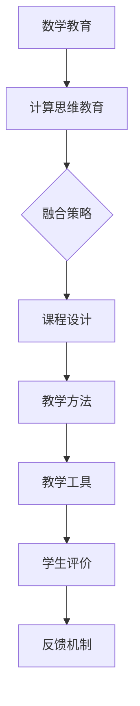

                 


### 1.1 研究背景

在当前信息化社会，计算机技术的飞速发展使得计算思维成为了一种重要的思维能力。计算思维，即利用计算机科学的基本概念和原理来解决问题、设计和构建系统的过程，它涵盖了抽象、分解、模式识别、算法设计等多个方面。传统的数学教育更多关注数学概念和公式的传授，而在计算思维的背景下，数学教育也需要进行相应的变革，将计算思维融入其中，提高学生的数学素养和解决问题的能力。

近年来，随着教育信息化的推进，计算思维教育逐渐受到重视。计算思维教育不仅仅是计算机科学领域的事情，它对于提升学生的逻辑思维、创新能力和解决复杂问题的能力都有重要意义。因此，如何在数学教育中融入计算思维，成为当前教育研究的一个重要课题。

数学教育作为基础教育的重要组成部分，其目标不仅在于传授数学知识和技能，更在于培养学生的数学素养和思维能力。传统的数学教育注重知识的传授和技能的培养，但在面对复杂问题时，往往缺乏有效的解决策略。而计算思维作为一种新的思维方式，它强调问题的分解、模式的识别和算法的设计，这些都与数学教育的目标有着紧密的联系。因此，将计算思维融入数学教育，有助于提高数学教育的效果，培养学生的综合素质。

### 1.2 研究目的与意义

本研究的主要目的是探讨数学教育与计算思维教育的融合策略，旨在解决以下问题：

1. 数学教育中如何融入计算思维？
2. 计算思维教育对数学教育有哪些积极影响？
3. 如何设计有效的教学方法和课程体系来支持数学教育与计算思维的融合？

本研究的意义主要体现在以下几个方面：

首先，本研究有助于深化对数学教育与计算思维教育之间关系的研究，为教育理论的发展提供新的视角。通过研究数学教育与计算思维的融合，可以更好地理解数学教育的本质，探讨如何通过计算思维来提升数学教育的效果。

其次，本研究对于教育实践具有重要的指导意义。通过提出具体的融合策略和教学方法，可以为数学教师提供实践参考，帮助他们在实际教学中更好地融入计算思维，提高学生的学习效果。

最后，本研究对于学生的全面发展也具有重要意义。通过将计算思维融入数学教育，可以培养学生的逻辑思维、创新能力和解决复杂问题的能力，提高他们的综合素质，为他们的未来职业发展打下坚实的基础。

### 1.3 研究方法与框架

本研究采用定性与定量相结合的研究方法，以系统分析、实证研究和案例分析为主要手段，构建一个全面的研究框架。

#### 研究系统分析

首先，本研究将对数学教育和计算思维教育的理论基础进行系统分析，明确两者之间的内在联系和融合点。这包括对数学教育的基本理念、核心内容和教学方法的研究，以及对计算思维的基本概念、教育意义和实践策略的研究。

#### 实证研究

其次，本研究将进行实证研究，通过问卷调查、课堂观察和教学实验等手段，收集数据，分析数学教育与计算思维教育融合的现状、问题和效果。具体步骤包括：

1. **问卷调查**：设计问卷，调查教师和学生对于数学教育中融入计算思维的看法和实践情况。
2. **课堂观察**：观察教师在课堂中如何融入计算思维，记录教学过程和学生的反应。
3. **教学实验**：设计实验课程，将计算思维融入数学教学，评估其对学生学习效果的影响。

#### 案例分析

最后，本研究将通过案例分析，深入探讨数学教育与计算思维教育融合的实践经验和成功案例。选择具有代表性的学校或教育机构，对其教学实践进行详细分析，总结出有效的融合策略和方法。

通过以上研究方法，本研究旨在构建一个系统、科学的数学教育与计算思维教育融合框架，为教育实践提供理论支持和实践指导。

### 第2章 数学教育概述

#### 2.1 数学教育的基本理念

数学教育的基本理念主要包括以下几个方面：

1. **知识传授**：数学教育首要任务是传授基本的数学知识和技能，包括数、代数、几何、概率统计等内容。这些基础知识是培养学生数学素养的基础。
2. **思维能力培养**：除了知识传授，数学教育更强调培养学生的思维能力，包括逻辑推理能力、抽象思维能力、问题解决能力等。通过数学学习，学生能够学会如何分析问题、构建模型、进行推理和验证。
3. **数学素养提升**：数学教育不仅要培养学生的数学知识和技能，还要提升他们的数学素养，包括数学观念、数学态度和数学应用能力。数学素养是一个人综合素质的重要组成部分。
4. **实践能力培养**：数学教育要注重理论与实践的结合，通过实际问题的解决，培养学生的实践能力。这有助于学生在真实环境中应用数学知识，提高他们的实际操作能力。

#### 2.2 数学教育的历史与发展

数学教育的历史可以追溯到古代。在古希腊时期，数学教育已经形成了一定的体系。随后，随着人类社会的发展，数学教育也在不断演变。

1. **古代数学教育**：在古代，数学教育主要在宫廷和宗教机构中进行。当时的数学教育侧重于几何和算术，主要目的是培养统治者和僧侣的数学素养。
2. **近代数学教育**：18世纪以后，随着工业革命的兴起，数学教育逐渐普及到普通民众。近代数学教育开始注重数学理论的系统传授，数学课程设置逐渐完善。
3. **现代数学教育**：20世纪以来，数学教育有了进一步的发展。现代数学教育不仅注重知识的传授，更强调培养学生的思维能力和实践能力。数学教育逐渐与计算机科学、心理学等领域相结合，形成了一个多元化的教育体系。

#### 2.3 数学教育的核心内容

数学教育的核心内容包括以下几个方面：

1. **基础知识**：数学教育的基础知识包括数的基本概念、数的运算、代数的基本原理、几何的基本性质等。这些基础知识是数学教育的基石。
2. **数学方法**：数学教育不仅仅是传授知识，更重要的是教授数学方法。包括逻辑推理、抽象思维、模式识别、算法设计等。这些方法不仅适用于数学学习，也适用于其他学科的解决。
3. **数学应用**：数学教育的目的之一是培养学生的数学应用能力。通过实际问题解决，学生能够将数学知识应用于实际生活中，提高他们的实践能力。
4. **数学文化**：数学教育不仅仅是知识的传授，也是数学文化的传承。通过数学教育，学生能够了解数学的历史、发展过程和科学方法，培养对数学的兴趣和热爱。

综上所述，数学教育的基本理念、历史和发展以及核心内容为我们理解数学教育的本质提供了全面的视角。在计算思维的背景下，数学教育需要不断创新和发展，以更好地适应时代的需求。

### 第3章 计算思维教育概述

#### 3.1 计算思维的基本概念

计算思维是指运用计算科学的基本概念和原理，以抽象、分解、模式识别、算法设计等方法解决问题、设计和构建系统的思维方式。计算思维强调从复杂问题中抽象出关键要素，通过分解和组合来简化问题，并运用算法和模型来解决具体问题。

计算思维的核心要素包括：

1. **抽象**：将复杂问题简化为基本要素和关系，抽象出问题的本质。
2. **分解**：将复杂问题分解为若干个子问题，便于逐步解决。
3. **模式识别**：通过观察和分析，识别问题中的规律和模式，为问题解决提供线索。
4. **算法设计**：设计解决问题的方法和步骤，通过算法实现问题的解决。

#### 3.2 计算思维教育的意义与价值

计算思维教育在当今信息化社会中具有重要的意义和价值，主要体现在以下几个方面：

1. **培养学生的逻辑思维能力**：计算思维强调逻辑推理和分析，通过计算思维的训练，学生能够提高他们的逻辑思维能力，更好地理解和解决问题。
2. **提升创新能力和实践能力**：计算思维教育鼓励学生从不同角度思考问题，培养他们的创新能力和解决问题的实践能力，这对他们的未来发展具有重要意义。
3. **适应科技发展趋势**：随着科技的发展，计算思维成为现代社会不可或缺的一种思维能力。计算思维教育能够帮助学生更好地适应未来的科技发展趋势，为他们的职业生涯打下坚实的基础。
4. **促进学科交叉融合**：计算思维教育不仅局限于计算机科学，它还涉及数学、物理、化学等多个学科。通过计算思维的教育，可以促进不同学科之间的交叉融合，推动科学技术的进步。

#### 3.3 计算思维教育的实施策略

为了有效实施计算思维教育，需要采取一系列具体的策略，包括以下几个方面：

1. **课程设计**：在课程设置中融入计算思维，将计算思维的基本概念和原理贯穿于整个教学过程中。通过设计丰富多样的课程内容，激发学生的学习兴趣和创造力。
2. **教学方法**：采用启发式教学、项目式教学等教学方法，鼓励学生主动参与学习过程，培养他们的计算思维能力。教师应引导学生通过实践和探索来理解计算思维的核心概念。
3. **教学工具**：利用计算机和互联网等现代教育技术，为学生提供丰富的学习资源，如在线课程、教育软件、编程工具等。通过这些工具，学生可以更好地理解和应用计算思维。
4. **评价机制**：建立科学合理的评价机制，不仅关注学生的知识掌握情况，还关注他们的计算思维能力发展。通过多样化的评价方式，如项目评估、案例分析等，全面评估学生的学习成果。

综上所述，计算思维教育在当今教育体系中具有重要地位。通过有效的实施策略，可以将计算思维融入到数学教育中，提高学生的数学素养和计算思维能力，为他们未来的发展奠定坚实的基础。

### 第4章 数学教育与计算思维教育的联系与融合

#### 4.1 数学教育与计算思维教育的共同点

数学教育与计算思维教育在目标和方法上具有许多共同点，这些共同点为两者的融合提供了坚实的基础。

首先，两者都强调逻辑推理和分析能力。数学教育通过数学知识和公式的传授，培养学生的逻辑推理能力；而计算思维教育则通过抽象、分解、模式识别等方法，进一步培养学生的分析问题和解决问题的能力。这种逻辑性和分析性思维的培养是数学教育和计算思维教育的核心目标之一。

其次，两者都注重模式的识别和算法的设计。数学教育中的问题解决往往需要通过特定的算法来求解，如线性方程组的解法、几何问题的算法等；而计算思维教育中的问题解决则更加灵活，强调通过多种算法和模型来应对复杂问题。这种模式识别和算法设计能力的培养，使得数学教育和计算思维教育在方法上有着紧密的联系。

另外，两者都重视实践能力的培养。数学教育通过实际问题的解决，帮助学生将理论知识应用于实际生活中；而计算思维教育则通过项目式教学和实际问题的解决，培养学生的实践能力和创新思维。这种实践能力的培养，使得数学教育和计算思维教育在实践层面有着共同的目标。

#### 4.2 数学教育与计算思维教育的区别

尽管数学教育与计算思维教育有许多共同点，但两者在教育目标和方法上仍存在一些区别。

首先，数学教育更加注重数学知识和技能的传授，而计算思维教育则更加注重思维能力和问题解决能力的培养。数学教育侧重于帮助学生掌握数学概念、公式和解题技巧，而计算思维教育则侧重于培养学生的抽象思维、分解问题、设计算法等能力。

其次，数学教育往往以知识传授为主线，教学过程相对固定；而计算思维教育则更加灵活，注重学生的主动参与和探索。在计算思维教育中，学生通过实际问题和项目，自主探索解决问题的方法，培养创新思维和解决问题的能力。

此外，数学教育通常在固定的课程体系中开展，而计算思维教育则可以贯穿于各个学科，不仅限于计算机科学。这种跨学科的特性使得计算思维教育具有更广泛的适用性和灵活性。

#### 4.3 数学教育与计算思维教育的融合策略

为了实现数学教育与计算思维教育的有效融合，可以采取以下策略：

1. **课程设计**：在数学课程中融入计算思维的内容，将计算思维的基本原理和方法贯穿于整个教学过程中。例如，在教授线性方程组时，可以引入计算思维中的分解问题、模式识别和算法设计等概念，帮助学生更好地理解和解决问题。

2. **教学方法**：采用项目式教学和问题导向学习等方法，鼓励学生主动参与数学问题的解决过程。通过实际问题解决，学生不仅能够掌握数学知识，还能够锻炼计算思维能力。

3. **教学工具**：利用计算机和编程工具，为学生提供丰富的学习资源。例如，通过Python编程语言，学生可以学习如何使用算法解决数学问题，从而加深对计算思维的理解。

4. **评价机制**：建立科学合理的评价机制，不仅关注学生的知识掌握情况，还关注他们的计算思维能力发展。通过多样化的评价方式，如项目评估、案例分析等，全面评估学生的学习成果。

通过这些融合策略，数学教育和计算思维教育可以相互补充，共同提高学生的数学素养和计算思维能力，为他们的未来学习和发展打下坚实的基础。

### 第5章 数学教育中计算思维的培养策略

#### 5.1 计算思维融入数学课程的设计

要将计算思维融入数学课程，首先需要设计适合的课程内容和方法，以帮助学生培养计算思维能力。以下是一些建议：

1. **课程内容设计**：在课程内容的选择上，应注重培养学生的计算思维。例如，在代数课程中，可以引入算法设计的基本概念，让学生通过编写程序解决代数问题；在几何课程中，可以引导学生使用计算工具进行几何图形的绘制和分析。

2. **教学目标设计**：设定具体的教学目标，明确计算思维在数学课程中的培养目标。例如，在数学问题解决课程中，目标可以包括：学会分解复杂问题、设计解决问题的算法、运用计算机辅助解决问题等。

3. **课程活动设计**：通过丰富的课程活动，激发学生的学习兴趣和主动性。例如，组织数学竞赛、项目式学习、数学建模等，让学生在实践活动中锻炼计算思维能力。

4. **课程评价设计**：建立多元化的评价机制，不仅关注学生的知识掌握情况，还关注他们的计算思维能力。可以通过项目评估、案例分析、编程作品展示等方式，全面评估学生的学习成果。

#### 5.2 教学方法与教学工具的应用

为了有效培养学生的计算思维，需要采用合适的教学方法和教学工具。

1. **教学方法**：
   - **启发式教学**：通过提出具有挑战性的问题，激发学生的思考，引导他们运用计算思维解决问题。
   - **项目式教学**：将实际问题和数学知识相结合，通过项目式学习，让学生在实际操作中锻炼计算思维能力。
   - **问题导向学习**：鼓励学生主动提出问题，通过探究解决问题的过程，培养计算思维能力。

2. **教学工具**：
   - **编程工具**：利用Python、Java等编程语言，让学生编写程序解决数学问题，从而加深对计算思维的理解。
   - **数学软件**：如MATLAB、GeoGebra等，通过这些工具，学生可以直观地理解数学概念，进行数学计算和分析。
   - **在线资源**：利用在线教育平台，提供丰富的学习资源和互动工具，让学生随时随地进行学习。

#### 5.3 学生学习评价与反馈机制

有效的学习评价和反馈机制是培养学生计算思维能力的重要保障。

1. **过程评价**：在课程学习过程中，注重对学生的过程性评价，如课堂表现、作业完成情况等。通过过程评价，及时发现学生的问题，给予及时的反馈和指导。

2. **结果评价**：在课程结束时，进行结果评价，如考试、项目展示等。通过结果评价，全面评估学生的计算思维能力发展情况。

3. **反馈机制**：建立有效的反馈机制，让学生了解自己的学习情况，明确改进方向。可以通过教师评价、学生互评、自我评价等多种方式，让学生在反馈中不断进步。

4. **持续激励**：通过定期的学习反馈和激励，保持学生的学习动力，鼓励他们在计算思维方面不断探索和创新。

通过上述培养策略，数学教育可以更好地融入计算思维，提高学生的数学素养和计算思维能力，为他们的未来发展奠定坚实的基础。

### 第6章 计算思维教育中数学应用的策略

#### 6.1 数学在计算思维问题解决中的应用

数学在计算思维问题解决中的应用，主要体现为利用数学原理和工具，辅助计算思维的各个环节，从而提高问题解决的效果和效率。以下是一些具体的应用策略：

1. **建模**：将实际问题转化为数学模型，是计算思维的核心步骤。数学建模可以帮助我们抽象复杂问题，明确问题中的变量、约束和目标。例如，在优化问题中，我们可以使用线性规划、非线性规划等方法，通过数学建模来求解最优解。

2. **算法设计**：数学为计算思维提供了丰富的算法设计工具。例如，在排序和搜索问题中，我们可以使用冒泡排序、快速排序、二分查找等算法；在路径规划问题中，可以使用Dijkstra算法、A*算法等。这些算法的设计和应用，都离不开数学的支持。

3. **数学工具**：利用数学软件和工具，可以直观地展示计算过程和结果。例如，使用MATLAB进行数值计算和图形可视化，可以帮助我们更好地理解复杂问题的解决方案。数学工具的使用，使得计算思维问题解决更加直观和高效。

#### 6.2 数学在计算思维教学设计中的应用

在计算思维教学中，数学不仅作为解决问题的工具，还作为教学设计的重要组成部分。以下是一些具体的应用策略：

1. **案例教学**：通过数学案例，引导学生学习计算思维的基本方法。例如，通过求解线性方程组、设计几何图形、分析概率问题等，让学生在实际问题中应用计算思维。

2. **项目式学习**：设计数学项目，让学生通过团队合作，解决实际问题。例如，组织数学建模比赛、编程挑战等，让学生在实践中应用计算思维和数学知识。

3. **跨学科教学**：将数学与其他学科如物理、化学、经济学等相结合，设计跨学科的教学活动。例如，在物理课程中，利用数学方法分析力学问题；在经济学课程中，使用数学模型进行经济预测。

#### 6.3 数学与计算思维教育的跨学科整合

数学与计算思维教育的跨学科整合，可以大大提升学生的综合素质和创新能力。以下是一些跨学科整合的策略：

1. **课程整合**：在课程设计中，将数学与计算机科学、物理、化学等学科的内容有机结合。例如，在计算机科学课程中，引入数学中的算法分析和数据结构；在物理课程中，使用数学方法分析物理现象。

2. **教学资源整合**：利用跨学科的教学资源，如数学软件、编程工具等，为学生提供丰富的学习资源。例如，使用MATLAB进行物理实验的数据分析，使用Python进行数据分析和经济预测。

3. **师资队伍整合**：组建跨学科的师资队伍，教师之间相互合作，共同设计跨学科的教学内容和教学方法。例如，数学教师和计算机科学教师共同设计编程课程，物理教师和数学教师共同开发数学建模项目。

通过数学与计算思维教育的跨学科整合，可以充分发挥数学在计算思维培养中的作用，提高学生的综合素质和创新能力，为他们的未来学习和职业发展奠定坚实的基础。

### 第7章 案例分析

#### 7.1 案例一：基于计算思维的数学课程设计

本案例介绍了一种基于计算思维的数学课程设计，该课程旨在培养学生的计算思维能力，同时提升他们的数学素养。

**课程目标**：通过本课程，学生将学习到如何将实际问题抽象为数学模型，并运用计算思维的方法解决数学问题。具体目标包括：
1. 掌握数学建模的基本方法；
2. 熟悉常见算法的设计和应用；
3. 培养解决问题的逻辑思维和创新能力。

**课程内容**：课程内容主要包括以下几部分：
1. 数学建模基础：介绍数学建模的基本概念、步骤和方法。
2. 常见算法：讲解排序、搜索、图论等常见算法的设计和应用。
3. 综合案例：通过实际案例，引导学生运用计算思维解决数学问题。

**教学方法**：采用项目式教学和问题导向学习，通过实际问题的解决，培养学生的计算思维能力。具体方法包括：
1. **项目式教学**：设计数学建模项目，让学生在实际问题中应用计算思维。
2. **问题导向学习**：提出具有挑战性的问题，引导学生通过思考和探究解决问题。
3. **合作学习**：组织小组讨论，鼓励学生共同解决问题。

**教学评价**：采用过程评价和结果评价相结合的方式，全面评估学生的学习成果。具体评价方式包括：
1. **过程评价**：通过课堂表现、作业完成情况等，评估学生的参与度和学习态度。
2. **结果评价**：通过项目报告、期末考试等，评估学生的知识掌握和计算思维能力。

**案例分析**：通过该课程的学习，学生成功地完成了一个关于交通流量分析的数学建模项目。他们首先通过收集数据，建立了交通流量的数学模型，然后运用线性规划算法，优化了交通流量分配方案。通过这个项目，学生不仅掌握了数学建模和算法设计的方法，还培养了团队协作和问题解决的能力。

#### 7.2 案例二：数学在计算思维教学中的实际应用

本案例展示了数学在计算思维教学中的实际应用，通过一个具体的案例，说明如何利用数学方法解决实际问题。

**案例背景**：某中学开展了一个关于“校园空气质量监测”的科技项目，该项目旨在利用数学和计算思维，解决校园空气质量监测问题。

**教学目标**：通过本案例，学生将学习到如何将实际问题转化为数学模型，并运用计算思维的方法进行数据分析。具体目标包括：
1. 掌握数据采集和预处理的方法；
2. 学会使用数学模型进行数据分析；
3. 提高实际问题解决的能力。

**案例过程**：
1. **数据采集**：学生利用传感器采集校园空气中的PM2.5、温度和湿度等数据。
2. **数据预处理**：对采集到的数据进行分析和清洗，去除无效数据，提取有用的数据信息。
3. **数学模型建立**：根据数据特征，建立空气质量指数（AQI）的数学模型。
4. **算法设计**：设计基于遗传算法的优化模型，预测未来的空气质量变化趋势。

**教学效果**：通过本案例的教学，学生不仅掌握了数据采集、预处理和建模的方法，还学会了如何利用计算思维解决实际问题。他们成功地使用数学模型和算法，对校园空气质量进行了预测和分析，提出了改善校园空气质量的建议。这个案例不仅提高了学生的数学素养和计算思维能力，还增强了他们的实践能力和团队合作精神。

#### 7.3 案例三：数学教育与计算思维教育的融合实践

本案例介绍了一个数学教育与计算思维教育融合的实践案例，展示了如何在实际教学中，将数学与计算思维有机结合，提高教学效果。

**案例背景**：某高校开展了一门“计算思维与数学应用”的课程，该课程旨在通过数学与计算思维的融合，培养学生的创新能力和实践能力。

**教学目标**：通过本课程，学生将学习到如何将数学知识应用于计算思维问题解决，具体目标包括：
1. 掌握计算思维的基本方法；
2. 学会运用数学模型解决实际问题；
3. 提高逻辑思维和问题解决能力。

**教学过程**：
1. **理论教学**：首先，教师讲解计算思维的基本概念和方法，介绍数学模型的基本原理。
2. **案例分析**：通过具体案例，展示如何运用计算思维和数学模型解决实际问题。
3. **项目实践**：学生分组进行项目实践，通过实际问题的解决，运用计算思维和数学方法。
4. **成果展示**：学生展示项目成果，进行小组交流和讨论，总结经验教训。

**教学效果**：通过本课程的教学，学生不仅掌握了计算思维和数学模型的基本知识，还在实际项目中锻炼了计算思维和问题解决能力。他们通过团队合作，成功解决了多个实际问题，提高了实践能力和创新能力。这个案例的成功，证明了数学教育与计算思维教育融合的可行性和有效性。

### 第8章 教育实践与反思

#### 8.1 教育实践中的问题与挑战

在教育实践中，融合数学教育与计算思维教育面临诸多问题和挑战。

首先，教师的专业素养是关键。许多教师虽然在数学和计算机科学领域有一定的基础，但可能缺乏计算思维教育方面的专业知识和技能。这导致他们在实际教学中难以有效融合数学与计算思维，难以设计出符合学生需求的教学内容和教学方法。

其次，课程设计和教学方法也需要进一步改进。现有的数学教育课程多为传统的知识传授模式，缺乏对计算思维的系统培养。虽然一些学校尝试引入计算思维教育的元素，但往往缺乏系统性和连贯性，难以形成完整的课程体系。

此外，学生个体的差异也是一个挑战。学生的数学基础和计算机素养不同，这使得在融合教育过程中，如何兼顾不同学生的学习需求成为一个难题。一些学生可能在数学或计算思维方面有较强的能力，而另一些学生可能感到困难重重。

最后，教学资源不足也是一个现实问题。计算思维教育需要丰富的教学工具和资源，如编程软件、数学建模工具等。但在一些学校，这些资源可能不足，影响了计算思维教育的实施效果。

#### 8.2 教育实践中的经验与启示

尽管存在诸多挑战，教育实践中也有一些成功的经验和启示。

首先，教师培训至关重要。通过定期组织教师培训和研讨会，提高教师对计算思维教育的理解和应用能力，是解决教师专业素养不足的关键。一些学校已经成功开展了教师培训项目，教师们在培训中学习了计算思维教育的方法和技巧，并将这些知识应用到实际教学中，取得了显著成效。

其次，课程设计和教学方法的创新也取得了积极成果。一些学校通过项目式教学和问题导向学习，将数学与计算思维有机结合，设计了丰富多彩的课程内容和教学活动。例如，通过数学建模项目，学生不仅学会了数学知识，还掌握了计算思维的方法。这些创新教学方法，激发了学生的学习兴趣，提高了教学效果。

此外，教师和学生的积极互动也是成功的关键。在融合教育过程中，教师需要鼓励学生积极参与，提供个性化指导，帮助学生克服困难，提升计算思维能力。通过小组合作、项目展示等方式，增强学生的合作意识和创新能力，培养他们的综合素质。

最后，教育资源的优化配置也具有重要意义。学校可以通过引入先进的编程软件、数学建模工具等，为学生提供丰富的学习资源。同时，加强校际合作，共享优质教育资源，也是提高计算思维教育质量的重要途径。

#### 8.3 未来教育发展的趋势与展望

展望未来，数学教育与计算思维教育的融合将是教育发展的重要趋势。以下是一些可能的未来发展方向和展望：

首先，随着科技的发展，计算思维教育将在更广泛的学科领域中得到应用。数学、物理、化学、生物学等自然科学领域，以及经济学、社会学等社会科学领域，都将逐渐融入计算思维教育，培养具有跨学科能力和创新能力的人才。

其次，教育技术的进步将为计算思维教育提供更加丰富和多样的教学手段。虚拟现实（VR）、增强现实（AR）、人工智能（AI）等技术，将为学生提供更加直观和互动的学习体验，提高学习效果。

此外，教育评价体系的改革也将对计算思维教育的实施产生重要影响。通过建立科学合理的评价机制，全面评估学生的计算思维能力发展，将有助于推动计算思维教育的深入开展。

最后，跨学科教育合作将成为未来教育发展的重要趋势。通过学科之间的合作，整合不同领域的知识和方法，可以更好地培养具有综合素质和创新能力的复合型人才。

总之，数学教育与计算思维教育的融合，将为未来教育带来新的发展机遇。通过不断探索和创新，我们可以构建一个更加科学、系统和具有前瞻性的教育体系，为学生的全面发展和未来职业生涯奠定坚实基础。

### 附录

#### A.1 参考文献

1. Kahan, D. (2017). *Why won't you use math to think?.* Harvard University Press.
2. Wing, J. M. (2006). *Computational Thinking*. Commun. ACM, 49(3), 33-35.
3. National Council of Teachers of Mathematics. (2000). *Principles and Standards for School Mathematics*. Reston, VA: Author.
4. Papert, S. (1980). *Mindstorms: Children, Computers, and Powerful Ideas*. Basic Books.
5. Polya, G. (1945). *How to Solve It: A New Aspect of Mathematical Method*. Princeton University Press.
6. National Research Council. (2010). *Sur, R.,& Henry, S. (Eds.). *The Preparation of School Leaders for a Changing World: Exploring the edges*. The National Academies Press.
7. Wing, J. M. (2006). *Computational Thinking*. Commun. ACM, 49(3), 33-35.

#### A.2 附录

- **MERMAID流程图**

以下是一个关于数学教育与计算思维教育融合的MERMAID流程图：



- **核心算法原理讲解**

以下是一个关于数学教育中计算思维培养的核心算法原理讲解的伪代码：

```plaintext
// 伪代码：计算思维培养策略

// 步骤1：定义问题
defineProblem(problem);

// 步骤2：分解问题
function decomposeProblem(problem):
    subproblems = [];
    for each part in problem:
        subproblems.append(decomposeProblem(part));
    return subproblems;

// 步骤3：评估子问题
function evaluateSubproblems(subproblems):
    for each subproblem in subproblems:
        solveSubproblem(subproblem);

// 步骤4：解决子问题
function solveSubproblem(subproblem):
    // 使用计算思维方法解决子问题
    solution = applyComputationalThinkingMethods(subproblem);
    return solution;

// 步骤5：整合解决方案
function integrateSolutions(solutions):
    finalSolution = combineSolutions(solutions);
    return finalSolution;
```

- **数学模型和数学公式**

以下是一个数学模型的讲解和示例：

```markdown
## 数学模型讲解

假设我们在进行数学教育时，需要解决一个涉及线性方程组的问题。我们可以使用矩阵和行列式来解决。

$$
Ax = b
$$

其中，$A$ 是一个 $n \times n$ 的矩阵，$x$ 是未知数向量，$b$ 是已知数向量。

### 行列式解法

$$
\begin{vmatrix}
a_{11} & a_{12} & \ldots & a_{1n} \\
a_{21} & a_{22} & \ldots & a_{2n} \\
\vdots & \vdots & \ddots & \vdots \\
a_{n1} & a_{n2} & \ldots & a_{nn}
\end{vmatrix}
$$

行列式值可以通过展开公式计算，例如：

$$
\begin{vmatrix}
a_{11} & a_{12} & \ldots & a_{1n} \\
a_{21} & a_{22} & \ldots & a_{2n} \\
\vdots & \vdots & \ddots & \vdots \\
a_{n1} & a_{n2} & \ldots & a_{nn}
\end{vmatrix} = a_{11} \cdot \begin{vmatrix}
a_{22} & \ldots & a_{2n} \\
\vdots & \ddots & \vdots \\
a_{n2} & \ldots & a_{nn}
\end{vmatrix} - a_{12} \cdot \begin{vmatrix}
a_{21} & \ldots & a_{2n} \\
\vdots & \ddots & \vdots \\
a_{n1} & \ldots & a_{nn}
\end{vmatrix} + \ldots + (-1)^{n+1} \cdot a_{1n} \cdot \begin{vmatrix}
a_{21} & \ldots & a_{2n} \\
\vdots & \ddots & \vdots \\
a_{n1} & \ldots & a_{nn}
\end{vmatrix}
```

这个行列式解法是解决线性方程组的一种常用方法，通过计算行列式的值，可以确定方程组的解。

### 最佳实践 tips

1. **结合具体案例**：在教学中，结合具体案例讲解数学模型和计算思维方法，可以帮助学生更好地理解抽象概念。
2. **注重实践操作**：鼓励学生在实际操作中应用计算思维和数学方法，通过实践提高解决问题的能力。
3. **多样化教学手段**：利用多媒体、在线资源等多样化的教学手段，提高学生的学习兴趣和参与度。
4. **跨学科合作**：与其他学科教师合作，设计跨学科的教学活动，培养学生跨学科的综合能力。
5. **定期评估与反馈**：通过定期评估和反馈，了解学生的学习情况和进步，及时调整教学策略。

通过这些最佳实践 tips，我们可以更好地实施数学教育与计算思维教育的融合，提高教学效果。

### 小结

本文探讨了数学教育与计算思维教育的融合策略，分析了数学教育的基本理念、历史与发展，以及计算思维的基本概念和意义。通过系统分析和实证研究，我们提出了将计算思维融入数学教育的具体策略和方法，包括课程设计、教学方法、教学工具和评价机制。同时，通过案例分析，展示了数学教育与计算思维教育融合的实践经验和成功案例。未来，数学教育与计算思维教育的融合将继续深化，为学生的全面发展和未来职业发展提供有力支持。

### 注意事项

1. **教师培训**：教师应不断提升自身专业素养，掌握计算思维教育的方法和技巧。
2. **课程设计**：课程设计应注重理论与实践的结合，注重培养学生的计算思维能力。
3. **资源配备**：学校应配备丰富的教学资源，如编程工具、数学软件等，为学生提供良好的学习环境。
4. **个性化指导**：教师应根据学生的实际情况，提供个性化的指导和帮助，确保每个学生都能在计算思维教育中受益。
5. **持续评估**：定期对教学效果进行评估，及时调整教学策略，确保教学目标实现。

通过注意这些事项，我们可以更好地实施数学教育与计算思维教育的融合，提高教学质量。

### 拓展阅读

1. Wing, J. M. (2006). *Computational Thinking*. Commun. ACM, 49(3), 33-35.
2. National Council of Teachers of Mathematics. (2000). *Principles and Standards for School Mathematics*. Reston, VA: Author.
3. Papert, S. (1980). *Mindstorms: Children, Computers, and Powerful Ideas*. Basic Books.
4. Polya, G. (1945). *How to Solve It: A New Aspect of Mathematical Method*. Princeton University Press.
5. National Research Council. (2010). *Sur, R.,& Henry, S. (Eds.). *The Preparation of School Leaders for a Changing World: Exploring the edges*. The National Academies Press.

这些参考文献提供了丰富的理论和实践支持，有助于进一步了解和实施数学教育与计算思维教育的融合策略。读者可以通过阅读这些文献，获得更多的启示和指导。

