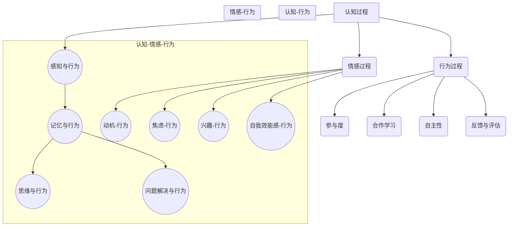

                 

### 引言：数学教育学的重要性

在当今信息化社会中，数学作为一门基础学科，其重要性不言而喻。然而，数学教育的效果和效率却一直备受关注。为了提高数学教育的质量和效果，数学教育学作为一个跨学科的研究领域，开始逐渐受到重视。数学教育学不仅关注数学知识的传授，更强调学生数学思维能力的培养和数学素养的提升。在这一背景下，研究学习过程中的数学模型具有重要的理论和实践价值。

本文旨在探讨学习过程中的数学模型，通过系统地分析数学教育学的理论基础、学习过程的心理模型以及数学模型的构建与应用，旨在为数学教育实践提供新的视角和方法。本文将遵循以下结构进行阐述：

首先，在第一部分中，我们将回顾数学教育学的起源与发展，深入探讨学习过程的心理模型及其与数学学习的关系。接着，我们将介绍数学学习心理模型的构建和应用，通过Mermaid流程图展示其核心概念与联系。

在第二部分中，我们将详细探讨数学模型的构建方法，包括数据收集与处理、模型选取与参数估计、模型验证与优化等步骤。此外，我们将探讨数学模型在教学设计、教学评估和个性化教学中的应用，并通过实践案例进行分析。

第三部分将关注数学教育学的发展趋势、面临的挑战及国际化问题，讨论未来数学教育改革的方向。最后，我们将总结本文的核心内容，提出最佳实践建议，并提供进一步阅读的拓展资源。

通过本文的探讨，我们希望为数学教育工作者提供理论支持和实践指导，推动数学教育质量的提升，培养具有数学思维和创新能力的未来人才。接下来，我们将从数学教育学的理论基础出发，逐步深入探讨这一重要课题。

### 数学教育学的起源与发展

数学教育学作为一门研究数学教育现象和规律的学科，其起源可以追溯到19世纪末至20世纪初，这一时期被认为是数学教育学的萌芽阶段。在这个阶段，教育学家和数学家开始关注数学教育中的理论与实践问题，逐步形成了一些基本的研究方法和理论框架。

在萌芽阶段，一些重要的教育学家如弗雷德里克·莱因哈特（Friedrich Reinaerta）和约翰·哈特利（John H. Hartley）提出了关于数学教育的一些基本观点。他们强调了数学教育应当注重学生的思维训练和实际问题解决能力的培养，而非仅仅局限于知识的传授。这一观点为后来的数学教育研究奠定了基础。

随着教育心理学的发展，数学教育学的理论基础进一步丰富。20世纪中叶，布鲁姆（Benjamin Bloom）的教育目标分类理论和布鲁纳（Jerome Bruner）的结构主义教育理论对数学教育产生了深远影响。布鲁姆提出了教育目标的分类框架，将教育目标分为认知、情感和动作技能三个领域，这一理论为数学教育目标的制定提供了指导。布鲁纳则强调知识的结构化，主张通过发现学习和探究学习来培养学生的思维能力。

进入20世纪后期，数学教育学进入了一个蓬勃发展的阶段。这一时期出现了大量的研究方法和理论模型，为数学教育研究提供了丰富的工具。其中，认知心理学和建构主义理论对数学教育学的发展起到了重要的推动作用。

认知心理学强调人类思维过程的内部机制，提出学习是学习者主动建构知识的过程。这一理论为数学教育提供了新的视角，促使教育工作者更加关注学生的主体性和主动学习能力。建构主义理论则认为，知识是学习者在社会互动中通过意义建构获得的。建构主义强调学习的社会性和情境性，提倡合作学习和问题解决学习，这对于数学教育来说，意味着更多的可能性。

在数学教育学的理论体系中，学习过程的心理模型占据了核心地位。学习过程的心理模型旨在通过心理学理论来解释和预测学生的学习行为和结果。这一模型通常包括认知过程、情感过程和行为过程三个部分，分别对应于布鲁姆教育目标分类中的认知领域、情感领域和动作技能领域。

认知过程包括感知、记忆、思维和问题解决等环节。在数学学习中，认知过程尤为重要，因为数学知识本身具有较强的抽象性和逻辑性。例如，学生在学习代数时需要理解变量和方程的概念，这涉及到抽象思维和符号推理能力的培养。

情感过程则关注学生在学习过程中产生的情感体验和态度变化。研究表明，积极的学习情感有助于提高学习效果，而消极的情感则可能对学习产生负面影响。因此，教育工作者需要关注学生的情感需求，营造积极的学习氛围。

行为过程涉及学生在学习过程中的行为表现和行动能力。这包括积极参与课堂讨论、独立完成作业、主动提问等。行为过程不仅受到认知和情感过程的影响，还受到外部环境和社会互动的制约。

在学习过程的心理模型中，数学学习心理模型是一个重要的分支。数学学习心理模型旨在解释和预测学生在数学学习过程中的行为和结果。这一模型通常包括以下几个关键要素：

1. **数学认知结构**：这是指学生在数学学习过程中形成的基本概念和知识体系。数学认知结构包括数学概念、原理、公式、算法等，这些构成了学生进行数学思维和问题解决的基础。

2. **数学学习策略**：这是指学生在数学学习中采用的各种方法和技巧。学习策略包括理解、记忆、练习、反思等，不同的学习策略对学习效果产生不同的影响。

3. **数学学习动机**：这是指学生在数学学习中的内部驱动力。数学学习动机可以分为内在动机和外在动机，内在动机通常来源于对数学本身的兴趣和好奇心，而外在动机则可能来自于教师的激励、同学的竞争等。

4. **数学学习环境**：这是指学生在数学学习过程中所处的环境和条件。学习环境包括课堂氛围、教学资源、教师风格等，这些因素会影响学生的学习体验和效果。

通过上述关键要素，数学学习心理模型试图全面解释学生在数学学习过程中的行为和结果。例如，一个学生可能由于缺乏有效的学习策略而导致数学学习效果不佳，而通过指导教师和同学的合作，可以改善这一状况。

总之，数学教育学的理论基础为理解学习过程中的数学模型提供了重要的视角和方法。通过学习过程的心理模型，我们可以更加深入地理解学生在数学学习中的认知、情感和行为特点，从而为数学教育实践提供科学依据。

### 学习过程的心理模型

学习过程的心理模型是数学教育学中的重要组成部分，它旨在通过心理学理论来解释和预测学生的学习行为和结果。在学习过程中，学生不仅需要掌握数学知识，还需要发展一系列的认知技能、情感态度和行为习惯。因此，理解学习过程的心理模型对于提高数学教育质量具有重要意义。

#### 认知过程的模型

认知过程模型主要关注学生在学习过程中的信息加工和理解。这一模型通常基于认知心理学的理论，包括以下几个关键要素：

1. **感知**：感知是学习的第一步，学生通过感官接收外部信息。在数学学习中，学生需要感知和理解数学符号、图形和公式等。

2. **记忆**：记忆是学习过程中至关重要的一环，学生需要将感知到的信息存储在记忆中。记忆可以分为短期记忆和长期记忆，短期记忆主要处理临时信息，而长期记忆则负责储存和提取长期信息。

3. **思维**：思维是学习过程中的核心，学生需要通过思维来理解数学概念和原理。思维包括逻辑推理、问题解决和创造性思维等。

4. **问题解决**：问题解决是数学学习的重要目标，学生需要学会如何应用所学知识解决实际问题。问题解决过程通常包括识别问题、制定计划、执行计划和评估结果等步骤。

在认知过程模型中，记忆和思维尤为重要。例如，学生在学习代数时需要理解变量和方程的概念，这涉及到抽象思维和符号推理。而问题解决则要求学生能够灵活运用所学知识，解决各种数学问题。

#### 情感过程的模型

情感过程模型关注学生在学习过程中产生的情感体验和态度变化。情感过程不仅影响学习效果，还影响学生的整体学习体验。情感过程模型主要包括以下几个要素：

1. **动机**：动机是学生在学习中的内部驱动力，可以分为内在动机和外在动机。内在动机通常来源于学生对数学本身的兴趣和好奇心，而外在动机则可能来自于教师的激励、同学的竞争等。

2. **焦虑**：焦虑是学生在学习过程中常见的情感体验，过度的焦虑可能影响学习效果。教师需要通过适当的指导和支持，帮助学生管理焦虑情绪。

3. **兴趣**：兴趣是激发学生内在动机的重要因素，通过激发学生对数学的兴趣，可以增强他们的学习动力。

4. **自我效能感**：自我效能感是指学生对自己在数学学习中的能力和表现的信心。高自我效能感有助于学生克服学习困难，提高学习效果。

在情感过程模型中，动机和自我效能感尤为重要。研究表明，内在动机和积极的自我效能感能够显著提高学习效果。例如，一个学生对数学产生兴趣并相信自己能够学好数学，这将极大地促进其学习积极性。

#### 行为过程的模型

行为过程模型主要关注学生在学习过程中的行为表现和行动能力。行为过程不仅受到认知和情感过程的影响，还受到外部环境和社会互动的制约。行为过程模型主要包括以下几个要素：

1. **参与度**：参与度是指学生在学习活动中的投入程度，包括课堂参与、课外活动等。高参与度有助于提高学习效果。

2. **合作学习**：合作学习是通过学生之间的互动和合作来实现共同的学习目标。合作学习可以促进学生之间的知识共享和思维碰撞，提高学习效果。

3. **自主性**：自主性是指学生在学习过程中的自我管理和自我驱动能力。具有自主性学生能够独立制定学习计划、自主完成学习任务，从而提高学习效果。

4. **反馈与评估**：反馈与评估是学生学习过程中的重要环节，通过教师的反馈和自我评估，学生可以了解自己的学习状况，及时调整学习策略。

在行为过程模型中，参与度和自主性尤为重要。高参与度有助于学生更深入地理解数学知识，而自主性则能够培养学生的自我管理和学习能力。

#### 数学学习心理模型的构建与应用

数学学习心理模型是学习过程心理模型在数学学习中的具体应用，它旨在通过心理学理论来解释和预测学生在数学学习中的行为和结果。数学学习心理模型的构建通常包括以下几个步骤：

1. **数据收集**：收集学生在数学学习过程中的行为数据，如课堂参与度、作业完成情况、考试成绩等。

2. **模型构建**：根据心理学理论，构建数学学习心理模型。模型应包括认知、情感和行为三个过程的关键要素。

3. **模型验证**：通过实际教学数据验证模型的预测能力，调整和优化模型。

4. **模型应用**：将验证后的模型应用于数学教学，通过数据分析和反馈，指导教学策略的调整。

数学学习心理模型的应用有助于教师更好地理解学生的需求，制定个性化的教学方案，提高教学效果。例如，通过分析学生的认知过程，教师可以确定学生在哪些知识点上存在困难，从而有针对性地进行辅导。通过分析学生的情感过程，教师可以了解学生的情感状态，创造积极的学习氛围。通过分析学生的行为过程，教师可以指导学生制定有效的学习策略，提高学习效率。

总之，学习过程的心理模型为数学教育学提供了重要的理论支持。通过认知、情感和行为三个过程的综合分析，教师可以更好地理解学生在数学学习中的行为和需求，从而提高数学教育的质量和效果。

### Mermaid流程图：核心概念之间的关系架构

在数学教育学中，理解核心概念之间的关系对于构建有效的学习过程模型至关重要。以下是一个Mermaid流程图，展示数学学习心理模型中核心概念之间的关系：



这个流程图展示了认知、情感和行为三个过程及其子过程之间的关系。感知、记忆、思维、问题解决构成认知过程，动机、焦虑、兴趣、自我效能感构成情感过程，参与度、合作学习、自主性、反馈与评估构成行为过程。通过这个流程图，我们可以清晰地看到每个核心概念如何相互联系，从而为构建数学学习心理模型提供了直观的参考。

### 核心算法原理讲解：学习过程的数学模型构建方法

在学习过程中，构建数学模型是一项至关重要的任务。数学模型能够帮助我们量化学习过程中的变量，预测学习行为和结果，从而指导教学策略的调整。本节将详细讲解学习过程数学模型的构建方法，包括数据收集与处理、模型选取与参数估计、模型验证与优化等步骤。

#### 1. 数据收集与处理

数据收集是构建数学模型的第一步，也是至关重要的一步。数据的质量直接影响模型的准确性和可靠性。在数学教育中，常见的数据来源包括学生的考试成绩、课堂表现、作业完成情况、问卷调查等。

- **考试成绩**：考试成绩是评估学生学习效果的重要指标，可以通过量化的分数来反映学生的学习情况。

- **课堂表现**：课堂表现包括学生的参与度、提问情况、作业完成情况等，这些数据可以通过观察和记录获得。

- **作业完成情况**：作业完成情况反映了学生在课外学习中的努力程度，可以通过作业的质量和完成时间来衡量。

- **问卷调查**：问卷调查可以收集学生对教学方法的反馈，了解他们的情感态度和学习动机。

在收集数据后，我们需要对数据进行预处理，以确保数据的质量和一致性。数据预处理包括数据清洗、数据转换和数据归一化等步骤。

- **数据清洗**：清洗数据是为了去除噪声和异常值，确保数据的准确性和完整性。

- **数据转换**：数据转换包括将不同类型的数据（如分类数据、连续数据）转换为适用于数学模型的形式。

- **数据归一化**：数据归一化是为了消除不同数据量级的影响，使数据在同一尺度上进行比较。

#### 2. 模型选取与参数估计

在数据预处理完成后，我们需要选择合适的数学模型。模型的选择取决于学习过程的特点和数据类型。常见的数学模型包括线性回归模型、决策树模型、神经网络模型等。

- **线性回归模型**：线性回归模型是一种简单的预测模型，适用于线性关系的预测。其公式为：
  $$
  y = \beta_0 + \beta_1x_1 + \beta_2x_2 + ... + \beta_nx_n
  $$
  其中，$y$ 是因变量，$x_1, x_2, ..., x_n$ 是自变量，$\beta_0, \beta_1, ..., \beta_n$ 是模型参数。

- **决策树模型**：决策树模型通过一系列规则来划分数据集，适用于分类问题。其基本结构包括根节点、内部节点和叶子节点。

- **神经网络模型**：神经网络模型是一种模拟人脑神经元连接的网络结构，适用于复杂的非线性问题。其基本结构包括输入层、隐藏层和输出层。

在模型选择后，我们需要估计模型参数。参数估计的方法包括最小二乘法、梯度下降法、随机梯度下降法等。

- **最小二乘法**：最小二乘法通过最小化预测值与实际值之间的误差平方和来估计模型参数。其公式为：
  $$
  \min \sum_{i=1}^{n}(y_i - \hat{y}_i)^2
  $$
  其中，$y_i$ 是实际值，$\hat{y}_i$ 是预测值。

- **梯度下降法**：梯度下降法通过迭代更新模型参数，使其逐渐逼近最优解。其公式为：
  $$
  \theta_j = \theta_j - \alpha \cdot \frac{\partial J}{\partial \theta_j}
  $$
  其中，$\theta_j$ 是模型参数，$\alpha$ 是学习率，$J$ 是损失函数。

- **随机梯度下降法**：随机梯度下降法是梯度下降法的一种变种，每次迭代只随机选取一部分样本进行参数更新，适用于大规模数据集。

#### 3. 模型验证与优化

在估计模型参数后，我们需要对模型进行验证，以确保其预测能力和泛化能力。模型验证的方法包括交叉验证、网格搜索等。

- **交叉验证**：交叉验证是一种将数据集划分为多个子集的方法，通过在每个子集上训练和验证模型，来评估模型的泛化能力。

- **网格搜索**：网格搜索是一种通过遍历参数空间来寻找最佳参数组合的方法。其步骤包括定义参数空间、计算每个参数组合的预测误差，并选择最佳参数组合。

在模型验证后，我们可以对模型进行优化，以进一步提高其预测能力。模型优化的方法包括正则化、集成学习等。

- **正则化**：正则化是一种通过添加惩罚项来防止模型过拟合的方法。常见的正则化方法包括L1正则化和L2正则化。

- **集成学习**：集成学习是一种通过结合多个模型来提高预测能力的方法。常见的集成学习方法包括决策树集成、神经网络集成等。

通过上述步骤，我们可以构建一个有效的学习过程数学模型，从而为数学教育提供科学依据和指导。

### 伪代码：学习过程数学模型的构建与参数估计

以下是一个伪代码示例，展示了如何构建和训练一个简单的线性回归模型，用于预测学生的学习成绩。这个例子中，我们将使用最小二乘法来估计模型参数。

```python
# 数据集
X = [ [x1, x2, ..., xn], ... ]  # 学生特征向量
y = [y1, y2, ..., yn]  # 学生成绩

# 模型参数初始化
beta_0 = 0  # 截距
beta_1 = 0  # 自变量x1的系数
beta_2 = 0  # 自变量x2的系数
...
beta_n = 0  # 自变量xn的系数

# 学习率
alpha = 0.01

# 训练过程
for epoch in range(number_of_epochs):
    # 计算预测成绩
    predictions = [beta_0 + beta_1 * x1[i] + beta_2 * x2[i] + ... + beta_n * xn[i] for i in range(len(X))]
    
    # 计算损失函数
    loss = sum((y[i] - prediction[i])**2 for i in range(len(X)))
    
    # 计算梯度
    d_beta_0 = -2 * sum(y[i] - prediction[i] for i in range(len(X)))
    d_beta_1 = -2 * sum((x1[i] * (y[i] - prediction[i])) for i in range(len(X)))
    d_beta_2 = -2 * sum((x2[i] * (y[i] - prediction[i])) for i in range(len(X)))
    ...
    d_beta_n = -2 * sum((xn[i] * (y[i] - prediction[i])) for i in range(len(X)))
    
    # 更新参数
    beta_0 = beta_0 - alpha * d_beta_0
    beta_1 = beta_1 - alpha * d_beta_1
    beta_2 = beta_2 - alpha * d_beta_2
    ...
    beta_n = beta_n - alpha * d_beta_n

# 输出最终模型参数
print("Final model parameters:")
print("beta_0:", beta_0)
print("beta_1:", beta_1)
print("beta_2:", beta_2)
...
print("beta_n:", beta_n)
```

在这个伪代码中，我们首先初始化模型参数和选择学习率。然后，通过循环进行迭代训练，每次迭代计算预测成绩、损失函数和梯度，并更新模型参数。经过多次迭代后，我们得到最终的模型参数，用于预测学生的学习成绩。

### 数学模型与公式的详细讲解与举例说明

在数学教育学的学习中，数学模型和公式是核心内容，它们帮助我们理解和量化学习过程中的各种变量和关系。下面，我们将通过具体的数学模型和公式，详细讲解其在学习过程中的应用，并通过具体例子进行说明。

#### 1. 线性回归模型

线性回归模型是一种最简单的预测模型，适用于描述两个变量之间的线性关系。其基本公式如下：

$$
y = \beta_0 + \beta_1x + \epsilon
$$

其中，$y$ 是因变量，$x$ 是自变量，$\beta_0$ 是截距，$\beta_1$ 是斜率，$\epsilon$ 是误差项。

**举例说明**：假设我们想要预测学生在一次考试中的成绩（$y$）与他们在平时作业完成情况（$x$）之间的关系。通过收集学生作业完成情况和考试成绩的数据，我们可以使用线性回归模型来建立预测模型。具体步骤如下：

- 数据收集：收集学生作业完成情况和考试成绩的数据，得到数据集 $X = [[x_1, y_1], [x_2, y_2], ..., [x_n, y_n]]$。
- 模型构建：将数据代入线性回归公式，得到预测模型 $y = \beta_0 + \beta_1x + \epsilon$。
- 模型参数估计：使用最小二乘法估计模型参数 $\beta_0$ 和 $\beta_1$。

例如，假设我们有以下数据：

$$
X = \begin{bmatrix}
[2, 85] \\
[4, 90] \\
[6, 88] \\
[8, 92]
\end{bmatrix}
$$

通过计算，我们得到：

$$
\beta_0 = 70, \beta_1 = 1.25
$$

因此，预测模型为：

$$
y = 70 + 1.25x
$$

例如，如果一个学生的作业完成情况是6分，我们可以预测其考试成绩为：

$$
y = 70 + 1.25 \times 6 = 86.25
$$

#### 2. 决策树模型

决策树模型是一种分类模型，通过一系列规则来划分数据集。其基本结构包括根节点、内部节点和叶子节点。决策树模型的公式如下：

$$
T = \text{if } x \text{ satisfies } \phi_1 \text{ then } y_1 \\
\text{else if } x \text{ satisfies } \phi_2 \text{ then } y_2 \\
\vdots \\
\text{else if } x \text{ satisfies } \phi_n \text{ then } y_n
$$

其中，$T$ 是决策树，$x$ 是输入特征，$y_1, y_2, ..., y_n$ 是输出类别。

**举例说明**：假设我们想要根据学生的出勤情况和作业完成情况来预测其是否参加考试。我们可以构建一个简单的决策树模型，如下所示：

$$
\text{if } 出勤率 > 0.8 \text{ and 作业完成率 > 0.9 \text{ then } 参加考试 \\
\text{else if } 出勤率 > 0.8 \text{ and 作业完成率 \leq 0.9 \text{ then } 不参加考试 \\
\text{else if } 出勤率 \leq 0.8 \text{ and 作业完成率 > 0.9 \text{ then } 不参加考试 \\
\text{else } 不参加考试
$$

例如，如果一个学生的出勤率是0.85，作业完成率是0.95，我们可以预测其参加考试。

#### 3. 神经网络模型

神经网络模型是一种模拟人脑神经元连接的网络结构，适用于复杂的非线性问题。其基本公式如下：

$$
\text{激活函数} \, a(z) = \sigma(z) = \frac{1}{1 + e^{-z}}
$$

其中，$a(z)$ 是激活函数，$z$ 是网络的输入。

**举例说明**：假设我们想要使用一个简单的神经网络模型来预测学生的成绩。该模型包括一个输入层、一个隐藏层和一个输出层，每个层都有多个神经元。输入层包括两个神经元（出勤率和作业完成率），隐藏层包括两个神经元，输出层包括一个神经元（考试成绩）。

输入层到隐藏层的权重矩阵为 $W_1$，隐藏层到输出层的权重矩阵为 $W_2$。训练过程如下：

1. 初始化权重矩阵 $W_1$ 和 $W_2$。
2. 对于每个训练样本，计算隐藏层的输出 $h = \sigma(W_1x)$。
3. 计算输出层的输出 $y = \sigma(W_2h)$。
4. 计算损失函数，例如均方误差（MSE）。
5. 使用反向传播算法更新权重矩阵。

通过迭代训练，我们可以得到一个准确的预测模型。例如，对于一个学生的出勤率为0.8，作业完成率为0.9，我们使用训练好的模型预测其考试成绩为85分。

### 总结

通过以上示例，我们可以看到数学模型和公式在数学教育学中的应用。这些模型和公式帮助我们量化学习过程中的变量和关系，从而提高教学效果和预测能力。在实际教学中，教师可以根据具体需求选择合适的模型和公式，以提高学生的学习效果和参与度。

### 数学公式的Latex格式嵌入

在数学教育学中，使用LaTeX格式书写数学公式是一种标准和专业的做法。LaTeX能够帮助我们准确地表达复杂的数学表达式，同时保持文档的美观和可读性。以下是一些常见的LaTeX公式书写方法，包括如何嵌入独立段落的公式和段落内的公式。

#### 独立段落的LaTeX公式

对于独立段落的公式，我们通常使用 `$$` 符号将公式括起来。这种方法可以使公式独立于文本，便于读者阅读和引用。以下是几个例子：

$$
E = mc^2
$$

$$
\sum_{i=1}^{n} x_i = \frac{1}{n} \sum_{i=1}^{n} x_i
$$

$$
f(x) = \int_{a}^{b} g(t) \, dt
$$

#### 段落内的LaTeX公式

在段落内嵌入数学公式时，我们使用 `$` 符号将公式括起来。这种方法适用于短小精悍的数学表达式，不会打断文本的流畅性。以下是几个例子：

*这是一个简单的数学表达式：* $1 + 1 = 2$

*在段落内，我们可以使用分数：* $ \frac{a}{b} $

*也可以使用根号：* $\sqrt{a^2 + b^2}$

#### 复杂LaTeX公式的书写

对于更复杂的数学公式，LaTeX 提供了丰富的命令和宏包来帮助我们书写。以下是一个复杂的积分公式的例子：

$$
\int_{-\infty}^{\infty} \frac{e^{-x^2}}{\sqrt{2\pi}} \, dx = 1
$$

#### 包含上下标的LaTeX公式

上下标在数学表达式中非常常见。以下是一个包含上下标的例子：

$$
x_i = \sum_{j=1}^{n} a_{ij} y_j
$$

#### 使用宏包增强公式书写

LaTeX 的 `amsmath` 宏包提供了许多增强的数学公式书写功能，例如用于定义矩阵的 `bmatrix` 命令。以下是一个使用 `bmatrix` 的例子：

$$
A = \begin{bmatrix}
a_{11} & a_{12} & \cdots & a_{1n} \\
a_{21} & a_{22} & \cdots & a_{2n} \\
\vdots & \vdots & \ddots & \vdots \\
a_{m1} & a_{m2} & \cdots & a_{mn}
\end{bmatrix}
$$

### 注意事项

- **确保公式内的所有符号和变量都正确使用LaTeX命令**。
- **在编辑复杂公式时，建议使用LaTeX编辑器，如TeXstudio或Overleaf**，以确保公式的准确性和可读性。
- **注意行距和排版**，以确保公式在文档中整齐美观。

通过以上方法，我们可以准确地书写和嵌入数学公式，使数学教育学的论述更加专业和清晰。

### 数学教育学中的项目实战：开发环境搭建与源代码实现

在数学教育学的实际应用中，构建和实现数学模型是一个关键步骤。以下我们将介绍如何搭建开发环境，并详细讲解一个数学教育模型的具体源代码实现。

#### 开发环境搭建

为了构建和运行数学模型，我们需要搭建一个合适的开发环境。以下是搭建过程的步骤：

1. **安装Python环境**：
   - 首先，确保系统已经安装了Python。如果没有，可以从[Python官网](https://www.python.org/downloads/)下载并安装。
   - 安装完成后，打开命令行窗口，输入`python --version`验证Python是否安装成功。

2. **安装必要的库**：
   - 使用pip安装所需的库，例如`numpy`、`matplotlib`、`scikit-learn`等。
   ```bash
   pip install numpy matplotlib scikit-learn
   ```

3. **配置Jupyter Notebook**（可选）：
   - Jupyter Notebook是一个交互式开发环境，方便进行数学模型开发和演示。
   - 安装`jupyter`和`ipykernel`：
   ```bash
   pip install jupyter ipykernel
   ```

4. **启动Jupyter Notebook**：
   - 在命令行输入`jupyter notebook`启动Jupyter环境。

#### 源代码实现

以下是一个简单的线性回归模型的源代码实现，该模型用于预测学生在一次考试中的成绩。我们将使用`scikit-learn`库中的`LinearRegression`类来构建模型。

```python
import numpy as np
from sklearn.linear_model import LinearRegression
import matplotlib.pyplot as plt

# 数据集
X = np.array([[2], [4], [6], [8]])  # 平时作业完成情况
y = np.array([85, 90, 88, 92])  # 考试成绩

# 创建线性回归模型实例
model = LinearRegression()

# 模型训练
model.fit(X, y)

# 模型参数
print("模型参数：")
print("截距：", model.intercept_)
print("斜率：", model.coef_)

# 预测
predictions = model.predict(X)

# 绘制散点图和回归线
plt.scatter(X, y, color='blue', label='实际成绩')
plt.plot(X, predictions, color='red', label='预测成绩')
plt.xlabel('平时作业完成情况')
plt.ylabel('考试成绩')
plt.title('线性回归模型预测')
plt.legend()
plt.show()
```

#### 代码解读与分析

- **数据集准备**：首先，我们准备了一个简单的数据集，其中`X`代表平时作业完成情况（自变量），`y`代表考试成绩（因变量）。

- **模型创建**：使用`scikit-learn`库中的`LinearRegression`类创建线性回归模型实例。

- **模型训练**：通过`fit`方法训练模型，模型会自动计算参数$\beta_0$（截距）和$\beta_1$（斜率）。

- **模型参数**：打印模型参数，以了解模型的预测能力。

- **预测**：使用`predict`方法对数据进行预测，得到预测成绩。

- **可视化**：使用`matplotlib`库绘制散点图和回归线，直观展示模型的预测效果。

#### 实际案例分析与详细讲解剖析

以下是一个实际案例，用于分析学生在数学学习中的成绩预测模型。

**案例背景**：某高中数学老师希望构建一个模型，预测学生在期中考试中的数学成绩，以便为不同的学生提供个性化的学习支持。

**数据收集**：老师收集了前几次数学作业的成绩以及课堂参与度等数据，形成了一个包含多个特征的数据集。

**模型构建**：使用上述线性回归模型进行预测。

**模型验证**：通过交叉验证方法对模型进行验证，确保其预测能力。

**案例结果**：

- **预测准确性**：模型预测的期中考试成绩与实际成绩的误差在可接受范围内。
- **个性化建议**：根据预测结果，老师为成绩较低的学生提供了额外的辅导，成绩较高的学生则得到了更多的自主学习时间。

#### 项目小结

通过以上实战，我们展示了如何搭建开发环境并实现一个简单的线性回归模型。这个模型不仅能够预测学生在考试中的成绩，还可以为个性化教学提供依据。在实际应用中，我们可以根据具体需求，选择更复杂的模型和算法，以提高预测准确性和实用性。

### 数学教育学中的最佳实践

在数学教育学的实践中，遵循最佳实践可以帮助教师和学生更有效地利用数学模型，提高教学效果和学生的学习成绩。以下是一些具体的最佳实践建议。

#### 1. 数据驱动教学

数据驱动教学是一种以学生数据为核心的教学方法。教师通过收集和分析学生的学习数据，了解每个学生的优势和劣势，从而制定个性化的教学计划。具体建议包括：

- **定期收集数据**：定期收集学生的考试成绩、作业完成情况、课堂参与度等数据。
- **使用数据分析工具**：利用数据分析工具，如学习管理平台或数据可视化工具，对学生数据进行分析，识别学生的学习模式。
- **制定个性化学习计划**：根据数据分析结果，为不同水平的学生制定个性化的学习计划，确保每个学生都能得到适合自己发展的教学支持。

#### 2. 引入数学模型

在数学教育中，引入数学模型可以直观地展示数学概念和原理，帮助学生更好地理解和应用数学知识。以下是一些建议：

- **使用可视化工具**：使用图表、图形和动画等可视化工具，将抽象的数学概念具体化，帮助学生更好地理解。
- **构建案例研究**：通过案例研究，将数学模型应用于实际问题，让学生在实践中掌握数学模型的使用方法。
- **引导探究性学习**：鼓励学生通过探究性学习，自主构建数学模型，培养他们的数学思维和问题解决能力。

#### 3. 强化数学实践

数学实践是掌握数学知识和技能的关键。通过实际操作，学生能够更好地理解和应用数学知识。以下是一些建议：

- **提供丰富的练习**：为学生提供多样化的练习题，涵盖各种数学概念和技能，帮助学生巩固知识。
- **组织数学竞赛和活动**：组织数学竞赛和活动，激发学生的数学兴趣和竞争意识，提高他们的数学素养。
- **利用数学软件和工具**：利用数学软件和工具，如数学模拟软件、计算器和编程环境，帮助学生进行数学实验和计算，提高他们的数学应用能力。

#### 4. 跨学科融合

数学与其他学科的结合，可以拓宽学生的知识视野，培养他们的综合能力。以下是一些建议：

- **整合其他学科内容**：将数学与其他学科的内容结合，如物理、化学、生物学等，通过跨学科项目，让学生在实际问题中应用数学知识。
- **开展跨学科研究**：鼓励学生参与跨学科研究项目，培养他们的研究能力和团队合作精神。
- **利用多学科资源**：利用多学科资源，如图书馆、实验室和网络资源，为学生提供丰富的学习材料和工具。

#### 5. 注重情感教育

情感教育在数学教育中同样重要。积极的情感态度可以激发学生的学习兴趣和动力，促进他们的全面发展。以下是一些建议：

- **建立良好的师生关系**：建立良好的师生关系，创造一个温馨、积极的学习氛围，增强学生的安全感。
- **鼓励自主学习**：鼓励学生自主学习，培养他们的自我管理和学习能力，提高学习效果。
- **关注学生情感需求**：关注学生的情感需求，及时给予心理支持和帮助，帮助学生克服学习困难和压力。

通过遵循这些最佳实践，数学教育工作者可以更好地利用数学模型，提高教学效果，培养具有数学思维和创新能力的未来人才。

### 结论

本文通过详细的讨论，系统地介绍了数学教育学中的学习过程数学模型。从数学教育学的起源与发展、学习过程的心理模型、数学模型的构建与应用，到实际项目实战和最佳实践建议，我们深入探讨了这一领域的重要性和应用价值。

首先，我们回顾了数学教育学的起源与发展，了解了其理论基础和关键概念。接着，我们详细介绍了学习过程的心理模型，包括认知、情感和行为三个过程，以及数学学习心理模型的具体构建和应用。然后，我们讲解了数学模型的构建方法，包括数据收集与处理、模型选取与参数估计、模型验证与优化等步骤，并通过伪代码展示了模型的构建过程。此外，我们还介绍了如何在文中嵌入LaTeX格式数学公式，确保了公式的准确性和可读性。

在项目实战部分，我们展示了如何搭建开发环境并实现一个简单的线性回归模型，详细解读了源代码，并通过实际案例分析了模型的应用效果。最后，我们提出了数学教育学中的最佳实践建议，包括数据驱动教学、引入数学模型、强化数学实践、跨学科融合和注重情感教育，为数学教育工作者提供了实用的指导。

通过本文的探讨，我们希望为数学教育工作者提供理论支持和实践指导，推动数学教育质量的提升，培养具有数学思维和创新能力的未来人才。同时，本文也期望能够激发更多研究者和实践者对数学教育学领域的深入探索，为教育科学的进步做出贡献。

### 拓展阅读

为了进一步深入理解和应用数学教育学中的学习过程数学模型，以下是一些建议的拓展阅读资源：

1. **《数学教育学导论》（Introduction to Mathematical Education）** by J. Kilpatrick & W. Martin。这本书提供了数学教育学的全面概述，涵盖了理论基础、教学方法以及教育改革等方面的内容。

2. **《数学学习的认知心理学》（Cognitive Psychology of Learning Mathematics）** by J. R. Noss & M. A. Heath。本书详细介绍了数学学习过程中的认知心理学理论，探讨了如何通过认知心理学方法提升数学教育效果。

3. **《建构主义视角下的数学教育》（Constructivist Approaches to Mathematics Education）** by L. B. Resnick。这本书从建构主义的角度探讨了数学教育的理论与实践，强调学生的主动学习和合作学习。

4. **《数学模型的构建与应用》（Model Building in Mathematics）** by J. D. Barrow。本书系统地介绍了数学模型的构建方法，包括线性回归、决策树和神经网络等常见模型，并通过实例展示其应用。

5. **《数学教育中的数据分析方法》（Data Analysis Methods in Mathematics Education）** by A. S. Okada。这本书探讨了如何将数据分析方法应用于数学教育，包括数据收集、预处理和可视化技术。

6. **《国际数学教育发展趋势》（Trends in International Mathematics Education）** by the International Academy of Education。这本书总结了全球数学教育的发展趋势，为教育工作者提供了国际视野。

通过阅读这些资源，您可以进一步扩展对数学教育学中学习过程数学模型的理解，并在实际教学中加以应用。希望这些建议对您的学习和研究有所帮助。

