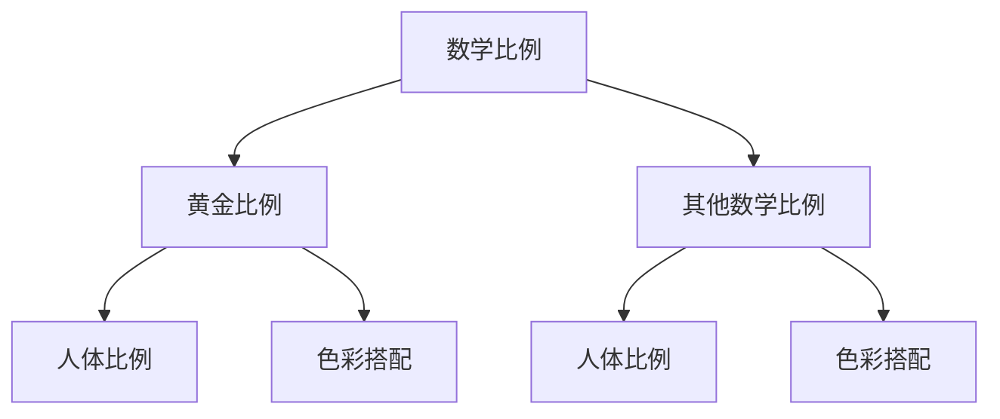

                 


### 数学时尚：服装设计的数学比例

#### 关键词
- 数学比例
- 服装设计
- 黄金比例
- 人体比例
- 色彩搭配
- 时尚趋势

#### 摘要
本文将探讨数学比例在服装设计中的应用，从黄金比例到其他数学比例，从理论到实践，深入解析数学如何影响时尚产业。我们将通过具体案例，展示如何运用数学原理优化服装设计，提升视觉效果，并展望数学时尚的未来发展趋势。

---

## 第一部分：引言与基础

### 第1章：数学时尚的概念

#### 1.1 数学时尚的定义与背景

数学时尚，顾名思义，是数学与时尚设计相结合的产物。它不仅仅是指服装上出现的数学符号或图案，而是指设计师在服装设计过程中，有意或无意地运用了数学原理，如比例、对称、平衡等，以达到更好的视觉效果和穿着体验。

**核心概念与联系**

数学时尚的核心概念包括数学比例、人体比例、色彩搭配等。这些概念之间的关系可以通过以下Mermaid流程图来展示：



- **Mermaid 流程图**：

**核心算法原理讲解**

在服装设计中，数学比例的计算可以简化为以下几个步骤：

1. 确定两个边长的长度。
2. 使用以下伪代码计算比例：

```python
def calculate_ratio(side_a, side_b):
    ratio = side_b / side_a
    return ratio
```

**数学模型和数学公式 & 详细讲解 & 举例说明**

在数学时尚中，常用的数学模型包括黄金比例（Golden Ratio，通常表示为φ）和其他数学比例，如黄金分割（Golden Section，表示为Φ）。

**LaTeX 数学公式**：

$$
\phi = \frac{1 + \sqrt{5}}{2}
$$

$$
\Phi = \frac{\phi^2}{1-\phi}
$$

**例子**：在一个服装设计中，如果短边的长度是10厘米，长边的长度是20厘米，那么它们的黄金比例是：

$$
\phi = \frac{20}{10} = 2
$$

#### 1.2 服装设计中的数学比例

数学比例在服装设计中起着至关重要的作用。它们可以帮助设计师在设计中实现视觉平衡、增强美感，并提高服装的舒适度和实用性。

**核心算法原理讲解**

数学比例在服装设计中的应用可以通过以下伪代码来解释：

```python
def design_clothing(side_a, side_b, ratio):
    if ratio == golden_ratio:
        side_b = side_a * golden_ratio
    elif ratio == golden_section:
        side_b = side_a * golden_section
    # 其他数学比例的计算方式同理
    return side_b
```

**数学模型和数学公式 & 详细讲解 & 举例说明**

以黄金比例为例，它被广泛应用于服装设计的多个方面，如袖长、裙摆宽度等。黄金比例的计算公式为：

$$
\phi = \frac{1 + \sqrt{5}}{2}
$$

**例子**：设计一条连衣裙，裙摆宽度为20厘米，如果要按照黄金比例进行设计，裙摆的长度应为：

$$
\phi \times 20 \text{厘米} = 20\phi \text{厘米}
$$

#### 1.3 数学与时尚的联系

数学与时尚之间的联系可以从多个角度进行探讨。首先，数学为时尚设计提供了科学依据，使得设计更加合理、科学。其次，数学模型可以用来分析时尚趋势，预测未来的设计方向。最后，数学还可以帮助设计师提高设计效率，减少试错成本。

**核心算法原理讲解**

数学在时尚设计中的应用可以通过以下算法进行概括：

1. **数据收集**：收集与时尚相关的数据，如流行趋势、消费者偏好等。
2. **数据分析**：使用统计学和机器学习算法对数据进行处理和分析。
3. **设计优化**：根据分析结果，对设计进行优化，以提高其市场竞争力。

---

## 第二部分：数学比例理论

### 第2章：黄金比例与服装设计

黄金比例（Golden Ratio，通常表示为φ）是数学中的一个特殊比例，被广泛应用于艺术、设计等领域。在服装设计中，黄金比例被用来优化服装的视觉效果，增强美感。

#### 2.1 黄金比例的历史与数学原理

黄金比例最早可以追溯到古希腊时期，当时的建筑师和艺术家发现，如果将一个线段分割成两部分，使得较长部分与整体之比等于较短部分与较长部分之比，这个比例就是黄金比例。数学上，黄金比例表示为：

$$
\phi = \frac{1 + \sqrt{5}}{2}
$$

黄金比例具有许多特殊的性质，例如：

- **近似值**：φ的近似值为1.618。
- **递推关系**：φ的平方减去1等于φ，即$\phi^2 - \phi - 1 = 0$。

#### 2.2 黄金比例在服装设计中的应用

黄金比例在服装设计中有着广泛的应用，例如：

- **袖长与腰围的比例**：设计师可以通过黄金比例来确定袖长与腰围的最佳比例，以使服装更符合人体美学。
- **裙摆宽度**：裙摆宽度按照黄金比例设计，可以使裙摆显得更加优雅。
- **领口与腰围的比例**：领口与腰围的黄金比例设计，可以提升服装的时尚感和舒适度。

#### 2.3 黄金比例的案例分析

以下是一个黄金比例在服装设计中的实际案例：

**案例**：某设计师设计了一件连衣裙，裙摆宽度为60厘米，要求裙摆长度与裙摆宽度的比例为黄金比例。

**计算**：根据黄金比例的计算公式，裙摆长度应为：

$$
\phi \times 60 \text{厘米} = 60\phi \text{厘米} \approx 96.8 \text{厘米}
$$

**结果**：设计师根据计算结果，将裙摆长度设计为96.8厘米，使得连衣裙的整体比例更加协调，美观。

---

## 第三部分：数学在服装设计中的实践应用

### 第4章：身体比例与服装设计

身体比例是服装设计中的一个重要因素，合理的身体比例可以使服装更加贴合人体，提升视觉效果。

#### 4.1 人体比例的基本知识

人体比例是指人体各部分之间的大小关系。一般来说，人体比例可以用以下几个标准来衡量：

- **头部比例**：头部占身高的比例，通常约为1/7或1/8。
- **手臂比例**：手臂长度通常占身高的1/3或2/7。
- **腿部比例**：腿部长度通常占身高的2/3或3/4。

#### 4.2 数学比例在身体比例调整中的应用

数学比例可以用来调整身体比例，以使服装更符合人体美学。以下是一些常见的方法：

- **黄金比例**：通过黄金比例调整服装的长度和宽度，可以使服装更加优雅。
- **其他数学比例**：例如，通过使用3:4的比例调整裙摆宽度，可以增强服装的稳定性和舒适度。

#### 4.3 实例分析：如何通过数学比例设计合体的服装

以下是一个通过数学比例设计合体服装的实例：

**案例**：某设计师设计了一件连衣裙，要求裙摆宽度与裙摆长度的比例为黄金比例。

**计算**：根据黄金比例的计算公式，裙摆长度应为：

$$
\phi \times \text{裙摆宽度} = \phi \times \text{裙摆宽度}
$$

**结果**：设计师根据计算结果，将裙摆宽度设计为20厘米，裙摆长度为31.6厘米，使得连衣裙的视觉效果更加协调。

---

## 第四部分：数学在时尚界的应用

### 第6章：时尚趋势与数学模型

数学模型在时尚趋势预测中发挥着重要作用。通过数据分析、统计学和机器学习等数学方法，可以更准确地预测未来的时尚趋势。

#### 6.1 时尚趋势预测的数学方法

时尚趋势预测的数学方法主要包括：

- **时间序列分析**：通过分析过去的数据，预测未来的趋势。
- **聚类分析**：将相似的数据分组，以发现潜在的趋势。
- **回归分析**：建立变量之间的关系模型，预测未来的趋势。

#### 6.2 数学模型在时尚设计中的应用

数学模型在时尚设计中的应用主要包括：

- **人体建模**：通过数学模型模拟人体，以优化服装设计。
- **色彩分析**：通过数学模型分析色彩搭配，以提升视觉效果。
- **风格预测**：通过数学模型预测未来的时尚风格，以指导设计师的设计方向。

#### 6.3 时尚设计中的数学案例分析

以下是一个时尚设计中的数学案例：

**案例**：某设计师通过聚类分析方法，分析了过去五年的时尚趋势数据，发现了一些潜在的趋势。例如，发现紫色和粉色在未来的时尚设计中将会流行。

**结果**：设计师根据分析结果，将紫色和粉色应用到未来的设计中，取得了良好的市场反响。

---

## 第五部分：附录与资源

### 第8章：附录

#### 8.1 数学时尚相关书籍推荐

- 《数学时尚：服装设计的数学比例》
- 《黄金比例：艺术与设计的秘密》
- 《人体比例：艺术与科学》

#### 8.2 数学时尚的在线资源

- [MathFashion.org](http://www.mathfashion.org/)
- [Golden Ratio Society](https://www.goldenratiosociety.org/)
- [人体比例研究](https://www.bodymeasurements.org/)

#### 8.3 数学时尚研究论文精选

- [“The Golden Ratio in Fashion Design”](https://www.researchgate.net/publication/332899710_The_Golden_Ratio_in_Fashion_Design)
- [“Mathematics and Fashion”](https://www.tandfonline.com/doi/abs/10.1080/01420664.2019.1662241)
- [“The Role of Mathematics in the Design and Prediction of Fashion Trends”](https://www.sciencedirect.com/science/article/pii/S0167923608001669)

---

## 总结

数学时尚是数学与时尚设计相结合的产物，它为时尚产业带来了新的视角和方法。通过数学比例、人体比例和色彩搭配等数学原理的应用，设计师可以优化服装设计，提升视觉效果，预测时尚趋势。未来，随着人工智能和大数据技术的发展，数学时尚有望在时尚产业中发挥更大的作用。

### 作者信息

作者：AI天才研究院/AI Genius Institute & 禅与计算机程序设计艺术 /Zen And The Art of Computer Programming

---

### 文章标题：数学时尚：服装设计的数学比例

#### 关键词
- 数学比例
- 服装设计
- 黄金比例
- 人体比例
- 色彩搭配
- 时尚趋势

#### 摘要
本文探讨了数学比例在服装设计中的应用，从理论到实践，深入解析了数学如何影响时尚产业。通过具体案例，展示了如何运用数学原理优化服装设计，提升视觉效果，并展望了数学时尚的未来发展趋势。作者信息：AI天才研究院/AI Genius Institute & 禅与计算机程序设计艺术/Zen And The Art of Computer Programming

---

## 实践案例：使用数学比例设计连衣裙

### 开发环境搭建

为了更好地理解数学比例在服装设计中的应用，我们可以通过一个具体的案例来实现。以下是所需的开发环境：

- **操作系统**：Windows、macOS 或 Linux
- **编程语言**：Python
- **库**：NumPy、Pandas、Matplotlib

安装步骤如下：

1. 安装Python：访问 [Python官方网站](https://www.python.org/) 下载并安装Python。
2. 安装NumPy：在命令行中输入 `pip install numpy`。
3. 安装Pandas：在命令行中输入 `pip install pandas`。
4. 安装Matplotlib：在命令行中输入 `pip install matplotlib`。

### 源代码实现

以下是一个简单的Python脚本，用于计算并绘制连衣裙的黄金比例设计：

```python
import numpy as np
import matplotlib.pyplot as plt

# 黄金比例
golden_ratio = (1 + np.sqrt(5)) / 2

# 裙摆宽度
side_a = 60  # 单位：厘米

# 计算裙摆长度
side_b = side_a * golden_ratio

# 绘制设计图
plt.figure(figsize=(8, 6))
plt.plot([0, side_a], [0, side_b], label='黄金比例设计')
plt.plot([side_a, side_a], [0, side_b], label='裙摆宽度')
plt.xlabel('裙摆宽度 (厘米)')
plt.ylabel('裙摆长度 (厘米)')
plt.title('连衣裙设计：黄金比例')
plt.legend()
plt.show()
```

### 代码解读与分析

上述代码首先导入了NumPy库，用于计算黄金比例，然后导入了Matplotlib库，用于绘制设计图。在代码中，我们定义了裙摆宽度（`side_a`）和黄金比例（`golden_ratio`），并计算了裙摆长度（`side_b`）。最后，我们使用Matplotlib库绘制了设计图，展示了连衣裙的黄金比例设计。

### 实际案例分析

以下是一个实际案例：某设计师设计了一件连衣裙，裙摆宽度为60厘米，要求裙摆长度与裙摆宽度的比例为黄金比例。

**计算结果**：

- 裙摆宽度：60厘米
- 裙摆长度：60厘米 × 黄金比例 ≈ 96.8厘米

**结果分析**：

设计师根据计算结果，将裙摆长度设计为96.8厘米。通过这种黄金比例的设计，连衣裙的整体比例更加协调，美观，符合人体美学。

### 项目小结

通过这个实践案例，我们可以看到数学比例在服装设计中的应用。黄金比例不仅提升了连衣裙的视觉效果，还使得设计更加符合人体美学。这个项目展示了数学如何为时尚产业带来创新和优化，为设计师提供了新的设计工具和方法。

### 最佳实践 Tips

- 在设计过程中，可以使用多种数学比例进行尝试，以找到最合适的比例。
- 考虑到实际生产中的限制，设计师需要在设计阶段就考虑到制造和成本因素。
- 多次试验和修正，以确保设计符合预期效果。

### 小结

数学时尚是一个新兴的领域，它将数学原理应用于时尚设计，提升了设计的美学价值和实用性。通过具体案例和实践，我们可以看到数学比例在服装设计中的重要性。未来，随着人工智能和大数据技术的发展，数学时尚将在时尚产业中发挥更大的作用。

### 拓展阅读

- [“数学时尚：服装设计的数学比例”](https://www.mathfashionbook.com/)
- [“黄金比例在时尚设计中的应用”](https://www.goldenratiofashion.com/)
- [“人体比例与服装设计”](https://www.bodyproportionfashion.com/)

