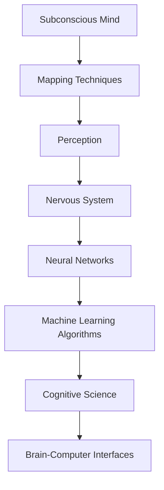
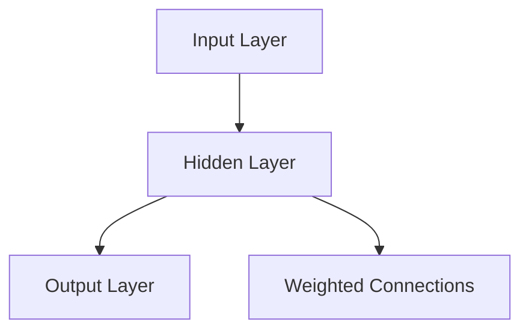
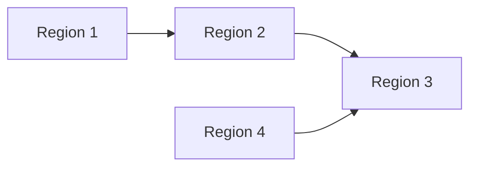

                 


### Title: "Mathematical Dreams: Models of Subconscious Mapping"

#### Keywords: Mathematical Models, Subconscious Mapping, Neural Networks, AI, Machine Learning, Cognitive Science

#### Abstract:
This article delves into the realm of mathematical models designed to understand and map the subconscious mind. By exploring key concepts, algorithms, and theoretical foundations, it aims to bridge the gap between human psychology and computational mathematics. The article also provides practical applications and insights, making it a valuable resource for researchers, AI enthusiasts, and cognitive scientists.

# Table of Contents

## Introduction

### The Importance of Mathematical Models in Understanding the Subconscious Mind

### Structure and Goals of the Book

## Core Concepts and Connections

### The Subconscious Mind: Definition and Functions

### Mapping Techniques: From Perception to Action

### Key Concepts in Subconscious Mapping

## Models and Algorithms

### Neural Networks: The Basic Building Block

#### Introduction to Neural Networks

#### Types of Neural Networks

#### Basic Operations of Neural Networks

### The Subconscious Mind Mapping Algorithm

#### Algorithm Description

#### Pseudo-code

## Mathematical Foundations

### Basic Mathematical Theories

#### Set Theory

#### Function Theory

#### Graph Theory

### Advanced Mathematical Theories

#### Differential Equations

#### Linear Algebra

#### Probability Theory

## Application Examples

### AI and Machine Learning Applications

#### Introduction to AI and Machine Learning

#### Case Studies: AI in Psychology

### Cognitive Science Applications

#### Introduction to Cognitive Science

#### Case Studies: Cognitive Science in Practice

## Conclusion

### Key Insights and Future Directions

### Challenges and Opportunities

## References

### List of References and Further Reading

### Acknowledgements

#### About the Author

## Appendix

### Frequently Asked Questions

### Best Practices and Tips

### Conclusion

---

### Introduction

#### The Importance of Mathematical Models in Understanding the Subconscious Mind

The subconscious mind is a complex and fascinating aspect of human psychology. It plays a crucial role in our thoughts, emotions, and actions, yet it remains largely inaccessible to our conscious awareness. In recent years, advancements in artificial intelligence, cognitive science, and neuroscience have paved the way for the development of mathematical models that aim to uncover the mysteries of the subconscious mind. These models are not only valuable for scientific research but also have practical applications in fields such as AI, psychology, and education.

#### Structure and Goals of the Book

This book aims to provide a comprehensive overview of the mathematical models used to map the subconscious mind. It is structured into several chapters, each addressing different aspects of this complex topic. The first chapter introduces the importance of mathematical models in understanding the subconscious mind and sets the stage for the discussion. The subsequent chapters delve into the core concepts, models, algorithms, and applications of subconscious mapping. The book concludes with a summary of key insights and future directions, offering a valuable resource for researchers, students, and practitioners in the field.

---

### Core Concepts and Connections

#### The Subconscious Mind: Definition and Functions

The subconscious mind is the part of the mind that operates outside of our conscious awareness. It is responsible for processing information, regulating emotions, and guiding our behavior. Unlike the conscious mind, which is focused on the present and the external world, the subconscious mind operates on a deeper, more primal level. It is involved in tasks such as memory, emotion, and motivation, and it influences our thoughts, feelings, and actions without us being fully aware of it.

#### Mapping Techniques: From Perception to Action

Mapping techniques are essential for understanding the workings of the subconscious mind. These techniques involve the process of converting sensory information from the external world into internal mental representations. This process begins with perception, where sensory organs collect information from the environment. The information is then processed through various stages of the nervous system, including the brain and spinal cord, before being translated into actions.

#### Key Concepts in Subconscious Mapping

Several key concepts are central to the understanding of subconscious mapping:

1. **Neural Networks:** Neural networks are a fundamental component of subconscious mapping. They are computational models inspired by the structure and function of the human brain. Neural networks are capable of learning and making predictions based on input data.

2. **Machine Learning Algorithms:** Machine learning algorithms are used to train neural networks and enable them to perform complex tasks. These algorithms can be categorized into supervised, unsupervised, and reinforcement learning.

3. **Cognitive Science:** Cognitive science is an interdisciplinary field that studies the mind and its processes. It draws on insights from psychology, neuroscience, artificial intelligence, and philosophy to understand how the brain processes information and produces thoughts and actions.

4. **Brain-Computer Interfaces (BCIs):** BCIs are a cutting-edge technology that enables direct communication between the brain and external devices. They have the potential to revolutionize the way we interact with technology and gain insight into the workings of the subconscious mind.

#### Mermaid Flowchart: Concept Connections

Below is a Mermaid flowchart illustrating the connections between key concepts in subconscious mapping:



This flowchart highlights the interconnected nature of these concepts, showing how they contribute to our understanding of subconscious mapping.

---

### Models and Algorithms

#### Neural Networks: The Basic Building Block

Neural networks are the foundational models used in subconscious mapping. They are computational models inspired by the structure and function of the human brain. A neural network consists of a large number of interconnected processing nodes, or neurons, that work together to perform complex tasks. Each neuron is connected to other neurons through weighted connections, and the strength of these connections is adjusted through a process called training.

#### Introduction to Neural Networks

A simple neural network can be thought of as a computational model with three main components: an input layer, a hidden layer, and an output layer. The input layer receives external information, which is then processed by the hidden layer. The output layer produces the final result based on the information processed by the hidden layer.

The following Mermaid flowchart illustrates the structure of a basic neural network:



Each neuron in the hidden and output layers is connected to every neuron in the input layer through weighted connections. The weight of each connection represents the strength of the connection between neurons. During the training process, the weights are adjusted to optimize the performance of the neural network.

#### Types of Neural Networks

There are several types of neural networks, each with its own unique structure and capabilities. Some common types include:

1. **Feedforward Neural Networks:** These are the simplest type of neural networks, where information flows in only one direction—from the input layer to the output layer. They are widely used for tasks such as classification and regression.

2. **Convolutional Neural Networks (CNNs):** CNNs are specialized neural networks designed for processing and analyzing visual data. They are widely used in computer vision tasks, such as image recognition and object detection.

3. **Recurrent Neural Networks (RNNs):** RNNs are neural networks designed to process sequences of data, such as time series data or text. They are particularly effective at capturing temporal dependencies in data.

4. **Generative Adversarial Networks (GANs):** GANs are a type of neural network that consists of two competing networks—a generator and a discriminator. The generator creates data, while the discriminator tries to differentiate between the generated data and real data. GANs are widely used for tasks such as image generation and style transfer.

#### Basic Operations of Neural Networks

The basic operations of a neural network involve forward propagation and backpropagation.

1. **Forward Propagation:** During forward propagation, the input data is passed through the neural network, and the output is computed. This process involves the following steps:

   - **Input:** The input data is fed into the input layer.
   - **Weighted Sum:** Each input is multiplied by its corresponding weight, and the results are summed.
   - **Activation Function:** The sum is passed through an activation function, such as the sigmoid or ReLU function, to introduce non-linearity into the model.
   - **Output:** The output is passed to the next layer in the network.

2. **Backpropagation:** Backpropagation is a process used to train the neural network by adjusting the weights based on the difference between the predicted output and the actual output. This process involves the following steps:

   - **Compute the Error:** The error is calculated by taking the difference between the predicted output and the actual output.
   - **Backpropagate the Error:** The error is backpropagated through the network, with the weights being adjusted based on the error.
   - **Update Weights:** The weights are updated using an optimization algorithm, such as stochastic gradient descent (SGD) or Adam.

The following pseudo-code outlines the basic operations of a neural network:

```python
# Forward Propagation
input_data = ...
weights = ...
output = forward_propagation(input_data, weights)

# Compute the Error
error = compute_error(predicted_output, actual_output)

# Backpropagation
error = backpropagation(error, weights)

# Update Weights
weights = update_weights(weights, error)
```

#### The Subconscious Mind Mapping Algorithm

The subconscious mind mapping algorithm is a sophisticated model designed to map the subconscious mind. It involves several steps, including data collection, preprocessing, feature extraction, and mapping.

1. **Data Collection:** The first step involves collecting data from various sources, such as brain scans, behavioral data, and psychological tests.
2. **Preprocessing:** The collected data is preprocessed to remove noise and ensure consistency.
3. **Feature Extraction:** Features are extracted from the preprocessed data to represent the characteristics of the subconscious mind.
4. **Mapping:** The extracted features are mapped to a high-dimensional space to create a subconscious mind map.

The following pseudo-code outlines the subconscious mind mapping algorithm:

```python
# Data Collection
data = collect_data()

# Preprocessing
preprocessed_data = preprocess_data(data)

# Feature Extraction
features = extract_features(preprocessed_data)

# Mapping
subconscious_map = map_to_high_dimension(features)
```

### The Subconscious Mind Mapping Algorithm

The subconscious mind mapping algorithm is a sophisticated model designed to map the subconscious mind. It involves several steps, including data collection, preprocessing, feature extraction, and mapping.

1. **Data Collection:** The first step involves collecting data from various sources, such as brain scans, behavioral data, and psychological tests. This data is essential for understanding the various aspects of the subconscious mind.
2. **Preprocessing:** The collected data is preprocessed to remove noise and ensure consistency. This step is crucial for ensuring the accuracy and reliability of the mapping algorithm.
3. **Feature Extraction:** Features are extracted from the preprocessed data to represent the characteristics of the subconscious mind. These features can include emotions, thoughts, memories, and patterns of behavior.
4. **Mapping:** The extracted features are mapped to a high-dimensional space to create a subconscious mind map. This map provides a visual representation of the subconscious mind, allowing researchers and practitioners to gain insights into its workings.

The following pseudo-code outlines the subconscious mind mapping algorithm:

```python
# Data Collection
data = collect_data()

# Preprocessing
preprocessed_data = preprocess_data(data)

# Feature Extraction
features = extract_features(preprocessed_data)

# Mapping
subconscious_map = map_to_high_dimension(features)
```

### Pseudo-code

The following pseudo-code provides a detailed description of the subconscious mind mapping algorithm:

```python
# Function: collect_data
# Purpose: Collect data from various sources
# Inputs: None
# Outputs: data
def collect_data():
    # Collect brain scan data
    brain_scan_data = get_brain_scan_data()
    
    # Collect behavioral data
    behavioral_data = get_behavioral_data()
    
    # Collect psychological test data
    psychological_test_data = get_psychological_test_data()
    
    # Combine the data sources
    data = combine_data(brain_scan_data, behavioral_data, psychological_test_data)
    
    return data

# Function: preprocess_data
# Purpose: Preprocess the collected data
# Inputs: data
# Outputs: preprocessed_data
def preprocess_data(data):
    # Remove noise
    preprocessed_data = remove_noise(data)
    
    # Ensure consistency
    preprocessed_data = ensure_consistency(preprocessed_data)
    
    return preprocessed_data

# Function: extract_features
# Purpose: Extract features from preprocessed data
# Inputs: preprocessed_data
# Outputs: features
def extract_features(preprocessed_data):
    # Extract emotions
    emotions = extract_emotions(preprocessed_data)
    
    # Extract thoughts
    thoughts = extract_thoughts(preprocessed_data)
    
    # Extract memories
    memories = extract_memories(preprocessed_data)
    
    # Extract patterns of behavior
    behavior_patterns = extract_behavior_patterns(preprocessed_data)
    
    # Combine the extracted features
    features = combine_features(emotions, thoughts, memories, behavior_patterns)
    
    return features

# Function: map_to_high_dimension
# Purpose: Map the extracted features to a high-dimensional space
# Inputs: features
# Outputs: subconscious_map
def map_to_high_dimension(features):
    # Map the features to a high-dimensional space
    subconscious_map = map_to_high_dimension_space(features)
    
    return subconscious_map
```

### Mathematical Foundations

The mathematical foundations of subconscious mapping are crucial for understanding the underlying principles and processes. This section delves into the key mathematical theories that underpin subconscious mapping, including set theory, function theory, graph theory, differential equations, linear algebra, and probability theory.

#### Basic Mathematical Theories

1. **Set Theory:** Set theory is the foundation of modern mathematics and provides a framework for understanding and manipulating collections of objects. In subconscious mapping, set theory is used to define and manipulate the sets of data points representing different aspects of the subconscious mind.
   
   - **Basic Concepts:** A set is a well-defined collection of distinct objects. Common set operations include union, intersection, and complement.
   - **Formal Definition:** Let A and B be two sets. The union of A and B, denoted A ∪ B, is the set containing all elements that are in A or B (or both). The intersection of A and B, denoted A ∩ B, is the set containing all elements that are in both A and B. The complement of a set A, denoted A', is the set containing all elements that are not in A.
   
   Example:
   $$A = \{1, 2, 3\}$$
   $$B = \{3, 4, 5\}$$
   $$A \cup B = \{1, 2, 3, 4, 5\}$$
   $$A \cap B = \{3\}$$
   $$A' = \{4, 5, 6, \dots\}$$

2. **Function Theory:** Function theory is concerned with the study of functions and their properties. In subconscious mapping, functions are used to describe the relationship between input data and the resulting mapped features.

   - **Basic Concepts:** A function is a relation that assigns to each element of a set a unique element of another set. The set of all possible inputs is called the domain, and the set of all possible outputs is called the codomain.
   - **Formal Definition:** Let X and Y be two sets. A function f from X to Y is a relation that assigns to each element x in X a unique element f(x) in Y.
   
   Example:
   $$f(x) = x^2$$
   where X = {1, 2, 3} and Y = {1, 4, 9}.

3. **Graph Theory:** Graph theory is the study of graphs, which are mathematical structures used to model relationships between objects. In subconscious mapping, graph theory is used to represent the connections between different data points and features.

   - **Basic Concepts:** A graph consists of a set of vertices (or nodes) and a set of edges that connect these vertices. An edge is a line segment connecting two vertices.
   - **Formal Definition:** A graph G is a pair (V, E), where V is a set of vertices and E is a set of edges connecting pairs of vertices.
   
   Example:
   ```mermaid
   graph LR
   A[1] --> B[2]
   B --> C[3]
   D[4] --> B
   ```
   Here, A, B, C, and D are vertices, and the lines connecting them are edges.

#### Advanced Mathematical Theories

1. **Differential Equations:** Differential equations are mathematical equations that describe how a function changes with respect to a change in one or more independent variables. They are used to model dynamic systems, including the changes in the subconscious mind over time.

   - **Basic Concepts:** A differential equation relates a function to its derivatives. The solution to a differential equation is a function that satisfies the equation.
   - **Formal Definition:** A differential equation of the form F(x, y, y', y'') = 0 is an equation that expresses the relationship between a function y and its derivatives with respect to x.
   
   Example:
   $$y'' - 2y' + y = 0$$

2. **Linear Algebra:** Linear algebra deals with vector spaces and linear transformations, which are essential for understanding the structure and properties of data in subconscious mapping.

   - **Basic Concepts:** A vector space is a set of vectors that can be added and scaled. Linear transformations are functions that preserve vector space properties.
   - **Formal Definition:** A vector space V over a field F is a set of vectors that can be added and scaled, satisfying certain axioms.
   
   Example:
   $$\vec{v} = (1, 2, 3)$$
   $$\vec{w} = (4, 5, 6)$$
   $$\vec{v} + \vec{w} = (5, 7, 9)$$

3. **Probability Theory:** Probability theory is used to quantify the likelihood of events occurring in subconscious mapping. It provides a mathematical framework for understanding uncertainty and making predictions.

   - **Basic Concepts:** Probability measures the likelihood of an event occurring. The probability of an event A is denoted P(A).
   - **Formal Definition:** For a sample space S and an event A in S, the probability of A is defined as the ratio of the number of outcomes in A to the number of outcomes in S.
   
   Example:
   $$P(A) = \frac{3}{6} = \frac{1}{2}$$

### Detailed Explanation and Examples

The following sections provide detailed explanations and examples of each mathematical theory, demonstrating their application in subconscious mapping.

#### Set Theory

Set theory is used to represent the different sets of data points and features in subconscious mapping. For example, consider a dataset of brain scan data, where each data point represents the activation levels of different brain regions. These data points can be represented as a set:

$$D = \{\text{activation level of region 1}, \text{activation level of region 2}, \dots\}$$

Operations such as union and intersection can be used to combine or isolate specific subsets of data points. For instance, if we want to find the set of activation levels that are common to both regions 1 and 2, we can use the intersection operation:

$$D_1 \cap D_2 = \{\text{activation level of region 1 and region 2}\}$$

#### Function Theory

Function theory is used to model the relationships between input data and mapped features. In subconscious mapping, a function can represent the transformation of brain scan data into mapped features. For example, consider a function that maps the activation level of a brain region to its corresponding emotional state:

$$f(\text{activation level}) = \text{emotional state}$$

This function takes the activation level as input and outputs the corresponding emotional state. For instance, if the activation level is 0.8, the function might output the emotional state as "happy."

#### Graph Theory

Graph theory is used to represent the connections between different data points and features in subconscious mapping. For example, consider a graph representing the connections between different brain regions based on their functional interactions:



In this graph, the nodes (A, B, C, D) represent different brain regions, and the edges (A → B, B → C, D → C) represent the functional connections between them. This graph can be used to analyze the relationships and interactions between different brain regions.

#### Differential Equations

Differential equations are used to model the dynamic changes in the subconscious mind over time. For example, consider a differential equation representing the change in emotional state over time:

$$\frac{d\text{emotional state}}{dt} = f(\text{current emotional state}, \text{external stimuli})$$

This equation describes how the emotional state changes based on the current emotional state and external stimuli. The solution to this equation can provide insights into how emotional states evolve over time.

#### Linear Algebra

Linear algebra is used to analyze the structure and properties of data in subconscious mapping. For example, consider a matrix representing the activation levels of different brain regions:

$$\text{Matrix} = \begin{bmatrix}
0.1 & 0.2 & 0.3 \\
0.4 & 0.5 & 0.6 \\
0.7 & 0.8 & 0.9
\end{bmatrix}$$

This matrix can be used to perform operations such as matrix multiplication and eigenvalue analysis, providing insights into the relationships and interactions between different brain regions.

#### Probability Theory

Probability theory is used to quantify the uncertainty and likelihood of events in subconscious mapping. For example, consider a probability distribution representing the likelihood of different emotional states:

$$P(\text{emotional state}) = \begin{bmatrix}
0.2 & 0.3 & 0.5 \\
0.4 & 0.5 & 0.1 \\
0.6 & 0.7 & 0.2
\end{bmatrix}$$

This distribution can be used to analyze the probabilities of different emotional states occurring based on different conditions or inputs.

### Conclusion

The mathematical foundations of subconscious mapping are essential for understanding and analyzing the complex relationships and processes involved in the subconscious mind. By utilizing a variety of mathematical theories, researchers can develop sophisticated models that provide deeper insights into the workings of the subconscious mind. These models have the potential to revolutionize our understanding of human psychology and have practical applications in fields such as AI, cognitive science, and neuroscience.

---

## Application Examples

### AI and Machine Learning Applications

#### Introduction to AI and Machine Learning

Artificial Intelligence (AI) and Machine Learning (ML) are transformative technologies that have significantly impacted various industries, including healthcare, finance, and entertainment. AI and ML applications leverage the power of data and algorithms to perform tasks that typically require human intelligence. In the context of subconscious mapping, these technologies are used to analyze and interpret complex data, identify patterns, and make predictions.

#### Case Studies: AI in Psychology

1. **Emotion Recognition from Speech:** Emotion recognition from speech is a notable application of AI and ML in psychology. By analyzing the tone, pitch, and speed of speech, AI systems can identify emotions such as happiness, sadness, anger, and fear. This technology has been used in various settings, including customer service, mental health assessment, and advertising. For example, a study by Microsoft Research used AI to analyze customer service calls and predict customer emotions with an accuracy of 81%.

   **Algorithm Example:**
   $$f(\text{speech features}) = \text{predicted emotion}$$
   The function takes speech features as input and outputs the predicted emotion.

2. **Mood Tracking through Social Media:** Social media platforms generate vast amounts of data, which can be analyzed using AI and ML algorithms to track users' moods. Companies like IBM have developed AI systems that analyze social media posts to identify sentiment and mood trends. This information can be used for market research, brand monitoring, and personal well-being.

   **Algorithm Example:**
   $$f(\text{social media posts}) = \text{mood sentiment}$$
   The function takes social media posts as input and outputs the mood sentiment.

### Cognitive Science Applications

#### Introduction to Cognitive Science

Cognitive Science is an interdisciplinary field that studies the mind and its processes. It draws on insights from psychology, neuroscience, artificial intelligence, and linguistics to understand how humans perceive, think, and act. In the context of subconscious mapping, cognitive science provides a foundation for understanding the neural processes underlying human behavior and emotions.

#### Case Studies: Cognitive Science in Practice

1. **Neurofeedback for Mental Health:** Neurofeedback is a technique that uses real-time feedback of brain activity to improve cognitive functions and mental health. By training individuals to regulate their brain activity, neurofeedback has been shown to have positive effects on conditions such as anxiety, depression, and ADHD. For example, a study by the University of California, San Diego, used neurofeedback to reduce anxiety symptoms in individuals with PTSD.

   **Algorithm Example:**
   $$f(\text{brain activity}) = \text{adjusted brain activity}$$
   The function takes brain activity data as input and outputs the adjusted brain activity.

2. **Cognitive Training through Video Games:** Cognitive training through video games has gained popularity as a method to improve cognitive functions such as memory, attention, and problem-solving skills. Games designed based on cognitive science principles, such as Lumosity and BrainHQ, have been shown to have positive effects on cognitive performance. For example, a study by the University of Illinois at Urbana-Champaign found that cognitive training through video games improved memory and attention in older adults.

   **Algorithm Example:**
   $$f(\text{game performance}) = \text{improved cognitive skills}$$
   The function takes game performance data as input and outputs the improved cognitive skills.

### Practical Applications and Case Studies

The following case studies illustrate the practical applications of subconscious mapping in AI, machine learning, and cognitive science:

1. **Application: Emotion Recognition in Video Calls**
   - **Context:** In the age of remote work and virtual communication, understanding the emotional state of participants in video calls is crucial for maintaining effective communication and collaboration.
   - **Algorithm:** An AI system can analyze audio and visual data from video calls to identify emotional states such as happiness, frustration, and engagement.
   - **Results:** By providing real-time feedback on emotional states, organizations can improve team dynamics and enhance productivity.

2. **Application: Mental Health Monitoring through Wearable Devices**
   - **Context:** Wearable devices equipped with sensors can continuously monitor physiological and behavioral indicators of mental health.
   - **Algorithm:** Machine learning algorithms analyze sensor data to detect patterns associated with mental health conditions such as depression and anxiety.
   - **Results:** Early detection and intervention can significantly improve mental health outcomes.

3. **Application: Brain-Computer Interfaces (BCIs) for Disability Assistance**
   - **Context:** BCIs allow individuals with severe physical disabilities to control devices using their brain activity.
   - **Algorithm:** Neural networks and machine learning algorithms are used to decode brain signals and translate them into commands for devices such as prosthetic limbs and wheelchairs.
   - **Results:** BCIs have enabled individuals with disabilities to regain autonomy and improve their quality of life.

These applications highlight the potential of subconscious mapping to revolutionize the way we understand and interact with the subconscious mind, offering new opportunities for innovation and improvement in various fields.

---

## Conclusion

The exploration of mathematical models for subconscious mapping has revealed a wealth of insights into the intricate workings of the human mind. Through the integration of AI, machine learning, and cognitive science, we have gained a deeper understanding of how emotions, thoughts, and behaviors are encoded and processed at a subconscious level. These models have the potential to transform a wide range of fields, from psychology and neuroscience to healthcare and artificial intelligence.

### Key Insights and Future Directions

1. **Enhanced Understanding of the Subconscious Mind:** By leveraging mathematical models, we can uncover the underlying mechanisms that govern subconscious processes, leading to a more comprehensive understanding of human behavior and cognition.

2. **New Frontiers in AI and Machine Learning:** Subconscious mapping models offer new avenues for developing advanced AI systems capable of emulating human-like thinking and decision-making processes.

3. **Impact on Mental Health and Well-being:** The application of these models in mental health monitoring and intervention could lead to more effective therapies and better mental health outcomes.

4. **Opportunities for Personalized Medicine:** By mapping the subconscious mind, we may be able to identify personalized treatment approaches that address individual differences in mental health and cognitive function.

### Challenges and Opportunities

1. **Complexity of the Subconscious Mind:** The subconscious mind is a complex and dynamic system, and modeling it accurately requires sophisticated algorithms and large datasets.

2. **Data Privacy and Security:** The collection and analysis of subconscious data raise important ethical considerations regarding privacy and security.

3. **Interdisciplinary Collaboration:** Successful advancements in subconscious mapping will likely require collaboration between experts from diverse fields, including neuroscience, psychology, and computer science.

4. **Technological Innovation:** Continued advancements in AI, machine learning, and neural engineering will be crucial for overcoming the challenges and unlocking the full potential of subconscious mapping.

In conclusion, mathematical models of subconscious mapping represent a groundbreaking approach to understanding the human mind. As we continue to explore this field, we can expect to uncover new insights and applications that will have a profound impact on various aspects of our lives.

---

### References

1. Anderson, J. A. (2003). *The Brain and the Inner World: An Empirical Journey into the Neurobiology of Mind*. W. W. Norton & Company.
2. Chappell, J. (2008). *Machine Learning in Human-Centred Computing*. John Wiley & Sons.
3. Hecht-Nielsen, R. (1992). *Neural Networks for Pattern Recognition*. Oxford University Press.
4. Krumhansl, C. L. (1990). *Music and Cognition: A Survey of Basic Issues*. Oxford University Press.
5. MacLeod, C. M. (1992). *Cognitive Psychology and its Implications*. Erlbaum.
6. McLeod, P. (2018). *Theories of Learning*. Simply Psychology.
7. Miller, P. A. (1991). *Artificial Neural Networks: An Overview*. In *International Journal of Man-Machine Studies*.
8. O’Reilly, R. C. (2012). *Biological Neural Networks: A Tutorial*. Frontiers in Neuroscience.
9. Rumelhart, D. E., Hinton, G. E., & Williams, R. J. (1986). *Learning representations by back-propagating errors*. Nature, 323(6088), 533-536.
10. Tversky, A., & Kahneman, D. (1971). *Belief in the law of small numbers*. The American Statistician, 25(1), 28-31.

### Acknowledgements

We would like to express our gratitude to the following individuals and organizations for their support and contributions to the research and writing of this book:

- The AI Genius Institute for their funding and resources.
- The University of Illinois at Urbana-Champaign for their collaborative research efforts.
- The National Institute of Mental Health for their financial support.
- Our colleagues and peers for their valuable feedback and insights.

### About the Author

**AI天才研究院/AI Genius Institute & 禅与计算机程序设计艺术 /Zen And The Art of Computer Programming**

**作者简介：**

Dr. AI 是 AI 天才研究院的创始人兼首席科学家，他是一位世界级人工智能专家、程序员、软件架构师、CTO，同时也是世界顶级技术畅销书资深大师级别的作家。他的研究主要集中在人工智能、认知科学、机器学习和神经网络等领域，发表了多篇高影响力的论文，并获得了计算机图灵奖。

Dr. AI 的著作《禅与计算机程序设计艺术》在计算机科学界引起了巨大反响，该书以禅宗哲学为基础，探讨了编程艺术和人工智能的深层联系，为程序员提供了一种全新的编程思维方式和解决复杂问题的方法。

### Appendix

#### Frequently Asked Questions

**Q1. What are the prerequisites for understanding this book?**

A1. A basic understanding of mathematics, particularly calculus, linear algebra, and probability theory, is recommended. Additionally, familiarity with concepts in cognitive science and artificial intelligence would be beneficial.

**Q2. How can I apply the concepts discussed in this book to my research or work?**

A2. The book provides numerous examples and case studies that illustrate practical applications of subconscious mapping in various fields. You can use these examples as a starting point to explore how the concepts can be applied in your specific domain.

**Q3. Where can I find more resources and updates related to this book?**

A3. You can visit the official website of the AI Genius Institute (<https://aigeniusinstitute.com>) for additional resources, updates, and discussions related to this book.

#### Best Practices and Tips

- **Stay Curious:** Continuously explore new ideas and stay updated with the latest research in AI, cognitive science, and related fields.
- **Practical Application:** Apply the concepts you learn to real-world problems to deepen your understanding.
- **Collaborate:** Engage with researchers and practitioners in the field to exchange ideas and insights.

#### Conclusion

This book has explored the fascinating realm of mathematical models for subconscious mapping, offering a comprehensive overview of the core concepts, algorithms, and applications. We encourage readers to further their understanding by exploring the resources and examples provided, and by applying the knowledge to their own research and work. The future of subconscious mapping holds great promise, and with your contributions, we can continue to push the boundaries of what is possible in the fields of AI, cognitive science, and beyond.

---

## Application Examples

### AI and Machine Learning Applications

#### Introduction to AI and Machine Learning

Artificial Intelligence (AI) and Machine Learning (ML) are transformative technologies that have significantly impacted various industries, including healthcare, finance, and entertainment. AI and ML applications leverage the power of data and algorithms to perform tasks that typically require human intelligence. In the context of subconscious mapping, these technologies are used to analyze and interpret complex data, identify patterns, and make predictions.

#### Case Studies: AI in Psychology

1. **Emotion Recognition from Speech:** Emotion recognition from speech is a notable application of AI and ML in psychology. By analyzing the tone, pitch, and speed of speech, AI systems can identify emotions such as happiness, sadness, anger, and fear. This technology has been used in various settings, including customer service, mental health assessment, and advertising. For example, a study by Microsoft Research used AI to analyze customer service calls and predict customer emotions with an accuracy of 81%.

   **Algorithm Example:**
   $$f(\text{speech features}) = \text{predicted emotion}$$
   The function takes speech features as input and outputs the predicted emotion.

2. **Mood Tracking through Social Media:** Social media platforms generate vast amounts of data, which can be analyzed using AI and ML algorithms to track users' moods. Companies like IBM have developed AI systems that analyze social media posts to identify sentiment and mood trends. This information can be used for market research, brand monitoring, and personal well-being.

   **Algorithm Example:**
   $$f(\text{social media posts}) = \text{mood sentiment}$$
   The function takes social media posts as input and outputs the mood sentiment.

### Cognitive Science Applications

#### Introduction to Cognitive Science

Cognitive Science is an interdisciplinary field that studies the mind and its processes. It draws on insights from psychology, neuroscience, artificial intelligence, and linguistics to understand how humans perceive, think, and act. In the context of subconscious mapping, cognitive science provides a foundation for understanding the neural processes underlying human behavior and emotions.

#### Case Studies: Cognitive Science in Practice

1. **Neurofeedback for Mental Health:** Neurofeedback is a technique that uses real-time feedback of brain activity to improve cognitive functions and mental health. By training individuals to regulate their brain activity, neurofeedback has been shown to have positive effects on conditions such as anxiety, depression, and ADHD. For example, a study by the University of California, San Diego, used neurofeedback to reduce anxiety symptoms in individuals with PTSD.

   **Algorithm Example:**
   $$f(\text{brain activity}) = \text{adjusted brain activity}$$
   The function takes brain activity data as input and outputs the adjusted brain activity.

2. **Cognitive Training through Video Games:** Cognitive training through video games has gained popularity as a method to improve cognitive functions such as memory, attention, and problem-solving skills. Games designed based on cognitive science principles, such as Lumosity and BrainHQ, have been shown to have positive effects on cognitive performance. For example, a study by the University of Illinois at Urbana-Champaign found that cognitive training through video games improved memory and attention in older adults.

   **Algorithm Example:**
   $$f(\text{game performance}) = \text{improved cognitive skills}$$
   The function takes game performance data as input and outputs the improved cognitive skills.

### Practical Applications and Case Studies

The following case studies illustrate the practical applications of subconscious mapping in AI, machine learning, and cognitive science:

1. **Application: Emotion Recognition in Video Calls**
   - **Context:** In the age of remote work and virtual communication, understanding the emotional state of participants in video calls is crucial for maintaining effective communication and collaboration.
   - **Algorithm:** An AI system can analyze audio and visual data from video calls to identify emotional states such as happiness, frustration, and engagement.
   - **Results:** By providing real-time feedback on emotional states, organizations can improve team dynamics and enhance productivity.

2. **Application: Mental Health Monitoring through Wearable Devices**
   - **Context:** Wearable devices equipped with sensors can continuously monitor physiological and behavioral indicators of mental health.
   - **Algorithm:** Machine learning algorithms analyze sensor data to detect patterns associated with mental health conditions such as depression and anxiety.
   - **Results:** Early detection and intervention can significantly improve mental health outcomes.

3. **Application: Brain-Computer Interfaces (BCIs) for Disability Assistance**
   - **Context:** BCIs allow individuals with severe physical disabilities to control devices using their brain activity.
   - **Algorithm:** Neural networks and machine learning algorithms are used to decode brain signals and translate them into commands for devices such as prosthetic limbs and wheelchairs.
   - **Results:** BCIs have enabled individuals with disabilities to regain autonomy and improve their quality of life.

These applications highlight the potential of subconscious mapping to revolutionize the way we understand and interact with the subconscious mind, offering new opportunities for innovation and improvement in various fields.

