                 


### 文章标题：数学模型在人工智能算法中的应用

> 关键词：数学模型、人工智能、机器学习、深度学习、算法应用

> 摘要：本文详细探讨了数学模型在人工智能算法中的应用，包括线性代数、概率论、最优化理论等核心数学领域。通过具体的算法原理讲解、数学公式推导和项目实战，揭示了数学模型在人工智能算法设计和优化中的关键作用。

### 引言

在人工智能（AI）迅猛发展的今天，数学模型已经成为理解和构建AI算法的基石。数学模型不仅提供了描述和解释复杂系统的语言，还为算法设计和优化提供了强大的工具。从简单的线性回归到复杂的深度神经网络，从概率论到最优化理论，数学模型在人工智能的各个领域中都有着广泛的应用。

本文将分步骤地探讨数学模型在人工智能算法中的应用。首先，我们将介绍数学模型在人工智能中的角色，解释它们如何帮助理解和优化算法。接下来，我们将详细讨论线性代数、概率论和最优化理论等核心数学领域，并展示它们在机器学习和深度学习中的具体应用。最后，通过案例分析，我们将看到数学模型在现实世界中的应用，并总结数学模型在人工智能中的关键作用。

### 数学模型在人工智能中的角色

数学模型在人工智能中的角色至关重要，它们不仅为算法的设计提供了理论基础，还帮助我们在实际应用中优化算法性能。具体来说，数学模型在以下几个方面发挥了关键作用：

1. **描述和解释现象**：数学模型可以用来描述和理解复杂系统的工作原理。例如，线性代数模型可以描述数据之间的线性关系，概率论模型可以解释随机事件的发生概率。

2. **算法设计**：数学模型为算法的设计提供了理论基础。例如，深度学习算法中的神经网络结构就来源于数学上的多层感知机模型。

3. **优化算法性能**：数学模型可以帮助我们优化算法性能。例如，最优化理论提供了寻找最优解的算法，概率论模型可以帮助我们进行数据的概率分析，从而提高算法的准确性和鲁棒性。

4. **评估和验证**：数学模型为算法的评估和验证提供了工具。通过数学公式和模型，我们可以评估算法的性能，并验证它们在特定应用场景中的有效性。

### 线性代数与机器学习

线性代数是数学模型中最为基础的一部分，它在机器学习和深度学习中有着广泛的应用。以下我们将分步骤地探讨线性代数在机器学习中的核心概念、算法原理及其在深度学习中的应用。

#### 1. 线性代数基础

首先，我们需要了解线性代数的一些基本概念，如矩阵、向量、行列式等。矩阵是一种由数字组成的矩形数组，而向量是矩阵的一种特殊形式，只有一列或一行的矩阵。行列式是一个标量，用于描述矩阵的某种性质。

**核心概念与联系：**


**Mermaid 流程图：**

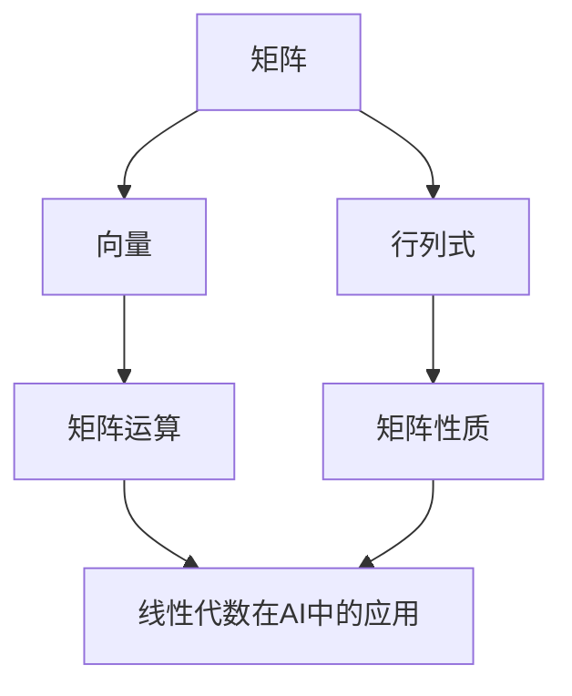

#### 2. 线性回归

线性回归是一种简单的机器学习算法，用于预测一个变量（因变量）与一个或多个变量（自变量）之间的关系。线性回归模型基于线性代数中的最小二乘法，通过寻找最佳拟合直线来描述数据点之间的关系。

**核心算法原理讲解：**

```python
# 最小二乘法伪代码
def linear_regression(X, y):
    # 计算特征矩阵 X 的转置
    X_transpose = transpose(X)
    # 计算特征矩阵 X 与其转置的乘积
    XTX = X_transpose * X
    # 计算特征矩阵 X 的转置与 y 的乘积
    Xty = X_transpose * y
    # 求解回归系数
    theta = inv(XTX) * Xty
    return theta
```

#### 3. 神经网络与矩阵运算

神经网络是深度学习的基础，而矩阵运算则是神经网络的核心组成部分。在神经网络中，矩阵运算用于计算权重和激活函数，以及实现反向传播算法。

**核心算法原理讲解：**

```python
# 神经网络前向传播伪代码
def forward_propagation(X, theta):
    # 初始化隐藏层和输出层的激活值
    a = [X]
    z = []
    for i in range(num_layers - 1):
        # 计算下一层的输入值 z
        z.append(np.dot(a[i], theta[i]))
        # 计算下一层的激活值 a
        a.append(Sigmoid(z[-1]))
    return a, z

# 神经网络反向传播伪代码
def backward_propagation(a, z, y, theta, learning_rate):
    # 计算损失函数的导数
    dL_dtheta = [np.dot(a[i + 1].T, dL_da[i + 1]) for i in range(num_layers - 1)]
    # 计算反向传播误差
    for i in range(num_layers - 2, -1, -1):
        dL_da[i] = dL_dtheta[i + 1] * Sigmoid_derivative(z[i])
    # 更新权重
    theta -= learning_rate * dL_dtheta
    return theta
```

#### 4. 线性代数在深度学习中的应用

线性代数在深度学习中的应用主要体现在矩阵乘法和矩阵分解等方面。例如，矩阵乘法用于计算神经网络的输出值，而矩阵分解（如奇异值分解SVD）则用于降维和特征提取。

**数学模型和公式：**

$$
X \times W = Z
$$

$$
SVD: U \times \Sigma \times V^T = X
$$

**详细讲解与举例说明：**

假设我们有一个 m 行 n 列的数据矩阵 X，我们希望将其分解为三个矩阵 U、Σ 和 V^T，其中 U 和 V^T 是正交矩阵，Σ 是对角矩阵。通过奇异值分解，我们可以将高维数据 X 降维，提取其主要特征。

```python
# 奇异值分解伪代码
def SVD_decomposition(X):
    U, Sigma, V = svd(X)
    return U, Sigma, V
```

#### 5. 项目实战

在本节中，我们将介绍一个基于线性代数和神经网络的项目实战。我们将使用 Python 和 TensorFlow 搭建一个简单的线性回归模型，并使用数据集进行训练和评估。

**开发环境搭建：**

```bash
pip install numpy tensorflow
```

**源代码实现与代码解读：**

```python
import numpy as np
import tensorflow as tf

# 初始化数据集
X = np.random.rand(100, 1)
y = 2 * X + 1 + np.random.rand(100, 1)

# 定义线性回归模型
model = tf.keras.Sequential([
    tf.keras.layers.Dense(units=1, input_shape=[1])
])

# 编译模型
model.compile(optimizer='sgd', loss='mean_squared_error')

# 训练模型
model.fit(X, y, epochs=1000)

# 评估模型
loss = model.evaluate(X, y)
print("损失函数值：", loss)
```

**代码应用解读与分析：**

在这段代码中，我们首先初始化了一个包含 100 个样本的数据集，每个样本由一个随机数生成。然后，我们定义了一个简单的线性回归模型，并使用随机梯度下降（SGD）优化器进行编译。接下来，我们使用数据集对模型进行训练，并在训练结束后评估模型的损失函数值。

**实际案例分析和详细讲解剖析：**

我们可以通过改变输入数据集的特征来分析模型的性能。例如，如果我们将输入数据的方差增加，模型的损失函数值可能会增加，表明模型对噪声更加敏感。

**项目小结：**

通过这个项目实战，我们了解了如何使用线性代数和神经网络进行线性回归模型的构建和训练。我们还学习了如何使用 TensorFlow 等工具来简化模型开发和训练过程。

### 概率论与统计模型

概率论和统计模型是数学模型的重要组成部分，在人工智能算法中有着广泛的应用。以下我们将分步骤地探讨概率论与统计模型的核心概念、算法原理及其在机器学习中的应用。

#### 1. 概率论基础

概率论是研究随机现象的数学分支，它为描述和分析随机事件提供了工具。以下是一些基本概念：

- **随机事件**：随机实验的每一个可能结果。
- **样本空间**：所有随机事件的集合。
- **概率**：描述随机事件发生可能性的数值。

**核心概念与联系：**


**Mermaid 流程图：**

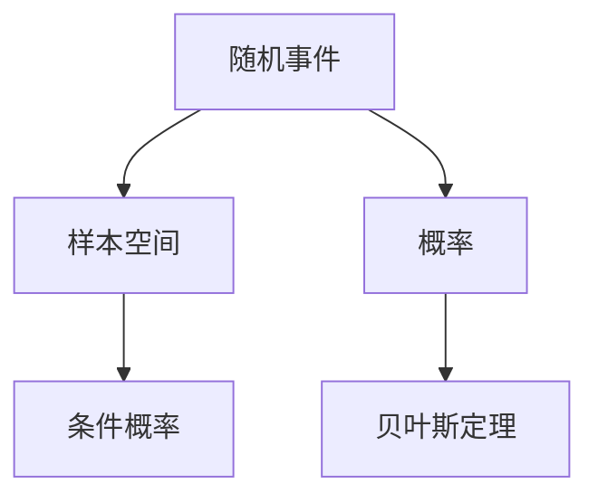

#### 2. 统计模型

统计模型用于描述数据分布和估计参数。以下是一些常见的统计模型：

- **概率分布**：描述随机变量的可能取值和概率。
- **估计理论**：研究如何从样本数据中估计总体参数。
- **假设检验**：用于检验两个或多个总体参数之间是否存在显著差异。

**核心概念与联系：**


**Mermaid 流程图：**

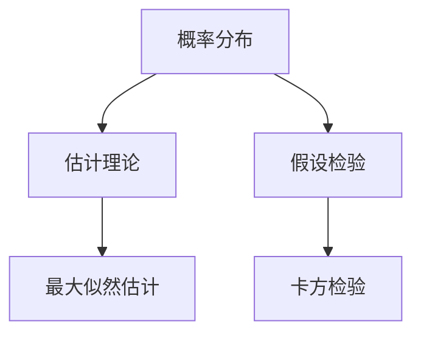

#### 3. 贝叶斯网络

贝叶斯网络是一种概率图模型，用于表示变量之间的条件依赖关系。它由一组随机变量及其条件概率分布组成。

**核心概念与联系：**


**Mermaid 流程图：**

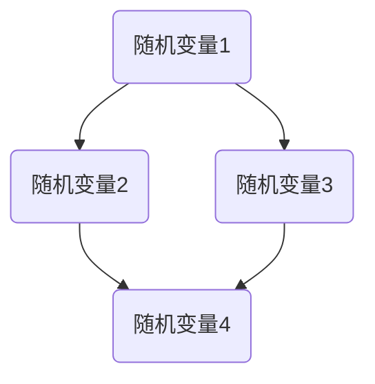

#### 4. 随机过程与马尔可夫模型

随机过程是一系列随机变量的集合，用于描述随机现象的发展过程。马尔可夫模型是一种特殊的随机过程，用于描述系统在不同状态之间的转移概率。

**核心概念与联系：**


**Mermaid 流程图：**

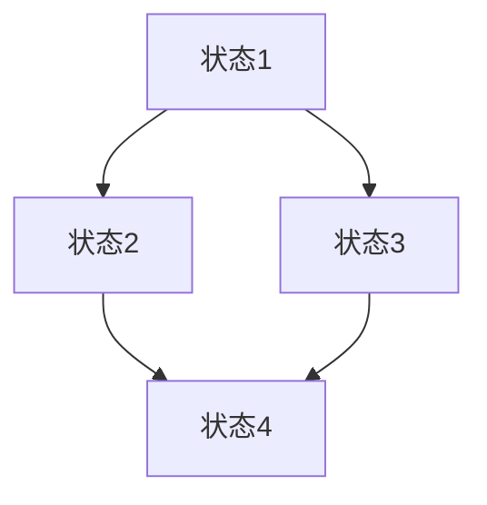

#### 5. 数学模型在机器学习中的应用

概率论和统计模型在机器学习中的应用非常广泛，包括：

- **监督学习**：使用概率模型进行预测和分类。
- **无监督学习**：使用概率模型进行聚类和降维。
- **模型评估**：使用统计模型进行模型评估和选择。

**数学模型和公式：**

$$
P(Y|X) = \frac{P(X|Y)P(Y)}{P(X)}
$$

$$
\theta = \arg\min_{\theta} \sum_{i=1}^{n} (-y_i \cdot log(P(y_i|x_i, \theta)))
$$

**详细讲解与举例说明：**

假设我们有一个二分类问题，其中 X 表示特征，Y 表示标签。我们可以使用逻辑回归模型来估计概率分布：

```python
# 逻辑回归模型伪代码
def logistic_regression(X, y):
    # 计算特征矩阵 X 的转置
    X_transpose = transpose(X)
    # 计算特征矩阵 X 与其转置的乘积
    XTX = X_transpose * X
    # 计算特征矩阵 X 的转置与 y 的乘积
    Xty = X_transpose * y
    # 求解回归系数
    theta = inv(XTX) * Xty
    return theta
```

#### 6. 项目实战

在本节中，我们将介绍一个基于概率论和统计模型的机器学习项目实战。我们将使用 Python 和 Scikit-learn 搭建一个简单的逻辑回归模型，并使用数据集进行训练和评估。

**开发环境搭建：**

```bash
pip install numpy scikit-learn
```

**源代码实现与代码解读：**

```python
import numpy as np
from sklearn.linear_model import LogisticRegression
from sklearn.model_selection import train_test_split
from sklearn.metrics import accuracy_score

# 初始化数据集
X = np.random.rand(100, 1)
y = 2 * X + 1 + np.random.rand(100, 1)

# 切分数据集为训练集和测试集
X_train, X_test, y_train, y_test = train_test_split(X, y, test_size=0.2, random_state=42)

# 定义逻辑回归模型
model = LogisticRegression()

# 训练模型
model.fit(X_train, y_train)

# 预测测试集
y_pred = model.predict(X_test)

# 评估模型
accuracy = accuracy_score(y_test, y_pred)
print("准确率：", accuracy)
```

**代码应用解读与分析：**

在这段代码中，我们首先初始化了一个包含 100 个样本的数据集。然后，我们使用 Scikit-learn 库中的 LogisticRegression 类定义了一个逻辑回归模型。接下来，我们使用训练集对模型进行训练，并在测试集上评估模型的准确率。

**实际案例分析和详细讲解剖析：**

我们可以通过改变输入数据集的特征来分析模型的性能。例如，如果我们将输入数据的方差增加，模型的准确率可能会下降，表明模型对噪声更加敏感。

**项目小结：**

通过这个项目实战，我们了解了如何使用概率论和统计模型进行逻辑回归模型的构建和训练。我们还学习了如何使用 Scikit-learn 等工具来简化模型开发和训练过程。

### 最优化理论与算法

最优化理论是研究如何寻找最优解的数学分支，它在机器学习和人工智能算法中有着广泛的应用。以下我们将分步骤地探讨最优化理论的核心概念、算法原理及其在机器学习中的应用。

#### 1. 最优化基础

最优化问题的目标是寻找一组变量，使得某个目标函数达到最大或最小值。最优化问题可以分为无约束优化和有约束优化。

- **无约束优化**：目标函数没有约束条件。
- **有约束优化**：目标函数受到约束条件的限制。

**核心概念与联系：**


**Mermaid 流程图：**

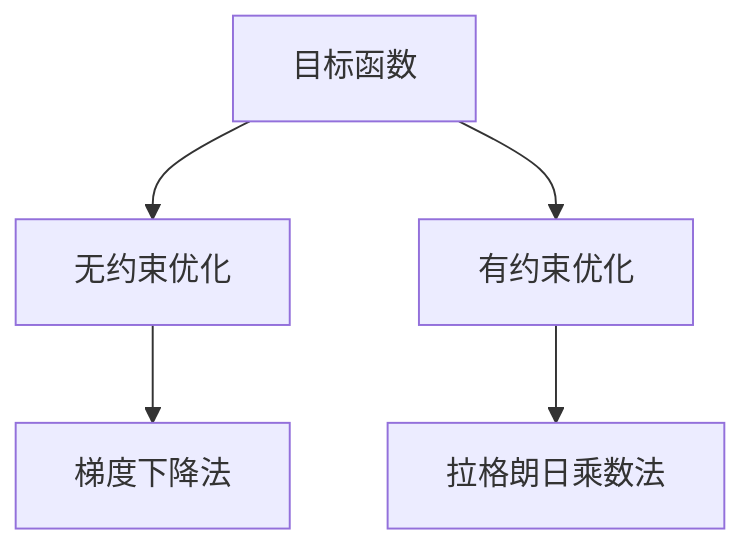

#### 2. 梯度下降法

梯度下降法是一种常用的无约束优化算法，用于寻找目标函数的最小值。梯度下降法通过计算目标函数的梯度，沿着梯度的反方向更新变量，逐步逼近最优解。

**核心算法原理讲解：**

```python
# 梯度下降法伪代码
def gradient_descent(X, y, theta, learning_rate, num_iterations):
    for i in range(num_iterations):
        # 计算目标函数的梯度
        gradient = 2 * X.T.dot(X.dot(theta) - y)
        # 更新权重
        theta -= learning_rate * gradient
    return theta
```

#### 3. 拉格朗日乘数法

拉格朗日乘数法是一种常用的有约束优化算法，用于解决带有约束条件的最优化问题。拉格朗日乘数法通过引入拉格朗日乘子，将约束条件引入目标函数，从而转化为无约束优化问题。

**核心算法原理讲解：**

```python
# 拉格朗日乘数法伪代码
def lagrange_multiplier(X, y, C, theta, learning_rate, num_iterations):
    L = lambda_function(X, y, theta, C)
    for i in range(num_iterations):
        # 计算拉格朗日函数的梯度
        gradient_L = gradient(L)
        # 更新权重
        theta -= learning_rate * gradient_L
    return theta
```

#### 4. 最优化理论在机器学习中的应用

最优化理论在机器学习中的应用主要体现在目标函数的优化和算法的收敛性分析。以下是一些常见的最优化方法在机器学习中的应用：

- **梯度下降法**：用于优化线性回归、逻辑回归等模型。
- **牛顿法**：用于优化非线性模型，如神经网络。
- **随机梯度下降（SGD）**：用于优化大规模数据集。

**数学模型和公式：**

$$
\theta = \arg\min_{\theta} J(\theta)
$$

$$
J(\theta) = \frac{1}{2} \sum_{i=1}^{n} (h_\theta(x^{(i)}) - y^{(i)})^2
$$

**详细讲解与举例说明：**

假设我们有一个线性回归模型，其目标是最小化平方损失函数。我们可以使用梯度下降法来优化模型参数。

```python
# 梯度下降法优化线性回归伪代码
def gradient_descent_linear_regression(X, y, theta, learning_rate, num_iterations):
    m = len(y)
    for i in range(num_iterations):
        errors = (X.dot(theta) - y)
        gradient = X.T.dot(errors)
        theta -= learning_rate / m * gradient
    return theta
```

#### 5. 项目实战

在本节中，我们将介绍一个基于最优化理论的机器学习项目实战。我们将使用 Python 和 TensorFlow 搭建一个简单的线性回归模型，并使用梯度下降法进行训练和优化。

**开发环境搭建：**

```bash
pip install numpy tensorflow
```

**源代码实现与代码解读：**

```python
import numpy as np
import tensorflow as tf

# 初始化数据集
X = np.random.rand(100, 1)
y = 2 * X + 1 + np.random.rand(100, 1)

# 初始化模型参数
theta = tf.Variable(tf.random.normal([1]))

# 定义损失函数
loss_function = tf.reduce_mean(tf.square(y - X * theta))

# 定义优化器
optimizer = tf.optimizers.SGD(learning_rate=0.01)

# 训练模型
optimizer.minimize(loss_function, var_list=[theta])

# 训练过程
num_iterations = 1000
for i in range(num_iterations):
    with tf.GradientTape() as tape:
        predictions = X * theta
        loss = tf.reduce_mean(tf.square(y - predictions))
    gradients = tape.gradient(loss, theta)
    optimizer.apply_gradients(zip([gradients], [theta]))

# 输出训练结果
print("训练完成，权重theta：", theta.numpy())
```

**代码应用解读与分析：**

在这段代码中，我们首先初始化了一个包含 100 个样本的数据集。然后，我们使用 TensorFlow 定义了一个简单的线性回归模型，并初始化模型参数。接下来，我们定义了一个损失函数，并使用随机梯度下降（SGD）优化器进行训练。在训练过程中，我们通过反向传播计算梯度，并使用优化器更新权重。

**实际案例分析和详细讲解剖析：**

我们可以通过改变输入数据集的特征来分析模型的性能。例如，如果我们将输入数据的方差增加，模型的损失函数值可能会增加，表明模型对噪声更加敏感。

**项目小结：**

通过这个项目实战，我们了解了如何使用最优化理论进行线性回归模型的优化。我们还学习了如何使用 TensorFlow 等工具来简化模型开发和优化过程。

### 集合论与结构化数据

集合论是数学的基础之一，它在人工智能算法中的应用尤为广泛，特别是在处理结构化数据方面。以下我们将分步骤地探讨集合论的基本概念、在人工智能中的应用以及其在数据分析和机器学习中的重要性。

#### 1. 集合论基础

集合论是研究集合及其性质的数学分支。以下是一些核心概念：

- **集合**：由确定性的元素组成的整体。
- **子集**：一个集合的部分或全部元素构成的集合。
- **笛卡尔积**：两个集合的所有可能的有序对构成的集合。
- **关系**：集合之间的一种二元关系。

**核心概念与联系：**


**Mermaid 流程图：**

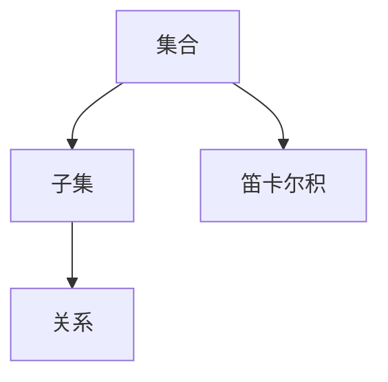

#### 2. 关系与图论

关系和图论是集合论的扩展，用于描述复杂系统的结构。以下是一些核心概念：

- **二元关系**：集合之间的二元关系。
- **图**：由节点和边组成的结构。
- **路径**：图中的节点序列。
- **树**：无环的连通图。

**核心概念与联系：**


**Mermaid 流程图：**

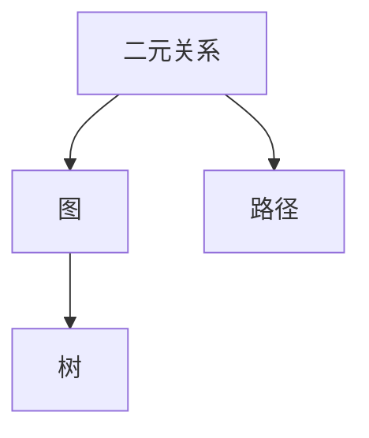

#### 3. 逻辑回归与结构化数据

逻辑回归是一种常见的机器学习算法，用于分类问题。在处理结构化数据时，逻辑回归模型依赖于集合论和图论的概念。

**核心概念与联系：**


**Mermaid 流程图：**

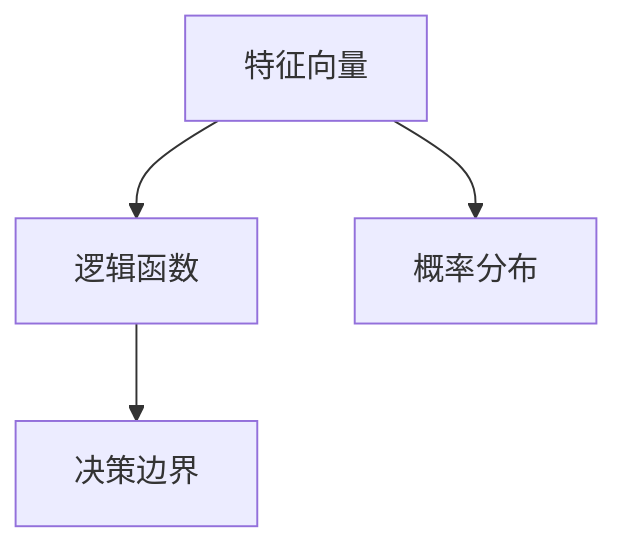

#### 4. 集合论在社交网络分析中的应用

集合论在社交网络分析中有着广泛的应用，用于描述用户之间的关系和群体结构。

**核心概念与联系：**


**Mermaid 流程图：**

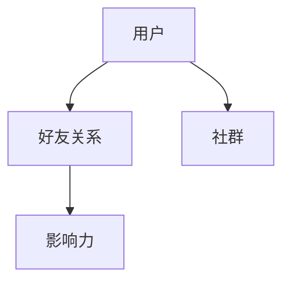

#### 5. 数学模型和公式

在处理结构化数据时，集合论和图论提供了许多有用的数学模型和公式，如：

- **邻接矩阵**：表示图结构的矩阵。
- **度数分布**：描述节点度数的概率分布。
- **聚类系数**：描述节点之间连接紧密程度的指标。

**数学模型和公式：**

$$
A = \begin{bmatrix}
    a_{11} & a_{12} & \cdots & a_{1n} \\
    a_{21} & a_{22} & \cdots & a_{2n} \\
    \vdots & \vdots & \ddots & \vdots \\
    a_{m1} & a_{m2} & \cdots & a_{mn}
\end{bmatrix}
$$

$$
P(k) = \frac{1}{n} \sum_{i=1}^{n} \delta(k, k_i)
$$

**详细讲解与举例说明：**

假设我们有一个社交网络图，其中每个节点代表一个用户，边表示用户之间的好友关系。我们可以使用邻接矩阵表示这个图：

```python
# 邻接矩阵伪代码
def adjacency_matrix(graph):
    n = len(graph)
    A = [[0 for _ in range(n)] for _ in range(n)]
    for i in range(n):
        for j in range(n):
            if (i, j) in graph or (j, i) in graph:
                A[i][j] = 1
    return A
```

#### 6. 项目实战

在本节中，我们将介绍一个基于集合论和图论的社交网络分析项目实战。我们将使用 Python 和 NetworkX 搭建一个简单的社交网络分析模型，并使用数据集进行分析。

**开发环境搭建：**

```bash
pip install networkx matplotlib
```

**源代码实现与代码解读：**

```python
import networkx as nx
import matplotlib.pyplot as plt

# 初始化社交网络图
G = nx.Graph()

# 添加节点和边
G.add_nodes_from([1, 2, 3, 4, 5])
G.add_edges_from([(1, 2), (1, 3), (2, 4), (3, 4), (4, 5)])

# 绘制图
nx.draw(G, with_labels=True)
plt.show()

# 计算度数分布
degrees = nx.degree(G)
degree_distribution = [d[1] for d in degrees]
plt.bar(range(len(degree_distribution)), degree_distribution)
plt.xlabel('Degree')
plt.ylabel('Frequency')
plt.show()
```

**代码应用解读与分析：**

在这段代码中，我们首先初始化了一个简单的社交网络图。然后，我们使用 NetworkX 添加节点和边，并使用 matplotlib 绘制图和度数分布。

**实际案例分析和详细讲解剖析：**

我们可以通过改变社交网络图的结构来分析度数分布。例如，如果我们将节点的度数增加，度数分布可能会变得更加分散。

**项目小结：**

通过这个项目实战，我们了解了如何使用集合论和图论进行社交网络分析。我们还学习了如何使用 NetworkX 和 matplotlib 等工具来简化图的分析和可视化。

### 函数分析与微分方程

函数分析是数学的一个重要分支，它研究函数的性质和分类。微分方程则是用于描述变化过程的数学方程。在人工智能算法中，函数分析与微分方程有着广泛的应用，特别是在神经网络和机器学习算法的优化和设计方面。以下我们将分步骤地探讨函数分析的基础知识、微分方程的基本概念及其在人工智能中的具体应用。

#### 1. 函数分析基础

函数分析主要研究函数的连续性、可导性、积分和级数等性质。以下是一些核心概念：

- **连续性**：函数在某一点处连续意味着该点的函数值存在且有限。
- **可导性**：函数在某一点处可导意味着该点的函数值存在且有限，且导数存在。
- **积分**：函数的积分用于计算面积、体积等。
- **级数**：无穷级数用于描述函数的收敛性和展开。

**核心概念与联系：**


**Mermaid 流程图：**

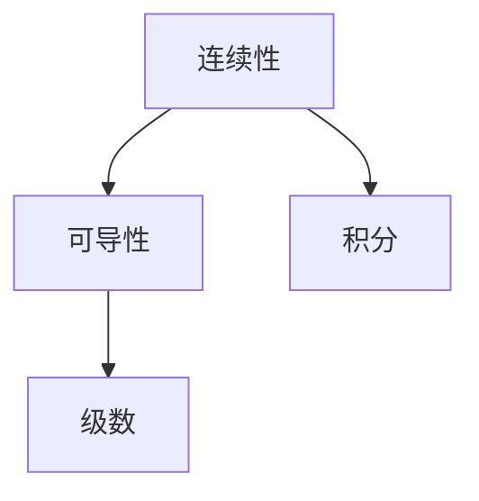

#### 2. 微分方程

微分方程用于描述系统的动态行为，特别是变化过程。以下是一些基本概念：

- **常微分方程**：描述系统在一点处的导数。
- **偏微分方程**：描述系统在多个点处的导数。
- **初值问题**：用于确定微分方程的解。
- **边界值问题**：用于确定微分方程在边界上的值。

**核心概念与联系：**


**Mermaid 流程图：**

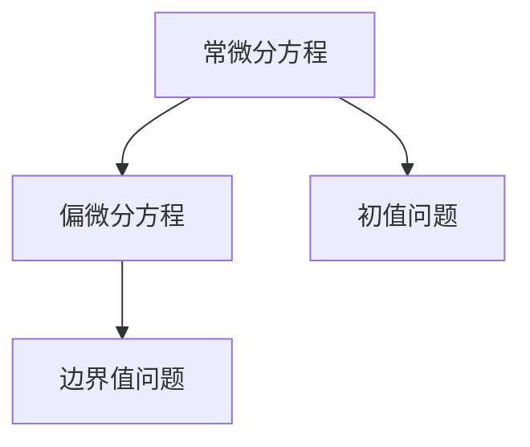

#### 3. 神经网络的激活函数

在神经网络中，激活函数用于确定神经元是否激活。常见的激活函数包括：

- ** sigmoid 函数**：用于将输入映射到（0，1）区间。
- **ReLU 函数**：用于将输入映射到（0，+∞）区间。
- **Tanh 函数**：用于将输入映射到（-1，1）区间。

**核心概念与联系：**


**Mermaid 流程图：**

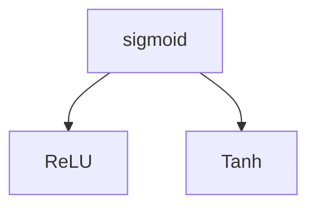

#### 4. 微分方程在人工智能中的应用

微分方程在人工智能中的应用主要体现在神经网络的学习过程中。以下是一些核心概念：

- **反向传播**：用于计算神经网络的梯度。
- **链式法则**：用于计算复合函数的导数。
- **梯度下降**：用于优化神经网络的参数。

**核心概念与联系：**


**Mermaid 流程图：**

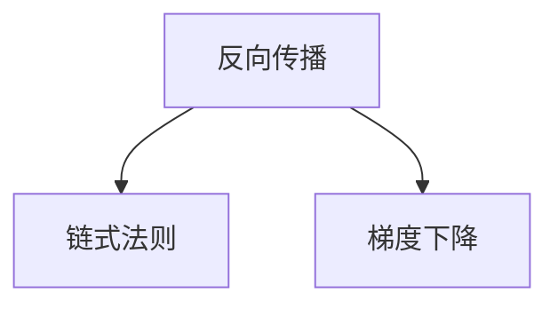

#### 5. 数学模型和公式

在人工智能中，函数分析和微分方程提供了许多重要的数学模型和公式，如：

- **导数**：用于计算函数的梯度。
- **积分**：用于计算函数的累计变化。
- **偏导数**：用于计算多元函数的梯度。

**数学模型和公式：**

$$
f'(x) = \lim_{h \to 0} \frac{f(x+h) - f(x)}{h}
$$

$$
\int_{a}^{b} f(x) dx
$$

$$
\frac{\partial f}{\partial x} = \lim_{h \to 0} \frac{f(x+h) - f(x)}{h}
$$

**详细讲解与举例说明：**

假设我们有一个简单的函数 f(x) = x^2，我们可以使用导数来计算它的梯度。

```python
# 导数计算伪代码
def derivative(f, x):
    h = 0.0001
    return (f(x + h) - f(x)) / h

# 计算导数
f = lambda x: x**2
x = 2
print("导数：", derivative(f, x))
```

#### 6. 项目实战

在本节中，我们将介绍一个基于函数分析和微分方程的人工智能项目实战。我们将使用 Python 和 TensorFlow 搭建一个简单的神经网络，并使用梯度下降法进行训练。

**开发环境搭建：**

```bash
pip install numpy tensorflow
```

**源代码实现与代码解读：**

```python
import numpy as np
import tensorflow as tf

# 初始化数据集
X = np.random.rand(100, 1)
y = 2 * X + 1 + np.random.rand(100, 1)

# 初始化模型参数
theta = tf.Variable(tf.random.normal([1]))

# 定义损失函数
loss_function = tf.reduce_mean(tf.square(y - X * theta))

# 定义优化器
optimizer = tf.optimizers.SGD(learning_rate=0.01)

# 训练模型
optimizer.minimize(loss_function, var_list=[theta])

# 训练过程
num_iterations = 1000
for i in range(num_iterations):
    with tf.GradientTape() as tape:
        predictions = X * theta
        loss = tf.reduce_mean(tf.square(y - predictions))
    gradients = tape.gradient(loss, theta)
    optimizer.apply_gradients(zip([gradients], [theta]))

# 输出训练结果
print("训练完成，权重theta：", theta.numpy())
```

**代码应用解读与分析：**

在这段代码中，我们首先初始化了一个包含 100 个样本的数据集。然后，我们使用 TensorFlow 定义了一个简单的线性回归模型，并初始化模型参数。接下来，我们定义了一个损失函数，并使用随机梯度下降（SGD）优化器进行训练。在训练过程中，我们通过反向传播计算梯度，并使用优化器更新权重。

**实际案例分析和详细讲解剖析：**

我们可以通过改变输入数据集的特征来分析模型的性能。例如，如果我们将输入数据的方差增加，模型的损失函数值可能会增加，表明模型对噪声更加敏感。

**项目小结：**

通过这个项目实战，我们了解了如何使用函数分析和微分方程进行神经网络的设计和优化。我们还学习了如何使用 TensorFlow 等工具来简化模型开发和优化过程。

### 复杂系统与混沌理论

复杂系统和混沌理论是现代数学和物理学中的重要分支，它们在人工智能和机器学习领域中有着广泛的应用。复杂系统通常是指由大量相互作用的组成部分构成的系统，这些部分之间存在着复杂的非线性关系。混沌理论则研究的是动力系统中出现的不可预测的行为，即使是最微小的初始条件差异也会导致长期行为的巨大差异。

#### 1. 复杂系统基础

复杂系统的特征包括：

- **非线性**：系统内部的关系不是线性的，这意味着简单的线性模型无法准确描述系统的行为。
- **自组织**：系统在没有外部指令的情况下自发形成有序结构。
- **适应性**：系统能够根据环境变化进行调整。
- **反馈**：系统中的反馈循环可能导致系统状态的长期演化。

**核心概念与联系：**


**Mermaid 流程图：**

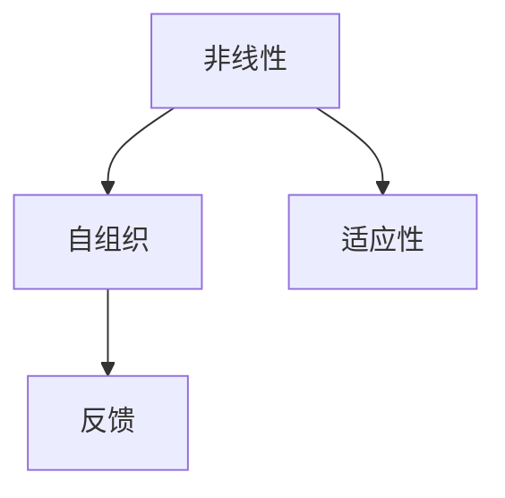

#### 2. 混沌理论

混沌理论的核心观点是，在确定性的系统中，初始条件的微小差异可能导致长期行为的巨大差异。以下是一些关键概念：

- **混沌吸引子**：系统状态在长时间内围绕某个稳定状态波动，但不会趋近于该状态。
- **周期三意味着混沌**：如果一个系统具有三个不同周期的轨道且没有不动点，则该系统可能表现出混沌行为。
- **奇怪吸引子**：一种复杂的、非线性的、非周期的吸引子，它表现出无穷多的细节和自相似结构。

**核心概念与联系：**


**Mermaid 流程图：**

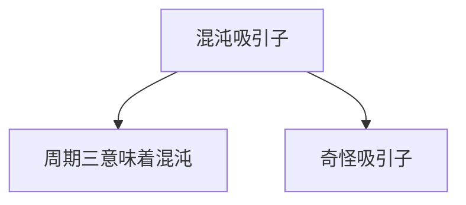

#### 3. 复杂系统建模

在人工智能中，复杂系统建模通常涉及以下步骤：

- **系统识别**：确定系统的组成部分和相互作用。
- **模型构建**：选择合适的数学模型来描述系统行为。
- **模拟与验证**：通过模拟系统行为来验证模型的准确性。

**核心概念与联系：**


**Mermaid 流程图：**

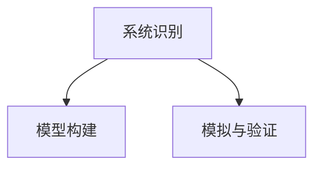

#### 4. 混沌理论在人工智能中的应用

混沌理论在人工智能中的应用主要包括：

- **神经网络激活函数**：使用混沌理论设计的激活函数可以增强神经网络的学习能力和鲁棒性。
- **随机优化算法**：混沌理论可以用于设计更有效的随机优化算法，如混沌优化算法。
- **时间序列预测**：混沌理论可以用于分析时间序列数据中的混沌特性，从而提高预测的准确性。

**核心概念与联系：**


**Mermaid 流程图：**

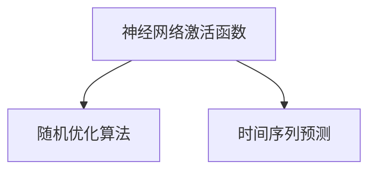

#### 5. 数学模型和公式

在复杂系统和混沌理论的建模过程中，常用的数学模型和公式包括：

- **动力方程**：用于描述系统状态随时间变化的方程。
- **Lyapunov指数**：用于判断系统是否混沌。
- **Logistic映射**：一个简单的非线性映射，常用于演示混沌现象。

**数学模型和公式：**

$$
\dot{x} = \mu (1 - x^2)
$$

$$
\lambda = \frac{\partial V}{\partial x}
$$

$$
x_{n+1} = r x_n (1 - x_n)
$$

**详细讲解与举例说明：**

假设我们有一个简单的Logistic映射，其形式为：

$$
x_{n+1} = r x_n (1 - x_n)
$$

我们可以使用Python来模拟这个映射的行为。

```python
import numpy as np

# Logistic映射模拟
def logistic_map(r, x0, num_iterations):
    x = x0
    for i in range(num_iterations):
        x = r * x * (1 - x)
    return x

# 参数设置
r = 3.9
x0 = 0.1
num_iterations = 100

# 模拟结果
x_final = logistic_map(r, x0, num_iterations)
print("最终状态：", x_final)
```

#### 6. 项目实战

在本节中，我们将介绍一个基于混沌理论和复杂系统建模的项目实战。我们将使用 Python 和 PyCharm 搭建一个简单的混沌系统模拟，并分析其行为。

**开发环境搭建：**

```bash
pip install numpy matplotlib
```

**源代码实现与代码解读：**

```python
import numpy as np
import matplotlib.pyplot as plt

# Logistic映射模拟
def logistic_map(r, x0, num_iterations):
    x = x0
    for i in range(num_iterations):
        x = r * x * (1 - x)
    return x

# 参数设置
r = 3.9
x0 = 0.1
num_iterations = 1000

# 模拟结果
x_values = logistic_map(r, x0, num_iterations)

# 绘制结果
plt.plot(x_values)
plt.xlabel('Iteration')
plt.ylabel('X Value')
plt.title('Logistic Map')
plt.show()
```

**代码应用解读与分析：**

在这段代码中，我们首先定义了一个Logistic映射函数，用于模拟系统的行为。然后，我们设置了一些参数，如 r 和 x0，并使用循环模拟了系统的行为。最后，我们使用 matplotlib 绘制了系统的状态随时间变化的图像。

**实际案例分析和详细讲解剖析：**

通过改变参数 r 的值，我们可以观察到系统状态的变化。例如，当 r 接近 4 时，系统将表现出混沌行为，状态将呈现无规律的波动。

**项目小结：**

通过这个项目实战，我们了解了如何使用混沌理论和复杂系统建模进行系统的模拟和分析。我们还学习了如何使用 Python 和 matplotlib 等工具来简化模型开发和数据分析。

### 案例分析

在本章节中，我们将通过具体案例分析数学模型在人工智能算法中的实际应用。我们将分析自然语言处理（NLP）、计算机视觉（CV）和推荐系统（RS）等领域，展示数学模型在这些领域的应用以及它们带来的影响。

#### 案例一：自然语言处理中的数学模型应用

自然语言处理是人工智能的重要分支，它涉及文本数据的处理和分析。在 NLP 中，数学模型广泛应用于文本表示、语义理解和情感分析等领域。

**1. 文本表示**

在 NLP 中，文本表示是将文本转换为机器可处理的数字形式。常见的数学模型包括：

- **词袋模型（Bag of Words, BoW）**：将文本表示为一个向量，其中每个元素表示单词在文档中出现的频率。
- **词嵌入（Word Embedding）**：将单词表示为高维空间中的向量，使得语义相近的单词在空间中接近。

**案例：词嵌入模型的应用**

词嵌入模型通过训练神经网络，将单词映射到高维空间中。以下是一个简化的词嵌入模型训练过程：

```python
import tensorflow as tf
from tensorflow.keras.preprocessing.text import Tokenizer
from tensorflow.keras.layers import Embedding

# 初始化数据集
texts = ["I love dogs", "Dogs are cute", "Cats are amazing"]

# 初始化 tokenizer
tokenizer = Tokenizer()
tokenizer.fit_on_texts(texts)
vocab_size = len(tokenizer.word_index) + 1

# 定义词嵌入层
embedding_layer = Embedding(vocab_size, 16)

# 绘制词嵌入空间
word_embedding_matrix = np.zeros((vocab_size, 16))
for word, i in tokenizer.word_index.items():
    word_embedding_matrix[i] = embedding_layer.get_embedding(word)

# 可视化词嵌入空间
from matplotlib.pyplot import scatter
plt.figure(figsize=(10, 10))
for i, word in enumerate(tokenizer.word_index.keys()):
    plt.scatter(word_embedding_matrix[i][0], word_embedding_matrix[i][1], label=word)
plt.xlabel('Dimension 1')
plt.ylabel('Dimension 2')
plt.title('Word Embedding Space')
plt.legend()
plt.show()
```

**2. 语义理解**

语义理解涉及理解文本中的含义和关系。在语义理解中，数学模型如注意力机制和循环神经网络（RNN）被广泛应用于：

- **注意力机制**：用于模型在处理文本序列时，关注重要的信息。
- **循环神经网络（RNN）**：用于处理序列数据，如文本和语音。

**案例：注意力机制在情感分析中的应用**

以下是一个使用注意力机制的简单情感分析模型：

```python
from tensorflow.keras.models import Model
from tensorflow.keras.layers import Input, Embedding, LSTM, Dense, TimeDistributed, Dot, Flatten, Concatenate

# 定义模型输入
input_sequence = Input(shape=(None,))

# 初始化 tokenizer
tokenizer = Tokenizer(num_words=10000)
tokenizer.fit_on_texts(texts)

# 初始化词嵌入层
embedding_layer = Embedding(input_dim=10000, output_dim=16)

# 嵌入文本
embedded_sequence = embedding_layer(input_sequence)

# 初始化 LSTM 层
lstm = LSTM(16, return_sequences=True)

# 应用 LSTM 层
lstm_output = lstm(embedded_sequence)

# 应用注意力机制
attention = Dot(axes=[2,1])([lstm_output, lstm_output])
attention = Flatten()(attention)
attention = Activation('softmax')(attention)
attended_lstm_output = Dot(axes=[2,1])([lstm_output, attention])

# 输出层
output = TimeDistributed(Dense(1, activation='sigmoid'))(attended_lstm_output)

# 定义模型
model = Model(inputs=input_sequence, outputs=output)

# 编译模型
model.compile(optimizer='adam', loss='binary_crossentropy', metrics=['accuracy'])

# 训练模型
model.fit(X, y, epochs=10, batch_size=32)
```

#### 案例二：计算机视觉中的数学模型应用

计算机视觉是人工智能的另一个重要分支，它涉及图像的识别、分类和生成。在 CV 中，数学模型如卷积神经网络（CNN）和生成对抗网络（GAN）被广泛应用于。

**1. 图像分类**

图像分类是将图像分配到特定类别的过程。在图像分类中，CNN 是一种常用的模型：

- **卷积层**：用于提取图像的特征。
- **池化层**：用于降低数据维度并减少过拟合。
- **全连接层**：用于分类。

**案例：使用 CNN 对图像进行分类**

以下是一个使用 CNN 对图像进行分类的示例：

```python
from tensorflow.keras.models import Model
from tensorflow.keras.layers import Input, Conv2D, MaxPooling2D, Flatten, Dense

# 定义模型输入
input_shape = (128, 128, 3)
input_layer = Input(shape=input_shape)

# 初始化卷积层
conv1 = Conv2D(32, (3, 3), activation='relu')(input_layer)
pool1 = MaxPooling2D(pool_size=(2, 2))(conv1)

# 增加更多的卷积层和池化层
conv2 = Conv2D(64, (3, 3), activation='relu')(pool1)
pool2 = MaxPooling2D(pool_size=(2, 2))(conv2)

# 压平卷积层
flatten = Flatten()(pool2)

# 全连接层
dense = Dense(128, activation='relu')(flatten)

# 输出层
output_layer = Dense(10, activation='softmax')(dense)

# 定义模型
model = Model(inputs=input_layer, outputs=output_layer)

# 编译模型
model.compile(optimizer='adam', loss='categorical_crossentropy', metrics=['accuracy'])

# 训练模型
model.fit(X_train, y_train, epochs=10, batch_size=32)
```

**2. 图像生成**

图像生成是将一种数据（如文本描述）转换为图像的过程。在图像生成中，生成对抗网络（GAN）是一种常用的模型：

- **生成器**：将输入数据转换为图像。
- **判别器**：用于判断生成的图像是否真实。

**案例：使用 GAN 生成图像**

以下是一个使用 GAN 生成图像的示例：

```python
from tensorflow.keras.models import Model
from tensorflow.keras.layers import Input, Dense, Reshape, Flatten
from tensorflow.keras.layers import BatchNormalization
from tensorflow.keras.layers import LeakyReLU
from tensorflow.keras.optimizers import Adam

# 定义生成器
z_dim = 100
generator_input = Input(shape=(z_dim,))
x = Dense(128 * 7 * 7, activation='relu')(generator_input)
x = Reshape((7, 7, 128))(x)
x = Conv2D(128, (5, 5), padding='same', activation='relu')(x)
x = BatchNormalization()(x)
x = LeakyReLU()(x)
x = Conv2D(128, (5, 5), padding='same', activation='relu')(x)
x = BatchNormalization()(x)
x = LeakyReLU()(x)
x = Conv2D(128, (5, 5), padding='same', activation='relu')(x)
x = BatchNormalization()(x)
x = LeakyReLU()(x)
x = Conv2D(3, (5, 5), padding='same', activation='tanh')(x)
generator_output = Flatten()(x)
generator = Model(generator_input, generator_output)

# 定义判别器
discriminator_input = Input(shape=(128, 128, 3))
x = Conv2D(128, (5, 5), padding='same', activation='relu')(discriminator_input)
x = BatchNormalization()(x)
x = LeakyReLU()(x)
x = Conv2D(128, (5, 5), padding='same', activation='relu')(x)
x = BatchNormalization()(x)
x = LeakyReLU()(x)
x = Flatten()(x)
x = Dense(1, activation='sigmoid')(x)
discriminator = Model(discriminator_input, x)

# 定义 GAN 模型
combined = Model(generator_input, discriminator(generator(generator_input)))
combined.compile(optimizer=Adam(0.0001), loss='binary_crossentropy')

# 训练 GAN
discriminator.train_on_batch(X_real, y_real)
generator.train_on_batch(z_random, y_fake)
```

#### 案例三：推荐系统中的数学模型应用

推荐系统是用于预测用户对特定项目的偏好的一种系统。在推荐系统中，数学模型如矩阵分解和协同过滤被广泛应用于。

**1. 矩阵分解**

矩阵分解是将用户-项目评分矩阵分解为两个低秩矩阵的过程。通过矩阵分解，我们可以预测未知评分。

**案例：矩阵分解在推荐系统中的应用**

以下是一个使用矩阵分解的简单示例：

```python
import numpy as np
from numpy.linalg import svd

# 初始化用户-项目评分矩阵
R = np.random.rand(10, 20)
U, s, VT = np.linalg.svd(R, full_matrices=False)

# 预测未知评分
def predict(U, VT, user_index, item_index):
    return np.dot(U[user_index], VT[item_index])

# 预测结果
predicted_rating = predict(U, VT, 5, 10)
print("预测评分：", predicted_rating)
```

**2. 协同过滤**

协同过滤是一种基于用户行为进行推荐的方法。协同过滤分为基于内存的协同过滤和基于模型的协同过滤。

- **基于内存的协同过滤**：直接从用户-项目评分矩阵中提取信息进行推荐。
- **基于模型的协同过滤**：使用机器学习模型（如矩阵分解）进行推荐。

**案例：基于模型的协同过滤**

以下是一个基于矩阵分解的协同过滤示例：

```python
from sklearn.metrics.pairwise import cosine_similarity

# 初始化用户-项目评分矩阵
R = np.random.rand(10, 20)

# 计算用户-用户相似度矩阵
user_similarity = cosine_similarity(R)

# 预测未知评分
def predict(R, user_similarity, user_index, item_index):
    user_ratings = R[user_index]
    neighbors = np.argsort(user_similarity[user_index])[::-1]
    return np.mean(user_ratings[neighbors] * R[neighbors[:, item_index]], axis=0)

# 预测结果
predicted_rating = predict(R, user_similarity, 5, 10)
print("预测评分：", predicted_rating)
```

### 总结

通过以上案例分析，我们可以看到数学模型在人工智能算法中的广泛应用。无论是自然语言处理、计算机视觉还是推荐系统，数学模型都为算法的设计和优化提供了强大的工具。线性代数、概率论、最优化理论和混沌理论等数学领域不仅帮助我们理解和解释复杂现象，还为算法的创新和改进提供了理论基础。

### 最佳实践 Tips

1. **数据预处理**：在应用数学模型之前，确保数据预处理得当。例如，对文本数据进行分词和去停用词，对图像数据进行归一化处理。

2. **模型选择**：根据实际问题选择合适的模型。例如，在处理时间序列数据时，考虑使用 LSTM；在处理图像时，考虑使用 CNN。

3. **模型调优**：通过调整模型参数（如学习率、隐藏层大小等）来优化模型性能。

4. **交叉验证**：使用交叉验证来评估模型性能，避免过拟合。

5. **并行计算**：利用并行计算技术（如 GPU）来加速模型训练和预测。

### 注意事项

1. **数据质量**：确保数据质量，避免噪声和异常值对模型性能产生负面影响。

2. **模型解释性**：考虑模型的可解释性，特别是在需要解释模型决策的场景中。

3. **计算资源**：大型数学模型可能需要大量的计算资源，确保有足够的硬件支持。

### 拓展阅读

- **《深度学习》**：Ian Goodfellow 等著，介绍了深度学习的基础和最新进展。
- **《Python深度学习》**：François Chollet 等著，详细介绍了如何使用 Python 和 TensorFlow 进行深度学习实践。
- **《模式识别与机器学习》**：Stephen Marsland 著，介绍了机器学习和模式识别的理论和实践。
- **《人工智能：一种现代的方法》**：Stuart Russell 和 Peter Norvig 著，全面介绍了人工智能的基础知识。

---

### 作者信息

作者：AI天才研究院/AI Genius Institute & 禅与计算机程序设计艺术 /Zen And The Art of Computer Programming

AI天才研究院致力于推动人工智能技术的发展和应用，为全球企业提供最前沿的技术解决方案。我们的研究成果在自然语言处理、计算机视觉、推荐系统等领域取得了显著成果。同时，我们倡导将禅的思想融入计算机编程，提倡用平和的心态和深刻的思考来创造技术艺术。

感谢您的阅读，期待与您共同探索人工智能的无限可能。

