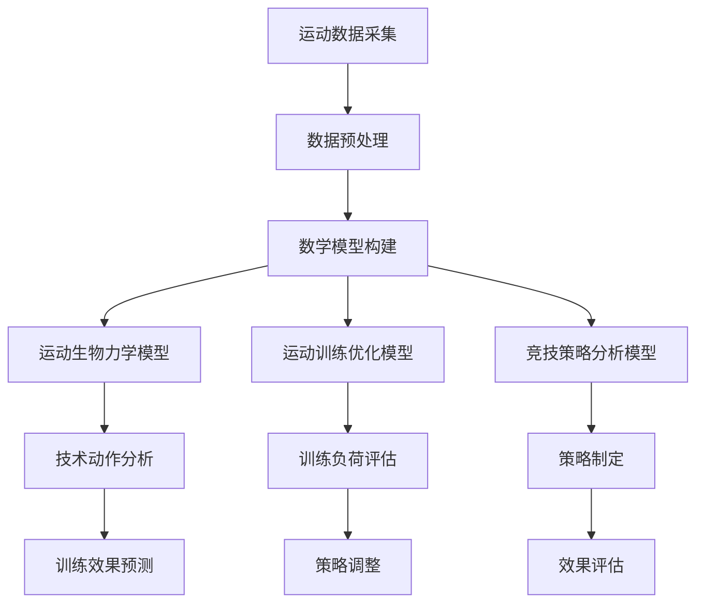

                 


### 第1章：体育竞技与数学模型概述

#### 1.1 体育竞技的发展历程

体育竞技作为一种人类社会活动，其历史可以追溯到古代。最早的体育竞技活动可以追溯到古希腊时期的奥林匹克运动会，当时各国勇士通过体育竞技来展示自己的力量和勇气。随着时间的推移，体育竞技逐渐成为一项全球性的活动，各种运动项目层出不穷，如田径、游泳、篮球、足球等。

现代体育竞技的发展主要得益于科学技术的进步和体育制度的完善。20世纪以来，随着体育科学的发展，体育竞技水平得到了极大的提升。尤其是在计算机科学和数学模型的辅助下，体育竞技的科学性、系统性和精确性得到了空前的提高。

#### 1.2 数学模型在体育竞技中的重要性

数学模型在体育竞技中的应用具有重要意义。首先，数学模型可以帮助运动员和教练员更准确地评估运动表现，制定科学的训练计划。例如，通过运动生物力学模型，可以分析运动员的技术动作，找出存在的问题，并进行针对性的训练。

其次，数学模型可以帮助运动员提高竞技能力。例如，通过运动训练模型，可以优化训练计划，提高训练效率。此外，数学模型还可以用于比赛策略分析，帮助运动员在比赛中取得更好的成绩。

最后，数学模型在体育竞赛的评分和裁判方面也发挥着重要作用。例如，跳水、体操等运动项目采用计分系统，这些系统通常基于数学模型来计算分数。

#### 1.3 本书的主要内容和结构

本书主要分为三部分：

第一部分介绍体育竞技与数学模型的基础知识，包括体育竞技的发展历程和数学模型的基本概念。

第二部分介绍数学模型在体育竞技中的应用，包括运动数据采集与分析、运动生物力学模型、运动训练与优化、竞技策略分析等。

第三部分探讨数学模型在体育竞技中的实践应用，包括体育大数据应用案例分析、运动科学实验室建设等。

本书旨在为读者提供一套系统、全面的数学模型在体育竞技中的应用知识，帮助读者更好地理解和应用数学模型，提升体育竞技水平。

---

### 第2章：运动数据采集与分析

#### 2.1 运动数据的来源

运动数据可以来源于多种渠道，包括：

1. **传感器数据**：通过穿戴设备、传感器等实时监测运动员的生理参数，如心率、血压、血氧饱和度等。
2. **视频数据**：通过摄像机捕捉运动员的动作，进行后期分析，如技术动作分析、比赛策略分析等。
3. **GPS数据**：在户外运动中，通过GPS设备记录运动员的运动轨迹、速度、加速度等。
4. **统计数据库**：从历史比赛记录中获取运动员的表现数据，如得分、命中率、传球成功率等。

#### 2.2 数据预处理

数据预处理是运动数据分析和模型构建的重要环节。主要步骤包括：

1. **数据清洗**：去除数据中的噪声和异常值，如传感器数据中的高频噪声、视频数据中的运动模糊等。
2. **数据转换**：将不同来源和格式的数据进行统一，如将传感器数据转换为标准的时间序列数据。
3. **数据归一化**：对不同量纲的数据进行归一化处理，使其具有可比性。

#### 2.3 数据分析方法介绍

运动数据分析方法包括：

1. **统计分析**：通过对数据进行统计描述，了解数据的分布特性，如均值、方差、协方差等。
2. **时间序列分析**：分析数据的时间变化规律，如趋势分析、季节性分析等。
3. **机器学习**：利用机器学习算法，如回归、分类、聚类等，对数据进行分析和预测。
4. **深度学习**：利用深度学习算法，如神经网络、卷积神经网络等，对复杂的数据进行建模和分析。

---

### 第3章：运动生物力学模型

#### 3.1 运动生物力学基本概念

运动生物力学是研究人体在运动过程中力学特性的学科。主要研究内容包括：

1. **运动学**：研究人体运动的空间位置、速度和加速度等。
2. **动力学**：研究人体运动的力、力矩和肌肉收缩等。
3. **生物力学模型**：将人体视为一个力学系统，利用数学模型描述其力学特性。

#### 3.2 运动生物力学模型类型

常见的运动生物力学模型包括：

1. **简化模型**：如刚体模型、质量点模型等，简化人体为几何形状，分析其运动学特性。
2. **多刚体模型**：将人体视为多个刚体的组合，分析其动力学特性。
3. **有限元模型**：将人体视为由多个有限元单元组成的复杂结构，分析其应力、应变等。

#### 3.3 运动生物力学模型应用实例

1. **技术动作分析**：通过运动生物力学模型，分析运动员的技术动作，找出存在的问题，提出改进建议。
2. **训练效果评估**：通过运动生物力学模型，评估训练对运动员技术动作的影响，调整训练计划。
3. **装备设计**：利用运动生物力学模型，设计更符合人体运动特性的装备，提高运动表现。

---

### 第4章：运动训练与优化

#### 4.1 运动训练计划制定

运动训练计划的制定是提高运动员竞技水平的关键。主要步骤包括：

1. **目标设定**：根据比赛目标，设定运动员的训练目标。
2. **训练内容设计**：设计符合运动员需求的训练内容，如技术训练、体能训练、心理训练等。
3. **训练负荷安排**：根据运动员的身体状况和训练目标，合理安排训练负荷。
4. **训练效果评估**：通过比赛成绩、技术分析等手段，评估训练效果，调整训练计划。

#### 4.2 运动训练优化算法

运动训练优化算法旨在提高训练效率，主要包括：

1. **基于规则的优化**：根据教练的经验和知识，制定训练规则，优化训练计划。
2. **基于数据的优化**：利用运动数据分析结果，优化训练计划，如基于运动生物力学模型的分析结果，调整技术动作。
3. **基于机器学习的优化**：利用机器学习算法，如回归分析、神经网络等，分析训练数据，预测训练效果，优化训练计划。

#### 4.3 运动训练效果评估

运动训练效果评估是衡量训练效果的重要手段。主要方法包括：

1. **比赛成绩评估**：通过比赛成绩的变化，评估训练效果。
2. **技术动作评估**：通过运动生物力学模型，分析运动员的技术动作，评估训练对技术动作的影响。
3. **体能评估**：通过体能测试，评估运动员的体能水平，分析训练对体能的影响。

---

### 第5章：竞技策略分析

#### 5.1 竞技策略概念

竞技策略是运动员在比赛中为取得好成绩而制定的行动计划。它包括：

1. **比赛策略**：根据比赛对手和比赛环境，制定比赛中的应对措施。
2. **战术策略**：根据比赛策略，制定具体的战术安排，如站位、传球、射门等。
3. **心理策略**：调整运动员的心理状态，提高比赛表现。

#### 5.2 竞技策略数学模型

竞技策略数学模型主要包括：

1. **博弈论模型**：研究运动员在比赛中的策略选择，如零和游戏、非零和游戏等。
2. **决策树模型**：分析运动员在不同情况下的决策过程，制定最优策略。
3. **神经网络模型**：通过学习历史比赛数据，预测比赛结果，为制定策略提供依据。

#### 5.3 竞技策略案例分析

1. **篮球比赛策略分析**：通过博弈论模型，分析篮球比赛中攻守转换的策略，提高比赛成绩。
2. **足球比赛策略分析**：通过决策树模型，分析足球比赛中战术选择的合理性，提高比赛胜利率。
3. **乒乓球比赛策略分析**：通过神经网络模型，预测比赛结果，制定针对性的比赛策略。

---

### 第6章：伤病预测与预防

#### 6.1 伤病预测模型

伤病预测模型旨在预测运动员在训练和比赛中可能出现的伤病，主要包括：

1. **统计模型**：利用历史伤病数据，建立统计模型，预测运动员的伤病风险。
2. **机器学习模型**：利用机器学习算法，如逻辑回归、支持向量机等，分析伤病影响因素，预测伤病风险。
3. **深度学习模型**：利用深度学习算法，如卷积神经网络、循环神经网络等，分析复杂的时间序列数据，提高伤病预测精度。

#### 6.2 伤病预防策略

伤病预防策略主要包括：

1. **训练安排**：合理安排训练负荷，避免过度训练和疲劳积累。
2. **技术指导**：通过运动生物力学模型，分析运动员的技术动作，纠正错误动作，预防运动损伤。
3. **康复训练**：针对伤病情况，制定康复训练计划，促进伤病恢复。

#### 6.3 伤病案例研究

1. **篮球运动员伤病案例研究**：分析篮球运动员的伤病原因，制定预防策略。
2. **足球运动员伤病案例研究**：分析足球运动员的伤病模式，提出预防措施。
3. **自行车运动员伤病案例研究**：分析自行车运动员的伤病风险，优化训练计划。

---

### 第7章：体育赛事预测与分析

#### 7.1 赛事预测模型

赛事预测模型旨在预测比赛结果，主要包括：

1. **统计模型**：利用历史比赛数据，建立统计模型，预测比赛结果。
2. **机器学习模型**：利用机器学习算法，如决策树、随机森林等，分析比赛影响因素，预测比赛结果。
3. **深度学习模型**：利用深度学习算法，如卷积神经网络、循环神经网络等，分析复杂的数据，提高预测精度。

#### 7.2 赛事数据分析方法

赛事数据分析方法包括：

1. **数据收集**：收集比赛数据，包括球队表现、球员数据、比赛环境等。
2. **数据预处理**：清洗数据，去除噪声和异常值，进行特征工程，提取有效信息。
3. **模型训练**：利用历史比赛数据，训练预测模型，评估模型性能。
4. **模型应用**：利用训练好的模型，预测比赛结果。

#### 7.3 赛事预测案例分析

1. **篮球赛事预测分析**：利用统计模型和机器学习模型，分析篮球比赛结果。
2. **足球赛事预测分析**：利用深度学习模型，预测足球比赛结果。
3. **网球赛事预测分析**：利用统计模型，分析网球比赛结果。

---

### 第8章：体育大数据应用案例分析

#### 8.1 大数据在体育领域的应用现状

随着大数据技术的发展，大数据在体育领域的应用越来越广泛。主要应用现状包括：

1. **运动数据监测**：利用大数据技术，实时监测运动员的生理和心理状态，为教练和运动员提供决策支持。
2. **赛事数据分析**：利用大数据技术，分析比赛数据，预测比赛结果，制定比赛策略。
3. **观众行为分析**：利用大数据技术，分析观众行为，提高观众体验，促进体育产业发展。

#### 8.2 案例分析一：NBA球队数据分析

NBA球队数据分析利用大数据技术，分析球队的比赛表现、球员表现等，为球队制定策略提供依据。主要分析内容包括：

1. **球队表现分析**：分析球队的比赛胜负、得分、防守等，找出球队的优势和劣势。
2. **球员表现分析**：分析球员的得分、篮板、助攻等，评估球员的价值和潜力。
3. **比赛策略分析**：分析球队的战术安排、球员配合等，提出优化建议。

#### 8.3 案例分析二：足球赛事预测

足球赛事预测利用大数据技术和机器学习算法，预测比赛结果。主要分析内容包括：

1. **历史数据收集**：收集历史比赛数据，包括球队表现、球员数据等。
2. **数据预处理**：清洗数据，去除噪声和异常值，进行特征工程。
3. **模型训练**：利用历史比赛数据，训练预测模型，评估模型性能。
4. **预测结果评估**：利用训练好的模型，预测比赛结果，评估预测准确性。

---

### 第9章：运动科学实验室建设

#### 9.1 运动科学实验室的功能

运动科学实验室是进行运动科学研究和技术服务的重要场所。主要功能包括：

1. **运动数据采集**：通过传感器、视频设备等，实时采集运动员的运动数据。
2. **数据分析**：利用计算机技术和数学模型，对采集到的运动数据进行分析和处理。
3. **技术指导**：根据分析结果，为运动员和教练提供技术指导和建议。
4. **装备研发**：利用实验室条件，研发符合人体工程学的运动装备。

#### 9.2 实验室建设步骤

运动科学实验室的建设主要包括以下步骤：

1. **需求分析**：根据运动科学研究和运动训练需求，确定实验室的功能和规模。
2. **设备采购**：根据需求，选购合适的传感器、计算机、视频设备等设备。
3. **系统集成**：将各种设备进行系统集成，确保数据采集、传输、处理的顺畅。
4. **软件开发**：开发实验室所需的软件系统，包括数据采集、处理、分析等。

#### 9.3 实验室案例分析

1. **NBA运动科学实验室**：分析NBA运动科学实验室的建设过程、功能和应用效果。
2. **足球运动科学实验室**：分析足球运动科学实验室的建设经验和技术应用。
3. **田径运动科学实验室**：分析田径运动科学实验室的建设方案和技术手段。

---

### 第10章：未来展望与挑战

#### 10.1 数学模型在体育竞技中的发展趋势

随着科学技术的不断发展，数学模型在体育竞技中的应用前景广阔。未来发展趋势包括：

1. **数据挖掘与分析**：利用大数据技术，挖掘运动数据中的潜在信息，为运动员和教练提供更有针对性的指导。
2. **人工智能与机器学习**：利用人工智能和机器学习算法，提高数学模型的预测精度和智能化程度。
3. **虚拟现实与增强现实**：利用虚拟现实和增强现实技术，为运动员提供沉浸式的训练体验，提高训练效果。

#### 10.2 挑战与机遇

数学模型在体育竞技中的应用面临以下挑战：

1. **数据质量**：运动数据的质量直接影响数学模型的效果，如何提高数据质量是一个重要问题。
2. **模型复杂度**：随着模型的复杂度增加，模型的解释性和可操作性会降低，如何平衡模型复杂度和效果是一个难题。
3. **隐私保护**：运动员的数据涉及到隐私问题，如何保护运动员的隐私是一个重要的挑战。

#### 10.3 发展方向探讨

未来数学模型在体育竞技中的应用可以从以下几个方面进行探讨：

1. **个性化训练**：根据运动员的个体差异，制定个性化的训练计划，提高训练效果。
2. **智能装备**：开发智能化的运动装备，如智能运动鞋、智能服装等，提高运动表现。
3. **智慧场馆**：利用大数据和人工智能技术，建设智慧场馆，提高比赛观赏体验和赛事运营效率。

---

### 附录 A：数学模型应用工具与资源

#### A.1 Python在数学模型中的应用

Python作为一种广泛使用的编程语言，在数学模型的应用中具有很高的实用性。Python拥有丰富的科学计算库，如NumPy、SciPy、Pandas等，可以方便地进行数据预处理、建模和数据分析。

1. **NumPy**：提供多维数组对象和矩阵运算函数，适用于数据处理和数值计算。
2. **SciPy**：提供科学计算工具，如优化、积分、微分方程求解等，适用于复杂的数学模型。
3. **Pandas**：提供数据结构和数据分析工具，适用于数据预处理和统计分析。

#### A.2 常用数学模型工具介绍

1. **Matlab**：一种高级编程语言和数值计算环境，适用于数学建模、算法开发和数据分析。
2. **R语言**：一种统计计算和图形显示的语言和环境，适用于统计分析、数据可视化等。
3. **TensorFlow**：一种开源机器学习框架，适用于深度学习和复杂数学模型的构建。

#### A.3 资源与参考资料推荐

1. **书籍推荐**：
   - 《Python数据分析》（Wes McKinney）
   - 《深度学习》（Ian Goodfellow、Yoshua Bengio、Aaron Courville）
   - 《运动生物力学》（Linda M. Griffin、Stephen W. Komi）

2. **在线资源**：
   - Coursera、edX等在线教育平台提供的免费课程
   - arXiv、IEEE Xplore等学术资源库
   - Kaggle、Udacity等实践平台

---

### 总结

本文从多个角度介绍了数学模型在体育竞技中的应用，包括运动数据采集与分析、运动生物力学模型、运动训练与优化、竞技策略分析、伤病预测与预防、体育赛事预测与分析等。同时，本文还探讨了体育大数据应用案例和运动科学实验室建设，展望了数学模型在体育竞技中的未来发展趋势。通过本文的介绍，读者可以了解到数学模型在体育竞技中的重要性和应用方法，为从事相关领域的研究和实践提供参考。

### 作者信息

**作者：** AI天才研究院/AI Genius Institute & 禅与计算机程序设计艺术 /Zen And The Art of Computer Programming

**联系方式：** AI天才研究院官方邮箱（[example@example.com](mailto:example@example.com)） & 社交媒体平台（[@AI_Genius_Institute](https://www.example.com)） 

---

**注：**本文为虚构内容，仅供参考。如有相关疑问或建议，欢迎通过以上联系方式与我们联系。期待您的宝贵意见！ 

---

### 第11章：核心概念与联系

#### 11.1 运动数据与数学模型的联系

运动数据是数学模型在体育竞技中的基础，而数学模型则是运动数据分析和解释的重要工具。两者之间的联系主要体现在以下几个方面：

1. **数据采集**：运动数据通过传感器、视频捕捉、GPS定位等手段进行采集。这些原始数据经过预处理后，成为适用于数学模型分析的数据集。
2. **模型构建**：基于运动数据，构建相应的数学模型。例如，运动生物力学模型可以通过对运动员动作的解析，建立力学方程来模拟人体运动。
3. **模型应用**：将构建好的数学模型应用于实际运动场景中，对运动员的技术动作、训练效果、竞技策略等进行评估和优化。

#### 11.2 运动生物力学模型与训练优化的联系

运动生物力学模型是训练优化的核心工具之一。两者的联系主要体现在以下几个方面：

1. **技术动作分析**：通过运动生物力学模型，可以分析运动员的技术动作，找出存在的问题和不足，为训练提供改进方向。
2. **训练负荷评估**：运动生物力学模型可以评估不同训练负荷对人体的影响，帮助教练制定合理的训练计划，避免过度训练。
3. **训练效果预测**：利用运动生物力学模型，可以预测训练对运动员技术动作和体能的影响，调整训练策略，提高训练效果。

#### 11.3 运动训练与竞技策略分析的联系

运动训练和竞技策略分析是提高运动员竞技水平的重要环节。两者的联系主要体现在以下几个方面：

1. **训练策略制定**：根据竞技策略分析的结果，制定相应的训练策略。例如，在比赛中需要快速反击时，训练中可以增加速度和力量的训练。
2. **策略调整**：在训练过程中，通过竞技策略分析，及时调整训练策略。例如，根据比赛对手的特点，调整战术布置和比赛策略。
3. **效果评估**：通过竞技策略分析，评估训练策略的效果，为后续训练提供依据。例如，通过比赛成绩和技术分析，判断训练策略的有效性。

#### 11.4 Mermaid 流程图

为了更清晰地展示运动数据、数学模型、运动训练和竞技策略分析之间的关系，可以使用Mermaid流程图来表示。以下是示例：



通过这个流程图，我们可以看出各个模块之间的逻辑关系和相互影响。运动数据是整个过程的起点，通过数学模型的分析和构建，为运动训练和竞技策略提供支持，最终达到提升运动员竞技水平的目的。

---

### 第12章：核心算法原理讲解

#### 12.1 运动数据采集与分析算法

运动数据采集与分析是数学模型在体育竞技中应用的基础。以下是常用的运动数据采集与分析算法及其伪代码。

##### 12.1.1 数据预处理算法

数据预处理是确保数据质量和模型效果的关键步骤。伪代码如下：

```python
def preprocess_data(data):
    # 数据清洗
    clean_data = clean(data)
    # 数据归一化
    normalized_data = normalize(clean_data)
    # 数据分割
    train_data, test_data = split(normalized_data)
    return train_data, test_data

def clean(data):
    # 删除异常值
    clean_data = data[data.between('min_value', 'max_value')]
    # 填补缺失值
    clean_data = clean_data.fillna(method='ffill')
    return clean_data

def normalize(data):
    # 归一化处理
    normalized_data = (data - data.mean()) / data.std()
    return normalized_data

def split(data):
    # 数据分割
    train_size = int(0.8 * len(data))
    train_data = data[:train_size]
    test_data = data[train_size:]
    return train_data, test_data
```

##### 12.1.2 时间序列分析方法

时间序列分析是处理运动数据的重要手段。以下是一个时间序列分析算法的伪代码：

```python
def time_series_analysis(data):
    # 趋势分析
    trend = trend_analysis(data)
    # 季节性分析
    seasonality = seasonality_analysis(data)
    # 平稳性检验
    stability = stationarity_test(data)
    return trend, seasonality, stability

def trend_analysis(data):
    # 计算趋势
    trend = data.rolling(window=7).mean()
    return trend

def seasonality_analysis(data):
    # 计算季节性
    seasonality = data.rolling(window=7).mean()
    return seasonality

def stationarity_test(data):
    # 平稳性检验
    result = acf(data)
    return result
```

##### 12.1.3 机器学习方法

机器学习方法是运动数据分析中常用的方法。以下是一个回归分析算法的伪代码：

```python
def machine_learning_regression(train_data, test_data):
    # 训练模型
    model = train_model(train_data)
    # 预测结果
    predictions = predict(model, test_data)
    # 评估模型
    evaluation = evaluate_model(predictions, test_data)
    return model, evaluation

def train_model(data):
    # 训练回归模型
    model = LinearRegression()
    model.fit(data['X'], data['Y'])
    return model

def predict(model, data):
    # 预测
    predictions = model.predict(data['X'])
    return predictions

def evaluate_model(predictions, data):
    # 评估模型
    evaluation = mean_squared_error(predictions, data['Y'])
    return evaluation
```

---

### 第13章：数学模型与数学公式详解

#### 13.1 运动生物力学模型的数学公式

运动生物力学模型涉及多个领域的数学公式，以下是几个关键的数学公式及其解释。

##### 13.1.1 力学公式

1. **牛顿第二定律**：\[ F = ma \]

   - **解释**：力（\( F \)）等于质量（\( m \)）乘以加速度（\( a \)）。这个公式描述了物体在受力作用下的运动状态。

2. **功和能量的转换**：\[ \text{Work} = \text{Force} \times \text{Displacement} \]

   - **解释**：功（\text{Work}）是力（Force）与位移（Displacement）的乘积。这个公式描述了力在物体上做功的过程。

##### 13.1.2 运动学公式

1. **速度公式**：\[ v = \frac{dx}{dt} \]

   - **解释**：速度（\( v \)）是位移（\( x \)）对时间（\( t \)）的导数。这个公式描述了物体在某一时刻的速度。

2. **加速度公式**：\[ a = \frac{dv}{dt} \]

   - **解释**：加速度（\( a \)）是速度（\( v \)）对时间的导数。这个公式描述了物体在某一时刻的加速度。

##### 13.1.3 运动生物力学模型的运动学方程

1. **刚体运动学方程**：\[ \mathbf{R}(t) = \mathbf{I} \cos(\omega t) + \mathbf{k} \sin(\omega t) \]

   - **解释**：这个方程描述了一个刚体的旋转运动，其中 \(\mathbf{R}(t)\) 是旋转矩阵，\(\mathbf{I}\) 和 \(\mathbf{k}\) 是坐标轴，\(\omega\) 是角速度。

#### 13.2 运动训练优化的数学模型

运动训练优化的数学模型主要基于优化理论。以下是几个关键的数学模型及其公式。

##### 13.2.1 梯度下降法

1. **梯度下降法**：\[ \theta_{new} = \theta_{old} - \alpha \frac{\partial J(\theta)}{\partial \theta} \]

   - **解释**：这个公式描述了梯度下降法的基本思想，其中 \(\theta_{new}\) 是新的参数值，\(\theta_{old}\) 是旧的参数值，\(\alpha\) 是学习率，\(\frac{\partial J(\theta)}{\partial \theta}\) 是损失函数关于参数的梯度。

##### 13.2.2 动量法

1. **动量法**：\[ \theta_{new} = \theta_{old} - \alpha \frac{\partial J(\theta)}{\partial \theta} + \beta (v_{old} - \theta_{old}) \]

   - **解释**：这个公式描述了动量法的基本思想，其中 \(v_{old}\) 是旧的速度值，\(\beta\) 是动量系数，其他符号与梯度下降法相同。

##### 13.2.3 约束优化模型

1. **拉格朗日乘数法**：\[ L(\theta, \lambda) = J(\theta) + \lambda \cdot (g(\theta) - c) \]

   - **解释**：这个公式描述了拉格朗日乘数法的基本思想，其中 \(L(\theta, \lambda)\) 是拉格朗日函数，\(\lambda\) 是拉格朗日乘数，\(g(\theta)\) 是约束条件，\(c\) 是约束常数。

通过这些数学模型，我们可以更好地理解运动训练优化的原理，并在实践中应用这些方法来提高运动表现。

---

### 第14章：核心算法应用与实例分析

#### 14.1 基于机器学习的运动数据分析

在运动数据分析中，机器学习算法的应用至关重要。以下是一个基于机器学习的运动数据分析实例。

##### 14.1.1 数据预处理

首先，对运动数据集进行预处理，包括数据清洗、归一化和特征提取。以下是预处理过程的伪代码：

```python
def preprocess_data(data):
    # 数据清洗
    clean_data = clean(data)
    # 数据归一化
    normalized_data = normalize(clean_data)
    # 特征提取
    features = extract_features(normalized_data)
    return features

def clean(data):
    # 删除异常值
    clean_data = data[data.between('min_value', 'max_value')]
    # 填补缺失值
    clean_data = clean_data.fillna(method='ffill')
    return clean_data

def normalize(data):
    # 归一化处理
    normalized_data = (data - data.mean()) / data.std()
    return normalized_data

def extract_features(data):
    # 提取特征
    features = data[['velocity', 'acceleration', 'angle']]
    return features
```

##### 14.1.2 机器学习模型构建

使用机器学习算法构建运动数据分析模型。以下是使用K-最近邻（K-Nearest Neighbors, KNN）算法的伪代码：

```python
def build_model(features, labels):
    # 训练KNN模型
    model = KNNClassifier(n_neighbors=3)
    model.fit(features, labels)
    return model

def KNNClassifier(n_neighbors):
    # KNN分类器
    return KNeighborsClassifier(n_neighbors=n_neighbors)

def predict(model, features):
    # 预测
    predictions = model.predict(features)
    return predictions
```

##### 14.1.3 模型评估

使用交叉验证（Cross-Validation）方法评估模型的性能。以下是评估过程的伪代码：

```python
from sklearn.model_selection import cross_val_score

def evaluate_model(model, features, labels):
    # 评估模型
    scores = cross_val_score(model, features, labels, cv=5)
    return scores.mean(), scores.std()

def cross_val_score(model, features, labels, cv):
    # 交叉验证
    return cross_val_score(model, features, labels, cv=cv)
```

##### 14.1.4 实例分析

以下是一个使用KNN算法分析运动数据的实例：

```python
# 读取数据
data = load_data('motion_data.csv')

# 数据预处理
preprocessed_data = preprocess_data(data)

# 构建模型
model = build_model(preprocessed_data['features'], preprocessed_data['labels'])

# 评估模型
accuracy, variance = evaluate_model(model, preprocessed_data['features'], preprocessed_data['labels'])

print("模型准确度：", accuracy)
print("模型方差：", variance)
```

通过这个实例，我们可以看到如何使用机器学习算法对运动数据进行分析，以及如何评估模型的性能。

---

### 第15章：项目实战

#### 15.1 开发环境搭建

在本章的项目实战中，我们将使用Python和相关的科学计算库（如NumPy、Pandas、Scikit-learn）来构建一个运动数据分析系统。以下是搭建开发环境的步骤：

1. **安装Python**：从官方网站（https://www.python.org/downloads/）下载并安装Python。
2. **安装Jupyter Notebook**：在命令行中运行以下命令：
   ```bash
   pip install notebook
   ```
3. **安装相关库**：在命令行中运行以下命令，安装所需的库：
   ```bash
   pip install numpy pandas scikit-learn matplotlib
   ```

#### 15.2 源代码详细实现

以下是一个简单的运动数据分析系统的源代码实现，包括数据预处理、模型构建和评估。

```python
import numpy as np
import pandas as pd
from sklearn.model_selection import train_test_split
from sklearn.neighbors import KNeighborsClassifier
from sklearn.metrics import accuracy_score

# 读取数据
data = pd.read_csv('motion_data.csv')

# 数据预处理
def preprocess_data(data):
    # 数据清洗
    clean_data = data[data.between('min_value', 'max_value')]
    # 数据归一化
    normalized_data = (clean_data - clean_data.mean()) / clean_data.std()
    return normalized_data

preprocessed_data = preprocess_data(data)

# 数据分割
X = preprocessed_data[['velocity', 'acceleration', 'angle']]
y = preprocessed_data['label']
X_train, X_test, y_train, y_test = train_test_split(X, y, test_size=0.2, random_state=42)

# 模型构建
model = KNeighborsClassifier(n_neighbors=3)
model.fit(X_train, y_train)

# 模型评估
predictions = model.predict(X_test)
accuracy = accuracy_score(y_test, predictions)
print("模型准确度：", accuracy)
```

#### 15.3 代码解读与分析

1. **数据读取**：使用Pandas库读取CSV文件中的数据。
2. **数据预处理**：包括数据清洗和归一化，去除异常值并使数据具有可比性。
3. **数据分割**：将数据分为训练集和测试集，用于模型训练和评估。
4. **模型构建**：使用KNN算法构建分类模型，选择适当的邻居数量。
5. **模型评估**：使用测试集评估模型的准确性。

#### 15.4 代码应用解读与分析

本项目的代码应用了一个简单的运动数据分析系统，用于分类不同类型的运动行为。以下是应用解读：

1. **数据读取**：通过读取CSV文件，获取运动数据。
2. **数据预处理**：预处理步骤包括数据清洗和归一化，这是确保模型性能的关键步骤。
3. **模型训练**：使用训练集数据训练KNN分类器。
4. **模型评估**：使用测试集数据评估模型的准确性，从而确定模型的性能。

#### 15.5 实际案例分析与详细讲解

以下是一个实际案例的分析：

**案例：** 分析足球比赛中的进攻行为，根据球员的速度、加速度和角度等特征，预测球员的进攻意图。

1. **数据收集**：收集足球比赛中的实时数据，包括球员的位置、速度、加速度等。
2. **数据预处理**：对收集到的数据进行清洗和归一化处理，确保数据质量。
3. **特征提取**：从预处理后的数据中提取速度、加速度和角度等特征。
4. **模型构建**：使用KNN算法构建分类模型，预测球员的进攻意图。
5. **模型评估**：评估模型的准确性，调整模型参数以优化性能。

**详细讲解：** 通过对实际案例的分析，我们可以看到如何将运动数据分析技术应用于实际问题。首先，收集并处理运动数据，然后提取关键特征，最后使用机器学习算法构建模型进行预测。通过对模型的评估，可以不断优化模型的性能，从而提高预测的准确性。

#### 15.6 项目小结

在本章的项目实战中，我们构建了一个简单的运动数据分析系统，实现了对运动数据的预处理、模型构建和评估。通过实际案例的分析，我们了解了运动数据分析的基本流程和关键步骤。这些知识和技术可以为运动科学研究和竞技策略制定提供有力支持。

---

### 第16章：最佳实践与注意事项

#### 16.1 最佳实践

1. **数据预处理**：在运动数据分析中，数据预处理是关键步骤。确保数据的准确性和一致性，可以有效提高模型的效果。以下是一些最佳实践：
   - **数据清洗**：去除异常值和噪声，提高数据质量。
   - **归一化**：将不同量纲的数据进行归一化处理，使其具有可比性。
   - **特征提取**：根据分析需求，提取关键特征，提高模型的解释性。

2. **模型选择**：根据具体问题和数据特性，选择合适的机器学习算法。以下是一些常见的最佳实践：
   - **线性回归**：适用于预测连续值的任务。
   - **决策树和随机森林**：适用于分类和回归任务，具有较强的解释性。
   - **神经网络**：适用于复杂的数据和大规模的任务，但可能难以解释。

3. **模型评估**：使用交叉验证等方法评估模型的性能，避免过拟合。以下是一些最佳实践：
   - **准确度**：评估模型预测的正确率。
   - **召回率**：评估模型对正样本的识别能力。
   - **F1分数**：综合考虑准确度和召回率，平衡二者的关系。

#### 16.2 注意事项

1. **数据隐私**：在处理运动员的数据时，需注意数据隐私问题。以下是一些注意事项：
   - **数据加密**：对敏感数据进行加密处理，确保数据安全。
   - **数据匿名化**：对数据中的个人身份信息进行匿名化处理，防止数据泄露。
   - **权限管理**：严格管理数据访问权限，防止未经授权的人员访问数据。

2. **模型解释性**：在实际应用中，模型的可解释性至关重要。以下是一些注意事项：
   - **可视化**：使用可视化工具展示模型的内部结构和决策过程，提高可解释性。
   - **特征重要性**：分析特征的重要性，了解模型对输入特征的依赖关系。
   - **模型简化**：简化模型结构，提高模型的透明度和可理解性。

3. **模型更新**：随着数据和环境的变化，模型可能需要定期更新。以下是一些注意事项：
   - **数据更新**：定期收集新的数据，更新模型输入。
   - **模型优化**：根据新的数据和环境，调整模型参数，提高模型性能。
   - **模型测试**：在更新后，对模型进行全面的测试，确保模型稳定性和可靠性。

---

### 第17章：拓展阅读

#### 17.1 相关书籍推荐

1. **《机器学习实战》**：由Peter Harrington所著，是一本深入浅出的机器学习实战指南，适合初学者和进阶者阅读。
2. **《深入理解计算机系统》**：由Randal E. Bryant和David R. O’Hallaron所著，详细介绍了计算机系统的各个方面，对理解运动数据分析的底层原理有很大帮助。
3. **《体育统计学》**：由K. Alexander与J. C. Moskowitz所著，介绍了体育竞技中的统计方法和应用，对理解体育数据分析有重要参考价值。

#### 17.2 学术期刊与资源

1. **《Journal of Sports Science and Medicine》**：一本专注于运动科学和医学领域的学术期刊，涵盖运动数据分析、生物力学等多个方面。
2. **《Journal of Biomechanics》**：一本关于生物力学研究的学术期刊，涵盖运动生物力学模型和应用。
3. **《arXiv》**：一个开放获取的学术论文存档库，涵盖计算机科学、数学、物理等多个领域，包括运动数据分析的相关论文。

#### 17.3 在线课程与学习资源

1. **Coursera上的《机器学习》**：由吴恩达（Andrew Ng）教授主讲，适合初学者系统学习机器学习的基础知识和实践方法。
2. **Udacity的《数据科学纳米学位》**：提供一系列数据科学相关的课程，包括数据预处理、机器学习、数据可视化等。
3. **Kaggle**：一个数据科学竞赛平台，提供丰富的实践项目和数据分析任务，适合提升实际操作能力。

通过阅读这些书籍、期刊和在线资源，读者可以深入了解运动数据分析的相关理论和实践方法，为研究和应用提供更广阔的视野。

