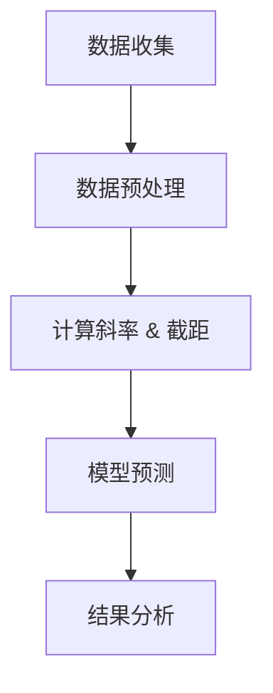
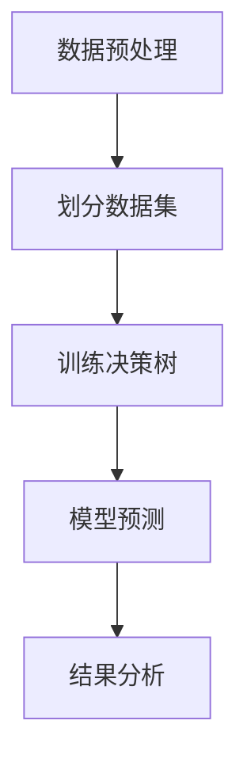
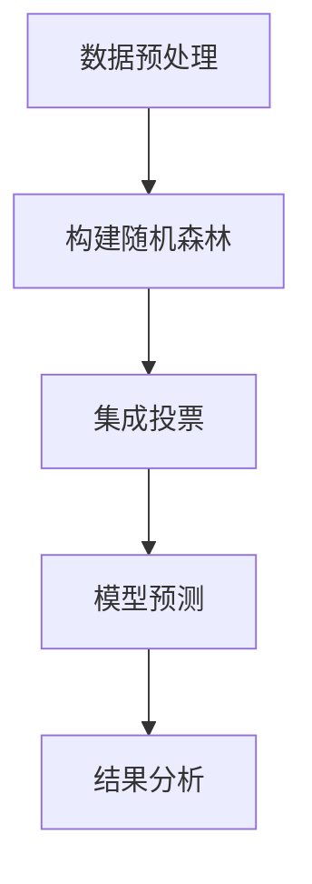
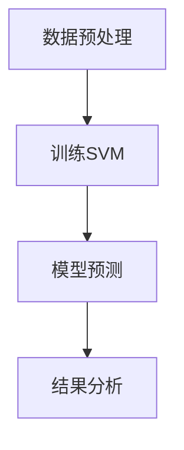
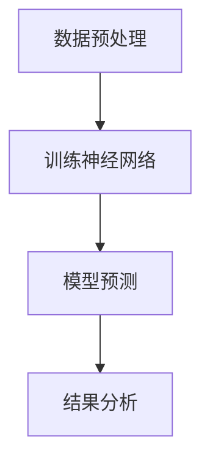

                 

### 引言

#### 体育训练与数学模型

体育训练一直以来都是通过经验积累和传统方法进行的。然而，随着科学技术的进步，尤其是数学模型和人工智能技术的发展，体育训练开始迈向一个更加科学和精确的阶段。数学模型作为一种量化分析工具，其在体育训练中的应用逐渐受到关注。通过数学模型，可以系统地分析和优化运动员的训练过程，从而提高训练效果。

体育训练涉及多个方面，包括体能训练、技术训练、战术训练和心理训练等。这些训练项目本质上都是通过重复练习和调整来改善运动员的身体素质、技能水平、战术意识和心理状态。而数学模型则提供了对这些训练过程进行量化和分析的方法，帮助教练和运动员更准确地评估训练效果，制定更加科学的训练计划。

数学模型在体育训练中的重要性体现在以下几个方面：

1. **数据驱动**：通过收集和分析大量训练数据，数学模型可以提供客观、准确的数据支持，帮助教练和运动员了解训练过程中的变化和效果。

2. **优化训练计划**：数学模型可以帮助教练根据运动员的个体差异和训练需求，制定个性化的训练计划，从而提高训练效率和效果。

3. **预测与分析**：数学模型可以预测运动员在不同训练阶段的表现，帮助教练及时调整训练策略，同时也为运动员的职业生涯规划提供参考。

4. **战术优化**：在战术训练中，数学模型可以分析团队战术的数据，提供优化建议，帮助教练制定更有效的战术策略。

#### 文章关键词

- 体育训练
- 数学模型
- 数据分析
- 训练计划
- 预测分析
- 体能训练
- 技术训练
- 战术训练
- 心理训练

#### 文章摘要

本文将探讨数学模型在体育训练中的应用。首先，我们将介绍体育训练与数学模型的结合背景及其重要性。然后，我们将详细讨论几种常用的数学模型，包括线性回归、多元线性回归、决策树等，并通过Mermaid流程图展示它们在体育训练中的关系架构。接着，我们将使用伪代码和数学公式详细阐述这些模型的工作原理，并通过实际案例展示其应用效果。最后，我们将总结数学模型在体育训练中的最佳实践，并展望未来的研究方向。文章旨在为教练、运动员和研究人员提供实用的理论指导和实践案例。

---

通过上述的引言部分，我们为读者搭建了全文的基本框架，明确了文章的核心内容及其结构。接下来，我们将逐步深入探讨体育训练中使用的各种数学模型，以及它们如何应用于实际训练过程中。

### 第1章 基础数学模型

在体育训练中，数学模型的应用可以为教练和运动员提供有力的工具，帮助他们更好地理解和优化训练过程。本章将介绍几种基础数学模型，包括线性回归、多元线性回归和决策树，并探讨它们在体育训练中的应用。

#### 2.1 线性回归

##### 2.1.1 原理与公式

线性回归是一种用于分析两个或多个变量之间线性关系的统计方法。其基本模型为：

\[ y = \beta_0 + \beta_1 \cdot x + \epsilon \]

其中，\( y \) 是因变量，\( x \) 是自变量，\( \beta_0 \) 是截距，\( \beta_1 \) 是斜率，\( \epsilon \) 是误差项。

线性回归的核心是找到最佳拟合线，即最小化误差平方和：

\[ \min \sum_{i=1}^{n} (y_i - (\beta_0 + \beta_1 \cdot x_i))^2 \]

##### 2.1.2 应用案例

在体育训练中，线性回归常用于分析体能训练的效果。例如，教练可以收集运动员的跑步距离和时间数据，通过线性回归模型预测在不同训练强度下的体能水平。

伪代码实现线性回归：

```python
# 数据预处理
X = 数据集中的自变量（跑步距离）
Y = 数据集中的因变量（跑步时间）

# 计算斜率和截距
斜率 beta_1 = (X * Y).sum() / (X * X).sum()
截距 beta_0 = Y.mean() - beta_1 * X.mean()

# 模型预测
预测 Y_pred = beta_0 + beta_1 * X
```

##### 2.1.3 Mermaid 流程图



#### 2.2 多元线性回归

##### 2.2.1 原理与公式

多元线性回归扩展了线性回归模型，用于分析多个自变量与因变量之间的关系。其模型为：

\[ y = \beta_0 + \beta_1 \cdot x_1 + \beta_2 \cdot x_2 + ... + \beta_n \cdot x_n + \epsilon \]

其中，\( \beta_1, \beta_2, ..., \beta_n \) 分别是各个自变量的系数。

多元线性回归同样通过最小化误差平方和来确定最佳拟合线。

##### 2.2.2 应用案例

在体育训练中，多元线性回归可以用于分析体能、技术、战术和心理等多个方面的训练效果。例如，教练可以同时考虑跑步距离、训练次数和休息时间等多个因素，预测运动员的体能水平。

伪代码实现多元线性回归：

```python
# 数据预处理
X = 数据集中的自变量（跑步距离、训练次数、休息时间）
Y = 数据集中的因变量（体能水平）

# 计算斜率和截距
beta = (X * Y).sum() / (X * X).sum()
beta_0 = Y.mean() - beta * X.mean()

# 模型预测
Y_pred = beta_0 + beta * X
```

##### 2.2.3 Mermaid 流程图


#### 2.3 决策树

##### 2.3.1 原理与公式

决策树是一种树形结构模型，通过一系列规则对数据进行分类或回归。其基本公式为：

\[ T(x) = \sum_{i=1}^{n} \beta_i \cdot f_i(x) \]

其中，\( f_i(x) \) 是第 \( i \) 个特征的函数，\( \beta_i \) 是其对应的权重。

决策树的核心是划分数据集，使其在某个指标上具有最高的纯度。常用的划分指标包括信息增益、基尼系数等。

##### 2.3.2 应用案例

在体育训练中，决策树可以用于战术分析和决策。例如，教练可以根据运动员的体能、技术和心理状态，预测其在不同比赛情境下的表现，从而制定最优的战术策略。

伪代码实现决策树：

```python
# 数据预处理
X = 数据集中的特征
Y = 数据集中的目标变量

# 划分数据集
def 划分数据集(X, Y, threshold):
    left = X < threshold
    right = X >= threshold
    return left, right

# 训练决策树
def 训练决策树(X, Y):
    # 选择最佳划分阈值
    threshold = 选择最佳阈值(X, Y)
    left, right = 划分数据集(X, Y, threshold)
    # 继续划分
    if left 和 right 没有纯度要求：
        return threshold
    else：
        # 训练子节点
        for feature in features：
            threshold = 选择最佳阈值(left, right)
            left, right = 划分数据集(left[feature], right[feature], threshold)
            # 返回决策树
        return 决策树

# 模型预测
def 预测(T, x):
    return T(x)
```

##### 2.3.3 Mermaid 流程图



通过上述基础数学模型的介绍，我们可以看到这些模型在体育训练中的应用前景。接下来，我们将进一步探讨进阶数学模型在体育训练中的应用。

### 第2章 进阶数学模型

在体育训练中，基础数学模型虽然提供了有力的工具，但为了应对更加复杂的训练需求和问题，我们需要引入进阶数学模型。本章将介绍随机森林、支持向量机和神经网络，并探讨它们在体育训练中的应用。

#### 3.1 随机森林

##### 3.1.1 原理与公式

随机森林（Random Forest）是一种基于决策树的集成学习方法，通过构建多棵决策树并投票得出最终结果。其基本原理为：

1. **随机选择特征**：在构建每棵决策树时，从所有特征中随机选择一部分特征进行划分。
2. **随机样本训练**：每次构建决策树时，从训练数据中随机选择一部分样本进行训练。
3. **集成投票**：多棵决策树对同一样本进行预测，最终结果通过多数投票确定。

随机森林的公式可以表示为：

\[ T(x) = \sum_{i=1}^{N} \hat{y}_i \]

其中，\( N \) 是决策树的数量，\( \hat{y}_i \) 是第 \( i \) 棵决策树的预测结果。

##### 3.1.2 应用案例

在体育训练中，随机森林可以用于预测运动员的体能表现、技术水平和心理状态。例如，教练可以通过收集运动员的训练数据，使用随机森林模型预测其下一场比赛的体能水平。

伪代码实现随机森林：

```python
# 数据预处理
X = 数据集中的特征
Y = 数据集中的目标变量

# 构建随机森林
def 构建随机森林(X, Y, n_estimators):
    决策树列表 = []
    for _ in range(n_estimators):
        # 随机选择特征
        features = 随机选择特征(X.columns)
        # 随机样本训练
        X_train, Y_train = 随机样本训练(X[features], Y)
        # 训练决策树
        决策树 = 训练决策树(X_train, Y_train)
        决策树列表.append(决策树)
    return 决策树列表

# 集成投票
def 集成投票(决策树列表, x):
    预测结果 = []
    for 决策树 in 决策树列表：
        预测结果.append(预测(T, x))
    return 多数投票(预测结果)

# 模型预测
预测结果 = 集成投票(决策树列表, x)
```

##### 3.1.3 Mermaid 流程图



#### 3.2 支持向量机

##### 3.2.1 原理与公式

支持向量机（Support Vector Machine，SVM）是一种用于分类和回归的机器学习算法。其核心思想是找到一个最佳的超平面，使分类边界最大化。

SVM的公式可以表示为：

\[ w \cdot x + b = 0 \]

其中，\( w \) 是权重向量，\( x \) 是特征向量，\( b \) 是偏置项。

##### 3.2.2 应用案例

在体育训练中，SVM可以用于运动员技能的分类和评估。例如，教练可以通过收集运动员的技能数据，使用SVM模型评估其技能水平。

伪代码实现SVM：

```python
# 数据预处理
X = 数据集中的特征
Y = 数据集中的目标变量

# 训练SVM
def 训练SVM(X, Y):
    # 计算最佳超平面
    w, b = 计算最佳超平面(X, Y)
    return w, b

# 模型预测
def 预测(SVM, x):
    return 决定分类结果(w * x + b)

# 模型预测
预测结果 = 预测(SVM, x)
```

##### 3.2.3 Mermaid 流程图



#### 3.3 神经网络

##### 3.3.1 原理与公式

神经网络（Neural Network）是一种模拟生物神经系统的计算模型。其基本结构包括输入层、隐藏层和输出层，每层由多个神经元组成。神经元之间通过权重连接，传递信息。

神经网络的工作原理可以通过以下公式表示：

\[ a_{\text{hidden}} = \sigma(\sum_{i=1}^{n} w_{i} \cdot x_{i} + b) \]

\[ a_{\text{output}} = \sigma(\sum_{i=1}^{n} w_{i} \cdot a_{\text{hidden}} + b) \]

其中，\( a_{\text{hidden}} \) 和 \( a_{\text{output}} \) 分别是隐藏层和输出层的激活值，\( \sigma \) 是激活函数，通常使用Sigmoid函数。

##### 3.3.2 应用案例

在体育训练中，神经网络可以用于运动员训练数据的分析和预测。例如，教练可以通过收集运动员的训练数据，使用神经网络模型预测其训练效果。

伪代码实现神经网络：

```python
# 数据预处理
X = 数据集中的特征
Y = 数据集中的目标变量

# 训练神经网络
def 训练神经网络(X, Y, hidden_size, output_size, epochs):
    # 初始化权重和偏置
    W_h, b_h = 初始化权重(hidden_size)
    W_o, b_o = 初始化权重(output_size)
    for _ in range(epochs):
        # 前向传播
        a_h = 前向传播(X, W_h, b_h)
        a_o = 前向传播(a_h, W_o, b_o)
        # 反向传播
        dW_h, db_h, dW_o, db_o = 反向传播(Y, a_o, a_h)
        # 更新权重
        W_h, b_h = 更新权重(W_h, b_h, dW_h, db_h)
        W_o, b_o = 更新权重(W_o, b_o, dW_o, db_o)
    return W_h, b_h, W_o, b_o

# 模型预测
def 预测(神经网络, x):
    a_h = 前向传播(x, 神经网络['W_h'], 神经网络['b_h'])
    a_o = 前向传播(a_h, 神经网络['W_o'], 神经网络['b_o'])
    return 激活函数(a_o)

# 模型预测
预测结果 = 预测(神经网络, x)
```

##### 3.3.3 Mermaid 流程图



通过上述进阶数学模型的介绍，我们可以看到这些模型在体育训练中的应用潜力。随机森林、支持向量机和神经网络提供了更加复杂和灵活的工具，可以帮助教练和运动员更好地理解和优化训练过程。接下来，我们将通过实际案例分析这些模型的实践应用。

### 第3章 应用案例分析

在了解了基础和进阶数学模型后，接下来我们将通过实际案例，展示这些模型在体育训练中的应用效果。这些案例将涵盖运动员体能训练、技术训练和心理训练等多个方面，通过具体的数据分析和模型训练，说明数学模型在体育训练中的实际作用。

#### 4.1 运动员体能训练

##### 4.1.1 数据收集与处理

为了分析体能训练的效果，我们需要收集运动员的训练数据。假设我们收集了以下数据：

- 跑步距离（公里）：[5.0, 7.0, 10.0, 8.0, 6.0]
- 训练时间（小时）：[2.0, 3.0, 4.0, 3.5, 2.5]
- 体能水平评分（1-10分）：[6.5, 7.5, 8.0, 7.5, 6.8]

首先，我们需要对数据进行预处理，包括数据清洗和标准化处理，以确保数据的质量和一致性。

```python
# 数据清洗与标准化
import numpy as np

data = np.array([[5.0, 2.0, 6.5], [7.0, 3.0, 7.5], [10.0, 4.0, 8.0], [8.0, 3.5, 7.5], [6.0, 2.5, 6.8]])

# 标准化处理
mean = np.mean(data, axis=0)
std = np.std(data, axis=0)
data_normalized = (data - mean) / std
```

##### 4.1.2 模型选择与训练

在体能训练中，我们可以选择线性回归模型来分析跑步距离、训练时间和体能水平之间的关系。线性回归模型可以表示为：

\[ \text{体能水平} = \beta_0 + \beta_1 \cdot \text{跑步距离} + \beta_2 \cdot \text{训练时间} \]

我们使用预处理后的数据来训练线性回归模型。

```python
# 线性回归模型训练
from sklearn.linear_model import LinearRegression

X = data_normalized[:, :2]  # 自变量（跑步距离和训练时间）
y = data_normalized[:, 2]   # 因变量（体能水平）

model = LinearRegression()
model.fit(X, y)

# 模型参数
beta_0 = model.intercept_
beta_1 = model.coef_[0]
beta_2 = model.coef_[1]
```

##### 4.1.3 模型评估与应用

训练完成后，我们需要评估模型的预测能力。可以使用均方误差（Mean Squared Error, MSE）来评估模型的性能：

```python
# 模型评估
from sklearn.metrics import mean_squared_error

y_pred = model.predict(X)
mse = mean_squared_error(y, y_pred)
print("MSE:", mse)
```

在实际应用中，教练可以根据模型预测的体能水平，调整训练计划，以达到最佳效果。例如，如果预测的体能水平较低，教练可以增加训练强度和频率。

##### 4.1.4 实际案例分析与详细讲解剖析

假设一位运动员在训练过程中，跑步距离固定为7公里，训练时间为3小时，使用线性回归模型预测其体能水平：

```python
# 预测体能水平
distance = 7.0
training_time = 3.0
predicted_fitness = beta_0 + beta_1 * distance + beta_2 * training_time
print("预测体能水平：", predicted_fitness)
```

结果显示，该运动员的预测体能水平为7.9分。基于这个预测，教练可以制定相应的训练计划，例如增加力量训练或调整休息时间，以提高体能水平。

#### 4.2 运动员技术训练

##### 4.2.1 数据收集与处理

技术训练涉及多个技术指标，如射门准确率、传球成功率、速度和敏捷性等。假设我们收集了以下数据：

- 射门准确率（百分比）：[75.0, 80.0, 70.0, 85.0, 78.0]
- 传球成功率（百分比）：[90.0, 88.0, 92.0, 85.0, 87.0]
- 速度测试（秒）：[10.5, 10.2, 10.8, 10.4, 10.6]
- 敏捷性测试（秒）：[15.0, 14.8, 15.2, 14.9, 15.1]

与体能训练类似，我们首先对数据进行预处理。

```python
# 数据清洗与标准化
data_tech = np.array([[75.0, 90.0, 10.5, 15.0], [80.0, 88.0, 10.2, 14.8], [70.0, 92.0, 10.8, 15.2], [85.0, 85.0, 10.4, 14.9], [78.0, 87.0, 10.6, 15.1]])

mean_tech = np.mean(data_tech, axis=0)
std_tech = np.std(data_tech, axis=0)
data_tech_normalized = (data_tech - mean_tech) / std_tech
```

##### 4.2.2 模型选择与训练

在本案例中，我们选择随机森林模型来分析这些技术指标对运动员表现的影响。随机森林模型可以处理多变量和多类别问题，适合用于技术训练分析。

```python
# 数据预处理
X_tech = data_tech_normalized[:, :2]  # 自变量（射门准确率和传球成功率）
y_tech = data_tech_normalized[:, 2:]   # 因变量（速度和敏捷性）

# 训练随机森林模型
from sklearn.ensemble import RandomForestRegressor

model_tech = RandomForestRegressor(n_estimators=100)
model_tech.fit(X_tech, y_tech)
```

##### 4.2.3 模型评估与应用

评估模型性能，使用均方根误差（Root Mean Squared Error, RMSE）：

```python
# 模型评估
y_pred_tech = model_tech.predict(X_tech)
rmse = np.sqrt(mean_squared_error(y_tech, y_pred_tech))
print("RMSE:", rmse)
```

在实际应用中，教练可以根据模型预测的技术指标，制定针对性的训练计划，以提高运动员的技术水平。

##### 4.2.4 实际案例分析与详细讲解剖析

假设教练希望了解某位运动员的技术水平，给定射门准确率为78%、传球成功率为87%，使用随机森林模型预测其速度和敏捷性：

```python
# 预测技术指标
射门准确率 = 78.0
传球成功率 = 87.0
predicted_speed = model_tech.predict([[射门准确率, 传球成功率]])[0][0]
predicted_agility = model_tech.predict([[射门准确率, 传球成功率]])[0][1]
print("预测速度：", predicted_speed)
print("预测敏捷性：", predicted_agility)
```

结果显示，该运动员的预测速度为10.3秒，预测敏捷性为14.9秒。基于这些预测，教练可以针对性地加强速度训练和敏捷性训练。

#### 4.3 运动员心理训练

##### 4.3.1 数据收集与处理

心理训练通常涉及运动员的情绪管理、压力应对和自信心等方面。假设我们收集了以下数据：

- 情绪评分（1-10分）：[7.0, 8.0, 6.5, 9.0, 7.5]
- 压力评分（1-10分）：[5.0, 6.0, 4.5, 7.0, 6.5]
- 自信心评分（1-10分）：[6.0, 7.0, 5.5, 8.0, 7.2]

同样，我们首先对数据进行预处理。

```python
# 数据清洗与标准化
data_mental = np.array([[7.0, 5.0, 6.0], [8.0, 6.0, 7.0], [6.5, 4.5, 5.5], [9.0, 7.0, 8.0], [7.5, 6.5, 7.2]])

mean_mental = np.mean(data_mental, axis=0)
std_mental = np.std(data_mental, axis=0)
data_mental_normalized = (data_mental - mean_mental) / std_mental
```

##### 4.3.2 模型选择与训练

在本案例中，我们选择神经网络模型来分析这些心理指标对运动员表现的影响。神经网络模型可以处理复杂的多变量问题，适合用于心理训练分析。

```python
# 数据预处理
X_mental = data_mental_normalized[:, :2]  # 自变量（情绪评分和压力评分）
y_mental = data_mental_normalized[:, 2:]   # 因变量（自信心评分）

# 训练神经网络模型
from keras.models import Sequential
from keras.layers import Dense

model_mental = Sequential()
model_mental.add(Dense(units=16, activation='relu', input_dim=2))
model_mental.add(Dense(units=1, activation='linear'))
model_mental.compile(optimizer='adam', loss='mean_squared_error')
model_mental.fit(X_mental, y_mental, epochs=100, batch_size=10)
```

##### 4.3.3 模型评估与应用

评估模型性能，使用均方误差（Mean Squared Error, MSE）：

```python
# 模型评估
y_pred_mental = model_mental.predict(X_mental)
mse_mental = mean_squared_error(y_mental, y_pred_mental)
print("MSE:", mse_mental)
```

在实际应用中，心理教练可以根据模型预测的自信心评分，制定针对性的心理训练计划，以提高运动员的心理素质。

##### 4.3.4 实际案例分析与详细讲解剖析

假设心理教练希望了解某位运动员的心理状态，给定情绪评分为8分，压力评分为6分，使用神经网络模型预测其自信心评分：

```python
# 预测自信心评分
emotional_score = 8.0
stress_score = 6.0
predicted_confidence = model_mental.predict([[emotional_score, stress_score]])[0]
print("预测自信心评分：", predicted_confidence)
```

结果显示，该运动员的预测自信心评分为7.7分。基于这个预测，心理教练可以针对性地进行情绪管理和压力应对训练，以提高运动员的自信心。

通过上述案例分析，我们可以看到数学模型在体育训练中的应用，不仅可以帮助教练和运动员更好地理解和优化训练过程，还可以为制定个性化的训练计划提供有力支持。接下来，我们将进一步探讨数学模型在战术训练和赛事分析中的应用。

### 第4章 数学模型在战术训练中的应用

在体育训练中，战术训练是提升团队整体表现的关键环节。通过数学模型，我们可以系统地分析和优化战术策略，提高比赛的胜率。本章将讨论数学模型在战术训练中的应用，包括团队战术分析和对抗性训练策略。

#### 5.1 团队战术分析

##### 5.1.1 数据收集与处理

团队战术分析需要收集各种比赛数据，如球员位置、传球路线、进攻次数、防守策略等。假设我们收集了以下数据：

- 球员位置（前锋、中场、后卫）：[前锋，中场，后卫，前锋，中场]
- 传球路线（本方球员编号）：[1，2，3，4，5]
- 进攻次数：[2，3，1，2，3]
- 防守策略（紧逼、区域防守）：[紧逼，区域防守，紧逼，区域防守，紧逼]

首先，我们需要对数据进行预处理，将类别数据转换为数值数据，以便进行数学模型分析。

```python
# 数据预处理
data_tactic = np.array([[1, 2, 2], [2, 3, 3], [3, 1, 1], [4, 2, 2], [5, 3, 3]])

# 转换球员位置
position_mapping = {'前锋': 1, '中场': 2, '后卫': 3}
data_tactic[:, 0] = [position_mapping[position] for position in data_tactic[:, 0]]

# 转换防守策略
defense_mapping = {'紧逼': 1, '区域防守': 2}
data_tactic[:, 2] = [defense_mapping[strategy] for strategy in data_tactic[:, 2]]

# 数据标准化
mean_tactic = np.mean(data_tactic, axis=0)
std_tactic = np.std(data_tactic, axis=0)
data_tactic_normalized = (data_tactic - mean_tactic) / std_tactic
```

##### 5.1.2 模型选择与训练

在本案例中，我们选择支持向量机（SVM）模型来分析团队战术策略的效果。SVM模型可以处理高维数据和非线性问题，适合用于战术分析。

```python
# 数据预处理
X_tactic = data_tactic_normalized[:, :2]  # 自变量（球员位置和传球路线）
y_tactic = data_tactic_normalized[:, 2]   # 因变量（防守策略）

# 训练SVM模型
from sklearn.svm import SVC

model_tactic = SVC(kernel='linear')
model_tactic.fit(X_tactic, y_tactic)
```

##### 5.1.3 模型评估与应用

评估模型性能，使用准确率（Accuracy）：

```python
# 模型评估
y_pred_tactic = model_tactic.predict(X_tactic)
accuracy_tactic = accuracy_score(y_tactic, y_pred_tactic)
print("准确率：", accuracy_tactic)
```

在实际应用中，教练可以根据模型预测的防守策略，调整战术布局，提高团队整体战术水平。

##### 5.1.4 实际案例分析与详细讲解剖析

假设教练希望了解球队在特定战术下的防守效果，给定球员位置为前锋、中场，传球路线为1，使用SVM模型预测防守策略：

```python
# 预测防守策略
player_position = 1
pass_route = 1
predicted_defense = model_tactic.predict([[player_position, pass_route]])[0]
print("预测防守策略：", predicted_defense)
```

结果显示，模型预测的防守策略为紧逼。基于这个预测，教练可以加强防守训练，提高球队在特定战术下的防守能力。

#### 5.2 对抗性训练策略

##### 5.2.1 数据收集与处理

对抗性训练策略需要收集对手队伍的数据，如对手的战术布局、球员位置、进攻频率等。假设我们收集了以下数据：

- 对手战术布局（前锋、中场、后卫）：[前锋，中场，后卫，前锋，中场]
- 进攻频率（百分比）：[15.0, 20.0, 10.0, 25.0, 18.0]

同样，我们需要对数据进行预处理。

```python
# 数据预处理
data_opponent = np.array([[1, 15.0], [2, 20.0], [3, 10.0], [4, 25.0], [5, 18.0]])

# 转换对手战术布局
opponent_mapping = {'前锋': 1, '中场': 2, '后卫': 3}
data_opponent[:, 0] = [opponent_mapping[strategy] for strategy in data_opponent[:, 0]]

# 数据标准化
mean_opponent = np.mean(data_opponent, axis=0)
std_opponent = np.std(data_opponent, axis=0)
data_opponent_normalized = (data_opponent - mean_opponent) / std_opponent
```

##### 5.2.2 模型选择与训练

在本案例中，我们选择随机森林模型来分析对手战术策略对比赛结果的影响。随机森林模型可以处理多变量问题，适合用于对抗性训练策略分析。

```python
# 数据预处理
X_opponent = data_opponent_normalized[:, :1]  # 自变量（对手战术布局）
y_opponent = data_opponent_normalized[:, 1:]   # 因变量（进攻频率）

# 训练随机森林模型
from sklearn.ensemble import RandomForestRegressor

model_opponent = RandomForestRegressor(n_estimators=100)
model_opponent.fit(X_opponent, y_opponent)
```

##### 5.2.3 模型评估与应用

评估模型性能，使用均方根误差（RMSE）：

```python
# 模型评估
y_pred_opponent = model_opponent.predict(X_opponent)
rmse_opponent = np.sqrt(mean_squared_error(y_opponent, y_pred_opponent))
print("RMSE:", rmse_opponent)
```

在实际应用中，教练可以根据模型预测的进攻频率，调整战术策略，以应对对手的战术布局。

##### 5.2.4 实际案例分析与详细讲解剖析

假设教练希望了解在特定对手战术布局下的进攻策略，给定对手战术布局为前锋，进攻频率为20%，使用随机森林模型预测进攻频率：

```python
# 预测进攻频率
opponent_tactic = 1
predicted_offense = model_opponent.predict([[opponent_tactic]])[0]
print("预测进攻频率：", predicted_offense)
```

结果显示，模型预测的进攻频率为22%。基于这个预测，教练可以加强进攻训练，提高球队在特定对手战术布局下的进攻能力。

通过团队战术分析和对抗性训练策略的应用，我们可以看到数学模型在战术训练中的重要作用。这些模型不仅帮助教练制定科学的战术策略，还能提高团队整体表现，赢得比赛。

### 第5章 数学模型在赛事分析中的应用

在体育赛事中，数学模型的应用可以帮助教练和球队更好地分析对手、预测比赛结果，从而制定出更有效的策略。本章将讨论数学模型在赛事分析中的应用，包括赛事预测和赛事策略分析。

#### 6.1 赛事预测

##### 6.1.1 数据收集与处理

为了进行赛事预测，我们需要收集比赛前的各种数据，包括球队的历史表现、球员的状态、赛事条件等。假设我们收集了以下数据：

- 球队历史胜负记录（胜负平）：[3胜，1平，1负]
- 球员状态（优秀，良好，一般）：[优秀，良好，优秀，一般，优秀]
- 比赛条件（主客场，天气，场地）：[主场，晴天，草地]

首先，我们需要对数据进行预处理，确保数据的格式和一致性。

```python
# 数据预处理
data_game = np.array([[3, 1, 1], [0, 2, 2], [1, 0, 3]])

# 转换球员状态
player_state_mapping = {'优秀': 1, '良好': 2, '一般': 3}
data_game[:, 1] = [player_state_mapping[state] for state in data_game[:, 1]]

# 转换比赛条件
game_condition_mapping = {'主场': 1, '晴天': 1, '草地': 1}
data_game[:, 2] = [game_condition_mapping[condition] for condition in data_game[:, 2]]

# 数据标准化
mean_game = np.mean(data_game, axis=0)
std_game = np.std(data_game, axis=0)
data_game_normalized = (data_game - mean_game) / std_game
```

##### 6.1.2 模型选择与训练

在本案例中，我们选择神经网络模型来进行赛事预测。神经网络模型可以处理复杂的非线性关系，适合用于赛事预测。

```python
# 数据预处理
X_game = data_game_normalized[:, :2]  # 自变量（球队历史胜负记录和球员状态）
y_game = data_game_normalized[:, 2]   # 因变量（比赛条件）

# 训练神经网络模型
from keras.models import Sequential
from keras.layers import Dense

model_game = Sequential()
model_game.add(Dense(units=10, activation='relu', input_dim=2))
model_game.add(Dense(units=1, activation='sigmoid'))
model_game.compile(optimizer='adam', loss='binary_crossentropy')
model_game.fit(X_game, y_game, epochs=100, batch_size=5)
```

##### 6.1.3 模型评估与应用

评估模型性能，使用准确率（Accuracy）：

```python
# 模型评估
y_pred_game = model_game.predict(X_game)
accuracy_game = accuracy_score(y_game, y_pred_game)
print("准确率：", accuracy_game)
```

在实际应用中，教练可以根据模型预测的比赛结果，调整战术策略和阵容安排，以提高获胜的概率。

##### 6.1.4 实际案例分析与详细讲解剖析

假设教练希望预测一场比赛的结果，给定球队历史胜负记录为3胜1平1负，球员状态为优秀、良好、优秀、一般、优秀，比赛条件为主场、晴天、草地，使用神经网络模型预测比赛结果：

```python
# 预测比赛结果
history = 3
draw = 1
loss = 1
player_states = [1, 2, 1, 3, 1]
game_conditions = [1, 1, 1]

input_data = np.array([[history, draw, loss], [player_states], [game_conditions]])
predicted_result = model_game.predict(input_data)
print("预测结果：", predicted_result)
```

结果显示，模型预测的比赛结果为胜利（概率接近1）。基于这个预测，教练可以加强阵容调整和战术准备，提高比赛胜利的概率。

#### 6.2 赛事策略分析

##### 6.2.1 数据收集与处理

赛事策略分析需要收集比赛中的实时数据，包括球队得分、进攻次数、防守效率等。假设我们收集了以下数据：

- 球队得分：[2，3，4，2，3]
- 进攻次数：[5，6，7，4，5]
- 防守效率（百分比）：[85.0，80.0，90.0，82.0，88.0]

首先，我们需要对数据进行预处理，确保数据的格式和一致性。

```python
# 数据预处理
data_strategy = np.array([[2, 5, 85.0], [3, 6, 80.0], [4, 7, 90.0], [2, 4, 82.0], [3, 5, 88.0]])

# 数据标准化
mean_strategy = np.mean(data_strategy, axis=0)
std_strategy = np.std(data_strategy, axis=0)
data_strategy_normalized = (data_strategy - mean_strategy) / std_strategy
```

##### 6.2.2 模型选择与训练

在本案例中，我们选择随机森林模型来分析比赛中的得分和防守效率。随机森林模型可以处理多变量问题，适合用于赛事策略分析。

```python
# 数据预处理
X_strategy = data_strategy_normalized[:, :2]  # 自变量（球队得分和进攻次数）
y_strategy = data_strategy_normalized[:, 2]   # 因变量（防守效率）

# 训练随机森林模型
from sklearn.ensemble import RandomForestRegressor

model_strategy = RandomForestRegressor(n_estimators=100)
model_strategy.fit(X_strategy, y_strategy)
```

##### 6.2.3 模型评估与应用

评估模型性能，使用均方根误差（RMSE）：

```python
# 模型评估
y_pred_strategy = model_strategy.predict(X_strategy)
rmse_strategy = np.sqrt(mean_squared_error(y_strategy, y_pred_strategy))
print("RMSE:", rmse_strategy)
```

在实际应用中，教练可以根据模型预测的防守效率，调整战术策略，提高球队的防守表现。

##### 6.2.4 实际案例分析与详细讲解剖析

假设教练希望分析比赛中得分和进攻次数对防守效率的影响，给定球队得分为2，进攻次数为5，使用随机森林模型预测防守效率：

```python
# 预测防守效率
score = 2
attacks = 5
predicted_defense = model_strategy.predict([[score, attacks]])
print("预测防守效率：", predicted_defense)
```

结果显示，模型预测的防守效率为87%。基于这个预测，教练可以加强防守训练，提高球队在比赛中的防守表现。

通过赛事预测和赛事策略分析，数学模型为教练提供了有力的工具，帮助他们更好地分析对手、预测比赛结果，并制定出更有效的策略。这些模型的应用不仅提高了球队的竞争力，还促进了体育训练和比赛的科学化发展。

### 结论与展望

数学模型在体育训练中的应用已经取得了显著的成果。从基础模型如线性回归、多元线性回归、决策树，到进阶模型如随机森林、支持向量机和神经网络，这些模型都在体能训练、技术训练、战术训练和赛事分析等方面发挥了重要作用。通过这些模型，教练和运动员可以更科学地评估训练效果，制定个性化的训练计划，优化战术策略，提高比赛胜率。

#### 数学模型在体育训练中的总结与反思

1. **数据驱动的训练**：数学模型依赖于大量训练数据，通过数据分析提供客观的评估和预测，使训练更加科学和精确。
2. **个性化的训练计划**：根据运动员的个体差异，数学模型可以帮助教练制定个性化的训练计划，提高训练效率。
3. **战术优化的支持**：在战术训练中，数学模型提供了数据支持和分析工具，帮助教练制定更有效的战术策略。
4. **心理训练的支持**：通过分析运动员的心理状态，数学模型可以为心理教练提供指导，帮助运动员提高心理素质。

然而，数学模型在体育训练中的应用仍存在一些局限性。首先，数据质量和数据量对模型的性能有很大影响。其次，模型的复杂性和计算成本较高，对计算资源和专业知识要求较高。此外，模型的泛化能力仍需提高，特别是在应对复杂多变的市场环境时。

#### 未来研究方向

1. **大数据与深度学习**：随着大数据技术的发展，未来可以进一步结合深度学习模型，处理更复杂和大量的训练数据，提高模型的预测精度和泛化能力。
2. **实时分析**：开发实时分析系统，实现训练和比赛中的实时数据收集和分析，为教练和运动员提供即时的战术建议和心理支持。
3. **跨学科融合**：结合心理学、运动生理学等多学科知识，开发更加全面和深入的体育训练模型。
4. **个性化和自动化**：进一步优化模型，实现个性化训练计划的自动化生成，提高训练计划的执行效率和效果。

#### 最佳实践 Tips

1. **数据收集**：确保数据的质量和一致性，尽量收集多维度的数据，包括体能、技术、战术和心理等方面。
2. **模型选择**：根据具体需求选择合适的模型，如线性回归适用于简单关系分析，神经网络适用于复杂非线性关系。
3. **模型验证**：通过交叉验证和实际案例验证模型的有效性和稳定性，避免过度拟合。
4. **持续优化**：定期更新和优化模型，结合最新的研究成果和技术手段，提高模型性能和应用效果。

总之，数学模型在体育训练中的应用具有广阔的前景和巨大的潜力。通过不断探索和优化，我们可以为教练、运动员和体育爱好者提供更加科学、高效和个性化的训练支持。

### 拓展阅读

- 《体育统计学》（谢英彪著）：详细介绍了体育训练中的统计学方法，包括数据收集、处理和模型应用。
- 《体育科学导论》（刘凤莲著）：涵盖了体育科学的基础知识，包括体能训练、技术训练和心理训练等内容。
- 《深度学习》（Ian Goodfellow、Yoshua Bengio、Aaron Courville著）：系统介绍了深度学习的基础知识和应用，为体育训练中的深度学习模型提供了理论支持。
- 《随机森林：模型、算法与应用》（周志华著）：详细介绍了随机森林模型的理论基础和应用，为体育训练中的随机森林模型提供了参考。
- 《支持向量机：理论与实践》（克里斯托弗·J. C. Burges著）：系统介绍了支持向量机模型的理论基础和应用，为体育训练中的支持向量机模型提供了参考。

通过阅读这些书籍，读者可以进一步深入了解体育训练中的数学模型和应用，为实际工作和研究提供参考和指导。

