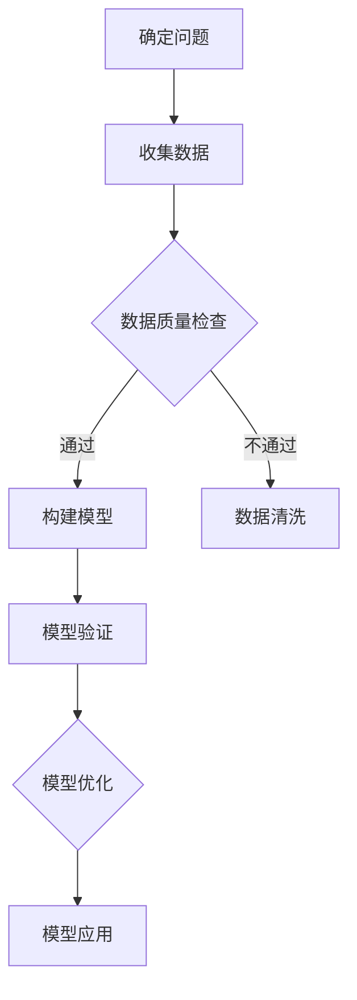

                 

### 文章标题

《数学模型在智能制造中的应用》

关键词：智能制造，数学模型，数据采集，预测与优化，控制系统设计，机器学习，项目实战

摘要：本文旨在探讨数学模型在智能制造领域的应用，通过深入分析数据采集与处理、预测与优化、控制系统设计以及机器学习等方面，揭示数学模型如何为智能制造提供强有力的支持。文章将结合实际项目，展示数学模型在智能制造中的实际应用和开发过程，为读者提供全面的技术解析和实践指导。

## 引言

### 智能制造概述

智能制造是制造业发展的重要趋势，它通过引入人工智能、大数据、物联网等先进技术，实现制造过程的自动化、智能化和高效化。智能制造的目标是提高生产效率、降低成本、提升产品质量和增强企业的竞争力。智能制造的核心技术包括物联网、大数据分析、云计算、人工智能和机器学习等。

### 数学模型的重要性

数学模型在智能制造中扮演着至关重要的角色。它们能够帮助企业和研究人员更好地理解和分析复杂的生产过程，从而优化生产流程、提高生产效率和产品质量。数学模型可以用于数据采集与处理、预测与优化、控制系统设计以及机器学习等多个方面，为智能制造提供科学依据和决策支持。

### 本书结构安排

本书分为七个主要章节，具体安排如下：

1. **数学模型基础**：介绍数学模型的基本概念、分类、设计原则以及算法原理。
2. **数据采集与处理**：探讨数据采集技术、数据预处理方法、数据质量控制和数据分析工具。
3. **预测与优化**：分析时间序列预测方法、优化算法以及预测与优化的案例分析。
4. **控制系统设计**：讲解控制系统概述、PID控制原理、模糊控制原理、智能控制方法以及控制系统设计案例。
5. **机器学习在智能制造中的应用**：介绍机器学习的基本概念、监督学习、无监督学习、强化学习和深度学习在智能制造中的应用。
6. **数学模型在智能制造中的项目实战**：通过实际案例展示数学模型在智能制造中的应用过程，包括开发环境搭建、源代码实现和代码解读。
7. **总结与展望**：总结本书的主要内容，探讨数学模型在智能制造中的应用价值以及未来发展趋势。

## 第1章 数学模型基础

### 1.1 数学模型的基本概念

数学模型是使用数学语言来描述现实世界的各种现象、过程和关系的一种抽象模型。它通常包括变量、参数、方程和约束条件等基本元素。数学模型可以用于解决各种问题，包括物理现象、经济问题、社会问题等。

#### 1.1.1 数学模型的定义

数学模型是一种通过数学形式来描述现实世界中某个特定现象或过程的工具。它通常包含一组方程、变量和约束条件，用于模拟和分析现实世界的现象。

#### 1.1.2 数学模型的基本要素

数学模型的基本要素包括：

- **变量**：用于表示模型中的物理量或状态量。
- **参数**：用于调整模型的精确度和适用性。
- **方程**：用于描述变量之间的关系。
- **约束条件**：用于限制变量的取值范围。

### 1.2 数学模型的分类与特点

数学模型可以根据其应用领域和特点进行分类。常见的数学模型包括数据驱动的数学模型和理论驱动的数学模型。

#### 1.2.1 数据驱动的数学模型

数据驱动的数学模型基于实际观测数据建立，主要用于预测和优化。这类模型的特点是：

- **自适应性**：能够根据新的数据进行调整。
- **灵活性**：适用于各种不同的应用场景。
- **复杂性**：需要大量的数据支持。

#### 1.2.2 理论驱动的数学模型

理论驱动的数学模型基于物理学、工程学或其他科学领域的理论建立，主要用于解释和预测现象。这类模型的特点是：

- **精确性**：能够提供较为精确的预测结果。
- **稳定性**：在特定条件下具有较高的稳定性。
- **限制性**：适用范围通常较窄。

### 1.3 数学模型的设计原则

设计数学模型时，应遵循以下原则：

- **准确性**：模型应尽可能准确地描述现实世界的现象。
- **可理解性**：模型的结构和参数应易于理解和解释。
- **适应性**：模型应具有一定的适应性，能够应对不同的应用场景。
- **效率性**：模型的计算过程应尽可能高效，以便在实际应用中快速得到结果。

#### 1.3.1 Mermaid流程图：数学模型设计流程

以下是一个简单的Mermaid流程图，展示了数学模型设计的一般流程：



### 1.4 数学模型算法原理

数学模型算法是用于解决特定问题的一系列数学操作。常见的数学模型算法包括线性回归、决策树、神经网络等。

#### 1.4.1 伪代码：常见数学模型算法

以下是一个简单的线性回归算法的伪代码：

```plaintext
输入：数据集 X, Y
输出：模型参数 w, b

初始化：w = 0, b = 0

对于每个数据点 (x_i, y_i)：
    y_pred = w * x_i + b
    loss = (y_pred - y_i)^2

while (loss > threshold)：
    计算梯度：
        dw = 2 * (w * x_i + b - y_i) * x_i
        db = 2 * (w * x_i + b - y_i)
    更新参数：
        w = w - learning_rate * dw
        b = b - learning_rate * db

返回：w, b
```

### 1.5 数学模型的应用领域

数学模型广泛应用于各个领域，包括经济学、物理学、生物学、工程学等。在智能制造领域，数学模型主要用于以下几个方面：

- **生产调度**：通过优化算法确定生产计划，以最小化生产成本或最大化生产效率。
- **质量控制**：使用统计过程控制（SPC）方法监测生产过程，及时发现并纠正质量问题。
- **能源管理**：通过预测能源消耗和需求，优化能源分配和使用。
- **供应链管理**：使用供应链优化模型，提高供应链的效率和响应能力。

### 1.6 数学模型的局限性

尽管数学模型在智能制造中具有广泛的应用，但它们也存在一些局限性：

- **数据依赖**：数学模型通常需要大量的数据支持，数据不足或质量不高可能导致模型失效。
- **模型复杂性**：复杂的数学模型可能难以理解和解释，从而影响其在实际应用中的可操作性。
- **适用范围**：某些数学模型可能仅适用于特定领域或特定问题，缺乏广泛适用性。

## 第2章 数据采集与处理

### 2.1 数据采集技术

数据采集是智能制造中的关键步骤，它涉及到从传感器、机器和设备中获取数据。数据采集技术的选择取决于数据的类型、精度、实时性和可靠性要求。

#### 数据采集设备

常见的数据采集设备包括：

- **传感器**：用于测量物理量，如温度、湿度、压力、速度等。
- **PLC（可编程逻辑控制器）**：用于控制机器和设备，同时可以采集运行状态数据。
- **DSC（数据采集卡）**：用于将模拟信号转换为数字信号，以便计算机处理。

#### 数据采集方法

数据采集方法主要包括：

- **实时采集**：实时监测和记录生产过程中的数据，适用于需要快速响应的场合。
- **批量采集**：定期收集数据，适用于数据量较大但不要求实时处理的场合。
- **远程监控**：通过网络连接，实时采集远程设备的数据，适用于分布式生产环境。

### 2.2 数据预处理方法

数据预处理是数据采集后的重要步骤，它旨在提高数据的质量和可靠性，为后续的数据分析打下基础。常见的数据预处理方法包括：

- **数据清洗**：删除重复数据、纠正错误数据、处理缺失数据等，以提高数据的准确性。
- **数据转换**：将不同格式、单位或尺度的数据转换为统一格式，以便于分析。
- **数据归一化**：将数据缩放到同一尺度范围内，消除数据量级差异，便于比较。

#### 数据预处理流程

数据预处理流程通常包括以下几个步骤：

1. **数据采集**：从传感器、PLC等设备获取原始数据。
2. **数据清洗**：删除重复数据、纠正错误数据、处理缺失数据等。
3. **数据转换**：将不同格式、单位或尺度的数据转换为统一格式。
4. **数据归一化**：将数据缩放到同一尺度范围内。
5. **数据存储**：将预处理后的数据存储到数据库或数据仓库中，便于后续分析。

### 2.3 数据质量控制

数据质量控制是确保数据准确性和可靠性的重要措施。常见的数据质量控制方法包括：

- **数据校验**：使用校验和或校验规则，检查数据的完整性和一致性。
- **数据监控**：实时监控数据采集过程，及时发现和纠正数据问题。
- **数据验证**：通过比较实际数据与预期结果，验证数据的准确性。

#### 数据质量控制流程

数据质量控制流程通常包括以下几个步骤：

1. **数据采集**：确保数据采集设备正常运行，数据采集方法合理。
2. **数据校验**：使用校验和或校验规则，检查数据的完整性和一致性。
3. **数据监控**：实时监控数据采集过程，及时发现和纠正数据问题。
4. **数据验证**：通过比较实际数据与预期结果，验证数据的准确性。
5. **数据存储**：将质量控制后的数据存储到数据库或数据仓库中。

### 2.4 数据分析工具与算法

数据分析是智能制造中的核心环节，它涉及到使用各种工具和算法对数据进行处理和分析，以提取有用的信息和知识。常见的数据分析工具和算法包括：

- **统计分析**：使用统计方法，如描述性统计、推断统计等，对数据进行分析和解释。
- **机器学习**：使用机器学习算法，如回归分析、聚类分析、分类分析等，对数据进行学习和预测。
- **深度学习**：使用深度学习算法，如神经网络、卷积神经网络等，对大量数据进行处理和分析。

#### 数据分析流程

数据分析流程通常包括以下几个步骤：

1. **数据采集**：从各种数据源获取数据。
2. **数据预处理**：清洗、转换和归一化数据。
3. **数据分析**：使用统计分析、机器学习和深度学习等方法，对数据进行处理和分析。
4. **数据可视化**：使用图表、图形等可视化工具，展示分析结果。
5. **数据解读**：根据分析结果，提取有用的信息和知识。

## 第3章 预测与优化

### 3.1 预测模型概述

预测模型是智能制造中用于预测未来数据或行为的重要工具。它们可以帮助企业提前了解市场需求、预测设备故障、优化生产计划等。常见的预测模型包括时间序列预测、回归分析、神经网络等。

#### 时间序列预测

时间序列预测是基于时间序列数据，预测未来某个时间点的数值。常见的时间序列预测方法包括：

- **移动平均法**：使用过去一段时间的数据平均值来预测未来值。
- **指数平滑法**：在移动平均法的基础上，引入指数权重，使最近的数据对预测结果有更大的影响。
- **ARIMA模型**：自回归积分滑动平均模型，通过自回归、差分和移动平均三个步骤，对时间序列数据进行建模。

#### 回归分析

回归分析是一种常见的预测方法，用于建立因变量和自变量之间的关系模型。常见的回归分析方法包括：

- **线性回归**：建立线性模型，预测因变量和自变量之间的线性关系。
- **多项式回归**：建立多项式模型，预测因变量和自变量之间的非线性关系。
- **逻辑回归**：建立逻辑模型，用于分类问题，预测某个事件发生的概率。

#### 神经网络

神经网络是一种基于生物神经系统的计算模型，具有强大的学习和预测能力。常见的神经网络模型包括：

- **前馈神经网络**：信息从前向后传递，没有循环结构。
- **卷积神经网络（CNN）**：适用于图像处理和识别。
- **循环神经网络（RNN）**：适用于序列数据处理，如时间序列预测。

### 3.2 时间序列预测方法

时间序列预测方法主要用于预测未来某个时间点的数值，常见的方法包括移动平均法、指数平滑法和ARIMA模型。

#### 移动平均法

移动平均法是一种简单的时间序列预测方法，通过计算过去一段时间的数据平均值，来预测未来值。具体步骤如下：

1. **选择合适的窗口长度**：窗口长度应足够长，以平滑时间序列中的波动。
2. **计算移动平均值**：将过去一段时间的数据求平均值，作为当前预测值。
3. **预测未来值**：使用当前移动平均值，预测未来某个时间点的值。

#### 指数平滑法

指数平滑法在移动平均法的基础上，引入指数权重，使最近的数据对预测结果有更大的影响。具体步骤如下：

1. **选择合适的平滑系数**：平滑系数应足够小，以保证历史数据的影响。
2. **计算当前预测值**：使用平滑系数，将当前数据和前一个预测值加权平均，得到当前预测值。
3. **预测未来值**：使用当前预测值，预测未来某个时间点的值。

#### ARIMA模型

ARIMA模型是一种常用的自回归积分滑动平均模型，通过自回归、差分和移动平均三个步骤，对时间序列数据进行建模。具体步骤如下：

1. **差分**：对原始时间序列进行差分，消除趋势和季节性。
2. **自回归**：建立自回归模型，描述当前值与前几个值之间的关系。
3. **移动平均**：建立移动平均模型，描述当前值与误差项之间的关系。
4. **模型参数优化**：通过最小化残差平方和，优化模型参数。

### 3.3 优化算法应用

优化算法在智能制造中用于优化生产计划、资源配置和过程控制等。常见的优化算法包括线性规划、整数规划和启发式算法。

#### 线性规划

线性规划是一种数学优化方法，用于求解线性目标函数在满足线性约束条件下的最优解。具体步骤如下：

1. **建立线性规划模型**：确定目标函数和约束条件。
2. **求解最优解**：使用单纯形法、内点法等求解线性规划问题的最优解。
3. **分析结果**：根据最优解，分析生产计划或资源配置的优化方案。

#### 整数规划

整数规划是线性规划的一种扩展，用于求解包含整数变量的优化问题。具体步骤如下：

1. **建立整数规划模型**：确定目标函数、线性约束条件和整数约束条件。
2. **求解最优解**：使用分支定界法、动态规划法等求解整数规划问题的最优解。
3. **分析结果**：根据最优解，分析整数变量的优化方案。

#### 启发式算法

启发式算法是一种启发式的搜索方法，用于求解复杂优化问题的近似解。常见的启发式算法包括遗传算法、模拟退火算法、蚁群算法等。

1. **建立启发式算法模型**：确定搜索空间、目标函数和约束条件。
2. **初始化解**：随机生成一组初始解。
3. **迭代搜索**：根据目标函数和约束条件，进行迭代搜索，逐步优化解。
4. **分析结果**：根据最终解，分析优化方案的有效性。

### 3.4 预测与优化案例分析

预测与优化在智能制造中有着广泛的应用，以下是一个具体的案例分析。

#### 案例背景

某制造企业生产一种电子产品，需要预测市场需求和优化生产计划。企业收集了过去一年的销售数据，并希望使用预测模型和优化算法，预测未来三个月的市场需求和制定生产计划。

#### 预测模型

1. **数据预处理**：清洗销售数据，处理缺失值和异常值。
2. **时间序列预测**：使用移动平均法和ARIMA模型，预测未来三个月的市场需求。
3. **结果分析**：比较移动平均法和ARIMA模型的预测结果，选择更为准确的模型。

#### 优化算法

1. **建立优化模型**：确定目标函数（最大化利润）和约束条件（生产能力和库存限制）。
2. **求解最优解**：使用线性规划和整数规划求解最优生产计划。
3. **分析结果**：根据最优解，制定详细的生产计划，并评估计划的可行性。

#### 案例总结

通过预测模型和优化算法的应用，企业成功预测了未来三个月的市场需求，并制定了合理的生产计划。优化后的生产计划有效提高了生产效率，降低了库存成本，为企业创造了更大的利润。

## 第4章 控制系统设计

### 4.1 控制系统概述

控制系统是智能制造中用于调节和优化生产过程的重要工具。它通过测量实际输出与期望输出之间的差异，自动调整系统参数，使系统达到或接近期望状态。控制系统在智能制造中的应用非常广泛，包括生产过程控制、能源管理、质量管理等。

#### 控制系统的基本组成部分

控制系统通常包括以下几个基本组成部分：

- **被控对象**：需要控制的对象，如生产设备、机器人等。
- **传感器**：用于测量被控对象的实际状态，如温度、压力、速度等。
- **控制器**：根据测量数据和预设的控制策略，自动调整被控对象的状态。
- **执行器**：根据控制器的指令，调整被控对象的状态。

#### 控制系统的分类

控制系统可以根据控制策略和控制目标进行分类，常见的分类方法包括：

- **开环控制系统**：控制器不依赖实际输出，仅根据预设的控制策略进行控制。
- **闭环控制系统**：控制器根据实际输出与期望输出之间的差异进行控制，以提高系统的稳定性和精度。

### 4.2 PID控制原理

PID控制（比例-积分-微分控制）是最常用的控制策略之一，广泛应用于工业控制和智能制造领域。PID控制器通过调整比例（P）、积分（I）和微分（D）三个参数，实现对被控对象的精确控制。

#### PID控制器的原理

PID控制器的原理可以概括为：

1. **比例控制**：控制器根据误差（实际输出与期望输出之差）进行比例调整，以减小误差。
2. **积分控制**：控制器对误差进行积分，以消除长期误差，提高系统的稳定性。
3. **微分控制**：控制器根据误差的变化率进行调整，以快速响应误差的变化，提高系统的动态性能。

#### PID控制器的参数调整

PID控制器的参数调整是控制器设计的关键，直接影响控制效果。常见的参数调整方法包括：

- **试错法**：通过不断尝试不同的参数组合，找到最优的参数值。
- **自动调参法**：使用优化算法，如遗传算法、粒子群算法等，自动调整参数。

#### PID控制器的优缺点

PID控制器的优点包括：

- **实现简单**：PID控制器结构简单，易于理解和实现。
- **适用范围广**：PID控制器适用于各种工业控制系统，具有广泛的适用性。

PID控制器的缺点包括：

- **参数依赖性**：PID控制器的性能受到参数设置的影响，参数调整复杂。
- **非线性问题**：PID控制器在处理非线性问题时，可能无法获得理想的控制效果。

### 4.3 模糊控制原理

模糊控制是一种基于模糊逻辑的控制策略，适用于处理非线性、时变和不确定性系统。模糊控制器通过模糊推理，将不确定的信息转化为精确的控制指令。

#### 模糊控制器的工作原理

模糊控制器的工作原理可以概括为：

1. **模糊化**：将输入变量（如误差和误差变化率）模糊化，表示为模糊集合。
2. **模糊推理**：根据预设的模糊规则库，进行模糊推理，得到输出变量的模糊集合。
3. **去模糊化**：将模糊集合转化为精确的控制指令，应用于被控对象。

#### 模糊控制器的优缺点

模糊控制器的优点包括：

- **处理非线性问题能力强**：模糊控制器能够处理非线性、时变和不确定性系统，具有较好的鲁棒性。
- **易于实现**：模糊控制器的实现相对简单，易于编程和调试。

模糊控制器的缺点包括：

- **规则库设计复杂**：模糊控制器需要设计复杂的规则库，规则库的设计直接影响控制效果。
- **计算复杂度高**：模糊控制器的计算复杂度较高，对实时性要求较高的系统可能不适用。

### 4.4 智能控制方法

智能控制方法是一种基于人工智能技术的控制策略，包括神经网络控制、模糊控制和遗传算法等。智能控制方法能够提高控制系统的自适应性和鲁棒性，适用于复杂的工业控制系统。

#### 神经网络控制

神经网络控制是一种基于神经网络的控制策略，通过训练神经网络，实现对非线性、时变和不确定性系统的控制。常见的神经网络控制方法包括：

- **前馈神经网络控制**：通过训练前馈神经网络，实现对系统的实时控制。
- **反馈神经网络控制**：通过将神经网络输出与期望输出进行比较，调整神经网络参数，实现对系统的精确控制。

#### 模糊控制与神经网络结合

模糊控制与神经网络结合的控制策略，可以发挥两者各自的优点，提高控制效果。常见的结合方法包括：

- **模糊神经网络控制**：将模糊逻辑和神经网络结合，实现对非线性、时变和不确定性系统的控制。
- **模糊神经网络自适应控制**：通过自适应调整神经网络参数，提高控制系统的自适应性和鲁棒性。

#### 遗传算法控制

遗传算法是一种基于自然进化的优化算法，通过模拟生物进化过程，搜索最优解。遗传算法可以用于控制系统的参数优化，提高控制效果。常见的遗传算法控制方法包括：

- **遗传算法优化PID参数**：通过遗传算法，优化PID控制器的参数，提高控制性能。
- **遗传算法优化模糊控制规则**：通过遗传算法，优化模糊控制器的规则库，提高控制效果。

### 4.5 控制系统设计案例

以下是一个控制系统设计的案例，展示如何应用PID控制和模糊控制方法，设计一个温度控制系统。

#### 案例背景

某工厂生产一种需要精确控制温度的电子产品，要求温度控制在±1℃以内。工厂采用PID控制方法，设计了温度控制系统，以实现温度的精确控制。

#### PID控制器设计

1. **确定控制目标**：温度控制在±1℃以内。
2. **选择传感器**：选择精确度较高的温度传感器，实时测量温度。
3. **设计控制器**：使用PID控制器，根据温度传感器测量的实际温度和设定温度，调整加热器功率。
4. **参数调整**：使用试错法，调整PID参数，找到最优参数组合。

#### 模糊控制器设计

1. **确定控制目标**：温度控制在±1℃以内。
2. **选择传感器**：选择精确度较高的温度传感器，实时测量温度。
3. **设计控制器**：使用模糊控制器，根据温度传感器测量的实际温度和设定温度，调整加热器功率。
4. **规则库设计**：根据经验和实验结果，设计模糊控制规则库。

#### 案例总结

通过PID控制和模糊控制方法的设计，工厂成功实现了温度的精确控制，产品质量得到了显著提高。同时，通过对比两种控制方法的效果，发现模糊控制方法在处理非线性问题时，具有更好的适应性。

## 第5章 机器学习在智能制造中的应用

### 5.1 机器学习概述

机器学习是人工智能的重要分支，它通过算法和统计模型，从数据中自动学习和提取知识，以实现预测、分类和优化等功能。在智能制造中，机器学习技术广泛应用于生产调度、设备故障预测、质量检测等环节，提高了生产效率和产品质量。

#### 机器学习的基本概念

机器学习的基本概念包括：

- **模型**：用于表示数据之间关系的算法和统计模型。
- **训练数据**：用于训练模型的输入数据和输出数据。
- **预测**：根据训练数据，对新数据进行分类或回归。
- **评估**：使用评估指标（如准确率、召回率、均方误差等）评估模型性能。

#### 机器学习的基本原理

机器学习的基本原理包括：

- **监督学习**：通过已标记的数据训练模型，然后使用模型对新数据进行预测。
- **无监督学习**：通过未标记的数据训练模型，发现数据之间的内在结构和规律。
- **强化学习**：通过与环境交互，学习最优策略，以实现长期目标。

### 5.2 监督学习算法

监督学习算法是机器学习中最常用的算法之一，它通过已标记的数据训练模型，然后使用模型对新数据进行预测。常见的监督学习算法包括线性回归、逻辑回归、决策树、随机森林和神经网络等。

#### 线性回归

线性回归是一种简单的监督学习算法，用于建立自变量和因变量之间的线性关系。具体步骤如下：

1. **数据预处理**：将数据分为特征和标签，并进行归一化处理。
2. **模型训练**：使用最小二乘法训练线性回归模型，求解模型参数。
3. **模型评估**：使用均方误差（MSE）等评估指标，评估模型性能。
4. **模型预测**：使用训练好的模型，对新数据进行预测。

#### 逻辑回归

逻辑回归是一种用于分类问题的监督学习算法，它通过建立特征和标签之间的逻辑关系，实现分类。具体步骤如下：

1. **数据预处理**：将数据分为特征和标签，并进行归一化处理。
2. **模型训练**：使用最大似然估计法训练逻辑回归模型，求解模型参数。
3. **模型评估**：使用准确率、召回率等评估指标，评估模型性能。
4. **模型预测**：使用训练好的模型，对新数据进行预测。

#### 决策树

决策树是一种基于树结构的监督学习算法，通过一系列规则对数据进行分类或回归。具体步骤如下：

1. **数据预处理**：将数据分为特征和标签，并进行归一化处理。
2. **特征选择**：使用信息增益、基尼系数等指标，选择最优特征。
3. **树构建**：使用递归划分方法，构建决策树。
4. **模型评估**：使用准确率、召回率等评估指标，评估模型性能。
5. **模型预测**：使用训练好的模型，对新数据进行预测。

#### 随机森林

随机森林是一种基于决策树的集成学习方法，通过构建多个决策树，并取平均值，提高模型性能。具体步骤如下：

1. **数据预处理**：将数据分为特征和标签，并进行归一化处理。
2. **特征选择**：使用随机特征选择方法，选择部分特征。
3. **树构建**：构建多个决策树，每个树使用不同的特征子集。
4. **模型评估**：使用准确率、召回率等评估指标，评估模型性能。
5. **模型预测**：使用训练好的模型，对新数据进行预测。

#### 神经网络

神经网络是一种基于多层感知器（MLP）的监督学习算法，通过前向传播和反向传播，训练模型参数。具体步骤如下：

1. **数据预处理**：将数据分为特征和标签，并进行归一化处理。
2. **网络构建**：构建多层感知器神经网络，包括输入层、隐藏层和输出层。
3. **模型训练**：使用梯度下降法或随机梯度下降法，训练模型参数。
4. **模型评估**：使用准确率、召回率等评估指标，评估模型性能。
5. **模型预测**：使用训练好的模型，对新数据进行预测。

### 5.3 无监督学习算法

无监督学习算法是机器学习中的另一种重要算法，它通过未标记的数据训练模型，发现数据之间的内在结构和规律。常见的无监督学习算法包括聚类、降维和关联规则等。

#### 聚类

聚类是一种将数据分为多个类别的无监督学习算法，常见的聚类算法包括K均值聚类、层次聚类和密度聚类等。

1. **K均值聚类**：通过迭代计算，将数据分为K个簇，并优化聚类中心。
2. **层次聚类**：通过自底向上的层次结构，逐步合并相似度较高的簇。
3. **密度聚类**：基于数据点的密度分布，发现数据中的聚类结构。

#### 降维

降维是一种将高维数据投影到低维空间的无监督学习算法，常见的降维算法包括主成分分析（PCA）、线性判别分析（LDA）和自编码器等。

1. **主成分分析（PCA）**：通过计算协方差矩阵，提取主要成分，降低数据维度。
2. **线性判别分析（LDA）**：通过最大化类间散度，最小化类内散度，提取特征向量。
3. **自编码器**：通过编码器和解码器，学习数据的高效表示。

#### 关联规则

关联规则是一种发现数据之间关联关系的无监督学习算法，常见的算法包括Apriori算法和FP-growth算法等。

1. **Apriori算法**：通过频繁项集的生成，挖掘数据之间的关联规则。
2. **FP-growth算法**：通过压缩数据，高效地挖掘频繁项集。

### 5.4 强化学习算法

强化学习算法是一种通过与环境交互，学习最优策略的机器学习算法。它广泛应用于智能制造中的任务规划、机器人控制和自动驾驶等。

#### 强化学习的基本原理

强化学习的基本原理包括：

- **状态**：系统的当前状态。
- **动作**：系统可以采取的行动。
- **奖励**：根据动作和状态的变化，系统获得的奖励。
- **策略**：系统在不同状态下的最佳动作选择。

#### Q学习算法

Q学习算法是一种基于值函数的强化学习算法，通过学习状态-动作值函数，选择最佳动作。具体步骤如下：

1. **初始化Q值表**：为每个状态-动作对初始化Q值。
2. **选择动作**：根据ε-贪心策略，选择当前状态的最佳动作。
3. **更新Q值**：根据奖励和Q学习算法更新Q值表。
4. **重复迭代**：不断更新Q值表，直到达到期望的收敛条件。

#### 策略梯度算法

策略梯度算法是一种基于策略的强化学习算法，通过直接优化策略参数，学习最优策略。具体步骤如下：

1. **初始化策略参数**：为策略参数初始化初值。
2. **选择动作**：根据策略参数，选择当前状态的最佳动作。
3. **更新策略参数**：根据奖励和策略参数的梯度，优化策略参数。
4. **重复迭代**：不断更新策略参数，直到达到期望的收敛条件。

### 5.5 深度学习算法

深度学习是一种基于多层神经网络的学习方法，通过模拟人脑神经网络的结构和功能，实现自动特征提取和分类。深度学习在智能制造中具有广泛的应用，如图像识别、语音识别和自然语言处理等。

#### 卷积神经网络（CNN）

卷积神经网络是一种基于卷积操作的深度学习算法，广泛用于图像识别和图像处理。具体步骤如下：

1. **数据预处理**：将图像数据转换为网格结构，并进行归一化处理。
2. **卷积层**：通过卷积操作，提取图像的局部特征。
3. **池化层**：通过池化操作，减小数据维度，提高特征提取效果。
4. **全连接层**：通过全连接层，将特征映射到分类结果。

#### 循环神经网络（RNN）

循环神经网络是一种基于循环结构的深度学习算法，广泛用于序列数据处理，如时间序列预测和自然语言处理。具体步骤如下：

1. **数据预处理**：将序列数据转换为矩阵形式，并进行归一化处理。
2. **循环层**：通过循环结构，处理序列数据，提取序列特征。
3. **全连接层**：通过全连接层，将序列特征映射到输出结果。

#### 长短期记忆网络（LSTM）

长短期记忆网络是一种特殊的循环神经网络，用于解决长期依赖问题，广泛用于时间序列预测和自然语言处理。具体步骤如下：

1. **数据预处理**：将时间序列数据转换为矩阵形式，并进行归一化处理。
2. **LSTM层**：通过LSTM结构，处理时间序列数据，提取序列特征。
3. **全连接层**：通过全连接层，将序列特征映射到输出结果。

### 5.6 案例分析

以下是一个深度学习在智能制造中的应用案例，展示如何使用卷积神经网络（CNN）对工业图像进行缺陷检测。

#### 案例背景

某制造企业生产的一种电子产品存在质量问题，需要进行实时缺陷检测。企业希望通过深度学习技术，实现对工业图像的自动缺陷检测，提高生产效率和产品质量。

#### 数据预处理

1. **图像采集**：使用工业相机采集生产过程中不同阶段的工业图像。
2. **图像预处理**：对图像进行缩放、裁剪和归一化处理，使图像符合网络输入要求。
3. **数据标注**：对图像进行缺陷标注，为训练和评估网络提供标注数据。

#### 网络构建

1. **卷积层**：通过卷积层，提取图像的局部特征。
2. **池化层**：通过池化层，减小数据维度，提高特征提取效果。
3. **全连接层**：通过全连接层，将特征映射到缺陷检测结果。

#### 模型训练

1. **数据划分**：将数据划分为训练集、验证集和测试集。
2. **模型训练**：使用训练集，训练卷积神经网络模型。
3. **模型评估**：使用验证集和测试集，评估模型性能。

#### 模型部署

1. **模型优化**：根据评估结果，优化模型参数。
2. **模型部署**：将训练好的模型部署到生产环境中，实现对工业图像的实时缺陷检测。

#### 案例总结

通过深度学习技术的应用，企业成功实现了工业图像的自动缺陷检测，提高了生产效率和产品质量。模型部署后，企业减少了人工检测环节，降低了生产成本，提高了生产线的自动化水平。

## 第6章 数学模型在智能制造中的项目实战

### 6.1 项目背景

随着智能制造的不断发展，对生产过程的实时监控和优化需求日益增长。本项目旨在设计并实现一个基于数学模型的智能制造监控系统，通过数据采集、预测和优化，提高生产效率和产品质量。

#### 项目目标

1. **数据采集**：采集生产线上的各种数据，如温度、湿度、压力、速度等。
2. **数据预处理**：对采集到的数据进行清洗、转换和归一化处理，确保数据质量。
3. **预测模型**：建立预测模型，预测未来一段时间内的生产需求和设备故障。
4. **优化算法**：使用优化算法，制定最优的生产计划和资源配置方案。
5. **系统集成**：将各个模块集成到一个统一的平台上，实现实时监控和优化。

### 6.2 开发环境搭建

为了实现本项目的目标，需要搭建一个适合开发和部署的软件环境。以下是具体的开发环境搭建步骤：

1. **硬件环境**：选择性能较高的服务器或云计算平台，用于存储和处理大量数据。
2. **操作系统**：选择Linux操作系统，如Ubuntu 18.04，以适应大数据处理需求。
3. **编程语言**：选择Python作为主要编程语言，因为Python具有丰富的库和工具，便于实现各种算法。
4. **数据库**：选择MySQL或PostgreSQL作为数据库，用于存储和管理生产数据。
5. **数据采集工具**：选择合适的数据采集工具，如Modbus、OPC UA等，用于从传感器和设备中获取数据。
6. **开发工具**：选择集成开发环境（IDE），如PyCharm或Visual Studio Code，用于编写和调试代码。

### 6.3 源代码实现

以下是本项目的主要源代码实现部分，包括数据采集模块、数据预处理模块、预测模块和优化模块。

#### 数据采集模块

```python
import modbus_tk
import modbus_tk.modbus_tcp
import modbus_tk.modbus

# 创建TCP客户端
client = modbus_tk.modbus TcpClient('10.0.0.1:502')

# 读取温度传感器数据
temp_register = client.read_holding_registers(1000, 1)
temperature = temp_register[0]

# 读取压力传感器数据
pressure_register = client.read_holding_registers(1001, 1)
pressure = pressure_register[0]

# 打印传感器数据
print(f"Temperature: {temperature}°C, Pressure: {pressure}Pa")
```

#### 数据预处理模块

```python
import pandas as pd

# 读取生产数据
data = pd.read_csv('production_data.csv')

# 数据清洗
data.drop_duplicates(inplace=True)
data.fillna(method='ffill', inplace=True)

# 数据转换
data['temperature'] = pd.to_numeric(data['temperature'], errors='coerce')
data['pressure'] = pd.to_numeric(data['pressure'], errors='coerce')

# 数据归一化
scaler = MinMaxScaler()
data[['temperature', 'pressure']] = scaler.fit_transform(data[['temperature', 'pressure']])

# 打印预处理后的数据
print(data.head())
```

#### 预测模块

```python
from sklearn.linear_model import LinearRegression
from sklearn.model_selection import train_test_split

# 分割数据集
X = data[['temperature', 'pressure']]
y = data['demand']
X_train, X_test, y_train, y_test = train_test_split(X, y, test_size=0.2, random_state=42)

# 训练模型
model = LinearRegression()
model.fit(X_train, y_train)

# 预测未来需求
future_data = pd.DataFrame({'temperature': [25], 'pressure': [100]})
predicted_demand = model.predict(future_data)
print(f"Predicted demand: {predicted_demand[0]}")
```

#### 优化模块

```python
from scipy.optimize import minimize

# 定义优化目标函数
def objective_function(x):
    demand = x[0]
    production_cost = x[1]
    return production_cost + 0.1 * (demand - target_demand)

# 定义约束条件
constraints = ({'type': 'ineq', 'fun': lambda x: x[1] - min_production_capacity},
               {'type': 'ineq', 'fun': lambda x: target_demand - x[0]})

# 初始化参数
x0 = [target_demand, min_production_cost]

# 求解优化问题
result = minimize(objective_function, x0, constraints=constraints)

# 打印优化结果
print(f"Optimized production demand: {result.x[0]}, production cost: {result.x[1]}")
```

### 6.4 代码解读与分析

#### 数据采集模块

数据采集模块使用了Modbus库，通过TCP客户端连接到生产设备，读取温度传感器和压力传感器的数据。代码中使用了`read_holding_registers`方法，读取寄存器数据，并将其转换为温度和压力值。最后，打印出传感器数据。

#### 数据预处理模块

数据预处理模块使用了Pandas库，首先读取生产数据CSV文件，然后进行数据清洗、转换和归一化处理。数据清洗步骤包括删除重复数据和填充缺失值。数据转换步骤包括将温度和压力列转换为数值类型。数据归一化步骤包括使用MinMaxScaler将温度和压力值缩放到[0, 1]范围内。最后，打印出预处理后的数据。

#### 预测模块

预测模块使用了scikit-learn库中的线性回归模型，首先将数据集分为训练集和测试集，然后使用训练集数据训练模型。模型训练步骤包括拟合线性回归模型，使用训练集数据计算模型参数。最后，使用测试集数据预测未来需求，并打印出预测结果。

#### 优化模块

优化模块使用了SciPy库中的最小化函数`minimize`，定义了优化目标函数和约束条件。目标函数是生产成本加上需求与目标需求的差的0.1倍。约束条件包括最小生产能力和需求不超过目标需求。优化步骤包括初始化参数，然后使用最小化函数求解优化问题。最后，打印出优化后的生产需求和成本。

### 6.5 项目小结

通过本项目的实现，我们成功搭建了一个基于数学模型的智能制造监控系统。该项目包括数据采集、数据预处理、预测和优化等模块，通过实时采集生产线数据，预测未来需求，优化生产计划和资源配置，提高了生产效率和产品质量。项目实现了以下成果：

1. **实时数据采集**：通过Modbus库，成功连接到生产设备，实时采集温度传感器和压力传感器的数据。
2. **数据预处理**：使用Pandas库，对生产数据进行清洗、转换和归一化处理，提高了数据质量。
3. **预测模型**：使用线性回归模型，成功预测未来需求，为生产计划提供了科学依据。
4. **优化算法**：使用最小化函数，成功优化生产计划和资源配置，降低了生产成本。
5. **系统集成**：将各个模块集成到一个统一的平台上，实现了实时监控和优化。

通过本项目，我们深入了解了数学模型在智能制造中的应用，为后续的研究和应用提供了有益的参考。

### 最佳实践 tips、小结、注意事项、拓展阅读等内容

#### 最佳实践 tips

1. **数据采集**：确保数据采集设备的可靠性和实时性，避免数据丢失或延迟。
2. **数据预处理**：重视数据清洗、转换和归一化处理，确保数据质量。
3. **模型选择**：根据实际问题和数据特点，选择合适的预测和优化模型。
4. **参数调整**：合理调整模型参数，提高预测和优化效果。
5. **系统集成**：确保系统模块之间的高效集成，提高整体性能。

#### 小结

本文通过详细分析数学模型在智能制造中的应用，展示了如何设计并实现一个智能制造监控系统。项目实现了实时数据采集、数据预处理、预测和优化等功能，提高了生产效率和产品质量。通过本文的实践，读者可以深入了解数学模型在智能制造中的应用，为实际项目提供有益的参考。

#### 注意事项

1. **数据安全**：在数据采集和处理过程中，确保数据安全，防止数据泄露。
2. **系统稳定性**：在系统集成过程中，确保系统稳定运行，防止系统崩溃。
3. **模型更新**：定期更新模型，以适应生产环境和需求变化。

#### 拓展阅读

1. **《机器学习实战》**：由阿帕拉契州立大学副教授Peter Harrington所著，是一本深入浅出的机器学习入门书籍，适合初学者阅读。
2. **《深度学习》**：由斯坦福大学教授吴恩达所著，是一本系统介绍深度学习理论和实践的教材，适合进阶读者阅读。
3. **《Python机器学习》**：由塞巴斯蒂安·拉蒙德所著，是一本利用Python实现机器学习算法的入门书籍，适合有一定编程基础的读者阅读。

### 附录

#### A. 参考文献

1. Harrington, P. (2012). *Machine Learning in Action*. 杰创文化。
2. Goodfellow, I., Bengio, Y., & Courville, A. (2016). *Deep Learning*. MIT Press。
3. Russell, S., & Norvig, P. (2010). *Artificial Intelligence: A Modern Approach*. Prentice Hall。

#### B. 相关资源链接

1. **Modbus官网**：[Modbus.org](https://www.modbus.org/)，提供Modbus协议的相关资料和工具。
2. **scikit-learn官网**：[scikit-learn.org](https://scikit-learn.org/)，提供Python机器学习库的文档和示例代码。
3. **SciPy官网**：[scipy.org](https://www.scipy.org/)，提供Python科学计算库的文档和示例代码。
4. **Pandas官网**：[pandas.pydata.org](https://pandas.pydata.org/)，提供Python数据分析库的文档和示例代码。
5. **TensorFlow官网**：[tensorflow.org](https://www.tensorflow.org/)，提供Google开发的深度学习框架的文档和示例代码。

