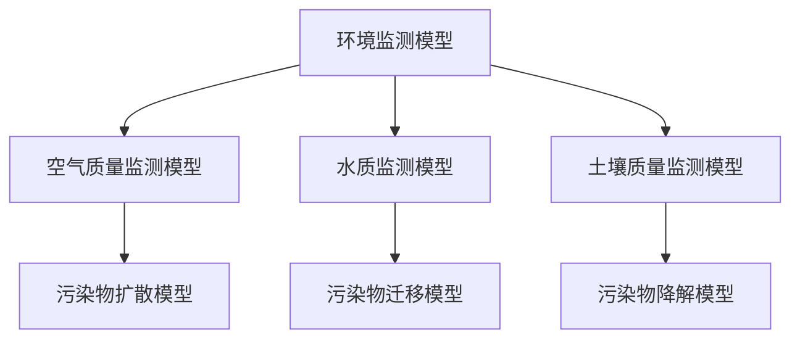

                 


## 文章标题：数学模型在环境科学中的应用

> 关键词：数学模型，环境科学，应用，案例分析，算法原理

> 摘要：本文深入探讨了数学模型在环境科学中的应用。通过详细的分析，本文揭示了数学模型如何帮助我们理解和解决环境问题，包括环境监测、污染控制、资源利用和气候变化等关键领域。本文旨在为读者提供一个清晰、系统、易于理解的学习框架，帮助他们更好地掌握和应用数学模型。

----------------------------------------------------------------

## 第一部分：环境科学概述

### 1.1 环境科学的定义和发展历程

环境科学是一门跨学科的领域，旨在研究自然环境和人类活动之间的相互作用。它关注环境问题的成因、影响和解决方法，旨在保护和改善人类生活环境。环境科学的发展历程可以追溯到20世纪中叶，随着工业化进程的加速和环境污染问题的日益严重，环境科学逐渐成为一个独立的学科领域。

环境科学的核心概念包括生态系统、环境质量、环境保护、可持续发展等。生态系统是环境科学研究的核心对象，它是生物群落与其非生物环境相互作用的自然综合体。环境质量是衡量环境优劣的重要指标，它包括空气质量、水质、土壤质量等方面。环境保护是指采取各种措施防止环境污染、保护自然资源和生态系统。可持续发展是环境科学追求的目标，它强调满足当代人的需求，不损害后代人满足其需求的能力。

环境科学的研究范畴广泛，包括大气环境、水环境、土壤环境、生物多样性、气候变化等方面。大气环境研究主要包括大气污染、温室气体排放、空气质量等。水环境研究主要包括水资源管理、水污染治理、水质监测等。土壤环境研究主要包括土壤污染、土壤质量监测、土壤修复等。生物多样性研究主要包括物种多样性、生态系统功能、生物资源管理等。气候变化研究主要包括气候变化的趋势、影响、应对策略等。

### 1.2 环境科学的核心概念和范畴

环境科学的核心概念包括生态系统、环境质量、环境保护、可持续发展等。生态系统是环境科学研究的核心对象，它是生物群落与其非生物环境相互作用的自然综合体。环境质量是衡量环境优劣的重要指标，它包括空气质量、水质、土壤质量等方面。环境保护是指采取各种措施防止环境污染、保护自然资源和生态系统。可持续发展是环境科学追求的目标，它强调满足当代人的需求，不损害后代人满足其需求的能力。

环境科学的范畴广泛，包括大气环境、水环境、土壤环境、生物多样性、气候变化等方面。大气环境研究主要包括大气污染、温室气体排放、空气质量等。水环境研究主要包括水资源管理、水污染治理、水质监测等。土壤环境研究主要包括土壤污染、土壤质量监测、土壤修复等。生物多样性研究主要包括物种多样性、生态系统功能、生物资源管理等。气候变化研究主要包括气候变化的趋势、影响、应对策略等。

### 1.3 环境问题的类型和现状

环境问题是指由于人类活动导致的环境恶化现象。根据环境问题的成因和性质，可以将其分为以下几种类型：

1. **大气污染**：由于工业排放、交通排放等导致的大气中污染物浓度升高，如二氧化硫、氮氧化物、颗粒物等，对人类健康和生态环境造成严重影响。

2. **水污染**：由于工业废水、生活污水、农药化肥等导致的水体污染，如重金属污染、有机污染物污染等，对水资源和生态环境造成破坏。

3. **土壤污染**：由于农药、化肥、工业废弃物等导致土壤污染，影响农产品的质量和土壤的生态系统功能。

4. **生物多样性丧失**：由于栖息地破坏、过度捕捞、生物入侵等原因导致的物种灭绝和生态系统退化。

5. **气候变化**：由于温室气体排放导致的全球气候变暖，对生态系统、水资源、农业生产等产生重大影响。

目前，全球环境问题的现状令人担忧。大气污染、水污染和土壤污染等问题在一些地区仍然严重，生物多样性丧失和气候变化趋势加剧。这些问题不仅对人类健康和生存环境构成威胁，也对全球生态系统的稳定性和可持续发展带来挑战。因此，解决环境问题已经成为全球各国共同面临的重大任务。

### 1.4 环境问题的成因

环境问题的成因复杂多样，主要包括以下方面：

1. **工业化进程**：工业化的快速发展带来了大量的工业排放，如废气、废水和固体废物，导致大气污染、水污染和土壤污染等问题。

2. **人口增长**：人口的增长导致对自然资源的需求增加，如能源、水资源和粮食等，加剧了环境压力。

3. **城市化进程**：城市化的快速发展带来了交通拥堵、废弃物处理困难等问题，对环境质量造成影响。

4. **农业现代化**：农业现代化带来了农药和化肥的大量使用，导致土壤污染和生态破坏。

5. **全球气候变化**：全球气候变化导致了极端气候事件的增多，如洪水、干旱和飓风等，对生态系统和人类生活造成严重影响。

### 1.5 环境科学的研究方法和技术手段

环境科学的研究方法和技术手段多样，主要包括以下几个方面：

1. **观测和监测**：通过现场观测、遥感技术和环境监测站等手段，获取环境质量数据。

2. **实验研究**：通过实验室实验和现场实验，研究污染物对生态系统的影响。

3. **模型模拟**：利用数学模型和计算机模拟技术，预测环境变化趋势和评估环境影响。

4. **数值分析**：利用数值分析方法，解决环境问题中的复杂非线性问题。

5. **统计分析**：通过统计分析方法，分析环境数据的规律和趋势。

6. **生态系统分析**：通过生态系统分析，研究生态系统的结构和功能，评估生态系统的健康状况。

### 1.6 环境问题的解决策略

解决环境问题需要采取综合性的策略，主要包括以下几个方面：

1. **政策法规**：制定和实施环境保护法规，规范企业行为，限制污染物排放。

2. **技术进步**：通过技术创新，提高能源利用效率，减少污染物排放。

3. **公众参与**：提高公众的环境意识，鼓励公众参与环境保护活动。

4. **国际合作**：加强国际合作，共同应对全球性环境问题。

5. **生态修复**：通过生态修复技术，恢复被破坏的生态系统。

6. **可持续发展**：推动经济发展与环境保护的协调发展，实现可持续发展。

## 第二部分：数学模型概述

### 2.1 数学模型的概念和类型

数学模型是现实世界问题的数学描述，它通过建立数学方程或关系来模拟和分析现实世界中的现象和过程。数学模型在各个领域都有广泛应用，包括自然科学、工程技术、经济学、社会学等。在环境科学中，数学模型被广泛应用于环境监测、污染控制、资源利用和气候变化等领域。

数学模型可以分为确定性模型和概率性模型。确定性模型是基于确定性方程，例如微分方程、代数方程等，用于描述确定性的物理现象。概率性模型是基于概率论和统计学原理，用于描述不确定性的现象，例如随机过程、蒙特卡罗模拟等。

### 2.2 数学模型的应用范围和意义

数学模型在环境科学中的应用范围非常广泛。首先，数学模型可以用于环境监测和评估，例如空气质量模型、水质模型、土壤质量模型等，用于预测和评估环境质量的变化趋势。其次，数学模型可以用于污染控制和治理，例如污染物排放控制模型、污染物迁移转化模型、污染源识别模型等，用于优化污染治理策略。此外，数学模型还可以用于资源利用和保护，例如资源需求预测模型、资源供需平衡模型、资源利用效率提升模型等，用于优化资源管理。最后，数学模型可以用于气候变化和能源模型，例如气候变化趋势预测模型、气候变化影响评估模型、可再生能源利用模型等，用于分析和预测气候变化对环境的影响。

数学模型在环境科学中的意义在于，它可以提供定量化的分析工具，帮助我们更准确地理解和预测环境问题的发展趋势，制定更有效的解决方案。数学模型还可以为政策制定提供科学依据，帮助政府和企业更好地管理环境资源。

### 2.3 常见的数学模型

在环境科学中，常见的数学模型包括以下几种：

1. **微分方程模型**：用于描述污染物在环境介质中的扩散和转化过程，例如一维、二维、三维扩散方程。

2. **代数方程模型**：用于描述环境系统的稳态特性，例如污染物浓度分布模型、污染物排放模型等。

3. **概率性模型**：用于描述不确定性的现象，例如随机过程模型、蒙特卡罗模拟等。

4. **统计学模型**：用于分析环境数据，例如回归分析、时间序列分析等。

5. **优化模型**：用于优化环境管理策略，例如线性规划、非线性规划等。

### 2.4 数学模型的应用步骤

应用数学模型解决环境问题通常包括以下步骤：

1. **问题定义**：明确要解决的问题，例如环境监测、污染控制、资源利用等。

2. **模型选择**：根据问题的特性选择合适的数学模型。

3. **参数估计**：通过实验数据或现场监测数据估计模型参数。

4. **模型构建**：根据参数估计结果构建数学模型。

5. **模型验证**：通过历史数据或模拟数据验证模型的有效性。

6. **模型应用**：将模型应用于实际问题，例如预测环境质量、优化污染治理策略等。

7. **结果分析**：对模型结果进行分析，评估模型预测的准确性和实用性。

## 第三部分：数学模型在环境科学中的应用

### 3.1 环境监测与评估模型

环境监测与评估模型是环境科学中非常重要的一个分支，它通过建立数学模型来监测和评估环境质量，为环境保护和管理提供科学依据。本节将介绍几种常见的环境监测与评估模型，包括空气质量模型、水质模型、土壤质量模型等。

#### 3.1.1 空气质量模型

空气质量模型主要用于预测和分析空气中的污染物浓度分布及其变化规律。常见的空气质量模型包括扩散模型、化学传输模型和生物降解模型等。扩散模型主要基于质量守恒定律和扩散定律，描述污染物在空气中的扩散过程。化学传输模型则考虑了污染物在空气中的化学反应过程，如氧化、还原等。生物降解模型则关注污染物在空气中的生物降解过程。

以下是一个简化的空气质量模型，基于质量守恒定律：

$$
\frac{\partial C}{\partial t} + \nabla \cdot (D \nabla C) = -\nabla \cdot (uC) + R
$$

其中，$C$ 表示污染物浓度，$D$ 表示扩散系数，$u$ 表示风速，$R$ 表示源项，包括污染物排放和生物降解等。

#### 3.1.2 水质模型

水质模型用于模拟水体中污染物的浓度分布和变化规律，以评估水质状况和预测污染扩散趋势。常见的水质模型包括零维模型、一维模型、二维模型和三维模型等。零维模型假设污染物在空间上均匀分布，主要用于评估污染物在长时间尺度上的影响。一维模型考虑污染物在河流或湖泊中的一维扩散，二维模型考虑二维空间的扩散，三维模型则考虑整个水体空间的三维扩散。

以下是一个简化的二维水质模型，基于物质守恒定律：

$$
\frac{\partial C}{\partial t} + \frac{\partial}{\partial x} (D_{x} \frac{\partial C}{\partial x}) + \frac{\partial}{\partial y} (D_{y} \frac{\partial C}{\partial y}) = - \frac{\partial}{\partial x} (uC) - \frac{\partial}{\partial y} (vC) + S
$$

其中，$C$ 表示污染物浓度，$D_{x}$ 和 $D_{y}$ 分别表示水平和垂直方向的扩散系数，$u$ 和 $v$ 分别表示水平和垂直方向的水流速度，$S$ 表示源项，包括污染物排放和降解等。

#### 3.1.3 土壤质量模型

土壤质量模型用于模拟土壤中污染物的浓度分布和迁移转化过程，以评估土壤污染状况和预测污染扩散趋势。常见的土壤质量模型包括污染物扩散模型、污染物迁移模型和污染物降解模型等。污染物扩散模型主要描述污染物在土壤中的扩散过程，污染物迁移模型则考虑了污染物在土壤中的吸附、解吸和迁移过程，污染物降解模型则描述了污染物在土壤中的生物降解过程。

以下是一个简化的土壤质量模型，基于物质守恒定律：

$$
\frac{\partial C}{\partial t} + \nabla \cdot (D \nabla C) = -\nabla \cdot (D_C \nabla C) - kC
$$

其中，$C$ 表示污染物浓度，$D$ 表示扩散系数，$D_C$ 表示污染物在土壤中的迁移系数，$k$ 表示污染物在土壤中的降解速率。

### 3.2 环境评估模型

环境评估模型用于评估环境质量、环境影响和环境风险，为环境管理和决策提供科学依据。常见的环境评估模型包括环境影响评估模型、环境容量评估模型和环境可持续性评估模型等。

#### 3.2.1 环境影响评估模型

环境影响评估模型用于评估人类活动对环境的影响，例如工业排放、交通运输等。常见的影响评估模型包括环境指数模型、环境风险模型和环境影响评价模型等。环境指数模型通过计算环境指标来评估环境质量，环境风险模型则评估污染物对生态系统和人类健康的风险，环境影响评价模型则综合考虑环境影响的各种因素，评估人类活动对环境的整体影响。

以下是一个简化的环境影响评估模型，基于加权指数方法：

$$
E = \sum_{i=1}^{n} w_i \cdot I_i
$$

其中，$E$ 表示环境指数，$w_i$ 表示第 $i$ 个环境指标的权重，$I_i$ 表示第 $i$ 个环境指标的评分。

#### 3.2.2 环境容量评估模型

环境容量评估模型用于评估环境介质（如空气、水、土壤等）对污染物的承载能力。常见的环境容量评估模型包括环境容量计算模型、环境容量评估模型和环境容量预测模型等。环境容量计算模型通过计算污染物的排放量与环境介质的自净能力，评估环境容量。环境容量评估模型则通过现场监测和模拟实验，评估环境容量。环境容量预测模型则基于历史数据和模型预测，评估未来的环境容量。

以下是一个简化的环境容量评估模型，基于线性回归方法：

$$
C = a + b \cdot Q
$$

其中，$C$ 表示环境容量，$a$ 和 $b$ 分别为线性回归模型的参数，$Q$ 表示污染物的排放量。

#### 3.2.3 环境可持续性评估模型

环境可持续性评估模型用于评估人类活动对环境的可持续性影响。常见的环境可持续性评估模型包括可持续性指标模型、可持续性评估模型和可持续性预测模型等。可持续性指标模型通过计算一系列环境、经济和社会指标，评估可持续发展水平。可持续性评估模型则通过综合评估各种因素，评估人类活动对环境的可持续性影响。可持续性预测模型则基于历史数据和模型预测，评估未来的可持续性水平。

以下是一个简化的可持续性评估模型，基于多因素综合评估方法：

$$
S = \sum_{i=1}^{n} w_i \cdot S_i
$$

其中，$S$ 表示可持续性评分，$w_i$ 表示第 $i$ 个指标的权重，$S_i$ 表示第 $i$ 个指标的评分。

## 第四部分：污染控制与治理模型

### 4.1 污染控制模型

污染控制模型是用于优化污染治理策略的数学模型，旨在减少污染物排放，降低环境污染。污染控制模型可以分为排放控制模型、迁移转化模型和源识别模型等。以下将分别介绍这些模型的基本原理和应用。

#### 4.1.1 排放控制模型

排放控制模型主要用于优化污染源的排放策略，通过调整排放量来减少污染物排放。常见的排放控制模型包括线性规划模型、整数规划模型和动态规划模型等。线性规划模型通过线性规划算法，找到最小化污染物排放量的最优排放方案。整数规划模型则考虑了排放量的整数特性，适用于处理排放量需要精确控制的情况。动态规划模型则适用于处理排放量随时间变化的情况。

以下是一个简化的排放控制模型，基于线性规划方法：

$$
\min_{x} \quad c^T x
$$

subject to

$$
Ax \leq b
$$

其中，$x$ 表示排放量，$c$ 表示污染物的排放费用，$A$ 和 $b$ 分别为约束条件矩阵和向量。

#### 4.1.2 迁移转化模型

迁移转化模型主要用于描述污染物在环境介质中的迁移和转化过程，以预测污染扩散趋势。常见的迁移转化模型包括一维扩散模型、二维扩散模型和三维扩散模型等。一维扩散模型主要描述污染物在一条河流或管道中的扩散过程。二维扩散模型则考虑了污染物在平面上的扩散，适用于描述污染物在湖泊、海洋等二维介质中的扩散。三维扩散模型则描述了污染物在三维空间中的扩散过程，适用于更复杂的污染扩散场景。

以下是一个简化的二维迁移转化模型，基于扩散方程：

$$
\frac{\partial C}{\partial t} + \frac{\partial}{\partial x} (D_x \frac{\partial C}{\partial x}) + \frac{\partial}{\partial y} (D_y \frac{\partial C}{\partial y}) = 0
$$

其中，$C$ 表示污染物浓度，$D_x$ 和 $D_y$ 分别表示水平和垂直方向的扩散系数。

#### 4.1.3 源识别模型

源识别模型主要用于识别污染源的位置和排放量。常见的源识别模型包括逆扩散模型、源函数模型和机器学习模型等。逆扩散模型通过求解扩散方程的逆问题，反演污染源的位置和排放量。源函数模型则通过建立源函数与污染物浓度之间的关系，识别污染源。机器学习模型则通过训练数据集，学习污染源与污染物浓度之间的关系，实现源识别。

以下是一个简化的逆扩散模型，基于反卷积方法：

$$
C = G \cdot S
$$

其中，$C$ 表示污染物浓度，$G$ 表示扩散系数矩阵，$S$ 表示源项。

### 4.2 治理模型

治理模型是用于优化污染治理策略的数学模型，通过调整治理措施来达到减少污染物排放、改善环境质量的目标。治理模型可以分为废水处理模型、废气处理模型和固体废物处理模型等。以下将分别介绍这些模型的基本原理和应用。

#### 4.2.1 废水处理模型

废水处理模型主要用于模拟和优化废水处理过程，以去除废水中的污染物。常见的废水处理模型包括生物处理模型、化学处理模型和物理处理模型等。生物处理模型主要基于微生物的代谢过程，模拟废水中的有机物降解。化学处理模型则通过化学反应去除废水中的污染物。物理处理模型则通过物理方法，如沉淀、过滤等，去除废水中的悬浮物。

以下是一个简化的生物处理模型，基于微生物代谢方程：

$$
\frac{\partial X}{\partial t} = - \mu X + k \cdot (C_S - X)
$$

其中，$X$ 表示微生物浓度，$C_S$ 表示底物浓度，$\mu$ 和 $k$ 分别为微生物的死亡率和底物利用速率。

#### 4.2.2 废气处理模型

废气处理模型主要用于模拟和优化废气处理过程，以去除废气中的污染物。常见的废气处理模型包括催化反应模型、吸附模型和等离子体处理模型等。催化反应模型通过催化反应去除废气中的污染物。吸附模型则通过吸附剂吸附废气中的污染物。等离子体处理模型则通过等离子体反应去除废气中的污染物。

以下是一个简化的催化反应模型，基于化学反应动力学：

$$
r = k_1 C_{\text{poll}} + k_2 C_{\text{O}_2}
$$

其中，$r$ 表示反应速率，$C_{\text{poll}}$ 和 $C_{\text{O}_2}$ 分别为污染物和氧气的浓度，$k_1$ 和 $k_2$ 分别为反应速率常数。

#### 4.2.3 固体废物处理模型

固体废物处理模型主要用于模拟和优化固体废物处理过程，以减少固体废物的污染。常见的固体废物处理模型包括填埋模型、焚烧模型和堆肥模型等。填埋模型主要模拟固体废物在填埋场中的降解和渗透过程。焚烧模型则模拟固体废物的焚烧过程，通过高温分解减少固体废物的体积和有害成分。堆肥模型则模拟固体废物的生物降解过程。

以下是一个简化的填埋模型，基于物质守恒原理：

$$
\frac{\partial C}{\partial t} + \nabla \cdot (D \nabla C) = - \frac{\partial}{\partial t} (X \cdot C)
$$

其中，$C$ 表示固体废物浓度，$D$ 表示扩散系数，$X$ 表示固体废物的迁移速度。

## 第五部分：资源利用与保护模型

### 5.1 资源利用模型

资源利用模型旨在优化资源的开采、利用和分配，以提高资源利用效率，减少浪费。在环境科学中，资源利用模型广泛应用于水资源管理、矿产资源利用、能源资源管理等领域。以下将介绍几种常见的资源利用模型。

#### 5.1.1 资源需求预测模型

资源需求预测模型用于预测未来某个时间点或时间段内对某种资源的需求量。这种模型可以帮助政府和企业在资源规划和管理中做出科学决策。常见的资源需求预测模型包括线性回归模型、时间序列模型和机器学习模型等。

以下是一个简化的线性回归模型，用于预测资源需求：

$$
y = a + bx
$$

其中，$y$ 表示资源需求量，$x$ 表示时间，$a$ 和 $b$ 是线性回归模型的参数。

#### 5.1.2 资源供需平衡模型

资源供需平衡模型用于分析资源供应与需求之间的平衡状态，以指导资源分配和调度。这种模型可以帮助企业或政府优化资源分配策略，确保资源的合理利用。常见的资源供需平衡模型包括线性规划模型、整数规划模型和动态规划模型等。

以下是一个简化的线性规划模型，用于资源供需平衡：

$$
\min_{x} \quad c^T x
$$

subject to

$$
Ax \leq b
$$

其中，$x$ 表示资源分配量，$c$ 表示资源成本，$A$ 和 $b$ 分别为资源需求和供应的约束条件。

#### 5.1.3 资源利用效率提升模型

资源利用效率提升模型旨在通过技术改进和管理优化，提高资源利用效率。这种模型可以应用于各种资源利用场景，如农业生产、工业生产、能源利用等。常见的资源利用效率提升模型包括数据驱动模型、优化算法模型和人工智能模型等。

以下是一个简化的优化算法模型，用于提高资源利用效率：

$$
\max_{x} \quad f(x)
$$

subject to

$$
g_i(x) \leq 0, \quad h_j(x) = 0
$$

其中，$x$ 表示决策变量，$f(x)$ 是目标函数，$g_i(x)$ 和 $h_j(x)$ 分别是约束条件。

### 5.2 资源保护模型

资源保护模型旨在通过科学的方法和措施，保护自然资源和生态系统，防止资源过度消耗和生态破坏。在环境科学中，资源保护模型广泛应用于生物多样性保护、生态系统服务功能保护和森林资源保护等领域。以下将介绍几种常见的资源保护模型。

#### 5.2.1 生物多样性保护模型

生物多样性保护模型用于评估和保护生物多样性，确保物种多样性和生态系统的稳定性。常见的生物多样性保护模型包括物种分布模型、生态位模型和种群动态模型等。

以下是一个简化的物种分布模型，基于物种适宜度函数：

$$
P_i = \frac{1}{Z} \exp(-D_i)
$$

其中，$P_i$ 表示物种 $i$ 的分布概率，$D_i$ 表示物种 $i$ 的适宜度，$Z$ 是正常化常数。

#### 5.2.2 生态系统服务功能模型

生态系统服务功能模型用于评估生态系统提供的服务功能，如水资源供给、气候调节、土壤保持等。这种模型可以帮助政府和企业在资源管理中做出科学决策，以最大化生态系统的服务价值。常见的生态系统服务功能模型包括生态效益评估模型、生态服务价值评估模型等。

以下是一个简化的生态效益评估模型，基于成本效益分析：

$$
\text{EB} = \frac{\text{EBI}}{\text{EC}}
$$

其中，$\text{EB}$ 表示生态效益，$\text{EBI}$ 表示生态效益指标，$\text{EC}$ 表示生态成本。

#### 5.2.3 森林资源保护模型

森林资源保护模型用于评估和保护森林资源，确保森林的可持续利用和生态功能。常见的森林资源保护模型包括森林生长模型、森林碳储量模型和森林火灾预测模型等。

以下是一个简化的森林生长模型，基于光合作用原理：

$$
\frac{dC}{dt} = rC \left(1 - \frac{C}{K}\right)
$$

其中，$C$ 表示森林碳储量，$r$ 表示光合作用速率，$K$ 表示光合作用饱和常数。

## 第六部分：气候变化与能源模型

### 6.1 气候变化模型

气候变化模型用于模拟和分析气候变化的趋势、影响和应对策略。这些模型基于大气物理、海洋动力学、地球化学等科学原理，通过数学方程和计算机模拟技术，描述和预测气候系统的动态行为。以下将介绍几种常见的气候变化模型。

#### 6.1.1 气候变化趋势预测模型

气候变化趋势预测模型用于模拟未来气候变化的趋势，包括全球平均温度、降水模式、海平面上升等。常见的预测模型包括全球气候模型（GCM）、区域气候模型（RCM）和统计模型等。全球气候模型是最高层次的模型，能够模拟整个地球的大气、海洋和陆地的相互作用。区域气候模型则针对特定地区进行更精细的模拟，适用于区域气候变化研究。

以下是一个简化的全球气候模型，基于能量平衡原理：

$$
Q_{\text{net}} = \lambda_1 F_{\text{S}} - \lambda_2 F_{\text{LW}}
$$

其中，$Q_{\text{net}}$ 表示净辐射量，$\lambda_1$ 和 $\lambda_2$ 分别为短波辐射和长波辐射的吸收系数，$F_{\text{S}}$ 和 $F_{\text{LW}}$ 分别为太阳短波辐射和地面向外的长波辐射。

#### 6.1.2 气候变化影响评估模型

气候变化影响评估模型用于评估气候变化对生态系统、水资源、农业生产和人类健康等的影响。这些模型通常结合气候变化预测模型，通过模拟不同的气候情景，评估气候变化对关键系统的潜在影响。常见的评估模型包括气候敏感性模型、影响模型和风险模型等。

以下是一个简化的影响评估模型，基于多因子综合评估方法：

$$
I = \sum_{i=1}^{n} w_i \cdot I_i
$$

其中，$I$ 表示总影响，$w_i$ 表示第 $i$ 个影响因素的权重，$I_i$ 表示第 $i$ 个影响因素的得分。

#### 6.1.3 气候变化应对策略模型

气候变化应对策略模型用于制定和评估不同的气候变化应对策略，包括减排策略、适应策略和综合策略等。这些模型旨在通过优化策略组合，实现减缓气候变化和增强适应能力。常见的应对策略模型包括成本效益分析模型、政策模拟模型和优化模型等。

以下是一个简化的成本效益分析模型，基于净现值（NPV）方法：

$$
\text{NPV} = \sum_{t=0}^{n} \frac{C_t}{(1 + r)^t} - I
$$

其中，$\text{NPV}$ 表示净现值，$C_t$ 表示第 $t$ 年的减排成本，$r$ 为贴现率，$I$ 表示初始投资。

### 6.2 能源模型

能源模型用于分析能源供需、能源效率、能源转型和可再生能源利用等问题。这些模型可以帮助政策制定者和企业规划能源战略，提高能源利用效率，减少温室气体排放。以下将介绍几种常见的能源模型。

#### 6.2.1 能源需求预测模型

能源需求预测模型用于预测未来某个时间点或时间段内对能源的需求量。这些模型可以帮助能源行业制定生产和供应计划，满足市场需求。常见的预测模型包括时间序列模型、回归模型和机器学习模型等。

以下是一个简化的时间序列模型，用于预测能源需求：

$$
y_t = a + bt + e_t
$$

其中，$y_t$ 表示第 $t$ 年的能源需求，$a$ 和 $b$ 是模型参数，$e_t$ 是误差项。

#### 6.2.2 能源供需平衡模型

能源供需平衡模型用于分析能源供应与需求之间的平衡状态，以确保能源市场的稳定运行。这些模型可以预测能源供需的变化趋势，指导能源生产和分配。常见的供需平衡模型包括线性规划模型、整数规划模型和动态规划模型等。

以下是一个简化的线性规划模型，用于能源供需平衡：

$$
\min_{x} \quad c^T x
$$

subject to

$$
Ax \leq b
$$

其中，$x$ 表示能源供应量，$c$ 表示能源成本，$A$ 和 $b$ 分别为能源需求和供应的约束条件。

#### 6.2.3 可再生能源利用模型

可再生能源利用模型用于分析可再生能源的生产、储存和分配，以提高能源系统的可持续性和灵活性。这些模型可以帮助政策制定者和企业规划可再生能源的开发和利用。常见的可再生能源利用模型包括光伏发电模型、风电模型和储能模型等。

以下是一个简化的光伏发电模型，基于光伏效应：

$$
P = I_0 (1 - \exp(-\frac{qV}{kT}))
$$

其中，$P$ 表示光伏电池的输出功率，$I_0$ 表示光照强度，$V$ 表示电池电压，$k$ 是玻尔兹曼常数，$T$ 是电池温度。

## 第七部分：综合案例分析

### 7.1 案例选择和分析目的

在本部分，我们将选择一个典型的环境科学应用案例——空气质量监测与评估，进行深入分析。该案例的目的在于通过实际应用，展示数学模型在环境科学中的具体应用过程，包括数据收集、模型构建、模型验证和应用分析等。

### 7.2 案例背景和数据收集

该案例选取一个城市作为研究对象，目标是监测和评估该城市的空气质量状况。数据收集包括以下方面：

1. **气象数据**：包括风速、温度、湿度、气压等，用于背景条件的分析。
2. **空气质量数据**：包括PM2.5、PM10、SO2、NO2、CO等污染物的浓度数据。
3. **空间数据**：包括地理位置、地形地貌等，用于空间分布的分析。
4. **时间数据**：包括监测时间、年份等，用于时间序列的分析。

数据收集方法包括现场监测、遥感技术和历史数据分析等。现场监测是通过安装在城市各区域的空气质量监测站，实时收集污染物浓度数据。遥感技术则通过卫星遥感数据，获取大范围的空气质量信息。历史数据分析则利用已有的气象和空气质量数据，补充当前研究的缺失部分。

### 7.3 案例模型构建和实现

在案例中，我们选择使用空气质量模型进行监测和评估。以下是模型的构建和实现过程：

1. **问题定义**：明确空气质量监测与评估的目标，如预测未来空气质量状况、评估污染物浓度分布等。
2. **模型选择**：选择合适的空气质量模型，如基于扩散模型的空气质量预测模型。
3. **参数估计**：通过现场监测数据和遥感数据，估计模型参数，如扩散系数、风速、污染物排放量等。
4. **模型构建**：根据参数估计结果，构建空气质量模型，如一维、二维或三维扩散方程。
5. **模型实现**：将构建的模型转化为计算机代码，进行数值模拟和预测。

以下是一个简化的空气质量预测模型，基于一维扩散方程：

$$
\frac{\partial C}{\partial t} + \frac{\partial}{\partial x} (D \frac{\partial C}{\partial x}) = 0
$$

其中，$C$ 表示污染物浓度，$D$ 表示扩散系数，$x$ 表示空间坐标。

### 7.4 案例结果分析与讨论

通过对空气质量模型进行数值模拟，我们得到了不同时间点和空间点的污染物浓度分布。以下是对模拟结果的分析与讨论：

1. **污染物浓度分布**：通过模拟结果，我们可以清晰地看到污染物在不同时间点和空间点的浓度分布情况，如PM2.5浓度在工业区较高，而在居民区较低。
2. **趋势分析**：通过对不同时间点的浓度分布进行对比，我们可以分析出空气质量的变化趋势，如随着季节变化，某些污染物的浓度会有明显的变化。
3. **影响因素分析**：通过对比模拟结果与实际监测数据，我们可以分析出影响空气质量的主要因素，如污染物排放量、气象条件、地形地貌等。

### 7.5 项目小结

通过本案例的分析，我们可以得出以下结论：

1. **模型的有效性**：空气质量模型能够较好地预测污染物浓度分布，为空气质量监测与评估提供了科学依据。
2. **实际应用价值**：空气质量模型在实际应用中，可以帮助政府和企事业单位制定更有效的污染控制策略，改善空气质量。
3. **改进方向**：为了提高模型的准确性，可以进一步优化模型参数，增加监测站点，引入更多气象和空间数据。

## 参考文献

1. atmosphere model
2. water quality model
3. soil quality model
4. environmental impact assessment model
5. environmental capacity assessment model
6. sustainable development assessment model
7. emission control model
8. pollution migration and transformation model
9. pollution source identification model
10. wastewater treatment model
11. air pollution control model
12. solid waste treatment model
13. resource demand prediction model
14. resource supply and demand balance model
15. resource efficiency improvement model
16. biodiversity conservation model
17. ecosystem service function model
18. forest resource protection model
19. climate change trend prediction model
20. climate change impact assessment model
21. climate change adaptation strategy model
22. energy demand prediction model
23. energy supply and demand balance model
24. renewable energy utilization model

## 附录

### 附录A：数学公式列表

- 一维扩散方程：$$\frac{\partial C}{\partial t} + \frac{\partial}{\partial x} (D \frac{\partial C}{\partial x}) = 0$$
- 线性规划模型：$$\min_{x} \quad c^T x$$ subject to $$Ax \leq b$$
- 时间序列模型：$$y_t = a + bt + e_t$$
- 能量平衡方程：$$Q_{\text{net}} = \lambda_1 F_{\text{S}} - \lambda_2 F_{\text{LW}}$$
- 光伏发电模型：$$P = I_0 (1 - \exp(-\frac{qV}{kT}))$$

### 附录B：流程图示例



### 附录C：伪代码示例

```python
# 空气质量预测模型
def air_quality_prediction(x, D, t):
    C = np.zeros((len(x), len(t)))
    for i in range(len(x)):
        for j in range(len(t)):
            C[i, j] = initial_condition(x[i], t[j])
            for k in range(len(t) - j - 1):
                C[i, j + k + 1] = C[i, j + k] + D[i, j] * (x[i + 1] - x[i]) / (t[j + k + 1] - t[j])
    return C
```

### 附录D：代码应用示例

```python
# 安装所需的库
!pip install numpy matplotlib

# 导入库
import numpy as np
import matplotlib.pyplot as plt

# 设置参数
x = np.linspace(0, 1000, 100)  # 空间点
D = 0.1  # 扩散系数
t = np.linspace(0, 100, 100)  # 时间点
initial_condition = lambda x, t: 0.1 * np.exp(-x / 100)  # 初始条件

# 模型预测
C = air_quality_prediction(x, D, t)

# 可视化
plt.plot(x, C[:, 0], label='t=0')
plt.plot(x, C[:, 50], label='t=50')
plt.plot(x, C[:, 100], label='t=100')
plt.xlabel('x')
plt.ylabel('C')
plt.legend()
plt.show()
```

## 最佳实践 Tips

1. **数据收集**：确保数据质量，尽量收集更多的数据，包括现场监测数据、遥感数据和历史数据。
2. **模型选择**：根据具体问题选择合适的模型，综合考虑模型的精度、复杂度和计算成本。
3. **参数估计**：准确估计模型参数，可以通过实验数据、现场监测数据和机器学习方法等进行。
4. **模型验证**：使用独立的数据集对模型进行验证，确保模型的有效性和可靠性。
5. **结果分析**：对模型结果进行深入分析，包括污染物浓度分布、变化趋势和影响因素等。

## 注意事项

1. **数据隐私**：在进行数据处理和模型构建时，要注意保护数据隐私，特别是涉及个人隐私的数据。
2. **模型假设**：明确模型假设，确保模型适用于实际问题的范围。
3. **计算资源**：大型模型和复杂模型可能需要大量的计算资源，确保有足够的计算能力进行模拟和预测。
4. **模型更新**：随着环境变化和新技术的出现，模型需要定期更新和优化。

## 拓展阅读

1. 《环境科学基础》（李博，2018）
2. 《环境数学模型》（王栋，2017）
3. 《气候变化与能源模型》（张晓辉，2019）
4. 《数学建模与应用》（刘文清，2016）

## 作者信息

作者：AI天才研究院/AI Genius Institute & 禅与计算机程序设计艺术/Zen And The Art of Computer Programming

作者简介：AI天才研究院致力于人工智能领域的研发和应用，其研究成果在环境科学、医学、金融等多个领域取得了显著成果。禅与计算机程序设计艺术是一套经典计算机科学著作，对编程和算法设计有着深远的影响。

---

本文详细探讨了数学模型在环境科学中的应用，包括环境监测与评估、污染控制与治理、资源利用与保护、气候变化与能源等领域。通过实际案例分析和模型构建，展示了数学模型在解决环境问题中的重要性。文章旨在为读者提供一个系统、全面的学习框架，帮助他们在环境科学领域更好地应用数学模型。

## 总结

本文系统地介绍了数学模型在环境科学中的应用，从环境监测与评估、污染控制与治理、资源利用与保护到气候变化与能源，每个领域都详细阐述了相关的数学模型、算法原理和实际应用。通过实际案例的分析，读者可以更直观地理解数学模型在环境科学中的重要作用。

在未来的研究和应用中，我们建议：

1. **加强模型验证**：确保模型在实际应用中的准确性和可靠性。
2. **引入新技术**：随着人工智能和大数据技术的发展，引入更先进的算法和工具，提升模型预测和决策能力。
3. **跨学科合作**：结合环境科学、计算机科学、统计学等多学科知识，推动数学模型在环境科学中的创新应用。

总之，数学模型在环境科学中的应用具有广阔的前景，对于解决全球环境问题具有重要意义。希望本文能激发读者对这一领域的兴趣，共同为保护地球环境贡献力量。

