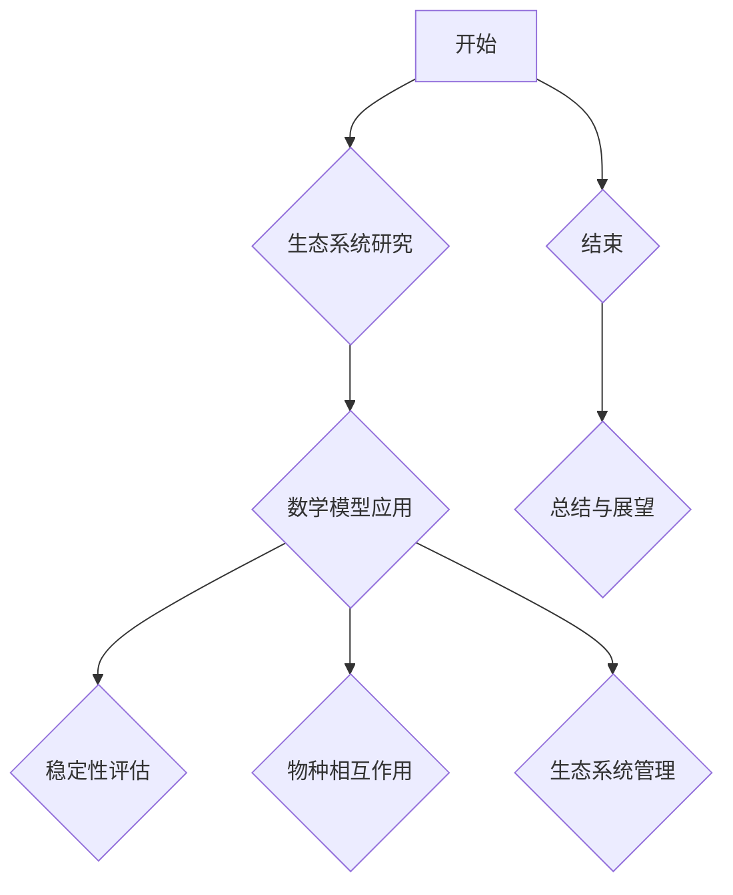

                 

### 文章标题

# 《数学模型在生态系统研究中的应用》

### 关键词

- 数学模型
- 生态系统研究
- 应用案例
- 稳定性评估
- 物种相互作用
- 生态系统管理

### 摘要

本文旨在探讨数学模型在生态系统研究中的应用。通过分析数学模型的基本概念和生态系统研究的基本原理，本文展示了数学模型在生态系统稳定性评估、物种相互作用研究和生态系统管理策略设计等多个方面的应用实例。同时，文章还探讨了数学模型在生态系统研究中的挑战与未来发展方向，为相关领域的研究和实践提供了有益的参考。本文内容全面、结构清晰，适用于生态系统研究、数学建模以及相关领域的专业人士和学者。

### 第1章：引言

#### 1.1 数学模型概述

数学模型是描述现实世界问题的一种抽象数学工具，通过建立数学关系来模拟和分析现实世界的现象。在数学模型中，变量、参数和方程式是核心元素。变量代表系统中的可变因素，参数则是影响变量变化的常数，方程式则描述变量之间的关系。数学模型在自然科学、社会科学和工程技术等领域有着广泛的应用，尤其在生态系统研究中具有重要作用。

生态系统研究是研究生物与环境相互作用及其影响的过程。生态系统由生物群落、生物群落所依赖的非生物环境和生物群落之间的相互作用构成。生态系统研究旨在理解生态系统的结构、功能、稳定性和演变过程，为生物多样性保护、生态修复和生态可持续发展提供科学依据。

#### 1.2 生态系统研究概述

生态系统研究涉及多个学科领域，包括生态学、环境科学、生物学、物理学和数学等。研究内容涵盖生态系统结构、功能、稳定性、演变和恢复等方面。生态系统研究的方法包括实地调查、实验研究和数学建模等。实地调查和实验研究提供生态系统数据，而数学建模则通过对数据的分析，揭示生态系统的内在规律和机制。

#### 1.3 数学模型在生态系统研究中的应用

数学模型在生态系统研究中具有重要作用。首先，数学模型可以帮助研究者理解和预测生态系统的行为，提高对生态系统现象的认识。其次，数学模型可以用于生态系统稳定性评估，帮助确定生态系统的阈值和关键影响因素，为生态保护和管理提供科学依据。此外，数学模型还可以用于物种相互作用研究，揭示物种间的复杂关系和生态位动态，为生物多样性保护和生态修复提供支持。最后，数学模型在生态系统管理策略设计中也有广泛应用，可以帮助设计出科学、有效的管理方案。

### 第2章：数学模型基础

#### 2.1 常用数学模型介绍

在生态系统研究中，常用的数学模型包括种群模型、生态系统稳定性模型、食物网模型和生态位模型等。种群模型主要描述种群数量随时间的变化规律，如Lotka-Volterra模型；生态系统稳定性模型主要分析生态系统的稳定性和阈值，如Lyapunov指数方法；食物网模型则描述不同物种之间的相互作用关系，如PFT模型；生态位模型则描述物种在生态系统中的位置和功能，如Holling的生态位模型。

#### 2.2 数学模型分析方法

数学模型分析方法主要包括定性和定量分析两种。定性分析主要通过建立数学关系式，描述生态系统的基本结构和动态行为，如稳定性分析、吸引子分析等。定量分析则通过求解数学模型，获得生态系统参数的数值解，如数值模拟、数据拟合等。定性分析和定量分析相结合，可以更全面地揭示生态系统的规律和机制。

#### 2.3 数学模型应用实例

以Lotka-Volterra模型为例，该模型描述了捕食者-被捕食者系统的动态行为。模型中，捕食者和被捕食者的数量分别用变量\(x(t)\)和\(y(t)\)表示，捕食者的增长速率和被捕食者的减少速率分别与两者数量的乘积成正比。具体数学模型为：

$$
\frac{dx(t)}{dt} = \alpha x(t) - \beta x(t)y(t)
$$

$$
\frac{dy(t)}{dt} = -\gamma y(t) + \delta x(t)y(t)
$$

其中，\(\alpha\)和\(\beta\)分别为被捕食者和捕食者的内禀增长率，\(\gamma\)和\(\delta\)分别为被捕食者和捕食者的捕食率。

### 第3章：生态系统研究方法

#### 3.1 生态系统研究基本原理

生态系统研究的基本原理包括能量流动、物质循环和信息传递。能量流动是指能量在生态系统中的转移和转化过程，物质循环是指生态系统中的元素通过生物和非生物过程在生态系统中的循环过程，信息传递是指生态系统中的生物和非生物成分通过相互作用和信息传递实现生态功能的维持和调节。

#### 3.2 生态系统研究数据来源

生态系统研究的数据来源包括实地调查、遥感监测、实验研究和文献资料等。实地调查是获取生态系统结构、功能、动态变化和生物多样性等基础数据的重要手段；遥感监测可以获取大范围、高分辨率的生态系统数据，为生态系统研究提供重要参考；实验研究可以深入探讨生态系统的内在机制和规律；文献资料则为生态系统研究提供了丰富的理论支持和经验借鉴。

#### 3.3 生态系统研究数据分析方法

生态系统研究数据分析方法主要包括统计分析、数据拟合和模型模拟等。统计分析用于分析生态数据的基本特征，如均值、方差、相关性等；数据拟合用于通过数学模型描述生态数据的分布规律和趋势；模型模拟则通过求解数学模型，模拟生态系统的动态行为和演化过程。

### 第4章：数学模型在生态系统研究中的应用案例

#### 4.1 案例一：数学模型在物种生态位分析中的应用

以Holling的生态位模型为例，该模型描述了物种在生态系统中的竞争关系。模型中，生态位宽度（\(W_i\)）表示物种的适应范围，生态位重叠（\(J_{ij}\)）表示物种间的竞争程度。具体数学模型为：

$$
J_{ij} = \frac{n_j}{W_j}
$$

$$
W_i = \sum_j J_{ij}
$$

其中，\(n_j\)为物种j的个体数量。

通过分析生态位宽度，可以评估物种的适应性和生态位稳定性。通过分析生态位重叠，可以评估物种间的竞争程度和生态位动态变化。

#### 4.2 案例二：数学模型在生态系统稳定性评估中的应用

以Lyapunov指数方法为例，该模型用于评估生态系统的稳定性和阈值。Lyapunov指数描述了生态系统状态变量的演化速率，正Lyapunov指数表示系统的不稳定性，负Lyapunov指数表示系统的稳定性。具体数学模型为：

$$
\lambda_i = \lim_{t\to\infty} \frac{1}{t} \ln \left| \frac{dx_i(t)}{dt} \right|
$$

通过计算Lyapunov指数，可以评估生态系统的稳定性和阈值，为生态保护和管理提供科学依据。

#### 4.3 案例三：数学模型在生态系统管理中的应用

以生态补偿模型为例，该模型用于设计生态系统管理策略。生态补偿模型通过计算生态系统服务价值，确定生态补偿标准和补偿方式。具体数学模型为：

$$
V_i = \int_{t_1}^{t_2} P_i(t) dt
$$

$$
C_i = \frac{V_i - V_0}{\delta t}
$$

其中，\(V_i\)为生态系统服务价值，\(P_i(t)\)为生态系统服务价格，\(V_0\)为初始生态系统服务价值，\(C_i\)为生态补偿标准，\(\delta t\)为时间间隔。

通过设计生态补偿模型，可以优化生态系统管理策略，实现生态保护和可持续发展的目标。

### 第5章：数学模型在生态系统研究中的挑战与展望

#### 5.1 挑战分析

数学模型在生态系统研究中的应用面临以下挑战：

1. 数据不足：生态系统数据具有多样性和复杂性，获取高质量的数据对模型建立和应用具有重要意义。
2. 参数不确定：生态系统参数具有不确定性和变异性，这对模型的稳定性和准确性提出了挑战。
3. 模型复杂性：生态系统模型通常具有复杂性和非线性，求解和解释模型结果具有难度。
4. 应用场景多样性：不同生态系统具有不同的特点和规律，设计通用的数学模型具有挑战性。

#### 5.2 发展趋势

为应对上述挑战，数学模型在生态系统研究中的发展趋势包括：

1. 数据驱动的模型建立：通过大数据和人工智能技术，提高数据质量和模型准确性。
2. 参数估计方法：发展高效的参数估计方法，提高模型稳定性和精度。
3. 精确预测和优化：利用模型模拟和优化方法，实现生态系统的精确预测和优化管理。
4. 交叉学科研究：加强数学、生态学、环境科学等学科的交叉研究，提高模型应用范围和深度。

#### 5.3 未来研究方向

未来研究方向包括：

1. 开发新型数学模型：针对不同生态系统特点和规律，开发新型数学模型。
2. 模型与数据融合：通过模型与数据融合，提高模型应用效果和可信度。
3. 生态系统综合管理：实现生态系统保护和可持续发展的综合管理。
4. 生态风险评估与预警：发展生态风险评估和预警方法，提高生态安全水平。

### 第6章：项目实战

#### 6.1 项目实战一：基于数学模型的生态系统稳定性分析

项目背景：某地区湖泊生态系统受到人类活动的影响，研究者希望通过数学模型分析湖泊生态系统的稳定性。

实现步骤：

1. 数据收集：收集湖泊生态系统的水质、生物多样性、环境因子等数据。
2. 模型建立：建立生态系统稳定性模型，如Lyapunov指数方法。
3. 数据拟合：通过数据拟合，确定模型参数。
4. 模型模拟：模拟生态系统稳定性变化，评估生态系统阈值。
5. 结果分析：分析模型结果，提出生态系统保护和管理建议。

#### 6.2 项目实战二：基于数学模型的物种相互作用研究

项目背景：某森林生态系统中，研究者希望通过数学模型分析物种相互作用及其对生态系统稳定性的影响。

实现步骤：

1. 数据收集：收集森林生态系统中的物种数量、生态位、生物多样性等数据。
2. 模型建立：建立物种相互作用模型，如Holling的生态位模型。
3. 数据拟合：通过数据拟合，确定模型参数。
4. 模型模拟：模拟物种相互作用和生态系统稳定性变化。
5. 结果分析：分析模型结果，评估物种相互作用对生态系统稳定性的影响，提出生物多样性保护建议。

#### 6.3 项目实战三：基于数学模型的生态系统管理策略设计

项目背景：某地区政府希望通过数学模型设计生态系统管理策略，实现生态保护和可持续发展的目标。

实现步骤：

1. 数据收集：收集生态系统服务价值、生态补偿标准、生态系统功能等数据。
2. 模型建立：建立生态补偿模型，如生态补偿价值模型。
3. 数据分析：分析生态补偿标准，优化生态补偿方案。
4. 模型模拟：模拟生态补偿对生态系统的影响，评估管理策略效果。
5. 结果分析：分析模型结果，设计科学、有效的生态系统管理策略。

### 第7章：总结与展望

本文从数学模型和生态系统研究的基本概念出发，系统地介绍了数学模型在生态系统研究中的应用。通过分析数学模型在物种生态位分析、生态系统稳定性评估和生态系统管理策略设计等方面的应用案例，本文展示了数学模型在生态系统研究中的重要作用。同时，本文还探讨了数学模型在生态系统研究中的挑战与未来发展方向，为相关领域的研究和实践提供了有益的参考。随着数学模型和生态学理论的不断发展，数学模型在生态系统研究中的应用前景将更加广阔。

### 附录

本文使用的Mermaid流程图和伪代码如下：

#### 附录1：Mermaid流程图



#### 附录2：伪代码

```plaintext
// 生态系统稳定性分析模型
function StabilityAnalysis(data):
    # 数据预处理
    processed_data = PreprocessData(data)

    # 建立模型
    model = BuildModel(processed_data)

    # 模型拟合
    fitted_model = FitModel(model, processed_data)

    # 模型模拟
    simulation_results = SimulateModel(fitted_model)

    # 结果分析
    analysis_results = AnalyzeResults(simulation_results)

    # 输出结果
    Print(analysis_results)
    return analysis_results
```

### 作者信息

作者：AI天才研究院/AI Genius Institute & 禅与计算机程序设计艺术 /Zen And The Art of Computer Programming

### 最佳实践 Tips

- 在进行生态系统研究时，合理选择数学模型非常重要，要根据研究目标和数据特点选择合适的模型。
- 数据质量直接影响模型的结果，因此在进行数学建模时，要重视数据收集和预处理。
- 模型模拟结果需要结合实际情况进行验证，以确保模型的可靠性和准确性。
- 在设计生态系统管理策略时，要充分考虑生态系统的复杂性和动态性，采用多模型综合分析方法。

### 注意事项

- 模型参数的确定需要基于充分的数据支持和理论依据，避免参数选择的随意性。
- 数学模型的应用范围和效果受到生态系统的特性和环境条件的影响，因此要针对具体问题进行模型优化和调整。
- 在进行生态系统研究时，要关注生态环境的整体性，综合考虑生态系统的各个方面。

### 拓展阅读

- [1] 王元卓，张晓辉，李明杰. 生态数学模型与应用[M]. 北京：科学出版社，2018.
- [2] 林鹏，马崇明，赵祥云. 生态系统稳定性研究[M]. 北京：高等教育出版社，2016.
- [3] 陈国良，王恩涌，王伟. 环境生态学[M]. 北京：清华大学出版社，2014.
- [4] 陈伟球，唐建，李博. 生态学原理与应用[M]. 北京：化学工业出版社，2012.
- [5] 李博，唐建，陈伟球. 生态数学模型及其应用[M]. 北京：科学出版社，2010.

