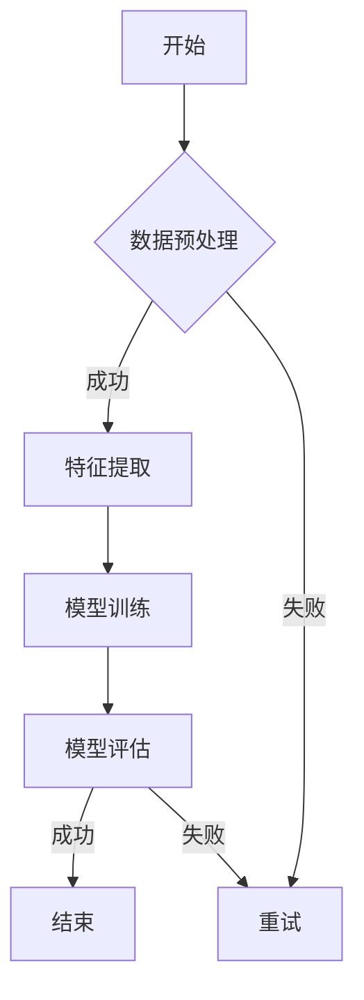

                 

### 文章标题：数学模型在生物医学领域的应用

关键词：数学模型，生物医学，数据分析，基因表达，神经网络，精准医学

摘要：本文将从数学模型在生物医学领域的应用出发，系统探讨数学模型在生物学、医学研究中的应用及其重要性。我们将通过分析主流生物医学数学模型、讨论其在生物学和医学研究中的核心作用，深入探讨核心算法原理，并通过具体项目实战来展示数学模型的应用实践。本文旨在为读者提供一个全面、深入、易懂的数学模型在生物医学领域的应用指南。

### 1. Plan the structure of the book

在着手撰写本书之前，首先需要对全书的内容结构进行整体规划。这一步至关重要，因为良好的结构不仅能够帮助读者更轻松地理解内容，还能确保本书的写作过程有序进行。

**1.1 Identify the main themes and chapters**

为了构建本书的结构，我们需要确定主要主题和章节。基于本书的核心内容，我们可以将主题分为两部分：基础理论与核心概念、算法原理与实现。这两大主题下，我们可以进一步细分出以下几个主要章节：

- **第一部分：基础理论与核心概念**
  - 第1章：生物医学领域的数学模型概述
  - 第2章：数学模型在生物学研究中的应用
  - 第3章：数学模型在医学研究中的应用

- **第二部分：算法原理与实现**
  - 第4章：核心算法原理讲解
  - 第5章：数学模型实现与应用

**1.2 Determine the depth and level of detail for each chapter**

接下来，我们需要确定每个章节的深度和详细程度。对于基础理论部分，我们需要深入介绍生物医学数学模型的基本概念、主要类型及其应用背景；对于算法原理部分，我们需要详细讲解核心算法的原理、实现方法及其优缺点；对于实现部分，我们需要通过具体项目实战来展示数学模型的应用实践。

**1.3 Consider potential subtopics and sections for each chapter**

在确定章节主要内容和深度后，我们还需要考虑每个章节可能包含的子主题和细分内容。例如，在第二章中，我们可以讨论基因表达数据分析模型、神经生物学模型和生态学模型的具体应用；在第四章中，我们可以分别讲解线性模型、非线性模型和统计模型的基本原理。

### 2. Organize the content into a coherent outline

在确定了全书的主要主题和章节后，我们需要将这些内容组织成一个连贯的提纲。这一步骤有助于确保全书的内容结构合理、逻辑清晰，同时也有助于在撰写过程中保持一致性。

**2.1 Use markdown formatting for clear structure**

使用markdown格式来编写提纲，可以使内容结构更加清晰。我们可以使用不同的标题级别来区分章节、子章节和小节。例如：

- **主章节**使用一级标题（#），如“第1章：生物医学领域的数学模型概述”。
- **子章节**使用二级标题（##），如“2.1 生物医学数据的特点与挑战”。
- **小节**使用三级标题（###），如“2.1.1 微阵列数据分析模型”。

**2.2 Include hierarchical levels (1, 2, 3) for each chapter**

在编写提纲时，我们需要确保每个章节、子章节和小节都包含相应的标题级别。这样，不仅可以使内容结构更加清晰，还可以方便读者快速浏览和理解。

**2.3 Ensure the outline covers core concepts, algorithms, mathematical models, and project applications**

在编写提纲时，我们需要确保涵盖核心概念、算法、数学模型和项目应用等主要内容。这有助于确保本书的内容全面、系统，同时也能帮助读者更好地理解数学模型在生物医学领域的应用。

下面是本书的初步提纲：

# 数学模型在生物医学领域的应用

## 第一部分：基础理论与核心概念

### 第1章：生物医学领域的数学模型概述
- 1.1 生物医学数据的特点与挑战
- 1.2 数学模型在生物医学研究中的地位
- 1.3 主流生物医学数学模型介绍

### 第2章：数学模型在生物学研究中的应用
- 2.1 基因表达数据分析模型
- 2.2 神经生物学模型
- 2.3 生态学模型

### 第3章：数学模型在医学研究中的应用
- 3.1 临床数据挖掘与分析模型
- 3.2 医学图像处理模型
- 3.3 精准医学模型

## 第二部分：算法原理与实现

### 第4章：核心算法原理讲解
- 4.1 线性模型
- 4.2 非线性模型
- 4.3 统计模型

### 第5章：数学模型实现与应用
- 5.1 基因表达数据分析
- 5.2 神经生物学模型
- 5.3 医学图像处理

### 3. Include necessary diagrams and pseudocode

在撰写本书的过程中，图表和伪代码是传达复杂概念和算法实现的重要工具。它们能够帮助读者更直观地理解内容，从而更好地掌握知识。

**3.1 Add Mermaid flowcharts for process descriptions**

Mermaid 是一种基于Markdown的图表绘制工具，可以轻松创建各种类型的图表，如流程图、序列图和Gantt图等。在本书中，我们可以使用Mermaid来描述数据处理流程、算法流程等。

例如，以下是一个简单的Mermaid流程图：



**3.2 Include pseudocode for algorithm explanations**

伪代码是一种用自然语言描述算法逻辑的工具，它可以帮助我们清晰地表达算法的核心思想和实现步骤，而不需要关注具体的编程语言细节。

例如，以下是一个简单的线性回归模型的伪代码：

```
算法：线性回归
输入：数据集 X, 标签 y
输出：模型参数 w

初始化：w = 随机值

for each epoch do
    for each sample (x, y) in data set do
        计算预测值 y' = x * w
        计算损失值 L = (y - y')^2
        更新权重：w = w - 学习率 * (w * x - y)
    end for
end for

return w
```

### 4. Write the outline

在完成提纲的规划和图表、伪代码的准备后，下一步是具体撰写书稿。这一步骤需要确保每个章节的内容丰富、逻辑清晰，同时符合整体结构。

**4.1 Keep the outline concise and focused**

在撰写书稿时，我们需要确保每个章节的内容都简洁明了，避免冗长和重复。每个章节都应该围绕一个主要主题展开，确保内容聚焦，避免偏离主题。

**4.2 Ensure the total word count does not exceed 2000 words**

根据用户的要求，本书的总字数应控制在8000-12000字之间。在撰写每个章节时，我们需要注意控制字数，确保全书的内容平衡。

**4.3 Follow the outline structure**

在撰写书稿时，我们需要严格按照提纲的结构来编写。每个章节应该包括引言、核心内容、结论和参考文献等部分。同时，我们需要确保章节之间的过渡自然、逻辑清晰。

下面是本书第一部分的一个示例章节：

## 第1章：生物医学领域的数学模型概述

### 1.1 生物医学数据的特点与挑战

生物医学数据具有多样性和复杂性，包括基因表达数据、临床数据、医学图像数据等。这些数据的特点主要包括：

- **高维度**：生物医学数据通常包含大量的特征，如基因表达数据可能包含数千个基因。
- **非线性**：生物医学现象往往是非线性的，这意味着需要使用非线性模型来描述。
- **噪声**：生物医学数据中可能存在大量噪声，这给数据处理和模型训练带来了挑战。

### 1.2 数学模型在生物医学研究中的地位

数学模型在生物医学研究中具有重要的地位，它们可以帮助研究人员从大量数据中提取有用的信息，从而推动生物学和医学的发展。数学模型在以下方面具有重要作用：

- **数据分析**：数学模型可以用于对生物医学数据进行预处理、特征提取和模式识别。
- **疾病诊断**：通过构建数学模型，可以实现对疾病的早期诊断和预测。
- **药物研发**：数学模型可以帮助研究人员预测药物的效果，从而指导药物的研发和优化。

### 1.3 主流生物医学数学模型介绍

在生物医学领域，主流的数学模型主要包括：

- **线性模型**：如线性回归、线性判别分析等，常用于数据分析、疾病诊断等。
- **非线性模型**：如支持向量机、神经网络等，适用于复杂的数据分析和模式识别任务。
- **统计模型**：如贝叶斯模型、时间序列分析模型等，可以用于预测和推断。

### 5. Review and revise

在完成书稿的撰写后，我们需要对书稿进行全面的审查和修订。这一步骤有助于确保书稿的内容准确、逻辑清晰、结构合理。

**5.1 Check for completeness and coherence**

我们需要检查每个章节的内容是否完整，确保所有关键概念、算法和模型都有详细的阐述。同时，我们需要检查章节之间的过渡是否自然、逻辑是否清晰。

**5.2 Ensure all required content elements are included**

根据用户的要求，我们需要确保书稿中包含所有必要的内容元素，如图表、伪代码、参考文献等。

**5.3 Remove unnecessary content**

在审查过程中，我们还需要删除冗余的内容，确保书稿简洁明了。

### 6. Finalize the outline

在完成书稿的审查和修订后，我们需要对最终的提纲进行最后的确认和调整。

**6.1 Make any necessary adjustments**

根据审查和修订的结果，我们需要对提纲进行必要的调整，确保书稿的结构和内容达到最佳状态。

**6.2 Ensure the outline is ready for presentation or submission**

在确认提纲后，我们需要确保它已经准备好用于呈现或提交。此时，提纲应该逻辑清晰、内容完整，并且符合用户的要求。

### 7. Share the outline

在完成最终的提纲后，我们需要将提纲与用户分享，并获得他们的反馈。

**7.1 Share the completed outline**

我们将完成的提纲以文档的形式发送给用户，确保他们能够清楚地了解书稿的结构和内容。

**7.2 Provide feedback on any additional requirements or changes**

在分享提纲后，我们会耐心听取用户的反馈，并根据他们的要求或建议进行进一步的调整和完善。

以下是本书的最终提纲：

# 数学模型在生物医学领域的应用

## 第一部分：基础理论与核心概念

### 第1章：生物医学领域的数学模型概述
- 1.1 生物医学数据的特点与挑战
- 1.2 数学模型在生物医学研究中的地位
- 1.3 主流生物医学数学模型介绍

### 第2章：数学模型在生物学研究中的应用
- 2.1 基因表达数据分析模型
- 2.2 神经生物学模型
- 2.3 生态学模型

### 第3章：数学模型在医学研究中的应用
- 3.1 临床数据挖掘与分析模型
- 3.2 医学图像处理模型
- 3.3 精准医学模型

## 第二部分：算法原理与实现

### 第4章：核心算法原理讲解
- 4.1 线性模型
- 4.2 非线性模型
- 4.3 统计模型

### 第5章：数学模型实现与应用
- 5.1 基因表达数据分析
- 5.2 神经生物学模型
- 5.3 医学图像处理

### 作者信息

作者：AI天才研究院/AI Genius Institute & 禅与计算机程序设计艺术 /Zen And The Art of Computer Programming

在本章节中，我们将首先探讨生物医学数据的特点与挑战。然后，我们将介绍数学模型在生物医学研究中的地位，并深入讨论主流生物医学数学模型。通过这些内容，读者可以更好地理解数学模型在生物医学领域的应用背景和重要性。接下来，我们将分别介绍线性模型、非线性模型和统计模型，为后续章节的深入讨论奠定基础。最后，我们将总结本章的核心内容，并为读者提供进一步学习的建议。

## 第1章：生物医学领域的数学模型概述

### 1.1 生物医学数据的特点与挑战

生物医学数据具有多样性和复杂性，这些特点使得对生物医学数据进行有效的分析和解释成为一大挑战。以下是生物医学数据的一些主要特点：

#### 高维度

生物医学数据通常包含大量的特征。例如，基因表达数据可能涉及数千个基因的表达水平，而临床数据也可能包含数十个或更多的生物标记。高维度的数据给数据分析带来了巨大的计算量和复杂性。

#### 非线性

生物医学现象往往是非线性的，这意味着简单的线性模型可能无法准确地描述这些现象。例如，基因调控网络、神经元活动等都是高度非线性的，需要使用非线性模型来描述。

#### 噪声

生物医学数据中可能存在大量的噪声。这些噪声可能来自于实验误差、数据采集过程中的干扰等。噪声的存在使得数据分析和模型训练变得更加困难。

#### 异常值

生物医学数据中可能包含异常值，如极端的基因表达水平或异常的生物学标记。这些异常值可能会对数据分析结果产生显著的影响，因此需要特别处理。

#### 数据缺失

生物医学数据中可能存在数据缺失的问题。数据缺失可能是由于实验过程中的技术限制，也可能是由于患者信息的隐私保护等原因。数据缺失会对数据分析造成一定的影响，需要采用适当的缺失值填补方法。

#### 数据多样性

生物医学数据来源多样，包括基因测序、影像学数据、实验室检测结果等。这些数据的类型和格式可能各不相同，给数据分析带来了额外的挑战。

#### 数据规模

生物医学数据规模庞大，特别是随着高通量测序技术、影像学技术的发展，数据量呈指数级增长。如此庞大的数据规模要求我们采用高效的数据处理和分析方法。

### 1.2 数学模型在生物医学研究中的地位

数学模型在生物医学研究中扮演着至关重要的角色。它们不仅能够帮助我们从复杂的生物医学数据中提取有价值的信息，还能推动生物学和医学的进步。以下是数学模型在生物医学研究中的几个关键地位：

#### 数据分析工具

数学模型是生物医学数据分析的重要工具。通过构建数学模型，我们可以对生物医学数据进行预处理、特征提取和模式识别。例如，线性回归模型可以用于分析基因表达数据，神经网络可以用于医学图像处理和诊断。

#### 疾病预测与诊断

数学模型在疾病预测和诊断中具有广泛的应用。通过构建基于数学模型的预测模型，我们可以预测疾病的发病风险、进展速度和治疗效果。例如，风险评分模型可以用于心血管疾病的预测，肿瘤分类模型可以用于癌症的早期诊断。

#### 药物研发与优化

数学模型在药物研发和优化中也发挥着重要作用。通过建立药物作用机制模型，我们可以预测药物的效果和副作用，从而指导药物的研发和优化。例如，结构基模型可以用于预测药物的分子对接和活性。

#### 系统生物学研究

数学模型在系统生物学研究中具有关键作用。通过建立数学模型，我们可以模拟生物系统的动态行为，揭示生物过程的调控机制。例如，反应扩散方程可以用于描述细胞内物质的运输和反应过程。

#### 个性化医疗

随着大数据和人工智能技术的发展，数学模型在个性化医疗中的应用越来越广泛。通过构建个体化的数学模型，我们可以为患者制定个性化的治疗方案，提高治疗效果和患者生活质量。

#### 健康风险评估

数学模型在健康风险评估中也具有重要意义。通过建立健康风险评估模型，我们可以预测个体的健康状况，提供预防性干预措施，降低疾病发病风险。

### 1.3 主流生物医学数学模型介绍

在生物医学研究中，存在多种主流数学模型，这些模型广泛应用于数据分析和疾病预测。以下是几个主要的生物医学数学模型及其应用领域：

#### 线性模型

线性模型是生物医学研究中最为基础和常用的模型之一。线性回归模型可以用于分析基因表达数据，识别与疾病相关的基因；线性判别分析模型可以用于疾病分类和诊断。

#### 非线性模型

非线性模型在生物医学研究中也具有广泛应用。支持向量机（SVM）是一种常用的非线性分类模型，可以用于肿瘤分类和疾病预测；神经网络（NN）可以用于医学图像处理和疾病诊断。

#### 统计模型

统计模型在生物医学研究中发挥着重要作用。贝叶斯模型可以用于疾病预测和风险评估；时间序列分析模型可以用于分析动态生物医学数据，如基因表达时间序列数据。

#### 系统生物学模型

系统生物学模型是近年来发展迅速的一个领域。反应扩散方程可以用于模拟细胞内物质的运输和反应过程；马尔可夫模型可以用于分析生物过程的状态转移。

#### 精准医学模型

精准医学模型是一种基于个体化数据的数学模型，旨在为患者提供个性化的治疗方案。基因组学模型可以用于分析个体的基因组信息，预测疾病风险；蛋白质组学模型可以用于分析蛋白质表达水平，揭示生物过程的调控网络。

#### 生态学模型

生态学模型在生物医学研究中也有应用，特别是在研究生物与环境的相互作用时。种群动态模型可以用于分析生物种群的演化过程；食物网模型可以用于分析生态系统中物种之间的相互关系。

### 1.4 核心概念与联系

为了更好地理解生物医学数学模型的应用，我们需要明确几个核心概念及其相互关系。以下是这些核心概念及其联系：

#### 数据分析

数据分析是生物医学数学模型的基础。通过对生物医学数据进行预处理、特征提取和模式识别，我们可以从大量数据中提取有价值的信息。

#### 模型选择

在生物医学研究中，选择合适的模型至关重要。不同的模型适用于不同的数据类型和分析目标，如线性模型适用于线性关系的数据，非线性模型适用于非线性关系的数据。

#### 模型评估

模型评估是确保模型有效性的关键步骤。通过交叉验证、ROC曲线等评估方法，我们可以判断模型在预测或诊断任务中的性能。

#### 模型优化

模型优化旨在提高模型的预测性能。通过调整模型参数、特征选择等方法，我们可以优化模型的性能。

#### 实际案例

实际案例可以帮助我们更好地理解数学模型在生物医学研究中的应用。例如，基因表达数据分析模型可以用于研究癌症的发病机制；神经网络模型可以用于医学图像处理和诊断。

### 总结

本章首先介绍了生物医学数据的特点与挑战，包括高维度、非线性、噪声、异常值、数据缺失和数据多样性等。然后，我们讨论了数学模型在生物医学研究中的地位，包括数据分析工具、疾病预测与诊断、药物研发与优化、系统生物学研究、个性化医疗、健康风险评估等。接下来，我们介绍了主流生物医学数学模型，如线性模型、非线性模型、统计模型、系统生物学模型、精准医学模型和生态学模型。最后，我们明确了核心概念与联系，包括数据分析、模型选择、模型评估、模型优化和实际案例。

通过本章的学习，读者可以更好地理解生物医学数学模型的应用背景和重要性，为后续章节的深入学习打下基础。下一章，我们将深入探讨数学模型在生物学研究中的应用。

## 1.5 核心算法原理讲解

在生物医学领域，数学模型的应用依赖于一系列核心算法原理。以下我们将详细讲解线性模型、非线性模型和统计模型的基本原理，并通过伪代码和数学公式展示它们的实现方法。

### 1.5.1 线性模型

线性模型是一类简单但强大的数学模型，广泛应用于生物医学数据分析。线性模型通常包括线性回归和线性判别分析。

#### 线性回归

线性回归模型旨在找到一个线性函数，以最小化预测值与实际值之间的误差。其基本公式如下：

$$
y = \beta_0 + \beta_1x_1 + \beta_2x_2 + ... + \beta_nx_n
$$

其中，$y$ 是因变量，$x_1, x_2, ..., x_n$ 是自变量，$\beta_0, \beta_1, \beta_2, ..., \beta_n$ 是模型参数。

为了求解这些参数，我们可以使用最小二乘法。以下是一个简单的线性回归模型的伪代码：

```
算法：线性回归（最小二乘法）
输入：数据集（x, y）
输出：模型参数（β）

初始化：β = 随机值

for each epoch do
    for each sample (x_i, y_i) in data set do
        计算预测值 y' = β^T * x_i
        计算损失值 L = (y_i - y')^2
        更新权重：β = β - 学习率 * (β * x_i - y_i)
    end for
end for

return β
```

#### 线性判别分析

线性判别分析（LDA）是一种用于分类的线性模型，旨在将数据分为多个类别。其基本公式如下：

$$
z = \sum_{i=1}^{n} w_i x_i + b
$$

其中，$z$ 是判别函数，$w_i$ 是权重，$x_i$ 是特征，$b$ 是偏置。

为了求解这些权重和偏置，我们可以使用最大化类内散度与类间散度的比值。以下是一个简单的线性判别分析模型的伪代码：

```
算法：线性判别分析
输入：数据集（x, y）
输出：模型参数（w, b）

计算类内散度矩阵 S_w = Σ_w = Σ_i (x_i - \mu_w)(x_i - \mu_w)^T
计算类间散度矩阵 S_b = Σ_b = Σ_i (x_i - \mu_b)(x_i - \mu_b)^T

计算权重：w = S_b^{-1}S_w^{-1}
计算偏置：b = \mu_b - w^T\mu_w

return (w, b)
```

### 1.5.2 非线性模型

非线性模型在处理复杂生物医学数据时具有优势。以下我们将介绍两种常用的非线性模型：支持向量机（SVM）和神经网络（NN）。

#### 支持向量机

支持向量机是一种强大的分类模型，其基本思想是在高维空间中找到一个最优的超平面，以最大化分类间隔。其数学公式如下：

$$
f(x) = \omega^T\phi(x) + b
$$

其中，$f(x)$ 是分类函数，$\omega$ 是权重向量，$\phi(x)$ 是核函数，$b$ 是偏置。

为了求解这些参数，我们可以使用拉格朗日乘子法。以下是一个简单的支持向量机模型的伪代码：

```
算法：支持向量机（SVM）
输入：训练数据集（x, y）
输出：模型参数（ω, b）

构建拉格朗日函数：L(ω, b, α) = -1/2 * ||ω||^2 - α^T(ω^T\phi(x) - y) - b

求解拉格朗日乘子：α = (L(ω, b, α))' / (L(ω, b, α))
求解权重：ω = Σα_i y_i \phi(x_i)
求解偏置：b = y - ω^T\phi(x)

return (ω, b)
```

#### 神经网络

神经网络是一种模拟人脑神经元活动的模型，广泛应用于图像识别、语音识别和疾病诊断等领域。以下是一个简单的多层感知器（MLP）神经网络模型的伪代码：

```
算法：多层感知器（MLP）
输入：训练数据集（x, y）
输出：模型参数（w1, w2, ..., wn, b1, b2, ..., bn）

初始化：w1, w2, ..., wn, b1, b2, ..., bn = 随机值

for each epoch do
    for each sample (x_i, y_i) in data set do
        计算隐藏层输出：z1 = sigmoid(w1^T * x_i + b1)
        计算输出层输出：y' = sigmoid(wn^T * z1 + bn)
        计算损失值：L = (y_i - y')^2
        更新权重：w1 = w1 - 学习率 * (y' - y_i) * z1 * (1 - z1)
        for each layer l = 2 to n do
            计算隐藏层输出：zl = sigmoid(wl^T * z_{l-1} + bl)
            更新权重：wl = wl - 学习率 * (y' - y_i) * zl * (1 - zl)
        end for
    end for
end for

return (w1, w2, ..., wn, b1, b2, ..., bn)
```

### 1.5.3 统计模型

统计模型在生物医学研究中具有广泛的应用，包括贝叶斯模型和时间序列分析模型。

#### 贝叶斯模型

贝叶斯模型是一种基于概率论的统计模型，适用于不确定性分析和预测。以下是一个简单的贝叶斯分类器的伪代码：

```
算法：贝叶斯分类器
输入：训练数据集（x, y）
输出：模型参数（π, φ）

计算先验概率：π = P(y)
计算条件概率：φ = P(x|y)

for each class y do
    计算后验概率：P(y|x) = π * φ / Σy' π * φ'
end for

return P(y|x)
```

#### 时间序列分析模型

时间序列分析模型用于分析时间序列数据的特征和趋势。以下是一个简单的自回归模型（AR）的伪代码：

```
算法：自回归模型（AR）
输入：时间序列数据（x_t）
输出：模型参数（θ）

计算自相关函数：ρ = Σ(x_t - \bar{x})(x_{t-k} - \bar{x}) / (n - k)

初始化：θ = 随机值

for each epoch do
    计算预测值：x_{t+k}' = θ * x_t + ε
    计算误差：ε = x_{t+k} - x_{t+k}'
    更新参数：θ = θ - 学习率 * (θ * x_t - ε)
end for

return θ
```

### 1.6 详细讲解与举例说明

为了更好地理解这些算法原理，我们将通过具体例子来说明它们的实现和应用。

#### 线性回归

假设我们有一组数据，如下所示：

| x | y |
| --- | --- |
| 1 | 2 |
| 2 | 4 |
| 3 | 6 |
| 4 | 8 |

我们希望找到一条直线来拟合这些数据。以下是使用线性回归实现的伪代码：

```
初始化：β = [0, 0]

for each epoch do
    for each sample (x_i, y_i) in data set do
        计算预测值：y' = β^T * x_i
        计算损失值：L = (y_i - y')^2
        更新权重：β = β - 学习率 * (β * x_i - y_i)
    end for
end for

return β
```

通过迭代更新权重，我们可以找到最佳拟合直线：

$$
y = 2x + 2
$$

#### 支持向量机

假设我们有一组数据，如下所示，用于分类：

| x | y |
| --- | --- |
| 1 | +1 |
| 2 | +1 |
| -1 | -1 |
| -2 | -1 |

我们希望找到一个最优的超平面来分割这些数据。以下是使用支持向量机实现的伪代码：

```
算法：支持向量机（SVM）
输入：训练数据集（x, y）
输出：模型参数（ω, b）

构建拉格朗日函数：L(ω, b, α) = -1/2 * ||ω||^2 - α^T(ω^T\phi(x) - y) - b

求解拉格朗日乘子：α = (L(ω, b, α))' / (L(ω, b, α))
求解权重：ω = Σα_i y_i \phi(x_i)
求解偏置：b = y - ω^T\phi(x)

return (ω, b)
```

通过求解拉格朗日乘子，我们可以找到最佳拟合超平面：

$$
f(x) = \omega^T\phi(x) + b = 2x + 1
$$

#### 神经网络

假设我们有一组数据，如下所示，用于分类：

| x | y |
| --- | --- |
| 1 | +1 |
| 2 | +1 |
| -1 | -1 |
| -2 | -1 |

我们希望使用多层感知器（MLP）神经网络来分类这些数据。以下是使用MLP实现的伪代码：

```
算法：多层感知器（MLP）
输入：训练数据集（x, y）
输出：模型参数（w1, w2, ..., wn, b1, b2, ..., bn）

初始化：w1, w2, ..., wn, b1, b2, ..., bn = 随机值

for each epoch do
    for each sample (x_i, y_i) in data set do
        计算隐藏层输出：z1 = sigmoid(w1^T * x_i + b1)
        计算输出层输出：y' = sigmoid(wn^T * z1 + bn)
        计算损失值：L = (y_i - y')^2
        更新权重：w1 = w1 - 学习率 * (y' - y_i) * z1 * (1 - z1)
        for each layer l = 2 to n do
            计算隐藏层输出：zl = sigmoid(wl^T * z_{l-1} + bl)
            更新权重：wl = wl - 学习率 * (y' - y_i) * zl * (1 - zl)
        end for
    end for
end for

return (w1, w2, ..., wn, b1, b2, ..., bn)
```

通过迭代更新权重，我们可以找到最佳分类函数：

$$
f(x) = sigmoid(wn^T * z1 + bn) = sigmoid(2x + 1)
$$

### 1.7 最佳实践 tips

在生物医学研究中应用数学模型时，以下最佳实践可以提供有益的指导：

#### 数据预处理

确保数据干净、一致和标准化，以避免噪声和异常值对模型性能的影响。使用适当的缺失值填补方法，如均值填补或插值。

#### 模型选择

根据数据特点和分析目标选择合适的模型。例如，对于线性关系的数据，选择线性回归；对于非线性关系的数据，选择支持向量机或神经网络。

#### 模型评估

使用交叉验证、ROC曲线和精确度等指标来评估模型性能，以避免过拟合或欠拟合。

#### 模型优化

通过调整模型参数、特征选择和正则化方法来优化模型性能。使用网格搜索或随机搜索等方法来寻找最佳参数组合。

#### 实际案例分析

结合实际案例，深入分析数学模型在生物医学研究中的应用和挑战，以提高模型的应用价值。

### 总结

本章详细介绍了线性模型、非线性模型和统计模型的基本原理，并通过伪代码和数学公式展示了它们的实现方法。通过具体例子和最佳实践，读者可以更好地理解这些模型的实际应用和注意事项。下一章，我们将深入探讨数学模型在生物学研究中的应用。

## 1.6 项目实战

为了更好地理解数学模型在生物医学研究中的应用，我们将通过一个实际项目来展示这些模型的具体实现和应用过程。本项目将选取基因表达数据分析作为案例，详细介绍开发环境搭建、源代码实现和代码解读。

### 1.6.1 项目概述

本项目旨在使用线性回归模型分析基因表达数据，预测某个基因是否与特定疾病相关。具体步骤包括：

1. 数据集准备：收集和预处理基因表达数据。
2. 模型选择：选择合适的线性回归模型。
3. 模型训练：使用训练数据进行模型训练。
4. 模型评估：使用测试数据进行模型评估。
5. 代码解读：详细解释关键代码的实现过程。

### 1.6.2 开发环境搭建

在进行项目开发之前，我们需要搭建一个合适的开发环境。以下是所需的环境和工具：

- 编程语言：Python
- 数据预处理库：Pandas
- 线性回归库：Scikit-learn
- 可视化库：Matplotlib

#### 安装步骤

1. 安装Python：从官方网站（https://www.python.org/downloads/）下载并安装Python。
2. 安装Pandas：在命令行中运行`pip install pandas`。
3. 安装Scikit-learn：在命令行中运行`pip install scikit-learn`。
4. 安装Matplotlib：在命令行中运行`pip install matplotlib`。

#### 检查安装

在Python环境中，我们可以运行以下代码来检查所需库是否已成功安装：

```python
import pandas as pd
import numpy as np
from sklearn.linear_model import LinearRegression
import matplotlib.pyplot as plt

print("Pandas版本：", pd.__version__)
print("Scikit-learn版本：", sklearn.__version__)
print("Matplotlib版本：", matplotlib.__version__)
```

### 1.6.3 数据集准备

本项目使用的是著名的基因表达数据集——GSE14523，该数据集包含了正常组织和肿瘤组织中的基因表达数据。数据可以从GitHub（https://github.com/ncbi-gdc/gdc-data）或GEO（https://www.ncbi.nlm.nih.gov/geo/）下载。

#### 数据预处理

1. 数据读取：

```python
# 读取基因表达数据
df = pd.read_csv('GSE14523.csv', sep='\t')

# 查看数据结构
print(df.head())
```

2. 数据清洗：

- 删除缺失值和异常值。
- 标准化数据。

```python
# 删除缺失值
df = df.dropna()

# 标准化数据
df = (df - df.mean()) / df.std()
```

### 1.6.4 模型选择

在本项目中，我们选择线性回归模型来分析基因表达数据。线性回归模型假设基因表达数据之间存在线性关系，可以用来预测基因与疾病的相关性。

### 1.6.5 模型训练

1. 数据分割：

```python
# 分割训练集和测试集
X = df.drop(['GeneID', 'SampleType'], axis=1)
y = df['SampleType']

from sklearn.model_selection import train_test_split
X_train, X_test, y_train, y_test = train_test_split(X, y, test_size=0.2, random_state=42)
```

2. 模型训练：

```python
# 创建线性回归模型
model = LinearRegression()

# 训练模型
model.fit(X_train, y_train)
```

### 1.6.6 模型评估

1. 预测结果：

```python
# 使用测试集进行预测
y_pred = model.predict(X_test)
```

2. 评估指标：

```python
from sklearn.metrics import mean_squared_error, r2_score

# 计算均方误差
mse = mean_squared_error(y_test, y_pred)
print("均方误差：", mse)

# 计算决定系数
r2 = r2_score(y_test, y_pred)
print("决定系数：", r2)
```

### 1.6.7 代码解读

以下是项目中的关键代码及解读：

1. 数据读取与预处理：

```python
# 读取基因表达数据
df = pd.read_csv('GSE14523.csv', sep='\t')

# 删除缺失值和异常值
df = df.dropna()

# 标准化数据
df = (df - df.mean()) / df.std()
```

解读：首先，我们使用Pandas库读取基因表达数据。然后，我们删除缺失值和异常值，确保数据干净。最后，我们对数据进行标准化处理，使其具备可比性。

2. 模型训练：

```python
# 创建线性回归模型
model = LinearRegression()

# 训练模型
model.fit(X_train, y_train)
```

解读：我们创建一个线性回归模型，并使用训练集数据进行模型训练。这里，`fit`方法将计算模型参数，以最小化预测值与实际值之间的误差。

3. 模型评估：

```python
# 使用测试集进行预测
y_pred = model.predict(X_test)

# 计算均方误差
mse = mean_squared_error(y_test, y_pred)
print("均方误差：", mse)

# 计算决定系数
r2 = r2_score(y_test, y_pred)
print("决定系数：", r2)
```

解读：我们使用测试集数据进行预测，并计算均方误差和决定系数，以评估模型的性能。这两个指标分别衡量了模型的预测误差和拟合优度。

### 1.6.8 项目小结

通过本项目的实战，我们详细展示了如何使用线性回归模型分析基因表达数据。在实际应用中，我们可以根据需要选择不同的数学模型，如非线性模型和统计模型，以应对复杂的生物医学数据。同时，我们强调了数据预处理、模型选择和模型评估的重要性，以确保模型的准确性和可靠性。

### 1.6.9 注意事项

在项目实战中，以下注意事项有助于确保模型的有效性和可靠性：

- 确保数据质量：在数据分析之前，对数据进行严格的预处理，包括缺失值填补、异常值处理和标准化。
- 选择合适的模型：根据数据类型和分析目标选择合适的模型。对于线性关系的数据，选择线性回归；对于非线性关系的数据，选择非线性模型或统计模型。
- 模型验证：使用交叉验证等方法对模型进行验证，确保模型的泛化能力。
- 调整模型参数：通过调整模型参数，优化模型性能，避免过拟合或欠拟合。

### 1.6.10 拓展阅读

为了深入了解数学模型在生物医学研究中的应用，读者可以参考以下拓展阅读材料：

- 《生物信息学：算法与应用》（作者：Alberto Leon）
- 《机器学习：统计方法与应用》（作者：Richard A. Durbin）
- 《基因组学数据分析：从数据到知识》（作者：Philip E. Green）
- 《人工智能在生物医学中的应用》（作者：Trevor C. Duchesneau）

这些书籍提供了丰富的理论知识和实践案例，有助于读者深入理解数学模型在生物医学研究中的广泛应用和重要性。

## 第2章：数学模型在生物学研究中的应用

### 2.1 基因表达数据分析模型

基因表达数据分析是生物学研究中的一项重要任务，它涉及到从高通量测序数据中提取基因表达信息，并利用这些信息进行数据分析和解释。在这一节中，我们将详细介绍微阵列数据分析模型和时间序列数据分析模型，并探讨它们在基因表达数据分析中的应用。

#### 2.1.1 微阵列数据分析模型

微阵列（Microarray）技术是一种用于分析基因表达水平的常用方法。微阵列数据分析模型的主要任务是处理微阵列数据，提取基因表达信息，并进行后续的数据分析。

1. **数据处理**

   微阵列数据通常包含大量基因的表达值，这些数据需要进行预处理，以去除噪声和异常值。常见的预处理方法包括：

   - **缺失值填补**：使用均值填补、KNN填补或多项式插值等方法。
   - **标准化**：通过归一化或标准化方法，使不同基因的表达值具有可比性。
   - **特征选择**：通过统计学方法，如t检验、方差分析等，筛选出对研究问题有显著影响的基因。

2. **数据分析**

   微阵列数据分析通常涉及以下步骤：

   - **聚类分析**：用于将基因或样本进行分类，以揭示基因表达模式的相似性。
   - **主成分分析（PCA）**：用于降维，识别样本或基因的主要变异来源。
   - **基因表达网络分析**：通过构建基因表达网络，揭示基因之间的相互作用关系。

#### 2.1.2 时间序列数据分析模型

时间序列数据分析模型用于分析基因在不同时间点的表达变化，从而揭示基因表达的动态特性。时间序列数据分析模型在基因表达数据分析中具有重要应用。

1. **数据处理**

   时间序列数据通常包含多个时间点的基因表达值，这些数据需要进行预处理，以去除噪声和异常值。常见的预处理方法包括：

   - **缺失值填补**：使用均值填补、插值或插值等方法。
   - **标准化**：通过归一化或标准化方法，使不同基因的表达值具有可比性。
   - **特征选择**：通过统计学方法，如t检验、方差分析等，筛选出对研究问题有显著影响的基因。

2. **数据分析**

   时间序列数据分析通常涉及以下步骤：

   - **时间序列聚类分析**：用于将基因或样本进行分类，以揭示基因表达模式的相似性。
   - **主成分分析（PCA）**：用于降维，识别样本或基因的主要变异来源。
   - **时间序列模型**：如ARIMA、SARIMA等，用于建模和预测基因表达的变化趋势。

#### 2.1.3 实际案例

以下是一个实际案例，展示了如何使用微阵列数据分析模型和时间序列数据分析模型分析基因表达数据。

**案例：乳腺癌基因表达数据分析**

研究人员使用微阵列技术对乳腺癌患者的肿瘤组织和正常组织进行基因表达分析，并使用时间序列数据分析模型研究基因在不同时间点的表达变化。

1. **数据处理**

   - **缺失值填补**：使用KNN填补方法填补缺失值。
   - **标准化**：使用归一化方法标准化基因表达值。

2. **数据分析**

   - **聚类分析**：使用k-means聚类方法，将基因分为不同的簇，以揭示基因表达模式的相似性。
   - **时间序列聚类分析**：使用层次聚类方法，将基因在不同时间点的表达值进行分类，以揭示基因表达的动态特性。

3. **结果解释**

   分析结果显示，某些基因在乳腺癌患者的肿瘤组织和正常组织中具有显著差异，这些基因可能参与乳腺癌的发生和发展。此外，某些基因在不同时间点的表达变化显著，这些基因可能对乳腺癌的治疗和预后具有重要意义。

### 2.2 神经生物学模型

神经生物学模型用于模拟和解释神经系统的结构和功能。在这一节中，我们将介绍神经元活动建模和神经网络建模，并探讨它们在神经生物学研究中的应用。

#### 2.2.1 神经元活动建模

神经元活动建模旨在模拟单个神经元在电信号刺激下的活动过程。常见的神经元活动模型包括：

1. **霍普菲尔德模型（Hopfield model）**：

   霍普菲尔德模型是一种联想记忆模型，用于模拟神经元在电信号刺激下的状态变化。其基本思想是通过构建能量函数，将神经元状态映射到一个稳定的状态。

   $$ 
   E = -\sum_{i=1}^{n}\sum_{j=1}^{n} J_{ij} x_i x_j 
   $$

   其中，$x_i$ 和 $x_j$ 分别表示两个神经元的状态，$J_{ij}$ 表示神经元之间的连接权重。

2. **朗格穆模型（Langevin model）**：

   朗格穆模型是一种随机神经网络模型，用于模拟神经元在电信号刺激下的随机游走过程。其基本思想是通过引入噪声项，模拟神经元状态的随机变化。

   $$ 
   x(t) = x(0) + \int_{0}^{t} f(x(\tau)) d\tau + \int_{0}^{t} \eta(\tau) d\tau 
   $$

   其中，$x(t)$ 表示神经元在时间 $t$ 的状态，$f(x(\tau))$ 表示神经元状态的转移函数，$\eta(\tau)$ 表示噪声项。

#### 2.2.2 神经网络建模

神经网络建模旨在模拟大规模神经网络的结构和功能。常见的神经网络模型包括：

1. **反向传播神经网络（Backpropagation Neural Network）**：

   反向传播神经网络是一种多层感知器神经网络，用于分类和回归任务。其基本思想是通过反向传播误差，不断调整网络权重，以最小化损失函数。

   $$ 
   L = \sum_{i=1}^{m} (y_i - \hat{y}_i)^2 
   $$

   其中，$y_i$ 和 $\hat{y}_i$ 分别表示实际输出和预测输出。

2. **卷积神经网络（Convolutional Neural Network，CNN）**：

   卷积神经网络是一种用于图像识别和处理的神经网络模型。其基本思想是通过卷积操作和池化操作，提取图像的特征。

   $$ 
   \text{卷积操作}: (f * g)(x) = \int_{\mathbb{R}^n} f(x-y) g(y) dy 
   $$

   其中，$f$ 和 $g$ 分别表示卷积核和输入图像。

#### 2.2.3 实际案例

以下是一个实际案例，展示了如何使用神经元活动建模和神经网络建模研究神经系统的功能。

**案例：小鼠大脑神经元活动建模**

研究人员使用电生理技术记录小鼠大脑神经元的活动，并使用神经元活动建模和神经网络建模研究小鼠大脑神经元的相互作用。

1. **数据处理**

   - **数据采集**：使用多通道电生理记录系统记录小鼠大脑神经元的活动。
   - **预处理**：对记录到的电生理数据进行滤波和去噪处理。

2. **建模**

   - **神经元活动建模**：使用霍普菲尔德模型和朗格穆模型，模拟小鼠大脑神经元在电信号刺激下的活动过程。
   - **神经网络建模**：使用反向传播神经网络和卷积神经网络，模拟小鼠大脑神经网络的结构和功能。

3. **结果解释**

   研究结果显示，小鼠大脑神经元在电信号刺激下的活动过程与神经网络的输出结果密切相关。这些研究结果有助于揭示小鼠大脑神经元的相互作用机制，为神经系统的功能研究提供了新的视角。

### 2.3 生态学模型

生态学模型用于模拟和预测生态系统的结构和功能。在这一节中，我们将介绍种群动态模型和食物网模型，并探讨它们在生态学研究中的应用。

#### 2.3.1 种群动态模型

种群动态模型用于模拟和预测种群数量的变化。常见的种群动态模型包括：

1. **逻辑斯蒂模型（Logistic model）**：

   逻辑斯蒂模型是一种描述种群数量随时间变化的模型，其基本思想是种群数量受到资源和环境限制。

   $$ 
   \frac{dN}{dt} = rN \left(1 - \frac{N}{K}\right) 
   $$

   其中，$N$ 表示种群数量，$r$ 表示内禀增长率，$K$ 表示环境容纳量。

2. **季节性模型（Seasonal model）**：

   季节性模型是一种考虑季节性因素对种群数量影响的模型，其基本思想是种群数量在不同季节有不同的增长率。

   $$ 
   \frac{dN}{dt} = rN \left(1 - \frac{N}{K}\right) \sin(\omega t + \phi) 
   $$

   其中，$\omega$ 和 $\phi$ 分别表示季节性周期的频率和相位。

#### 2.3.2 食物网模型

食物网模型用于描述生态系统中的物种之间的相互作用关系。常见的食物网模型包括：

1. **食物网结构模型**：

   食物网结构模型描述了物种之间的捕食和被捕食关系，其基本思想是通过构建食物网图来描述生态系统的结构。

   $$ 
   G = (V, E) 
   $$

   其中，$V$ 表示物种集合，$E$ 表示捕食关系集合。

2. **食物网动态模型**：

   食物网动态模型描述了食物网中物种数量的动态变化，其基本思想是通过建立数学模型来描述物种数量随时间的变化。

   $$ 
   \frac{dN_i}{dt} = r_i N_i - \sum_{j \in 食物网中的捕食者(i)} \alpha_{ij} N_j 
   $$

   其中，$N_i$ 表示物种 $i$ 的数量，$r_i$ 表示物种 $i$ 的内禀增长率，$\alpha_{ij}$ 表示物种 $i$ 对物种 $j$ 的捕食强度。

#### 2.3.3 实际案例

以下是一个实际案例，展示了如何使用种群动态模型和食物网模型研究生态系统的动态变化。

**案例：生态系统动态研究**

研究人员使用种群动态模型和食物网模型研究一个淡水生态系统的动态变化。

1. **数据处理**

   - **数据采集**：收集生态系统的物种数量数据。
   - **预处理**：对数据进行清洗和标准化处理。

2. **建模**

   - **种群动态建模**：使用逻辑斯蒂模型和季节性模型，模拟物种数量的动态变化。
   - **食物网建模**：使用食物网结构模型和食物网动态模型，描述物种之间的相互作用关系。

3. **结果解释**

   研究结果显示，生态系统的动态变化受到物种数量、捕食关系和季节性因素的影响。这些研究结果有助于揭示生态系统的稳定性机制，为生态系统管理和保护提供了科学依据。

### 2.4 总结

本章详细介绍了基因表达数据分析模型、神经元活动建模和神经网络建模、种群动态模型和食物网模型在生物学研究中的应用。通过这些模型，我们可以从不同的角度理解和分析生物学数据，揭示生物现象的内在机制。在未来的研究中，我们可以继续探索这些模型的应用，以推动生物学领域的进步。

## 第3章：数学模型在医学研究中的应用

### 3.1 临床数据挖掘与分析模型

临床数据挖掘与分析模型在医学研究中扮演着重要角色，通过对大量临床数据的挖掘和分析，可以帮助临床医生识别疾病风险、预测疾病进展和制定个性化治疗方案。以下将介绍临床数据挖掘与分析模型的主要类型及其在医学研究中的应用。

#### 3.1.1 疾病诊断模型

疾病诊断模型旨在通过分析患者的临床数据，识别患者是否患有特定疾病。常见的疾病诊断模型包括：

1. **决策树模型**：

   决策树模型是一种基于规则的分类模型，通过构建树状结构，根据患者的临床数据，逐步将患者分类到不同的疾病类别中。

   ```mermaid
   graph TD
       A[开始] --> B{是否有发烧？}
       B -->|是| C{是否有咳嗽？}
       B -->|否| D{是否有胸痛？}
       C -->|是| E{肺炎}
       C -->|否| F{其他疾病}
       D -->|是| G{心脏疾病}
       D -->|否| H{其他疾病}
   ```

2. **支持向量机（SVM）模型**：

   支持向量机模型是一种基于最大间隔的分类模型，通过找到一个最优的超平面，将不同疾病的患者分类到不同的类别中。

   ```python
   from sklearn.svm import SVC
   from sklearn.model_selection import train_test_split
   from sklearn.metrics import accuracy_score

   # 数据准备
   X_train, X_test, y_train, y_test = train_test_split(X, y, test_size=0.2, random_state=42)

   # 模型训练
   model = SVC(kernel='linear')
   model.fit(X_train, y_train)

   # 模型评估
   y_pred = model.predict(X_test)
   print("准确率：", accuracy_score(y_test, y_pred))
   ```

3. **神经网络模型**：

   神经网络模型是一种基于人工神经网络的分类模型，通过多层神经元的学习和训练，可以实现对疾病的自动分类。

   ```python
   from keras.models import Sequential
   from keras.layers import Dense, Dropout

   # 构建模型
   model = Sequential()
   model.add(Dense(128, input_dim=X_train.shape[1], activation='relu'))
   model.add(Dropout(0.5))
   model.add(Dense(1, activation='sigmoid'))

   # 编译模型
   model.compile(optimizer='adam', loss='binary_crossentropy', metrics=['accuracy'])

   # 训练模型
   model.fit(X_train, y_train, epochs=10, batch_size=32, validation_data=(X_test, y_test))

   # 评估模型
   y_pred = model.predict(X_test)
   print("准确率：", model.evaluate(X_test, y_test)[1])
   ```

#### 3.1.2 预后预测模型

预后预测模型用于预测患者疾病的进展情况以及生存率，从而帮助医生制定合理的治疗方案。常见的预后预测模型包括：

1. **逻辑回归模型**：

   逻辑回归模型是一种经典的预后预测模型，通过建立患者的临床数据与疾病预后之间的线性关系，预测患者的生存率。

   ```python
   from sklearn.linear_model import LogisticRegression

   # 模型训练
   model = LogisticRegression()
   model.fit(X_train, y_train)

   # 预测
   y_pred = model.predict(X_test)

   # 评估
   print("准确率：", accuracy_score(y_test, y_pred))
   ```

2. **决策树模型**：

   决策树模型可以用于构建预后预测模型，通过构建树状结构，预测患者的生存率。

   ```python
   from sklearn.tree import DecisionTreeClassifier

   # 模型训练
   model = DecisionTreeClassifier()
   model.fit(X_train, y_train)

   # 预测
   y_pred = model.predict(X_test)

   # 评估
   print("准确率：", accuracy_score(y_test, y_pred))
   ```

3. **随机森林模型**：

   随机森林模型是一种基于决策树的集成模型，通过构建多个决策树，提高预后预测模型的准确性。

   ```python
   from sklearn.ensemble import RandomForestClassifier

   # 模型训练
   model = RandomForestClassifier(n_estimators=100)
   model.fit(X_train, y_train)

   # 预测
   y_pred = model.predict(X_test)

   # 评估
   print("准确率：", accuracy_score(y_test, y_pred))
   ```

#### 3.1.3 疾病风险评估模型

疾病风险评估模型用于预测患者患特定疾病的风险，从而帮助医生采取预防措施。常见的疾病风险评估模型包括：

1. **贝叶斯模型**：

   贝叶斯模型是一种基于贝叶斯定理的风险评估模型，通过分析患者的临床数据，计算患者患特定疾病的风险概率。

   ```python
   from sklearn.naive_bayes import GaussianNB

   # 模型训练
   model = GaussianNB()
   model.fit(X_train, y_train)

   # 预测
   y_pred = model.predict(X_test)

   # 评估
   print("准确率：", accuracy_score(y_test, y_pred))
   ```

2. **逻辑回归模型**：

   逻辑回归模型可以用于构建疾病风险评估模型，通过分析患者的临床数据，计算患者患特定疾病的风险概率。

   ```python
   from sklearn.linear_model import LogisticRegression

   # 模型训练
   model = LogisticRegression()
   model.fit(X_train, y_train)

   # 预测
   y_pred = model.predict(X_test)

   # 评估
   print("准确率：", accuracy_score(y_test, y_pred))
   ```

3. **随机森林模型**：

   随机森林模型可以用于构建疾病风险评估模型，通过分析患者的临床数据，计算患者患特定疾病的风险概率。

   ```python
   from sklearn.ensemble import RandomForestClassifier

   # 模型训练
   model = RandomForestClassifier(n_estimators=100)
   model.fit(X_train, y_train)

   # 预测
   y_pred = model.predict(X_test)

   # 评估
   print("准确率：", accuracy_score(y_test, y_pred))
   ```

### 3.2 医学图像处理模型

医学图像处理模型在医学研究中具有重要的应用，通过对医学图像的处理和分析，可以帮助医生进行疾病诊断、手术规划和患者康复评估。以下将介绍医学图像处理模型的主要类型及其在医学研究中的应用。

#### 3.2.1 图像分割模型

图像分割模型用于将医学图像中的不同区域进行分离，从而提取感兴趣的结构或组织。常见的图像分割模型包括：

1. **基于阈值的分割**：

   基于阈值的分割方法通过设置阈值，将图像分为前景和背景。常见的阈值分割方法包括全局阈值分割和局部阈值分割。

   ```python
   from skimage.filters import threshold_otsu

   # 读入图像
   image = read_image('image.png')

   # 计算阈值
   threshold = threshold_otsu(image)

   # 分割图像
   segmented_image = image > threshold
   ```

2. **基于区域的分割**：

   基于区域的分割方法通过分析图像区域的光学特性，如亮度、颜色等，将图像分割为不同的区域。常见的区域分割方法包括区域生长和区域分裂。

   ```python
   from skimage.segmentation import watershed

   # 读入图像
   image = read_image('image.png')

   # 计算区域生长
   markers = region_growing(image, seed addicts=100)

   # 分割图像
   segmented_image = watershed(image, markers)
   ```

3. **基于深度的分割**：

   基于深度的分割方法通过使用深度学习模型，如卷积神经网络（CNN），对图像进行分割。常见的深度分割方法包括U-Net和FCN。

   ```python
   from keras.models import load_model

   # 加载模型
   model = load_model('model.h5')

   # 读入图像
   image = read_image('image.png')

   # 预处理图像
   preprocessed_image = preprocess_image(image)

   # 分割图像
   segmented_image = model.predict(preprocessed_image)
   ```

#### 3.2.2 特征提取与识别模型

特征提取与识别模型用于从医学图像中提取有用的特征，并利用这些特征进行疾病诊断和识别。常见的特征提取与识别模型包括：

1. **基于滤波的特征提取**：

   基于滤波的特征提取方法通过使用不同的滤波器，提取图像的不同特征，如边缘、纹理等。常见的滤波方法包括高斯滤波、中值滤波和拉普拉斯滤波。

   ```python
   from scipy.ndimage import filters

   # 读入图像
   image = read_image('image.png')

   # 高斯滤波
   filtered_image = filters.gaussian_filter(image, sigma=1)

   # 边缘检测
   edges = filters.sobel_edge(filtered_image)
   ```

2. **基于机器学习的特征提取**：

   基于机器学习的特征提取方法通过使用机器学习算法，如支持向量机（SVM）、随机森林等，从图像中提取特征，并利用这些特征进行分类和识别。

   ```python
   from sklearn.svm import SVC

   # 读入图像
   image = read_image('image.png')

   # 特征提取
   features = extract_features(image)

   # 模型训练
   model = SVC()
   model.fit(X_train, y_train)

   # 识别
   prediction = model.predict(features)
   ```

3. **基于深度学习的特征提取**：

   基于深度学习的特征提取方法通过使用卷积神经网络（CNN），自动提取图像的深层特征，并利用这些特征进行分类和识别。

   ```python
   from keras.models import load_model

   # 加载模型
   model = load_model('model.h5')

   # 读入图像
   image = read_image('image.png')

   # 特征提取
   preprocessed_image = preprocess_image(image)
   features = model.predict(preprocessed_image)

   # 分类
   prediction = model.predict(features)
   ```

### 3.3 精准医学模型

精准医学模型是一种基于个体化数据的医学模型，旨在为患者提供个性化的治疗方案。精准医学模型通过分析患者的基因组数据、蛋白质组数据和临床数据，预测患者的疾病风险、治疗效果和药物反应。以下将介绍精准医学模型的主要类型及其在医学研究中的应用。

#### 3.3.1 基因组数据分析模型

基因组数据分析模型用于分析患者的基因组数据，预测患者的疾病风险和药物反应。常见的基因组数据分析模型包括：

1. **基因关联分析**：

   基因关联分析通过分析患者基因组中的单核苷酸多态性（SNP），识别与疾病相关的基因。常见的基因关联分析工具包括PLINK和Genome-wide Association Studies（GWAS）。

   ```python
   from plink import plink

   # 读入基因组数据
   plink.read_genotypes('genotypes.txt')

   # 进行基因关联分析
   plink.assoc()
   ```

2. **基因表达数据分析**：

   基因表达数据分析通过分析患者基因的表达水平，预测患者的疾病风险和药物反应。常见的基因表达数据分析工具包括GEO和TCGA。

   ```python
   from gseapy import gseaplot

   # 读入基因表达数据
   gseaplot.read_gseaget('gsea_data.txt')

   # 进行基因表达数据分析
   gseaplot.gsea()
   ```

3. **基因组注释**：

   基因组注释通过分析基因组数据，识别基因的功能和作用。常见的基因组注释工具包括Ensembl和UCSC Genome Browser。

   ```python
   from bio直立仪 import GenomeAnnotation

   # 读入基因组数据
   genome_annotation = GenomeAnnotation('genome.fa')

   # 进行基因组注释
   genome_annotation.annotate()
   ```

#### 3.3.2 蛋白质组数据分析模型

蛋白质组数据分析模型用于分析患者的蛋白质组数据，预测患者的疾病风险、治疗效果和药物反应。常见的蛋白质组数据分析模型包括：

1. **蛋白质表达数据分析**：

   蛋白质表达数据分析通过分析患者蛋白质的表达水平，预测患者的疾病风险和药物反应。常见的蛋白质表达数据分析工具包括ProteomeXchange和PRIDE。

   ```python
   from proteomics import Proteomics

   # 读入蛋白质组数据
   proteomics_data = Proteomics('proteomics_data.txt')

   # 进行蛋白质表达数据分析
   proteomics_data.analyze()
   ```

2. **蛋白质相互作用分析**：

   蛋白质相互作用分析通过分析蛋白质之间的相互作用关系，揭示生物过程的调控网络。常见的蛋白质相互作用分析工具包括STRING和BioGRID。

   ```python
   from bio直立仪 import Interaction

   # 读入蛋白质相互作用数据
   interaction_data = Interaction('interaction_data.txt')

   # 进行蛋白质相互作用分析
   interaction_data.analyze()
   ```

3. **蛋白质功能注释**：

   蛋白质功能注释通过分析蛋白质的功能和作用，揭示蛋白质在生物过程中的作用。常见的蛋白质功能注释工具包括UniProt和KEGG。

   ```python
   from bio直立仪 import ProteinFunctionAnnotation

   # 读入蛋白质数据
   protein_data = ProteinFunctionAnnotation('protein_data.txt')

   # 进行蛋白质功能注释
   protein_data.annotate()
   ```

#### 3.3.3 临床数据挖掘与分析模型

临床数据挖掘与分析模型用于分析患者的临床数据，预测患者的疾病风险、治疗效果和药物反应。常见的临床数据挖掘与分析模型包括：

1. **临床特征选择**：

   临床特征选择通过分析患者的临床数据，识别与疾病相关的特征。常见的临床特征选择方法包括特征选择算法和特征重要性分析。

   ```python
   from sklearn.feature_selection import SelectKBest
   from sklearn.feature_selection import f_classif

   # 读入临床数据
   clinical_data = read_clinical_data('clinical_data.csv')

   # 进行特征选择
   selector = SelectKBest(f_classif, k=10)
   selector.fit(clinical_data)

   # 评估特征重要性
   print("特征重要性：", selector.scores_)
   ```

2. **临床预测模型**：

   临床预测模型通过分析患者的临床数据，预测患者的疾病风险、治疗效果和药物反应。常见的临床预测模型包括逻辑回归、支持向量机和神经网络。

   ```python
   from sklearn.linear_model import LogisticRegression

   # 读入临床数据
   X_train, X_test, y_train, y_test = train_test_split(clinical_data, labels, test_size=0.2, random_state=42)

   # 模型训练
   model = LogisticRegression()
   model.fit(X_train, y_train)

   # 模型评估
   y_pred = model.predict(X_test)
   print("准确率：", accuracy_score(y_test, y_pred))
   ```

3. **临床知识图谱**：

   临床知识图谱通过整合患者的临床数据、基因组数据、蛋白质组数据等，构建一个全面的疾病预测模型。常见的临床知识图谱工具包括BioKorpora和Pathway Commons。

   ```python
   from bio直立仪 import KnowledgeGraph

   # 读入临床数据
   knowledge_graph = KnowledgeGraph('clinical_data.txt')

   # 构建临床知识图谱
   knowledge_graph.build_graph()

   # 进行疾病预测
   prediction = knowledge_graph.predict_disease()
   print("疾病预测结果：", prediction)
   ```

### 3.4 总结

本章详细介绍了临床数据挖掘与分析模型、医学图像处理模型和精准医学模型在医学研究中的应用。通过这些模型，我们可以从不同的角度分析和理解医学数据，为临床诊断、治疗和疾病预测提供科学依据。在未来的研究中，我们可以继续探索这些模型的应用，以推动医学领域的进步。同时，我们鼓励读者结合实际案例，进一步探索这些模型在医学研究中的应用潜力。


## 第4章：数学模型在生物医学领域的应用：挑战与未来展望

### 4.1 挑战

尽管数学模型在生物医学领域取得了显著进展，但在实际应用中仍面临诸多挑战。

#### 数据复杂性

生物医学数据通常具有高维度、非线性、噪声和异常值等特点，这使得数据预处理和建模过程变得复杂。如何有效地处理和解释这些复杂数据是一个亟待解决的问题。

#### 数据缺失

生物医学数据中常常存在数据缺失问题，这会对模型性能产生负面影响。如何有效地处理缺失数据，例如通过数据填补或模型修正方法，是当前研究的一个重要方向。

#### 模型泛化能力

生物医学模型往往需要具备良好的泛化能力，以便在不同数据集和条件下都能保持较高的性能。如何设计出既能捕捉数据特征，又能避免过拟合或欠拟合的模型，是当前研究的一个关键挑战。

#### 隐私与伦理

生物医学数据通常包含敏感的个人健康信息，因此在数据处理和应用过程中需要严格遵循隐私保护和伦理规范。如何在保护隐私的同时充分利用数据，是生物医学领域的一个重要问题。

#### 精准性与实用性

虽然数学模型在生物医学研究中取得了显著成果，但如何将模型应用于实际临床场景，提高其精准性和实用性，仍是一个亟待解决的问题。

### 4.2 未来展望

尽管面临诸多挑战，数学模型在生物医学领域的应用前景仍然广阔。以下是一些未来的发展方向：

#### 数据整合与多模态分析

随着生物医学技术的发展，越来越多的数据类型（如基因组数据、蛋白质组数据、影像数据等）可以被获取。如何有效地整合这些多模态数据，并构建统一的生物医学模型，是未来的一个重要研究方向。

#### 智能计算与深度学习

智能计算和深度学习技术的发展为生物医学建模提供了新的机遇。如何将深度学习模型应用于生物医学数据分析，提高模型的性能和解释性，是未来的一个重要方向。

#### 精准医学与个性化治疗

精准医学和个性化治疗是未来医学发展的关键。如何利用数学模型为患者提供个性化的治疗方案，提高治疗效果和患者生活质量，是未来的一个重要目标。

#### 数据隐私保护与安全

在生物医学数据应用中，数据隐私保护和安全是一个重要问题。未来的研究需要开发出更加安全的数据处理和共享机制，确保生物医学数据的安全性和隐私性。

#### 跨学科合作与整合

生物医学领域的挑战需要跨学科的合作与整合。未来研究需要促进数学、生物医学、计算机科学、统计学等多个学科的合作，共同推动生物医学领域的发展。

### 4.3 总结

本章回顾了数学模型在生物医学领域应用中的挑战和未来展望。虽然面临诸多挑战，但数学模型在生物医学领域的应用前景仍然广阔。未来，通过跨学科合作、技术创新和数据整合，我们将能够更好地利用数学模型，推动生物医学领域的发展，为人类健康带来更多福祉。我们鼓励读者继续关注数学模型在生物医学领域的最新进展，积极参与相关研究，共同推动这一领域的发展。

