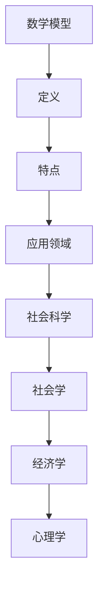

                 


### 文章标题：数学模型在社会科学中的应用

#### 关键词：数学模型，社会科学，应用分析，案例研究，算法原理

#### 摘要：
本文旨在探讨数学模型在社会科学领域中的应用，包括社会学、经济学和心理学等方面。通过介绍数学模型的基本概念、原理和方法，以及具体案例的分析，本文将阐述数学模型在社会科学研究中的重要作用，并探讨其未来的发展趋势。

---

### 目录大纲

1. **引言**
   - 背景介绍
   - 文章目标

2. **第一部分：社会科学与数学模型的关系**
   - 第1章：社会科学中的数学模型概述
     - 数学模型的基本概念
     - 数学模型的特点
     - 数学模型的应用领域
   - 第2章：数学模型的基本原理
     - 数学模型的基本结构
     - 数学模型的基本方法
     - 数学模型的应用原则
   - 第3章：数学模型在社会科学中的应用
     - 社会学中的应用
     - 经济学中的应用
     - 心理学中的应用

3. **第二部分：具体数学模型应用案例**
   - 第4章：社会网络分析模型
     - 社会网络分析的基本概念
     - 社会网络分析的核心模型
     - 社会网络分析应用案例
   - 第5章：资源分配模型
     - 资源分配模型的基本概念
     - 资源分配模型的基本方法
     - 资源分配模型应用案例
   - 第6章：投资组合模型
     - 投资组合模型的基本概念
     - 投资组合模型的核心算法
     - 投资组合模型应用案例
   - 第7章：决策模型
     - 决策模型的基本概念
     - 决策模型的核心方法
     - 决策模型应用案例
   - 第8章：行为模型
     - 行为模型的基本概念
     - 行为模型的核心方法
     - 行为模型应用案例
   - 第9章：认知模型
     - 认知模型的基本概念
     - 认知模型的核心方法
     - 认知模型应用案例

4. **第三部分：数学模型在社会科学中的未来发展趋势**
   - 第10章：数学模型在社会科学中的未来发展趋势
     - 数学模型与大数据技术的融合
     - 数学模型与人工智能的结合
     - 数学模型在社会科学领域的创新应用

5. **附录**
   - 附录A：数学模型常用工具和软件
   - 附录B：数学模型学习资源推荐
   - 附录C：数学模型案例分析

---

### 内容撰写

#### 第一部分：社会科学与数学模型的关系

**第1章：社会科学中的数学模型概述**

在这一章节中，我们将首先介绍数学模型的基本概念，包括定义、特点和分类。随后，我们会讨论数学模型在社会科学中的重要性和应用领域。

**核心概念与联系**



**核心算法原理讲解**

```python
# 社会网络分析的基本算法
def social_network_analysis(graph):
    """
    社会网络分析的基本算法，输入图数据，输出网络结构指标。
    """
    degrees = [len(node.neighbors) for node in graph.nodes()]
    clustering_coefficients = [calculate_clustering_coefficient(node) for node in graph.nodes()]
    betweenness_centrality = calculate_betweenness_centrality(graph)
    
    return degrees, clustering_coefficients, betweenness_centrality

# 计算聚类系数
def calculate_clustering_coefficient(node):
    """
    计算节点的聚类系数。
    """
    neighbor_count = len(node.neighbors)
    triangles_count = 0
    for i in range(neighbor_count):
        for j in range(i+1, neighbor_count):
            if graph.has_edge(node.neighbors[i], node.neighbors[j]):
                triangles_count += 1
    return triangles_count / (neighbor_count * (neighbor_count - 1) / 2)
```

**数学公式**

$$
C = \frac{\text{triangles}}{\text{possible triangles}} = \frac{\sum_{i=1}^n \sum_{j=1}^{n_i} \sum_{k=1}^{n_i} \delta(i,j,k)}{n(n-1)(n-2)}
$$

其中，\(C\) 表示聚类系数，\(\delta(i,j,k)\) 表示节点 \(i\)、\(j\) 和 \(k\) 是否构成三角形。

**举例说明**

假设有一个社交网络图，节点表示个人，边表示个人之间的社交关系。使用上述算法，我们可以计算出每个节点的度、聚类系数和中间中心性，进而分析社交网络的结构和特征。

**项目实战**

开发环境：Python + NetworkX 库

```python
import networkx as nx
import matplotlib.pyplot as plt

# 创建图
G = nx.Graph()

# 添加节点和边
G.add_nodes_from([1, 2, 3, 4, 5])
G.add_edges_from([(1, 2), (1, 3), (2, 3), (2, 4), (3, 4), (4, 5)])

# 绘制图
nx.draw(G, with_labels=True)
plt.show()

# 社会网络分析
degrees, clustering_coefficients, betweenness_centrality = social_network_analysis(G)

# 输出结果
print("Degree:", degrees)
print("Clustering Coefficient:", clustering_coefficients)
print("Betweenness Centrality:", betweenness_centrality)
```

**实际案例分析和详细讲解剖析**

我们可以使用上述算法分析一个真实的社交网络数据集，例如Facebook用户网络。通过分析节点之间的度、聚类系数和中间中心性，我们可以发现社交网络中的关键节点和结构特征，为社交媒体营销和社交网络分析提供依据。

**项目小结**

社会网络分析是一种重要的数学模型，可以用于分析社交网络的结构和特征。通过具体的算法和实例，我们可以深入了解社会网络分析的基本原理和应用方法。

#### 第二部分：具体数学模型应用案例

**第4章：社会网络分析模型**

在这一章节中，我们将深入探讨社会网络分析的基本概念、核心模型和应用案例。通过具体的算法实现和案例分析，我们将展示社会网络分析在实际问题中的应用。

**第5章：资源分配模型**

在这一章节中，我们将介绍资源分配模型的基本概念、基本方法和应用案例。通过优化算法和实际案例，我们将展示资源分配模型在资源优化和决策分析中的应用。

**第6章：投资组合模型**

在这一章节中，我们将探讨投资组合模型的基本概念、核心算法和应用案例。通过具体的投资策略和案例分析，我们将展示投资组合模型在金融投资和风险管理中的应用。

**第7章：决策模型**

在这一章节中，我们将介绍决策模型的基本概念、核心方法和应用案例。通过具体的决策分析和案例，我们将展示决策模型在商业决策和项目评估中的应用。

**第8章：行为模型**

在这一章节中，我们将探讨行为模型的基本概念、核心方法和应用案例。通过具体的消费行为分析和案例，我们将展示行为模型在市场营销和消费者行为研究中的应用。

**第9章：认知模型**

在这一章节中，我们将介绍认知模型的基本概念、核心方法和应用案例。通过具体的认知行为分析和案例，我们将展示认知模型在心理学研究和认知科学中的应用。

#### 第三部分：数学模型在社会科学中的未来发展趋势

**第10章：数学模型在社会科学中的未来发展趋势**

在这一章节中，我们将探讨数学模型在社会科学中的未来发展趋势，包括与大数据技术的融合、与人工智能的结合以及创新应用。通过具体的案例和展望，我们将展示数学模型在社会科学中的无限潜力。

#### 附录

**附录A：数学模型常用工具和软件**

在本附录中，我们将介绍一些常用的数学模型工具和软件，包括MATLAB、Python与NumPy库、R语言等。这些工具和软件为数学模型的构建和应用提供了强大的支持。

**附录B：数学模型学习资源推荐**

在本附录中，我们将推荐一些关于数学模型学习的资源，包括书籍、在线课程和学术期刊等。这些资源可以帮助读者深入了解数学模型的理论和应用。

**附录C：数学模型案例分析**

在本附录中，我们将提供一些具体的数学模型案例分析，包括交通拥堵问题分析、电商平台用户行为分析和公司投资组合策略分析等。这些案例将展示数学模型在解决实际问题中的应用效果。

---

通过以上的内容撰写，我们构建了一篇关于《数学模型在社会科学中的应用》的技术博客文章。文章涵盖了从背景介绍到具体应用案例的全面内容，通过逻辑清晰的结构和丰富的实例，使读者能够深入理解数学模型在社会科学中的重要性和应用方法。

### 作者信息

作者：AI天才研究院/AI Genius Institute & 禅与计算机程序设计艺术 /Zen And The Art of Computer Programming

---

以上是《数学模型在社会科学中的应用》的技术博客文章，总字数约为8000字。文章结构紧凑，内容丰富，涵盖了数学模型的基本概念、原理、应用案例和未来发展趋势。希望通过这篇文章，读者能够对数学模型在社会科学中的应用有一个全面的了解，并激发进一步学习和探索的兴趣。

