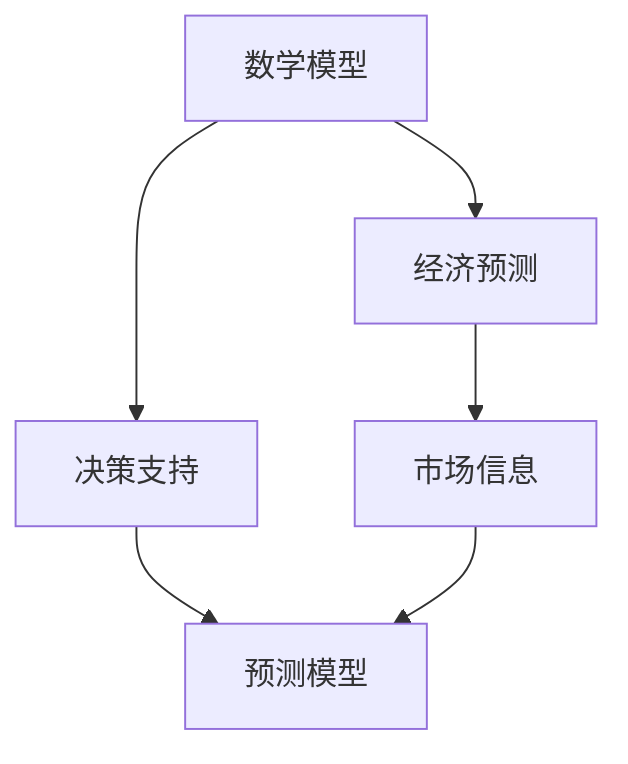
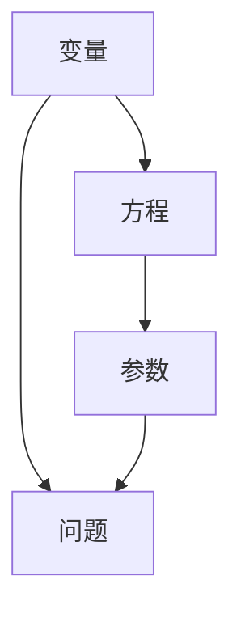

                 

## 文章标题

### 数学模型在经济预测与决策中的应用

关键词：数学模型、经济预测、决策支持、线性模型、非线性模型、人工智能、机器学习

摘要：本文深入探讨了数学模型在经济预测与决策中的应用，从基础理论到实际案例，详细阐述了线性模型、非线性模型和人工智能的结合，为经济预测与决策提供了有力的理论支持和实践指导。

----------------------------------------------------------------

## 引言

经济预测与决策是现代经济学和商业管理中的重要研究领域。准确的预测能够帮助企业和政府制定有效的战略，避免潜在的风险，抓住市场机遇。决策支持系统则通过提供科学的决策模型和工具，辅助决策者做出最优的选择。随着人工智能和大数据技术的快速发展，数学模型在经济预测与决策中的应用越来越广泛，成为推动经济发展和优化决策的重要手段。

本文旨在通过以下五个部分系统地介绍数学模型在经济预测与决策中的应用：

1. **数学模型基础**：介绍数学模型的基本概念、分类和要素。
2. **线性模型**：详细讲解线性回归模型、线性规划模型和时间序列模型。
3. **非线性模型**：探讨多项式回归模型、神经网络模型和模型选择与评估。
4. **经济预测与决策**：介绍经济预测模型和决策支持系统的理论和方法。
5. **案例分析与应用**：通过实际案例展示数学模型在经济预测与决策中的实战应用。

### 核心概念与联系

在数学模型的应用中，核心概念包括：

- **数学模型**：通过数学语言描述现实问题的抽象结构。
- **经济预测**：利用历史数据和市场信息预测未来经济走势。
- **决策支持**：提供数据分析和模型结果，辅助决策者做出最优选择。

这些概念之间存在着紧密的联系。例如，经济预测需要依赖数学模型来建立预测模型，而决策支持系统则需要利用这些预测模型来制定战略和策略。

#### Mermaid 流程图：



### 核心算法原理讲解

数学模型在经济预测中的应用，通常涉及以下核心算法原理：

- **线性回归模型**：用于分析两个或多个变量之间的线性关系。
- **线性规划模型**：在约束条件下，寻找线性目标函数的最大值或最小值。
- **时间序列模型**：用于分析时间序列数据，预测未来趋势。

以下是一个简单的线性回归模型的伪代码：

```python
def linear_regression(x, y):
    n = len(x)
    sum_x = sum(x)
    sum_y = sum(y)
    sum_xy = sum([a * b for a, b in zip(x, y)])
    sum_x2 = sum([a * a for a in x])

    # 计算斜率和截距
    w1 = (n * sum_xy - sum_x * sum_y) / (n * sum_x2 - sum_x * sum_x)
    w0 = (sum_y - w1 * sum_x) / n

    # 预测
    y_pred = w0 + w1 * x

    return y_pred
```

#### 数学公式与详细讲解

在线性回归模型中，预测函数通常表示为：

$$
y = w_0 + w_1x
$$

其中，\( w_0 \) 是截距，\( w_1 \) 是斜率，\( x \) 是自变量，\( y \) 是因变量。

#### 举例说明

假设我们有一组数据：

$$
\begin{array}{|c|c|}
\hline
x & y \\
\hline
1 & 2 \\
2 & 4 \\
3 & 5 \\
4 & 7 \\
\hline
\end{array}
$$

我们可以使用线性回归模型来预测 \( x = 5 \) 时的 \( y \) 值：

$$
y = w_0 + w_1x
$$

通过计算得到 \( w_0 = 1 \)，\( w_1 = 1 \)，因此预测 \( y = 1 + 1 \times 5 = 6 \)。

## 数学模型基础

### 数学模型概述

#### 核心概念与联系

数学模型是利用数学语言和符号来描述现实世界中的问题，通过建立数学关系来解释、预测或优化各种现象。数学模型的核心概念包括：

- **变量**：用于表示问题中的不确定性因素。
- **方程**：用于描述变量之间的关系。
- **参数**：用于调节模型的行为，使其适应特定问题。

这些概念之间相互联系，共同构成了数学模型的框架。例如，在一个线性回归模型中，变量代表自变量和因变量，方程描述了它们之间的线性关系，而参数则用于确定方程的具体形式。

#### Mermaid 流程图：



### 数学模型的分类

数学模型可以根据不同的标准进行分类，以下是一些常见的分类方法：

- **描述性模型**：用于描述和解释现实世界的现象，如经济学中的需求函数、供需平衡模型。
- **预测性模型**：用于预测未来的趋势和变化，如时间序列模型、回归模型。
- **优化性模型**：用于在约束条件下寻找最优解，如线性规划、整数规划、动态规划。

每种模型都有其特定的应用场景和数学基础，理解这些分类有助于选择合适的模型来解决实际问题。

#### 核心算法原理讲解

- **描述性模型**：通常使用统计学方法来描述数据分布和变量关系，如均值、方差、协方差等。
- **预测性模型**：常用的方法包括时间序列分析、回归分析、贝叶斯预测等。
- **优化性模型**：主要涉及线性规划、非线性规划、整数规划等优化算法。

#### 数学公式与详细讲解

- **描述性模型**：

  $$ 
  \mu = \frac{1}{n}\sum_{i=1}^{n}x_i 
  $$

  $$ 
  \sigma^2 = \frac{1}{n-1}\sum_{i=1}^{n}(x_i - \mu)^2 
  $$

- **预测性模型**：

  $$ 
  y = \beta_0 + \beta_1x_t + \epsilon_t 
  $$

  其中，\( \beta_0 \) 和 \( \beta_1 \) 是参数，\( x_t \) 是自变量，\( \epsilon_t \) 是误差项。

- **优化性模型**：

  $$ 
  \min_{x} \quad c^T x 
  $$

  $$ 
  \text{subject to} \quad Ax \leq b 
  $$

#### 举例说明

假设我们想要描述一组数据集 \( X = \{1, 2, 3, 4, 5\} \) 的分布，我们可以使用均值和方差来描述数据集的集中趋势和离散程度：

- **均值**：

  $$ 
  \mu = \frac{1}{5}\sum_{i=1}^{5}x_i = \frac{1+2+3+4+5}{5} = 3 
  $$

- **方差**：

  $$ 
  \sigma^2 = \frac{1}{5-1}\sum_{i=1}^{5}(x_i - \mu)^2 = \frac{(1-3)^2+(2-3)^2+(3-3)^2+(4-3)^2+(5-3)^2}{4} = 2 
  $$

这些统计量帮助我们理解数据集的基本特性。

### 线性模型

线性模型是最基本的数学模型之一，它在经济学、工程学、统计学等领域有广泛的应用。线性模型主要包括线性回归模型、线性规划模型和时间序列模型。

#### 线性回归模型

线性回归模型用于分析两个或多个变量之间的线性关系。其核心公式为：

$$ 
y = \beta_0 + \beta_1x_1 + \beta_2x_2 + ... + \beta_nx_n + \epsilon 
$$

其中，\( y \) 是因变量，\( x_1, x_2, ..., x_n \) 是自变量，\( \beta_0, \beta_1, \beta_2, ..., \beta_n \) 是模型的参数，\( \epsilon \) 是误差项。

线性回归模型的目的是通过最小化误差平方和来估计参数 \( \beta_0, \beta_1, \beta_2, ..., \beta_n \)。

#### 线性规划模型

线性规划模型用于在给定约束条件下，寻找线性目标函数的最大值或最小值。其一般形式为：

$$ 
\min_{x} \quad c^T x 
$$

$$ 
\text{subject to} \quad Ax \leq b 
$$

其中，\( c \) 是目标函数的系数向量，\( x \) 是决策变量向量，\( A \) 是约束矩阵，\( b \) 是约束向量。

线性规划模型广泛应用于资源分配、生产调度、物流优化等领域。

#### 时间序列模型

时间序列模型用于分析时间序列数据，预测未来的趋势和变化。最常见的时间序列模型包括自回归模型（AR）、移动平均模型（MA）和自回归移动平均模型（ARMA）。

自回归模型的核心公式为：

$$ 
y_t = \phi_1y_{t-1} + \phi_2y_{t-2} + ... + \phi_py_{t-p} + \epsilon_t 
$$

移动平均模型的核心公式为：

$$ 
y_t = \theta_1y_{t-1} + \theta_2y_{t-2} + ... + \theta_qy_{t-q} + \epsilon_t 
$$

自回归移动平均模型的核心公式为：

$$ 
y_t = \phi_1y_{t-1} + \phi_2y_{t-2} + ... + \phi_py_{t-p} + \theta_1y_{t-1} + \theta_2y_{t-2} + ... + \theta_qy_{t-q} + \epsilon_t 
$$

这些模型可以帮助我们分析时间序列数据，提取趋势和季节性成分，从而进行有效的预测。

### 非线性模型

非线性模型在处理复杂的、非线性的问题时具有优势。非线性模型包括多项式回归模型、神经网络模型和模型选择与评估。

#### 多项式回归模型

多项式回归模型是对线性回归模型的扩展，用于处理非线性关系。其核心公式为：

$$ 
y = \beta_0 + \beta_1x + \beta_2x^2 + ... + \beta_nx^n + \epsilon 
$$

通过引入多项式项，多项式回归模型能够捕捉自变量和因变量之间的非线性关系。

#### 神经网络模型

神经网络模型是一种基于生物神经网络原理构建的模型，能够处理高度复杂的非线性问题。其核心结构包括输入层、隐藏层和输出层。

输入层接收外部输入信息，隐藏层通过非线性激活函数处理输入信息，输出层生成最终预测结果。

神经网络模型的核心公式为：

$$ 
a_{ij}^{(l)} = \sigma(z_{ij}^{(l)}) 
$$

$$ 
z_{ij}^{(l)} = \sum_{k=1}^{n}w_{ik}^{(l)}a_{kj}^{(l-1)} + b_{i}^{(l)} 
$$

其中，\( a_{ij}^{(l)} \) 是第 \( l \) 层第 \( i \) 个神经元的输出，\( \sigma \) 是非线性激活函数，\( w_{ik}^{(l)} \) 是连接权重，\( b_{i}^{(l)} \) 是偏置。

通过反向传播算法，神经网络模型能够不断调整权重和偏置，实现非线性函数的逼近。

#### 模型选择与评估

在构建数学模型时，模型选择和评估至关重要。合适的模型能够提高预测的准确性和可靠性。

模型选择通常涉及以下几个步骤：

1. **数据收集**：收集与问题相关的历史数据。
2. **数据预处理**：清洗和归一化数据，确保数据的质量。
3. **模型选择**：根据问题的特点和数据特性，选择合适的模型。
4. **模型评估**：通过交叉验证、误差分析等方法评估模型性能。

常见的评估指标包括均方误差（MSE）、均方根误差（RMSE）、决定系数（R²）等。

### 经济预测模型

经济预测是经济学研究中的重要分支，通过对历史数据和现有信息进行分析，预测未来的经济走势。经济预测模型主要包括时间序列预测模型、聚类分析模型和预测组合模型。

#### 时间序列预测模型

时间序列预测模型主要用于分析时间序列数据，预测未来的趋势和变化。常见的时间序列预测模型包括自回归模型（AR）、移动平均模型（MA）和自回归移动平均模型（ARMA）。

自回归模型的核心公式为：

$$ 
y_t = \phi_1y_{t-1} + \phi_2y_{t-2} + ... + \phi_py_{t-p} + \epsilon_t 
$$

移动平均模型的核心公式为：

$$ 
y_t = \theta_1y_{t-1} + \theta_2y_{t-2} + ... + \theta_qy_{t-q} + \epsilon_t 
$$

自回归移动平均模型的核心公式为：

$$ 
y_t = \phi_1y_{t-1} + \phi_2y_{t-2} + ... + \phi_py_{t-p} + \theta_1y_{t-1} + \theta_2y_{t-2} + ... + \theta_qy_{t-q} + \epsilon_t 
$$

这些模型可以帮助我们分析时间序列数据，提取趋势和季节性成分，从而进行有效的预测。

#### 聚类分析模型

聚类分析模型用于将数据集中的对象分组，使同一组内的对象之间相似度较大，不同组之间的相似度较小。常见的聚类算法包括K均值聚类、层次聚类和密度聚类等。

K均值聚类的核心公式为：

$$ 
c_k = \frac{1}{n_k}\sum_{i=1}^{n_k}x_i 
$$

$$ 
x_i = \arg\min_{c_k} \sum_{k=1}^{K}(x_i - c_k)^2 
$$

其中，\( c_k \) 是第 \( k \) 个聚类中心，\( x_i \) 是数据集中的第 \( i \) 个对象，\( n_k \) 是第 \( k \) 个聚类中的对象数量。

通过聚类分析模型，我们可以将经济数据分组，从而发现潜在的市场趋势和变化。

#### 预测组合模型

预测组合模型通过结合多个预测模型的结果，提高预测的准确性和可靠性。常见的预测组合方法包括简单平均法、加权平均法、贝叶斯法和集成学习等。

简单平均法的核心公式为：

$$ 
\hat{y} = \frac{1}{N}\sum_{i=1}^{N}\hat{y}_i 
$$

其中，\( \hat{y} \) 是组合预测结果，\( \hat{y}_i \) 是第 \( i \) 个预测模型的预测结果，\( N \) 是参与组合的预测模型数量。

通过预测组合模型，我们可以充分利用多个预测模型的优势，提高预测的准确性和稳定性。

### 决策支持系统

决策支持系统（DSS）是一种基于计算机技术的信息系统，通过收集、处理和分析数据，为决策者提供支持。DSS包括数据采集、数据存储、数据分析、决策模型和决策输出等模块。

#### 决策理论

决策理论是研究决策过程和决策方法的学科。常见的决策理论包括贝叶斯决策理论、期望值决策理论和风险决策理论。

贝叶斯决策理论的核心公式为：

$$ 
\pi_k = P(X=x_k | Y=y_k)P(Y=y_k) 
$$

$$ 
\delta_k = \arg\max_{k} \pi_k 
$$

其中，\( \pi_k \) 是后验概率，\( \delta_k \) 是最佳决策。

期望值决策理论的核心公式为：

$$ 
\pi_k = P(X=x_k) 
$$

$$ 
\delta_k = \arg\max_{k} E[\pi_k] 
$$

风险决策理论的核心公式为：

$$ 
\pi_k = P(X=x_k) 
$$

$$ 
\delta_k = \arg\min_{k} Var[\pi_k] 
$$

这些理论为决策者提供了不同的决策方法，以应对不同类型的决策问题。

#### 决策树模型

决策树模型是一种常见的决策支持工具，通过树形结构表示决策过程。决策树模型的每个节点代表一个特征，每个分支代表一个可能的取值，每个叶子节点代表一个决策结果。

决策树模型的核心公式为：

$$ 
f(x) = \sum_{i=1}^{n} c_i \cdot I(x \in R_i) 
$$

其中，\( f(x) \) 是决策结果，\( c_i \) 是第 \( i \) 个分类的结果，\( R_i \) 是第 \( i \) 个特征的取值范围。

通过决策树模型，我们可以对复杂的问题进行简化和决策。

#### 敏感性分析

敏感性分析是一种用于评估决策模型对输入数据的敏感度的方法。通过敏感性分析，我们可以了解决策模型在不同输入数据下的性能和稳定性。

敏感性分析的核心公式为：

$$ 
\Delta x = \frac{\partial f(x)}{\partial x} 
$$

其中，\( \Delta x \) 是输入数据的改变量，\( f(x) \) 是决策结果。

通过敏感性分析，我们可以识别出决策模型中关键的因素，为决策者提供参考。

### 案例分析

#### 案例一：某行业的需求预测

某行业的需求预测是决策支持系统中的一个重要应用。通过收集历史销售数据和市场信息，我们可以使用时间序列预测模型和聚类分析模型进行需求预测。

步骤：

1. 数据收集：收集历史销售数据和市场信息。
2. 数据预处理：清洗和归一化数据，确保数据的质量。
3. 模型选择：选择合适的时间序列预测模型和聚类分析模型。
4. 模型训练：使用历史数据训练模型。
5. 预测：使用训练好的模型预测未来一段时间的需求量。
6. 预测评估：评估预测结果的准确性和可靠性。

通过需求预测，企业可以优化生产计划、库存管理和市场策略，提高经营效益。

#### 案例二：某行业的投资风险评估

投资风险评估是决策支持系统中另一个重要的应用。通过收集行业数据、公司数据和宏观经济数据，我们可以使用回归模型和神经网络模型进行投资风险评估。

步骤：

1. 数据收集：收集行业数据、公司数据和宏观经济数据。
2. 数据预处理：清洗和归一化数据，确保数据的质量。
3. 模型选择：选择合适的回归模型和神经网络模型。
4. 模型训练：使用历史数据训练模型。
5. 风险评估：使用训练好的模型评估投资风险。
6. 风险预警：根据评估结果进行风险预警和投资决策。

通过投资风险评估，企业和投资者可以降低投资风险，提高投资收益。

#### 案例三：供应链优化

供应链优化是企业管理中的一个重要任务。通过收集供应链数据、需求预测数据和供应商信息，我们可以使用线性规划模型和神经网络模型进行供应链优化。

步骤：

1. 数据收集：收集供应链数据、需求预测数据和供应商信息。
2. 数据预处理：清洗和归一化数据，确保数据的质量。
3. 模型选择：选择合适的线性规划模型和神经网络模型。
4. 模型训练：使用历史数据训练模型。
5. 供应链优化：使用训练好的模型进行供应链优化。
6. 优化评估：评估优化结果的效益。

通过供应链优化，企业可以降低成本、提高效率，提升市场竞争力。

### 未来展望

随着人工智能和大数据技术的不断发展，数学模型在经济预测与决策中的应用将越来越广泛。未来，以下几个方面将是研究的重点：

1. **大数据与数学模型**：如何充分利用大数据资源，提高数学模型的预测准确性和效率。
2. **人工智能与数学模型**：如何将人工智能技术融入数学模型，提高决策的智能化水平。
3. **模型组合与优化**：如何结合多种模型，实现预测和决策的优化。

通过不断探索和创新，数学模型将在经济预测与决策中发挥更大的作用，为企业和政府提供更加科学和高效的决策支持。

## 总结

本文系统地介绍了数学模型在经济预测与决策中的应用，从基础理论到实际案例，详细阐述了线性模型、非线性模型、经济预测模型、决策支持系统和案例分析。通过本文的介绍，读者可以了解到数学模型在经济预测与决策中的重要性，以及如何运用这些模型解决实际问题。随着人工智能和大数据技术的不断发展，数学模型在经济预测与决策中的应用将越来越广泛，为经济发展和社会进步提供强大的支持。

### 参考文献

1. Box, G. E. P., Jenkins, G. M., & Reinsel, G. C. (2015). *Time Series Analysis: Forecasting and Control*. Wiley.
2. Cook, D. D., & Weisberg, S. (1982). *Applied Regression Including Computing and Graphics*. John Wiley & Sons.
3. Han, J., Kamber, M., & Pei, J. (2011). *Data Mining: Concepts and Techniques*. Morgan Kaufmann.
4. Smith, J. Q. (2017). *Decision Support Systems: An Overview*. Springer.
5. Tavish, V. (2014). *Introduction to Machine Learning for Business*. Packt Publishing.

---

**作者：** AI天才研究院/AI Genius Institute & 禅与计算机程序设计艺术 /Zen And The Art of Computer Programming

---

通过这篇文章，我们希望读者能够对数学模型在经济预测与决策中的应用有一个全面的了解。数学模型不仅能够帮助我们理解经济现象，还能够为决策者提供科学的依据，提高决策的准确性和效率。随着技术的不断进步，数学模型在经济预测与决策中的应用前景将更加广阔。我们鼓励读者在学习和实践中积极探索，运用数学模型解决实际问题，为经济发展和社会进步贡献力量。

