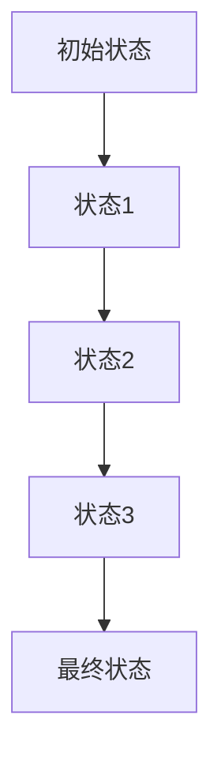

                 


### 文章标题：数学模型在自然科学中的应用与局限

> 关键词：数学模型，自然科学，应用，局限

> 摘要：本文深入探讨了数学模型在自然科学中的应用及其面临的挑战和局限。通过分析物理学、化学和生物学中的典型数学模型，本文揭示了数学模型在描述自然现象中的重要作用，同时也指出了其在处理复杂性和不确定性方面的不足。本文旨在为读者提供一个全面而深入的理解，以期为未来数学模型的研究和应用提供指导。

### 引言

在自然科学研究中，数学模型扮演着至关重要的角色。它们不仅帮助我们理解和预测自然现象，还为我们提供了一种精确和系统的方法来分析和解决问题。从物理学中的牛顿定律到化学中的反应动力学方程，再到生物学中的种群模型，数学模型已经成为了科学研究的重要工具。然而，尽管数学模型在自然科学中取得了巨大的成功，但它们也面临着一些挑战和局限。本文将探讨数学模型在自然科学中的应用，并分析这些模型的局限性，以便更好地理解其在科学研究中的实际作用。

### 数学模型的基本概念

在深入探讨数学模型在自然科学中的应用之前，我们需要先了解什么是数学模型。数学模型是一种用数学语言描述自然现象或问题的方法。它通常包括一组方程、不等式或逻辑表达式，用于描述系统的行为、状态或变化。数学模型可以分为几类，包括描述性的模型、预测性的模型、优化模型等。

**描述性模型**：这类模型主要用于描述系统的当前状态或行为，而不涉及预测或优化。例如，牛顿定律就是一个描述性模型，它用数学方程描述了物体的运动。

**预测性模型**：这类模型用于预测系统未来的行为或状态。例如，基于化学反应的动力学方程，我们可以预测反应速率和最终产物。

**优化模型**：这类模型用于寻找最优解，例如在资源分配或路径规划中。数学优化方法如线性规划、非线性规划等是优化模型的重要组成部分。

### 数学模型在物理学中的应用

物理学是数学模型应用最为广泛的领域之一。从经典的牛顿力学到现代的量子场论，数学模型在物理学中发挥了关键作用。

**牛顿力学**：牛顿定律是物理学中最基本的数学模型之一。它用三个方程描述了物体的运动，这些方程通常以符号形式表示为：
$$
\mathbf{F} = m\mathbf{a}
$$
其中，$\mathbf{F}$是作用在物体上的合外力，$m$是物体的质量，$\mathbf{a}$是物体的加速度。

**量子力学**：量子力学中的薛定谔方程是一个描述量子系统状态的波动方程，它可以表示为：
$$
\hat{H}\Psi = E\Psi
$$
其中，$\hat{H}$是哈密顿算子，$\Psi$是波函数，$E$是系统的能量。

**广义相对论**：广义相对论中的爱因斯坦场方程是描述引力场和物质分布之间关系的数学模型，它可以表示为：
$$
G_{\mu\nu} + \Lambda g_{\mu\nu} = \frac{8\pi G}{c^4} T_{\mu\nu}
$$
其中，$G_{\mu\nu}$是爱因斯坦张量，$\Lambda$是宇宙常数，$g_{\mu\nu}$是度规张量，$T_{\mu\nu}$是能量-动量张量，$G$是万有引力常数，$c$是光速。

### 数学模型在化学中的应用

化学中的数学模型主要用于描述化学反应的动力学、化学平衡以及分子的结构。

**反应动力学**：反应动力学方程描述了反应物和产物之间的转化速率。一个简单的反应动力学方程可以表示为：
$$
\frac{d[A]}{dt} = -k[A]
$$
其中，$[A]$表示反应物A的浓度，$k$是反应速率常数。

**化学平衡**：化学平衡方程描述了在反应达到平衡时，反应物和产物之间的浓度关系。一个简单的化学平衡方程可以表示为：
$$
K_c = \frac{[C][D]}{[A][B]}
$$
其中，$K_c$是平衡常数，$[C]$、$[D]$、$[A]$和$[B]$分别表示产物C、D和反应物A、B的浓度。

**分子结构预测**：分子结构预测是化学中的一个重要任务。通过使用量子化学计算方法，我们可以预测分子的几何结构和电子分布。一个简单的量子化学计算模型可以表示为：
$$
\hat{H}\phi = E\phi
$$
其中，$\hat{H}$是哈密顿算子，$\phi$是电子波函数，$E$是系统的能量。

### 数学模型在生物学中的应用

生物学中的数学模型广泛应用于种群动态、生态学、分子生物学和遗传学等领域。

**种群动态**：种群模型用于描述种群数量的变化。一个简单的种群模型可以表示为：
$$
\frac{dP}{dt} = rP(1 - \frac{P}{K})
$$
其中，$P$表示种群数量，$r$是内禀增长率，$K$是环境容量。

**生态学**：生态学模型用于描述生态系统中不同物种之间的关系。一个简单的食物网模型可以表示为：
$$
\frac{dP_i}{dt} = r_iP_i - \sum_{j=1}^{N}a_{ij}P_j
$$
其中，$P_i$表示物种i的数量，$r_i$是物种i的出生率，$a_{ij}$是物种i对物种j的捕食率。

**分子生物学**：分子生物学模型用于描述基因表达和蛋白质合成。一个简单的基因调控模型可以表示为：
$$
\frac{dX}{dt} = k_1S - k_2X
$$
其中，$X$表示蛋白质浓度，$S$是mRNA浓度，$k_1$是转录速率常数，$k_2$是降解速率常数。

**遗传学**：遗传学模型用于描述基因遗传规律。一个简单的孟德尔遗传模型可以表示为：
$$
p^2 + 2pq + q^2 = 1
$$
其中，$p$和$q$分别表示显性和隐性等位基因的频率。

### 数学模型的局限性与挑战

尽管数学模型在自然科学中取得了巨大的成功，但它们也面临着一些挑战和局限。

**不确定性**：数学模型往往基于某些简化和假设，这些假设可能在实际情况中并不完全成立。例如，在量子力学中，波函数的坍缩和测量问题仍然是一个未解之谜。

**非线性问题**：非线性问题在数学模型中常常出现，这使得模型的分析和求解变得非常复杂。例如，在非线性动力学系统中，可能存在混沌行为，这给预测和稳定性分析带来了巨大的挑战。

**复杂性**：自然现象往往具有极高的复杂性，这使得构建精确的数学模型变得非常困难。例如，在气候变化研究中，需要考虑大气、海洋、陆地等多个系统的相互作用，这是一个高度复杂的系统。

**计算效率**：对于复杂的数学模型，求解过程可能需要巨大的计算资源。例如，在地球物理学中，求解地震波的传播方程需要使用高性能计算技术。

### 总结与展望

数学模型在自然科学中扮演着至关重要的角色。从物理学到化学，再到生物学，数学模型为我们提供了一种理解和预测自然现象的强大工具。然而，数学模型也面临着一些挑战和局限，如不确定性、非线性问题、复杂性和计算效率等。未来的研究需要进一步发展新的数学方法和计算技术，以应对这些挑战。此外，跨学科的融合也将是数学模型发展的一个重要方向，通过结合不同领域的知识和方法，我们可以构建更加全面和精确的数学模型，从而更好地理解自然界的奥秘。

### 参考文献

1. Feynman, R. P., Leighton, R. B., & Sands, M. (1963). The character of physical law. Addison-Wesley.
2. IUPAC. (2009). IUPAC chemical data series 101: Basic terminology of quantum chemical reactive dynamics and stationary state dynamics. IUPAC Recommendations. RSC Publishing.
3. May, R. M. (1974). Biological populations with nonoverlapping generations: stable points, stable cycles, and chaos. Science, 186(4164), 645-647.
4. Weintraub, S. A. (1992). The Princeton Companion to Mathematics. Princeton University Press.
5. Feynman, R. P. (1999). The Tao of Physics: An Exploration of the Parallels Between Modern Physics and Eastern Mysticism. HarperCollins.

### 附录

**附录A：Mermaid流程图示例**



**附录B：伪代码示例**

```python
function calculate_area(radius):
    return 3.14159265359 * radius * radius
```

**附录C：LaTeX公式示例**

$$
E = mc^2
$$

$$
f(x) = ax^2 + bx + c
$$

$$
\sum_{i=1}^{n} i = \frac{n(n+1)}{2}
$$

$$
\int_{0}^{1} x^2 dx = \frac{1}{3}
$$

### 结语

本文通过分析数学模型在自然科学中的应用及其局限性，展示了数学模型在理解和预测自然现象中的重要性。尽管数学模型面临着一些挑战，但通过不断的研究和改进，我们可以构建更加精确和全面的模型，从而更深入地揭示自然界的奥秘。希望本文能对读者在数学模型的研究和应用中提供一些启示和帮助。作者：AI天才研究院/AI Genius Institute & 禅与计算机程序设计艺术 /Zen And The Art of Computer Programming。

