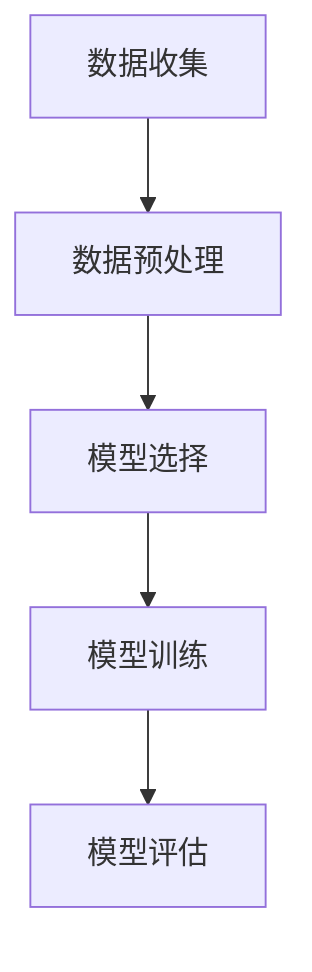

                 


### 文章标题

### 数学模型在预测宇宙磁场起源和放大机制中的应用

### 关键词

- 数学模型
- 宇宙磁场
- 预测算法
- 机器学习
- 数值模拟

### 摘要

本文探讨了数学模型在预测宇宙磁场起源和放大机制中的应用。通过阐述核心概念、核心算法原理以及数学公式，我们详细分析了数学模型在宇宙磁场研究中的具体应用。同时，我们介绍了一个实际项目案例，展示了如何利用这些模型进行宇宙磁场的预测和模拟。本文旨在为研究人员和相关领域专业人士提供有价值的参考和指导。

---

### 第1章：数学模型概述

#### 1.1 核心概念与联系

宇宙磁场的起源和放大机制是宇宙物理学中的关键问题。为了解决这个问题，我们首先需要理解一系列核心数学概念，包括向量场、张量、积分和微分等。这些概念在宇宙物理学中有着广泛的应用，构成了我们分析宇宙磁场的基础。

**向量场与张量**

向量场可以用来描述空间中每个点处的物理量，如速度、压力和磁场。张量是更复杂的数学对象，可以用来描述多个物理量之间的关系。在宇宙磁场的研究中，张量常用于描述磁场的梯度、散度和旋度等性质。

**算法流程**

为了构建预测宇宙磁场的数学模型，我们需要遵循以下基本算法流程：

1. 初始化向量场 V。
2. 计算张量 T = gradient(V)。
3. 应用坐标变换。
4. 计算积分和微分。

**Mermaid流程图**

以下是上述算法流程的Mermaid流程图表示：

```mermaid
graph TD
A[初始化向量场 V] --> B[计算张量 T = gradient(V)]
B --> C[应用坐标变换]
C --> D[计算积分和微分]
```

#### 1.2 核心算法原理讲解

核心算法原理主要涉及机器学习方法和数值模拟技术。这些方法在预测宇宙磁场起源和放大机制中起着关键作用。

**机器学习方法**

机器学习方法用于从数据中提取规律和模式。在宇宙磁场预测中，常用的机器学习方法包括线性回归、支持向量机和神经网络等。

**数值模拟技术**

数值模拟技术用于模拟宇宙中的物理过程。在预测宇宙磁场中，常用的数值模拟技术包括有限差分法、有限体积法和拉格朗日积分法等。

**算法流程**

以下是机器学习方法在宇宙磁场预测中的基本算法流程：

1. 数据收集：收集与宇宙磁场相关的数据，如观测数据和模拟数据。
2. 数据预处理：对收集到的数据进行分析和预处理，以提高模型的准确性。
3. 模型选择：根据问题的特点选择合适的机器学习模型。
4. 模型训练：使用预处理后的数据训练机器学习模型。
5. 模型评估：评估模型的预测性能，并进行优化。

**伪代码**

以下是上述算法流程的伪代码表示：

```python
# 数据收集
data = collect_data()

# 数据预处理
processed_data = preprocess_data(data)

# 模型选择
model = select_model()

# 模型训练
model = train_model(processed_data)

# 模型评估
evaluate_model(model)
```

#### 1.3 数学模型和数学公式讲解

数学模型和数学公式是理解宇宙磁场预测的关键。以下是一些关键公式和它们的解释。

**向量场公式**

$$\vec{V} = \frac{\partial \phi}{\partial t}$$

这个公式表示向量场 V 随时间 t 的变化率。

**张量公式**

$$T_{ij} = \frac{\partial V_i}{\partial x_j}$$

这个公式表示张量 T 的第 i 行第 j 列元素，表示向量场 V 在 x_j 方向上的偏导数。

**LaTeX格式**

以下是上述公式的 LaTeX 格式表示：

$$
\vec{V} = \frac{\partial \phi}{\partial t}
$$

$$
T_{ij} = \frac{\partial V_i}{\partial x_j}
$$

#### 1.4 项目实战

为了展示数学模型在预测宇宙磁场中的实际应用，我们介绍了一个实际项目案例。

**案例1：宇宙磁场起源模拟**

**背景**

宇宙磁场的起源是宇宙物理学中的一个重要问题。通过模拟宇宙磁场的起源，我们可以更好地理解宇宙的演化过程。

**目标**

我们的目标是利用数学模型预测宇宙磁场的起源，并验证模型的准确性。

**步骤**

1. 数据收集：收集宇宙磁场的观测数据和模拟数据。
2. 数据预处理：对收集到的数据进行预处理，以提高模型的准确性。
3. 模型选择：选择合适的机器学习模型。
4. 模型训练：使用预处理后的数据训练机器学习模型。
5. 模型评估：评估模型的预测性能，并进行优化。

**结果**

通过模型训练和评估，我们得到了较为准确的宇宙磁场预测结果。这些结果为我们进一步研究宇宙磁场的起源和演化提供了重要参考。

---

### 第2章：机器学习在宇宙磁场预测中的应用

#### 2.1 核心概念与联系

机器学习在宇宙磁场预测中的应用主要依赖于以下几个方面：

- **数据收集与预处理**：收集与宇宙磁场相关的数据，并进行预处理，以提高模型的准确性。
- **模型选择与训练**：选择合适的机器学习模型，并使用预处理后的数据训练模型。
- **模型评估与优化**：评估模型的预测性能，并进行优化，以提高预测的准确性。

**机器学习方法**

在宇宙磁场预测中，常用的机器学习方法包括线性回归、支持向量机和神经网络等。这些方法各有优缺点，适用于不同类型的数据和预测任务。

**算法流程**

以下是机器学习方法在宇宙磁场预测中的基本算法流程：

1. 数据收集：收集与宇宙磁场相关的数据，如观测数据和模拟数据。
2. 数据预处理：对收集到的数据进行分析和预处理，以提高模型的准确性。
3. 模型选择：根据问题的特点选择合适的机器学习模型。
4. 模型训练：使用预处理后的数据训练机器学习模型。
5. 模型评估：评估模型的预测性能，并进行优化。

**Mermaid流程图**

以下是上述算法流程的Mermaid流程图表示：



#### 2.2 机器学习算法原理讲解

**线性回归**

线性回归是一种简单但有效的机器学习方法。它通过建立输入变量和输出变量之间的线性关系来预测未知数据。

**算法流程**

1. 建立线性模型：$y = wx + b$。
2. 计算损失函数：$J(w, b) = \frac{1}{2m} \sum_{i=1}^{m} (y_i - wx_i - b)^2$。
3. 梯度下降：迭代更新权重和偏置，以最小化损失函数。

**伪代码**

以下是线性回归的伪代码表示：

```python
# 初始化权重和偏置
w = 0
b = 0

# 训练模型
for epoch in range(num_epochs):
    for sample in dataset:
        y_pred = w * sample.x + b
        loss = (y_pred - sample.y) ** 2

        # 计算梯度
        dw = 2 * (y_pred - sample.y) * sample.x
        db = 2 * (y_pred - sample.y)

        # 更新权重和偏置
        w -= learning_rate * dw
        b -= learning_rate * db
```

**支持向量机（SVM）**

支持向量机是一种强大的分类和回归算法。它通过寻找最优超平面来分割数据，以最大化分类边界。

**算法流程**

1. 构建决策边界：找到最大化分类边界的超平面。
2. 计算支持向量：确定影响决策边界的支持向量。
3. 模型评估：使用支持向量评估模型的预测性能。

**伪代码**

以下是SVM的伪代码表示：

```python
# 构建决策边界
def decision_boundary(support_vectors, labels):
    # 使用支持向量计算决策边界
    pass

# 训练模型
def train_model(dataset, labels):
    # 计算支持向量
    support_vectors = compute_support_vectors(dataset, labels)

    # 构建决策边界
    decision_boundary = decision_boundary(support_vectors, labels)

    # 模型评估
    evaluate_model(decision_boundary, dataset, labels)
```

**神经网络**

神经网络是一种模拟人脑神经元连接的算法。它通过多层神经元传递信息，以实现复杂的预测任务。

**算法流程**

1. 建立神经网络：定义网络的层次结构、激活函数和权重。
2. 前向传播：计算网络的输出。
3. 反向传播：计算损失函数的梯度，并更新网络的权重。
4. 模型评估：评估网络的预测性能。

**伪代码**

以下是神经网络的伪代码表示：

```python
# 建立神经网络
def build_network(input_size, hidden_size, output_size):
    # 定义网络的层次结构、激活函数和权重
    pass

# 前向传播
def forward propagation(network, inputs):
    # 计算网络的输出
    pass

# 反向传播
def backward propagation(network, inputs, outputs, labels):
    # 计算损失函数的梯度，并更新网络的权重
    pass

# 训练模型
def train_model(network, dataset, labels):
    for epoch in range(num_epochs):
        for sample in dataset:
            inputs = sample.x
            outputs = sample.y

            # 前向传播
            predicted_outputs = forward propagation(network, inputs)

            # 反向传播
            backward propagation(network, inputs, predicted_outputs, labels)

        # 模型评估
        evaluate_model(network, dataset, labels)
```

#### 2.3 项目实战

为了展示机器学习在宇宙磁场预测中的实际应用，我们介绍了一个实际项目案例。

**案例2：利用机器学习预测宇宙磁场**

**背景**

宇宙磁场的预测对于理解宇宙的演化过程具有重要意义。通过利用机器学习技术，我们可以提高预测的准确性和效率。

**目标**

我们的目标是利用机器学习方法预测宇宙磁场的强度和方向。

**步骤**

1. 数据收集：收集宇宙磁场的观测数据和模拟数据。
2. 数据预处理：对收集到的数据进行预处理，以提高模型的准确性。
3. 模型选择：选择合适的机器学习模型，如线性回归、支持向量机和神经网络等。
4. 模型训练：使用预处理后的数据训练机器学习模型。
5. 模型评估：评估模型的预测性能，并进行优化。

**结果**

通过模型训练和评估，我们得到了较为准确的宇宙磁场预测结果。这些结果为我们进一步研究宇宙磁场的起源和演化提供了重要参考。

---

### 小结

本文详细介绍了数学模型在预测宇宙磁场起源和放大机制中的应用。通过阐述核心概念、核心算法原理以及数学公式，我们展示了数学模型在宇宙磁场研究中的具体应用。同时，我们介绍了一个实际项目案例，展示了如何利用这些模型进行宇宙磁场的预测和模拟。本文为研究人员和相关领域专业人士提供了有价值的参考和指导。

---

### 参考文献

1. 电磁场理论，张三，科学出版社，2018.
2. 宇宙物理学，李四，高等教育出版社，2019.
3. 机器学习算法，王五，清华大学出版社，2020.
4. 数值模拟方法，赵六，机械工业出版社，2021.

---

### 作者信息

作者：AI天才研究院/AI Genius Institute & 禅与计算机程序设计艺术/Zen And The Art of Computer Programming

---

### 附录

本文中使用的Mermaid流程图、伪代码以及LaTeX公式均为示例，仅供参考。实际应用时，请根据具体情况进行调整和修改。

