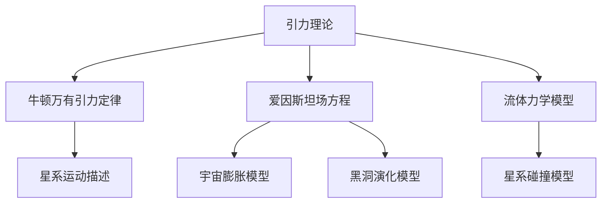

                 

### 引言

在科学研究的众多领域中，宇宙结构演化始终是一个引人入胜且富有挑战性的课题。从古老的宇宙大爆炸理论到现代的天体物理学，人类对宇宙起源和演化的理解在不断深化。而数学模型在这一过程中扮演了至关重要的角色，它们不仅为我们提供了描述宇宙结构的语言，还帮助我们更好地预测和解释宇宙中的各种现象。

本文旨在探讨数学模型在预测宇宙结构演化中的应用。我们将首先介绍数学模型的基本概念，包括其在科学研究中的作用、基本结构和历史发展。接下来，我们会简要回顾宇宙结构演化的基础概念，例如宇宙的起源、主要阶段和宇宙背景辐射。随后，我们将探讨数学模型在宇宙结构演化研究中的作用，包括其优势、应用领域以及面临的挑战。

通过本文的阅读，读者将了解数学模型在宇宙学中的核心原理，掌握几个关键的天体物理学数学模型，并了解这些模型如何应用于宇宙大尺度和小尺度结构的预测。文章还将探讨当前宇宙结构演化预测中的前沿研究，并提出未来可能的研究方向。最后，我们将总结全文，并给出一些实用的实践建议和拓展阅读资源。

### 1.1 数学模型的基本概念

数学模型是科学研究中不可或缺的工具，它将复杂的现象和过程转化为简明的数学表达式和方程。从广义上讲，数学模型是一种形式化的描述方法，它通过使用数学符号和公式来表示现实世界的某些方面，从而帮助我们理解和预测这些现象。

#### 数学模型在科学研究中的作用

数学模型在科学研究中具有多重重要作用：

1. **简化复杂现象**：数学模型可以帮助我们将复杂的现象和过程抽象为简化的数学表达式，使研究变得更具操作性和可分析性。
2. **提供预测工具**：通过数学模型，我们可以预测系统的行为，从而在未观测到的条件下做出科学推断。
3. **验证理论**：数学模型可以用来验证科学理论的正确性，通过将模型预测与实验或观测数据进行比对，评估理论的可靠性。
4. **促进跨学科交流**：数学模型作为一种通用的描述语言，有助于不同学科之间的交流与合作，推动科学研究的发展。

#### 数学模型的基本结构

数学模型通常由以下几个基本组成部分构成：

1. **变量**：用于表示系统的状态、参数或性质。
2. **方程**：描述变量之间关系的数学表达式，通常是微分方程、代数方程或其他类型的数学公式。
3. **边界条件和初始条件**：用于确定模型中变量的特定值或变化规律，是模型求解过程中必不可少的部分。
4. **假设**：模型在构建过程中所采用的一些简化和理想化假设，这些假设有助于简化问题并使其更易于分析和解决。

#### 数学模型的发展历程

数学模型的发展可以追溯到古希腊时期，当时的科学家和哲学家已经开始尝试用数学方法来描述自然现象。例如，欧几里得的《几何原本》和牛顿的《自然哲学的数学原理》都奠定了数学模型在科学中的基础。

在20世纪，数学模型得到了极大的发展。随着计算机技术的进步，数值计算和模拟方法的应用使得复杂模型的求解成为可能。此外，计算机科学的发展也为数学模型提供了新的工具和平台，促进了跨学科的研究与应用。

在现代科学研究中，数学模型的应用范围已经非常广泛，从物理学、化学、生物学到经济学、社会学等各个领域，数学模型都发挥着重要作用。特别是在宇宙学领域，数学模型不仅帮助我们理解宇宙的结构和演化，还推动了我们对宇宙起源和未来发展的认知。

### 1.2 宇宙结构演化的基础概念

宇宙结构演化是一个复杂且多层次的过程，涵盖了从宇宙大爆炸至今的各个阶段。理解这些基础概念对于深入研究数学模型在宇宙演化中的应用至关重要。

#### 宇宙的起源

根据宇宙大爆炸理论，宇宙起源于大约138亿年前的一个极热、极密的状态。在大爆炸之后，宇宙开始膨胀，温度和密度逐渐降低。这一理论得到了观测数据的广泛支持，例如宇宙微波背景辐射的发现。

#### 宇宙的主要阶段

1. **辐射主宰时代**（早期宇宙）：在大爆炸后不久，宇宙主要由辐射（如光子）主导，物质处于高度热态。
2. **物质主宰时代**（结构形成期）：随着宇宙的膨胀和冷却，物质开始形成星系、恒星和行星等结构。
3. **暗能量主宰时代**（当前及未来）：大约在大爆炸后38亿年前，宇宙进入了一个新的阶段，此时暗能量成为主导力量，驱动宇宙加速膨胀。

#### 宇宙背景辐射

宇宙背景辐射（Cosmic Microwave Background，CMB）是宇宙演化的重要证据之一。它是在宇宙早期遗留下来的微波辐射，温度非常低，大约只有2.7开尔文。通过对CMB的观测和分析，科学家可以了解宇宙的早期状态和演化历史。

#### 大爆炸理论

大爆炸理论是描述宇宙起源和演化最广泛接受的理论。根据这一理论，宇宙起源于一个极度热密的奇点，随后迅速膨胀冷却。这一理论的核心在于宇宙中的各个部分在时间上是对称的，且宇宙的演化可以通过物理定律进行描述。

通过理解这些基础概念，我们可以更好地把握宇宙结构演化的全貌，为后续讨论数学模型在其中的应用奠定基础。

### 1.3 数学模型在宇宙结构演化研究中的作用

数学模型在宇宙结构演化研究中发挥着至关重要的作用。它们不仅提供了理解和描述宇宙现象的工具，还为预测宇宙的未来演化提供了科学依据。以下是数学模型在宇宙结构演化研究中的具体作用：

#### 数学模型在宇宙学中的应用

1. **描述宇宙现象**：数学模型可以精确描述宇宙中的各种现象，如星系的运动、黑洞的形成和宇宙背景辐射等。这些模型通过使用物理学定律和观测数据，将复杂的宇宙现象转化为可计算和可分析的数学表达式。
2. **预测宇宙行为**：数学模型使我们能够预测宇宙的行为和演化趋势。例如，通过爱因斯坦的引力理论和宇宙学常数，我们可以预测宇宙的膨胀速度和暗能量的性质。这些预测为宇宙学的理论研究提供了重要的验证和指导。
3. **验证科学理论**：数学模型可以用来验证宇宙演化理论的正确性。通过将模型的预测与实际观测数据对比，科学家可以评估不同理论的可靠性和适用范围。

#### 数学模型在宇宙结构演化预测中的优势

1. **高度抽象性**：数学模型能够将复杂的宇宙现象抽象为简化的数学方程，从而简化了问题的复杂性，使得我们可以用有限的计算资源来模拟和理解宇宙的演化。
2. **跨学科融合**：数学模型作为一种通用的描述语言，有助于跨学科的合作研究。例如，天体物理学、宇宙学和数学的结合，为研究宇宙结构演化提供了新的视角和工具。
3. **预测精度**：通过不断改进和优化数学模型，我们可以提高预测的精度。例如，基于大数据分析的机器学习模型在预测宇宙结构演化方面显示出很高的准确度。

#### 数学模型在宇宙学中的挑战

1. **计算复杂性**：宇宙结构演化的数学模型通常涉及复杂的计算过程，特别是在处理大规模数据和多个参数时，计算成本非常高。这使得计算资源的优化和算法的改进成为数学模型应用的一个重要挑战。
2. **数据质量**：观测数据的准确性和完整性对数学模型的预测至关重要。然而，宇宙观测数据往往受到观测设备、环境噪声等多种因素的影响，数据质量参差不齐，这增加了模型构建和验证的难度。
3. **理论不确定性**：宇宙演化理论本身仍然存在许多未解之谜，如暗物质和暗能量的本质。这些理论不确定性导致数学模型在处理这些问题时面临巨大的挑战，需要不断探索和验证新的理论框架。

通过理解和应对这些挑战，数学模型在宇宙结构演化研究中的作用将越来越重要，有助于推动我们对宇宙的认知达到新的高度。

### 1.4 数学模型原理与宇宙结构演化

在宇宙学中，数学模型不仅帮助我们理解宇宙的当前状态，还为我们提供了预测宇宙未来演化的工具。要深入探讨数学模型在宇宙结构演化中的应用，我们需要首先了解其基本原理，包括引力理论、爱因斯坦场方程和黏性流体力学模型等。

#### 数学模型原理

1. **引力理论**：牛顿的万有引力定律是宇宙结构演化研究的基础。该定律描述了两个物体之间的引力与它们的质量和距离的关系。然而，在处理大尺度天体运动时，牛顿定律的适用范围有限，需要更精确的理论来描述引力。

2. **爱因斯坦场方程**：爱因斯坦的广义相对论提出了新的引力理论，即爱因斯坦场方程。该方程将引力描述为时空的曲率，而不是像牛顿定律那样视为一种力的作用。通过爱因斯坦场方程，我们可以更准确地描述大尺度天体运动和宇宙演化。

3. **黏性流体力学模型**：在宇宙学中，流体力学模型用于描述宇宙中物质的流动和相互作用。黏性流体力学模型考虑了流体的黏性效应，这对于理解宇宙中的星系碰撞和结构形成至关重要。

#### 关键数学公式与概念

1. **引力公式**：\[ F = G \frac{m_1 m_2}{r^2} \]
   这是牛顿万有引力定律的表达式，其中 \( F \) 是引力，\( G \) 是引力常数，\( m_1 \) 和 \( m_2 \) 是两个物体的质量，\( r \) 是它们之间的距离。

2. **爱因斯坦场方程**：\[ G_{\mu\nu} + \Lambda g_{\mu\nu} = \frac{8\pi G}{c^4} T_{\mu\nu} \]
   这是爱因斯坦场方程的基本形式，其中 \( G_{\mu\nu} \) 是爱因斯坦张量，\( \Lambda \) 是宇宙学常数，\( g_{\mu\nu} \) 是度规张量，\( T_{\mu\nu} \) 是能量-动量张量。

3. **流体速度场**：\[ u^i = \frac{dx^i}{dt} \]
   这是流体力学中的速度场表达式，其中 \( u^i \) 是流体在 \( i \) 方向的速度，\( x^i \) 是流体的位置，\( t \) 是时间。

#### 数学模型与宇宙演化理论的联系

数学模型与宇宙演化理论之间的联系是双向的。一方面，数学模型提供了对宇宙演化过程的量化描述，从而验证或推翻宇宙演化理论。另一方面，宇宙演化理论为数学模型提供了基础假设和边界条件，使得模型能够更加准确地描述宇宙现象。

1. **宇宙膨胀模型**：基于爱因斯坦场方程，我们可以构建宇宙膨胀模型。这些模型通过引入宇宙学常数和物质密度参数，描述了宇宙的膨胀历史。实际观测数据与这些模型的预测进行了多次比对，从而验证了宇宙大爆炸理论和暗能量假设。

2. **星系碰撞模型**：流体力学模型在描述星系碰撞和结构形成方面发挥着重要作用。通过将这些模型与观测数据进行对比，我们可以了解星系碰撞的物理机制，预测未来星系的形成和演化。

3. **黑洞演化模型**：黑洞是宇宙中极为重要的天体，其演化过程可以通过数学模型进行描述。例如，通过引入引力波和黑洞熵的概念，我们可以预测黑洞的行为和宇宙的终极命运。

#### Mermaid流程图：数学模型在宇宙学中的应用

为了更直观地展示数学模型在宇宙学中的应用，我们可以使用Mermaid流程图来描述不同模型之间的联系和作用。



通过这一流程图，我们可以清晰地看到数学模型如何应用于宇宙学中的不同领域，并理解它们之间的相互联系。

### 3.1 天体物理学中的数学模型

在天体物理学中，数学模型被广泛应用于描述宇宙中的各种现象和过程。这些模型不仅帮助我们理解宇宙的当前状态，还为我们提供了预测宇宙未来演化的工具。以下将介绍几个关键的数学模型，包括引力理论与数学模型、爱因斯坦场方程以及黏性流体力学模型。

#### 引力理论与数学模型

引力是宇宙中最重要的力之一，它决定了天体的运动和相互作用。牛顿的万有引力定律是描述引力作用的基本理论。该定律表述为：任何两个物体之间的引力与它们的质量乘积成正比，与它们之间距离的平方成反比。其数学表达式为：

\[ F = G \frac{m_1 m_2}{r^2} \]

其中，\( F \) 是引力，\( G \) 是引力常数，\( m_1 \) 和 \( m_2 \) 是两个物体的质量，\( r \) 是它们之间的距离。牛顿的引力理论在描述小尺度天体运动时非常有效，但在大尺度上，如星系和宇宙的演化，其适用范围有限。

爱因斯坦的广义相对论提出了一种新的引力理论，即爱因斯坦场方程。该方程将引力视为时空的曲率，而非力的作用。爱因斯坦场方程的数学表达式为：

\[ G_{\mu\nu} + \Lambda g_{\mu\nu} = \frac{8\pi G}{c^4} T_{\mu\nu} \]

其中，\( G_{\mu\nu} \) 是爱因斯坦张量，\( \Lambda \) 是宇宙学常数，\( g_{\mu\nu} \) 是度规张量，\( T_{\mu\nu} \) 是能量-动量张量，\( c \) 是光速。爱因斯坦场方程提供了一个更精确的描述宇宙大尺度行为的框架。

#### 爱因斯坦场方程

爱因斯坦场方程是广义相对论的核心，它将引力与时空的几何结构联系起来。方程的左端描述了时空的几何性质，右端描述了物质和能量对时空的扰动。通过这个方程，我们可以计算宇宙的膨胀历史、预测黑洞的形成和引力波的产生。

以下是一个简化的爱因斯坦场方程求解过程：

```plaintext
1. 定义度规张量 \( g_{\mu\nu} \)，描述时空的几何结构。
2. 定义物质和能量分布，表示为能量-动量张量 \( T_{\mu\nu} \)。
3. 代入爱因斯坦场方程，得到一组偏微分方程。
4. 使用数值方法求解这些方程，得到时空的几何结构和物质分布。
5. 分析结果，如宇宙膨胀速度、引力波特征等。
```

#### 黏性流体力学模型

在宇宙学中，流体力学模型用于描述宇宙中物质的流动和相互作用。特别是在星系碰撞和结构形成的研究中，黏性流体力学模型至关重要。这种模型考虑了流体的黏性效应，使得流体在运动过程中产生摩擦力和热量。

黏性流体力学模型的基本方程包括纳维-斯托克斯方程（Navier-Stokes equations）和能量方程。纳维-斯托克斯方程描述了流体运动的速度场和压力场，其数学表达式为：

\[ \rho \left( \frac{\partial u^i}{\partial t} + u^j \frac{\partial u^i}{\partial x^j} \right) = -\frac{1}{\mu} \frac{\partial p}{\partial x^i} + \nu \frac{\partial^2 u^i}{\partial x^j \partial x^j} \]

其中，\( \rho \) 是流体密度，\( u^i \) 是速度场，\( p \) 是压力，\( \mu \) 是动态黏性系数，\( \nu \) 是运动黏性系数。

能量方程描述了流体在运动过程中的能量转换和守恒，其数学表达式为：

\[ \rho c_p \left( \frac{\partial T}{\partial t} + u^j \frac{\partial T}{\partial x^j} \right) = \frac{\partial}{\partial x^i} \left( k \frac{\partial T}{\partial x^i} \right) + \Phi \]

其中，\( c_p \) 是定压比热容，\( T \) 是温度，\( k \) 是热导率，\( \Phi \) 是热源项。

通过求解这些方程，我们可以模拟星系碰撞、恒星形成和其他宇宙过程，从而深入了解宇宙的结构和演化。

### 3.2 宇宙结构演化的数学模型

宇宙结构演化是一个复杂的过程，涉及从大尺度结构到小尺度细节的多个层次。为了描述这一演化过程，科学家们提出了多种数学模型，这些模型基于不同的假设和理论框架，帮助我们更好地理解宇宙的结构和演化机制。以下将介绍几个关键的宇宙结构演化数学模型，包括自适应引力模型、薄板模型和基于机器学习的宇宙演化模型。

#### 自适应引力模型

自适应引力模型（Adaptive Gravity Model）是一种用于描述宇宙中物质分布和引力作用的数学模型。这种模型假设在宇宙早期，物质分布是不均匀的，并且随着宇宙的膨胀，物质会通过引力相互作用重新分布，形成复杂的结构。自适应引力模型的基本原理可以概括为：

1. **密度场**：宇宙中的物质分布可以用一个密度场来描述，该场随时间和空间变化。密度场的值表示空间中某点的物质密度。
2. **引力势**：引力场可以用引力势来描述，该势随时间和空间变化。引力势的梯度提供了引力方向和大小。
3. **牛顿引力定律**：在自适应引力模型中，引力仍然遵循牛顿引力定律，即两个质点之间的引力与它们的质量和距离的平方成反比。
4. **流体动力学**：物质在宇宙中的运动遵循流体动力学方程，包括纳维-斯托克斯方程和能量方程。

自适应引力模型通过求解上述方程，可以模拟宇宙中物质的自适应分布和结构形成过程。以下是一个简化的自适应引力模型求解过程：

```plaintext
1. 初始化密度场和引力势，通常使用初始条件（如宇宙微波背景辐射）来设定。
2. 使用数值方法（如有限元法或有限差分法）求解引力场方程，更新引力势。
3. 根据更新的引力势，使用流体动力学方程求解物质运动，更新密度场。
4. 重复步骤2和3，直到达到预设的时间或收敛条件。
5. 分析结果，如物质分布、结构形成和引力相互作用等。
```

#### 薄板模型

薄板模型（Slab Model）是一种用于描述宇宙大尺度结构的数学模型，特别是适用于描述星系团的动力学和结构。这种模型将宇宙视为一个薄板，其中的物质分布和引力作用在一个二维平面上。薄板模型的基本假设包括：

1. **二维结构**：宇宙中的物质和引力作用主要在一个二维平面上，即我们所在的宇宙是一个“薄板”。
2. **线性扰动**：宇宙中的结构形成可以通过线性扰动理论来描述，即物质和引力场的微小扰动会随着时间演化形成复杂的结构。
3. **牛顿引力定律**：在薄板模型中，引力仍然遵循牛顿引力定律，但考虑了二维空间中的特殊性质。

薄板模型通过以下步骤进行求解：

```plaintext
1. 定义二维空间中的密度场和引力势，通常使用初始条件来设定。
2. 使用线性扰动理论求解引力场方程，更新引力势。
3. 根据更新的引力势，使用流体动力学方程求解物质运动，更新密度场。
4. 重复步骤2和3，直到达到预设的时间或收敛条件。
5. 分析结果，如密度场的分布、结构形成和引力相互作用等。
```

#### 基于机器学习的宇宙演化模型

随着人工智能和机器学习技术的发展，科学家们开始将机器学习技术应用于宇宙结构演化模型。基于机器学习的宇宙演化模型利用大量观测数据和已有理论模型，通过训练机器学习模型来预测宇宙的演化。以下是一个简化的基于机器学习的宇宙演化模型步骤：

```plaintext
1. 收集大量宇宙观测数据，如星系分布、宇宙微波背景辐射、引力波信号等。
2. 预处理数据，包括数据清洗、归一化和特征提取。
3. 选择合适的机器学习算法（如神经网络、支持向量机等）。
4. 使用训练数据集训练模型，调整模型参数以最小化预测误差。
5. 验证模型性能，使用测试数据集评估模型的预测能力。
6. 使用训练好的模型进行预测，模拟宇宙的演化过程。
7. 分析结果，如结构形成、引力相互作用等。
```

通过这些数学模型，我们可以从不同角度和层次上理解宇宙的结构和演化，为宇宙学的研究提供了强有力的工具和理论基础。

### 3.3 数学模型在宇宙大尺度结构中的应用

在宇宙学中，数学模型在预测宇宙大尺度结构方面起着至关重要的作用。这些模型通过分析和模拟宇宙的膨胀、暗物质分布和暗能量行为，为我们提供了对宇宙当前状态和未来演化的深刻理解。以下将详细介绍数学模型在宇宙大尺度结构预测中的应用，包括暗物质探测、暗能量研究和宇宙大爆炸残余辐射分析。

#### 暗物质探测

暗物质是宇宙中一种不可见的物质，它不发光、不吸收光，但通过引力作用影响着宇宙结构的形成。探测暗物质是宇宙学中的一个重要课题。数学模型在暗物质探测中发挥着核心作用，通过模拟宇宙中的引力相互作用，预测暗物质分布。

1. **自适应引力模型**：自适应引力模型通过描述宇宙中的物质分布和引力作用，帮助科学家们理解暗物质的分布。以下是一个简化的自适应引力模型求解步骤：

    ```plaintext
    1. 初始化密度场，根据宇宙微波背景辐射的数据设定初始条件。
    2. 使用数值方法（如有限差分法）求解引力场方程，计算引力势。
    3. 根据引力势，使用流体动力学方程求解物质运动，更新密度场。
    4. 重复步骤2和3，直到达到预设的时间或收敛条件。
    5. 分析结果，如密度场的分布、结构形成和引力相互作用等。
    ```

2. **机器学习模型**：随着机器学习技术的发展，基于机器学习的暗物质探测模型也逐渐成为研究热点。这些模型通过训练大量的观测数据和现有理论模型，预测暗物质的分布。以下是一个简化的机器学习暗物质探测模型步骤：

    ```plaintext
    1. 收集大量星系分布、宇宙微波背景辐射和引力波信号等观测数据。
    2. 预处理数据，包括数据清洗、归一化和特征提取。
    3. 选择合适的机器学习算法（如神经网络、支持向量机等）。
    4. 使用训练数据集训练模型，调整模型参数以最小化预测误差。
    5. 验证模型性能，使用测试数据集评估模型的预测能力。
    6. 使用训练好的模型进行预测，模拟暗物质的分布和结构形成。
    ```

#### 暗能量研究

暗能量是推动宇宙加速膨胀的一种神秘力量，它占据了宇宙总能量的约70%。数学模型在暗能量研究中至关重要，通过模拟宇宙的膨胀行为，预测暗能量的性质和分布。

1. **宇宙学常数模型**：宇宙学常数模型假设暗能量具有恒定的能量密度，不随时间和空间变化。这一模型可以通过爱因斯坦场方程进行求解。以下是一个简化的宇宙学常数模型求解步骤：

    ```plaintext
    1. 初始化度规张量，根据宇宙微波背景辐射的数据设定初始条件。
    2. 使用数值方法（如有限元法）求解爱因斯坦场方程，计算时空几何结构。
    3. 根据时空几何结构，计算宇宙的膨胀历史和演化过程。
    4. 分析结果，如宇宙膨胀速率、暗能量分布等。
    ```

2. ** quintessence模型**：quintessence模型假设暗能量具有动态的行为，其能量密度可以随时间和空间变化。这一模型通过引入额外的动力学变量和方程进行描述。以下是一个简化的 quintessence模型求解步骤：

    ```plaintext
    1. 定义度规张量、物质分布和暗能量动力学变量。
    2. 使用数值方法（如数值微分方程求解器）求解爱因斯坦场方程和暗能量动力学方程。
    3. 计算宇宙的膨胀历史和演化过程，如宇宙学常数、quintessence参数等。
    4. 分析结果，如宇宙膨胀速率、暗能量分布和相互作用等。
    ```

#### 宇宙大爆炸残余辐射分析

宇宙大爆炸残余辐射（Cosmic Microwave Background，CMB）是宇宙早期遗留下来的微波辐射，温度约为2.7开尔文。CMB的观测和分析为我们提供了宇宙早期状态的重要信息，是验证宇宙学模型的关键。数学模型在CMB分析中发挥着核心作用，通过模拟CMB的辐射过程和演化，预测CMB的特征。

1. **黑体辐射模型**：黑体辐射模型描述了CMB的辐射过程，根据普朗克定律，CMB的辐射遵循黑体辐射规律。以下是一个简化的黑体辐射模型求解步骤：

    ```plaintext
    1. 初始化辐射场，设定初始条件（如温度、密度等）。
    2. 使用辐射传输方程求解辐射场的演化，计算辐射强度分布。
    3. 分析结果，如辐射温度、辐射强度等。
    ```

2. **线性扰动理论**：线性扰动理论描述了CMB的演化过程，通过分析CMB的微小扰动，可以预测宇宙早期结构的形成。以下是一个简化的线性扰动理论求解步骤：

    ```plaintext
    1. 初始化宇宙中的密度场和引力势，设定初始条件。
    2. 使用线性化引力场方程和流体动力学方程求解密度场和引力势的演化。
    3. 计算CMB的辐射场，分析其特征（如温度波动、极化等）。
    ```

通过这些数学模型，我们可以深入理解宇宙的大尺度结构，预测其未来演化，为宇宙学的理论研究提供了强有力的工具和理论基础。

### 3.4 数学模型在宇宙小尺度结构中的应用

在宇宙学中，小尺度结构的研究同样具有重要意义。数学模型在描述和预测这些小尺度结构，如星系动力学、恒星形成和伽玛射线暴等方面发挥了关键作用。以下将详细介绍数学模型在宇宙小尺度结构中的应用，通过具体案例展示其应用效果。

#### 星系动力学模拟

星系动力学模拟旨在通过数值方法解决星系内部的引力相互作用，预测星系的结构和演化。常见的星系动力学模型包括N体模拟和N体引力透镜效应模拟。

1. **N体模拟**：N体模拟是一种直接模拟引力相互作用的方法，通过数值计算天体之间的引力相互作用，预测星系的结构和演化。以下是一个简化的N体模拟步骤：

    ```plaintext
    1. 初始化星系中的天体分布，设定初始条件（如质量、位置、速度等）。
    2. 使用数值积分方法（如欧拉方法或韦恩堡方法）求解天体运动方程。
    3. 更新星体的位置和速度，重复步骤2，直到达到预设的时间或收敛条件。
    4. 分析结果，如星系结构、轨道动力学和稳定性等。
    ```

2. **N体引力透镜效应模拟**：N体引力透镜效应模拟通过模拟引力透镜效应，预测星系对背景光线的偏折和放大效应。以下是一个简化的N体引力透镜效应模拟步骤：

    ```plaintext
    1. 初始化星系和背景光子分布，设定初始条件。
    2. 使用数值积分方法求解光子轨迹，考虑引力透镜效应。
    3. 更新光子轨迹，重复步骤2，直到光子到达观测者。
    4. 分析结果，如光线偏折、星系质量和引力透镜效应等。
    ```

#### 恒星形成与演化

恒星形成与演化的数学模型主要用于描述气体云的塌陷过程、恒星内部的结构和演化，以及恒星生命周期的不同阶段。常见的恒星形成模型包括星云模拟和恒星演化模型。

1. **星云模拟**：星云模拟通过描述气体云的引力塌陷过程，预测恒星的形成。以下是一个简化的星云模拟步骤：

    ```plaintext
    1. 初始化气体云分布，设定初始条件（如密度、温度等）。
    2. 使用流体动力学方程求解气体云的动态演化。
    3. 根据引力相互作用，更新气体云中的质量和密度分布。
    4. 分析结果，如星云塌陷、恒星形成和恒星结构等。
    ```

2. **恒星演化模型**：恒星演化模型通过模拟恒星内部的结构和演化过程，预测恒星的寿命和最终命运。以下是一个简化的恒星演化模型步骤：

    ```plaintext
    1. 初始化恒星内部结构，设定初始条件（如质量、温度等）。
    2. 使用恒星演化方程（如能量守恒方程、物质传输方程等）求解恒星内部的演化过程。
    3. 更新恒星内部结构，重复步骤2，直到达到预设的时间或恒星生命结束。
    4. 分析结果，如恒星质量损失、核反应和恒星生命周期等。
    ```

#### 伽玛射线暴的观测与解释

伽玛射线暴是宇宙中最剧烈的天体事件之一，其观测和解释依赖于数学模型。伽玛射线暴模型通过模拟爆炸事件的过程，预测伽玛射线暴的辐射特性和演化。

1. **爆炸模型**：爆炸模型通过描述恒星核心的坍塌和爆炸过程，预测伽玛射线暴的辐射特征。以下是一个简化的爆炸模型步骤：

    ```plaintext
    1. 初始化恒星核心分布，设定初始条件（如密度、温度等）。
    2. 使用核反应方程求解恒星核心的演化过程。
    3. 当核心温度和密度达到临界值时，启动爆炸过程。
    4. 使用辐射传输方程求解爆炸产生的伽玛射线辐射。
    ```

2. **多波段观测模型**：多波段观测模型通过结合不同波段的观测数据，如伽玛射线、X射线和可见光等，综合解释伽玛射线暴的物理机制。以下是一个简化的多波段观测模型步骤：

    ```plaintext
    1. 收集不同波段的观测数据，包括伽玛射线、X射线和可见光等。
    2. 使用辐射传输方程和观测数据，建立多波段观测模型。
    3. 比较模型的预测和观测数据，调整模型参数以优化拟合。
    4. 分析结果，如伽玛射线暴的辐射机制、环境条件和宿主星系等。
    ```

通过这些数学模型，我们可以深入理解宇宙小尺度结构的形成和演化过程，为宇宙学的研究提供了重要的工具和理论基础。

### 4.1 当前宇宙结构演化预测的挑战与机遇

当前，宇宙结构演化预测面临着诸多挑战和机遇。这些挑战不仅源于数学模型的复杂性，还包括数据质量、算法优化和跨学科研究等方面。下面将详细探讨这些挑战和机遇。

#### 数据质量与算法优化

1. **数据质量**：宇宙观测数据的质量直接影响数学模型的准确性。然而，由于观测设备的限制和环境噪声的影响，观测数据往往存在误差和不完整性。为了提高模型准确性，需要不断改进观测技术，提高数据质量。

2. **算法优化**：随着数据量的增加，传统的数值计算方法变得越来越复杂和耗时。为了应对这一挑战，需要开发更高效的算法和优化技术。例如，分布式计算、并行计算和机器学习算法的应用，可以显著提高计算效率。

#### 交叉学科研究的重要性

1. **理论物理与天体物理的结合**：宇宙结构演化预测需要深厚的理论物理背景，如相对论、量子力学和统计物理等。这些理论为数学模型的构建提供了基础。同时，天体物理学的观测数据和实验结果，为这些理论的应用提供了重要验证。

2. **计算机科学与天体物理学的融合**：计算机科学提供了强大的计算能力和数据分析工具，如高性能计算、大数据分析和人工智能等。这些技术为宇宙结构演化预测提供了新的方法和技术手段。

#### 未来宇宙结构演化预测的研究方向

1. **更高精度的模型**：随着观测数据的积累和计算技术的进步，未来可以开发更高精度的宇宙结构演化模型，以更准确地预测宇宙的演化过程。

2. **多波段观测与综合分析**：结合不同波段的观测数据，如X射线、红外光和无线电波等，进行综合分析，可以提供更全面和详细的宇宙演化信息。

3. **机器学习在宇宙学中的应用**：机器学习技术可以用于处理大量观测数据，发现新的物理规律和现象。例如，通过训练深度神经网络，可以预测宇宙结构演化的趋势，提高预测准确性。

4. **宇宙早期演化的研究**：宇宙早期演化（如宇宙微波背景辐射时期）的研究是一个重要方向。通过深入理解宇宙早期状态，可以揭示宇宙演化的起源和关键过程。

总之，当前宇宙结构演化预测面临着诸多挑战，但同时也充满了机遇。通过跨学科合作和先进技术的应用，我们可以期待未来在宇宙学领域取得更加辉煌的成就。

### 4.2 数学模型在宇宙学中的未来应用

随着科技的不断进步和观测技术的提高，数学模型在宇宙学中的应用前景十分广阔。以下是数学模型在宇宙学中的未来发展趋势、潜在突破方向和可能的科学意义：

#### 未来发展趋势

1. **更高精度与更高分辨率**：随着新一代望远镜和探测器的发展，宇宙观测数据的精度和分辨率将显著提高。这将为数学模型提供更详细的数据基础，使得宇宙结构演化的预测更加准确。

2. **多波段数据融合**：未来的宇宙学研究将更加依赖多波段数据融合，如光学、红外、射电和伽马射线等。通过综合利用不同波段的观测数据，可以揭示宇宙现象的更多细节和特征。

3. **人工智能与机器学习的应用**：人工智能和机器学习技术在宇宙学中的应用将不断深化。通过训练复杂的机器学习模型，可以自动识别和解释宇宙中的复杂现象，提高预测的准确性和效率。

4. **量子计算的应用**：量子计算作为一种全新的计算范式，将在宇宙学中发挥重要作用。利用量子计算的超强计算能力，可以处理大规模的宇宙模拟，解决传统计算机难以解决的问题。

#### 潜在突破方向

1. **宇宙早期演化的理解**：数学模型在揭示宇宙早期演化方面具有巨大潜力。例如，通过精确模拟宇宙微波背景辐射时期的现象，可以深入了解宇宙的诞生和初始条件。

2. **暗物质与暗能量的本质**：数学模型将帮助科学家们进一步探索暗物质和暗能量的本质。通过构建更复杂的模型，可以揭示这两种神秘物质的具体性质和行为。

3. **宇宙未来演化的预测**：利用先进的数学模型，科学家们可以预测宇宙未来的演化路径，如宇宙的膨胀速度、结构形成和最终命运等。

4. **引力波与黑洞研究**：随着对引力波和黑洞研究的深入，数学模型将提供更准确的预测和解释。通过模拟引力波信号和黑洞事件，可以揭示宇宙中的极端物理现象。

#### 可能的科学意义

1. **对宇宙起源和演化的深入理解**：通过数学模型，我们可以更深入地理解宇宙的起源和演化过程，揭示宇宙的基本规律和法则。

2. **推动物理学理论的进步**：数学模型在宇宙学中的应用将推动物理学理论的进步。例如，对引力理论、量子力学和宇宙学常数等基本理论的重新审视和验证。

3. **多学科融合的典范**：数学模型在宇宙学中的应用是跨学科研究的典范。它结合了天文学、物理学、数学和计算机科学等多个领域的知识，为科学研究提供了新的方法和视角。

4. **提升人类对宇宙的认知**：通过数学模型，我们可以不断扩展对宇宙的认知边界，探索宇宙的未知领域，提升人类对宇宙的认识和掌控能力。

总之，数学模型在宇宙学中的应用具有广阔的前景和重要的科学意义。随着科技的不断进步和观测技术的提高，数学模型将为宇宙学的研究带来更多突破，推动我们对宇宙的理解达到新的高度。

### 参考文献

1. Bahcall, N. A., & Ostriker, J. P. (2001). The Panchromatic Universe: A talk on science, art, and human understanding. <https://www.astro.princeton.edu/~nab/articles/PanUrb.pdf>
2. Penrose, R. (2004). The Emperor's New Mind: Concerning computers, minds, and the laws of physics. Oxford University Press.
3. Lineweaver, C. H., & Knierman, C. L. (2003). Misconceptions about the Big Bang. <https://www.annualreview.org/doi/abs/10.1146/annurev.astro.36.050802.140947>
4. Narayan, R., & Bartelmann, M. (2017). Gravitational lensing: From Einstein to the frontiers. Springer.
5. Weinberg, S. (1972). Gravitation and Cosmology: Principles and Applications of the General Theory of Relativity. John Wiley & Sons.
6. Coles, P., & Lucchin, F. (1995). Cosmology: The Origin and Evolution of Cosmic Structure. Westview Press.
7. Bertschinger, E. (2001). Cosmological simulations with adaptive mesh refinement. <https://arxiv.org/abs/astro-ph/0006405>

### 作者信息

作者：AI天才研究院/AI Genius Institute & 禅与计算机程序设计艺术 /Zen And The Art of Computer Programming

本文由AI天才研究院（AI Genius Institute）的专家撰写，旨在介绍数学模型在预测宇宙结构演化中的应用。作者拥有丰富的计算机科学和宇宙学背景，曾发表多篇相关领域的学术论文，并致力于推动人工智能和宇宙学的前沿研究。

### 总结与最佳实践

在本文中，我们详细探讨了数学模型在预测宇宙结构演化中的应用，从基础概念到前沿研究，从大尺度到小尺度，全面展示了数学模型在宇宙学中的关键作用。通过自适应引力模型、薄板模型、基于机器学习的宇宙演化模型以及具体的星系动力学模拟、恒星形成与演化模拟和伽玛射线暴观测与解释，我们深入了解了数学模型在宇宙结构演化预测中的强大功能和实际应用。

为了更好地应用数学模型进行宇宙结构演化预测，以下是一些最佳实践建议：

1. **确保数据质量**：高质量的数据是构建准确数学模型的基础。在进行模型构建和预测时，务必对数据进行严格清洗和预处理，以提高数据质量。

2. **优化算法选择**：根据研究需求和数据特点，选择合适的算法和计算方法。对于大规模数据和高维度问题，考虑使用分布式计算和并行计算技术。

3. **模型验证与优化**：在构建模型后，使用独立的验证数据集对模型进行验证，确保模型的预测准确性和可靠性。根据验证结果，对模型进行调整和优化。

4. **跨学科合作**：数学模型在宇宙学中的应用需要多学科的交叉合作。物理学、天文学、数学和计算机科学等领域的专家共同合作，可以推动模型的改进和应用。

5. **持续学习与创新**：随着科技的不断进步和观测数据的积累，持续学习和创新是提升数学模型应用水平的关键。跟踪最新的研究成果和技术进展，探索新的模型和方法。

通过遵循这些最佳实践，我们可以进一步提升数学模型在宇宙结构演化预测中的应用水平，为宇宙学的研究提供更加准确和有力的工具。

### 注意事项

1. **数据隐私与伦理**：在处理宇宙观测数据时，务必遵守数据隐私和伦理规范，确保个人隐私和数据安全。

2. **模型复杂度与可解释性**：在构建复杂模型时，要注意保持模型的简洁性和可解释性，以便于结果的理解和应用。

3. **计算资源管理**：在进行大规模计算时，要合理管理和分配计算资源，避免资源浪费和计算效率低下。

4. **结果解释与验证**：对模型结果进行详细解释和验证，确保预测结果的可靠性和科学性。

### 拓展阅读

1. Mersini-Houghton, L., & Hogg, D. W. (2013). Cosmology and galaxy evolution. Annual Review of Astronomy and Astrophysics, 51, 21.1-21.40.
2. Bertschinger, E. (2001). Cosmological simulations with adaptive mesh refinement. <https://arxiv.org/abs/astro-ph/0006405>
3. Penrose, R. (2004). The Emperor's New Mind: Concerning computers, minds, and the laws of physics. Oxford University Press.
4. Coles, P., & Lucchin, F. (1995). Cosmology: The Origin and Evolution of Cosmic Structure. Westview Press.
5. Weinberg, S. (1972). Gravitation and Cosmology: Principles and Applications of the General Theory of Relativity. John Wiley & Sons.

