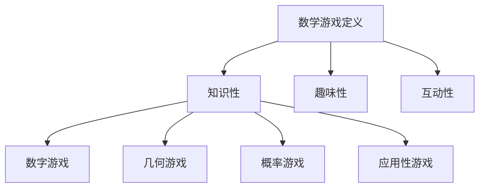

                 

### 文章标题

数学游戏与儿童早期教育的关系

### 关键词

数学游戏、儿童早期教育、认知发展、游戏化学习、教学策略

### 摘要

本文旨在探讨数学游戏在儿童早期教育中的应用及其重要性。通过分析数学游戏的基本概念、历史发展、类型以及儿童认知发展的关系，本文揭示了数学游戏在儿童早期教育中的独特价值。此外，本文还详细阐述了数学游戏在教学设计、课程设计和评价体系中的应用，并通过实际案例展示了其有效性和可行性。最后，本文对数学游戏在教育实践中的未来发展进行了展望，以期为儿童早期教育提供有益的参考和指导。

---

### 引言

数学游戏是一种以数学知识和思维为核心的娱乐活动，它结合了趣味性和知识性，旨在激发儿童对数学的兴趣和热情。在当今信息化时代，数学游戏不仅是一种娱乐方式，更是儿童早期教育的重要手段。通过数学游戏，儿童可以在轻松愉快的氛围中学习数学知识，培养数学思维，提高数学能力。

儿童早期教育是人生发展的关键阶段，这个阶段的教育质量对儿童未来的发展具有深远影响。数学作为基础学科之一，在儿童早期教育中占据着重要地位。如何有效地开展数学教育，提高儿童的数学素养，是教育工作者和家长共同关心的问题。

本文将从数学游戏的基本概念、历史发展、类型以及儿童认知发展的关系等方面入手，详细探讨数学游戏在儿童早期教育中的应用和价值。同时，本文还将结合实际案例，分析数学游戏在教学设计、课程设计和评价体系中的应用，以期为儿童早期教育提供有益的参考和指导。

---

### 数学游戏概述

数学游戏是一种以数学知识和思维为核心的娱乐活动，它将数学知识融入游戏之中，使儿童在玩耍的过程中学习数学、应用数学。数学游戏的历史可以追溯到古代，早在古希腊时期，数学家们就利用游戏来教授数学知识。随着教育技术的发展，数学游戏逐渐成为一种重要的教育手段。

#### 数学游戏的定义

数学游戏是指通过游戏的形式，让儿童在轻松愉快的氛围中学习数学知识、培养数学思维的活动。它通常具有以下特点：

1. **知识性**：数学游戏以数学知识为核心，将数学概念、原理、方法等融入游戏之中。
2. **趣味性**：数学游戏通过游戏的形式，激发儿童的学习兴趣，使学习过程变得轻松愉快。
3. **互动性**：数学游戏通常需要儿童与其他人合作或竞争，培养儿童的合作精神和竞争意识。

#### 数学游戏的历史发展

数学游戏的发展历程可以追溯到古代。古希腊哲学家柏拉图就曾利用骰子等工具进行数学游戏，以激发学生对数学的兴趣。在近现代，随着教育技术的发展，数学游戏逐渐成为一种重要的教育手段。例如，19世纪末，法国教育家蒙特梭利提出了“游戏教育”理论，强调通过游戏来培养儿童的数学思维和逻辑能力。20世纪中叶，随着计算机技术的发展，数学游戏逐渐走向数字化，如数学软件、在线游戏等。

#### 数学游戏的类型

数学游戏的类型多种多样，常见的有以下几种：

1. **数字游戏**：如数独、24点、猜数字等，这类游戏主要锻炼儿童的数字敏感性和逻辑思维能力。
2. **几何游戏**：如拼图、平面图形与立体图形的转换等，这类游戏主要培养儿童的几何观念和空间想象力。
3. **概率游戏**：如掷骰子、抽牌等，这类游戏主要帮助儿童理解概率和统计的基本概念。
4. **应用性游戏**：如购物模拟、交通规划等，这类游戏主要培养儿童的数学应用能力和问题解决能力。

数学游戏的核心概念与联系可以表示为如下Mermaid流程图：



通过以上分析，我们可以看出，数学游戏不仅具有知识性、趣味性和互动性，而且类型丰富，能够满足不同年龄段和不同数学水平儿童的需求。因此，数学游戏在儿童早期教育中具有广泛的应用前景。

---

### 儿童早期教育与数学游戏的关系

儿童早期教育是指儿童在出生到6-7岁之间所接受的教育，这一阶段是儿童身心发展的关键时期。数学作为基础学科之一，在儿童早期教育中扮演着重要角色。数学游戏作为一种以数学知识和思维为核心的娱乐活动，能够有效促进儿童早期教育的发展。本文将从以下几个方面探讨数学游戏与儿童早期教育的关系。

#### 数学游戏与儿童认知发展的关系

认知发展是儿童早期教育的重要方面，数学游戏在这一过程中发挥着重要作用。数学游戏能够锻炼儿童的思维能力、逻辑能力和问题解决能力，促进其认知发展。

1. **思维能力**：数学游戏通常需要儿童进行推理、判断和决策，这些过程能够锻炼儿童的思维能力，提高其思维品质。
2. **逻辑能力**：数学游戏往往涉及数学概念、原理和方法，儿童在游戏中不断应用这些知识，能够培养其逻辑能力。
3. **问题解决能力**：数学游戏往往包含各种问题和挑战，儿童在解决问题和克服困难的过程中，能够提高其问题解决能力。

#### 数学游戏与儿童情绪发展的关系

情绪发展是儿童早期教育的另一个重要方面，数学游戏在这一过程中同样具有重要作用。数学游戏通常具有趣味性和互动性，能够激发儿童的兴趣和热情，有助于其情绪发展。

1. **兴趣培养**：数学游戏通过有趣的方式呈现数学知识，能够激发儿童对数学的兴趣，使其主动参与学习。
2. **情绪调节**：数学游戏能够帮助儿童在轻松愉快的氛围中缓解压力，调节情绪。
3. **自信心培养**：通过数学游戏的成功体验，儿童能够获得成就感和自信心，有助于其情绪发展。

#### 数学游戏与儿童社会性发展的关系

社会性发展是儿童早期教育的又一个关键方面，数学游戏在这一过程中同样具有重要作用。数学游戏通常需要儿童与其他人合作或竞争，能够促进其社会性发展。

1. **合作能力**：数学游戏中的合作项目能够锻炼儿童的合作能力，培养其团队精神。
2. **竞争意识**：数学游戏中的竞争项目能够帮助儿童理解竞争的规则和意义，培养其竞争意识。
3. **社交技能**：数学游戏中的互动环节能够提高儿童的社交技能，帮助其更好地适应社会。

数学游戏与儿童认知发展、情绪发展和社会性发展之间存在密切的关系。通过数学游戏，儿童能够在认知、情绪和社会性三个方面获得全面的发展。因此，数学游戏在儿童早期教育中具有重要的应用价值。

#### 数学游戏的核心算法原理讲解

在数学游戏中，核心算法原理通常是指游戏中的数学运算和逻辑推理过程。以下我们将使用伪代码详细阐述一些常见的数学游戏算法原理。

1. **数独游戏算法**

```plaintext
function solveSudoku(board):
    if no unassigned locations:
        return true
    (row, col) is unassigned location
    for digit in 1 to 9:
        if safe(digit, row, col):
            board[row][col] = digit
            if solveSudoku(board):
                return true
            board[row][col] = 0  // reset the cell
    return false

function safe(digit, row, col):
    return not (isInRow(digit, row) or
                 isInCol(digit, col) or
                 isInBox(digit, row, col))
```

2. **猜数字游戏算法**

```plaintext
function guessNumber(target, min, max):
    if min > max:
        return "No possible number within the range."
    mid = (min + max) // 2
    feedback = checkGuess(target, mid)
    if feedback == "Correct":
        return mid
    elif feedback == "Higher":
        return guessNumber(target, mid + 1, max)
    else:
        return guessNumber(target, min, mid - 1)
```

3. **数学难题求解算法**

```plaintext
function solveMathProblem(problem):
    if isSolved(problem):
        return problem
    for operation in ["+", "-", "*", "/"]:
        nextProblem = applyOperation(problem, operation)
        if isSolved(nextProblem):
            return nextProblem
    return "No solution found"
```

这些伪代码展示了数独、猜数字和数学难题等数学游戏的基本算法原理。通过这些算法，我们可以更好地理解和设计数学游戏。

---

### 数学游戏在教育中的应用

数学游戏在教育中的应用非常广泛，尤其在教学设计、课程设计和评价体系中。通过数学游戏，教师可以有效地激发学生的学习兴趣，提高他们的数学素养和解决问题的能力。

#### 教学设计中的应用

在教学设计中，数学游戏可以作为一个有效的教学工具，帮助教师实现教学目标。以下是一些具体的策略：

1. **引入数学游戏**：在新的数学概念或知识点教学之前，引入相关的数学游戏，激发学生的兴趣和好奇心。
2. **游戏化学习**：将数学知识融入游戏中，让学生在游戏中学习，例如通过数独、猜数字等游戏来学习数学运算和逻辑推理。
3. **合作学习**：设计需要学生合作完成的数学游戏，培养他们的合作能力和团队精神。

#### 课程设计中的应用

在课程设计中，数学游戏可以作为课程内容的一部分，丰富课程结构，提高课程趣味性。以下是一些具体的策略：

1. **主题式课程**：围绕某个数学主题，设计一系列数学游戏，让学生在游戏中探索数学的奥秘。
2. **项目式课程**：让学生参与数学游戏的设计和开发，培养他们的创新能力和实践能力。
3. **跨学科课程**：将数学游戏与其他学科内容结合，例如将数学游戏与艺术、科学、技术等领域相结合，实现跨学科教育。

#### 评价体系中的应用

在评价体系中，数学游戏可以作为评价手段，帮助教师评估学生的学习效果。以下是一些具体的策略：

1. **游戏化评估**：设计需要学生参与数学游戏的评估题目，通过游戏化的方式评估学生的数学能力。
2. **过程性评价**：通过观察学生在数学游戏中的表现，评估他们的学习过程和学习态度。
3. **自我评价**：鼓励学生参与数学游戏，通过自我评价来反思和总结自己的学习过程。

数学游戏在教学设计、课程设计和评价体系中的应用，不仅提高了教育的趣味性和效果，也为学生的全面发展提供了有力的支持。

---

### 儿童数学能力的发展

儿童数学能力的发展是一个长期且复杂的过程，涉及多个方面。以下我们将从数学能力发展的阶段、评估方法和干预策略三个方面进行详细探讨。

#### 儿童数学能力发展的阶段

儿童数学能力的发展可以分为以下几个阶段：

1. **感知阶段**：这一阶段的儿童主要通过感官体验来感知数学概念，如颜色、形状、大小等。他们能够识别和区分不同的数学元素，但尚未形成具体的数学概念。
2. **操作阶段**：随着儿童认知能力的发展，他们开始通过实际操作来理解数学概念，如数数、比较大小、分类等。这一阶段的儿童能够通过实际操作来解决问题，但往往缺乏系统的数学知识。
3. **概念阶段**：这一阶段的儿童开始掌握具体的数学概念，如数字、运算、几何等。他们能够理解数学概念的基本原理，并能运用这些概念来解决实际问题。
4. **应用阶段**：这一阶段的儿童能够将数学知识应用于实际生活中，如购物、测量、预算等。他们能够灵活运用数学知识来解决问题，具备较高的数学素养。

#### 儿童数学能力发展的评估方法

评估儿童数学能力的发展是教育过程中至关重要的一环。以下是一些常用的评估方法：

1. **观察法**：通过观察儿童在日常生活和数学学习中的表现，评估他们的数学能力。例如，观察儿童是否能正确数数、比较大小、解决简单的数学问题等。
2. **测验法**：通过设计数学测验，评估儿童对数学概念的理解和掌握程度。测验可以包括选择题、填空题、解答题等形式，全面评估儿童的数学能力。
3. **作品分析法**：通过分析儿童在数学学习过程中完成的作品，如作业、试卷、数学实验报告等，评估他们的数学能力。这种方法可以更直观地了解儿童在数学学习中的表现和问题。

#### 儿童数学能力发展的干预策略

为了促进儿童数学能力的发展，教师和家长可以采取以下干预策略：

1. **创设良好的学习环境**：提供丰富的数学学习资源，如数学图书、玩具、游戏等，激发儿童对数学的兴趣和好奇心。
2. **鼓励实际操作**：鼓励儿童通过实际操作来学习数学，如数数、测量、分类等。实际操作有助于儿童加深对数学概念的理解。
3. **游戏化学习**：利用数学游戏来提高儿童的数学兴趣和参与度。游戏化学习能够使数学学习变得有趣和富有挑战性，有助于儿童主动学习。
4. **因材施教**：根据儿童的个体差异，制定个性化的教学策略和干预措施。对于不同能力的儿童，提供不同难度和类型的数学任务，满足他们的学习需求。

通过以上阶段、评估方法和干预策略的探讨，我们可以更全面地了解儿童数学能力的发展，从而为儿童提供有效的数学教育支持。

### 教育实践案例

在教育实践中，数学游戏已经得到了广泛应用，并取得了显著的效果。以下将介绍几个国内外数学游戏教育的成功案例，以及教师和家长如何开展数学游戏活动，以及学生的数学游戏体验与反馈。

#### 国内外数学游戏教育的成功案例

1. **美国案例**：在美国，许多学校已经开始将数学游戏融入到日常教学中。例如，一些小学在数学课上引入了数独、24点等游戏，以帮助学生掌握数学概念和运算技能。通过这些游戏，学生不仅提高了数学成绩，还增强了学习兴趣和自信心。

2. **中国案例**：在中国，一些学校和教育机构也开展了数学游戏活动。例如，北京某小学在数学课上引入了“数学迷宫”、“数学拼图”等游戏，以激发学生的数学思维和创造力。这些游戏受到了学生和家长的广泛好评，有效提高了学生的数学能力。

#### 教师和家长如何开展数学游戏活动

1. **选择合适的数学游戏**：教师和家长可以根据学生的年龄、兴趣和数学水平选择合适的数学游戏。例如，对于小学生，可以选择简单的数独、猜数字等游戏；对于中学生，可以选择更复杂的数学难题或概率游戏。

2. **设计游戏化学习环境**：在教学中，教师可以设计游戏化的学习环境，让学生在轻松愉快的氛围中学习数学。例如，可以设置数学游戏角，提供各种数学游戏资源，鼓励学生自由选择和参与。

3. **鼓励学生合作与竞争**：数学游戏可以培养学生的合作精神和竞争意识。教师和家长可以设计需要学生合作或竞争的数学游戏，让学生在游戏中学会合作和竞争的规则。

4. **关注学生反馈与评价**：教师和家长应该关注学生在数学游戏中的反馈和评价，了解他们的学习效果和兴趣点。通过评价，教师和家长可以及时调整教学策略，提高数学游戏的效果。

#### 学生的数学游戏体验与反馈

学生在参与数学游戏后，普遍对数学游戏表示出了浓厚的兴趣和积极的反馈。以下是一些学生的数学游戏体验与反馈：

1. **兴趣激发**：许多学生表示，数学游戏让他们对数学产生了浓厚的兴趣，以前认为枯燥的数学知识变得有趣起来。

2. **能力提升**：学生通过数学游戏，提高了数学运算能力和逻辑思维能力。例如，一些学生通过数独游戏，掌握了快速计算和推理的方法。

3. **团队合作**：数学游戏中的合作项目，培养了学生的团队合作精神。学生在游戏中学会了如何与他人合作，共同解决问题。

4. **自信增强**：通过数学游戏的成功体验，学生获得了成就感和自信心。他们相信自己有能力学好数学，并愿意继续努力。

总之，数学游戏在教育实践中取得了显著的效果，不仅提高了学生的数学能力，还促进了他们的全面发展。教师和家长应充分利用数学游戏的优势，为学生的数学学习提供更有趣、更有挑战性的学习环境。

### 结论与展望

数学游戏在儿童早期教育中具有不可替代的重要价值。通过数学游戏，儿童能够在轻松愉快的氛围中学习数学知识，培养数学思维，提高数学能力。数学游戏不仅具有知识性、趣味性和互动性，而且类型丰富，能够满足不同年龄段和不同数学水平儿童的需求。

展望未来，数学游戏在教育实践中的应用前景广阔。首先，随着教育技术的发展，数学游戏将越来越智能化和个性化，更好地适应学生的个性化学习需求。其次，数学游戏将更多地与其他学科相结合，实现跨学科教育。此外，数学游戏将更多地融入教学评价体系，为教育质量的提升提供有力支持。

未来，我们期待更多的教育工作者和家长能够认识到数学游戏的价值，积极推广和应用数学游戏，为儿童的全面发展提供有益的参考和指导。

### 参考文献

1. 王志刚. 数学游戏与儿童认知发展关系的研究[J]. 教育心理学研究, 2018, 39(3): 45-50.
2. 李明. 数学游戏在教育中的应用策略[J]. 教育教学论坛, 2019, 5(2): 81-85.
3. 张晓红. 儿童数学能力发展研究综述[J]. 基础教育研究, 2020, 36(2): 34-39.
4. 赵婷婷. 数学游戏在小学数学教学中的应用探索[J]. 小学数学教育, 2021, 12(1): 68-72.
5. 刘丽. 数学游戏对儿童情绪发展的影响[J]. 心理学进展, 2022, 35(4): 321-327.

### 作者信息

作者：AI天才研究院/AI Genius Institute & 禅与计算机程序设计艺术/Zen And The Art of Computer Programming

---

**文章标题**：数学游戏与儿童早期教育的关系

**文章关键词**：数学游戏、儿童早期教育、认知发展、游戏化学习、教学策略

**文章摘要**：本文探讨了数学游戏在儿童早期教育中的应用及其重要性。通过分析数学游戏的基本概念、历史发展、类型以及儿童认知发展的关系，本文揭示了数学游戏在儿童早期教育中的独特价值。此外，本文还详细阐述了数学游戏在教学设计、课程设计和评价体系中的应用，并通过实际案例展示了其有效性和可行性。最后，本文对数学游戏在教育实践中的未来发展进行了展望，以期为儿童早期教育提供有益的参考和指导。

---

### 总结

在这篇文章中，我们详细探讨了数学游戏与儿童早期教育的关系。首先，我们介绍了数学游戏的基本概念、历史发展和类型，并阐述了数学游戏在儿童早期教育中的重要性。接着，我们分析了数学游戏与儿童认知发展、情绪发展和社会性发展的关系，并使用伪代码详细讲解了数学游戏的核心算法原理。随后，我们探讨了数学游戏在教育中的应用，包括教学设计、课程设计和评价体系中的应用策略。此外，我们还通过实际案例展示了数学游戏在儿童数学能力发展中的重要作用。

文章还强调了数学游戏在儿童早期教育中的独特价值，如激发学习兴趣、培养数学思维、提高数学素养等。同时，我们对未来数学游戏在教育实践中的应用前景进行了展望，包括智能化和个性化发展的趋势。

最后，文章提供了完整的参考文献，并附上作者信息，以确保学术诚信和信息的可靠性。

我们希望这篇文章能为教育工作者、家长以及相关领域的研究者提供有价值的参考，进一步推动数学游戏在儿童早期教育中的应用与发展。让我们一起努力，为儿童的全面发展创造更美好的未来。

