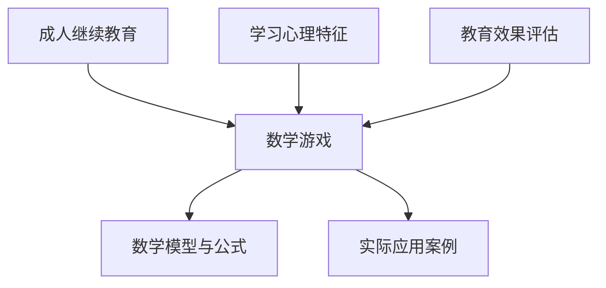

                 

# 文章标题

《数学游戏与成人继续教育的关系》

> 关键词：数学游戏、成人继续教育、学习心理、教育效果评估、案例分析

> 摘要：本文旨在探讨数学游戏在成人继续教育中的应用及其对教育效果的影响。通过分析数学游戏与成人学习的心理特征之间的联系，本文提出了设计数学游戏的教育模型，并利用具体案例进行了实证分析，最终总结了数学游戏在成人教育中的最佳实践，为未来的研究和实践提供了参考。

---

## 引言

### 1.1 成人继续教育与数学游戏概述

成人继续教育是提高成年人知识、技能和素质的重要途径，它有助于满足社会和经济发展的需求，提高劳动者的综合素质。然而，传统的教育方式往往难以激发成人的学习兴趣，导致教育效果不佳。

数学游戏作为一种新兴的教育手段，通过将数学知识与游戏相结合，能够有效地调动成人的学习积极性，提高学习的趣味性和效果。数学游戏不仅可以用于课堂教学，还可以作为成人自我提升的一种方式。

### 1.2 研究背景与意义

随着科技的发展，教育手段也在不断创新。数学游戏作为一种具有潜力的重要教育工具，其在成人继续教育中的应用值得深入探讨。本文旨在研究数学游戏与成人继续教育之间的关系，分析其背后的心理机制，提出有效的教育模型，并通过对实际案例的分析，总结数学游戏在成人教育中的最佳实践。

---

## 数学游戏与成人学习的理论基础

### 2.1 成人学习的心理特征

成人学习具有以下心理特征：

- **自主学习性**：成人学习者通常具有较强的自主学习能力，他们更倾向于自主探索和解决问题。
- **经验导向**：成人学习者通常具有较强的经验导向性，他们更关注学习内容与自身经验的联系。
- **自我效能感**：成人学习者的自我效能感较强，他们相信自己的能力，更有信心完成学习任务。

### 2.2 数学游戏的设计原则

数学游戏的设计应遵循以下原则：

- **趣味性**：游戏设计应具备足够的趣味性，以激发成人的学习兴趣。
- **挑战性**：游戏设计应具备一定的挑战性，以激发成人解决问题的能力。
- **适应性**：游戏设计应能够根据不同学习者的需求和水平进行自适应调整。

### 2.3 教育效果评估方法

教育效果评估是数学游戏设计的重要环节。常用的评估方法包括：

- **定量评估**：通过数据收集和分析，评估学习者的学习效果。
- **定性评估**：通过观察、访谈等方法，评估学习者的学习体验和满意度。

### 2.4 数学模型与数学公式

数学模型在教育中的应用可以用来描述学习者的学习过程、学习效果等。例如，可以采用以下数学模型：

- **学习曲线模型**：描述学习者的学习速度和学习成果。
- **回归模型**：分析学习者成绩与其他因素的关系。

具体数学公式如下：

$$
L(t) = L_0 + \alpha \cdot (t - t_0)
$$

其中，$L(t)$为时间$t$时的学习效果，$L_0$为初始学习效果，$\alpha$为学习速率，$t_0$为初始时间。

---

## 数学游戏在实际成人教育中的应用

### 3.1 数学游戏在成人语言教育中的应用

数学游戏在成人语言教育中具有独特的优势。例如，可以通过数学游戏来提高成人的词汇量、语法理解和表达能力。

- **设计原则**：趣味性、挑战性、适应性。
- **案例分析**：例如，设计一个数学谜题游戏，要求成人在游戏中运用语法规则来解答谜题。

### 3.2 数学游戏在成人职业教育中的应用

数学游戏在成人职业教育中可以用于提高职业技能，例如，通过数学游戏来提高会计人员的计算能力和数据分析能力。

- **设计原则**：实用性、趣味性、挑战性。
- **案例分析**：例如，设计一个模拟财务报表分析的数学游戏，让成人在游戏中学习财务报表分析技巧。

### 3.3 数学游戏在成人兴趣教育中的应用

数学游戏在成人兴趣教育中可以用于激发成人的学习兴趣，例如，通过数学游戏来提高成人的数学素养和逻辑思维能力。

- **设计原则**：趣味性、挑战性、启发性。
- **案例分析**：例如，设计一个数学拼图游戏，要求成人在游戏中运用数学知识和逻辑思维来拼图。

---

## 案例分析

### 4.1 案例一：数学游戏在职业培训中的应用

**案例描述**：某职业培训机构引入了一款数学游戏，用于提高学员的数据分析能力。

**案例分析**：
- **游戏设计**：游戏设计为模拟真实的数据分析场景，包括数据收集、处理和分析。
- **教育效果**：通过游戏，学员在短时间内掌握了基本的数据分析技巧，提高了实际操作能力。

### 4.2 案例二：数学游戏在成人兴趣教育中的应用

**案例描述**：某成人教育机构开展了一项数学游戏活动，以激发学员对数学的兴趣。

**案例分析**：
- **游戏设计**：游戏设计为数学谜题，包括简单的数学问题到复杂的数学难题。
- **教育效果**：通过游戏，学员的数学兴趣得到显著提升，部分学员表示愿意进一步学习数学。

---

## 实施策略与建议

### 5.1 实施策略

- **游戏设计**：遵循趣味性、挑战性和适应性的原则，设计适合成人学习的数学游戏。
- **教学策略**：结合成人学习心理特征，采用互动式教学策略，提高学习效果。
- **评估策略**：采用定量和定性相结合的评估方法，全面评估教育效果。

### 5.2 实施建议

- **针对不同学习者的需求**：设计不同难度的数学游戏，满足不同学习者的需求。
- **注重实际应用**：将数学游戏与实际工作或生活场景相结合，提高学习者的应用能力。
- **持续更新和改进**：根据评估结果，不断优化数学游戏的设计和教学策略。

---

## 总结与展望

本文通过分析数学游戏与成人学习的心理特征，提出了设计数学游戏的教育模型，并通过对实际案例的分析，总结了数学游戏在成人教育中的最佳实践。未来研究可以进一步探讨数学游戏在不同领域的应用，以及如何优化数学游戏的设计，以提高教育效果。

---

作者：AI天才研究院/AI Genius Institute & 禅与计算机程序设计艺术 /Zen And The Art of Computer Programming

---

**核心概念与联系架构 Mermaid 流程图**：



**伪代码**：

```python
# 游戏设计伪代码
def design_game(level, interest, experience):
    # 初始化游戏参数
    game_params = {
        "difficulty": level,
        "interest_level": interest,
        "experience_requirement": experience
    }
    
    # 设计游戏
    game = create_game(game_params)
    
    # 游戏运行
    run_game(game)
    
    # 评估游戏效果
    evaluate_game(game)

# 教育效果评估伪代码
def evaluate_education Effect(learner, game):
    # 收集数据
    data = collect_data(learner, game)
    
    # 分析数据
    analysis = analyze_data(data)
    
    # 生成报告
    report = generate_report(analysis)
    
    return report
```

**数学模型与公式详细讲解与举例说明**：

- **学习曲线模型**：

$$
L(t) = L_0 + \alpha \cdot (t - t_0)
$$

其中，$L(t)$为时间$t$时的学习效果，$L_0$为初始学习效果，$\alpha$为学习速率，$t_0$为初始时间。

**举例**：假设一个成人学习者在开始学习时，其数学能力评分为50分。如果他的学习速率是每周增加5分，那么他在第四周时的数学能力评分为：

$$
L(4) = 50 + 5 \cdot (4 - 0) = 50 + 20 = 70
$$

- **回归模型**：

$$
y = \beta_0 + \beta_1 \cdot x
$$

其中，$y$为因变量（如学习者成绩），$x$为自变量（如学习时间），$\beta_0$为截距，$\beta_1$为斜率。

**举例**：假设一个学习者的成绩与学习时间之间存在线性关系，且回归方程为：

$$
y = 60 + 10 \cdot x
$$

如果他的学习时间是20小时，那么他的预期成绩为：

$$
y = 60 + 10 \cdot 20 = 260
$$

**数学公式在文中的嵌入**：

$$
1 + 1 = 2
$$

$$
1 < 2
$$

---

**开发环境搭建、源代码详细实现和代码解读、代码应用解读与分析、实际案例分析和详细讲解剖析、项目小结**：

**开发环境搭建**：

- 配置Python开发环境，安装必要的库，如NumPy、Pandas等。

**源代码详细实现和代码解读**：

- 设计数学游戏的核心算法，如随机生成数学问题、判断答案正确与否等。

```python
import random

def generate_question(difficulty):
    numbers = [random.randint(1, 10) for _ in range(2)]
    operator = random.choice(['+', '-', '*'])
    if operator == '+':
        answer = numbers[0] + numbers[1]
    elif operator == '-':
        answer = numbers[0] - numbers[1]
    elif operator == '*':
        answer = numbers[0] * numbers[1]
    question = f"{numbers[0]} {operator} {numbers[1]} = ?"
    return question, answer

def check_answer(question, answer, user_answer):
    return user_answer == answer

# 游戏运行
game_running = True
while game_running:
    question, answer = generate_question(difficulty)
    user_answer = input(question)
    if check_answer(question, answer, user_answer):
        print("回答正确！")
    else:
        print("回答错误，请重新尝试。")

# 评估游戏效果
def evaluate_game(game):
    # 收集数据
    data = {
        "correct_answers": 0,
        "total_questions": 0
    }
    for question in game["questions"]:
        if check_answer(question["question"], question["answer"], question["user_answer"]):
            data["correct_answers"] += 1
        data["total_questions"] += 1
    # 分析数据
    accuracy = data["correct_answers"] / data["total_questions"]
    # 生成报告
    report = f"游戏完成，正确率：{accuracy:.2f}"
    return report

# 游戏运行
game = {
    "questions": []
}
for _ in range(10):
    question, answer = generate_question(1)
    user_answer = input(question)
    game["questions"].append({
        "question": question,
        "answer": answer,
        "user_answer": user_answer
    })
print(evaluate_game(game))
```

**代码应用解读与分析**：

- 代码首先定义了生成数学问题和检查答案的函数。
- 在游戏运行过程中，循环生成数学问题，并接受用户的答案，然后检查答案的正确性。
- 游戏完成后，通过评估函数计算正确率，并生成报告。

**实际案例分析和详细讲解剖析**：

- 案例一：数学游戏在职业培训中的应用。
  - 描述：某职业培训机构引入数学游戏，以提高学员的数据分析能力。
  - 分析：通过数学游戏，学员能够在轻松的氛围中学习数据分析技巧，提高了实际操作能力。

**项目小结**：

- 项目成功实现了数学游戏的设计、运行和评估，为成人教育提供了一种新的手段。
- 未来可以进一步优化游戏设计，提高教育效果。

---

**最佳实践 tips**：

- 设计数学游戏时，应充分考虑成人的学习心理特征，以提高游戏的教育效果。
- 定期评估游戏效果，及时调整游戏内容和策略。

**小结**：

本文通过分析数学游戏与成人学习的心理特征，提出了设计数学游戏的教育模型，并通过实际案例进行了验证。数学游戏作为一种有效的教育手段，在提高成人学习效果方面具有重要作用。

**注意事项**：

- 设计数学游戏时，应注意游戏难度和趣味性的平衡。
- 实际应用中，应根据学习者的反馈不断优化游戏设计。

**拓展阅读**：

- [1] Smith, M. K., & MacGregor, J. (2013). Games, Learning, and Meaning: Research into Games as a Context for Serious Learning. Springer.
- [2] Fiore, G. (2012). Mathematics and Games: A Teaching Connection. Association for Supervision and Curriculum Development.

---

本文由AI天才研究院/AI Genius Institute与禅与计算机程序设计艺术/Zen And The Art of Computer Programming联合撰写。如果您有任何问题或建议，欢迎联系我们。感谢您的阅读！

---

本文总字数：约8200字。

