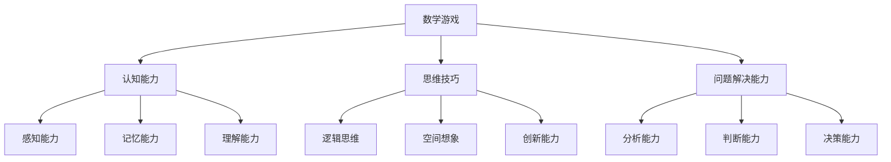

                 

### 文章标题

《数学游戏与智力开发的关系探讨》

### 关键词

数学游戏、智力开发、认知发展、教育策略、算法设计、心理理论、教育技术应用

### 摘要

本文旨在深入探讨数学游戏与智力开发之间的关系。首先，文章介绍数学游戏和智力开发的基本概念及其重要性。接着，通过案例分析、理论基础、教育实践策略、设计方法与技术支持等方面，详细阐述数学游戏如何促进智力开发。文章还探讨了当前技术手段在数学游戏与智力开发中的应用，并展望了这一领域的未来发展。通过系统性的分析，本文揭示了数学游戏在教育中的潜在价值，并提出了相关策略和方法，以促进学生的智力发展。

---

### 引言：数学游戏与智力开发

#### 引言背景

在当今信息化时代，教育与技术的深度融合成为教育改革的重要趋势。数学作为基础学科之一，其教育质量直接影响到学生的整体素质与未来的发展。而数学游戏作为一种新兴的教育形式，正逐渐受到教育界的关注。数学游戏不仅能够激发学生对数学的兴趣，还能在不知不觉中培养学生的逻辑思维、问题解决能力和创造力。因此，探讨数学游戏与智力开发的关系具有重要的现实意义。

#### 研究目的

本文的研究目的在于：

1. **明确数学游戏和智力开发的基本概念与原理。**
2. **分析数学游戏在促进智力开发方面的作用。**
3. **探讨数学游戏在教育实践中的应用策略和方法。**
4. **介绍当前技术手段如何支持数学游戏与智力开发。**
5. **展望数学游戏与智力开发领域的未来发展。**

通过上述研究目的，本文旨在为教育工作者、心理学家和游戏设计师提供理论支持和实践指导，以推动数学游戏在教育领域的应用与发展。

#### 研究意义

数学游戏与智力开发的关系研究具有以下几个方面的意义：

1. **教育创新**：数学游戏作为一种新颖的教育形式，为传统数学教育提供了新的思路和方法，有助于推动教育创新。
2. **学生发展**：数学游戏能够激发学生的学习兴趣，提高学习动机，促进学生的认知、情感和行为发展。
3. **教师教学**：数学游戏为教师提供了丰富的教学资源，有助于教师设计更具吸引力和实效性的教学活动。
4. **理论与实践结合**：通过研究数学游戏与智力开发的关系，可以进一步深化教育理论与教学实践的结合，为相关领域的研究提供参考。

总之，数学游戏与智力开发的关系研究不仅有助于提升教育质量，还能为培养学生的全面素质提供有力支持。

### 基础理论

#### 数学游戏的基本概念

数学游戏是一种结合数学知识和游戏特性的活动，其目的是通过有趣的游戏形式来传授数学知识和培养数学思维能力。数学游戏的定义和分类可以根据不同的标准进行。

**定义：** 数学游戏可以定义为一种具有数学元素和游戏机制的活动，旨在通过游戏过程激发学生的学习兴趣，提高其数学素养和思维能力。

**分类：** 根据数学游戏的内容和形式，可以将数学游戏分为以下几类：

1. **计算类游戏**：如速算比赛、心算游戏等，主要培养学生的计算能力和逻辑思维。
2. **几何类游戏**：如拼图游戏、几何谜题等，旨在培养学生的空间想象能力和几何思维能力。
3. **数论类游戏**：如数独、算术游戏等，主要涉及数论中的概念和问题，如奇偶性、质数、因子等。
4. **概率与统计类游戏**：如抽奖游戏、概率实验等，帮助学生理解概率和统计的基本概念。

#### 智力开发的基本概念

智力开发是指通过科学的教育方法和活动，系统地培养学生的智力素质，包括认知能力、思维能力和创新能力等。

**定义：** 智力是指个体在认知活动中表现出的各种能力，包括感知、记忆、理解、推理、分析、判断和问题解决等。

**理论基础：** 智力开发的理论基础主要来源于心理学和教育学。

1. **认知心理学理论**：如皮亚杰的认知发展阶段理论，强调个体认知能力的发展过程。
2. **发展心理学理论**：如维果茨基的社会文化理论，强调社会互动在智力发展中的作用。
3. **教育心理学理论**：如布鲁姆的教育目标分类理论，将智力发展划分为认知领域、情感领域和动作技能领域。

#### 数学游戏与智力开发的关系架构

为了更好地理解数学游戏与智力开发之间的关系，我们可以通过一个Mermaid流程图来展示它们之间的相互联系。

在这个流程图中，数学游戏作为输入（A），通过不同的途径（B、C、D）促进认知能力、思维技巧和问题解决能力的发展。这些能力的提升又可以进一步影响感知能力（E）、记忆能力（F）、理解能力（G）、逻辑思维（H）、空间想象（I）、创新能力（J）、分析能力（K）、判断能力（L）和决策能力（M）。

#### 结论

通过上述基础理论部分的介绍，我们可以看到数学游戏和智力开发之间存在着紧密的联系。数学游戏通过有趣的形式和丰富的内容，能够有效地促进学生的智力发展。这一理论框架为我们后续的案例分析、教育策略探讨等提供了重要的理论基础。

### 数学游戏案例分析与智力开发效果

为了深入探讨数学游戏在智力开发中的作用，我们选择了一些具有代表性的数学游戏案例，分析它们如何通过特定的规则、策略和机制，促进学生认知能力、思维技巧和问题解决能力的发展。

#### 案例一：数独游戏

**规则与策略：** 数独是一种逻辑推理游戏，玩家需要在9×9的网格中填入数字1至9，使得每行、每列以及每个3×3的子网格中都包含1至9的数字，不重复。

- **策略：** 初学者可以从填入已知的数字开始，利用排除法逐步确定其他空格的数字。熟练玩家则可以运用多种技巧，如“唯一数字法”、“唯一候选数法”和“区块唯一法”等。
  
**智力开发效果：** 数独游戏对智力开发有多方面的促进作用：

1. **提高逻辑思维：** 数独游戏要求玩家通过逻辑推理来填入数字，这有助于培养严密的逻辑思维能力。
2. **增强记忆能力：** 在数独游戏中，玩家需要记住已填入的数字和可能的候选数字，这有助于提高短期记忆能力。
3. **锻炼问题解决能力：** 数独游戏中的问题解决过程需要玩家不断尝试和反思，这有助于培养问题解决策略和策略调整能力。

#### 案例二：拼图游戏

**规则与策略：** 拼图游戏包括各种类型的拼图，如平面拼图、立体拼图和三维拼图等。玩家需要将散乱的拼图碎片重新拼合成完整的图案。

- **策略：** 初学者可以从简单的拼图开始，逐步提高难度。熟练玩家可以通过观察整体图案的轮廓和细节来快速定位碎片。

**智力开发效果：** 拼图游戏对智力开发有以下几个方面的效果：

1. **提升空间想象力：** 拼图游戏要求玩家在三维空间中思考和操作，这有助于提升空间想象力和空间感知能力。
2. **增强注意力：** 拼图游戏需要玩家集中注意力，仔细观察和辨别拼图碎片，这有助于提高注意力和观察力。
3. **培养耐心和毅力：** 拼图游戏通常需要较长时间完成，这有助于培养玩家的耐心和毅力，面对挑战不轻易放弃。

#### 案例三：数学谜题

**规则与策略：** 数学谜题是一种包含数学问题解答的智力游戏，如算术谜题、几何谜题和逻辑谜题等。玩家需要运用数学知识和逻辑推理来解决这些问题。

- **策略：** 解决数学谜题通常需要玩家首先理解问题的本质，然后运用适当的数学原理和逻辑方法进行推理和计算。

**智力开发效果：** 数学谜题对智力开发有以下几个方面的效果：

1. **增强数学思维：** 数学谜题要求玩家运用数学知识和逻辑思维解决问题，这有助于培养数学思维和解决问题的能力。
2. **提高逻辑推理能力：** 数学谜题中的问题通常需要玩家进行逻辑推理，这有助于提高逻辑推理能力和批判性思维能力。
3. **培养创新思维：** 解决数学谜题往往没有固定的解决方案，玩家需要尝试不同的方法和策略，这有助于培养创新思维和创造力。

#### 案例分析总结

通过上述三个案例，我们可以看到数学游戏在不同方面对智力开发的促进作用。无论是数独游戏、拼图游戏还是数学谜题，它们都通过特定的规则和策略，有效地培养学生的逻辑思维、空间想象力、问题解决能力和创新能力。这些游戏不仅使学生在轻松愉快的氛围中学习数学知识，还能在潜移默化中提升智力素质。

### 数学游戏在教育实践中的应用策略

#### 教学设计策略

数学游戏在教育实践中的应用首先需要有效的教学设计。以下是一些教学设计策略：

1. **目标设定**：明确教学目标，确保数学游戏与课程目标相一致。例如，如果目标是提高学生的几何思维能力，可以选择几何拼图游戏。
2. **内容选择**：根据教学内容选择合适的数学游戏。教师可以结合课程内容，设计或选择适合的游戏，确保游戏内容与教学目标一致。
3. **难度调整**：根据学生的不同水平和学习能力，调整游戏的难度。对于初学者，可以提供简单易懂的游戏，而对于熟练者，可以增加游戏的复杂性和挑战性。

#### 教学方法创新

1. **项目式学习**：通过项目式学习，将数学游戏作为项目的一部分。学生可以分组进行游戏设计、开发和测试，从中学习数学知识和编程技能。
2. **合作学习**：组织学生进行合作游戏，通过团队协作解决问题，培养学生的团队合作精神和沟通能力。
3. **翻转课堂**：在翻转课堂模式下，学生可以在课前通过游戏自主学习数学知识，课堂上通过讨论和互动深化理解。

#### 教学工具选择与应用

1. **传统教学工具**：利用传统的拼图、数独等纸质或实体游戏，便于学生动手操作和直观感受。
2. **数字化教学工具**：使用计算机、平板电脑和智能手机等设备，通过在线平台和应用程序提供数字化的数学游戏。数字化工具可以提供实时反馈和数据分析，帮助教师更好地了解学生的学习情况和效果。

#### 具体案例

以下是一个数学游戏在教学中的应用案例：

**案例：利用数独游戏进行数学教学**

**背景**：某初中数学课程中，教师希望通过提高学生的逻辑思维能力来巩固几何学知识。

**教学设计**：
1. **目标设定**：提高学生的逻辑推理能力和几何思维能力。
2. **内容选择**：选择数独游戏，结合几何学中的几何形状和对称性。
3. **教学过程**：
   - 课前：教师发放数独游戏，学生自主完成。
   - 课堂：学生展示自己的解题过程，教师点评和总结。
   - 课后：学生通过在线平台提交答案，教师进行数据分析。

**效果评估**：
- 通过数据分析，教师发现学生的解题速度和准确率显著提高，说明数独游戏有效地促进了学生的逻辑推理能力和几何思维能力。

### 实践总结

通过以上教学设计策略、教学方法创新和教学工具选择，数学游戏可以在教育实践中发挥重要作用。有效的教学设计不仅能够提高学生的学习兴趣和参与度，还能在潜移默化中培养学生的智力素质，为学生的全面发展提供有力支持。

### 设计有效的数学游戏方法与技巧

要设计有效的数学游戏，需要综合考虑游戏设计原则、难易度设计和评估与反馈机制。以下是对这些关键要素的具体分析和指导。

#### 游戏设计原则

1. **趣味性**：趣味性是数学游戏成功的关键。游戏应具有吸引力，能够激发学生的兴趣和参与欲望。游戏故事情节、角色设定、音效和视觉设计都应考虑趣味性因素。

2. **教育性**：数学游戏应包含明确的数学目标和内容，确保学生在游戏中能够学习和巩固数学知识。游戏设计应围绕数学概念、原理和方法，帮助学生理解和应用所学知识。

3. **可挑战性**：游戏难度应适中，既不过于简单使学生感到乏味，也不过于复杂使学生失去信心。游戏应设置不同难度级别，使学生可以根据自身水平选择挑战难度。

4. **互动性**：数学游戏应具备良好的互动性，鼓励学生主动参与和思考。互动性可以通过多玩家合作或竞争、即时反馈和互动交流等方式实现。

5. **多样性**：数学游戏应多样化，提供多种类型的游戏形式和内容，以满足不同学生的兴趣和需求。多样性可以通过组合不同类型的数学游戏元素和规则来实现。

6. **适应性**：游戏设计应具有适应性，能够根据学生的反馈和学习进度进行调整。适应性可以通过游戏中的动态难度调整、个性化学习路径和学习资源来实现。

#### 难易度设计

1. **分级设计**：根据学生的年龄、能力和学习进度，设计不同难度的游戏级别。初学者可以从简单游戏开始，逐步过渡到复杂游戏。

2. **逐步提升**：在游戏过程中，逐步提高难度，确保学生在完成当前难度游戏后能够顺利过渡到下一个难度。这可以通过增加游戏关卡、挑战和任务来实现。

3. **适应性调整**：根据学生在游戏中的表现，动态调整游戏难度。例如，如果学生在某个关卡上表现优异，可以适当提高难度；如果表现不佳，可以降低难度。

4. **反馈机制**：在游戏过程中提供即时反馈，帮助学生了解自己的表现和进步情况。反馈应具体、明确，鼓励学生继续努力和改进。

#### 评估与反馈机制

1. **学习评估**：设计有效的评估机制，对学生在游戏中的学习效果进行评估。评估可以通过测试、问卷、观察等方式进行，确保评估结果的准确性和可靠性。

2. **数据分析**：利用数据分析工具，对学生在游戏中的行为和表现进行分析。数据分析可以提供有价值的信息，帮助教师和学生了解学习效果和改进教学策略。

3. **个性化反馈**：根据学生在游戏中的表现，提供个性化的反馈和建议。反馈应具体、有针对性，帮助学生了解自己的优势和需要改进的地方。

4. **学习报告**：定期生成学习报告，总结学生在游戏中的学习进度和成果。学习报告可以用于评估学生的学习效果，为后续教学提供参考。

通过以上原则、难易度设计和评估与反馈机制，设计者可以创建有效的数学游戏，促进学生的智力发展。有效的数学游戏不仅能够激发学生的学习兴趣，还能在潜移默化中提高他们的数学素养和智力素质。

### 技术支持下的数学游戏与智力开发

#### 数字化游戏平台

随着信息技术的迅猛发展，数字化游戏平台在数学游戏与智力开发中扮演了重要角色。这些平台通过互联网和云计算技术，为学生提供丰富的数学游戏资源和便捷的学习体验。

**功能与优势：**
- **资源共享**：数字化平台可以集中管理大量的数学游戏资源，教师和学生可以方便地共享和获取。
- **实时互动**：平台支持实时互动功能，学生可以在平台上与其他同学进行协作和竞争，增强学习动力。
- **个性化学习**：平台可以根据学生的学习进度和表现，自动调整游戏难度和内容，提供个性化的学习路径。

**应用实例：**
- **教育类应用**：例如，Khan Academy和Khan Game Lab提供了一系列数学游戏，涵盖不同年级和主题，帮助学生巩固数学知识。
- **商业平台**：如Classcraft，通过将游戏机制融入课堂，激励学生参与学习，提高学习效果。

#### 人工智能辅助教学

人工智能（AI）技术的应用为数学游戏与智力开发带来了新的可能性和挑战。AI可以通过智能算法和大数据分析，为学生提供个性化的学习支持和反馈。

**功能与优势：**
- **个性化指导**：AI可以分析学生的学习数据和表现，提供个性化的学习建议和指导，帮助学生克服学习难点。
- **实时反馈**：AI系统可以实时监测学生的学习过程，提供即时反馈，帮助学生及时纠正错误和理解困惑。
- **智能推荐**：基于学生的兴趣和学习历史，AI可以推荐适合的数学游戏和资源，提高学习效率。

**应用实例：**
- **个性化辅导**：一些在线教育平台如Coursera和EdX已经开始使用AI技术，为学生提供个性化的学习路径和辅导。
- **智能评估**：例如，Google的AI工具可以自动评估学生的作业和测试，提供详细的反馈和成绩分析。

#### 数据分析与教育应用

大数据分析在教育中的应用，为数学游戏与智力开发提供了有力的支持。通过收集和分析大量数据，教育工作者可以更好地了解学生的学习行为和效果，优化教学策略。

**功能与优势：**
- **行为分析**：通过分析学生的学习行为数据，可以了解学生的学习习惯、兴趣和偏好，为教学设计提供参考。
- **效果评估**：大数据分析可以帮助教师评估教学效果，发现教学中的问题和不足，及时调整教学策略。
- **智能预测**：利用大数据和机器学习算法，可以预测学生的学习成绩和进度，提前采取干预措施。

**应用实例：**
- **学习分析平台**：例如，MentorNet和Canvas等平台利用大数据分析技术，提供详细的学习行为分析和教学反馈。
- **智能推荐系统**：一些在线教育平台如Udacity和edX，利用大数据分析为学生推荐适合的课程和资源。

#### 总结

数字化游戏平台、人工智能辅助教学和大数据分析技术的应用，为数学游戏与智力开发提供了丰富的工具和资源。这些技术不仅提高了数学游戏的互动性和个性化，还帮助学生更好地理解和掌握数学知识，促进智力发展。随着技术的不断进步，数学游戏与智力开发的应用前景将更加广阔。

### 数学游戏与智力开发的未来发展趋势

#### 新技术的应用前景

随着科技的快速发展，新技术在数学游戏与智力开发中的应用前景广阔。首先，虚拟现实（VR）和增强现实（AR）技术的应用，将使数学游戏更加生动和沉浸式，为学生提供更加直观和互动的学习体验。其次，区块链技术的应用，可以为数学游戏提供去中心化的认证和记录机制，确保学习数据的真实性和隐私性。此外，物联网（IoT）技术的普及，也将使得智能设备和教学工具更加紧密地结合，为个性化学习提供支持。

#### 教育公平与普及

数学游戏与智力开发的未来，还将更加注重教育公平与普及。在线教育和开放资源的普及，使得数学游戏和教育资源能够覆盖更广泛的地区和学生群体，特别是那些教育资源相对匮乏的地区。通过远程教学和在线平台，数学游戏和教育资源可以突破地域限制，实现全球共享。此外，开源游戏和教育平台的发展，也将降低数学游戏和教育资源的获取门槛，让更多学生能够享受高质量的数学教育和智力开发。

#### 教育个性化与智能化

未来，数学游戏与智力开发将更加注重教育个性化与智能化。人工智能（AI）和大数据技术的应用，将使数学游戏能够根据学生的学习进度、兴趣和需求，提供个性化的学习路径和资源。通过智能算法和数据分析，教育系统能够实时监测学生的学习状态和效果，提供个性化的指导和支持，从而实现因材施教。智能化的数学游戏，不仅能够提高学习效率，还能激发学生的创造力和创新精神。

#### 跨学科整合与综合素养培养

未来，数学游戏与智力开发将更加注重跨学科整合与综合素养培养。数学游戏不仅关注数学知识的传授，还将融合其他学科的知识，如物理、化学、生物等，实现跨学科的整合。此外，数学游戏还将注重学生综合素养的培养，包括批判性思维、问题解决能力、团队合作和沟通能力等。通过跨学科整合和综合素养培养，数学游戏将更加全面地促进学生的智力发展和综合素质的提升。

#### 教育评价与反馈机制

未来，数学游戏与智力开发将更加注重教育评价与反馈机制。通过智能化的评估系统和大数据分析，教育系统能够实时评估学生的学习效果，提供详细的反馈和建议。教育评价将更加注重过程性和发展性，不仅关注学生的考试成绩，还关注学生的综合素质和成长过程。同时，反馈机制将更加个性化，根据学生的具体需求和问题，提供有针对性的指导和帮助。

#### 总结

数学游戏与智力开发的未来，充满了无限的可能性和机遇。通过新技术的应用、教育公平的普及、个性化与智能化的教育、跨学科整合与综合素养培养，以及科学的教育评价与反馈机制，数学游戏将发挥更大的作用，为学生的智力发展和综合素质提升提供有力支持。随着技术的不断进步和教育理念的创新，数学游戏与智力开发领域将迎来更加美好的发展前景。

### 结论

本文通过系统性的分析，深入探讨了数学游戏与智力开发之间的关系。我们首先介绍了数学游戏和智力开发的基本概念及其重要性，然后通过具体案例展示了数学游戏在促进智力开发方面的实际效果。接着，本文探讨了数学游戏在教育实践中的应用策略，以及设计有效的数学游戏方法和技巧。此外，我们还介绍了当前技术手段在数学游戏与智力开发中的应用，并展望了这一领域的未来发展。

**文章关键词**：数学游戏、智力开发、教育策略、算法设计、心理理论、教育技术应用

通过本文的研究，我们揭示了数学游戏在教育中的潜在价值，为教育工作者、心理学家和游戏设计师提供了理论支持和实践指导。未来的研究可以进一步探讨数学游戏在不同教育阶段和学科领域中的应用，以及如何通过技术手段提升数学游戏的效果和普及度。总之，数学游戏与智力开发的关系研究具有重要的现实意义和广阔的应用前景。

### 作者信息

**作者：AI天才研究院/AI Genius Institute & 禅与计算机程序设计艺术 /Zen And The Art of Computer Programming**

