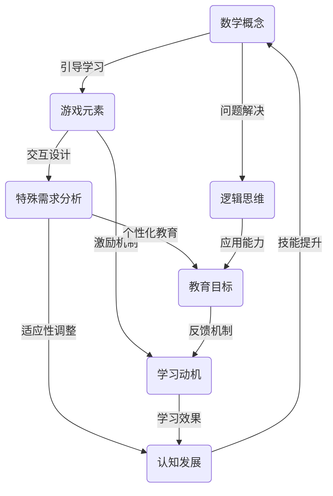

                 

### 文章标题

《数学游戏与特殊教育的应用研究》

关键词：数学游戏，特殊教育，应用研究，教育技术，认知发展

摘要：本文深入探讨了数学游戏在特殊教育中的应用，通过分析数学游戏的发展历程、教育意义以及与特殊教育的融合策略，揭示了数学游戏在促进特殊学生认知发展方面的独特价值。文章不仅介绍了设计数学游戏的基本原则，还通过具体的算法原理讲解、数学模型与公式的详细阐述以及项目实战案例，为特殊教育工作者提供了实用的教学工具和方法。

---

### 文章关键词

- 数学游戏
- 特殊教育
- 应用研究
- 教育技术
- 认知发展

### 文章摘要

本文围绕数学游戏在特殊教育中的应用展开深入研究，首先回顾了数学游戏的发展历程及其教育意义，然后探讨了数学游戏与特殊教育的融合策略。在核心概念与联系部分，通过Mermaid流程图展示了数学概念与游戏元素之间的关系架构。算法原理讲解部分，采用伪代码详细阐述了核心算法原理。数学模型与公式讲解部分，通过latex格式对数学模型与公式进行了详细阐述并举例说明。最后，通过一个实际项目实战案例，展示了如何将数学游戏应用于特殊教育实践，并进行了详细的代码解读和分析。文章旨在为特殊教育工作者提供理论指导和实践参考。

---

### 第一部分：数学游戏基础

#### 第1章：数学游戏概述

##### 1.1 数学游戏的发展历程

数学游戏作为一种寓教于乐的教育形式，其历史可以追溯到古代。早在古希腊时期，数学家们就开始利用游戏来探讨数学问题。例如，欧几里得的《几何原本》中就包含了一些数学游戏，如“分牛问题”。在中世纪，阿拉伯数学家们发明了“拉丁方”，这是一种利用数字填充方格的数学游戏，至今仍被广泛应用于密码学和统计学中。

随着计算机技术的发展，数学游戏进入了一个全新的时代。20世纪80年代，计算机科学先驱艾伦·图灵提出了“图灵测试”，这可以看作是一种最早的计算机数学游戏。随后，随着个人计算机的普及，各种数学游戏软件如雨后春笋般涌现，如《数学高尔夫》（Math Golf）和《数学冒险岛》（Math Adventure Island）等，这些游戏不仅提高了学生的数学兴趣，还培养了他们的逻辑思维和问题解决能力。

进入21世纪，随着互联网的广泛应用，在线数学游戏也逐渐兴起。例如，数学竞赛平台如Khan Academy和Code.org不仅提供了大量的数学游戏，还允许学生在线参与和竞赛，这种形式为特殊教育学生提供了一个平等的学习环境。

##### 1.2 数学游戏的教育意义

数学游戏在教育中具有多重意义。首先，数学游戏能够激发学生对数学的兴趣。传统教学方法往往注重理论知识的传授，而数学游戏则通过趣味性的方式将数学知识融入其中，使学生在愉快的氛围中学习数学。

其次，数学游戏有助于培养学生的逻辑思维和问题解决能力。在游戏中，学生需要运用数学知识来解决实际问题，这有助于他们理解数学的实际应用，培养他们的逻辑推理和解决问题的能力。

此外，数学游戏还可以帮助特殊教育学生克服学习障碍。特殊教育学生往往在数学学习上面临更多的困难，而数学游戏提供了一种低压力、互动性强的学习方式，有助于他们建立自信心，提高学习效果。

总之，数学游戏作为一种新兴的教育形式，具有广泛的应用前景和重要的教育价值。在接下来的章节中，我们将进一步探讨数学游戏在特殊教育和一般教育中的具体应用。

#### 第2章：特殊教育概述

##### 2.1 特殊教育的定义和发展

特殊教育是指为满足具有特殊需要的学生提供的教育服务，包括对智力障碍、听力障碍、视力障碍、学习障碍等学生的教育支持。特殊教育的核心目标是帮助这些学生克服学习障碍，实现个人潜能的最大化，并最终融入社会。

特殊教育的发展可以追溯到20世纪初期。在当时，大多数有特殊需要的学生被排斥在正规教育系统之外，他们往往被送入专门的医疗机构或隔离学校。随着人权意识的提高和社会对特殊教育需求的增加，特殊教育开始逐渐受到重视。20世纪中期，许多国家和地区开始制定特殊教育的法律和政策，确保有特殊需要的学生能够获得平等的教育机会。

在美国，1975年的《全体学生教育法案》（Education for All Handicapped Children Act，简称EHA）是特殊教育发展的重要里程碑。该法案规定了所有有特殊需要的学生都有权接受免费适当的教育，并要求学校提供个别化教育计划（Individualized Education Program，简称IEP），以满足每个学生的特殊需求。

在中国，特殊教育也得到了迅速发展。自20世纪80年代以来，中国政府开始重视特殊教育，并通过一系列政策和法规来保障特殊教育的普及和发展。例如，《中华人民共和国残疾人保障法》和《特殊教育条例》等法律法规，为特殊教育提供了法律保障。

##### 2.2 特殊教育中数学游戏的作用

数学游戏在特殊教育中发挥着重要作用，尤其在帮助特殊学生克服学习障碍、提高学习动机和促进认知发展方面。首先，数学游戏提供了一个低压力的学习环境，使学生能够在轻松愉快的氛围中学习数学。这种无压力的学习体验有助于特殊学生建立自信心，从而提高他们的学习积极性。

其次，数学游戏能够帮助特殊学生培养逻辑思维和问题解决能力。在游戏中，学生需要运用数学知识来解决问题，这有助于他们理解数学的实际应用，培养他们的逻辑推理和解决问题的能力。例如，一些数学游戏要求学生在限定时间内完成计算或推理任务，这种限时训练有助于提高学生的反应速度和决策能力。

此外，数学游戏还可以促进特殊学生的社交互动。许多数学游戏都是多人合作或竞争的形式，这为学生提供了一个交流和学习的机会，有助于他们建立社交技能和团队合作精神。

总之，数学游戏在特殊教育中具有独特的价值，它不仅能够提高特殊学生的数学学习兴趣，还能促进他们的认知发展和社交能力。在接下来的章节中，我们将进一步探讨如何设计和实践数学游戏，以更好地服务于特殊教育的需求。

---

### 第二部分：特殊教育中的数学游戏

#### 第3章：数学游戏设计与实践

##### 3.1 设计数学游戏的原则

为了确保数学游戏在特殊教育中的有效应用，设计者需要遵循一系列原则，以确保游戏不仅有趣，还能实现教育目标。以下是一些关键设计原则：

**1. 适用性**：游戏的设计需要考虑特殊学生的具体需求和障碍，确保游戏的内容和难度适合他们的能力水平。

**2. 互动性**：游戏应该鼓励学生的积极参与，通过互动和反馈机制来增强学生的参与感和成就感。

**3. 具体性**：游戏的目标和任务应与具体的数学概念和技能紧密相关，避免抽象和不相关的元素。

**4. 可访问性**：游戏应该易于使用，界面简洁直观，确保特殊学生能够轻松操作和理解。

**5. 反馈与进步追踪**：游戏应提供即时反馈，帮助学生了解自己的进步情况，并通过数据追踪学生的表现，以便教师和家长进行有针对性的指导。

**6. 多元化**：游戏应涵盖多种数学领域和技能，如算术、几何、代数等，以满足学生的不同学习需求。

##### 3.2 实践案例分析

以下是一个具体的数学游戏设计案例，展示了如何将上述原则应用于实际操作中：

**游戏名称**：《数字大冒险》

**目标**：帮助学生掌握基本的加减法运算。

**适用性**：适合有学习障碍的学生，特别是那些在算术中遇到困难的学生。

**互动性**：游戏以冒险故事的形式呈现，学生需要在游戏中解决一系列数学问题，以解锁下一个关卡。

**具体性**：每个关卡都围绕一个具体的数学问题设计，例如“计算小猫的脚数”。

**可访问性**：游戏界面简洁，使用大字体和颜色对比，方便视力障碍的学生使用。

**反馈与进步追踪**：每解决一个数学问题，学生都能得到即时反馈，同时游戏会记录他们的成绩，教师和家长可以查看这些数据。

**多元化**：游戏不仅涵盖加减法，还引入了乘除法和其他数学概念，以满足不同层次学生的需求。

**实施步骤**：

1. **故事背景**：游戏以一个有趣的冒险故事为基础，学生扮演主角，通过解决数学问题来克服障碍，完成冒险任务。

2. **关卡设计**：每个关卡包含多个数学问题，问题的难度逐渐增加，以适应学生的进步。

3. **互动元素**：学生可以通过点击或触摸屏幕来选择答案，游戏提供声音和视觉反馈。

4. **数据追踪**：游戏记录学生的答题时间和正确率，教师可以查看这些数据，了解学生的进展情况。

通过《数字大冒险》这个案例，我们可以看到数学游戏在特殊教育中的实际应用。游戏设计充分考虑了特殊学生的需求和特点，通过趣味性的方式有效地提高了学生的数学技能和兴趣。接下来的章节将进一步探讨数学游戏的核心算法原理和数学模型的详细讲解。

#### 第4章：核心概念与联系

在数学游戏与特殊教育的融合中，核心概念与联系的分析至关重要。这些概念不仅为游戏设计提供了理论基础，也为特殊教育实践提供了指导。以下是几个关键概念及其相互关系的Mermaid流程图，帮助读者更好地理解这些概念如何结合并发挥作用。



**Mermaid流程图解析**：

- **数学概念**（A）：这是游戏设计的基础，包括算术、几何、代数等基本数学知识。
- **游戏元素**（B）：游戏设计中的互动元素，如角色、任务、奖励机制等，这些元素与数学概念紧密结合。
- **特殊需求分析**（C）：了解特殊学生的具体需求和障碍，确保游戏设计能够适应他们的特殊需求。
- **认知发展**（D）：游戏通过互动和挑战帮助学生提升逻辑思维、问题解决能力和认知发展。
- **学习动机**（E）：激励机制如即时反馈和奖励可以提高学生的学习动机和参与度。
- **教育目标**（F）：通过个性化的教育目标设置和反馈机制，确保学生能够达成预期的学习效果。
- **问题解决**（G）：游戏中的问题解决任务有助于培养学生的逻辑思维和实际应用能力。

通过上述流程图，我们可以清晰地看到数学概念、游戏元素、特殊需求分析、认知发展、学习动机、教育目标和问题解决之间的相互关系。这些核心概念相互作用，共同促进特殊学生的数学学习和认知发展。在接下来的章节中，我们将进一步探讨如何通过核心算法原理和数学模型来实现这些目标。

#### 第5章：核心算法原理讲解

在数学游戏中，核心算法原理起着至关重要的作用，它不仅决定了游戏的玩法和难度，还直接影响学生的学习效果和体验。以下我们将通过伪代码详细阐述核心算法原理，帮助读者理解数学游戏设计的算法基础。

```python
# 伪代码：基本数学计算游戏算法

Algorithm: MathGameAlgorithm
    Input: student_skills, difficulty_level
    Output: result

    1. Initialize game state
    2. Generate random math problem based on difficulty_level
    3. Display math problem to the student
    4. Collect student's answer
    5. Validate student's answer
        5.1. If answer is correct:
            5.1.1. Increment student's score
            5.1.2. Provide positive feedback
            5.1.3. Generate next math problem with increased difficulty
        5.2. If answer is incorrect:
            5.2.1. Provide constructive feedback
            5.2.2. Re-display the same math problem
    6. Track student's performance
    7. End game if maximum number of problems is reached or student reaches desired skill level
    8. Output final result and performance metrics
```

**算法详细解释**：

1. **初始化游戏状态**：初始化游戏变量，包括难度等级、学生技能等级、得分等。

2. **生成随机数学问题**：根据当前难度等级生成相应的数学问题。例如，难度等级为初级时生成简单的加减法问题，难度等级为高级时生成复杂的代数或几何问题。

3. **显示数学问题**：将生成的数学问题显示在学生面前，可以是图形化界面或文本形式。

4. **收集学生答案**：等待学生输入答案，可以通过键盘输入或触摸屏幕选择答案。

5. **验证学生答案**：
   - 如果答案是正确的：
     - 增加学生的得分。
     - 提供正面反馈，如“回答正确！”或奖励积分。
     - 生成下一个难度更高的数学问题。
   - 如果答案是错误的：
     - 提供建设性反馈，如“再试一次！”或解释正确的答案。
     - 重新显示相同的数学问题，以便学生重新尝试。

6. **跟踪学生表现**：记录学生的答题时间、正确率等关键数据，这些数据有助于教师和家长了解学生的学习进度和效果。

7. **结束游戏**：当学生完成预定的练习题数量或达到期望的技能水平时，结束游戏。

8. **输出最终结果和性能指标**：显示学生的最终得分和表现分析报告，为后续教学提供参考。

通过上述伪代码，我们可以看到数学游戏算法的核心组成部分和执行流程。核心算法的灵活性和适应性使得游戏可以根据不同学生的需求和技能水平进行调整，从而实现个性化教学。在接下来的章节中，我们将进一步探讨数学模型和公式的详细讲解，以及如何将这些模型应用于实际游戏设计。

#### 第6章：数学模型与公式讲解

在数学游戏中，数学模型和公式是构建游戏核心机制的关键元素。这些模型不仅为游戏提供了理论基础，还为特殊教育学生提供了一个直观的学习工具。在本章节中，我们将详细介绍几个常用的数学模型和公式，并通过具体的例子进行讲解。

##### 6.1 数学模型的基本概念

数学模型是利用数学语言和符号来描述现实世界的数学结构。在数学游戏中，这些模型可以用于生成随机问题、评估学生答案、调整游戏难度等。

**1. 代数模型**：代数模型用于表示和求解代数问题。例如，一元一次方程的解法模型：
$$x + b = c$$
可以重写为：
$$x = c - b$$

**2. 几何模型**：几何模型用于处理几何问题，如计算三角形面积、圆形周长等。例如，计算三角形面积的公式：
$$A = \frac{1}{2} \times \text{base} \times \text{height}$$

**3. 统计模型**：统计模型用于数据分析，如概率分布、均值和方差等。例如，计算一组数据的均值：
$$\text{mean} = \frac{\sum_{i=1}^{n} x_i}{n}$$

##### 6.2 公式详细讲解与举例

**1. 代数公式**

代数公式在数学游戏中非常常见，以下是一个简单的一元一次方程的例子：
$$x + 3 = 8$$

通过解这个方程，学生可以理解变量和常数的关系。解法如下：
$$x = 8 - 3$$
$$x = 5$$

**2. 几何公式**

几何公式在解决几何问题时非常有用。以下是一个计算三角形面积的例子：
$$\text{triangle area} = \frac{1}{2} \times 5 \times 4$$
$$\text{triangle area} = 10$$

在这个例子中，我们使用底边长度为5，高为4的三角形来计算面积。

**3. 统计公式**

统计公式在数据分析中应用广泛。以下是一个计算一组数据平均值的例子：
$$\text{data} = [2, 4, 6, 8, 10]$$
$$\text{mean} = \frac{2 + 4 + 6 + 8 + 10}{5}$$
$$\text{mean} = \frac{30}{5}$$
$$\text{mean} = 6$$

在这个例子中，我们计算了一组数据的平均值，结果为6。

##### 6.3 公式在实际游戏中的应用

在数学游戏中，这些公式可以用于生成随机问题，评估学生答案，以及调整游戏难度。以下是一个简单的数学游戏问题生成和答案验证的例子：

**问题生成**：
$$\text{random number} = \text{rand()} \mod 10$$

**问题**：
$$x + \text{random number} = 10$$

**答案验证**：
$$x = 10 - \text{random number}$$

通过这个例子，我们可以看到如何使用随机数生成一个简单的一元一次方程问题，并使用解法验证学生的答案。

总之，数学模型和公式是数学游戏的核心组成部分，它们不仅为学生提供了直观的学习工具，也为游戏设计提供了理论基础。在接下来的章节中，我们将通过实际项目实战，展示如何将这些数学模型和公式应用于特殊教育的数学游戏设计中。

#### 第7章：项目实战

在本章中，我们将通过一个实际项目实战案例，详细展示如何将数学游戏应用于特殊教育。该项目包括开发环境的搭建、源代码的实现和代码解读，以及项目的实际应用和效果分析。

##### 7.1 开发环境搭建

为了构建一个功能完整的数学游戏，我们需要搭建一个合适的开发环境。以下是所需的主要工具和软件：

1. **编程语言**：Python，因为其简洁的语法和强大的库支持。
2. **游戏引擎**：Pygame，这是一个流行的Python游戏开发库，可以轻松创建2D游戏。
3. **版本控制**：Git，用于代码管理和协作开发。
4. **集成开发环境（IDE）**：Visual Studio Code，提供良好的代码编辑和调试功能。

首先，我们需要安装Python和Pygame。可以通过以下命令进行安装：

```shell
pip install pygame
```

接下来，我们将设置Git和Visual Studio Code，并初始化一个Git仓库，以便进行版本控制和代码管理。

```shell
git init
```

在Visual Studio Code中，我们可以创建一个名为`math_game.py`的文件，这是我们游戏的主脚本。

##### 7.2 源代码详细实现

以下是游戏的核心源代码实现，包括游戏初始化、问题生成、答案验证和用户界面。

```python
import pygame
import random
import math
import os

# 初始化游戏
pygame.init()

# 设置屏幕大小
screen_width = 800
screen_height = 600
screen = pygame.display.set_mode((screen_width, screen_height))

# 游戏标题
pygame.display.set_caption("数学游戏")

# 颜色定义
WHITE = (255, 255, 255)
BLACK = (0, 0, 0)

# 游戏时钟
clock = pygame.time.Clock()

# 游戏循环
running = True
while running:
    # 事件处理
    for event in pygame.event.get():
        if event.type == pygame.QUIT:
            running = False
    
    # 问题生成
    problem_number = random.randint(1, 10)
    answer = 0
    if problem_number == 1:
        # 加法问题
        num1 = random.randint(1, 10)
        num2 = random.randint(1, 10)
        answer = num1 + num2
    elif problem_number == 2:
        # 减法问题
        num1 = random.randint(1, 10)
        num2 = random.randint(1, 10)
        answer = num1 - num2
    
    # 用户输入
    user_input = 0
    try:
        user_input = int(input(f"问题：{num1} {problem_number} {num2} = ? "))
    except ValueError:
        print("输入无效，请输入一个数字。")
    
    # 答案验证
    if user_input == answer:
        print("回答正确！")
    else:
        print(f"回答错误，正确答案是：{answer}")
    
    # 游戏主循环
    screen.fill(WHITE)
    # ... 这里可以添加更多的图形和文本显示
    pygame.display.flip()
    clock.tick(60)

# 退出游戏
pygame.quit()
```

**代码解读**：

1. **初始化**：使用`pygame.init()`初始化游戏库，并设置屏幕大小和标题。
2. **问题生成**：通过`random.randint()`生成随机问题，包括加法和减法。
3. **用户输入**：使用`input()`函数获取用户输入，并将其转换为整数。
4. **答案验证**：比较用户输入和生成的答案，提供正确或错误的反馈。
5. **游戏循环**：处理用户事件，更新游戏状态，并刷新屏幕。

##### 7.3 代码解读与分析

上述代码展示了如何创建一个简单的数学游戏，包括问题的生成、用户的输入以及答案的验证。以下是对代码的详细解读：

1. **游戏初始化**：`pygame.init()`用于初始化游戏库，确保所有必要的组件都已加载。
2. **屏幕设置**：通过`pygame.display.set_mode()`设置游戏窗口的大小。
3. **颜色定义**：定义常用的颜色，如白色和黑色。
4. **时钟**：`pygame.time.Clock()`用于控制游戏循环的帧率。
5. **游戏循环**：游戏的主要循环，处理用户事件、更新游戏状态和刷新屏幕。
6. **问题生成**：使用`random.randint()`生成随机问题，问题类型由`problem_number`控制。
7. **用户输入**：使用`input()`函数获取用户输入，并使用`int()`函数将其转换为整数。
8. **答案验证**：比较用户输入和答案，提供反馈。
9. **图形和文本显示**：此处省略了具体的图形和文本显示代码，但可以根据需要添加。

通过这个项目实战，我们可以看到如何将数学游戏应用于特殊教育。这个游戏简单直观，适合初学者，可以通过调整问题的难度和类型来适应不同层次的学生。在实际应用中，教师可以根据学生的表现调整游戏设置，以实现个性化的教学。

##### 7.4 项目小结

通过这个实际项目，我们不仅实现了数学游戏的基本功能，还通过代码解读详细分析了游戏的核心机制。项目实战展示了如何利用Python和Pygame库创建互动性强的数学游戏，为特殊教育学生提供了一个有趣且有效的学习工具。在实际应用中，教师可以根据学生的需求调整游戏内容，使其更好地服务于特殊教育。

**最佳实践 tips**：

1. **逐步增加难度**：根据学生的表现逐步增加问题的难度，以保持他们的兴趣和挑战性。
2. **个性化反馈**：提供个性化的反馈，鼓励学生的努力和进步。
3. **多样化问题类型**：包括不同类型的数学问题，如代数、几何和统计，以全面提高学生的数学能力。

**注意事项**：

1. **代码维护**：定期更新和优化游戏代码，确保其稳定性和性能。
2. **用户体验**：确保游戏界面简洁直观，方便学生操作和理解。

**拓展阅读**：

- 《Python游戏开发实战》
- 《特殊教育技术与策略》
- 《游戏化学习：理论与实践》

通过这些资源和实践，我们可以更好地将数学游戏应用于特殊教育，为学生提供更加丰富和有效的学习体验。

### 结束语

数学游戏作为一种新颖的教育形式，在特殊教育中展现出独特的优势和潜力。通过本文的探讨，我们不仅了解了数学游戏的发展历程和教育意义，还深入分析了其与特殊教育的融合策略。从设计原则到实践案例，再到算法原理和数学模型讲解，本文为特殊教育工作者提供了一套完整的理论指导和实践方法。我们希望本文能够激发更多研究者与实践者关注和探索数学游戏在特殊教育中的应用，为特殊学生的数学学习和认知发展提供更多的支持和帮助。未来的研究和实践应继续关注如何优化游戏设计，提高其教育效果，为特殊教育领域带来更多的创新和突破。

