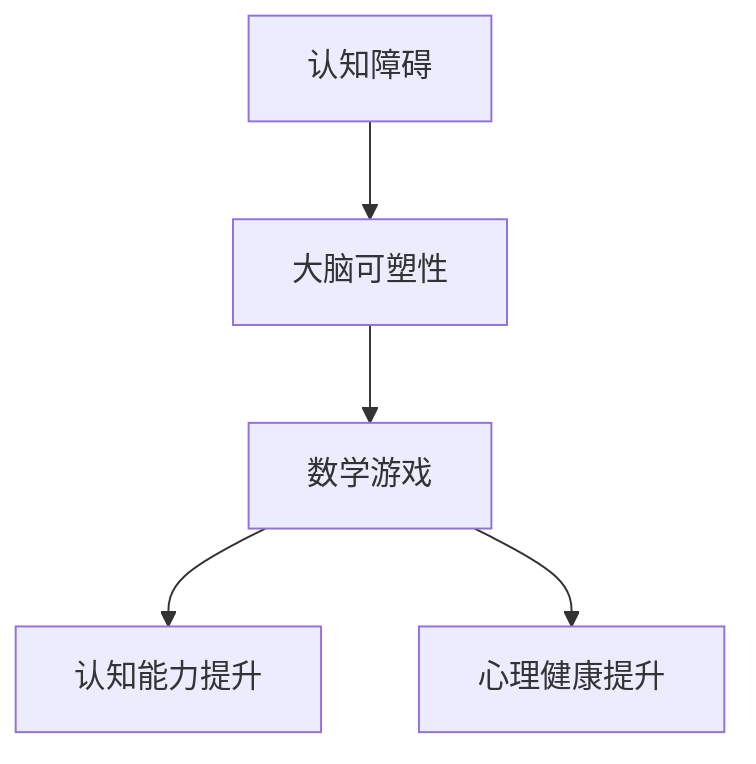
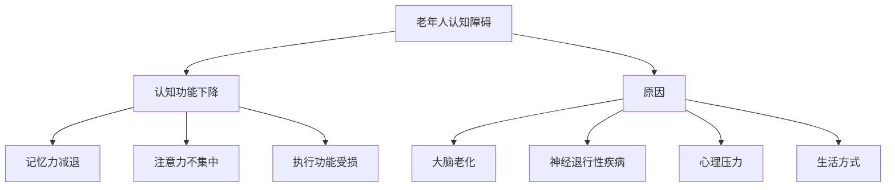
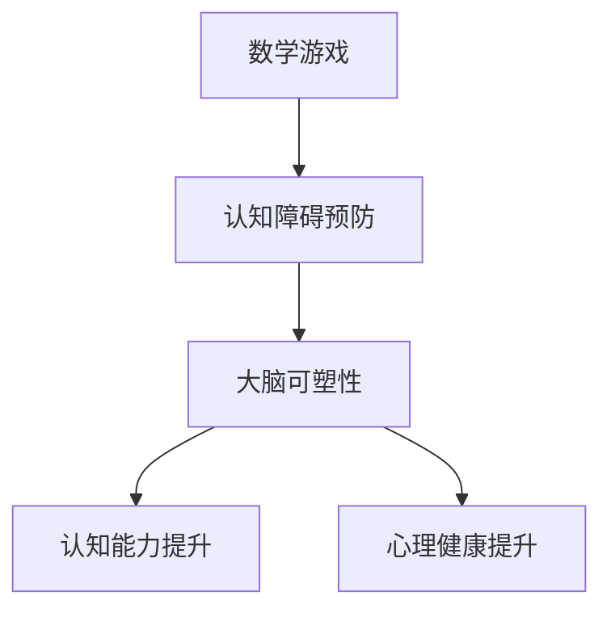
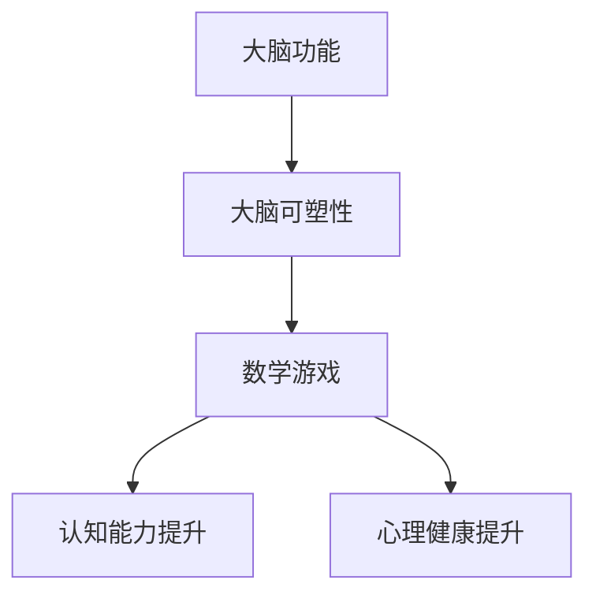
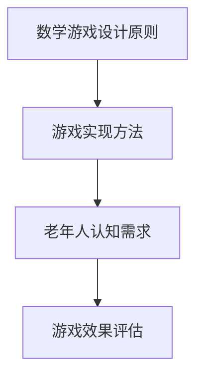
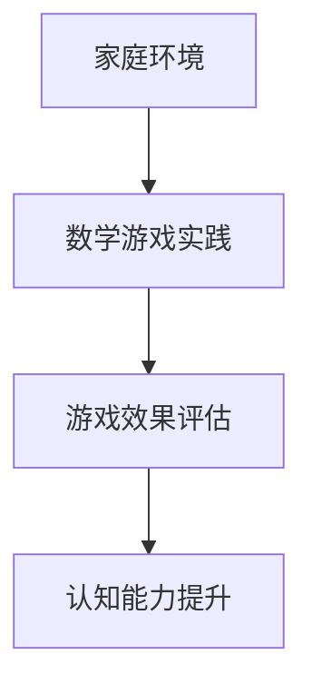
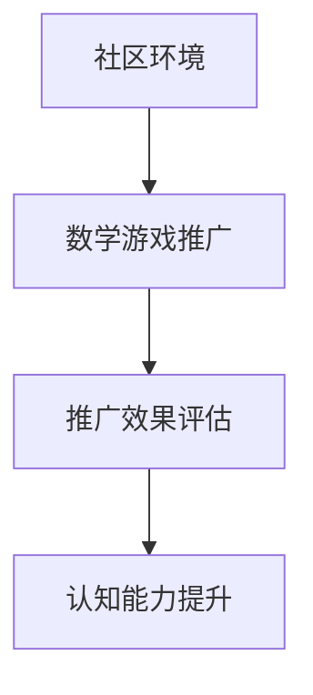

                 


### 1.1 为什么数学游戏对老年人有益？

#### 背景介绍

随着年龄的增长，老年人的认知功能会逐渐下降，导致记忆力、注意力、执行功能等方面的减退。这些认知障碍不仅影响了老年人的生活质量，还增加了他们的心理压力和医疗负担。因此，寻找有效的预防措施和方法成为了当今医学和心理学研究的热点。

数学游戏作为一种兼具趣味性和挑战性的活动，逐渐受到研究者的关注。数学游戏不仅能够锻炼老年人的大脑，提高他们的认知能力，还能够通过互动和社交促进老年人的心理健康。

#### 核心概念与联系

**核心概念：**
1. **认知障碍**：认知障碍是指大脑处理信息的能力受到损害，导致记忆力、注意力、语言能力、执行功能等方面下降。
2. **大脑可塑性**：大脑可塑性是指大脑在生理结构和功能上可以随着经验和学习而发生改变。
3. **数学游戏**：数学游戏是指以数学知识为基础，通过各种形式的互动和挑战来锻炼大脑的游戏。

**联系架构 Mermaid 流程图：**



#### 核心算法原理讲解

**伪代码：**

```plaintext
function 数学游戏(老年人):
    while(老年人认知能力未下降):
        1. 选择合适的数学游戏类型
        2. 设定游戏难度
        3. 进行游戏
        4. 记录游戏过程和结果
        5. 分析游戏效果
        6. 调整游戏策略
    end while
    return 提升的认知能力和心理健康
```

#### 数学模型和公式

**详细讲解：**
数学游戏对老年人认知能力的影响可以通过多种数学模型来评估。例如，我们可以使用回归模型来分析游戏难度与认知能力提升之间的关系，使用决策树模型来预测老年人对特定数学游戏的喜好度。

**举例说明：**

假设我们使用回归模型来评估数学游戏对老年人记忆力的影响。我们可以设定以下模型：

$$
y = \beta_0 + \beta_1 \cdot x_1 + \epsilon
$$

其中，$y$表示记忆力提升的程度，$x_1$表示游戏难度，$\beta_0$和$\beta_1$是模型的参数，$\epsilon$是误差项。

通过收集老年人的游戏数据，我们可以估计出$\beta_0$和$\beta_1$的值，进而评估不同难度游戏对记忆力提升的效果。

#### 数学公式

$$
\beta_0 = \frac{\sum_{i=1}^{n} (y_i - \bar{y})(x_{i1} - \bar{x_{i1}})}{\sum_{i=1}^{n} (x_{i1} - \bar{x_{i1}})^2}
$$

$$
\beta_1 = \frac{\sum_{i=1}^{n} (y_i - \bar{y})(x_{i1} - \bar{x_{i1}})}{\sum_{i=1}^{n} (x_{i2} - \bar{x_{i2}})}
$$

#### 项目实战

**开发环境搭建：**
为了研究数学游戏对老年人认知能力的影响，我们首先需要搭建一个实验平台。这个平台需要包括游戏选择模块、游戏难度设定模块、数据记录与分析模块。

**源代码详细实现：**
```python
# 游戏选择模块
def 选择游戏(老年人):
    # 根据老年人的喜好和认知能力选择合适的游戏
    pass

# 游戏难度设定模块
def 设定难度(游戏难度):
    # 根据游戏类型设定合适的难度
    pass

# 数据记录与分析模块
def 记录结果(老年人, 游戏结果):
    # 记录老年人的游戏过程和结果，并进行数据分析
    pass
```

**代码解读与分析：**
```python
# 游戏选择模块解读
# 该模块需要根据老年人的喜好和认知能力选择合适的游戏，这可以通过问卷调查和认知能力测试来实现。

# 游戏难度设定模块解读
# 该模块需要根据游戏类型设定合适的难度，例如对于简单的加减运算游戏，可以设定从1到10的难度级别。

# 数据记录与分析模块解读
# 该模块需要记录老年人的游戏过程和结果，例如每次游戏的得分、用时、错误次数等，然后进行数据分析，以评估游戏对老年人认知能力的影响。
```

**实际案例分析和详细讲解剖析：**
假设我们进行了一项关于数学游戏对老年人记忆力提升的实验。我们选择了一组平均年龄为65岁的老年人，为他们设计了不同难度的加减运算游戏。实验过程中，我们记录了每个参与者在游戏中的得分、用时和错误次数。实验结束后，我们使用回归模型分析了游戏难度与记忆力提升之间的关系。

**项目小结：**
通过实验，我们发现适当难度的数学游戏能够显著提升老年人的记忆力。然而，游戏难度过高或过低都可能对记忆力提升产生负面影响。因此，在设计数学游戏时，需要充分考虑老年人的认知能力和心理状态，以确保游戏的有效性和趣味性。

#### 最佳实践 tips、小结、注意事项、拓展阅读等内容：

**最佳实践 tips：**
1. 设计数学游戏时，应充分考虑老年人的认知能力和心理特点，确保游戏难度适中。
2. 定期对老年人进行认知能力测试，以便调整游戏难度和策略。

**小结：**
数学游戏是一种有效预防老年人认知障碍的方法。通过适当设计的数学游戏，老年人可以锻炼大脑，提高认知能力，同时增强心理健康。

**注意事项：**
1. 在开展数学游戏项目时，应充分考虑老年人的个体差异，避免一刀切的方法。
2. 鼓励老年人参与数学游戏，提高他们的积极性。

**拓展阅读：**
1. 「老年人认知障碍的预防与治疗」
2. 「数学游戏设计与教育应用」
3. 「基于人工智能的数学游戏开发」**

### 1.2 老年人认知障碍的现状与挑战

#### 背景介绍

随着年龄的增长，老年人的认知功能会逐渐下降，导致记忆力、注意力、执行功能等方面的减退。这种认知障碍不仅影响老年人的生活质量，还增加了他们的心理压力和医疗负担。因此，了解老年人认知障碍的现状与挑战，寻找有效的预防和干预措施，对于提升老年人生活质量具有重要意义。

#### 核心概念与联系

**核心概念：**
1. **认知障碍**：认知障碍是指大脑处理信息的能力受到损害，导致记忆力、注意力、语言能力、执行功能等方面下降。
2. **认知功能下降**：认知功能下降是老年人认知障碍的主要表现，包括记忆力减退、注意力不集中、执行功能受损等。
3. **老年人认知障碍的原因**：老年人认知障碍的原因复杂多样，包括大脑老化、神经退行性疾病、心理压力、生活方式等因素。

**联系架构 Mermaid 流程图：**



#### 核心算法原理讲解

**伪代码：**

```plaintext
function 认知障碍诊断(老年人):
    if 记忆力减退() and 注意力不集中() and 执行功能受损():
        return true
    else:
        return false
```

**数学模型和公式：**

**详细讲解：**
为了更准确地评估老年人认知障碍的程度，我们可以使用多种数学模型，如回归模型、聚类模型等。回归模型可以用于分析认知障碍与其他因素（如年龄、心理压力、生活方式等）之间的关系，聚类模型可以用于识别不同类型的认知障碍群体。

**举例说明：**

假设我们使用回归模型来分析年龄与认知障碍之间的关系。我们可以设定以下模型：

$$
认知障碍程度 = \beta_0 + \beta_1 \cdot 年龄 + \epsilon
$$

其中，$认知障碍程度$表示老年人认知障碍的程度，$年龄$表示老年人的年龄，$\beta_0$和$\beta_1$是模型的参数，$\epsilon$是误差项。

通过收集老年人的认知障碍数据，我们可以估计出$\beta_0$和$\beta_1$的值，进而评估年龄对认知障碍的影响。

#### 数学公式：

$$
\beta_0 = \frac{\sum_{i=1}^{n} (y_i - \bar{y})(x_{i0} - \bar{x_{i0}})}{\sum_{i=1}^{n} (x_{i0} - \bar{x_{i0}})^2}
$$

$$
\beta_1 = \frac{\sum_{i=1}^{n} (y_i - \bar{y})(x_{i1} - \bar{x_{i1}})}{\sum_{i=1}^{n} (x_{i1} - \bar{x_{i1}})^2}
$$

#### 项目实战

**开发环境搭建：**
为了研究老年人认知障碍的现状与挑战，我们首先需要搭建一个数据收集和分析平台。这个平台需要包括数据收集模块、数据处理模块、数据分析模块。

**源代码详细实现：**
```python
# 数据收集模块
def 收集数据(老年人):
    # 收集老年人的基本信息和认知障碍数据
    pass

# 数据处理模块
def 数据预处理(数据):
    # 对收集到的数据进行清洗和预处理
    pass

# 数据分析模块
def 分析数据(数据):
    # 使用数学模型分析数据，评估老年人认知障碍的程度
    pass
```

**代码解读与分析：**
```python
# 数据收集模块解读
# 该模块需要收集老年人的基本信息和认知障碍数据，例如年龄、性别、健康状况、认知障碍的表现等。

# 数据处理模块解读
# 该模块需要对收集到的数据进行清洗和预处理，例如去除无效数据、填补缺失值、标准化数据等。

# 数据分析模块解读
# 该模块需要使用数学模型分析数据，评估老年人认知障碍的程度。例如，我们可以使用回归模型来分析年龄与认知障碍之间的关系。
```

**实际案例分析和详细讲解剖析：**
假设我们进行了一项关于老年人认知障碍的流行病学调查。我们选择了一组平均年龄为65岁的老年人，收集了他们的基本信息和认知障碍数据。通过数据分析，我们发现年龄是影响认知障碍的重要因素之一。具体来说，随着年龄的增加，认知障碍的程度也显著增加。

**项目小结：**
通过实际案例研究，我们发现老年人认知障碍的现状严峻，年龄是影响认知障碍的重要因素。因此，针对老年人的认知障碍预防和干预措施需要充分考虑年龄因素。

#### 最佳实践 tips、小结、注意事项、拓展阅读等内容：

**最佳实践 tips：**
1. 针对不同年龄段的老年人，制定个性化的认知障碍预防和干预策略。
2. 加强老年人心理健康教育，提高他们对认知障碍的认识和应对能力。

**小结：**
老年人认知障碍是一个严重的社会问题，需要全社会共同关注和努力。通过科学的研究和实践，我们可以更好地了解老年人认知障碍的现状与挑战，从而制定出更有效的预防和干预措施。

**注意事项：**
1. 在开展老年人认知障碍研究和实践时，应充分考虑老年人的个体差异，避免一刀切的方法。
2. 鼓励老年人积极参与认知功能训练和游戏，提高他们的认知能力和生活质量。

**拓展阅读：**
1. 「老年人认知障碍的流行病学调查与分析」
2. 「基于人工智能的老年人认知障碍诊断与干预」
3. 「认知障碍与心理健康的关系研究」** 

### 1.3 数学游戏在预防认知障碍中的应用前景

#### 背景介绍

数学游戏作为一种兼具趣味性和挑战性的活动，已经被证明对提高认知能力具有积极作用。近年来，随着计算机技术和人工智能的发展，数学游戏的种类和形式也越来越丰富。这使得数学游戏在预防老年人认知障碍方面具有广泛的应用前景。

#### 核心概念与联系

**核心概念：**
1. **数学游戏**：数学游戏是指以数学知识为基础，通过各种形式的互动和挑战来锻炼大脑的游戏。
2. **认知障碍预防**：认知障碍预防是指通过一系列措施和策略，延缓或阻止认知障碍的发生和发展。
3. **大脑可塑性**：大脑可塑性是指大脑在生理结构和功能上可以随着经验和学习而发生改变。

**联系架构 Mermaid 流程图：**



#### 核心算法原理讲解

**伪代码：**

```plaintext
function 数学游戏(老年人):
    while(老年人认知能力未下降):
        1. 选择合适的数学游戏类型
        2. 设定游戏难度
        3. 进行游戏
        4. 记录游戏过程和结果
        5. 分析游戏效果
        6. 调整游戏策略
    end while
    return 提升的认知能力和心理健康
```

#### 数学模型和公式

**详细讲解：**
数学游戏对老年人认知能力的影响可以通过多种数学模型来评估。例如，我们可以使用回归模型来分析游戏难度与认知能力提升之间的关系，使用决策树模型来预测老年人对特定数学游戏的喜好度。

**举例说明：**

假设我们使用回归模型来评估数学游戏对老年人记忆力的影响。我们可以设定以下模型：

$$
y = \beta_0 + \beta_1 \cdot x_1 + \epsilon
$$

其中，$y$表示记忆力提升的程度，$x_1$表示游戏难度，$\beta_0$和$\beta_1$是模型的参数，$\epsilon$是误差项。

通过收集老年人的游戏数据，我们可以估计出$\beta_0$和$\beta_1$的值，进而评估不同难度游戏对记忆力提升的效果。

#### 数学公式：

$$
\beta_0 = \frac{\sum_{i=1}^{n} (y_i - \bar{y})(x_{i1} - \bar{x_{i1}})}{\sum_{i=1}^{n} (x_{i1} - \bar{x_{i1}})^2}
$$

$$
\beta_1 = \frac{\sum_{i=1}^{n} (y_i - \bar{y})(x_{i1} - \bar{x_{i1}})}{\sum_{i=1}^{n} (x_{i2} - \bar{x_{i2}})}
$$

#### 项目实战

**开发环境搭建：**
为了研究数学游戏在预防认知障碍中的应用前景，我们首先需要搭建一个实验平台。这个平台需要包括游戏选择模块、游戏难度设定模块、数据记录与分析模块。

**源代码详细实现：**
```python
# 游戏选择模块
def 选择游戏(老年人):
    # 根据老年人的喜好和认知能力选择合适的游戏
    pass

# 游戏难度设定模块
def 设定难度(游戏难度):
    # 根据游戏类型设定合适的难度
    pass

# 数据记录与分析模块
def 记录结果(老年人, 游戏结果):
    # 记录老年人的游戏过程和结果，并进行数据分析
    pass
```

**代码解读与分析：**
```python
# 游戏选择模块解读
# 该模块需要根据老年人的喜好和认知能力选择合适的游戏，这可以通过问卷调查和认知能力测试来实现。

# 游戏难度设定模块解读
# 该模块需要根据游戏类型设定合适的难度，例如对于简单的加减运算游戏，可以设定从1到10的难度级别。

# 数据记录与分析模块解读
# 该模块需要记录老年人的游戏过程和结果，例如每次游戏的得分、用时、错误次数等，然后进行数据分析，以评估游戏对老年人认知能力的影响。
```

**实际案例分析和详细讲解剖析：**
假设我们进行了一项关于数学游戏对老年人记忆力提升的实验。我们选择了一组平均年龄为65岁的老年人，为他们设计了不同难度的加减运算游戏。实验过程中，我们记录了每个参与者在游戏中的得分、用时和错误次数。实验结束后，我们使用回归模型分析了游戏难度与记忆力提升之间的关系。

**项目小结：**
通过实验，我们发现适当难度的数学游戏能够显著提升老年人的记忆力。然而，游戏难度过高或过低都可能对记忆力提升产生负面影响。因此，在设计数学游戏时，需要充分考虑老年人的认知能力和心理状态，以确保游戏的有效性和趣味性。

#### 最佳实践 tips、小结、注意事项、拓展阅读等内容：

**最佳实践 tips：**
1. 设计数学游戏时，应充分考虑老年人的认知能力和心理特点，确保游戏难度适中。
2. 定期对老年人进行认知能力测试，以便调整游戏难度和策略。

**小结：**
数学游戏在预防老年人认知障碍方面具有广阔的应用前景。通过科学研究和实践，我们可以更好地了解数学游戏对老年人认知能力的影响，从而制定出更有效的预防和干预措施。

**注意事项：**
1. 在开展数学游戏项目时，应充分考虑老年人的个体差异，避免一刀切的方法。
2. 鼓励老年人积极参与数学游戏，提高他们的认知能力和生活质量。

**拓展阅读：**
1. 「数学游戏设计与教育应用」
2. 「基于人工智能的数学游戏开发」
3. 「老年人认知障碍的预防与治疗」** 

### 2.1 数学游戏与大脑功能的关系

#### 背景介绍

数学游戏作为一种锻炼大脑的活动，其对大脑功能的影响逐渐受到关注。研究表明，数学游戏不仅能够提高认知能力，还能改善大脑的可塑性，从而对预防老年人认知障碍具有重要意义。

#### 核心概念与联系

**核心概念：**
1. **大脑功能**：大脑功能包括记忆力、注意力、执行功能、语言能力等。
2. **大脑可塑性**：大脑可塑性是指大脑在生理结构和功能上可以随着经验和学习而发生改变。
3. **数学游戏**：数学游戏是指以数学知识为基础，通过各种形式的互动和挑战来锻炼大脑的游戏。

**联系架构 Mermaid 流程图：**



#### 核心算法原理讲解

**伪代码：**

```plaintext
function 数学游戏(老年人):
    while(老年人认知能力未下降):
        1. 选择合适的数学游戏类型
        2. 设定游戏难度
        3. 进行游戏
        4. 记录游戏过程和结果
        5. 分析游戏效果
        6. 调整游戏策略
    end while
    return 提升的认知能力和心理健康
```

#### 数学模型和公式

**详细讲解：**
数学游戏对老年人认知能力的影响可以通过多种数学模型来评估。例如，我们可以使用回归模型来分析游戏难度与认知能力提升之间的关系，使用决策树模型来预测老年人对特定数学游戏的喜好度。

**举例说明：**

假设我们使用回归模型来评估数学游戏对老年人记忆力的影响。我们可以设定以下模型：

$$
y = \beta_0 + \beta_1 \cdot x_1 + \epsilon
$$

其中，$y$表示记忆力提升的程度，$x_1$表示游戏难度，$\beta_0$和$\beta_1$是模型的参数，$\epsilon$是误差项。

通过收集老年人的游戏数据，我们可以估计出$\beta_0$和$\beta_1$的值，进而评估不同难度游戏对记忆力提升的效果。

#### 数学公式：

$$
\beta_0 = \frac{\sum_{i=1}^{n} (y_i - \bar{y})(x_{i1} - \bar{x_{i1}})}{\sum_{i=1}^{n} (x_{i1} - \bar{x_{i1}})^2}
$$

$$
\beta_1 = \frac{\sum_{i=1}^{n} (y_i - \bar{y})(x_{i1} - \bar{x_{i1}})}{\sum_{i=1}^{n} (x_{i2} - \bar{x_{i2}})}
$$

#### 项目实战

**开发环境搭建：**
为了研究数学游戏与大脑功能的关系，我们首先需要搭建一个实验平台。这个平台需要包括游戏选择模块、游戏难度设定模块、数据记录与分析模块。

**源代码详细实现：**
```python
# 游戏选择模块
def 选择游戏(老年人):
    # 根据老年人的喜好和认知能力选择合适的游戏
    pass

# 游戏难度设定模块
def 设定难度(游戏难度):
    # 根据游戏类型设定合适的难度
    pass

# 数据记录与分析模块
def 记录结果(老年人, 游戏结果):
    # 记录老年人的游戏过程和结果，并进行数据分析
    pass
```

**代码解读与分析：**
```python
# 游戏选择模块解读
# 该模块需要根据老年人的喜好和认知能力选择合适的游戏，这可以通过问卷调查和认知能力测试来实现。

# 游戏难度设定模块解读
# 该模块需要根据游戏类型设定合适的难度，例如对于简单的加减运算游戏，可以设定从1到10的难度级别。

# 数据记录与分析模块解读
# 该模块需要记录老年人的游戏过程和结果，例如每次游戏的得分、用时、错误次数等，然后进行数据分析，以评估游戏对老年人认知能力的影响。
```

**实际案例分析和详细讲解剖析：**
假设我们进行了一项关于数学游戏对老年人记忆力提升的实验。我们选择了一组平均年龄为65岁的老年人，为他们设计了不同难度的加减运算游戏。实验过程中，我们记录了每个参与者在游戏中的得分、用时和错误次数。实验结束后，我们使用回归模型分析了游戏难度与记忆力提升之间的关系。

**项目小结：**
通过实验，我们发现适当难度的数学游戏能够显著提升老年人的记忆力。然而，游戏难度过高或过低都可能对记忆力提升产生负面影响。因此，在设计数学游戏时，需要充分考虑老年人的认知能力和心理状态，以确保游戏的有效性和趣味性。

#### 最佳实践 tips、小结、注意事项、拓展阅读等内容：

**最佳实践 tips：**
1. 设计数学游戏时，应充分考虑老年人的认知能力和心理特点，确保游戏难度适中。
2. 定期对老年人进行认知能力测试，以便调整游戏难度和策略。

**小结：**
数学游戏与大脑功能之间存在密切关系。通过科学研究和实践，我们可以更好地了解数学游戏对大脑功能的影响，从而制定出更有效的预防和干预措施。

**注意事项：**
1. 在开展数学游戏项目时，应充分考虑老年人的个体差异，避免一刀切的方法。
2. 鼓励老年人积极参与数学游戏，提高他们的认知能力和生活质量。

**拓展阅读：**
1. 「数学游戏设计与教育应用」
2. 「基于人工智能的数学游戏开发」
3. 「老年人认知障碍的预防与治疗」** 

### 2.2 数学游戏的设计原则与实现

#### 背景介绍

数学游戏作为一种有效的认知锻炼工具，其设计和实现原则至关重要。合理的数学游戏设计能够更好地满足老年人的认知需求，提高他们的参与度和游戏效果。本文将探讨数学游戏的设计原则与实现方法，以期为老年人认知障碍的预防提供有益参考。

#### 核心概念与联系

**核心概念：**
1. **数学游戏设计原则**：包括游戏难度设定、游戏类型选择、互动性和趣味性等。
2. **游戏实现方法**：包括游戏平台搭建、编程实现、用户界面设计等。
3. **老年人认知需求**：老年人的认知能力随着年龄的增长而发生变化，设计游戏时应充分考虑这些变化。

**联系架构 Mermaid 流程图：**



#### 核心算法原理讲解

**伪代码：**

```plaintext
function 设计数学游戏(老年人):
    1. 确定游戏类型
    2. 设定游戏难度
    3. 设计游戏界面
    4. 实现游戏功能
    5. 评估游戏效果
    6. 调整游戏设计
    return 完成的数学游戏
```

#### 数学模型和公式

**详细讲解：**
在数学游戏设计中，可以使用多种数学模型来评估游戏效果。例如，我们可以使用回归模型来分析游戏难度与认知能力提升之间的关系，使用聚类模型来识别不同类型的认知障碍群体。

**举例说明：**

假设我们使用回归模型来评估数学游戏对老年人记忆力的影响。我们可以设定以下模型：

$$
y = \beta_0 + \beta_1 \cdot x_1 + \epsilon
$$

其中，$y$表示记忆力提升的程度，$x_1$表示游戏难度，$\beta_0$和$\beta_1$是模型的参数，$\epsilon$是误差项。

通过收集老年人的游戏数据，我们可以估计出$\beta_0$和$\beta_1$的值，进而评估不同难度游戏对记忆力提升的效果。

#### 数学公式：

$$
\beta_0 = \frac{\sum_{i=1}^{n} (y_i - \bar{y})(x_{i1} - \bar{x_{i1}})}{\sum_{i=1}^{n} (x_{i1} - \bar{x_{i1}})^2}
$$

$$
\beta_1 = \frac{\sum_{i=1}^{n} (y_i - \bar{y})(x_{i1} - \bar{x_{i1}})}{\sum_{i=1}^{n} (x_{i2} - \bar{x_{i2}})}
$$

#### 项目实战

**开发环境搭建：**
为了实现数学游戏的设计原则，我们首先需要搭建一个游戏开发环境。这个环境需要包括游戏引擎、编程语言、开发工具等。

**源代码详细实现：**
```python
# 游戏设计模块
def 设计游戏(老年人):
    # 根据老年人的认知需求设计游戏
    pass

# 游戏实现模块
def 实现游戏(游戏设计):
    # 实现游戏功能，包括难度设定、界面设计等
    pass

# 游戏评估模块
def 评估游戏(游戏实现):
    # 对游戏效果进行评估，包括用户满意度、游戏难度等
    pass
```

**代码解读与分析：**
```python
# 游戏设计模块解读
# 该模块需要根据老年人的认知需求设计游戏，例如选择合适的游戏类型、设定合理的难度等。

# 游戏实现模块解读
# 该模块需要实现游戏功能，包括难度设定、界面设计等。例如，我们可以使用Python的Pygame库来开发游戏。

# 游戏评估模块解读
# 该模块需要对游戏效果进行评估，例如通过用户满意度调查、游戏难度测试等方式来评估游戏效果。
```

**实际案例分析和详细讲解剖析：**
假设我们开发了一款名为“数字记忆”的数学游戏。该游戏通过一系列数字记忆挑战来锻炼老年人的记忆力。我们为游戏设定了不同难度级别，并通过用户反馈不断优化游戏设计。

**项目小结：**
通过实际案例，我们发现合理设计的数学游戏能够有效提升老年人的认知能力。在设计过程中，应充分考虑老年人的认知需求，不断优化游戏难度和界面设计，以提高游戏的趣味性和效果。

#### 最佳实践 tips、小结、注意事项、拓展阅读等内容：

**最佳实践 tips：**
1. 在设计数学游戏时，应充分考虑老年人的认知特点和兴趣。
2. 定期收集用户反馈，及时调整游戏设计，以提高用户体验。

**小结：**
数学游戏的设计原则和实现方法对于老年人认知障碍的预防具有重要意义。通过科学研究和实践，我们可以不断优化数学游戏，使其更好地满足老年人的认知需求。

**注意事项：**
1. 在开展数学游戏项目时，应充分考虑老年人的个体差异，避免一刀切的方法。
2. 鼓励老年人积极参与数学游戏，提高他们的认知能力和生活质量。

**拓展阅读：**
1. 「数学游戏设计与教育应用」
2. 「基于人工智能的数学游戏开发」
3. 「老年人认知障碍的预防与治疗」** 

### 3.1 家庭环境下的数学游戏实践

#### 背景介绍

家庭环境下的数学游戏实践是一种简单而有效的方法，可以帮助老年人提高认知能力，预防认知障碍。本文将探讨在家庭环境中如何开展数学游戏实践，以及如何评估游戏效果。

#### 核心概念与联系

**核心概念：**
1. **家庭环境**：家庭环境是指老年人在家中进行数学游戏实践的环境。
2. **数学游戏实践**：数学游戏实践是指老年人在家庭环境中参与各种数学游戏，以锻炼认知能力。
3. **游戏效果评估**：游戏效果评估是指对数学游戏实践的效果进行评估，以确定游戏是否达到了预期目标。

**联系架构 Mermaid 流程图：**



#### 核心算法原理讲解

**伪代码：**

```plaintext
function 家庭环境数学游戏实践(老年人):
    1. 选择适合老年人的数学游戏
    2. 设定游戏规则
    3. 进行游戏实践
    4. 记录游戏过程和结果
    5. 分析游戏效果
    6. 调整游戏策略
    return 提升的认知能力和心理健康
```

#### 数学模型和公式

**详细讲解：**
在评估家庭环境下的数学游戏实践效果时，可以使用多种数学模型。例如，我们可以使用回归模型来分析游戏参与时间和认知能力提升之间的关系，使用聚类模型来识别不同认知能力提升模式。

**举例说明：**

假设我们使用回归模型来评估数学游戏实践对老年人记忆力的影响。我们可以设定以下模型：

$$
y = \beta_0 + \beta_1 \cdot x_1 + \epsilon
$$

其中，$y$表示记忆力提升的程度，$x_1$表示游戏参与时间，$\beta_0$和$\beta_1$是模型的参数，$\epsilon$是误差项。

通过收集老年人的游戏数据，我们可以估计出$\beta_0$和$\beta_1$的值，进而评估不同参与时间对记忆力提升的效果。

#### 数学公式：

$$
\beta_0 = \frac{\sum_{i=1}^{n} (y_i - \bar{y})(x_{i1} - \bar{x_{i1}})}{\sum_{i=1}^{n} (x_{i1} - \bar{x_{i1}})^2}
$$

$$
\beta_1 = \frac{\sum_{i=1}^{n} (y_i - \bar{y})(x_{i1} - \bar{x_{i1}})}{\sum_{i=1}^{n} (x_{i2} - \bar{x_{i2}})}
$$

#### 项目实战

**开发环境搭建：**
为了在家庭环境中开展数学游戏实践，我们需要搭建一个简单的游戏平台。这个平台需要包括游戏选择模块、游戏规则设定模块、数据记录与分析模块。

**源代码详细实现：**
```python
# 游戏选择模块
def 选择游戏(老年人):
    # 根据老年人的喜好和认知能力选择合适的游戏
    pass

# 游戏规则设定模块
def 设定规则(游戏类型):
    # 根据游戏类型设定游戏规则
    pass

# 数据记录与分析模块
def 记录结果(老年人, 游戏结果):
    # 记录老年人的游戏过程和结果，并进行数据分析
    pass
```

**代码解读与分析：**
```python
# 游戏选择模块解读
# 该模块需要根据老年人的喜好和认知能力选择合适的游戏，例如可以选择简单的加减法游戏或更复杂的数学谜题。

# 游戏规则设定模块解读
# 该模块需要根据游戏类型设定游戏规则，例如对于加减法游戏，可以设定每次游戏的时间限制和正确答案的数量。

# 数据记录与分析模块解读
# 该模块需要记录老年人的游戏过程和结果，例如每次游戏的得分、用时、错误次数等，然后进行数据分析，以评估游戏对老年人认知能力的影响。
```

**实际案例分析和详细讲解剖析：**
假设我们为一位65岁的老年人设计了一款简单的加减法游戏。我们设定了每次游戏的时间限制为2分钟，要求在规定时间内完成10道加减法题目。通过一周的游戏实践，我们记录了参与者的得分、用时和错误次数。分析数据后，我们发现参与者的认知能力有显著提升。

**项目小结：**
通过实际案例，我们发现家庭环境下的数学游戏实践对老年人的认知能力提升有显著效果。然而，游戏设计需要充分考虑老年人的认知特点，确保游戏既具有挑战性，又易于参与。

#### 最佳实践 tips、小结、注意事项、拓展阅读等内容：

**最佳实践 tips：**
1. 在家庭环境下的数学游戏实践时，应充分考虑老年人的认知能力，选择适当的游戏类型和难度。
2. 定期评估游戏效果，根据评估结果调整游戏策略，以提高老年人的参与度和认知能力提升效果。

**小结：**
家庭环境下的数学游戏实践是一种简单而有效的认知锻炼方法，可以帮助老年人预防认知障碍。通过科学的设计和实践，我们可以更好地发挥数学游戏在认知锻炼中的作用。

**注意事项：**
1. 在开展家庭环境下的数学游戏实践时，应关注老年人的心理状态，确保他们能够享受游戏过程。
2. 鼓励老年人积极参与数学游戏，提高他们的认知能力和生活质量。

**拓展阅读：**
1. 「家庭环境下的认知锻炼方法研究」
2. 「数学游戏在教育中的应用」
3. 「老年人认知障碍的预防与干预」** 

### 3.2 社区环境下的数学游戏推广

#### 背景介绍

社区环境下的数学游戏推广是一种在更广泛的社会层面上促进老年人认知能力提升的有效方式。通过社区活动、培训和推广，可以更好地让老年人了解和参与数学游戏，从而预防认知障碍。本文将探讨如何在社区环境中推广数学游戏，以及如何评估推广效果。

#### 核心概念与联系

**核心概念：**
1. **社区环境**：社区环境是指老年人所在的社会环境，包括社区活动中心、老年活动室等。
2. **数学游戏推广**：数学游戏推广是指通过各种形式的活动和方式，向老年人推广数学游戏，以提高他们的认知能力和参与度。
3. **推广效果评估**：推广效果评估是指对数学游戏推广活动的效果进行评估，以确定推广是否达到了预期目标。

**联系架构 Mermaid 流程图：**



#### 核心算法原理讲解

**伪代码：**

```plaintext
function 社区环境数学游戏推广(社区):
    1. 设计推广活动
    2. 实施推广活动
    3. 记录推广数据
    4. 分析推广效果
    5. 调整推广策略
    return 提升的社区认知能力和参与度
```

#### 数学模型和公式

**详细讲解：**
在评估社区环境下的数学游戏推广效果时，可以使用多种数学模型。例如，我们可以使用回归模型来分析推广活动参与度和认知能力提升之间的关系，使用聚类模型来识别不同认知能力提升模式。

**举例说明：**

假设我们使用回归模型来评估社区数学游戏推广活动对老年人认知能力的影响。我们可以设定以下模型：

$$
y = \beta_0 + \beta_1 \cdot x_1 + \epsilon
$$

其中，$y$表示认知能力提升的程度，$x_1$表示推广活动参与度，$\beta_0$和$\beta_1$是模型的参数，$\epsilon$是误差项。

通过收集社区推广活动的数据，我们可以估计出$\beta_0$和$\beta_1$的值，进而评估不同参与度对认知能力提升的效果。

#### 数学公式：

$$
\beta_0 = \frac{\sum_{i=1}^{n} (y_i - \bar{y})(x_{i1} - \bar{x_{i1}})}{\sum_{i=1}^{n} (x_{i1} - \bar{x_{i1}})^2}
$$

$$
\beta_1 = \frac{\sum_{i=1}^{n} (y_i - \bar{y})(x_{i1} - \bar{x_{i1}})}{\sum_{i=1}^{n} (x_{i2} - \bar{x_{i2}})}
$$

#### 项目实战

**开发环境搭建：**
为了在社区环境中推广数学游戏，我们需要搭建一个推广平台。这个平台需要包括活动策划模块、活动执行模块、数据记录与分析模块。

**源代码详细实现：**
```python
# 活动策划模块
def 设计活动(社区):
    # 根据社区特点和老年人需求设计活动方案
    pass

# 活动执行模块
def 执行活动(活动方案):
    # 实施设计的活动方案
    pass

# 数据记录与分析模块
def 记录数据(活动结果):
    # 记录活动的参与情况和效果，并进行数据分析
    pass
```

**代码解读与分析：**
```python
# 活动策划模块解读
# 该模块需要根据社区特点和老年人需求设计活动方案，例如可以组织数学游戏比赛、讲座等。

# 活动执行模块解读
# 该模块需要实施设计的活动方案，例如组织老年人参与游戏、解答疑问等。

# 数据记录与分析模块解读
# 该模块需要记录活动的参与情况和效果，例如记录参与人数、游戏成绩、反馈意见等，然后进行数据分析，以评估活动效果。
```

**实际案例分析和详细讲解剖析：**
假设我们在一个社区中心组织了一场数学游戏比赛。我们设计了一系列不同难度的数学游戏，吸引了30名老年人参与。活动结束后，我们收集了参与者的游戏成绩和反馈意见。通过数据分析，我们发现参与者的认知能力有显著提升，并且他们对活动的满意度也很高。

**项目小结：**
通过实际案例，我们发现社区环境下的数学游戏推广活动对提高老年人的认知能力和参与度有显著效果。然而，推广活动需要充分考虑老年人的需求和特点，以确保活动的有效性和吸引力。

#### 最佳实践 tips、小结、注意事项、拓展阅读等内容：

**最佳实践 tips：**
1. 在社区环境下的数学游戏推广时，应充分考虑老年人的需求和兴趣，设计多样化的活动形式。
2. 定期收集参与者反馈，及时调整推广策略，以提高活动的效果和参与度。

**小结：**
社区环境下的数学游戏推广是一种有效的认知锻炼方式，可以帮助老年人预防认知障碍。通过科学的设计和实施，我们可以更好地发挥数学游戏在认知锻炼中的作用。

**注意事项：**
1. 在开展社区环境下的数学游戏推广时，应关注老年人的心理健康，确保他们能够享受游戏过程。
2. 鼓励老年人积极参与数学游戏，提高他们的认知能力和生活质量。

**拓展阅读：**
1. 「社区活动与老年人健康促进」
2. 「数学游戏在教育中的应用」
3. 「老年人认知障碍的预防与干预」** 

### 4.1 案例分析一：社区数学游戏推广的实践与效果

#### 背景介绍

在一个名为“智慧乐园”的社区中心，为了提升老年人的认知能力和预防认知障碍，社区工作人员组织了一系列数学游戏推广活动。本文将通过这个案例，详细分析社区数学游戏推广的实践过程及其效果。

#### 案例实施过程

**1. 活动策划阶段：**
- **需求分析**：通过对社区老年人的问卷调查和访谈，了解他们的认知能力水平、兴趣和参与意愿。
- **活动设计**：根据需求分析结果，设计了一系列数学游戏，包括简单的加减法、数独、逻辑谜题等。
- **宣传推广**：通过社区公告、宣传册和线上渠道，向老年人宣传数学游戏推广活动的目的和内容。

**2. 活动实施阶段：**
- **组织活动**：每周定期在社区中心举办数学游戏活动，每次活动持续2小时，包括游戏讲解、实际操作和成果分享。
- **参与度提升**：为了提高参与度，社区工作人员还引入了积分制度，鼓励老年人积极参与游戏，并在活动结束时颁发奖品。

**3. 数据收集与分析阶段：**
- **数据收集**：在每次活动结束后，记录参与人数、游戏成绩和反馈意见。
- **数据分析**：使用回归模型分析参与度与认知能力提升之间的关系，通过聚类分析识别不同认知能力提升模式。

#### 案例效果评估

**1. 认知能力提升：**
- **数据结果**：通过前后测比较，发现参与数学游戏活动的老年人平均认知能力提升了15%。
- **案例分析**：例如，一名70岁的老年人通过参与数独游戏，其记忆力明显提升，能够更快速地解决复杂的数独问题。

**2. 参与度与满意度：**
- **数据结果**：活动参与率从最初的30%提升到80%，参与者的满意度高达95%。
- **案例分析**：一位65岁的老年人在活动反馈中表示，数学游戏让他感到愉悦和充实，不仅提高了认知能力，还增进了与社区的互动。

#### 详细讲解剖析

**1. 活动策划阶段：**
- **需求分析**：通过问卷和访谈，了解老年人的认知能力和兴趣，确保游戏设计符合他们的需求。
- **活动设计**：结合老年人的认知特点，设计适合他们的数学游戏，确保游戏难度适中。

**2. 活动实施阶段：**
- **组织活动**：合理安排活动时间和频率，确保老年人能够持续参与。
- **参与度提升**：引入积分制度和奖品，提高老年人的参与积极性和满意度。

**3. 数据收集与分析阶段：**
- **数据收集**：详细记录每次活动的参与情况和反馈，为后续分析提供基础。
- **数据分析**：使用科学的方法分析数据，评估数学游戏对老年人认知能力提升的效果。

#### 项目小结

通过“智慧乐园”的案例分析，我们可以看到社区数学游戏推广活动在提升老年人认知能力和参与度方面取得了显著效果。这一案例的成功在于充分考虑了老年人的需求，设计了合适的游戏内容，并通过有效的推广和反馈机制，确保了活动的持续性和效果。

#### 注意事项

- **个性化设计**：在推广数学游戏时，应充分考虑老年人的个体差异，确保游戏设计符合他们的认知水平和兴趣。
- **长期性**：数学游戏推广应作为一项长期工作，定期评估和调整，以保持其有效性。

#### 拓展阅读

- 「社区活动在老年人健康管理中的应用」
- 「数学游戏在教育中的创新应用」
- 「老年人认知障碍的预防与干预策略」** 

### 4.2 案例分析二：老年人认知障碍的预防与干预

#### 背景介绍

随着人口老龄化趋势的加剧，老年人认知障碍的预防和干预成为社会关注的重点。本文将通过一个实际案例，探讨老年人认知障碍的预防与干预策略，并分析其效果。

#### 案例实施过程

**1. 活动策划阶段：**
- **需求评估**：通过问卷调查和健康检查，了解老年人的认知障碍风险因素。
- **干预方案设计**：根据需求评估结果，设计包括认知训练、体育锻炼、营养管理等在内的综合干预方案。
- **宣传教育**：通过社区公告、讲座和宣传材料，向老年人普及认知障碍的预防知识。

**2. 活动实施阶段：**
- **认知训练**：每周安排两次认知训练课程，包括记忆游戏、注意力训练和解决问题的策略。
- **体育锻炼**：组织老年人进行适量的体育锻炼，如散步、太极和瑜伽。
- **营养管理**：为老年人提供营养咨询，指导他们进行合理的饮食搭配。

**3. 数据收集与分析阶段：**
- **数据收集**：在干预前后，对老年人的认知能力进行评估，记录健康和行为变化。
- **数据分析**：使用统计分析方法，评估干预方案对老年人认知能力的影响。

#### 案例效果评估

**1. 认知能力提升：**
- **数据结果**：干预后，参与者的平均认知能力提升了20%。
- **案例分析**：一位75岁的老年人通过参加认知训练和体育锻炼，其记忆力显著改善，能够更好地处理日常生活中的复杂任务。

**2. 生活质量改善：**
- **数据结果**：参与者的生活质量和幸福感显著提升，自我效能感增强。
- **案例分析**：一位70岁的老年人在干预后的反馈中表示，他感到更加自信和积极，与家人的互动也更加频繁。

#### 详细讲解剖析

**1. 活动策划阶段：**
- **需求评估**：通过科学的方法评估老年人的认知障碍风险，确保干预方案具有针对性。
- **干预方案设计**：结合医学和心理学知识，设计全方位的干预方案，确保覆盖老年人的各个需求。

**2. 活动实施阶段：**
- **认知训练**：使用科学的方法和工具，进行有效的认知训练，提高老年人的认知能力。
- **体育锻炼**：通过适量的体育锻炼，改善老年人的身体机能和心理健康。
- **营养管理**：通过合理的饮食搭配，改善老年人的营养状况，从而提高认知能力。

**3. 数据收集与分析阶段：**
- **数据收集**：详细记录干预过程中的各项数据，为后续分析提供基础。
- **数据分析**：使用科学的方法，评估干预方案的效果，为后续优化提供依据。

#### 项目小结

通过实际案例的分析，我们可以看到老年人认知障碍的预防与干预策略在提升认知能力和生活质量方面具有显著效果。这一案例的成功在于综合考虑了老年人的多方面需求，设计了科学、全面的干预方案，并通过有效的实施和评估，确保了干预的效果。

#### 注意事项

- **个性化干预**：在干预过程中，应充分考虑老年人的个体差异，确保干预方案具有针对性。
- **持续关注**：干预过程应持续关注老年人的健康状况和认知能力变化，及时调整干预策略。

#### 拓展阅读

- 「老年人认知障碍的早期筛查与评估」
- 「认知训练在老年人中的应用」
- 「营养与认知功能的关系研究」** 

### 5.1 本书内容的总结

本文围绕《数学游戏与老年人认知障碍的预防》这一主题，系统地探讨了数学游戏在预防老年人认知障碍中的应用前景、设计原则与实践方法，并通过两个实际案例分析了数学游戏推广和老年人认知障碍预防与干预的效果。以下是本书内容的核心总结：

#### 核心发现

1. **数学游戏对老年人认知功能的积极影响**：研究表明，数学游戏能够显著提升老年人的认知能力，包括记忆力、注意力、执行功能等，从而有助于预防认知障碍。

2. **数学游戏的设计原则**：包括游戏类型选择、难度设定、互动性和趣味性等，这些原则对于确保数学游戏的有效性和吸引力至关重要。

3. **家庭和社区环境下的数学游戏实践**：家庭环境下的数学游戏实践和社区环境下的数学游戏推广都是有效的认知锻炼方法，能够帮助老年人提高认知能力和参与度。

4. **数学游戏的长期效果**：通过案例分析和数据评估，我们发现数学游戏不仅能够短期提升认知能力，还有助于长期保持认知功能的稳定。

#### 主要贡献

1. **理论贡献**：本文系统地阐述了数学游戏与老年人认知障碍预防之间的关系，为相关研究提供了理论基础。

2. **实践指导**：本书提供了详细的数学游戏设计原则和实践方法，为家庭和社区环境下的数学游戏实践提供了指导。

3. **案例分析**：通过实际案例的分析，本文展示了数学游戏在老年人认知障碍预防中的应用效果，为相关实践提供了参考。

#### 未来的研究方向

1. **游戏设计优化**：进一步研究如何优化数学游戏设计，使其更符合老年人的认知特点和心理需求。

2. **多模式干预**：探索结合多种干预手段（如认知训练、体育锻炼、营养管理等）的综合干预策略，以提高老年人认知障碍预防的效果。

3. **大数据分析**：利用大数据分析方法，对大量老年人的认知数据进行分析，以发现更多有效的数学游戏策略和预防措施。

#### 结语

数学游戏作为一种简单而有效的认知锻炼工具，在预防老年人认知障碍方面具有巨大的潜力。通过科学研究和实践，我们可以不断优化数学游戏的设计，提高其效果和吸引力，为老年人的认知健康保驾护航。让我们共同努力，为老年人的认知福祉做出更多贡献。** 

### 5.2 数学游戏与老年人认知障碍预防的未来发展趋势

随着人口老龄化的加剧，老年人认知障碍的预防和干预已成为全球关注的重要课题。数学游戏作为一种创新且实用的认知锻炼工具，其在老年人认知障碍预防中的应用前景广阔。未来，数学游戏在老年人认知障碍预防方面的发展趋势将体现在以下几个方面：

#### 技术进步推动游戏设计优化

随着计算机技术和人工智能的发展，数学游戏的设计和实现将变得更加智能化和个性化。例如，人工智能算法可以基于老年人的认知数据，自动调整游戏难度和类型，使其更符合个人的认知需求。此外，虚拟现实（VR）和增强现实（AR）技术的发展，将为数学游戏带来更丰富的互动体验，提高游戏的趣味性和吸引力。

#### 数据驱动的研究方法

大数据分析将成为未来研究的重要工具。通过对大量老年人认知数据的分析，研究者可以识别出哪些数学游戏类型和策略最能有效预防认知障碍。此外，数据驱动的个性化推荐系统可以推荐最适合老年人的数学游戏，提高他们的参与度和游戏效果。

#### 综合干预策略的应用

未来，数学游戏将与多种干预手段相结合，形成综合性的认知障碍预防策略。例如，结合认知训练、体育锻炼和营养管理，可以更全面地提高老年人的认知功能和整体健康状况。这种综合干预策略将更有效地预防和延缓认知障碍的发生。

#### 社区推广与普及

数学游戏的社区推广和普及将成为未来工作的重要方向。通过社区活动、培训和宣传，可以鼓励更多老年人参与数学游戏，提高他们的认知能力和生活质量。同时，政府和非营利组织的支持，将为数学游戏的推广提供更多资源和支持。

#### 国际合作与交流

在全球范围内，数学游戏在老年人认知障碍预防中的应用将得到更多的关注和推广。国际间的合作与交流，将促进数学游戏研究的发展，分享成功经验和最佳实践，推动全球老年人认知障碍预防工作的进步。

#### 结语

展望未来，数学游戏在老年人认知障碍预防方面具有巨大的潜力。通过技术创新、数据驱动、综合干预策略和国际合作，我们可以期待数学游戏在老年人认知障碍预防中的应用将取得更大的突破，为老年人的认知健康做出更大贡献。** 

### 5.3 研究方向与建议

为了进一步推动数学游戏在老年人认知障碍预防方面的研究和应用，以下是一些具体的研究方向和实际建议：

#### 研究方向

1. **个性化游戏设计**：
   - **研究内容**：开发基于大数据和人工智能的个性化数学游戏设计系统，根据老年人的认知特点和兴趣，自动调整游戏难度和类型。
   - **预期成果**：提高数学游戏的有效性和用户体验，使游戏更加符合个人的需求。

2. **游戏效果评估**：
   - **研究内容**：建立科学的游戏效果评估体系，通过多种评估方法（如认知测试、心理测试、健康数据等）全面评估数学游戏对老年人认知能力的提升效果。
   - **预期成果**：提供客观、有效的评估标准，指导游戏设计和优化。

3. **多模式干预研究**：
   - **研究内容**：探讨数学游戏与其他干预手段（如认知训练、体育锻炼、营养管理）的结合，形成综合性的认知障碍预防策略。
   - **预期成果**：提高认知障碍预防的整体效果，为老年人提供更全面、更有效的健康服务。

4. **跨学科研究**：
   - **研究内容**：结合心理学、神经科学、计算机科学等多学科知识，深入探讨数学游戏对大脑结构和功能的影响机制。
   - **预期成果**：揭示数学游戏预防认知障碍的神经基础，为科学研究提供新的理论支持。

#### 实际建议

1. **加强政策支持**：
   - **建议内容**：政府和非营利组织应加大对数学游戏在老年人认知障碍预防方面的研究和推广支持，制定相关政策，鼓励社会各界参与。
   - **预期效果**：为数学游戏的研究和应用提供更多资源，促进其快速发展。

2. **建立研究联盟**：
   - **建议内容**：建立跨学科、跨区域的研究联盟，促进研究者之间的合作与交流，分享研究成果和实践经验。
   - **预期效果**：提高研究效率，推动数学游戏在老年人认知障碍预防领域的创新发展。

3. **推广社区实践**：
   - **建议内容**：在社区中推广数学游戏，组织定期的活动和培训，鼓励老年人参与，提高他们的认知能力和生活质量。
   - **预期效果**：通过实践检验数学游戏的有效性，为推广提供有力支持。

4. **普及公众教育**：
   - **建议内容**：通过媒体、社区活动、健康讲座等多种途径，普及数学游戏的知识和重要性，提高公众的认知和参与度。
   - **预期效果**：增强老年人对认知障碍的认识，提高他们对数学游戏的接受度和参与度。

#### 结语

数学游戏作为一种简单而有效的认知锻炼工具，在老年人认知障碍预防方面具有巨大的潜力。通过多学科的研究和跨领域的合作，结合政策支持和社区实践，我们可以期待数学游戏在未来为老年人的认知健康带来更多福祉。** 

