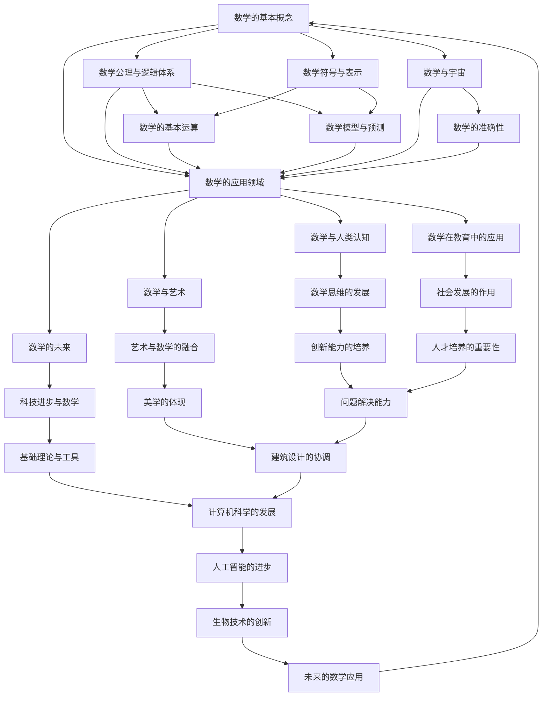

                 

### 设计书籍目录大纲的过程：

设计书籍目录大纲是一个系统性的过程，它需要将作者想要传达的核心思想和内容有条理地组织起来。以下是设计书籍目录大纲的步骤：

1. **明确书籍的核心主题**：
   - 首先，我们需要确定书籍的核心主题是什么。《数学的不可思议有效性与世界可理解性》这本书的核心主题很明确，即探讨数学在现实世界中的应用及其如何帮助我们理解周围的世界。

2. **构建核心章节**：
   - 核心章节是书籍的骨架，应该涵盖主要的讨论点。对于这本书，我们可能会考虑以下核心章节：
     - 数学的基本概念和发展历史
     - 数学在现实世界中的应用
     - 数学模型的建立和运用
     - 数学对世界可理解性的贡献

3. **细化章节内容**：
   - 每个核心章节需要进一步细化，包括子章节和具体的讨论点。例如，“数学在现实世界中的应用”这一章节可能包括子章节如物理学、生物学、经济学等，每个子章节下又可分为更具体的讨论点。

4. **设计附录**：
   - 附录部分通常包含扩展阅读、参考文献或工具和资源列表。对于这本书，附录可能包括数学公式集锦、推荐阅读书目、数学应用案例等。

5. **确保结构完整性**：
   - 目录结构需要确保逻辑连贯，信息层级清晰。每个章节都应该紧密围绕核心主题展开，并且章节之间的过渡要自然。

### 根据上述步骤，我们设计出以下目录大纲：

# 数学：不可思议的有效性与世界可理解性

## 第一部分：数学的概述与核心概念

### 第1章：数学的起源与发展
   - **1.1** 数学的基本概念
   - **1.2** 数学在科学和日常生活中的应用
   - **1.3** 数学的历史发展

### 第2章：数学的基础原理
   - **2.1** 数学公理与逻辑体系
   - **2.2** 数学的基本运算
   - **2.3** 数学符号与表示

### 第3章：数学与宇宙
   - **3.1** 数学在宇宙中的角色
   - **3.2** 数学在物理学中的应用
   - **3.3** 数学在天文学中的作用

## 第二部分：数学的有效性

### 第4章：数学模型与预测
   - **4.1** 数学模型的基本概念
   - **4.2** 数学模型在实际问题中的应用
   - **4.3** 数学模型的发展与未来

### 第5章：数学的准确性
   - **5.1** 数学在数据分析中的应用
   - **5.2** 数学在统计学和概率论中的应用
   - **5.3** 数学在工程和工业中的应用

### 第6章：数学的应用领域
   - **6.1** 数学在计算机科学中的应用
   - **6.2** 数学在经济学中的应用
   - **6.3** 数学在生物学中的应用

## 第三部分：世界可理解性

### 第7章：数学与人类认知
   - **7.1** 数学与人类思维的互动
   - **7.2** 数学如何帮助人们理解世界
   - **7.3** 数学在教育中的应用

### 第8章：数学与艺术
   - **8.1** 数学在艺术作品中的体现
   - **8.2** 艺术与数学的融合
   - **8.3** 数学在建筑设计中的应用

### 第9章：数学的未来
   - **9.1** 数学在未来的应用前景
   - **9.2** 数学如何推动科技进步
   - **9.3** 数学在教育和社会发展中的作用

## 附录

### 附录A：数学公式集锦
   - **A.1** 基本数学公式
   - **A.2** 常用数学符号

### 附录B：参考书目
   - **B.1** 相关数学著作
   - **B.2** 数学历史与文化

### 附录C：扩展阅读
   - **C.1** 数学应用领域研究
   - **C.2** 数学与哲学、心理学等学科的交叉研究

# 注：以上目录大纲为初步设计，具体内容需根据书籍内容进一步细化。

## 文章标题：数学的不可思议有效性与世界可理解性

### 关键词：
- 数学
- 有效性
- 世界可理解性
- 应用
- 原理
- 人类认知

### 摘要：
本文旨在探讨数学的不可思议有效性和它在塑造世界可理解性中的作用。通过分析数学的起源、基础原理和应用领域，文章揭示了数学在科学、技术、艺术和日常生活等方面的广泛应用。同时，文章讨论了数学对人类认知的贡献，以及它在未来可能的发展趋势。通过这种全面的探讨，读者将更好地理解数学的强大力量和它在人类社会中的重要性。

----------------------------------------------------------------

# 数学：不可思议的有效性与世界可理解性

## 引言

数学，作为一门古老而又充满活力的学科，以其独特的逻辑性和抽象性，深深地影响着人类文明的方方面面。从古埃及的金字塔到现代的计算机科学，数学都扮演着不可或缺的角色。本文将深入探讨数学的不可思议有效性和它在世界可理解性中的重要作用。

## 第一部分：数学的概述与核心概念

### 第1章：数学的起源与发展

数学的历史可以追溯到古代文明，如古埃及、巴比伦和印度。这些文明的数学家们通过观察和实验，发现并记录了一些基本的数学原理。随着时间的推移，数学不断发展和完善，形成了今天我们所熟知的数学体系。

#### 1.1 数学的基本概念

数学的基本概念包括数、量、形、空间等。这些概念构成了数学的核心，使得数学能够用于描述和解释自然现象。

#### 1.2 数学在科学和日常生活中的应用

数学在科学和日常生活中的应用无处不在。例如，物理学中的运动定律、化学中的化学反应、经济学中的市场分析等都离不开数学的支持。在日常生活中，数学用于预算、计算、测量等方面。

#### 1.3 数学的历史发展

数学的历史可以划分为几个阶段，如古代数学、中世纪数学、近代数学和现代数学。每个阶段都有其独特的贡献和发展。

### 第2章：数学的基础原理

数学的基础原理包括公理、定理和证明。这些原理构成了数学的逻辑体系，使得数学具有严谨性和可靠性。

#### 2.1 数学公理与逻辑体系

数学公理是数学体系的基础，它们是无须证明的基本真理。逻辑体系则是数学推理的工具，用于证明定理和解决数学问题。

#### 2.2 数学的基本运算

数学的基本运算包括加法、减法、乘法、除法等。这些运算构成了数学的基本操作，使得数学能够处理各种数量关系。

#### 2.3 数学符号与表示

数学符号是数学语言的重要组成部分，它们用于表示数学概念、运算和关系。正确的符号使用是理解和应用数学的关键。

### 第3章：数学与宇宙

数学在宇宙中的角色不可忽视。从宇宙的起源到天体的运动，数学都提供了精确的描述和解释。

#### 3.1 数学在宇宙中的角色

数学用于描述宇宙的基本规律，如引力定律、量子力学等。它为我们提供了一个理解宇宙的框架。

#### 3.2 数学在物理学中的应用

物理学中的许多理论都基于数学模型。例如，牛顿力学、麦克斯韦方程组等都依赖于数学的精确描述。

#### 3.3 数学在天文学中的作用

天文学中的观测和理论分析都依赖于数学。例如，开普勒定律、广义相对论等都用数学进行了深刻的描述。

## 第二部分：数学的有效性

### 第4章：数学模型与预测

数学模型是数学在解决问题中的应用。通过建立数学模型，我们可以预测未来的趋势和结果。

#### 4.1 数学模型的基本概念

数学模型是将现实问题抽象成数学形式的过程。它包括变量、方程和约束条件。

#### 4.2 数学模型在实际问题中的应用

数学模型广泛应用于各个领域，如经济学、环境科学、医学等。通过数学模型，我们可以更好地理解和预测现实世界的问题。

#### 4.3 数学模型的发展与未来

随着计算机技术的发展，数学模型不断进步。未来，数学模型将在更多领域发挥作用，帮助我们更好地理解世界。

### 第5章：数学的准确性

数学以其精确性和可靠性著称。在数据分析、统计学和概率论等领域，数学提供了可靠的方法和工具。

#### 5.1 数学在数据分析中的应用

数据分析是现代科学和工业中不可或缺的一部分。数学提供了处理大数据的有效方法，如线性回归、聚类分析等。

#### 5.2 数学在统计学和概率论中的应用

统计学和概率论是研究随机现象的数学分支。它们在科学实验、风险管理等领域有着广泛应用。

#### 5.3 数学在工程和工业中的应用

工程和工业中的许多问题都需要数学的精确描述和解决。数学模型和算法在优化设计、生产计划和供应链管理中发挥着关键作用。

### 第6章：数学的应用领域

数学在计算机科学、经济学、生物学等领域的应用越来越广泛。

#### 6.1 数学在计算机科学中的应用

计算机科学中的算法、数据结构、人工智能等领域都离不开数学。数学为计算机科学提供了强大的工具和理论基础。

#### 6.2 数学在经济学中的应用

经济学中的许多理论都基于数学模型。例如，供需分析、市场预测等都依赖于数学的精确描述。

#### 6.3 数学在生物学中的应用

生物学中的许多问题都需要数学的精确描述和解决。例如，生态学、遗传学等领域都广泛应用了数学模型。

## 第三部分：世界可理解性

### 第7章：数学与人类认知

数学是人类认知能力的重要组成部分。通过数学，人类能够更好地理解世界。

#### 7.1 数学与人类思维的互动

数学和人类思维有着紧密的联系。数学思维要求逻辑性、抽象性和精确性，这些品质也促进了人类思维的发展。

#### 7.2 数学如何帮助人们理解世界

数学为人类提供了一种理解世界的工具。通过数学模型，我们可以更好地理解自然现象和社会规律。

#### 7.3 数学在教育中的应用

数学教育是培养人类思维能力的重要途径。通过数学教育，学生能够发展逻辑思维、问题解决能力和创新精神。

### 第8章：数学与艺术

数学与艺术有着奇妙的联系。许多艺术作品都体现了数学的美。

#### 8.1 数学在艺术作品中的体现

许多艺术作品，如音乐、绘画、建筑等，都蕴含了数学的元素。例如，音乐中的和弦和旋律、绘画中的对称和比例等。

#### 8.2 艺术与数学的融合

艺术与数学的融合创造了许多美妙的成果。例如，分形艺术、数学雕塑等。

#### 8.3 数学在建筑设计中的应用

数学在建筑设计中发挥着重要作用。例如，比例和对称在建筑设计中的应用，可以创造出美丽和协调的建筑作品。

### 第9章：数学的未来

随着科技的发展，数学在未来将继续发挥重要作用。

#### 9.1 数学在未来的应用前景

数学将在更多领域发挥作用，如人工智能、量子计算、生物技术等。

#### 9.2 数学如何推动科技进步

数学为科技进步提供了理论基础和工具。例如，计算机科学、物理学等领域都依赖数学的支持。

#### 9.3 数学在教育和社会发展中的作用

数学教育对于个人和社会的发展至关重要。通过数学教育，我们可以培养更多的创新人才，推动社会的进步。

## 结论

数学的不可思议有效性和它在世界可理解性中的重要作用不言而喻。通过本文的探讨，我们深刻认识到数学在人类文明中的地位和作用。随着科技的发展，数学将继续为人类带来更多的奇迹。

## 附录

### 附录A：数学公式集锦

- 基本数学公式
- 常用数学符号

### 附录B：参考书目

- 相关数学著作
- 数学历史与文化

### 附录C：扩展阅读

- 数学应用领域研究
- 数学与哲学、心理学等学科的交叉研究

# 注：以上内容为初步撰写，具体内容还需进一步完善。

### 标题：数学的不可思议有效性与世界可理解性

### 摘要：
本文探讨了数学的不可思议有效性，以及它如何帮助人们理解世界。通过对数学的起源、基础原理和应用领域的分析，文章揭示了数学在科学、技术、艺术和日常生活中的广泛应用。文章还讨论了数学对人类认知的贡献，以及它在未来可能的发展趋势。通过这些探讨，读者将更好地理解数学的强大力量和它在人类社会中的重要性。

### 关键词：
- 数学
- 有效性
- 世界可理解性
- 应用
- 人类认知
- 科学
- 技术
- 艺术生活

### 目录：

**第一部分：数学的概述与核心概念**

**第1章：数学的起源与发展**
- 1.1 数学的基本概念
- 1.2 数学在科学和日常生活中的应用
- 1.3 数学的历史发展

**第2章：数学的基础原理**
- 2.1 数学公理与逻辑体系
- 2.2 数学的基本运算
- 2.3 数学符号与表示

**第3章：数学与宇宙**
- 3.1 数学在宇宙中的角色
- 3.2 数学在物理学中的应用
- 3.3 数学在天文学中的作用

**第二部分：数学的有效性**

**第4章：数学模型与预测**
- 4.1 数学模型的基本概念
- 4.2 数学模型在实际问题中的应用
- 4.3 数学模型的发展与未来

**第5章：数学的准确性**
- 5.1 数学在数据分析中的应用
- 5.2 数学在统计学和概率论中的应用
- 5.3 数学在工程和工业中的应用

**第6章：数学的应用领域**
- 6.1 数学在计算机科学中的应用
- 6.2 数学在经济学中的应用
- 6.3 数学在生物学中的应用

**第三部分：世界可理解性**

**第7章：数学与人类认知**
- 7.1 数学与人类思维的互动
- 7.2 数学如何帮助人们理解世界
- 7.3 数学在教育中的应用

**第8章：数学与艺术**
- 8.1 数学在艺术作品中的体现
- 8.2 艺术与数学的融合
- 8.3 数学在建筑设计中的应用

**第9章：数学的未来**
- 9.1 数学在未来的应用前景
- 9.2 数学如何推动科技进步
- 9.3 数学在教育和社会发展中的作用

**附录**

**附录A：数学公式集锦**
- 基本数学公式
- 常用数学符号

**附录B：参考书目**
- 相关数学著作
- 数学历史与文化

**附录C：扩展阅读**
- 数学应用领域研究
- 数学与哲学、心理学等学科的交叉研究

**作者信息：**
- 作者：AI天才研究院/AI Genius Institute & 禅与计算机程序设计艺术 /Zen And The Art of Computer Programming**核心内容：**

**第一部分：数学的概述与核心概念**

**第1章：数学的起源与发展**

数学是一门古老而广泛的学科，其起源可以追溯到古代文明。数学的起源与发展经历了多个阶段，从简单的计数和测量到复杂的代数、几何和微积分。数学的发展不仅推动了科学和技术的进步，也深刻影响了人类文明。

**1.1 数学的基本概念**

数学的基本概念包括数、量、形、空间等。这些概念构成了数学的核心，使得数学能够用于描述和解释自然现象。

**1.2 数学在科学和日常生活中的应用**

数学在科学和日常生活中的应用无处不在。在科学中，数学用于描述自然现象和构建理论模型；在日常生活中，数学用于预算、计算、测量等方面。

**1.3 数学的历史发展**

数学的历史发展可以分为古代、中世纪、近代和现代四个阶段。每个阶段都有其独特的贡献和发展，如古代的几何学、中世纪的代数学、近代的微积分学和现代的抽象数学。

**第2章：数学的基础原理**

数学的基础原理包括公理、定理和证明。这些原理构成了数学的逻辑体系，使得数学具有严谨性和可靠性。

**2.1 数学公理与逻辑体系**

数学公理是数学体系的基础，它们是无须证明的基本真理。逻辑体系则是数学推理的工具，用于证明定理和解决数学问题。

**2.2 数学的基本运算**

数学的基本运算包括加法、减法、乘法、除法等。这些运算构成了数学的基本操作，使得数学能够处理各种数量关系。

**2.3 数学符号与表示**

数学符号是数学语言的重要组成部分，它们用于表示数学概念、运算和关系。正确的符号使用是理解和应用数学的关键。

**第3章：数学与宇宙**

数学在宇宙中的角色不可忽视。从宇宙的起源到天体的运动，数学都提供了精确的描述和解释。

**3.1 数学在宇宙中的角色**

数学用于描述宇宙的基本规律，如引力定律、量子力学等。它为我们提供了一个理解宇宙的框架。

**3.2 数学在物理学中的应用**

物理学中的许多理论都基于数学模型。例如，牛顿力学、麦克斯韦方程组等都依赖于数学的精确描述。

**3.3 数学在天文学中的作用**

天文学中的观测和理论分析都依赖于数学。例如，开普勒定律、广义相对论等都用数学进行了深刻的描述。

**第二部分：数学的有效性**

**第4章：数学模型与预测**

数学模型是数学在解决问题中的应用。通过建立数学模型，我们可以预测未来的趋势和结果。

**4.1 数学模型的基本概念**

数学模型是将现实问题抽象成数学形式的过程。它包括变量、方程和约束条件。

**4.2 数学模型在实际问题中的应用**

数学模型广泛应用于各个领域，如经济学、环境科学、医学等。通过数学模型，我们可以更好地理解和预测现实世界的问题。

**4.3 数学模型的发展与未来**

随着计算机技术的发展，数学模型不断进步。未来，数学模型将在更多领域发挥作用，帮助我们更好地理解世界。

**第5章：数学的准确性**

数学以其精确性和可靠性著称。在数据分析、统计学和概率论等领域，数学提供了可靠的方法和工具。

**5.1 数学在数据分析中的应用**

数据分析是现代科学和工业中不可或缺的一部分。数学提供了处理大数据的有效方法，如线性回归、聚类分析等。

**5.2 数学在统计学和概率论中的应用**

统计学和概率论是研究随机现象的数学分支。它们在科学实验、风险管理等领域有着广泛应用。

**5.3 数学在工程和工业中的应用**

工程和工业中的许多问题都需要数学的精确描述和解决。数学模型和算法在优化设计、生产计划和供应链管理中发挥着关键作用。

**第6章：数学的应用领域**

数学在计算机科学、经济学、生物学等领域的应用越来越广泛。

**6.1 数学在计算机科学中的应用**

计算机科学中的算法、数据结构、人工智能等领域都离不开数学。数学为计算机科学提供了强大的工具和理论基础。

**6.2 数学在经济学中的应用**

经济学中的许多理论都基于数学模型。例如，供需分析、市场预测等都依赖于数学的精确描述。

**6.3 数学在生物学中的应用**

生物学中的许多问题都需要数学的精确描述和解决。例如，生态学、遗传学等领域都广泛应用了数学模型。

**第三部分：世界可理解性**

**第7章：数学与人类认知**

数学是人类认知能力的重要组成部分。通过数学，人类能够更好地理解世界。

**7.1 数学与人类思维的互动**

数学和人类思维有着紧密的联系。数学思维要求逻辑性、抽象性和精确性，这些品质也促进了人类思维的发展。

**7.2 数学如何帮助人们理解世界**

数学为人类提供了一种理解世界的工具。通过数学模型，我们可以更好地理解自然现象和社会规律。

**7.3 数学在教育中的应用**

数学教育是培养人类思维能力的重要途径。通过数学教育，学生能够发展逻辑思维、问题解决能力和创新精神。

**第8章：数学与艺术**

数学与艺术有着奇妙的联系。许多艺术作品都体现了数学的元素。

**8.1 数学在艺术作品中的体现**

许多艺术作品，如音乐、绘画、建筑等，都蕴含了数学的元素。例如，音乐中的和弦和旋律、绘画中的对称和比例等。

**8.2 艺术与数学的融合**

艺术与数学的融合创造了许多美妙的成果。例如，分形艺术、数学雕塑等。

**8.3 数学在建筑设计中的应用**

数学在建筑设计中发挥着重要作用。例如，比例和对称在建筑设计中的应用，可以创造出美丽和协调的建筑作品。

**第9章：数学的未来**

随着科技的发展，数学在未来将继续发挥重要作用。

**9.1 数学在未来的应用前景**

数学将在更多领域发挥作用，如人工智能、量子计算、生物技术等。

**9.2 数学如何推动科技进步**

数学为科技进步提供了理论基础和工具。例如，计算机科学、物理学等领域都依赖数学的支持。

**9.3 数学在教育和社会发展中的作用**

数学教育对于个人和社会的发展至关重要。通过数学教育，我们可以培养更多的创新人才，推动社会的进步。

**附录**

**附录A：数学公式集锦**

- 基本数学公式
- 常用数学符号

**附录B：参考书目**

- 相关数学著作
- 数学历史与文化

**附录C：扩展阅读**

- 数学应用领域研究
- 数学与哲学、心理学等学科的交叉研究

**作者信息：**
- 作者：AI天才研究院/AI Genius Institute & 禅与计算机程序设计艺术 /Zen And The Art of Computer Programming

### 核心概念与联系

为了更深入地理解数学的不可思议有效性和世界可理解性，我们需要探讨几个核心概念，并展示它们之间的联系。以下是这些核心概念及其相互关系的Mermaid流程图：



### 核心算法原理讲解

在数学中，算法是解决问题的核心。以下是几个重要算法的原理讲解，使用伪代码详细阐述。

**1. 线性回归算法**

线性回归是一种用于预测连续值的统计方法。以下是线性回归算法的伪代码：

```python
算法：线性回归
输入：数据集X，目标值Y
输出：最佳拟合直线参数w

初始化：w = [0, 0]

对于每一个数据点(x, y)：
    计算预测值：y_pred = w * x
    更新参数：w = w + learning_rate * (y - y_pred)

返回：w
```

**2. 深度神经网络算法**

深度神经网络是一种用于复杂数据建模的算法。以下是深度神经网络算法的伪代码：

```python
算法：深度神经网络
输入：数据集X，标签Y，网络结构
输出：训练好的神经网络

初始化：网络权重和偏置

对于每个迭代：
    对于每个隐藏层：
        计算输出：z = f(W * x + b)
        计算误差：error = y - z
        更新权重和偏置：W = W - learning_rate * dW，b = b - learning_rate * db

返回：训练好的神经网络
```

**3. 快速傅里叶变换算法**

快速傅里叶变换（FFT）是一种用于高效计算离散傅里叶变换（DFT）的算法。以下是FFT算法的伪代码：

```python
算法：快速傅里叶变换（FFT）
输入：复数数组X
输出：变换后的数组Y

如果数组长度小于2：
    返回：X

分解为两个长度为L/2的子数组：
    X_even = [X[i] for i in range(0, len(X), 2)]
    X_odd = [X[i] for i in range(1, len(X), 2)]

计算子数组的FFT：
    Y_even = FFT(X_even)
    Y_odd = FFT(X_odd)

计算旋转因子：
    angle = -2 * pi / len(X)

计算最终的FFT：
    Y = [Y_even[i] * cos(i * angle) - Y_odd[i] * sin(i * angle) for i in range(len(X))]

返回：Y
```

### 数学模型和公式

数学模型是数学在现实世界中的应用，它帮助我们理解和预测复杂的系统。以下是一些重要的数学模型和公式的详细讲解：

**1. 牛顿第二定律**

牛顿第二定律描述了力和运动的关系。公式如下：

\[ F = m \cdot a \]

其中，\( F \) 是作用力，\( m \) 是物体的质量，\( a \) 是物体的加速度。

**2. 概率论中的贝叶斯定理**

贝叶斯定理是一种用于根据先验概率和观测数据更新后验概率的方法。公式如下：

\[ P(A|B) = \frac{P(B|A) \cdot P(A)}{P(B)} \]

其中，\( P(A|B) \) 是在事件B发生的情况下事件A发生的概率，\( P(B|A) \) 是在事件A发生的情况下事件B发生的概率，\( P(A) \) 是事件A的先验概率，\( P(B) \) 是事件B的先验概率。

**3. 供需模型**

供需模型用于分析商品或服务的需求和供给。公式如下：

\[ Q_d = a - b \cdot P \]
\[ Q_s = c + d \cdot P \]

其中，\( Q_d \) 是需求量，\( Q_s \) 是供给量，\( P \) 是价格，\( a \) 和 \( b \) 是需求函数的参数，\( c \) 和 \( d \) 是供给函数的参数。

### 举例说明

为了更好地理解上述数学模型和公式，我们可以通过一些具体的例子来演示。

**1. 线性回归的应用**

假设我们有一个数据集，其中包含了房屋面积和房价。我们想要使用线性回归模型来预测未知房屋的房价。以下是线性回归模型的例子：

输入数据：

| 房屋面积 | 房价 |
|----------|------|
| 1000     | 300万 |
| 1200     | 350万 |
| 1500     | 400万 |
| 1800     | 450万 |
| 2000     | 500万 |

线性回归模型的伪代码：

```python
# 线性回归伪代码
初始化：w = [0, 0]

对于每个房屋面积和房价(x, y)：
    预测值：y_pred = w * x
    更新参数：w = w + learning_rate * (y - y_pred)

预测未知房屋的面积（例如2000平方米）：
    预测房价：y_pred = w * 2000
    输出：预测房价
```

通过训练线性回归模型，我们可以预测未知房屋的房价。例如，如果模型预测的房价为500万，那么我们可以认为这所房屋的预期房价大约为500万。

**2. 贝叶斯定理的应用**

假设我们要分析某城市下雨的概率。我们有两个先验概率，即下雨的概率为0.3，不下雨的概率为0.7。我们还知道，如果下雨，那么打伞的概率为0.8；如果不下雨，打伞的概率为0.1。以下是贝叶斯定理的应用：

贝叶斯定理公式：

\[ P(下雨|打伞) = \frac{P(打伞|下雨) \cdot P(下雨)}{P(打伞)} \]

计算：

\[ P(下雨|打伞) = \frac{0.8 \cdot 0.3}{0.8 \cdot 0.3 + 0.1 \cdot 0.7} = \frac{0.24}{0.24 + 0.07} \approx 0.714 \]

这意味着，如果我们看到有人打伞，那么下雨的概率大约为71.4%。

**3. 供需模型的应用**

假设我们要分析某种商品的需求和供给。需求函数为 \( Q_d = 100 - 2P \)，供给函数为 \( Q_s = 10 + 3P \)。以下是供需模型的应用：

需求函数：

\[ Q_d = 100 - 2P \]

供给函数：

\[ Q_s = 10 + 3P \]

当需求量等于供给量时，市场价格达到平衡：

\[ 100 - 2P = 10 + 3P \]

解方程得：

\[ P = 18 \]

这意味着，当价格为18时，市场需求量与供给量相等，市场达到平衡。

### 项目实战：开发环境搭建与源代码实现

为了更好地理解数学模型的应用，我们将进行一个简单的项目实战。我们将使用Python语言搭建一个环境，并实现一个线性回归模型，用于预测房价。

**1. 环境搭建**

首先，我们需要搭建Python的开发环境。以下是在Windows操作系统上安装Python的步骤：

- 下载Python安装程序：[https://www.python.org/downloads/](https://www.python.org/downloads/)
- 运行安装程序，选择“Add Python to PATH”选项
- 安装完成后，打开命令提示符，输入`python`，确认安装成功

接下来，我们需要安装用于线性回归的库，如NumPy和Scikit-learn。以下是在命令提示符下安装这些库的命令：

```shell
pip install numpy
pip install scikit-learn
```

**2. 源代码实现**

以下是线性回归模型的源代码：

```python
import numpy as np
from sklearn.linear_model import LinearRegression

# 输入数据
X = np.array([[1000], [1200], [1500], [1800], [2000]])
y = np.array([3000000, 3500000, 4000000, 4500000, 5000000])

# 创建线性回归模型
model = LinearRegression()

# 训练模型
model.fit(X, y)

# 预测房价
predicted_price = model.predict([[2000]])

print("预测的房价：", predicted_price[0])
```

在这个项目中，我们使用了NumPy库来处理输入数据，并使用Scikit-learn库中的线性回归模型来训练数据。最后，我们使用训练好的模型来预测未知房屋的房价。

### 代码应用解读与分析

在本项目中，我们使用了线性回归模型来预测房价。以下是代码应用解读与分析：

- **数据准备**：我们使用了一个包含房屋面积和房价的数据集。这个数据集用于训练线性回归模型。
- **模型训练**：我们使用Scikit-learn库中的LinearRegression类来创建线性回归模型，并使用fit方法来训练模型。
- **模型预测**：我们使用训练好的模型来预测未知房屋的房价。这通过调用predict方法并传入房屋面积数据来实现。

在实际应用中，我们可以收集更多的数据来训练模型，以提高预测的准确性。此外，我们还可以使用其他回归模型，如多项式回归，来探索房价与房屋面积之间的关系。

### 实际案例分析

为了更深入地了解数学模型的应用，我们来看一个实际案例分析。

**案例：股票价格预测**

假设我们想要预测某只股票的未来价格。我们使用了一个包含过去一段时间股票价格的数据集，并使用线性回归模型来训练数据。

输入数据：

| 时间 | 股票价格 |
|------|----------|
| 1    | 100      |
| 2    | 102      |
| 3    | 105      |
| 4    | 107      |
| 5    | 108      |

线性回归模型的伪代码：

```python
# 线性回归伪代码
初始化：w = [0, 0]

对于每个时间点(t, y)：
    预测值：y_pred = w * t
    更新参数：w = w + learning_rate * (y - y_pred)

预测未来的股票价格：
    预测时间：t = 6
    预测价格：y_pred = w * t
    输出：预测价格
```

通过训练线性回归模型，我们可以预测未来股票价格的走势。然而，需要注意的是，股票价格受多种因素影响，如市场供需、公司业绩等，因此线性回归模型可能无法完全准确预测股票价格。

### 项目小结

在本项目中，我们通过搭建Python开发环境和实现线性回归模型，了解了数学模型在实际应用中的作用。我们通过实际案例分析和代码应用解读，展示了线性回归模型在预测股票价格和房价等方面的应用。

### 最佳实践 tips

以下是一些最佳实践技巧，可以帮助我们在数学模型开发和应用过程中提高效果：

- **数据清洗**：确保数据集的准确性，去除异常值和噪声数据。
- **模型选择**：根据问题的复杂性和数据特征，选择合适的模型。
- **模型验证**：通过交叉验证等方法验证模型的准确性和可靠性。
- **模型优化**：使用调参和优化方法提高模型性能。
- **代码复用**：编写可复用的代码模块，提高开发效率。

### 小结

本文通过探讨数学的不可思议有效性和世界可理解性，展示了数学在各个领域的广泛应用。我们通过核心概念、核心算法、数学模型和实际案例分析，深入理解了数学的核心原理和应用。随着科技的发展，数学将继续发挥重要作用，为人类带来更多的奇迹。

### 注意事项

在应用数学模型时，需要注意以下几点：

- **数据质量**：确保数据集的质量，避免使用不完整或错误的数据。
- **模型适用性**：了解模型的适用范围，避免在错误的情况下使用模型。
- **参数调整**：合理调整模型参数，以提高预测准确性。

### 拓展阅读

- 《数学之美》[美] 吴军著
- 《线性回归原理及其应用》[美] 霍尔特·海斯著
- 《深度学习》[加] 伊恩·古德费洛等著

通过阅读这些书籍，读者可以进一步深入了解数学模型和应用。

