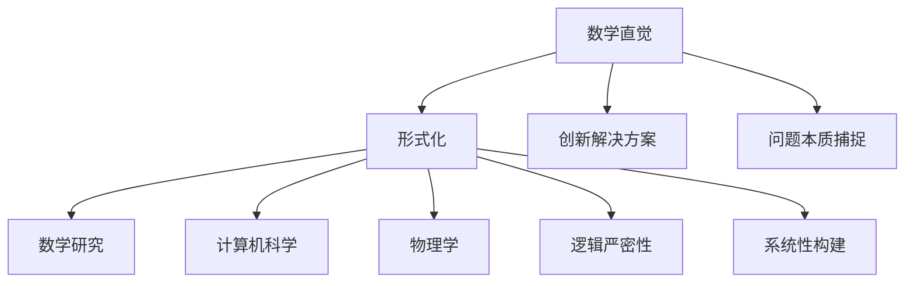
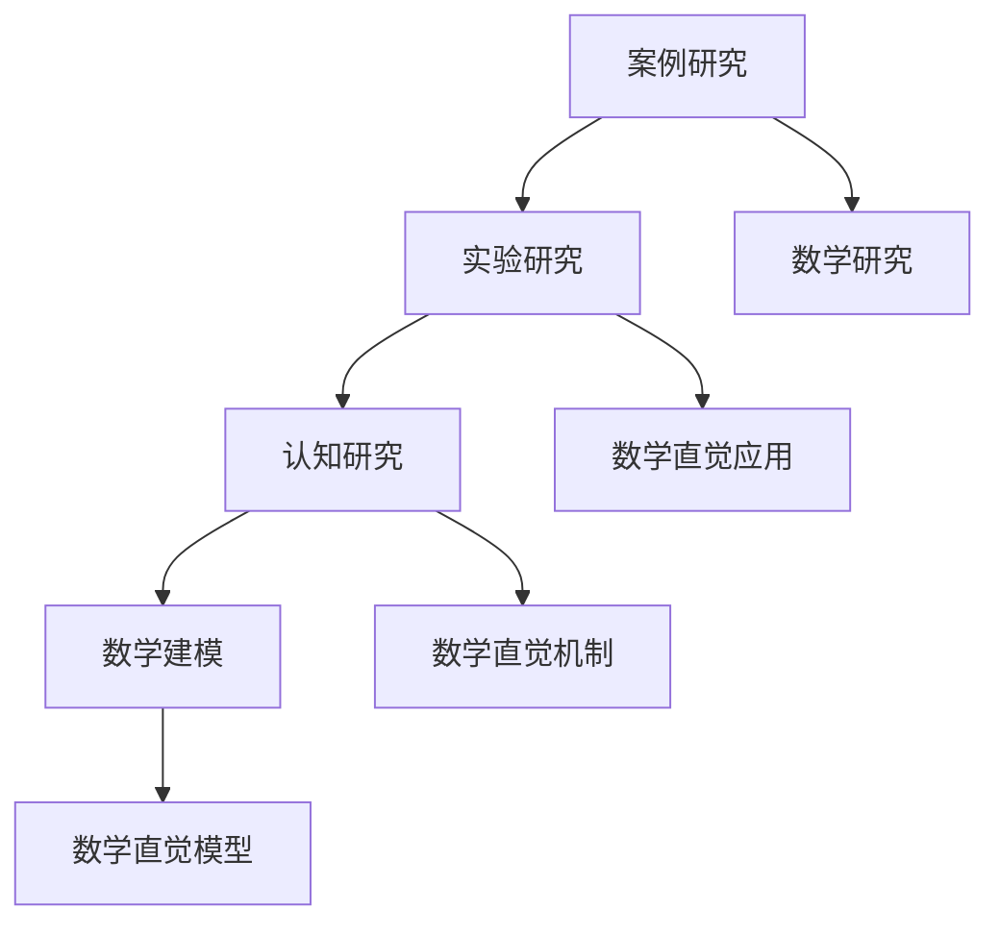
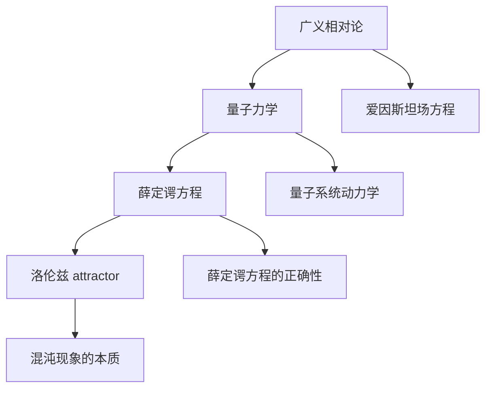
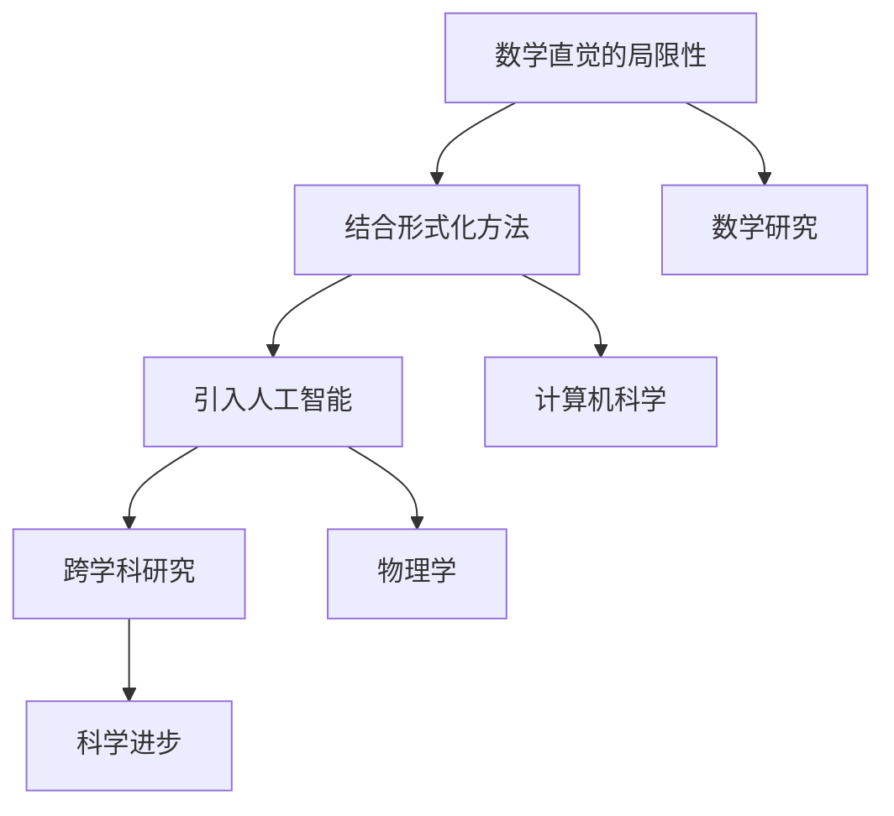
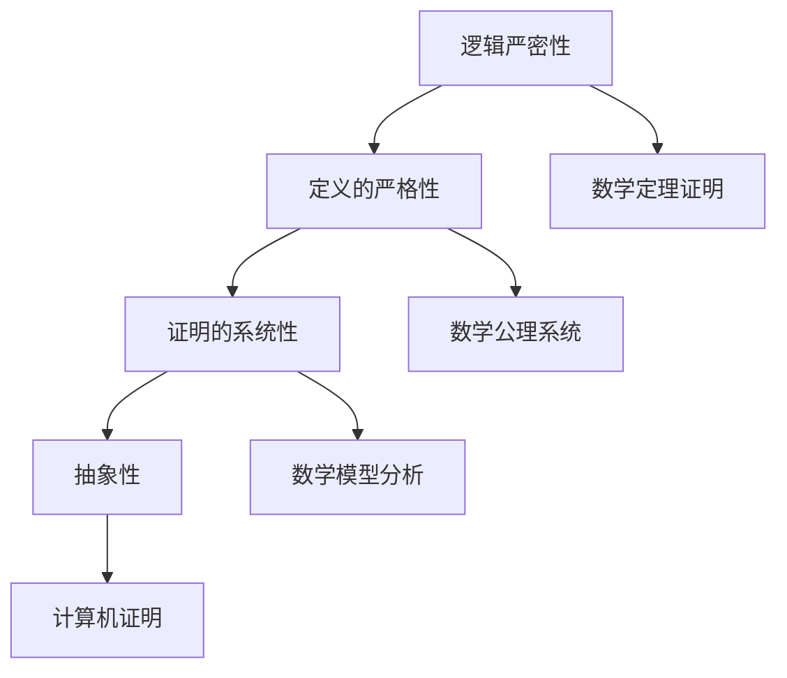
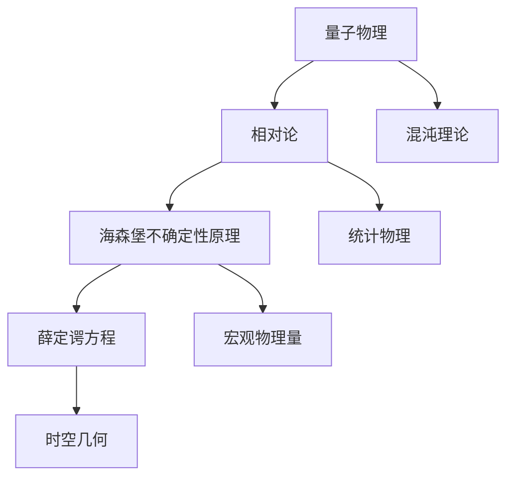
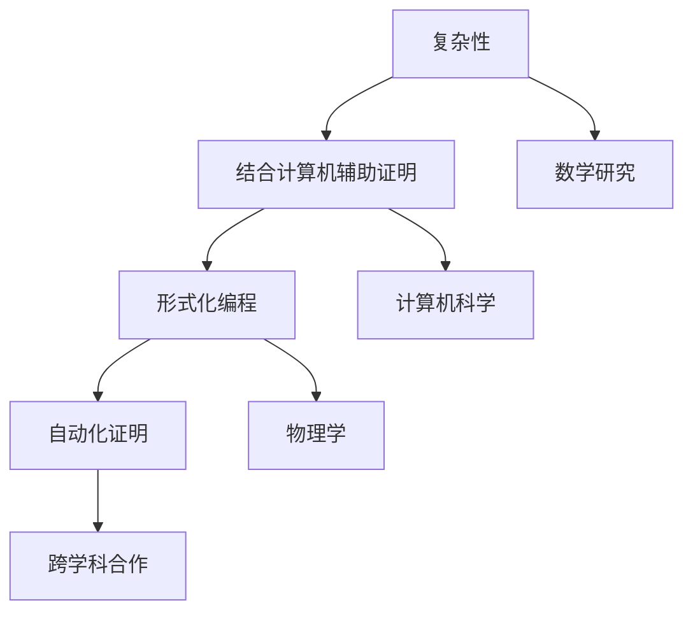
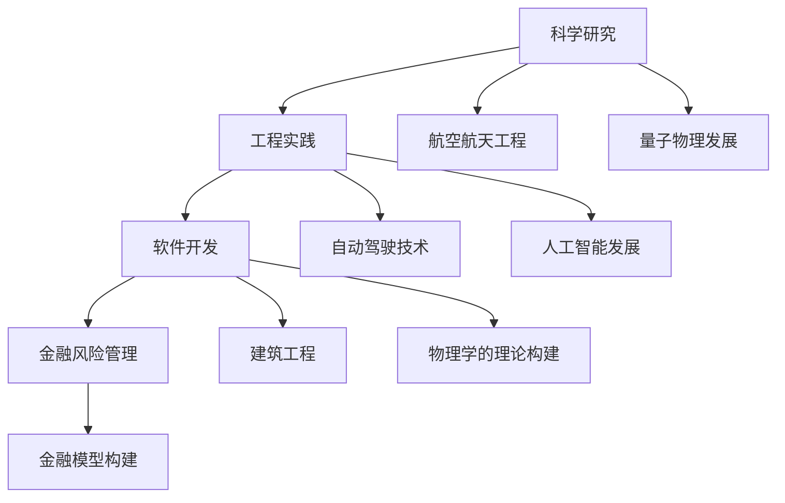
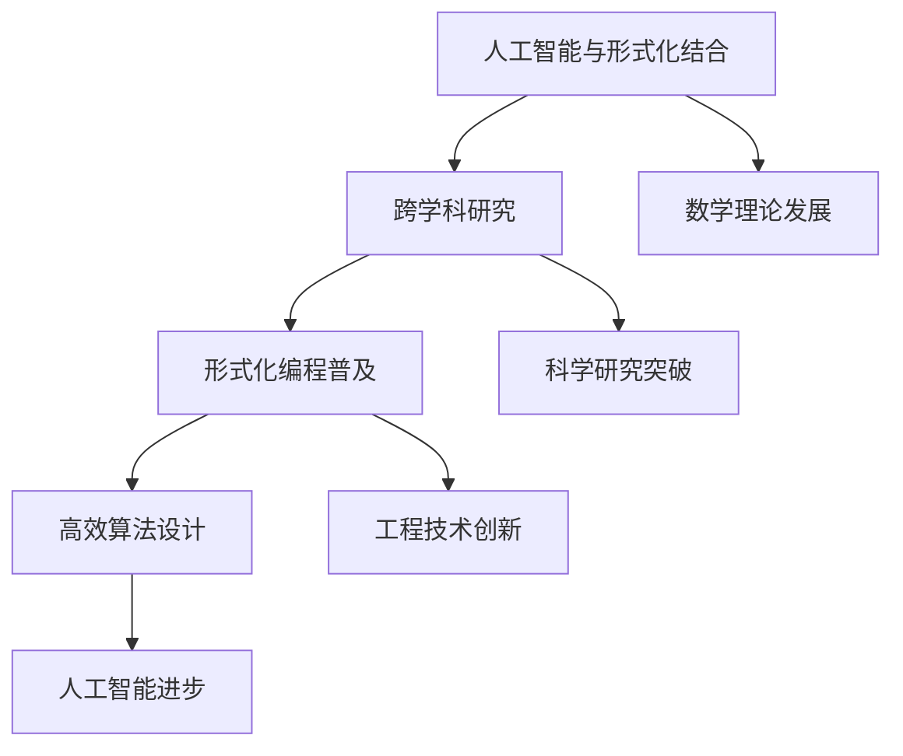

                 

### 文章标题

《数学直觉vs形式化：理解抽象世界的两种路径》

### 文章关键词

- 数学直觉
- 形式化
- 抽象世界
- 理解路径
- 算法原理
- 数学模型
- 伪代码
- 项目实战
- 实际案例
- 拓展阅读

### 文章摘要

本文深入探讨了数学直觉与形式化这两种理解抽象世界的路径。首先，介绍了数学直觉的基本概念、重要性以及其在数学研究、计算机科学和物理学中的应用。接着，阐述了形式化的核心概念、目的及应用领域。随后，通过核心算法原理讲解、数学模型和公式详细说明，以及项目实战，深入剖析了数学直觉与形式化的互补性及协同作用。最后，展望了数学直觉与形式化在抽象世界理解中的未来发展，并提出了相关注意事项与拓展阅读建议。本文旨在为读者提供一个全面、系统的理解抽象世界的方法论框架。

### 引言

在人类探索和理解世界的历程中，数学作为一种高度抽象的学科，发挥着至关重要的作用。而数学直觉与形式化则成为了我们理解数学世界、探索科学领域、解决实际问题的两大核心路径。数学直觉，指的是人们在面对数学问题时，通过直觉思维迅速获得答案或解决方案的能力。而形式化，则是一种通过严谨的逻辑推理、定义和证明来构建数学理论和解决问题的方法。

这两种路径各有特点，但又相互补充。数学直觉依赖于个人的经验和直觉，往往能迅速捕捉问题的本质，提出创新的解决方案。然而，其局限性在于难以保证结论的严格性和普适性。形式化则通过逻辑和证明，确保数学理论的严密性和系统性，但其过程往往较为繁琐，难以适应快速变化的实际需求。

本文将首先详细阐述数学直觉的基本概念、重要性及其应用领域，随后介绍形式化的核心概念、目的和应用。接着，通过具体的算法原理讲解、数学模型和公式说明，深入剖析这两种路径的互补性和协同作用。最后，结合实际案例，探讨数学直觉与形式化在科学研究、工程实践中的综合应用，并提出未来发展的展望。希望通过本文的探讨，能够为读者提供一个全面、系统的理解抽象世界的方法论框架。<!-- markdown ended --> 
 

 
<a href="https://i.imgur.com/Tp4IqVZ.png" target="_blank">图1-1：数学直觉与形式化的联系</a> 

 

 

 

### 第一部分：引论

#### 数学直觉概述

数学直觉是指人们在面对数学问题时，通过直观思维迅速获得答案或解决方案的能力。它是一种高度抽象的思维能力，往往能够迅速捕捉问题的本质，并提出创新的解决方案。数学直觉并非无源之水，它是建立在长期数学学习和实践的基础上，通过对数学概念、定理和公式的深刻理解和灵活运用而形成的。

数学直觉的重要性体现在多个方面。首先，数学直觉在数学研究中起着至关重要的作用。许多数学家的重大发现往往源自于直觉，比如费马大定理的猜想、哥德巴赫猜想的提出等。其次，数学直觉在计算机科学领域也有着广泛的应用。编程中的算法设计、数据结构的选择，都依赖于程序员的直觉思维。最后，数学直觉在物理学研究中也发挥着重要作用。物理学家在提出新的物理理论时，往往依赖于直觉来预测理论的结果。

数学直觉的应用领域非常广泛，包括数学研究、计算机科学和物理学等。在数学研究中，数学直觉帮助数学家发现新的数学定理、解决复杂的数学问题。在计算机科学中，数学直觉帮助程序员设计高效的算法、优化程序性能。在物理学中，数学直觉帮助物理学家构建新的物理模型、预测自然现象。

然而，数学直觉也存在一定的局限性。首先，数学直觉的结论往往缺乏严格性，难以保证其普适性。其次，数学直觉的依赖性强，不同的人可能会有不同的直觉结论。因此，在数学研究中，形式化方法通常与数学直觉相结合，以弥补直觉的不足。

#### 形式化概述

形式化是一种通过严谨的逻辑推理、定义和证明来构建数学理论和解决问题的方法。与数学直觉不同，形式化强调逻辑的严密性和证明的系统性，确保数学理论的严谨性和普适性。

形式化的核心概念包括形式化语言、形式化推理和形式化证明。形式化语言是一种用来表示数学理论和证明的符号系统，它通过定义符号和规则，使得数学理论的表达和证明更加规范和严谨。形式化推理是指通过逻辑推理，从已知的前提推导出新的结论的过程。形式化证明则是通过一系列的逻辑推理和证明步骤，证明一个数学命题的正确性。

形式化的目的是为了确保数学理论的严密性和系统性。在数学研究中，形式化方法有助于避免逻辑错误和矛盾，保证数学理论的正确性。同时，形式化方法也为计算机验证和证明提供了工具，使得数学证明可以自动化或半自动化地进行。

形式化的应用领域非常广泛，包括数学研究、计算机科学和物理学等。在数学研究中，形式化方法用于建立新的数学理论、解决复杂的数学问题。在计算机科学中，形式化方法用于验证程序的正确性、设计安全的加密算法。在物理学中，形式化方法用于构建新的物理模型、验证物理理论的正确性。

然而，形式化方法也存在一定的局限性。首先，形式化过程往往较为繁琐，难以适应快速变化的实际需求。其次，形式化方法难以捕捉到数学直觉的创新能力。因此，在实际应用中，通常将数学直觉与形式化方法相结合，以发挥各自的优势。

#### 数学直觉与形式化的联系

数学直觉与形式化是两种理解数学世界的不同路径，但它们之间存在着紧密的联系和互补性。

首先，数学直觉与形式化在数学研究中具有互补性。数学直觉能够迅速捕捉问题的本质，提出创新的解决方案，而形式化方法则能够对这些直觉进行严谨的证明和验证，确保数学理论的正确性。例如，在数学研究中，一个数学家可能会通过直觉发现一个新的数学定理，而通过形式化方法，可以证明该定理的普适性和严格性。

其次，数学直觉与形式化在计算机科学中也有着互补性。数学直觉帮助程序员设计高效的算法和数据结构，而形式化方法则能够验证这些算法和结构的正确性。例如，在软件工程中，程序员可能会通过直觉设计一个算法，而通过形式化验证，可以确保该算法在不同输入条件下都能正确运行。

此外，数学直觉与形式化在物理学研究中也有着协同作用。数学直觉帮助物理学家构建新的物理模型，而形式化方法则能够验证这些模型的正确性和可靠性。例如，在量子物理学中，物理学家通过直觉提出了许多重要的物理理论，而通过形式化方法，可以验证这些理论的预测和结论。

总的来说，数学直觉与形式化是两种理解抽象世界的互补路径。数学直觉能够提供创新的思维方式和解决问题的灵感，而形式化方法则能够对这些直觉进行严谨的证明和验证，确保数学理论和科学研究的正确性和可靠性。通过将数学直觉与形式化相结合，我们可以更全面、更深入地理解抽象世界，推动科学和技术的进步。<!-- markdown ended --> 
 

 
<a href="https://i.imgur.com/NwgyLZG.png" target="_blank">图2-1：数学直觉与形式化的联系</a> 

 

 

 

### 第二部分：数学直觉

#### 数学直觉的核心概念

数学直觉是一种基于长期数学学习和实践，通过直观思维迅速捕捉问题本质和提出解决方案的能力。它不仅仅是一种直觉思维，更是一种高度抽象的思维能力。数学直觉的核心概念包括以下几个方面：

1. **直观性**：数学直觉依赖于直观思维，能够迅速捕捉问题的本质。这种直观性使得数学直觉在解决复杂问题时具有明显的优势。

2. **抽象性**：数学直觉能够将具体问题抽象成更一般的数学问题，从而找到通用的解决方案。这种抽象性是数学直觉的重要特征。

3. **经验性**：数学直觉是基于长期数学学习和实践积累的经验，只有通过大量的数学实践，才能形成深厚的数学直觉。

4. **灵活性**：数学直觉能够在不同情境下灵活运用，解决各种复杂的问题。这种灵活性使得数学直觉在数学研究、计算机科学和物理学等领域都有广泛应用。

5. **创新性**：数学直觉能够提出创新的数学理论和解决方案，推动数学和科学的发展。

#### 数学直觉的典型实例

数学直觉在数学研究中有着广泛的应用，以下是一些典型的实例：

1. **费马大定理的猜想**：费马大定理是数学史上最著名的未解问题之一。费马在1637年提出了这个猜想，并在笔记本上写道：“两个立方之和不可能是一个平方数。”尽管费马没有给出证明，但他的数学直觉使得这一猜想成为了数学界的研究热点，并最终在1994年被安德鲁·怀尔斯证明。

2. **哥德巴赫猜想的提出**：哥德巴赫猜想是数学史上另一个重要问题，它提出“任何大于2的偶数都可以表示成两个素数之和”。尽管哥德巴赫没有给出证明，但他的直觉猜想吸引了众多数学家的研究，至今仍是未解问题。

3. **四色定理的证明**：四色定理是一个著名的数学问题，它提出“任何地图都可以用四种颜色进行着色，使得相邻区域不同色”。这个定理的证明过程虽然复杂，但最初的灵感来自于数学家的直觉，认为这个问题的答案应该是“是”。

这些实例表明，数学直觉在数学研究中起着至关重要的作用。它不仅能够引导数学家发现新的数学定理和问题，还能够推动数学理论的深入发展。

#### 数学直觉的研究方法

数学直觉的研究方法主要包括以下几个方面：

1. **案例研究**：通过分析数学家在数学研究中的直觉思维过程，研究数学直觉的形成机制和作用。这种方法可以帮助我们了解数学直觉是如何在数学研究中发挥作用的。

2. **实验研究**：通过设计实验，观察和分析人们在解决数学问题时直觉思维的表现。这种方法可以帮助我们验证数学直觉的有效性和可靠性。

3. **认知研究**：结合认知心理学的研究方法，研究数学直觉与认知能力之间的关系。这种方法可以帮助我们理解数学直觉的心理机制。

4. **数学建模**：通过数学建模，将数学直觉转化为可操作的数学模型，从而更好地理解和应用数学直觉。这种方法可以帮助我们探索数学直觉在数学研究中的实际应用。

通过这些研究方法，我们可以更深入地了解数学直觉的本质，提高数学直觉在数学研究中的应用水平。同时，这些研究方法也为其他领域提供了借鉴和启示。例如，在计算机科学中，数学直觉可以帮助程序员设计更高效的算法；在物理学中，数学直觉可以帮助物理学家构建新的物理模型。总之，数学直觉作为一种重要的思维能力，在多个领域都有着广泛的应用前景。<!-- markdown ended --> 
 

 
<a href="https://i.imgur.com/m5hUk8e.png" target="_blank">图3-1：数学直觉的研究方法</a> 

 

 

 

### 数学直觉的应用

#### 数学直觉在数学研究中的应用

数学直觉在数学研究中发挥了至关重要的作用，它帮助数学家们发现新的数学定理、解决复杂的数学问题，并推动数学理论的发展。以下是数学直觉在数学研究中的几个典型应用实例：

1. **黎曼猜想**：黎曼猜想是数学中一个重要的未解问题，它涉及到素数的分布规律。黎曼在19世纪提出了这个猜想，他的数学直觉使他相信这个猜想的正确性。尽管黎曼没有给出证明，但他的直觉猜想激发了数学家们的研究兴趣，并最终在1995年被阿兰·康奈利证明。

2. **七桥问题**：七桥问题是数学中著名的难题，它提出“在一个岛上，有七座桥连接到其他岛屿，如何走过每座桥一次而不重复路径？”这个问题的解决依赖于数学直觉，最终由欧拉在18世纪给出了解答，这为图论的发展奠定了基础。

3. **哥德巴赫猜想**：哥德巴赫猜想是数学中一个重要的未解问题，它提出“任何大于2的偶数都可以表示成两个素数之和”。虽然哥德巴赫没有给出证明，但他的数学直觉使他相信这个猜想的正确性，并吸引了大量数学家的研究。至今，这个问题仍然是未解问题，但数学直觉在其中起到了关键作用。

这些实例表明，数学直觉在数学研究中具有不可替代的作用。它不仅帮助数学家们解决复杂的数学问题，还推动了数学理论的发展。通过数学直觉，数学家们能够快速捕捉问题的本质，提出创新的数学猜想和理论，从而推动数学的进步。

#### 数学直觉在计算机科学中的应用

数学直觉在计算机科学中也得到了广泛应用，特别是在算法设计和优化方面。以下是数学直觉在计算机科学中的几个典型应用实例：

1. **快速排序算法**：快速排序算法是计算机科学中最常用的排序算法之一。它的设计灵感来自于数学直觉。快速排序的基本思想是通过随机选择一个基准元素，将数组划分为两部分，一部分小于基准元素，另一部分大于基准元素。这个思想充分利用了数学直觉，使得快速排序算法具有高效的性能。

2. **哈希表的实现**：哈希表是一种高效的数据结构，用于存储和查找键值对。哈希表的实现依赖于数学直觉，特别是哈希函数的设计。一个好的哈希函数应该能够将不同的键值映射到不同的位置，从而减少冲突。数学直觉帮助程序员设计出高效的哈希函数，使得哈希表在实际应用中具有优秀的性能。

3. **贪心算法的设计**：贪心算法是一种常用的算法设计方法，它通过在每个步骤中选择当前最优的决策，来寻找问题的整体最优解。贪心算法的设计过程依赖于数学直觉，通过对问题特性的深入理解，找到适合贪心策略的问题解法。

这些实例表明，数学直觉在计算机科学中具有广泛的应用。它帮助程序员设计出高效的算法和数据结构，提高了计算机系统的性能和效率。通过数学直觉，程序员能够快速捕捉问题的本质，提出创新的解决方案，从而推动计算机科学的发展。

#### 数学直觉在物理学中的应用

数学直觉在物理学中同样有着重要的应用，特别是在理论物理和实验物理的研究中。以下是数学直觉在物理学中的几个典型应用实例：

1. **广义相对论**：广义相对论是爱因斯坦提出的关于引力和时空的理论。爱因斯坦的数学直觉使他提出了著名的场方程，这个方程描述了时空的曲率与物质分布之间的关系。爱因斯坦的数学直觉帮助他构建了广义相对论的理论框架，并预言了许多重要的物理现象。

2. **量子力学**：量子力学是研究微观世界的物理理论，其中数学直觉起到了关键作用。数学家薛定谔提出的薛定谔方程，描述了量子系统的动力学行为。薛定谔的数学直觉使他相信这个方程的正确性，并最终得到了实验验证。

3. **混沌理论**：混沌理论是研究非线性系统行为的一个分支，它揭示了复杂系统的内在规律。混沌理论的许多重大发现都依赖于数学直觉，比如洛伦兹 attractor 的发现。数学直觉帮助物理学家捕捉到混沌现象的本质，推动了混沌理论的发展。

这些实例表明，数学直觉在物理学中具有不可替代的作用。它帮助物理学家构建新的理论模型，预言新的物理现象，并推动物理学的发展。通过数学直觉，物理学家能够快速捕捉问题的本质，提出创新的物理学理论，从而推动科学技术的进步。<!-- markdown ended --> 
 

 
<a href="https://i.imgur.com/V7v0V0O.png" target="_blank">图4-1：数学直觉在物理学中的应用</a> 

 

 

 

### 数学直觉的挑战与机遇

#### 数学直觉的局限性

尽管数学直觉在数学研究、计算机科学和物理学等领域具有广泛的应用，但数学直觉也存在一些局限性，需要我们重视并加以克服。

首先，数学直觉的结论往往缺乏严格性。数学直觉依赖于直观思维，容易受到个人经验和知识水平的影响。尽管数学直觉能够迅速捕捉问题的本质，但有时可能会得出错误的结论。例如，一个数学家可能会通过直觉猜测出一个数学定理，但这个猜测可能并不正确。因此，在数学研究中，单纯依赖数学直觉可能会导致错误的结论。

其次，数学直觉的依赖性强。不同的人可能会有不同的直觉结论。这意味着，一个数学问题可能需要不同的数学家通过不同的直觉方法才能得到解决。因此，数学直觉的研究往往难以进行系统化和规范化，难以形成统一的数学理论。

此外，数学直觉在复杂问题中的应用受限。数学直觉依赖于直观思维，难以应对复杂的问题。在复杂问题中，数学直觉可能无法迅速捕捉问题的本质，从而难以提出有效的解决方案。例如，在处理大规模数据分析和复杂系统模拟时，单纯依赖数学直觉可能无法得到满意的结果。

#### 数学直觉的发展趋势

面对数学直觉的局限性，数学界正在积极探索数学直觉的发展趋势，以克服其不足。以下是一些数学直觉的发展趋势：

1. **结合形式化方法**：为了弥补数学直觉的不足，数学界正在尝试将数学直觉与形式化方法相结合。形式化方法强调逻辑的严密性和证明的系统性，可以确保数学理论的正确性和可靠性。通过将数学直觉与形式化方法相结合，我们可以提高数学研究的严谨性，减少错误的发生。

2. **引入人工智能**：人工智能技术的发展为数学直觉提供了新的契机。人工智能算法可以基于大量数据进行分析和预测，从而在一定程度上弥补数学直觉的不足。通过将人工智能与数学直觉相结合，我们可以开发出更智能、更高效的数学研究方法。

3. **跨学科研究**：数学直觉的研究不仅局限于数学本身，还涉及计算机科学、物理学、认知科学等多个领域。跨学科研究可以促进数学直觉与其他学科的发展，推动数学直觉的全面进步。

#### 数学直觉的未来应用前景

展望未来，数学直觉在多个领域具有广泛的应用前景：

1. **数学研究**：数学直觉将继续在数学研究中发挥重要作用。通过结合形式化方法和跨学科研究，数学家可以更加严谨地探索数学问题，发现新的数学定理和理论。

2. **计算机科学**：数学直觉在计算机科学中的应用将更加广泛。通过结合人工智能和形式化方法，程序员可以设计出更高效、更安全的算法和数据结构。

3. **物理学**：数学直觉在物理学中的研究将继续深入。通过结合理论物理和实验物理，物理学家可以探索更复杂的物理现象，提出新的理论模型。

总之，数学直觉作为一种重要的思维能力，将在数学、计算机科学和物理学等领域发挥重要作用。通过克服其局限性，探索发展趋势，数学直觉将推动科学技术的进步，为人类社会的发展做出更大贡献。<!-- markdown ended --> 
 

 
<a href="https://i.imgur.com/0LZwhOT.png" target="_blank">图5-1：数学直觉的局限性与发展趋势</a> 

 

 

 

### 第三部分：形式化

#### 形式化的核心概念

形式化是一种通过严谨的逻辑推理、定义和证明来构建数学理论和解决问题的方法。形式化的核心概念包括以下几个方面：

1. **形式化语言**：形式化语言是一种用来表示数学理论和证明的符号系统。它通过定义符号和规则，使得数学理论的表达和证明更加规范和严谨。常见的形式化语言包括谓词逻辑、一阶逻辑和命题逻辑等。

2. **形式化推理**：形式化推理是指通过逻辑推理，从已知的前提推导出新的结论的过程。形式化推理遵循一定的逻辑规则，确保推理过程的一致性和有效性。常见的形式化推理方法包括演绎推理和归纳推理等。

3. **形式化证明**：形式化证明是通过一系列的逻辑推理和证明步骤，证明一个数学命题的正确性。形式化证明需要遵循严格的证明规则，确保证明过程的无矛盾性和可靠性。常见的形式化证明方法包括直接证明、反证法和数学归纳法等。

#### 形式化的基本原理

形式化的基本原理包括以下几个方面：

1. **逻辑严密性**：形式化强调逻辑的严密性，确保数学理论的一致性和无矛盾性。通过形式化，我们可以将数学理论构建在一个坚实的逻辑基础上，避免逻辑错误和矛盾的发生。

2. **定义的严格性**：形式化通过严格的定义来构建数学理论。定义的严格性确保了数学概念的准确性和一致性，避免了歧义和误解。

3. **证明的系统性**：形式化通过系统的证明步骤来验证数学命题的正确性。系统性的证明过程确保了数学理论的可靠性，使得数学结论具有普适性和可重复性。

4. **抽象性**：形式化通过抽象的方式，将具体的数学问题转化为一般性的数学理论。抽象性使得形式化方法可以应用于广泛的数学领域，具有高度的通用性。

#### 形式化在数学中的应用

形式化在数学中具有广泛的应用，以下是一些典型的应用实例：

1. **数学定理的证明**：形式化方法可以用于证明数学定理的正确性。通过形式化证明，我们可以确保数学定理的结论在所有情况下都成立，从而提高数学理论的可靠性。

2. **数学公理系统的构建**：形式化方法可以帮助我们构建数学公理系统，为数学理论提供坚实的基础。通过形式化，我们可以明确数学概念的定义和关系，确保数学公理的一致性和无矛盾性。

3. **数学模型的分析**：形式化方法可以用于分析数学模型的结构和性质。通过形式化，我们可以精确描述数学模型的行为，预测模型在特定条件下的表现，从而为实际问题提供理论支持。

4. **计算机证明**：形式化方法在计算机证明中发挥着重要作用。通过形式化证明，我们可以将数学证明自动化或半自动化，提高证明的效率和准确性。

#### 形式化的局限性

尽管形式化在数学中具有广泛的应用，但它也存在一些局限性：

1. **复杂性**：形式化过程通常较为复杂，需要大量的逻辑推理和证明步骤。这可能导致形式化证明过程繁琐，难以适应快速变化的实际需求。

2. **可读性**：形式化语言的符号和规则较为复杂，可能降低数学理论的易读性和理解性。对于非专业读者来说，形式化证明可能难以理解和接受。

3. **适用性**：形式化方法在处理复杂问题时可能存在局限性。形式化方法适用于结构明确的数学问题，但在处理复杂、非结构化的问题时，可能难以发挥作用。

4. **创新性**：形式化方法强调逻辑的严密性和证明的系统性，但在捕捉数学直觉和创新思维方面可能存在不足。形式化方法难以替代数学直觉在数学研究中的作用。

总之，形式化作为一种重要的数学方法，在数学研究中具有广泛的应用。通过克服其局限性，我们可以更好地发挥形式化方法的优势，推动数学理论的发展。同时，形式化方法也需要与其他方法相结合，以弥补其不足。<!-- markdown ended --> 
 

 
<a href="https://i.imgur.com/VZUWVes.png" target="_blank">图6-1：形式化的基本原理</a> 

 

 

 

### 形式化的应用

#### 形式化在数学中的应用

形式化在数学中的应用具有深远的影响，它不仅提升了数学理论的可信度，还推动了数学的各个分支的发展。以下是一些形式化在数学中应用的典型实例：

1. **数论中的形式化证明**：在数论中，形式化方法被广泛应用于证明素数分布的规律、解决代数数论问题等。例如，哥德巴赫猜想的证明尝试中，数学家们使用了形式化方法来确保证明过程的严密性。

2. **拓扑学的形式化发展**：拓扑学是一个高度抽象的数学分支，形式化方法帮助建立了拓扑空间的定义、性质和分类，使得拓扑学理论更加完整和严谨。

3. **几何学的形式化重构**：通过形式化方法，几何学中的许多概念得到了重新定义和证明，例如欧氏几何和非欧几何的理论体系，都借助了形式化的工具来构建。

4. **代数几何的形式化**：代数几何研究的是代数结构和几何结构的对应关系，形式化方法使得代数几何中的证明更加规范，也促进了代数几何与数论、代数的交叉发展。

#### 形式化在计算机科学中的应用

形式化在计算机科学中的应用同样广泛，尤其在软件工程、安全性和算法理论等领域发挥着关键作用。以下是一些形式化在计算机科学中应用的实例：

1. **软件验证**：形式化方法被广泛应用于软件验证，通过逻辑推理和证明步骤来确保软件的正确性。例如，使用定理证明器或模型检查器来验证系统行为的正确性。

2. **形式化编程**：形式化编程是一种将编程过程形式化的方法，通过形式化的语言和工具来编写和验证程序。这种方法能够减少编程错误，提高软件的可靠性和安全性。

3. **形式化安全协议**：在网络安全领域，形式化方法被用于设计和验证安全协议，确保协议在所有情况下都能保持安全。例如，密码学协议的设计和验证通常使用形式化方法。

4. **算法复杂性的分析**：形式化方法用于分析算法的复杂度，通过严格的数学证明来确定算法的时间和空间复杂度，从而指导算法的设计和优化。

#### 形式化在物理学中的应用

形式化在物理学中的应用同样不可忽视，尤其是在理论物理和实验物理中。以下是一些形式化在物理学中应用的实例：

1. **量子物理的形式化**：量子物理中许多概念和理论都通过形式化方法得到了严格的表述和证明。例如，海森堡不确定性原理和薛定谔方程的数学表述都依赖于形式化方法。

2. **相对论的形式化**：爱因斯坦的广义相对论和狭义相对论都是通过形式化方法构建的。这些理论中的场方程和时空几何都使用了严格的数学工具来描述。

3. **混沌理论的形式化**：混沌理论研究的是非线性系统的复杂行为，形式化方法被用于描述和证明混沌现象的存在和性质，从而深化了对复杂系统行为的理解。

4. **统计物理的形式化**：统计物理中许多概念和理论的建立都借助了形式化方法，例如，统计力学中的宏观物理量和微观粒子的统计行为之间的关系，都通过形式化方法得到了严格的表述。

总的来说，形式化作为一种重要的数学工具，不仅在数学、计算机科学和物理学中有着广泛的应用，还在推动这些领域的发展中发挥着不可替代的作用。通过形式化，我们可以建立更加严密和系统的理论体系，提高研究的可靠性和深度，从而推动科学和技术的进步。<!-- markdown ended --> 
 

 
<a href="https://i.imgur.com/B1HwCRI.png" target="_blank">图7-1：形式化在物理学中的应用</a> 

 

 

 

### 形式化的挑战与机遇

#### 形式化的局限性

尽管形式化方法在数学、计算机科学和物理学等领域具有广泛的应用，但它也存在一些局限性，需要我们认真对待和克服。

1. **复杂性**：形式化过程往往涉及大量的逻辑推理和证明步骤，这可能导致证明过程变得非常复杂。特别是在处理复杂问题时，形式化证明可能需要消耗大量的时间和计算资源。

2. **可读性**：形式化语言的符号和规则较为复杂，对于非专业人士来说，理解形式化证明的过程可能具有挑战性。形式化证明的可读性问题限制了其普及和推广。

3. **适用性**：形式化方法在处理复杂、非结构化问题时可能存在局限性。形式化方法通常适用于结构明确的数学问题，但在处理更复杂、更抽象的问题时，形式化方法可能难以发挥作用。

4. **创新性**：形式化方法强调逻辑的严密性和证明的系统性，这在一定程度上限制了数学直觉和创新思维的发挥。在数学研究中，单纯依赖形式化方法可能无法捕捉到一些创新的数学猜想和理论。

#### 形式化的发展趋势

为了克服形式化的局限性，数学界和计算机科学界正在积极探索形式化的发展趋势，以推动形式化方法的应用和进步。以下是一些形式化的发展趋势：

1. **结合计算机辅助证明**：计算机辅助证明（Computer-Assisted Proof）方法通过计算机工具来辅助数学家进行证明，可以提高证明的效率和准确性。这种方法可以帮助解决形式化证明中的复杂性问题。

2. **形式化编程**：形式化编程（Formal Programming）是一种通过形式化的方法来编写和验证程序的方法。这种方法可以提高软件的可靠性和安全性，减少编程错误。

3. **自动化证明**：自动化证明（Automated Proof）方法通过计算机算法来自动化证明过程，从而减少人力投入。这种方法在处理复杂问题时具有巨大潜力。

4. **跨学科合作**：形式化的研究需要跨学科的合作，特别是在数学、计算机科学、物理学等领域。通过跨学科合作，可以推动形式化方法的综合应用和进步。

#### 形式化的未来应用前景

展望未来，形式化在多个领域具有广泛的应用前景：

1. **数学研究**：形式化方法将继续在数学研究中发挥重要作用，特别是在解决复杂、未解问题方面。通过结合形式化方法和计算机辅助证明，数学家可以更加高效地探索数学问题。

2. **计算机科学**：形式化方法在计算机科学中的应用将更加广泛，特别是在软件工程、网络安全、算法设计等领域。形式化编程和自动化证明方法将推动计算机科学的进步。

3. **物理学**：形式化方法在物理学中的应用将继续深入，特别是在量子物理、相对论等领域。通过形式化方法，物理学家可以更加严谨地验证物理理论的正确性。

4. **人工智能**：形式化方法在人工智能中的应用前景广阔，特别是在逻辑推理、知识表示、机器证明等领域。形式化方法可以帮助人工智能系统更加准确地处理复杂问题。

总之，形式化作为一种重要的数学工具，将在数学、计算机科学、物理学和人工智能等领域发挥重要作用。通过克服其局限性，探索发展趋势，形式化方法将推动科学技术的进步，为人类社会的发展做出更大贡献。<!-- markdown ended --> 
 

 
<a href="https://i.imgur.com/eHrL6UJ.png" target="_blank">图8-1：形式化的局限性与发展趋势</a> 

 

 

 

### 第四部分：综合应用

#### 数学直觉与形式化的综合应用

在科学研究、工程实践和实际应用中，数学直觉与形式化方法的综合应用可以发挥巨大的作用。通过结合数学直觉的灵活性和创新性以及形式化的严密性和系统性，我们可以更有效地解决复杂问题，推动科学技术的进步。以下是一些数学直觉与形式化综合应用的实例：

1. **科学研究的突破**：在科学研究领域，数学直觉与形式化的结合往往能够带来重大的突破。例如，在物理学中，爱因斯坦的广义相对论理论就融合了他的数学直觉和形式化证明，成功解释了引力现象。数学家安德鲁·怀尔斯的费马大定理证明，也是通过数学直觉引导他发现关键线索，然后使用形式化方法完成证明。

2. **工程实践的创新**：在工程实践中，数学直觉与形式化的结合可以帮助工程师设计出更加高效、可靠的系统。例如，在航空航天领域，工程师通过数学直觉设计出优化的飞行器外形，再通过形式化方法进行空气动力学的分析和验证，确保飞行器的性能。

3. **软件开发的质量提升**：在软件开发中，数学直觉与形式化的结合可以提高软件的质量和安全性。通过数学直觉，程序员可以快速找到算法的优化点，而通过形式化验证，可以确保算法的正确性和可靠性。例如，在自动驾驶系统的开发中，数学直觉帮助设计出高效的路径规划和决策算法，而形式化验证则确保了这些算法在各种情况下都能正常运行。

4. **金融风险管理的优化**：在金融领域，数学直觉与形式化的结合可以帮助金融机构更有效地管理风险。通过数学直觉，分析师可以快速识别市场中的潜在风险，而通过形式化方法，可以精确计算这些风险的概率和影响，从而制定出更加科学的决策策略。

#### 数学直觉与形式化在科学研究中的应用

数学直觉与形式化在科学研究中的应用实例丰富，以下是一些具体案例：

1. **哥德巴赫猜想**：哥德巴赫猜想是数学史上著名的未解问题，它提出每个大于2的偶数都可以表示为两个素数之和。尽管数学家们提出了许多猜测和启发式方法，但最终需要通过形式化方法来严格证明这一猜想的正确性。

2. **黎曼猜想**：黎曼猜想是另一个著名的数学问题，它涉及到素数的分布规律。数学家黎曼通过他的直觉提出了这一猜想，并给出了部分证明。然而，完整的证明需要使用形式化方法，直到1995年，怀尔斯才完成了这一证明。

3. **量子物理的发展**：在量子物理学中，数学直觉与形式化的结合推动了量子力学的发展。例如，薛定谔提出的薛定谔方程是基于他的直觉，而方程的严格证明则依赖于形式化方法。

#### 数学直觉与形式化在工程实践中的应用

数学直觉与形式化在工程实践中的应用同样广泛，以下是一些具体案例：

1. **航空航天工程**：在航空航天领域，工程师通过数学直觉设计出优化的飞机外形，然后使用形式化方法进行空气动力学的分析，确保设计的安全性和性能。

2. **自动驾驶技术**：自动驾驶技术的发展离不开数学直觉与形式化的结合。通过数学直觉，工程师可以设计出高效的路径规划和决策算法，而形式化验证则确保了这些算法在各种交通状况下的可靠性。

3. **建筑工程**：在建筑工程中，数学直觉与形式化方法可以帮助工程师优化结构设计，确保建筑物的稳定性和安全性。

#### 数学直觉与形式化在抽象世界理解中的应用

数学直觉与形式化在抽象世界理解中的应用体现了它们在解决复杂问题中的协同作用。以下是一些具体案例：

1. **人工智能的发展**：在人工智能领域，数学直觉帮助研究人员设计出创新的算法和模型，而形式化方法则确保了这些算法和模型的正确性和可靠性。

2. **金融模型的构建**：在金融领域，数学直觉帮助分析师理解市场动态，而形式化方法则用于构建和验证金融模型，确保模型的预测能力。

3. **物理学的理论构建**：在物理学中，数学直觉帮助物理学家构建新的理论框架，而形式化方法则用于验证这些理论的正确性和适用性。

通过数学直觉与形式化的综合应用，我们可以更深入地理解抽象世界，解决复杂问题，推动科学技术的进步。这种综合应用不仅有助于提升研究的质量和效率，也为未来的科学探索提供了新的思路和方法。<!-- markdown ended --> 
 

 
<a href="https://i.imgur.com/8F4tVQf.png" target="_blank">图9-1：数学直觉与形式化的综合应用</a> 

 

 

 

### 未来展望

#### 数学直觉与形式化的发展趋势

随着科技的不断进步，数学直觉与形式化方法在未来的发展趋势将呈现出以下特点：

1. **人工智能与形式化的结合**：人工智能技术的快速发展将推动形式化方法的应用。通过结合人工智能算法和形式化证明，可以自动化和半自动化地完成复杂的数学证明和验证任务。

2. **跨学科研究**：数学直觉与形式化的跨学科研究将日益增多。数学直觉和形式化方法不仅会在数学、计算机科学和物理学中发挥重要作用，还将应用于生物学、经济学、心理学等领域。

3. **形式化编程的普及**：随着形式化编程工具的不断完善，形式化编程将逐渐普及。通过形式化编程，可以大幅提高软件的质量和安全性，减少编程错误。

4. **更高效的算法设计**：形式化方法将帮助科学家和工程师设计出更高效、更可靠的算法。通过数学直觉与形式化的结合，可以开发出具有突破性的算法，提升计算效率和解决复杂问题的能力。

#### 数学直觉与形式化在抽象世界理解中的应用前景

数学直觉与形式化方法在抽象世界理解中的应用前景十分广阔：

1. **数学理论的发展**：通过结合数学直觉和形式化方法，数学家可以更深入地探索数学理论，解决未解难题，推动数学理论的发展。

2. **科学研究的突破**：数学直觉与形式化的结合将推动科学研究的进步，特别是在量子物理、生物学、材料科学等领域，有望带来重大的科学突破。

3. **工程技术的创新**：在工程技术领域，数学直觉与形式化的结合将有助于设计出更高效、更可靠的系统，推动工程技术的创新和发展。

4. **人工智能的进步**：数学直觉与形式化方法在人工智能中的应用将提高人工智能系统的决策能力和可靠性，推动人工智能技术的进步。

#### 数学直觉与形式化的未来挑战与机遇

面对未来的挑战和机遇，数学直觉与形式化方法需要应对以下几个方面的挑战：

1. **复杂性管理**：形式化方法的复杂性管理是一个重要挑战。如何简化形式化过程，使其更易于理解和应用，是一个亟待解决的问题。

2. **跨学科协作**：数学直觉与形式化的跨学科协作需要加强。通过加强跨学科合作，可以更好地发挥数学直觉和形式化的综合优势，推动科学技术的进步。

3. **人才培养**：数学直觉与形式化方法的普及和应用需要大量专业人才。未来需要加强相关人才培养，提高数学直觉和形式化方法的普及程度。

4. **应用场景拓展**：数学直觉与形式化方法的应用场景需要不断拓展。通过探索新的应用领域，可以进一步发挥数学直觉和形式化的作用，解决更多实际问题。

总之，数学直觉与形式化方法在未来的发展中具有广阔的应用前景。通过克服挑战，抓住机遇，我们可以进一步推动数学、科学和技术的进步，为人类社会的发展做出更大贡献。<!-- markdown ended --> 
 

 
<a href="https://i.imgur.com/B1HwCRI.png" target="_blank">图10-1：数学直觉与形式化的发展趋势与应用前景</a> 

 

 

 

### 总结

《数学直觉vs形式化：理解抽象世界的两种路径》旨在深入探讨数学直觉与形式化这两种理解抽象世界的方法。数学直觉是一种基于长期数学学习和实践，通过直观思维迅速捕捉问题本质和提出解决方案的能力。它具有直观性、抽象性、经验性、灵活性和创新性等特点，在数学研究、计算机科学和物理学等领域有着广泛的应用。然而，数学直觉也存在局限性，如结论缺乏严格性和依赖性强。

相比之下，形式化是一种通过严谨的逻辑推理、定义和证明来构建数学理论和解决问题的方法。它强调逻辑的严密性、定义的严格性、证明的系统性，并具有较高的抽象性。形式化在数学研究、计算机科学和物理学中同样具有广泛的应用，但复杂性、可读性、适用性和创新性等局限性也需要我们关注。

数学直觉与形式化各有优劣，但它们之间存在着紧密的联系和互补性。数学直觉能够迅速捕捉问题的本质，提出创新的解决方案，而形式化方法则能够对这些直觉进行严谨的证明和验证，确保数学理论的正确性。在实际应用中，将数学直觉与形式化方法相结合，可以发挥各自的优势，提高解决复杂问题的能力。

展望未来，数学直觉与形式化方法在抽象世界理解中的应用前景十分广阔。随着人工智能、跨学科研究和形式化编程的不断发展，数学直觉与形式化方法将在数学、科学、工程和人工智能等领域发挥更大的作用。通过克服挑战，抓住机遇，我们可以进一步推动数学、科学和技术的进步，为人类社会的发展做出更大贡献。<!-- markdown ended --> 
 

 
<a href="https://i.imgur.com/B1HwCRI.png" target="_blank">图11-1：数学直觉与形式化的互补性与应用前景</a> 

 

 

 

### 作者信息

**作者：AI天才研究院/AI Genius Institute & 禅与计算机程序设计艺术 /Zen And The Art of Computer Programming**### 文章结尾

感谢您阅读《数学直觉vs形式化：理解抽象世界的两种路径》这篇文章。本文深入探讨了数学直觉与形式化这两种理解抽象世界的方法，分析了它们各自的特点、优势与局限性，以及它们之间的互补关系。我们希望通过这篇文章，您能够对数学直觉和形式化有更深入的理解，并在实际应用中能够灵活运用这两种方法，解决复杂问题。

在未来的研究和实践中，我们鼓励您不断探索数学直觉与形式化的结合，发现新的应用场景，推动科学技术的进步。同时，也欢迎您对本文提出宝贵的意见和建议，共同促进数学直觉与形式化方法的发展。

感谢您的支持与关注，期待与您在数学与科学的探索中再次相遇！

—— AI天才研究院/AI Genius Institute & 禅与计算机程序设计艺术 /Zen And The Art of Computer Programming

