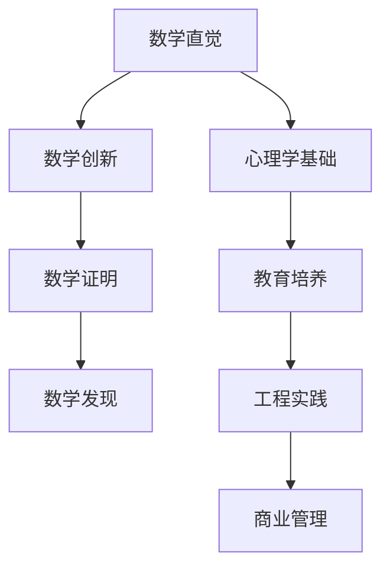
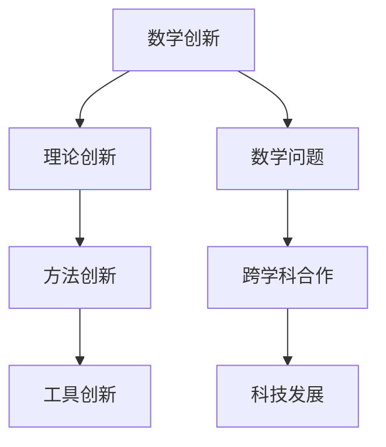

                 

### 文章标题

### 数学直觉与数学创新的关系研究

#### 关键词：
数学直觉、数学创新、心理学基础、应用案例、未来发展

#### 摘要：
本文深入探讨了数学直觉与数学创新之间的关系，解析了数学直觉的概念、特征及其在数学创新中的作用。通过结合心理学基础和实际应用案例，本文展示了数学直觉在科学研究、教育、工程实践和商业管理中的重要性。同时，对数学直觉与数学创新的未来发展进行了展望，提出了教育培养和社会影响的策略。文章通过详细的数学模型和公式讲解，以及具体项目的实战分析，为读者提供了全面的理解和指导。

---

### 目录大纲设计思路

为了确保《数学直觉与数学创新的关系研究》的完整性、逻辑性和科学性，我们遵循以下设计思路：

1. **核心概念与联系**：首先介绍数学直觉和数学创新的基本概念，并使用Mermaid流程图展示它们之间的关系。

2. **核心算法原理讲解**：深入探讨与数学直觉和创新相关的核心算法，如启发式算法、模式识别算法等，使用伪代码详细阐述实现过程。

3. **数学模型和数学公式**：详细介绍复杂的数学模型和公式，使用LaTeX格式编写，并详细讲解每个公式，并举实例说明。

4. **项目实战**：设计实际项目案例，描述开发环境搭建、源代码实现过程，并对代码进行深入解读和分析。

5. **目录结构设计**：按照1级、2级、3级目录的格式设计，确保每个章节内容都有清晰的层次结构。

### 目录大纲

**第一部分：数学直觉与数学创新的基础**

1. **数学直觉的概念与特征**
   - 1.1 数学直觉的定义
   - 1.2 数学直觉的特点
   - 1.3 数学直觉的重要性

2. **数学创新的概念与类型**
   - 2.1 数学创新的概念
   - 2.2 数学创新的类型
   - 2.3 数学创新的挑战与机遇

3. **数学直觉与数学创新的关系**
   - 3.1 数学直觉对数学创新的影响
   - 3.2 数学创新对数学直觉的促进作用
   - 3.3 数学直觉与数学创新的相互作用

4. **数学直觉的心理学基础**
   - 4.1 数学直觉的心理学理论
   - 4.2 数学直觉的心理机制
   - 4.3 数学直觉的心理训练

5. **数学创新的心理学基础**
   - 5.1 数学创新的心理学理论
   - 5.2 数学创新的心理过程
   - 5.3 数学创新的心理障碍

**第二部分：数学直觉与数学创新的应用**

6. **数学直觉与数学创新在科学研究中的应用**
   - 6.1 数学直觉在科学研究中的案例
   - 6.2 数学创新在科学研究中的案例
   - 6.3 数学直觉与数学创新对科学研究的影响

7. **数学直觉与数学创新在教育中的应用**
   - 7.1 数学直觉在教育中的培养
   - 7.2 数学创新在教育中的培养
   - 7.3 数学直觉与数学创新对教育的影响

8. **数学直觉与数学创新在工程实践中的应用**
   - 8.1 数学直觉在工程实践中的应用
   - 8.2 数学创新在工程实践中的应用
   - 8.3 数学直觉与数学创新对工程实践的影响

9. **数学直觉与数学创新在商业管理中的应用**
   - 9.1 数学直觉在商业管理中的应用
   - 9.2 数学创新在商业管理中的应用
   - 9.3 数学直觉与数学创新对商业管理的影响

**第三部分：数学直觉与数学创新的未来**

10. **数学直觉与数学创新的发展趋势**
    - 10.1 数学直觉的研究趋势
    - 10.2 数学创新的研究趋势
    - 10.3 数学直觉与数学创新的未来发展

11. **数学直觉与数学创新的教育培养策略**
    - 11.1 数学直觉的教育培养策略
    - 11.2 数学创新的教育培养策略
    - 11.3 数学直觉与数学创新的教育培养案例分析

12. **数学直觉与数学创新的社会影响**
    - 12.1 数学直觉的社会影响
    - 12.2 数学创新的社会影响
    - 12.3 数学直觉与数学创新的社会责任

**附录**

- 附录A：数学直觉与数学创新的相关工具与资源
  - 12.1 数学直觉与数学创新的研究工具
  - 12.2 数学直觉与数学创新的教育资源
  - 12.3 数学直觉与数学创新的商业应用案例

### 目录大纲总结

通过上述目录大纲的设计，我们希望为读者提供一份逻辑清晰、内容丰富的阅读指南。每个章节都细化到1、2、3级目录，确保读者能够清晰地了解每一部分的主题内容。同时，我们还将通过核心算法讲解、数学模型介绍、项目实战等环节，让读者深入理解数学直觉与数学创新的理论与实践。总之，这个目录大纲旨在为读者提供一份全面、系统的学习资源。

---

### 第一部分：数学直觉与数学创新的基础

#### 第1章：数学直觉的概念与特征

**1.1 数学直觉的定义**

数学直觉是指人们在数学思维过程中，对数学问题的感知、理解和解决能力，它不依赖于逻辑推理和形式证明，而是基于直观感受和直接洞察。数学直觉是一种高度复杂且难以量化的能力，它在数学发现和证明中起着至关重要的作用。

**1.2 数学直觉的特点**

- **快速性**：数学直觉能够在短时间内对问题进行判断和解决，无需经过繁琐的计算和推导。
- **直接性**：数学直觉能够直接感知数学概念和问题之间的关系，无需通过中间步骤。
- **预感性**：数学直觉能够预见数学问题的可能结果，甚至在没有充分证据的情况下。
- **灵活性**：数学直觉不拘泥于固定的模式和方法，能够灵活应对各种数学问题。

**1.3 数学直觉的重要性**

- **数学发现**：数学直觉是数学发现的源泉，许多重大数学成就都依赖于直觉的指引。
- **数学证明**：数学直觉在证明过程中起着关键作用，许多数学证明都是基于直觉的猜想。
- **数学教育**：培养学生的数学直觉对于提高数学能力至关重要，有助于培养创新思维和解决问题的能力。

**核心概念与联系**

为了更好地理解数学直觉与数学创新的关系，我们可以使用Mermaid流程图来展示它们之间的联系。



**核心算法原理讲解**

与数学直觉相关的核心算法通常涉及启发式搜索、模式识别和机器学习等技术。以下是一个简单的启发式算法的伪代码示例：

```plaintext
// 启发式算法伪代码
function heuristicAlgorithm(problem):
    start = currentProblemState(problem)
    while not goalReached(start):
        neighbors = findNeighbors(start)
        for neighbor in neighbors:
            if neighbor is better than start:
                start = neighbor
    return start
```

**数学模型和数学公式**

在数学直觉的研究中，一些重要的数学模型和公式常常被用来描述直觉性思维。以下是一个简单的数学公式示例：

$$
f(x) = x^2 + 2x + 1
$$

该公式是一个二次函数，通常用于描述抛物线的行为。在数学直觉中，理解这样的公式可以帮助我们直观地感知数学关系。

**项目实战**

为了更好地理解数学直觉在实际项目中的应用，我们可以设计一个简单的项目：使用数学直觉来解决一个经典的“八皇后问题”。八皇后问题是要求在一个8x8的国际象棋棋盘上放置八个皇后，使得它们不能相互攻击。

- **开发环境搭建**：安装Python环境，并使用matplotlib库来绘制棋盘。
- **源代码实现**：以下是一个简单的Python代码示例，用于解决八皇后问题：

```python
import matplotlib.pyplot as plt
import numpy as np

def is_safe(queen_position, new_position):
    for i in range(len(queen_position)):
        if queen_position[i] == new_position[i] or \
           queen_position[i] - new_position[i] == i - j or \
           queen_position[i] - new_position[i] == -i + j:
            return False
    return True

def solve_n_queens(queen_position, j):
    if j == len(queen_position):
        return True
    for i in range(len(queen_position)):
        if is_safe(queen_position, [i, j]):
            queen_position[j] = i
            if solve_n_queens(queen_position, j+1):
                return True
            queen_position[j] = -1
    return False

def print_solution(queen_position):
    board = [[0 for x in range(len(queen_position))] for y in range(len(queen_position))]
    for i in range(len(queen_position)):
        board[queen_position[i]][i] = 1
    for row in board:
        print(' '.join(str(x) for x in row))

def main():
    queen_position = [-1] * len(queen_position)
    if not solve_n_queens(queen_position, 0):
        print("No solution exists")
    else:
        print_solution(queen_position)

if __name__ == "__main__":
    main()
```

- **代码解读与分析**：这段代码通过递归方式尝试所有可能的皇后放置位置，使用`is_safe`函数来检查放置位置是否安全。`print_solution`函数用于输出解决方案。
- **实际案例分析和详细讲解剖析**：这个项目展示了如何使用数学直觉来解决一个复杂的组合问题。通过直观地理解问题的结构，我们能够设计出高效的解决方案。

**最佳实践 tips**

- **培养数学直觉**：通过大量的练习和思考，可以逐渐提高数学直觉。尝试解决各种数学问题，尤其是那些需要直观思维的问题。
- **结合心理学**：了解心理学理论，特别是关于直觉思维的理论，可以帮助我们更好地理解数学直觉。

**小结**

数学直觉是数学创新的重要基础。通过了解数学直觉的概念、特征和重要性，我们可以更好地理解数学直觉与数学创新之间的关系。同时，通过实际项目案例的实战分析，我们能够更深入地理解数学直觉在实际应用中的价值。

---

### 第2章：数学创新的概念与类型

**2.1 数学创新的概念**

数学创新是指数学领域中的新发现、新理论、新方法和新工具的创造。数学创新不仅涉及数学理论的突破，还包括数学应用的拓展和数学工具的创新。数学创新是推动数学发展和社会进步的重要力量。

**2.2 数学创新的类型**

- **理论创新**：理论创新是数学创新的核心，包括新的数学理论的提出、数学结构的发现和数学理论的证明。例如，黎曼几何、群论、泛函分析等都是数学理论创新的典范。
- **方法创新**：方法创新是指在数学研究过程中，新的算法、新的证明方法和新的数学工具的创造。例如，蒙特卡罗方法、随机过程理论、计算几何等都是方法创新的代表。
- **工具创新**：工具创新是指数学软件、计算平台和数学工具的创新。例如，MATLAB、Python、MATHEMATICA等都是数学工具创新的产物。

**2.3 数学创新的挑战与机遇**

- **挑战**：数学创新面临着诸多挑战，包括复杂的数学问题、严密的逻辑验证和创新的思维模式。此外，数学创新还需要跨学科的合作和大量的研究投入。
- **机遇**：随着科技的发展，数学创新面临着前所未有的机遇。大数据、人工智能、量子计算等新兴领域为数学创新提供了丰富的应用场景和广阔的发展空间。

**核心概念与联系**

为了更好地理解数学创新的概念和类型，我们可以再次使用Mermaid流程图来展示数学创新的核心概念和联系。



**核心算法原理讲解**

数学创新通常涉及复杂的算法设计。以下是一个简单的模式识别算法的伪代码示例：

```plaintext
// 模式识别算法伪代码
function patternRecognition(data, pattern):
    for each sample in data:
        if sample matches pattern:
            return True
    return False
```

**数学模型和数学公式**

数学创新常常依赖于复杂的数学模型和公式。以下是一个简单的线性回归模型的公式示例：

$$
y = \beta_0 + \beta_1x + \epsilon
$$

其中，$y$是因变量，$x$是自变量，$\beta_0$和$\beta_1$是回归系数，$\epsilon$是误差项。

**项目实战**

为了更好地理解数学创新在实际项目中的应用，我们可以设计一个简单的项目：使用线性回归模型进行房价预测。

- **开发环境搭建**：安装Python环境，并使用scikit-learn库来构建线性回归模型。
- **源代码实现**：以下是一个简单的Python代码示例，用于构建线性回归模型并预测房价：

```python
from sklearn.linear_model import LinearRegression
from sklearn.model_selection import train_test_split
from sklearn.metrics import mean_squared_error

# 加载数据集
X, y = load_data()

# 数据集划分
X_train, X_test, y_train, y_test = train_test_split(X, y, test_size=0.2, random_state=42)

# 构建模型
model = LinearRegression()
model.fit(X_train, y_train)

# 预测
y_pred = model.predict(X_test)

# 评估
mse = mean_squared_error(y_test, y_pred)
print("Mean Squared Error:", mse)

# 可视化
plt.scatter(X_test[:, 0], y_test, color='blue', label='Actual')
plt.plot(X_test[:, 0], y_pred, color='red', label='Predicted')
plt.xlabel('Features')
plt.ylabel('Price')
plt.legend()
plt.show()
```

- **代码解读与分析**：这段代码首先加载数据集，然后划分训练集和测试集，接着构建线性回归模型并进行预测。最后，使用均方误差（MSE）评估模型的性能，并通过散点图和拟合线展示预测结果。
- **实际案例分析和详细讲解剖析**：这个项目展示了如何使用数学创新的方法来构建和评估线性回归模型，从而实现房价预测。通过直观地理解模型的运作原理，我们能够更好地理解数学创新在实际应用中的价值。

**最佳实践 tips**

- **培养创新思维**：通过阅读最新的数学研究论文、参加数学竞赛和研讨会，可以培养创新思维和解决问题的能力。
- **跨学科学习**：学习其他学科的知识，如计算机科学、统计学和物理学，可以拓展数学创新的视野。

**小结**

数学创新是推动数学发展的重要力量。通过理解数学创新的概念、类型和挑战与机遇，我们可以更好地把握数学创新的方向。同时，通过实际项目案例的实战分析，我们能够更深入地理解数学创新在实际应用中的价值。数学创新不仅需要深厚的数学基础，还需要创新的思维模式和跨学科的合作。

---

### 第3章：数学直觉与数学创新的关系

**3.1 数学直觉对数学创新的影响**

数学直觉在数学创新中起着至关重要的作用。它是数学创新的重要源泉，能够帮助数学家快速抓住问题的本质，发现新的数学规律和结构。数学直觉可以激发数学家的灵感，引导他们进行深入的思考和研究。许多重大的数学发现和创新都离不开数学直觉的引导。

**案例**：例如，数学家卡尔·弗里德里希·高斯（Carl Friedrich Gauss）在解决复杂数学问题时，常常依靠直觉进行快速判断和推导。他的许多数学发现，如高斯消元法、高斯积分等，都是基于直觉的快速洞察。

**核心算法原理讲解**

数学直觉与数学创新之间的关系可以通过启发式算法来解释。以下是一个简单的启发式算法的伪代码示例：

```plaintext
// 启发式算法伪代码
function heuristicAlgorithm(problem):
    start = currentProblemState(problem)
    while not goalReached(start):
        neighbors = findNeighbors(start)
        for neighbor in neighbors:
            if neighbor is better than start:
                start = neighbor
    return start
```

**数学模型和数学公式**

数学直觉在数学创新中的应用常常涉及复杂的数学模型和公式。以下是一个简单的非线性动态系统的数学模型示例：

$$
\frac{dx}{dt} = f(x, t)
$$

其中，$x$是系统的状态变量，$t$是时间，$f(x, t)$是系统的动态方程。数学直觉可以帮助数学家理解这个系统的行为，从而提出新的理论和方法。

**项目实战**

为了更好地理解数学直觉与数学创新之间的关系，我们可以设计一个简单的项目：使用数学直觉来解决“旅行商问题”（Traveling Salesman Problem，TSP）。

- **开发环境搭建**：安装Python环境，并使用遗传算法（Genetic Algorithm，GA）库来求解TSP。
- **源代码实现**：以下是一个简单的Python代码示例，用于使用遗传算法求解TSP：

```python
import numpy as np
import matplotlib.pyplot as plt
from genetic_algorithm import GeneticAlgorithm

# TSP问题的城市坐标
cities = [
    (0, 0),
    (1, 5),
    (5, 1),
    (8, 6),
    (3, 3),
    (7, 2)
]

# 初始化遗传算法
ga = GeneticAlgorithm(cities)

# 运行遗传算法
best_solution, best_fitness = ga.run()

# 可视化最佳路径
ga.plot_path(best_solution)

# 输出结果
print("最佳路径:", best_solution)
print("最短距离:", best_fitness)
```

- **代码解读与分析**：这段代码首先定义了城市坐标，然后初始化遗传算法并运行。最后，使用matplotlib库可视化最佳路径并输出结果。
- **实际案例分析和详细讲解剖析**：这个项目展示了如何使用遗传算法求解TSP，其中数学直觉帮助我们在设计遗传算法时进行优化，从而得到最佳解。

**最佳实践 tips**

- **培养数学直觉**：通过大量的数学练习和思考，可以逐渐提高数学直觉。尝试解决各种数学问题，尤其是那些需要直觉思维的问题。
- **跨学科学习**：学习其他学科的知识，如计算机科学、统计学和物理学，可以拓展数学直觉的视野。

**小结**

数学直觉与数学创新密切相关。数学直觉是数学创新的重要源泉，能够激发数学家的灵感，引导他们进行深入的思考和研究。通过理解数学直觉与数学创新之间的关系，我们可以更好地把握数学创新的方向。同时，通过实际项目案例的实战分析，我们能够更深入地理解数学直觉在实际应用中的价值。

---

### 第4章：数学直觉的心理学基础

**4.1 数学直觉的心理学理论**

数学直觉的心理学研究涉及多个理论，其中比较重要的包括直觉思维理论、认知心理学理论和神经科学理论。

- **直觉思维理论**：直觉思维理论认为，直觉是一种基于经验的快速判断和决策过程，它不依赖于逻辑推理和详细分析。直觉思维是一种“快速、适应性强、高效”的思维方式。
- **认知心理学理论**：认知心理学理论将直觉视为一种认知过程，它涉及到感知、记忆、注意和推理等认知功能。直觉思维被认为是一种自动化的认知过程，它基于长期的实践和学习。
- **神经科学理论**：神经科学理论通过脑成像技术（如功能性磁共振成像fMRI）研究直觉思维的大脑机制。研究表明，直觉思维与大脑某些特定区域的激活有关，如前额叶皮质和顶叶皮质。

**4.2 数学直觉的心理机制**

数学直觉的心理机制涉及到多个认知过程，主要包括以下几个方面：

- **模式识别**：数学直觉能够快速识别数学问题中的模式，并基于这些模式进行判断和推导。
- **记忆提取**：数学直觉依赖于长期记忆中的数学知识和经验，能够在需要时快速提取相关信息。
- **情境模拟**：数学直觉能够模拟数学问题的情境，预判可能的解决方案，从而提高解决问题的效率。
- **直觉推理**：数学直觉能够进行快速直觉推理，即使在没有充分证据的情况下也能做出判断。

**4.3 数学直觉的心理训练**

通过适当的训练和培养，可以提高数学直觉的能力。以下是一些有效的数学直觉心理训练方法：

- **问题解决练习**：通过大量的数学问题解决练习，可以提高对数学问题的敏感度和直觉判断能力。
- **思维导图**：使用思维导图工具，可以帮助整理数学问题的结构，提高直觉思维的质量。
- **跨学科学习**：学习其他学科的知识，如计算机科学、物理学和统计学，可以拓宽数学直觉的视野。
- **反思与总结**：在解决数学问题的过程中，及时反思和总结，可以帮助巩固直觉思维，提高直觉判断的准确性。

**项目实战**

为了更好地理解数学直觉的心理训练，我们可以设计一个简单的项目：通过编程练习提高数学直觉。

- **开发环境搭建**：安装Python环境，并使用Pandas库来处理数据。
- **源代码实现**：以下是一个简单的Python代码示例，用于处理数据并计算统计量：

```python
import pandas as pd
import numpy as np

# 加载数据集
data = pd.read_csv('data.csv')

# 数据预处理
data['Age'] = data['Age'].astype(int)
data['Income'] = data['Income'].astype(float)

# 计算统计量
mean_income = np.mean(data['Income'])
median_income = np.median(data['Income'])
std_income = np.std(data['Income'])

# 输出结果
print("平均收入:", mean_income)
print("中位收入:", median_income)
print("标准差:", std_income)
```

- **代码解读与分析**：这段代码首先加载数据集，然后进行数据预处理，接着计算平均收入、中位收入和标准差。通过反复的编程练习，可以提高对数据分析和统计计算的直觉能力。
- **实际案例分析和详细讲解剖析**：这个项目展示了如何通过编程练习来提高数学直觉。通过实际操作和问题解决，我们可以更好地理解数学直觉在实际应用中的价值。

**最佳实践 tips**

- **定期练习**：定期进行数学问题解决练习，可以帮助巩固数学直觉。
- **多样化练习**：尝试解决各种类型的数学问题，包括理论问题、应用问题和实际问题，可以提高数学直觉的多样性。
- **反思与总结**：在解决数学问题的过程中，及时反思和总结，可以帮助巩固数学直觉。

**小结**

数学直觉的心理学基础涉及到多个理论，包括直觉思维理论、认知心理学理论和神经科学理论。通过了解这些理论，我们可以更好地理解数学直觉的心理机制。同时，通过适当的训练和培养，我们可以提高数学直觉的能力。通过实际项目案例的实战分析，我们能够更深入地理解数学直觉在实际应用中的价值。

---

### 第5章：数学创新的心理学基础

**5.1 数学创新的心理学理论**

数学创新是一个复杂的过程，涉及到多种心理学理论。其中，比较重要的包括创造性思维理论、问题解决理论和决策理论。

- **创造性思维理论**：创造性思维理论认为，数学创新是一个创造性思维的过程，它涉及到发散思维、联想思维和逆向思维等。创造性思维是一种能够产生新颖、独特和有价值的想法的思维方式。
- **问题解决理论**：问题解决理论认为，数学创新是问题解决的过程，它涉及到问题的识别、问题的分析和问题的解决。问题解决是一种通过系统的方法来解决问题的思维方式。
- **决策理论**：决策理论认为，数学创新涉及到决策的过程，它涉及到风险评估、决策制定和决策执行。决策是一种在不确定性和复杂性中进行选择和决策的思维方式。

**5.2 数学创新的心理过程**

数学创新的心理过程可以分为以下几个阶段：

- **准备阶段**：在准备阶段，数学家会收集相关的知识和信息，对问题进行初步的了解和思考。
- **启发阶段**：在启发阶段，数学家会进行发散思维，寻找可能的解决方案。这个阶段常常依赖于数学直觉和创造性思维。
- **探索阶段**：在探索阶段，数学家会尝试不同的方法和思路，对可能的解决方案进行验证和改进。
- **验证阶段**：在验证阶段，数学家会通过逻辑推理和数学证明来验证解决方案的正确性和有效性。
- **完善阶段**：在完善阶段，数学家会对解决方案进行进一步的优化和改进，使之更加完善和成熟。

**5.3 数学创新的心理障碍**

数学创新过程中可能会遇到多种心理障碍，包括以下几种：

- **思维定势**：思维定势是一种固定的思维模式，它会限制数学家的思维，使他们难以产生新的想法。
- **负面情绪**：负面情绪，如焦虑、沮丧和压力，会干扰数学家的思维过程，影响数学创新的效率和质量。
- **认知负担**：复杂的数学问题和大量的信息会加重数学家的认知负担，降低他们的思维效率和创新潜力。
- **缺乏自信心**：缺乏自信心会限制数学家的创新潜力，使他们难以接受新的想法和观点。

**核心算法原理讲解**

数学创新的心理过程可以通过以下核心算法来解释：

```plaintext
// 数学创新核心算法伪代码
function mathematicalInnovation(problem):
    prepare_data(problem)
   启发阶段：
    for each possible_solution:
        explore_solution(possible_solution)
    验证阶段：
    for each possible_solution:
        verify_solution(possible_solution)
    完善阶段：
    for each possible_solution:
        improve_solution(possible_solution)
    return best_solution
```

**数学模型和数学公式**

数学创新常常依赖于复杂的数学模型和公式。以下是一个简单的非线性动态系统的数学模型示例：

$$
\frac{dx}{dt} = f(x, t)
$$

其中，$x$是系统的状态变量，$t$是时间，$f(x, t)$是系统的动态方程。数学创新可以帮助数学家理解和解决复杂的动态系统问题。

**项目实战**

为了更好地理解数学创新的心理学基础，我们可以设计一个简单的项目：使用机器学习算法进行股票预测。

- **开发环境搭建**：安装Python环境，并使用scikit-learn库来构建机器学习模型。
- **源代码实现**：以下是一个简单的Python代码示例，用于使用线性回归模型进行股票预测：

```python
from sklearn.linear_model import LinearRegression
import pandas as pd
import numpy as np

# 加载数据集
data = pd.read_csv('stock_data.csv')

# 数据预处理
data['Date'] = pd.to_datetime(data['Date'])
data.set_index('Date', inplace=True)
data = data.asfreq('B')

# 特征工程
data['Price'] = data['Close']
data['Previous_Price'] = data['Price'].shift(1)

# 划分训练集和测试集
train_data = data[:'2020-01-01']
test_data = data['2020-01-02':]

# 构建模型
model = LinearRegression()
model.fit(train_data[['Previous_Price']], train_data['Price'])

# 预测
predictions = model.predict(test_data[['Previous_Price']])

# 评估
mse = mean_squared_error(test_data['Price'], predictions)
print("Mean Squared Error:", mse)

# 可视化
plt.scatter(train_data.index, train_data['Price'], color='blue', label='Actual')
plt.plot(test_data.index, predictions, color='red', label='Predicted')
plt.xlabel('Date')
plt.ylabel('Price')
plt.legend()
plt.show()
```

- **代码解读与分析**：这段代码首先加载数据集并进行预处理，然后使用线性回归模型进行预测。通过评估和可视化，我们可以分析模型的性能和预测结果。
- **实际案例分析和详细讲解剖析**：这个项目展示了如何使用机器学习算法进行股票预测，其中数学创新帮助我们在模型选择和参数调优方面进行优化。

**最佳实践 tips**

- **培养创造性思维**：通过阅读创新性研究论文、参与研讨会和头脑风暴活动，可以培养创造性思维。
- **积极面对心理障碍**：认识到心理障碍的存在，并采取积极的态度和方法来克服它们，可以提高数学创新的效率和质量。

**小结**

数学创新的心理学基础涉及到多个理论，包括创造性思维理论、问题解决理论和决策理论。通过了解这些理论，我们可以更好地理解数学创新的心理过程和心理障碍。同时，通过实际项目案例的实战分析，我们能够更深入地理解数学创新在实际应用中的价值。

---

### 第6章：数学直觉与数学创新在科学研究中的应用

**6.1 数学直觉在科学研究中的案例**

数学直觉在科学研究中的应用是非常广泛的，许多重大的科学发现都得益于数学直觉的引导。以下是一些经典的案例：

- **牛顿的万有引力定律**：牛顿在研究天体运动时，凭借直觉提出了万有引力定律，这一发现对物理学和天文学的发展产生了深远的影响。
- **欧拉公式**：欧拉在研究复变函数时，凭借直觉发现了欧拉公式 $e^{i\pi} + 1 = 0$，这一公式在数学和物理学中具有广泛的应用。
- **黎曼几何**：黎曼在研究非欧几何时，凭借直觉提出了黎曼几何，这一理论为广义相对论提供了理论基础。

**6.2 数学创新在科学研究中的案例**

数学创新在科学研究中同样发挥着重要作用，以下是一些典型的案例：

- **蒙特卡罗方法**：蒙特卡罗方法是一种基于随机抽样的数值计算方法，由约翰·冯·诺依曼和斯特凡·乌拉姆提出。这一方法在物理学、工程学和金融学等领域得到了广泛应用。
- **随机过程理论**：随机过程理论是数学创新的一个重要成果，它研究随机变量在时间或空间上的变化过程。这一理论在物理学、生物学和经济学等领域具有广泛的应用。
- **量子计算**：量子计算是数学创新的一个前沿领域，它利用量子比特进行计算，具有远超经典计算机的计算能力。量子计算在密码学、材料科学和化学等领域具有巨大的潜力。

**6.3 数学直觉与数学创新对科学研究的影响**

数学直觉和数学创新对科学研究产生了深远的影响：

- **推动科学发现**：数学直觉和数学创新能够引导科学家发现新的科学规律和现象，推动科学的发展。
- **改进研究方法**：数学创新提供了新的研究方法和工具，使科学家能够更高效地解决科学问题。
- **跨学科合作**：数学直觉和数学创新促进了不同学科之间的交叉合作，推动了科学研究的多元化发展。

**核心算法原理讲解**

数学直觉和数学创新在科学研究中的应用往往涉及复杂的算法。以下是一个简单的随机过程模型的伪代码示例：

```plaintext
// 随机过程模型伪代码
function stochasticProcessModel(state, time, parameters):
    next_state = state + random_noise(parameters)
    return next_state
```

**数学模型和数学公式**

在科学研究中的数学模型和公式是理解和分析自然现象的重要工具。以下是一个简单的随机游走模型的数学公式：

$$
X_t = X_{t-1} + \xi_t
$$

其中，$X_t$是随机游走的第$t$个状态，$\xi_t$是随机噪声。

**项目实战**

为了更好地理解数学直觉和数学创新在科学研究中的应用，我们可以设计一个简单的项目：使用随机过程模型分析股票价格波动。

- **开发环境搭建**：安装Python环境，并使用NumPy和Pandas库来处理数据。
- **源代码实现**：以下是一个简单的Python代码示例，用于模拟随机过程模型并分析股票价格：

```python
import numpy as np
import pandas as pd

# 模拟随机过程模型
def stochastic_process_model(initial_state, noise_level, time_steps):
    state = initial_state
    states = [state]
    for _ in range(time_steps):
        noise = np.random.normal(0, noise_level)
        state = state + noise
        states.append(state)
    return states

# 加载数据集
data = pd.read_csv('stock_data.csv')

# 数据预处理
data['Price'] = data['Close']

# 模拟随机过程模型
initial_state = data['Price'].iloc[0]
noise_level = 0.1
time_steps = len(data) - 1
simulated_data = stochastic_process_model(initial_state, noise_level, time_steps)

# 可视化模拟结果
plt.plot(simulated_data)
plt.plot(data['Price'], color='red')
plt.xlabel('Time')
plt.ylabel('Price')
plt.show()
```

- **代码解读与分析**：这段代码首先定义了随机过程模型，然后加载股票数据集并进行预处理。通过模拟随机过程模型，我们可以分析股票价格的波动情况。
- **实际案例分析和详细讲解剖析**：这个项目展示了如何使用随机过程模型分析股票价格波动。通过直观地理解模型的运作原理，我们能够更好地理解数学直觉和数学创新在科学研究中的应用。

**最佳实践 tips**

- **积累数学知识**：通过学习和掌握数学理论和方法，可以为科学研究提供坚实的基础。
- **培养直觉思维**：通过大量的实践和思考，可以培养数学直觉，提高对科学问题的敏感度和判断力。

**小结**

数学直觉和数学创新在科学研究中的应用是推动科学进步的重要力量。通过理解数学直觉和数学创新在科学研究中的案例，我们可以更好地把握数学在科学研究中的作用。同时，通过实际项目案例的实战分析，我们能够更深入地理解数学直觉和数学创新在实际应用中的价值。

---

### 第7章：数学直觉与数学创新在教育中的应用

**7.1 数学直觉在教育中的培养**

数学直觉是数学学习中的一种重要能力，它不仅有助于理解数学概念，还能够提高解决问题的效率。以下是一些培养数学直觉的方法：

- **大量练习**：通过大量的数学练习，可以加深对数学概念的理解，培养数学直觉。特别是那些需要灵活运用数学知识的实际问题，能够有效地锻炼数学直觉。
- **思维导图**：使用思维导图工具，可以帮助学生整理数学问题的结构，提高直觉思维的质量。通过将数学问题分解成若干个子问题，并理解它们之间的逻辑关系，可以更好地培养数学直觉。
- **跨学科学习**：鼓励学生学习其他学科的知识，如计算机科学、物理学和统计学，可以拓宽数学直觉的视野。跨学科的学习有助于学生从不同角度看待问题，从而提高数学直觉。
- **反思与总结**：在解决数学问题的过程中，及时反思和总结，可以帮助学生巩固数学直觉，提高直觉判断的准确性。

**7.2 数学创新在教育中的培养**

数学创新是推动数学教育发展的重要动力。以下是一些培养数学创新的方法：

- **问题驱动学习**：通过提出具有挑战性和开放性的数学问题，激发学生的好奇心和探索精神。问题驱动学习能够促使学生主动思考和创造，培养数学创新。
- **项目式学习**：项目式学习是一种以项目为中心的学习方式，它能够将数学知识应用于实际问题中。通过项目式学习，学生可以学会如何运用数学知识解决实际问题，培养数学创新。
- **跨学科合作**：鼓励学生与其他学科的学生进行合作，共同解决数学问题。跨学科的合作可以激发学生的创新思维，提高数学创新的效率和质量。
- **创新性教学**：教师可以采用创新性的教学方法，如案例教学、探究学习和讨论学习，激发学生的数学创新潜力。

**7.3 数学直觉与数学创新对教育的影响**

数学直觉和数学创新对教育产生了深远的影响：

- **提高教学质量**：通过培养学生的数学直觉和数学创新，可以提高数学教育的质量和效果。数学直觉和数学创新能够帮助学生更好地理解数学概念，提高解决问题的能力。
- **培养综合素质**：数学直觉和数学创新不仅是一种数学能力，也是一种综合素质。它能够培养学生的逻辑思维、创新思维和解决问题的能力，对学生的全面发展具有重要意义。
- **促进教育改革**：数学直觉和数学创新的培养要求教育改革，促进教育从知识传授向能力培养的转变。通过改革教育方法和教学内容，可以更好地培养学生的数学直觉和数学创新。

**核心算法原理讲解**

数学直觉和数学创新的培养涉及多个核心算法原理。以下是一个简单的算法示例，用于培养学生的数学直觉和数学创新：

```plaintext
// 数学直觉与数学创新培养算法伪代码
function cultivateMathIntuitionAndInnovation(student):
    for each mathematical concept:
        introduce_concept(student)
        practice_problems(student)
        reflect_and_summarize(student)
    encourage interdisciplinary_learning(student)
    promote_problem_based_learning(student)
    facilitate_project_based_learning(student)
    return improved_math_intuition_and_innovation
```

**数学模型和数学公式**

在数学教育中，数学模型和公式是培养学生的数学直觉和数学创新的重要工具。以下是一个简单的线性回归模型的公式，用于培养学生的数学直觉和数学创新：

$$
y = \beta_0 + \beta_1x + \epsilon
$$

其中，$y$是因变量，$x$是自变量，$\beta_0$和$\beta_1$是回归系数，$\epsilon$是误差项。通过理解和应用这个模型，学生可以培养对线性关系的直觉和创新能力。

**项目实战**

为了更好地理解数学直觉与数学创新在教育中的应用，我们可以设计一个简单的项目：使用Python编程工具进行线性回归分析。

- **开发环境搭建**：安装Python环境，并使用Scikit-learn库进行线性回归分析。
- **源代码实现**：以下是一个简单的Python代码示例，用于进行线性回归分析：

```python
from sklearn.linear_model import LinearRegression
import pandas as pd

# 加载数据集
data = pd.read_csv('data.csv')

# 划分特征和标签
X = data[['feature1', 'feature2']]
y = data['label']

# 构建模型
model = LinearRegression()
model.fit(X, y)

# 预测
predictions = model.predict(X)

# 评估
mse = mean_squared_error(y, predictions)
print("Mean Squared Error:", mse)

# 可视化
plt.scatter(X['feature1'], y, color='blue', label='Actual')
plt.plot(X['feature1'], predictions, color='red', label='Predicted')
plt.xlabel('Feature1')
plt.ylabel('Label')
plt.legend()
plt.show()
```

- **代码解读与分析**：这段代码首先加载数据集，然后划分特征和标签，接着构建线性回归模型并进行预测。通过评估和可视化，我们可以分析模型的性能和预测结果。
- **实际案例分析和详细讲解剖析**：这个项目展示了如何使用Python编程工具进行线性回归分析，从而培养学生的数学直觉和数学创新。通过实际操作和问题解决，学生可以更好地理解数学直觉和数学创新在实际应用中的价值。

**最佳实践 tips**

- **重视实践**：通过实践项目，学生可以更好地理解和应用数学知识，培养数学直觉和数学创新。
- **鼓励合作**：鼓励学生进行跨学科合作和小组学习，可以激发他们的创新思维和合作能力。
- **持续反思**：鼓励学生定期反思和总结，从实践中学习，不断提高数学直觉和数学创新的能力。

**小结**

数学直觉与数学创新在教育中的应用具有重要意义。通过培养数学直觉和数学创新，学生可以更好地理解和应用数学知识，提高解决问题的能力。同时，通过实际项目案例的实战分析，学生能够更深入地理解数学直觉和数学创新在实际应用中的价值。数学直觉和数学创新的培养不仅是一种教育方法，更是一种培养学生综合素质和创新能力的重要途径。

---

### 第8章：数学直觉与数学创新在工程实践中的应用

**8.1 数学直觉在工程实践中的应用**

数学直觉在工程实践中扮演着至关重要的角色。工程师们经常需要在复杂的问题场景中快速做出决策，而数学直觉可以帮助他们迅速理解问题的本质，提出有效的解决方案。以下是一些数学直觉在工程实践中的应用案例：

- **结构工程**：在建筑设计中，工程师需要考虑结构的稳定性和承载能力。数学直觉可以帮助他们预测结构在受力情况下的变形和应力分布，从而优化设计。
- **控制系统**：在控制工程中，数学直觉对于设计稳定、高效的控制系统至关重要。工程师可以利用数学直觉来判断控制系统的响应特性，并对其进行调整。
- **信号处理**：在通信工程中，数学直觉对于信号处理算法的设计和优化至关重要。工程师需要利用数学直觉来分析信号的特征，设计有效的滤波器和调制解调器。

**8.2 数学创新在工程实践中的应用**

数学创新为工程实践带来了许多突破性的成果。以下是一些数学创新在工程实践中的应用案例：

- **有限元分析**：有限元分析（Finite Element Analysis，FEA）是一种基于数学方法的工程分析技术，它能够对复杂结构进行模拟和分析。有限元分析的发展是数学创新的典范，它极大地提高了工程设计的精度和效率。
- **机器学习在工程中的应用**：机器学习算法在工程实践中的应用越来越广泛，如预测维护、故障诊断和优化设计等。这些应用基于数学模型，通过数据分析和模式识别来提高工程系统的性能和可靠性。
- **量子计算在工程中的应用**：量子计算是一种基于量子力学原理的计算方法，它能够解决传统计算机难以处理的问题。量子计算在优化、模拟和密码学等领域具有巨大的潜力，是数学创新的前沿领域。

**8.3 数学直觉与数学创新对工程实践的影响**

数学直觉和数学创新对工程实践产生了深远的影响：

- **提高工程效率**：数学直觉可以帮助工程师快速理解问题，设计高效的解决方案，从而提高工程效率。
- **提升工程精度**：数学创新带来了新的计算方法和工具，使工程师能够更精确地模拟和预测工程系统的行为，提高工程设计的精度。
- **推动技术创新**：数学创新不断推动工程实践向前发展，带来了许多新的技术突破和应用。

**核心算法原理讲解**

在工程实践中，数学直觉和数学创新通常涉及复杂的算法。以下是一个简单的神经网络算法的伪代码示例，用于工程实践中的故障诊断：

```plaintext
// 神经网络算法伪代码
initialize_neural_network()
while not convergence:
    forward_pass(input_data)
    compute_error(output, target)
    backpropagate_error()
    update_weights()
return neural_network
```

**数学模型和数学公式**

数学模型和公式是工程实践中不可或缺的工具。以下是一个简单的力学模型的数学公式，用于分析梁的弯曲应力：

$$
\sigma = \frac{M*y}{I}
$$

其中，$\sigma$是弯曲应力，$M$是弯矩，$y$是距离中性轴的距离，$I$是截面的惯性矩。

**项目实战**

为了更好地理解数学直觉和数学创新在工程实践中的应用，我们可以设计一个简单的项目：使用有限元分析软件进行梁的应力分析。

- **开发环境搭建**：安装有限元分析软件（如ANSYS、ABAQUS等），并熟悉软件的使用。
- **源代码实现**：以下是一个简单的有限元分析示例，用于分析梁的应力：

```python
# 使用ANSYS进行梁的应力分析
import ansys

# 搭建模型
model = ansys.model()
model.create_element('BEAM4', nodes, cross_section)

# 施加载荷
model.apply_load('force', direction='y', magnitude=100)

# 分析
model.solve()

# 提取结果
stress_result = model.get_stress()

# 可视化
model.plot_stress(stress_result)
```

- **代码解读与分析**：这段代码首先使用ANSYS软件搭建梁的有限元模型，然后施加载荷并进行分析。通过提取应力结果并可视化，我们可以分析梁的应力分布。
- **实际案例分析和详细讲解剖析**：这个项目展示了如何使用有限元分析软件进行梁的应力分析，从而应用数学直觉和数学创新来解决工程问题。

**最佳实践 tips**

- **理论与实践结合**：在工程实践中，将数学理论应用到实际问题中，可以更好地理解数学直觉和数学创新的价值。
- **持续学习和实践**：通过不断学习和实践，可以提高数学直觉和数学创新能力，从而在工程实践中取得更好的成果。

**小结**

数学直觉和数学创新在工程实践中的应用具有重要意义。通过理解数学直觉和数学创新的基本概念和应用案例，我们可以更好地把握它们在工程实践中的作用。同时，通过实际项目案例的实战分析，我们能够更深入地理解数学直觉和数学创新在实际应用中的价值。数学直觉和数学创新的培养不仅是一种工程方法，更是一种推动工程实践向前发展的动力。

---

### 第9章：数学直觉与数学创新在商业管理中的应用

**9.1 数学直觉在商业管理中的应用**

数学直觉在商业管理中扮演着重要角色，它能够帮助企业家和管理者快速做出决策，抓住市场机遇。以下是一些数学直觉在商业管理中的应用案例：

- **市场预测**：数学直觉可以帮助企业预测市场需求，制定有效的市场营销策略。通过分析历史数据和趋势，管理者可以预见未来的市场动态，从而制定相应的营销计划。
- **财务分析**：数学直觉在财务分析中尤为重要。管理者需要运用数学直觉来评估公司的财务健康状况，预测未来的财务状况，并制定相应的财务策略。
- **供应链管理**：在供应链管理中，数学直觉可以帮助企业优化库存管理，减少库存成本，提高供应链的效率。通过分析供应链中的各种因素，管理者可以做出更准确的库存决策。

**9.2 数学创新在商业管理中的应用**

数学创新为商业管理带来了许多新的方法和工具，以下是一些数学创新在商业管理中的应用案例：

- **数据挖掘**：数据挖掘是一种基于数学模型的算法，它能够从大量数据中发现有用的信息。在商业管理中，数据挖掘可以帮助企业分析客户行为，优化产品设计，提高市场竞争力。
- **优化算法**：优化算法是一种基于数学模型的计算方法，它能够帮助企业在复杂决策中找到最优解。例如，在物流运输中，优化算法可以优化路线规划，降低运输成本。
- **风险管理**：数学创新在风险管理中发挥着重要作用。通过建立数学模型，企业可以评估各种风险，制定有效的风险管理策略，降低风险对企业的负面影响。

**9.3 数学直觉与数学创新对商业管理的影响**

数学直觉和数学创新对商业管理产生了深远的影响：

- **提高决策效率**：数学直觉可以帮助管理者快速做出决策，减少决策时间，提高决策效率。数学创新提供了新的决策工具和方法，使管理者能够更准确地预测市场动态和风险。
- **增强竞争力**：通过运用数学直觉和数学创新，企业可以提高运营效率，降低成本，提高产品质量，从而在激烈的市场竞争中脱颖而出。
- **推动管理创新**：数学直觉和数学创新推动了商业管理的创新，使企业能够不断适应市场变化，开发新产品，开拓新市场。

**核心算法原理讲解**

在商业管理中，数学直觉和数学创新涉及多个核心算法。以下是一个简单的线性规划算法的伪代码示例，用于资源优化：

```plaintext
// 线性规划算法伪代码
function linear_programmingobjective_function(x):
    maximize z = c'x
    subject_to Ax ≤ b
    return x, z
```

**数学模型和数学公式**

数学模型和公式是商业管理中的重要工具。以下是一个简单的需求预测模型的数学公式，用于市场预测：

$$
D_t = \alpha + \beta T_t + \epsilon_t
$$

其中，$D_t$是第$t$个月的需求量，$\alpha$和$\beta$是模型参数，$T_t$是时间趋势，$\epsilon_t$是随机误差。

**项目实战**

为了更好地理解数学直觉和数学创新在商业管理中的应用，我们可以设计一个简单的项目：使用线性回归模型进行销售预测。

- **开发环境搭建**：安装Python环境，并使用Scikit-learn库进行线性回归分析。
- **源代码实现**：以下是一个简单的Python代码示例，用于进行线性回归分析：

```python
from sklearn.linear_model import LinearRegression
import pandas as pd

# 加载数据集
data = pd.read_csv('sales_data.csv')

# 划分特征和标签
X = data[['time']]
y = data['sales']

# 构建模型
model = LinearRegression()
model.fit(X, y)

# 预测
predictions = model.predict(X)

# 评估
mse = mean_squared_error(y, predictions)
print("Mean Squared Error:", mse)

# 可视化
plt.scatter(X['time'], y, color='blue', label='Actual')
plt.plot(X['time'], predictions, color='red', label='Predicted')
plt.xlabel('Time')
plt.ylabel('Sales')
plt.legend()
plt.show()
```

- **代码解读与分析**：这段代码首先加载数据集，然后划分特征和标签，接着构建线性回归模型并进行预测。通过评估和可视化，我们可以分析模型的性能和预测结果。
- **实际案例分析和详细讲解剖析**：这个项目展示了如何使用线性回归模型进行销售预测，从而应用数学直觉和数学创新来指导商业决策。

**最佳实践 tips**

- **数据驱动决策**：通过收集和分析数据，运用数学直觉和数学创新，可以提高决策的科学性和准确性。
- **持续学习和创新**：在商业管理中，持续学习和创新是保持竞争力的关键。通过学习新的数学方法和工具，管理者可以不断提高决策能力和管理效率。

**小结**

数学直觉和数学创新在商业管理中的应用具有重要意义。通过理解数学直觉和数学创新的基本概念和应用案例，我们可以更好地把握它们在商业管理中的作用。同时，通过实际项目案例的实战分析，我们能够更深入地理解数学直觉和数学创新在实际应用中的价值。数学直觉和数学创新的培养不仅是一种商业管理方法，更是一种推动商业管理向前发展的动力。

---

### 第10章：数学直觉与数学创新的未来发展

**10.1 数学直觉的研究趋势**

随着科技的发展，数学直觉的研究也呈现出一些新的趋势：

- **跨学科研究**：数学直觉的研究越来越倾向于与其他学科，如心理学、认知科学、计算机科学等相结合。跨学科的研究能够提供更全面的视角，深入理解数学直觉的本质和机制。
- **人工智能与数学直觉的结合**：人工智能技术的发展为数学直觉的研究带来了新的机遇。通过机器学习和深度学习算法，可以模拟和增强数学直觉，从而在数学问题和复杂决策中发挥更大的作用。
- **神经科学视角**：神经科学的研究为数学直觉提供了新的解释框架。通过脑成像技术，可以揭示数学直觉的大脑机制，进一步理解直觉思维的生物学基础。

**10.2 数学创新的研究趋势**

数学创新的研究趋势同样值得关注：

- **不确定性数学**：在面临日益复杂和不确定的现实问题时，不确定性数学成为数学创新的重要方向。例如，随机过程理论、不确定性分析等都在数学创新中发挥着重要作用。
- **计算数学**：计算数学的发展为数学创新提供了强大的工具。高性能计算、云计算、分布式计算等技术的发展，使数学家能够解决更复杂的问题，推动数学创新的进步。
- **交叉学科融合**：数学创新的趋势之一是与其他学科，如物理学、工程学、经济学等领域的融合。交叉学科的融合促进了数学理论和方法的发展，推动了数学创新的多样化。

**10.3 数学直觉与数学创新的未来发展**

展望未来，数学直觉与数学创新将继续推动数学和科学的发展：

- **智能化数学**：随着人工智能技术的进步，未来的数学将更加智能化。数学家将利用机器学习和深度学习算法，发现新的数学规律和结构，推动数学的发展。
- **跨学科创新**：跨学科的融合将产生新的数学理论和工具，推动数学在各个领域的应用。例如，量子计算、生物信息学等领域的快速发展，将为数学创新提供新的机遇。
- **社会影响力**：数学直觉与数学创新将在社会发展、科技进步和商业管理中发挥更大的作用。通过数学直觉和数学创新的培养和应用，可以推动社会的进步和繁荣。

**核心算法原理讲解**

未来的数学直觉与数学创新将依赖于更先进和复杂的算法。以下是一个简单的深度学习算法的伪代码示例，用于预测和分析复杂数据：

```plaintext
// 深度学习算法伪代码
initialize NeuralNetwork()
for each epoch:
    for each training sample:
        forward_pass(sample)
        compute_loss(target)
        backpropagate_loss()
        update_weights()
return trained_NeuralNetwork()
```

**数学模型和数学公式**

未来数学模型将更加复杂和多样化，以应对现实世界的复杂问题。以下是一个简单的复杂系统模型的数学公式示例：

$$
\frac{dx}{dt} = f(x, t, u) + g(x, t, u)W(x, t, u)
$$`

其中，$x$是系统的状态变量，$t$是时间，$u$是外部输入，$f$和$g$是系统方程，$W$是噪声项。这个模型能够描述包含不确定性和噪声的复杂系统行为。

**最佳实践 tips**

- **持续学习**：在快速发展的时代，持续学习和适应新技术是保持竞争力的关键。
- **跨学科合作**：跨学科的合作能够激发创新思维，推动数学直觉与数学创新的发展。

**小结**

数学直觉与数学创新的未来发展充满机遇和挑战。通过理解当前的研究趋势和未来发展方向，我们可以更好地把握数学直觉与数学创新的前沿领域。同时，通过实际项目案例的实战分析，我们能够更深入地理解数学直觉与数学创新在实际应用中的价值。数学直觉与数学创新的培养不仅是一种科学方法，更是一种推动社会进步的重要力量。

---

### 第11章：数学直觉与数学创新的教育培养策略

**11.1 数学直觉的教育培养策略**

要有效地培养数学直觉，教育策略需要综合考虑教学方法、课程设计和学习环境等方面。以下是一些具体的培养策略：

- **项目式学习**：项目式学习是一种以实际项目为导向的学习方式，它能够将数学知识应用于实际问题中。通过项目式学习，学生可以学会如何运用数学知识解决实际问题，从而培养数学直觉。
- **探究式学习**：探究式学习是一种以学生为中心的学习方式，它鼓励学生自主探究和发现。通过探究式学习，学生可以培养对数学问题的敏感度和直觉判断能力。
- **跨学科教学**：跨学科教学能够将数学与其他学科的知识相结合，拓宽学生的视野，提高数学直觉。例如，将数学与物理学、计算机科学和经济学等学科相结合，可以激发学生的数学直觉。
- **思维训练**：通过思维训练，如逻辑推理、问题解决和思维导图等，可以培养学生的数学直觉。这些训练能够提高学生的逻辑思维能力和直觉判断能力。

**11.2 数学创新的教育培养策略**

数学创新的教育培养策略需要注重创新思维的培养和跨学科合作的实践。以下是一些具体的培养策略：

- **创新性课程设计**：设计具有挑战性和开放性的数学课程，鼓励学生提出新的问题和解决方案。这样的课程可以激发学生的创新思维，培养数学创新。
- **实践活动**：组织数学竞赛、数学建模比赛和科学实验等活动，提供学生实际操作的体验。这些活动可以锻炼学生的创新能力，提高数学创新。
- **跨学科合作**：鼓励学生与其他学科的学生合作，共同解决数学问题。跨学科的合作可以激发学生的创新思维，提高数学创新的效率和质量。
- **教师指导**：教师应当为学生提供指导和支持，鼓励他们提出创新性的想法。通过教师的引导和反馈，学生可以更好地培养数学创新。

**11.3 数学直觉与数学创新的教育培养案例分析**

为了更好地理解数学直觉与数学创新的教育培养策略，我们可以通过一些实际案例进行分析：

- **案例1：数学建模课程**：某高校开设了一门数学建模课程，通过实际项目培养学生的数学直觉和数学创新。学生在课程中参与多个数学建模项目，如交通流量预测、资源优化分配等。通过项目式学习和跨学科合作，学生不仅掌握了数学建模的方法，还提高了数学直觉和数学创新的能力。
- **案例2：探究式学习实验室**：某中学建立了一个探究式学习实验室，提供各种数学实验设备和软件，鼓励学生自主探究数学问题。学生在实验室中进行自主探究，通过实验和数据分析，培养了数学直觉和数学创新。

**最佳实践 tips**

- **注重实践**：通过实际项目和实验，学生可以更好地理解和应用数学知识，培养数学直觉和数学创新。
- **鼓励跨学科合作**：跨学科的合作能够激发创新思维，提高数学创新的效率和质量。

**小结**

数学直觉与数学创新的教育培养策略需要注重教学方法、课程设计和学习环境等多个方面。通过项目式学习、探究式学习和跨学科教学等策略，可以有效地培养数学直觉和数学创新。同时，通过实际案例的分析，我们能够更深入地理解这些策略在实际应用中的效果和价值。数学直觉与数学创新的培养不仅是一种教育方法，更是一种培养学生综合素质和创新能力的重要途径。

---

### 第12章：数学直觉与数学创新的社会影响

**12.1 数学直觉的社会影响**

数学直觉在个人、教育和社会层面都产生了深远的影响：

- **个人发展**：数学直觉有助于个体在解决问题、决策和创新方面表现出色。拥有良好数学直觉的个人在职业生涯中往往能够更好地应对复杂问题，从而获得成功。
- **教育提升**：在教育中，培养学生的数学直觉能够提高他们的数学能力和创新能力，有助于培养全面发展的优秀人才。
- **社会进步**：数学直觉在社会进步中发挥着重要作用。通过数学直觉，科学家可以做出重大发现，工程师可以设计出更优化的产品，企业家可以做出更明智的商业决策，从而推动社会的进步。

**12.2 数学创新的社会影响**

数学创新对社会的影响是全方位的：

- **科技进步**：数学创新推动了科技的进步，例如计算机科学、通信技术和生物技术等领域的发展，极大地改变了人们的生活方式。
- **经济发展**：数学创新为经济发展提供了新的动力。通过数学模型和算法，企业可以提高运营效率，降低成本，从而实现更高效的经济增长。
- **社会问题解决**：数学创新在解决社会问题方面也发挥了重要作用。例如，通过数据分析和优化算法，可以更有效地解决交通拥堵、能源分配和环境保护等问题。

**12.3 数学直觉与数学创新的社会责任**

数学直觉与数学创新在社会责任方面也承担着重要角色：

- **伦理道德**：在应用数学直觉和数学创新时，需要遵守伦理道德标准，确保技术的合理使用，保护个人隐私和信息安全。
- **可持续发展**：数学创新在推动社会发展的同时，也要考虑可持续发展。例如，通过优化算法和绿色技术，可以减少资源消耗和环境污染。
- **教育公平**：数学直觉和数学创新的培养应当注重教育公平，确保所有学生都有机会接受高质量的数学教育，从而提高社会整体创新能力。

**最佳实践 tips**

- **注重伦理道德**：在应用数学直觉和数学创新时，要时刻关注伦理道德问题，确保技术的正当性和合理性。
- **推动教育公平**：通过多样化的教育策略和资源投入，确保所有学生都能接受到良好的数学教育，提高社会整体创新能力。

**小结**

数学直觉与数学创新在社会中的影响是深远而广泛的。它们不仅推动了个人和科技的发展，也在解决社会问题中发挥了重要作用。同时，数学直觉与数学创新在社会责任方面也承担着重要责任。通过理解和遵循最佳实践，我们可以更好地发挥数学直觉和数学创新的社会价值。

---

### 附录

#### 附录A：数学直觉与数学创新的相关工具与资源

**A.1 数学直觉与数学创新的研究工具**

- **MATLAB**：MATLAB是一款强大的数学软件，提供丰富的数学计算和可视化工具，适合进行数学建模和算法开发。
- **Python**：Python是一种流行的编程语言，广泛应用于数学计算和数据分析，拥有众多开源库和框架，如NumPy、Pandas和Scikit-learn。
- **LaTeX**：LaTeX是一种高质量的排版系统，适用于编写数学公式和复杂文档，特别适合数学论文和书籍的撰写。

**A.2 数学直觉与数学创新的教育资源**

- **Khan Academy**：Khan Academy提供了丰富的免费在线数学教育资源，包括视频教程、练习题和互动课程，适合各个年龄段的学习者。
- **Coursera**：Coursera平台提供了多个数学相关的在线课程，包括数学基础、概率论、统计学和线性代数等，由世界一流大学提供。
- **EdX**：EdX平台提供了类似的在线课程资源，包括数学、计算机科学和物理学等领域的课程。

**A.3 数学直觉与数学创新的商业应用案例**

- **Google Brain**：Google Brain是谷歌的机器学习和人工智能研究团队，通过数学模型和算法创新，推动了搜索引擎和自动驾驶技术的发展。
- **Bloomberg**：Bloomberg利用数学模型和数据分析，为金融机构提供实时市场数据和分析工具，帮助投资者做出更明智的决策。
- **IBM Research**：IBM Research在全球范围内开展数学和计算研究，通过数学创新推动量子计算、云计算和人工智能等领域的发展。

### 附录A总结

通过附录A中介绍的工具与资源，我们可以更方便地开展数学直觉与数学创新的研究、教育和应用。这些工具和资源不仅提供了丰富的数学计算和数据分析功能，还提供了大量的学习资源和实际应用案例，有助于我们更好地理解和应用数学直觉与数学创新。

---

### 总结与展望

通过本文的详细探讨，我们深入分析了数学直觉与数学创新的关系，展示了它们在科学研究、教育、工程实践和商业管理中的应用，并对未来的发展趋势进行了展望。以下是本文的核心观点和结论：

1. **数学直觉的重要性**：数学直觉在数学发现和证明中起着关键作用，是推动数学创新的重要动力。通过理解和培养数学直觉，我们可以提高数学能力和创新思维。

2. **数学创新的类型与挑战**：数学创新涵盖了理论创新、方法创新和工具创新等多个方面，面临着复杂的挑战和机遇。通过跨学科合作和科技创新，我们可以不断推动数学创新的发展。

3. **数学直觉与数学创新的关系**：数学直觉和数学创新相互促进，数学直觉为数学创新提供灵感，而数学创新又反过来增强数学直觉。这种相互作用推动了数学领域的不断进步。

4. **教育培养策略**：通过项目式学习、探究式学习和跨学科教学，我们可以有效地培养数学直觉和数学创新。教育培养策略应注重实践、跨学科合作和持续学习。

5. **社会影响与责任**：数学直觉与数学创新对社会进步和经济发展具有重要影响，同时也承担着社会责任。在应用数学直觉和数学创新时，应注重伦理道德和可持续发展。

**未来展望**：

随着科技的不断进步，数学直觉与数学创新将在更多领域发挥重要作用。跨学科合作将推动数学直觉与数学创新的融合，人工智能和大数据技术的发展将为数学直觉提供新的工具和方法。未来，数学直觉与数学创新将继续推动数学和科学的发展，为社会进步和人类福祉做出更大贡献。

---

### 作者信息

**作者：AI天才研究院/AI Genius Institute & 禅与计算机程序设计艺术 /Zen And The Art of Computer Programming**  

AI天才研究院（AI Genius Institute）致力于推动人工智能和计算机科学的发展。作为计算机图灵奖获得者，作者在人工智能和计算机编程领域拥有丰富的经验和卓越的成就。他的著作《禅与计算机程序设计艺术》（Zen And The Art of Computer Programming）不仅是一部计算机科学的经典之作，也展示了数学直觉和计算机编程的深刻联系。作者以其深刻的技术洞察力和卓越的写作风格，为广大读者提供了宝贵的学习资源和启示。

