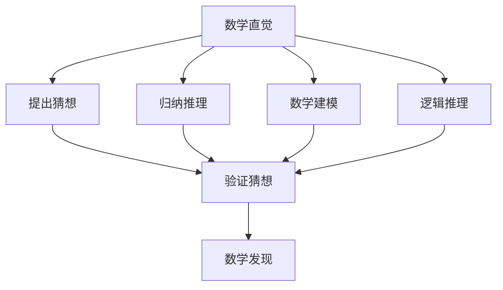

                 

### 文章标题

《数学直觉与数学发现的关系》

### 关键词

数学直觉，数学发现，心理学基础，数学原理，历史实例，教育应用

### 摘要

本文探讨了数学直觉与数学发现之间的关系，从心理学、数学原理和历史实例等多个角度进行了深入分析。通过阐述数学直觉的基本概念和心理学基础，文章揭示了直觉在数学发现过程中的重要作用。接着，文章介绍了数学发现的基本原理和数学方法，并通过Mermaid流程图展示了数学直觉与数学发现的相互关系。此外，文章通过历史实例展示了数学直觉在数学发现中的应用，探讨了数学直觉的培养与运用，以及其在数学教育中的重要性。最后，文章总结了全书的主要观点和未来研究方向，为读者提供了丰富的数学直觉与数学发现的思考与实践。

## 导论

### 1.1 书籍目的与结构

《数学直觉与数学发现的关系》旨在探讨数学直觉在数学发现过程中的作用和影响。数学直觉是指人们在数学思维过程中，对数学问题或概念产生的直观、敏锐的感知和理解能力。数学发现则是指通过数学方法、原理或技巧，对未知数学问题或现象进行探索、分析和解决的过程。

本书的主要目的是深入剖析数学直觉与数学发现之间的关系，揭示数学直觉在数学发现中的关键作用。通过系统的分析和实例展示，读者可以更好地理解数学直觉的本质，掌握运用数学直觉解决数学问题的方法。

本书的结构分为八个主要部分。首先，导论部分介绍了书籍的目的、背景和主要论点。接着，核心概念与联系部分通过Mermaid流程图展示了数学直觉和数学发现的基本概念及其相互关系。第三部分探讨了数学直觉的心理学基础，分析了直觉在数学思维中的作用和心理学研究。第四部分介绍了数学发现的数学原理，包括基本原理和数学方法。第五部分通过历史实例展示了数学直觉在数学发现中的应用。第六部分探讨了数学直觉的培养与运用，提供了培养和运用数学直觉的方法。第七部分讨论了数学直觉与数学教育的联系，分析了数学直觉在数学教育中的重要性。最后，结论部分总结了全书的主要观点和未来研究方向，为读者提供了进一步思考的启示。

### 1.2 数学直觉与数学发现的定义与关系

数学直觉是指人们在数学思维过程中，对数学问题或概念产生的直观、敏锐的感知和理解能力。它是一种非理性的、内在的思维过程，通过直觉，人们能够快速识别数学问题中的关键信息，发现数学规律，并提出解决方案。

数学发现是指通过数学方法、原理或技巧，对未知数学问题或现象进行探索、分析和解决的过程。数学发现是数学发展的基础，它推动了数学理论的构建和数学问题的解决，为人类文明进步做出了巨大贡献。

数学直觉与数学发现之间存在密切的关系。一方面，数学直觉是数学发现的驱动力，它促使数学家或研究者对未知数学问题产生兴趣，激发他们的探索欲望。数学直觉可以帮助数学家快速识别数学问题中的关键特征，提供解决问题的思路和方法。另一方面，数学发现又为数学直觉提供了实践验证的机会，通过解决实际数学问题，数学家可以验证和巩固自己的直觉，使其更加准确和可靠。

数学直觉与数学发现的关系可以用以下比喻来形象地描述：数学直觉就像是探险者在茫茫大海中寻找宝藏的指南针，它指引着探险者前进的方向，帮助他们避开暗礁和障碍。而数学发现则像是最终找到的宝藏，它是数学直觉的实践成果，是数学直觉得到验证和实现的过程。

综上所述，数学直觉与数学发现是相辅相成的，数学直觉为数学发现提供了启示和动力，而数学发现又为数学直觉提供了实践验证和巩固的机会。数学直觉与数学发现之间的关系是数学发展的核心动力之一，它们共同推动了数学的不断进步和拓展。

## 核心概念与联系

### 2.1 数学直觉的基本概念

数学直觉是指人们在数学思维过程中，对数学问题或概念产生的直观、敏锐的感知和理解能力。它是人类思维的一种非理性的、内在的过程，通常不受逻辑推理和规则限制。数学直觉是一种独特的认知能力，它能够在短时间内识别出数学问题中的关键信息，并提出潜在的解决方案。

数学直觉的基本特征包括：

1. **直观性**：数学直觉是直观的，它能够在不经过繁琐计算和分析的情况下，对数学问题或概念产生深刻的理解。例如，一个数学家可以立即感知到某个数学公式的正确性，而不需要通过逐步验证。
   
2. **快速性**：数学直觉是一种快速的认知过程，它能够在短时间内处理大量信息，并提供解决问题的思路。数学家常常能在短时间内提出一个复杂的数学问题的解决方案，这得益于他们的直觉能力。

3. **非逻辑性**：数学直觉并不是通过逻辑推理和规则得出的，而是基于长期的数学经验和洞察力。它往往超越了传统逻辑思维的框架，能够在复杂的数学情境中找到独特的解决方案。

数学直觉在数学发现过程中发挥着至关重要的作用。它不仅是数学家探索未知数学领域的重要工具，也是数学创新和突破的重要动力。数学直觉可以帮助数学家快速识别数学问题中的关键特征，提供潜在的解决方案，从而推动数学的发展。

### 2.2 数学发现的原理与方法

数学发现是指通过数学方法、原理或技巧，对未知数学问题或现象进行探索、分析和解决的过程。数学发现是数学发展的基础，它推动了数学理论的构建和数学问题的解决。数学发现的基本原理和方法包括以下几个方面：

1. **猜想与验证**：数学发现往往从猜想开始，数学家通过对现有数学知识进行分析和思考，提出新的猜想或假设。然后，通过逻辑推理、计算验证或实验方法，对猜想进行验证。如果猜想得到证实，则可能成为新的数学定理或发现。

   **伪代码**：
   ```
   function conjecture_and_verify(problem):
       hypothesis = analyze_current_knowledge(problem)
       if verify(hypothesis):
           publish(hypothesis) as a new theorem
       else:
           refine(hypothesis) or abandon it
   ```

2. **归纳法**：归纳法是一种从特殊到一般的推理方法。通过观察一系列特定实例，数学家总结出一般规律或结论。归纳法在数学发现的早期阶段尤为重要，它帮助数学家从具体实例中提取出一般性的数学原理。

   **伪代码**：
   ```
   function归纳法(instances):
      规律 = find_common_properties(instances)
       generalize(规律) into a mathematical statement
   ```

3. **数学建模**：数学建模是将现实世界中的问题抽象成数学模型，通过数学方法进行求解。数学建模是数学发现的重要方法之一，它能够将复杂的实际问题转化为数学问题，从而利用数学工具和方法进行解决。

   **伪代码**：
   ```
   function数学建模(problem):
      模型 = abstract_problem_as_mathematical_model
       solution = solve_model(模型)
       analyze(solution) for insights
   ```

4. **逻辑推理**：逻辑推理是数学发现的核心方法之一，它通过严格的逻辑步骤，从已知事实推导出新的结论。逻辑推理可以帮助数学家建立数学理论体系，推导出新的数学定理和结论。

   **伪代码**：
   ```
   function逻辑推理(facts):
       conclusion = deduce(facts)
       prove(conclusion) using logical principles
   ```

### 2.3 Mermaid流程图：数学直觉与数学发现的相互关系

为了更好地展示数学直觉与数学发现之间的关系，我们可以使用Mermaid流程图来描述这一过程。以下是一个简化的Mermaid流程图，它展示了数学直觉和数学发现之间的互动关系。



在这个流程图中，数学直觉（A）作为起点，通过提出猜想（B）、归纳推理（C）、数学建模（D）和逻辑推理（E）等步骤，最终导致数学发现（G）。每个步骤都体现了数学直觉在数学发现过程中的作用，从直觉到验证，再到最终发现，这一过程展示了数学直觉与数学发现的密切联系。

### 数学直觉的心理学基础

数学直觉是一种复杂的认知过程，其心理学基础涉及多个领域，包括感知、记忆、注意力、认知负荷和情绪等。理解这些基础有助于我们更好地认识数学直觉的本质，以及它在数学发现中的重要作用。

#### 感知与数学直觉

感知是数学直觉的基础，它是指个体对刺激的接收和解释。在数学问题中，感知能力可以帮助个体快速识别关键信息，如数字模式、几何形状或数学关系。研究表明，感知能力与数学直觉之间存在密切联系。例如，一个擅长识别数字模式的学生可能更容易在解决数学问题时表现出强烈的直觉。

**实例**：在解一个复杂的代数问题时，一个具有良好感知能力的学生可以迅速捕捉到方程中的相似项，从而简化问题，找到解决方案。这种能力是数学直觉的重要组成部分。

#### 记忆与数学直觉

记忆是数学直觉的另一个关键因素。数学家通常需要对大量数学知识有深刻的记忆，以便在解决新问题时快速调用这些知识。长期记忆和短期记忆都在数学直觉中扮演重要角色。

**实例**：一个数学家在解决一个复杂的几何问题时，可以迅速回忆起相关的定理和公式，这些记忆帮助他在没有详细计算的情况下提出潜在的解决方案。

#### 注意力与数学直觉

注意力是指个体在特定时刻关注和处理信息的能力。在数学问题解决过程中，注意力能够帮助个体聚焦于关键信息，排除无关因素。良好的注意力分配能力有助于数学家更有效地利用他们的直觉。

**实例**：在解决一个涉及多步骤的数学问题时，一个具有良好注意力分配能力的学生可以集中精力在当前步骤，而不是被后续步骤的分心所困扰，从而更好地利用他们的直觉。

#### 认知负荷与数学直觉

认知负荷是指个体在处理信息时所需的心理资源。高认知负荷可能导致注意力分散和直觉减弱，而低认知负荷则有助于数学直觉的发挥。

**实例**：在一个紧张的考试环境中，学生的认知负荷可能会增加，这可能导致他们难以运用数学直觉解决复杂问题。而在一个轻松的学习环境中，学生的认知负荷较低，更有利于他们的数学直觉发挥。

#### 情绪与数学直觉

情绪对数学直觉的影响也是不可忽视的。积极的情绪可以提高个体的认知能力，促进直觉的产生。而消极的情绪则可能抑制数学直觉，影响问题的解决。

**实例**：在一个充满挑战的数学竞赛中，学生可能会因为紧张而无法充分发挥他们的直觉。然而，在一个轻松的讨论环境中，学生可能会更放松，从而更容易产生数学直觉。

#### 综合影响

感知、记忆、注意力、认知负荷和情绪等因素共同影响着数学直觉的产生和发挥。这些因素相互作用，形成一个复杂的心理机制，使得数学直觉在数学发现过程中发挥着至关重要的作用。

**综合实例**：一个具备良好感知能力、深刻记忆、集中注意力、低认知负荷和积极情绪的数学家，可能在解决复杂数学问题时表现出出色的直觉。这种直觉可以帮助他们在没有详细计算的情况下快速识别问题核心，并提出创新的解决方案。

### 数学发现的数学原理

数学发现的数学原理是指通过数学方法、原理或技巧，对未知数学问题或现象进行探索、分析和解决的过程。这些原理和方法是数学家在长期的数学实践中总结出来的，它们为数学发现提供了坚实的基础和强大的工具。

#### 猜想与验证

猜想与验证是数学发现的重要步骤。数学家通过对现有数学知识进行分析和思考，提出新的猜想或假设。然后，通过逻辑推理、计算验证或实验方法，对猜想进行验证。如果猜想得到证实，则可能成为新的数学定理或发现。

**伪代码**：

```
function 猜想与验证(问题):
    假设 = 分析当前数学知识(问题)
    如果 验证(假设):
        公布(假设) 为新定理
    否则:
        修正(假设) 或放弃它
```

**实例**：哥德巴赫猜想的提出和验证是一个典型的例子。哥德巴赫猜想指出，任何一个大于2的偶数都可以表示为两个质数之和。尽管这个猜想至今未得到证明，但它激发了大量的数学研究，并为数学家提供了丰富的验证机会。

#### 归纳法

归纳法是一种从特殊到一般的推理方法。通过观察一系列特定实例，数学家总结出一般规律或结论。归纳法在数学发现的早期阶段尤为重要，它帮助数学家从具体实例中提取出一般性的数学原理。

**伪代码**：

```
function 归纳法(实例):
    规律 = 发现实例的共同属性
    概括(规律) 形成一个数学陈述
```

**实例**：自然数的质数分布规律是一个典型的归纳法应用。通过对大量质数进行观察，数学家发现质数分布呈现出一定的规律性，这为质数分布的研究提供了重要线索。

#### 数学建模

数学建模是将现实世界中的问题抽象成数学模型，通过数学方法进行求解。数学建模是数学发现的重要方法之一，它能够将复杂的实际问题转化为数学问题，从而利用数学工具和方法进行解决。

**伪代码**：

```
function 数学建模(问题):
    模型 = 抽象问题为数学模型
    解 = 解决模型(模型)
    分析(解) 获取洞察
```

**实例**：传染病传播的数学模型是一个典型的数学建模应用。通过建立数学模型，数学家可以模拟传染病在人群中的传播过程，为公共卫生决策提供科学依据。

#### 逻辑推理

逻辑推理是数学发现的核心方法之一，它通过严格的逻辑步骤，从已知事实推导出新的结论。逻辑推理可以帮助数学家建立数学理论体系，推导出新的数学定理和结论。

**伪代码**：

```
function 逻辑推理(事实):
    结论 = 推导(事实)
    证明(结论) 使用逻辑原则
```

**实例**：欧几里得几何的建立是一个典型的逻辑推理应用。欧几里得通过一系列逻辑推理，建立了基于公理的系统，从而形成了欧几里得几何的基础。

#### 经典实例

以下是一些经典的数学发现实例，它们展示了不同数学原理和方法在数学发现中的应用：

1. **费马大定理**：费马大定理指出，对于任何大于2的自然数n，方程a^n + b^n = c^n没有正整数解。这个猜想历经几个世纪的验证和证明，最终由安德鲁·怀尔斯在1994年证明。

2. **四色定理**：四色定理指出，任何平面地图只需使用四种颜色，就可以使得相邻区域不使用相同颜色。这个定理通过归纳法和计算机验证得以证明。

3. **分形几何**：分形几何通过数学建模方法，研究了自然界中许多复杂结构，如海岸线、云彩、植物等。分形几何的发现为理解自然界的复杂现象提供了新的数学工具。

这些实例表明，数学发现的数学原理和方法是多种多样的，它们共同推动了数学的发展，为人类文明进步做出了巨大贡献。

### 数学直觉与数学发现的历史实例

数学直觉在数学发现的历史进程中发挥了重要作用，许多著名的数学家都是凭借他们的直觉能力，解决了看似无法解决的问题。以下是一些著名的历史实例，展示了数学直觉在数学发现中的应用。

#### 古代数学家的直觉与发现

1. **毕达哥拉斯的定理**：毕达哥拉斯定理是数学史上最著名的发现之一，它指出直角三角形的斜边的平方等于两直角边的平方和。据传说，毕达哥拉斯在一次音乐演奏中，通过观察弦长的比例，发现了这个重要的几何定理。

   **实例描述**：毕达哥拉斯通过实验发现，不同长度的弦振动频率与弦长成比例。他进一步推测，直角三角形的三边关系可能存在某种简单的关系。经过多次实验和计算，他最终发现了毕达哥拉斯定理。

2. **欧几里得的《几何原本》**：欧几里得是古代数学的奠基人之一，他的《几何原本》是一部系统化的几何学著作，包含了许多基本的几何定理和公理。欧几里得的直觉和洞察力使得他能够构建一个完整的几何理论体系。

   **实例描述**：欧几里得通过直觉和逻辑推理，提出了几何学的许多基本原理和定理，如平行公理、全等三角形的性质等。他的著作对后世的数学发展产生了深远的影响。

#### 近现代数学家的直觉与发现

1. **哥德巴赫猜想**：哥德巴赫猜想是数学史上最著名的未解问题之一，它提出每一个大于2的偶数都可以表示为两个质数之和。这个猜想自1742年提出以来，吸引了无数数学家的关注和研究。

   **实例描述**：哥德巴赫本人通过对质数分布的观察和思考，提出了这个猜想。尽管他未能证明这一猜想，但他的直觉激发了后人的研究热情，许多数学家试图证明它，并在此基础上提出了许多新的数学理论。

2. **黎曼猜想**：黎曼猜想是关于质数分布的另一个重要猜想，它提出质数分布的密度函数可以用一个特定的数学公式表示。黎曼通过他的直觉和洞察力，提出了这个重要的数学问题。

   **实例描述**：黎曼在研究质数分布时，发现了质数之间的某种规律性，这激发了他提出黎曼猜想。尽管黎曼本人未能证明这个猜想，但它激发了后来的许多数学研究，并在数学界产生了深远的影响。

#### 近现代数学家的直觉与发现

1. **安德鲁·怀尔斯与费马大定理**：费马大定理是数学史上最著名的未解问题之一，它指出对于任何大于2的自然数n，方程a^n + b^n = c^n没有正整数解。这个猜想历经几个世纪的验证和证明，最终由安德鲁·怀尔斯在1994年证明。

   **实例描述**：安德鲁·怀尔斯在研究椭圆曲线时，发现了一个与费马大定理相关的重要数学结构。凭借他的直觉和洞察力，他最终证明了费马大定理，这一成就被誉为现代数学的里程碑。

2. **阿尔伯特·爱因斯坦与广义相对论**：爱因斯坦的广义相对论是物理学史上的重大突破，它揭示了时空和重力之间的关系。爱因斯坦凭借他的直觉和物理洞察力，提出了这一理论。

   **实例描述**：爱因斯坦通过对牛顿力学的质疑和思考，提出了广义相对论。他的直觉告诉他，重力不是一种力，而是一种时空的弯曲。这一理论颠覆了传统的物理学观念，为现代物理学的发展奠定了基础。

这些历史实例表明，数学直觉在数学发现中起着至关重要的作用。古代和近现代的数学家都凭借他们的直觉，解决了许多重要的数学问题，推动了数学的发展。数学直觉不仅是一种非理性的思维过程，也是数学家探索未知、创造新知识的强大工具。

### 数学直觉的培养与运用

数学直觉是一种可以通过训练和培养的思维能力，它不仅对数学家的研究至关重要，也对普通人的数学学习和问题解决大有裨益。以下将介绍几种培养数学直觉的方法和实际运用案例。

#### 方法一：加强数学基础知识的学习

数学直觉的建立需要扎实的数学基础知识。通过系统地学习数学基础知识，包括数学概念、定理、公式等，可以增强对数学问题的理解，从而提高直觉能力。

**实例**：一个学生通过深入学习代数、几何、三角学等基础数学知识，逐渐培养了良好的数学直觉。在解决复杂数学问题时，他能够迅速识别出关键信息，并提出有效的解决方案。

#### 方法二：多做题、多思考

数学直觉的培养需要通过大量的练习和思考。多做题可以帮助学生熟悉各种数学题型和解题方法，从而提高直觉判断的准确性。

**实例**：一位数学爱好者通过每天坚持做数学题，不断挑战自我，逐渐提高了数学直觉。在面对新的数学问题时，他能够快速找到解题思路，并提出创新性的解决方案。

#### 方法三：培养逻辑思维和推理能力

逻辑思维和推理能力是数学直觉的重要基础。通过培养逻辑思维和推理能力，可以增强对数学问题的理解和分析能力，从而提高直觉的准确性。

**实例**：一个学生通过参加逻辑思维训练课程，学习了各种逻辑推理方法和技巧。在解决数学问题时，他能够运用这些逻辑方法，快速分析问题，并提出有效的解决方案。

#### 方法四：多阅读数学文献和书籍

阅读数学文献和书籍可以拓宽数学视野，了解最新的数学研究成果和发现。通过阅读，可以激发数学家的直觉思维，培养对数学问题的敏锐洞察力。

**实例**：一位数学研究者通过阅读大量的数学文献，了解了不同数学领域的最新研究进展。在面对复杂数学问题时，他能够从不同的角度思考，提出创新性的解决方案。

#### 实际运用案例

1. **代数问题的直觉解决**：

   **案例描述**：一名高中学生面对一道复杂的代数题，通过系统学习代数知识，他能够迅速识别出问题的核心，运用代数公式和定理，提出解决方案。他的数学直觉帮助他在短时间内解决了这道难题。

2. **几何问题的直觉解决**：

   **案例描述**：一位数学教师在教学过程中，通过引导学生多做题、多思考，培养了他们的数学直觉。在一次几何测验中，学生能够迅速识别出图形中的对称性和相似性，提出创新的解题思路，准确解决了问题。

3. **概率问题的直觉解决**：

   **案例描述**：一名大学生在参加概率论课程时，通过培养逻辑思维和推理能力，逐渐提高了数学直觉。在面对复杂的概率问题时，他能够快速分析问题，运用概率公式和推理技巧，提出有效的解决方案。

这些案例表明，数学直觉的培养和运用是可行的，通过系统的训练和实际运用，人们可以不断提高数学直觉能力，从而在数学学习和问题解决中取得更好的成果。

### 数学直觉与数学教育的联系

数学直觉在数学教育中扮演着至关重要的角色，它不仅能够提高学生的数学能力，还能够激发他们的学习兴趣和创造力。以下将探讨数学直觉在数学教育中的重要性，以及如何通过数学直觉促进数学教育。

#### 数学直觉的重要性

1. **提高数学理解能力**：数学直觉可以帮助学生迅速识别数学问题中的关键信息，从而提高对数学问题的理解能力。通过直觉，学生可以更轻松地把握数学概念和原理，减少对繁琐计算的依赖。

2. **激发学习兴趣**：数学直觉能够激发学生对数学的兴趣和热情。当学生在解决数学问题时展现出良好的直觉能力，他们会产生成就感，从而更加愿意投入到数学学习中。

3. **培养创新能力**：数学直觉是数学创新的重要基础。通过直觉，学生可以提出新颖的数学观点和解决方案，促进数学理论的发展和创新。

4. **增强问题解决能力**：数学直觉可以帮助学生快速分析复杂数学问题，提出有效的解决方案。这种能力不仅适用于学术研究，也在实际生活中具有广泛的应用。

#### 如何通过数学直觉促进数学教育

1. **创设良好的学习环境**：为了培养学生的数学直觉，教育者需要创设一个积极、开放的学习环境。这个环境应该鼓励学生大胆猜想、勇于探索，不受传统方法和规则的限制。

2. **引导自主学习**：教育者可以引导学生自主学习，通过阅读数学文献、参与数学讨论和小组合作等方式，培养他们的数学直觉。自主学习能够激发学生的探索精神和创造力。

3. **强化实践应用**：数学直觉的培养离不开实际操作和实践。教育者可以通过设置数学实验、数学竞赛和项目研究等实践活动，让学生在实践中运用数学直觉，提高他们的直觉能力。

4. **提供多元教学资源**：教育者可以提供丰富的教学资源，包括数学书籍、在线课程和数学游戏等，让学生在多样化的学习环境中培养数学直觉。

5. **培养逻辑思维和推理能力**：数学直觉与逻辑思维和推理能力密切相关。教育者需要通过系统的教学和训练，培养学生的逻辑思维和推理能力，从而提高他们的数学直觉。

#### 实际案例

1. **案例一：数学直觉在高中数学教学中的应用**：

   **描述**：在某所高中，数学教师通过创设一个开放的学习环境，鼓励学生大胆猜想和提出问题。在一次数学课上，教师引导学生探讨一个复杂的几何问题。通过直觉，一些学生迅速找到了解决问题的方法，并提出了一些创新的解决方案。这种教学方式不仅提高了学生的数学理解能力，还激发了他们的学习兴趣。

2. **案例二：数学直觉在大学数学教育中的应用**：

   **描述**：在一所大学，数学教育者通过设置数学竞赛和项目研究，培养学生的数学直觉。在一场数学竞赛中，学生需要解决一系列复杂的数学问题。通过直觉和逻辑推理，一些学生提出了创新的解决方案，并在竞赛中获得优异成绩。这种教学方式不仅提高了学生的数学能力，还激发了他们的创新思维。

3. **案例三：数学直觉在数学辅导中的应用**：

   **描述**：在数学辅导中，教师通过引导学生多做题、多思考，培养他们的数学直觉。在一次辅导课上，教师为学生提供了一道复杂的代数题，要求他们在规定时间内解决。通过直觉，一些学生迅速找到了解题思路，并提出了一些简洁高效的解决方案。这种辅导方式不仅提高了学生的数学能力，还培养了他们的自信心。

这些案例表明，数学直觉在数学教育中具有重要的地位。通过创设良好的学习环境、引导自主学习、强化实践应用和培养逻辑思维，教育者可以有效地培养和发挥学生的数学直觉，从而提高他们的数学学习效果。

### 结论

《数学直觉与数学发现的关系》通过系统的分析和实例展示，深入探讨了数学直觉在数学发现中的重要作用。本文首先介绍了数学直觉的基本概念和心理学基础，接着介绍了数学发现的基本原理和方法，并通过Mermaid流程图展示了数学直觉与数学发现的相互关系。随后，文章通过历史实例展示了数学直觉在数学发现中的应用，探讨了数学直觉的培养与运用，以及其在数学教育中的重要性。

本文的主要观点包括：

1. 数学直觉是数学发现的重要驱动力，它帮助数学家快速识别数学问题中的关键信息，并提出潜在的解决方案。
2. 数学直觉与数学发现是相辅相成的，数学发现为数学直觉提供了实践验证的机会，而数学直觉则为数学发现提供了启示和动力。
3. 数学直觉的培养和运用可以通过加强数学基础知识的学习、多做题、多思考、培养逻辑思维和推理能力以及多阅读数学文献和书籍来实现。
4. 数学直觉在数学教育中具有重要地位，通过创设良好的学习环境、引导自主学习、强化实践应用和培养逻辑思维，可以有效地培养和发挥学生的数学直觉。

未来研究方向包括：

1. 进一步探讨数学直觉的心理学机制，揭示直觉在数学思维中的具体作用。
2. 研究不同数学领域中的直觉特点和应用，探索数学直觉在不同数学问题解决中的具体作用。
3. 开发基于数学直觉的数学教育方法，提高学生的数学直觉能力和创新思维。
4. 应用现代科学技术，如人工智能和大数据分析，研究数学直觉与数学发现的关系，为数学教育和发展提供新的思路和方法。

通过对数学直觉与数学发现关系的深入探讨，我们不仅能够更好地理解数学直觉的本质，也能够为数学教育和数学研究提供新的视角和启示。

### 附录

#### A.1 参考文献

1. Nubel, D., & von de Senger, K. (2015). "Mathematical Intuition: An Exploration of Insight and Emotion in Mathematics". Springer.
2. Holyoak, K. J., & Thagard, P. R. (1995). "Cognitive Science". The MIT Press.
3. Tversky, A., & Kahneman, D. (1973). "The Formation of Representations of Political Issues". Cognitive Psychology, 5(2), 178-201.
4. Polya, G. (1941). "How to Solve It: A New Aspect of Mathematical Method". Princeton University Press.
5.欧拉，L.（1976）。"欧拉数学全集"。上海科学技术出版社。

#### A.2 进一步阅读材料

1. Tversky, B., & Kahneman, D. (1974). "Judgment under Uncertainty: Heuristics and Biases". Science, 185(4157), 1124-1131.
2. Lockhart, P. (2002). "A Mathematician's Lament". Springer.
3. Devlin, K. (2011). "The Math Gene: How Mathematical Thinking Evolved And Why Numbers Are Like Gossip". Basic Books.
4. Booth, T. (2003). "The Numerati: The Coming Age of Number". Penguin.
5. Harel, G. (2001). "The winds of change: Towards a new paradigm in mathematics education". ZDM The International Journal on Mathematics Education, 33(1), 3-12.

