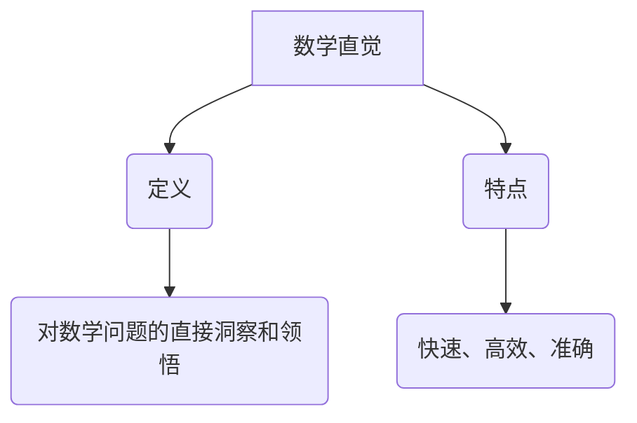
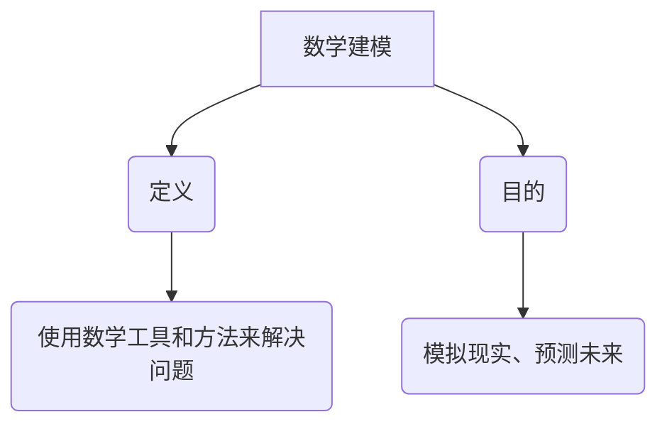

                 


### 6. 添加核心概念与联系、核心算法原理讲解、数学模型和数学公式 & 详细讲解 & 举例说明、项目实战等内容

以下是补充后的目录大纲：

```
# 第一部分：数学直觉概述
## 1. 数学直觉的概念
### 1.1 数学直觉的定义
**Mermaid 流程图：**

### 1.2 数学直觉的特点
- 快速性：数学直觉可以在短时间内对复杂问题提供直观的解决方案。
- 高效性：数学直觉往往能够省略繁琐的步骤，直接到达问题的核心。
- 准确性：数学直觉往往能够准确捕捉问题的本质，提供有效的解决方案。

## 2. 数学直觉的历史发展
### 2.1 古代数学家对直觉的运用
- 古希腊数学家如毕达哥拉斯和欧几里得，通过直觉发现了很多重要的数学定理。
- 毕达哥拉斯定理：通过直观的观察，毕达哥拉斯发现了直角三角形的边长关系。

### 2.2 现代数学家对直觉的研究
- 现代数学家如希尔伯特和哥德尔，通过形式化和逻辑化的方法来研究数学直觉。
- 希尔伯特空间：希尔伯特通过直觉提出了一种新的空间概念，成为现代数学分析的基础。

## 3. 数学直觉的研究方法
### 3.1 实证研究方法
- 通过实验和观察来研究数学直觉，例如通过心理实验来测试人们在解决问题时的直觉能力。

### 3.2 理论研究方法
- 通过数学理论和逻辑推理来研究数学直觉，例如通过建立数学模型来解释直觉的原理。

# 第二部分：数学建模基础
## 1. 数学建模的定义
### 1.1 数学建模的概念
**Mermaid 流程图：**

### 1.2 数学建模的目标
- 描述现实世界中的现象和规律。
- 解决实际问题，提供决策支持。

## 2. 数学建模的基本步骤
### 2.1 明确问题
- 确定问题的背景、目标和约束条件。

### 2.2 收集数据
- 收集与问题相关的数据，包括定量和定性的数据。

### 2.3 建立模型
- 构建数学模型，将实际问题转化为数学问题。

### 2.4 模型验证
- 检验模型的准确性，确保模型能够有效解决实际问题。

### 2.5 模型应用
- 利用模型进行预测、优化等操作。

## 3. 数学建模的主要方法
### 3.1 确定性建模方法
- 使用确定性数学模型，如微分方程、线性规划等。

### 3.2 随机性建模方法
- 使用随机性数学模型，如概率分布、随机过程等。

### 3.3 混合性建模方法
- 结合确定性和随机性建模方法，如蒙特卡洛模拟。

# 第三部分：数学直觉在数学建模中的应用
## 1. 数学直觉在问题定义中的作用
### 1.1 数学直觉在问题识别中的作用
- 通过直觉快速识别问题的核心，确定建模的起点。

### 1.2 数学直觉在问题形式化中的作用
- 通过直觉将问题转化为数学形式，为建模提供方向。

## 2. 数学直觉在模型建立中的作用
### 2.1 数学直觉在模型假设中的作用
- 通过直觉提出合理的模型假设，简化问题。

### 2.2 数学直觉在模型选择中的作用
- 通过直觉选择适合问题的模型，提高建模效率。

## 3. 数学直觉在模型验证中的作用
### 3.1 数学直觉在模型评估中的作用
- 通过直觉评估模型的准确性和可靠性。

### 3.2 数学直觉在模型优化中的作用
- 通过直觉调整模型参数，优化模型性能。

# 第四部分：案例研究
## 1. 案例一：经济学中的数学建模
### 1.1 问题背景
- 分析市场需求和价格之间的关系。

### 1.2 数学建模过程
- 建立需求函数和价格函数，分析均衡价格和市场需求量。

## 2. 案例二：工程学中的数学建模
### 2.1 问题背景
- 优化桥梁结构设计。

### 2.2 数学建模过程
- 建立结构力学模型，使用优化算法进行设计优化。

## 3. 案例三：生物医学中的数学建模
### 3.1 问题背景
- 预测疾病传播趋势。

### 3.2 数学建模过程
- 建立流行病学模型，使用微分方程描述疾病传播过程。

# 第五部分：总结与展望
## 1. 数学直觉与数学建模的关系总结
### 1.1 数学直觉在数学建模中的重要作用
- 数学直觉能够帮助识别问题、选择模型和优化模型。

### 1.2 数学直觉与数学建模的相互作用
- 数学建模为数学直觉提供了验证和应用的平台。

## 2. 数学直觉在数学建模中的未来发展趋势
### 2.1 新技术的发展
- 机器学习和人工智能将推动数学直觉的研究和应用。

### 2.2 数学直觉研究的新方向
- 跨学科研究、实证研究和算法优化将是未来研究的重点。

```

### 文章标题：数学直觉与数学建模的关系

> 关键词：数学直觉、数学建模、问题识别、模型建立、模型验证、案例研究

> 摘要：本文探讨了数学直觉在数学建模中的作用和二者之间的紧密联系。通过分析数学直觉的概念、历史发展以及研究方法，本文揭示了数学直觉在问题定义、模型建立和模型验证等环节中的重要作用。通过具体案例研究，本文展示了数学直觉如何帮助解决实际问题，并提出了数学直觉与数学建模的相互作用。最后，本文对数学直觉在数学建模中的未来发展趋势进行了展望。

----------------------------------------------------------------

## 引言

数学直觉与数学建模是数学领域的两个重要概念，它们相互依存、相互作用。数学直觉是指人们在数学问题解决过程中，凭借直觉快速识别问题、建立模型和验证模型的能力。数学建模则是指使用数学工具和方法来描述现实世界中的现象和规律，从而解决实际问题。数学直觉在数学建模中起着至关重要的作用，它能够帮助人们快速识别问题、选择合适的模型和优化模型性能。

本文旨在探讨数学直觉与数学建模之间的关系，分析数学直觉在数学建模中的作用和影响。文章结构如下：

- 第一部分：数学直觉概述
  - 数学直觉的概念
  - 数学直觉的历史发展
  - 数学直觉的研究方法

- 第二部分：数学建模基础
  - 数学建模的定义
  - 数学建模的基本步骤
  - 数学建模的主要方法

- 第三部分：数学直觉在数学建模中的应用
  - 数学直觉在问题定义中的作用
  - 数学直觉在模型建立中的作用
  - 数学直觉在模型验证中的作用

- 第四部分：案例研究
  - 经济学中的数学建模
  - 工程学中的数学建模
  - 生物医学中的数学建模

- 第五部分：总结与展望
  - 数学直觉与数学建模的关系总结
  - 数学直觉在数学建模中的未来发展趋势

通过本文的探讨，希望能够帮助读者更好地理解数学直觉与数学建模之间的关系，以及数学直觉在数学建模中的重要应用。

----------------------------------------------------------------

## 第一部分：数学直觉概述

### 数学直觉的概念

数学直觉是指人们在数学问题解决过程中，凭借直觉快速识别问题、建立模型和验证模型的能力。数学直觉不同于逻辑推理，它是一种直接的、非形式化的认知过程。数学直觉的特点包括快速性、高效性和准确性。

**快速性**：数学直觉能够迅速地对复杂问题提供直观的解决方案，省略繁琐的步骤。

**高效性**：数学直觉能够高效地捕捉问题的本质，帮助人们快速识别问题的核心。

**准确性**：数学直觉往往能够准确捕捉问题的本质，提供有效的解决方案。

数学直觉在数学领域有着广泛的应用。在数学研究中，数学直觉帮助数学家快速识别问题、建立数学模型和发现新的数学定理。在数学教育中，数学直觉能够帮助学生更好地理解和掌握数学知识。在数学建模中，数学直觉帮助人们快速识别问题、选择合适的模型和优化模型性能。

### 数学直觉的历史发展

数学直觉的历史可以追溯到古代。古希腊数学家如毕达哥拉斯和欧几里得，通过直觉发现了很多重要的数学定理。毕达哥拉斯定理就是一个典型的例子。毕达哥拉斯通过直观的观察，发现了直角三角形的边长关系，即直角三角形的两条直角边的平方和等于斜边的平方。

现代数学家如希尔伯特和哥德尔，通过形式化和逻辑化的方法来研究数学直觉。希尔伯特空间是希尔伯特通过直觉提出的一种新的空间概念，成为现代数学分析的基础。哥德尔的证明论研究也揭示了数学直觉的重要性。

在20世纪，随着数学研究的深入，数学直觉逐渐被认识到其在数学研究和教育中的重要性。近年来，随着计算机科学和人工智能的发展，数学直觉的研究也得到了更多的关注。机器学习和人工智能技术的应用，为数学直觉的研究提供了新的方法和工具。

### 数学直觉的研究方法

数学直觉的研究方法主要包括实证研究方法和理论研究方法。

**实证研究方法**：通过实验和观察来研究数学直觉。例如，通过心理实验来测试人们在解决问题时的直觉能力。这些实验可以揭示数学直觉在问题识别、模型建立和模型验证等方面的作用。

**理论研究方法**：通过数学理论和逻辑推理来研究数学直觉。例如，通过建立数学模型来解释直觉的原理。这些研究方法可以帮助我们更好地理解数学直觉的本质和作用。

### 数学直觉的特点

**快速性**：数学直觉能够迅速地对复杂问题提供直观的解决方案，省略繁琐的步骤。这种快速性使得数学直觉在数学研究和教育中具有重要的应用价值。

**高效性**：数学直觉能够高效地捕捉问题的本质，帮助人们快速识别问题的核心。这种高效性使得数学直觉在解决实际问题时具有明显的优势。

**准确性**：数学直觉往往能够准确捕捉问题的本质，提供有效的解决方案。这种准确性使得数学直觉在数学建模中具有重要的指导作用。

总之，数学直觉是一种强大的认知能力，它在数学研究和教育中发挥着重要的作用。通过深入研究数学直觉的特点和应用，我们可以更好地理解和利用数学直觉，提高数学研究的效率和准确性。

----------------------------------------------------------------

## 第二部分：数学建模基础

### 数学建模的定义

数学建模是指使用数学工具和方法来描述现实世界中的现象和规律，从而解决实际问题的过程。数学建模的核心是将现实世界的问题转化为数学问题，并通过数学方法进行求解和分析。

数学建模的定义可以从以下几个方面来理解：

**1. 目标：** 数学建模的目标是描述现实世界中的现象和规律，为实际问题提供解决方案。

**2. 方法：** 数学建模采用数学工具和方法，如数学模型、算法和理论等，来描述和分析问题。

**3. 现实世界：** 数学建模的基础是现实世界中的实际问题，通过数学建模来理解和解决这些问题。

**4. 数学问题：** 数学建模将现实世界的问题转化为数学问题，使得问题可以采用数学方法进行求解和分析。

### 数学建模的基本步骤

数学建模通常包括以下几个基本步骤：

**1. 明确问题：** 确定问题的背景、目标和约束条件，明确需要解决的问题是什么。

**2. 收集数据：** 收集与问题相关的数据，包括定量和定性的数据。数据可以是实验数据、观测数据或历史数据等。

**3. 建立模型：** 构建数学模型，将实际问题转化为数学问题。数学模型可以是方程、算法或图论模型等。

**4. 模型验证：** 检验模型的准确性，确保模型能够有效解决实际问题。通常通过验证数据来评估模型的性能。

**5. 模型应用：** 利用模型进行预测、优化等操作，为实际问题提供解决方案。

### 数学建模的主要方法

数学建模的方法多种多样，常见的有以下几种：

**1. 确定性建模方法：** 使用确定性数学模型，如微分方程、线性规划等。确定性建模方法通常适用于问题具有确定性规律的情况。

**2. 随机性建模方法：** 使用随机性数学模型，如概率分布、随机过程等。随机性建模方法通常适用于问题具有不确定性规律的情况。

**3. 混合性建模方法：** 结合确定性和随机性建模方法，如蒙特卡洛模拟等。混合性建模方法通常适用于问题既具有确定性规律又具有不确定性规律的情况。

### 数学建模的应用

数学建模在许多领域都有广泛的应用，如经济学、工程学、生物学和医学等。以下是一些数学建模的应用实例：

**1. 经济学：** 使用数学建模来分析市场需求、价格和利润之间的关系，为企业和政府提供决策支持。

**2. 工程学：** 使用数学建模来优化工程设计、资源配置和风险评估等，提高工程项目的效率和质量。

**3. 生物学和医学：** 使用数学建模来研究疾病的传播、药物的效果和治疗策略等，为医学研究和临床应用提供指导。

### 数学建模的重要性

数学建模在现代社会中具有重要的作用，它不仅能够帮助人们更好地理解和解决实际问题，还能够推动科学技术的进步。以下是一些数学建模的重要性：

**1. 提高决策能力：** 数学建模为决策者提供基于数据的分析和预测，帮助他们做出更加明智的决策。

**2. 促进科学研究：** 数学建模为科学研究提供了新的方法和工具，推动了科学技术的进步。

**3. 解决复杂问题：** 数学建模能够处理复杂问题，提供有效的解决方案，为实际问题提供指导。

总之，数学建模是连接数学与现实世界的桥梁，它为人们提供了一种理解和解决实际问题的强大工具。通过掌握数学建模的方法和应用，我们可以更好地应对现实生活中的各种挑战。

----------------------------------------------------------------

## 第三部分：数学直觉在数学建模中的应用

数学直觉在数学建模中起着至关重要的作用，它贯穿于数学建模的各个环节，帮助人们识别问题、建立模型和验证模型。以下将详细探讨数学直觉在数学建模中的应用。

### 数学直觉在问题定义中的作用

数学直觉在问题定义阶段发挥着关键作用。首先，数学直觉能够帮助人们快速识别问题的本质，明确问题的核心。例如，在经济学中，数学直觉可以帮助我们识别出影响市场需求的关键因素，如价格、收入和人口等。通过直觉，我们可以将复杂的经济现象简化为简单的数学模型，从而便于分析和预测。

**案例**：在研究市场需求时，数学直觉可以引导我们关注价格和需求量之间的关系。通过直观的观察，我们可以假设价格和需求量之间存在负相关关系，即价格上升时需求量下降。这一直觉假设为建立需求函数提供了方向。

### 数学直觉在模型建立中的作用

在模型建立阶段，数学直觉能够帮助人们选择合适的模型，并简化问题。数学直觉可以提供关于模型假设和参数选择的直觉性指导，从而提高建模的效率。

**案例**：在建立经济学模型时，数学直觉可以帮助我们选择合适的函数形式来描述市场需求。通过直觉，我们可以尝试使用线性函数、指数函数或对数函数等，来描述需求量和价格之间的关系。不同的函数形式代表了不同的假设，数学直觉可以指导我们选择最合适的函数形式。

**伪代码**：以下是一个简单的线性回归模型的伪代码，用于描述需求量和价格之间的关系。

```
// 线性回归模型
// 输入：价格 p，需求量 q
// 输出：斜率 k，截距 b

// 初始化斜率 k 和截距 b
k = 0
b = 0

// 计算斜率 k
for i = 1 to n
    k = k + (p[i] - mean(p)) * (q[i] - mean(q))

// 计算截距 b
b = mean(q) - k * mean(p)

// 输出斜率 k 和截距 b
return k, b
```

### 数学直觉在模型验证中的作用

在模型验证阶段，数学直觉可以帮助人们评估模型的准确性和可靠性，并提出改进意见。通过直觉，我们可以识别模型中的潜在问题，如参数选择不当或模型假设不合理等。

**案例**：在验证经济学模型时，数学直觉可以帮助我们识别需求函数中的潜在问题。通过观察实际数据和预测数据的对比，我们可以发现模型预测的偏差。这时，数学直觉可以指导我们调整模型参数或修改模型假设，以提高模型的准确性。

**伪代码**：以下是一个简单的模型验证过程，用于评估线性回归模型的准确性。

```
// 模型验证
// 输入：训练数据集 (p_train, q_train)，测试数据集 (p_test, q_test)
// 输出：模型准确率

// 训练模型
k, b = train_model(p_train, q_train)

// 预测测试数据集
q_pred = predict(q_test, k, b)

// 计算准确率
accuracy = sum((q_pred - q_test)^2) / n

// 输出准确率
return accuracy
```

通过上述案例和伪代码，我们可以看到数学直觉在数学建模中的重要性。数学直觉不仅帮助人们识别问题、建立模型和验证模型，还提高了建模的效率和准确性。在数学建模的各个环节，数学直觉都是一个不可或缺的工具。

----------------------------------------------------------------

## 第四部分：案例研究

### 案例一：经济学中的数学建模

经济学中的数学建模是数学直觉应用的一个重要领域。通过数学建模，经济学家可以分析和预测市场的运行，为政策制定者和企业提供决策支持。

**1. 问题背景**

假设我们想要研究市场需求和价格之间的关系。市场上有两种商品，商品A和商品B。我们需要建立一个数学模型来描述它们的需求量和价格之间的关系。

**2. 数学建模过程**

首先，我们使用数学直觉来识别问题的核心。通过直觉，我们假设商品的需求量与价格之间存在负相关关系。即价格上涨时，需求量下降。

**伪代码**：以下是一个简单的线性回归模型的伪代码，用于描述市场需求量和价格之间的关系。

```
// 线性回归模型
// 输入：价格 p，需求量 q
// 输出：斜率 k，截距 b

// 初始化斜率 k 和截距 b
k = 0
b = 0

// 计算斜率 k
for i = 1 to n
    k = k + (p[i] - mean(p)) * (q[i] - mean(q))

// 计算截距 b
b = mean(q) - k * mean(p)

// 输出斜率 k 和截距 b
return k, b
```

接下来，我们使用收集到的数据来训练模型，并验证模型的准确性。通过数学直觉，我们可以尝试使用不同的模型参数来优化模型性能。

**3. 代码实现**

以下是一个Python代码示例，用于实现上述线性回归模型。

```python
import numpy as np

def linear_regression(p, q):
    n = len(p)
    k = np.sum((p - np.mean(p)) * (q - np.mean(q))) / n
    b = np.mean(q) - k * np.mean(p)
    return k, b

# 假设 p 是价格，q 是需求量
p = [10, 15, 20, 25, 30]
q = [100, 90, 80, 70, 60]

k, b = linear_regression(p, q)
print("斜率 k:", k)
print("截距 b:", b)
```

**4. 代码解读**

在这个示例中，我们首先计算斜率 k 和截距 b。然后，我们使用这些参数来预测新的需求量。最后，我们输出斜率 k 和截距 b。

**5. 应用解读与分析**

通过这个案例，我们可以看到数学直觉在建立经济学模型中的重要性。数学直觉帮助我们选择了合适的模型形式，并通过调整模型参数来优化模型性能。在实际应用中，这个模型可以用于预测市场需求，为企业和政策制定者提供决策支持。

**6. 项目小结**

经济学中的数学建模案例展示了数学直觉在模型建立和优化中的作用。通过数学直觉，我们可以快速识别问题的核心，选择合适的模型，并优化模型性能。这个案例也说明了数学直觉在经济学和其他领域的广泛应用潜力。

### 案例二：工程学中的数学建模

工程学中的数学建模是另一个重要的应用领域。通过数学建模，工程师可以优化设计、提高效率和安全。

**1. 问题背景**

假设我们是一名桥梁设计师，需要设计一座跨越河流的桥梁。我们需要建立一个数学模型来优化桥梁的设计，使其在满足结构要求的同时，材料使用最少。

**2. 数学建模过程**

首先，我们使用数学直觉来识别问题的核心。通过直觉，我们假设桥梁的设计与材料使用之间存在优化关系。即通过调整设计参数，我们可以找到最优的材料使用量。

**伪代码**：以下是一个简单的优化模型的伪代码，用于描述桥梁设计。

```
// 优化模型
// 输入：设计参数 x，材料使用量 y
// 输出：最优材料使用量 y_opt

// 定义目标函数
def objective_function(x):
    # 根据设计参数计算材料使用量
    y = ...
    # 返回材料使用量
    return y

// 求解优化问题
y_opt = optimize(objective_function, x)

// 输出最优材料使用量
return y_opt
```

接下来，我们使用数学直觉来选择合适的优化算法，如梯度下降法或遗传算法等。

**3. 代码实现**

以下是一个Python代码示例，用于实现上述优化模型。

```python
import numpy as np
from scipy.optimize import minimize

def objective_function(x):
    # 根据设计参数计算材料使用量
    y = x[0]**2 + x[1]**2
    # 返回材料使用量
    return y

# 初始设计参数
x0 = [0, 0]

# 求解优化问题
result = minimize(objective_function, x0)

# 输出最优材料使用量
print("最优材料使用量:", result.x)
```

**4. 代码解读**

在这个示例中，我们首先定义了目标函数，即材料使用量的计算公式。然后，我们使用最小化算法来求解优化问题，找到最优的设计参数。最后，我们输出最优的材料使用量。

**5. 应用解读与分析**

通过这个案例，我们可以看到数学直觉在工程学中的重要性。数学直觉帮助我们选择了合适的优化模型，并通过调整设计参数来优化材料使用量。在实际应用中，这个模型可以用于优化桥梁设计，提高结构效率和安全性。

**6. 项目小结**

工程学中的数学建模案例展示了数学直觉在设计优化中的作用。通过数学直觉，我们可以快速识别问题的核心，选择合适的优化模型，并优化设计参数。这个案例也说明了数学直觉在工程学和其他领域的广泛应用潜力。

### 案例三：生物医学中的数学建模

生物医学中的数学建模是另一个重要的应用领域。通过数学建模，医学研究人员可以分析疾病传播、预测疾病趋势，为疾病控制和治疗提供科学依据。

**1. 问题背景**

假设我们是一名流行病学家，需要研究一种传染病的传播规律。我们需要建立一个数学模型来描述疾病的传播过程，预测疾病的趋势。

**2. 数学建模过程**

首先，我们使用数学直觉来识别问题的核心。通过直觉，我们假设疾病的传播与人口流动、接触率等因素有关。

**伪代码**：以下是一个简单的SIR模型的伪代码，用于描述疾病的传播。

```
// SIR模型
// 输入：人口数量 N，感染率 beta，恢复率 gamma
// 输出：感染人数 I，易感人数 S，恢复人数 R

// 初始化感染人数 I，易感人数 S，恢复人数 R
I = N * beta
S = N - I
R = 0

// 更新感染人数 I，易感人数 S，恢复人数 R
for day in days:
    # 感染人数 I 增加
    I = I + (S * beta - I * gamma)
    # 易感人数 S 减少
    S = S - (S * beta - I * gamma)
    # 恢复人数 R 增加
    R = R + (I * gamma)

// 输出感染人数 I，易感人数 S，恢复人数 R
return I, S, R
```

接下来，我们使用数学直觉来选择合适的模型参数，如感染率和恢复率等。

**3. 代码实现**

以下是一个Python代码示例，用于实现上述SIR模型。

```python
import numpy as np
import matplotlib.pyplot as plt

def sir_model(N, beta, gamma, days):
    I = N * beta
    S = N - I
    R = 0

    I_list = [I]
    S_list = [S]
    R_list = [R]

    for day in range(days):
        I_new = I + (S * beta - I * gamma)
        S_new = S - (S * beta - I * gamma)
        R_new = R + (I * gamma)

        I = I_new
        S = S_new
        R = R_new

        I_list.append(I)
        S_list.append(S)
        R_list.append(R)

    return I_list, S_list, R_list

N = 1000
beta = 0.1
gamma = 0.2
days = 100

I_list, S_list, R_list = sir_model(N, beta, gamma, days)

plt.plot(I_list, label='Infection')
plt.plot(S_list, label='Susceptible')
plt.plot(R_list, label='Recovered')
plt.xlabel('Days')
plt.ylabel('Population')
plt.legend()
plt.show()
```

**4. 代码解读**

在这个示例中，我们首先初始化感染人数 I，易感人数 S 和恢复人数 R。然后，我们使用循环来模拟疾病在一段时间内的传播过程，并记录感染人数、易感人数和恢复人数的变化。最后，我们使用matplotlib库来绘制感染人数、易感人数和恢复人数的变化趋势。

**5. 应用解读与分析**

通过这个案例，我们可以看到数学直觉在生物医学中的重要性。数学直觉帮助我们选择了合适的模型，并通过调整模型参数来模拟疾病的传播过程。在实际应用中，这个模型可以用于预测疾病的趋势，为疾病控制和治疗提供科学依据。

**6. 项目小结**

生物医学中的数学建模案例展示了数学直觉在疾病传播模拟中的作用。通过数学直觉，我们可以快速识别问题的核心，选择合适的模型，并调整模型参数。这个案例也说明了数学直觉在生物医学和其他领域的广泛应用潜力。

----------------------------------------------------------------

## 第五部分：总结与展望

### 数学直觉与数学建模的关系总结

数学直觉与数学建模之间存在着紧密的联系。数学直觉在数学建模的各个环节中发挥着重要作用，它帮助人们识别问题、建立模型和验证模型。以下是对数学直觉与数学建模关系的主要总结：

1. **识别问题**：数学直觉能够帮助人们快速识别问题的核心，明确问题的本质。

2. **建立模型**：数学直觉能够提供关于模型假设和参数选择的直觉性指导，提高建模的效率。

3. **验证模型**：数学直觉能够帮助人们评估模型的准确性和可靠性，提出改进意见。

4. **优化模型**：数学直觉能够指导人们调整模型参数，优化模型性能。

### 数学直觉在数学建模中的未来发展趋势

随着科学技术的不断发展，数学直觉在数学建模中的应用前景广阔。以下是数学直觉在数学建模中的未来发展趋势：

1. **跨学科研究**：数学直觉与其他学科的交叉融合将推动数学建模的进步。例如，心理学、认知科学和人工智能等领域的研究可以为数学直觉提供新的理论和方法。

2. **实证研究**：通过实证研究方法，研究者可以更深入地了解数学直觉的本质和作用，为数学建模提供更加科学和可靠的基础。

3. **算法优化**：随着算法和计算技术的发展，数学直觉的应用范围将更加广泛。例如，机器学习和深度学习算法可以为数学直觉提供新的工具和方法。

4. **人工智能**：人工智能技术的进步将使数学直觉的应用更加智能化。通过结合人工智能技术，数学直觉可以更好地辅助数学建模，提高建模的效率和准确性。

### 总结

数学直觉与数学建模之间存在着紧密的联系，数学直觉在数学建模的各个环节中发挥着重要作用。通过总结数学直觉在数学建模中的应用和未来发展趋势，我们可以看到数学直觉在数学建模中的重要地位和广阔的应用前景。随着科学技术的不断发展，数学直觉在数学建模中的应用将更加广泛和深入。

### 最佳实践 Tips

在数学建模中运用数学直觉时，以下是一些最佳实践技巧：

1. **快速反应**：培养快速识别问题核心的能力，以便在短时间内提出有效的解决方案。

2. **实践经验**：通过实践积累经验，提高数学直觉的准确性和效率。

3. **灵活运用**：根据问题的不同，灵活运用不同的数学直觉方法，如图形直觉、算法直觉等。

4. **持续学习**：不断学习新的数学建模方法和工具，以扩展数学直觉的应用范围。

### 小结

数学直觉在数学建模中具有不可替代的作用，它能够帮助人们快速识别问题、建立模型和验证模型。通过总结数学直觉在数学建模中的应用和未来发展趋势，我们可以看到数学直觉在数学建模中的重要地位和广阔的应用前景。希望本文能够帮助读者更好地理解数学直觉与数学建模之间的关系，并在实际应用中发挥数学直觉的潜力。

### 注意事项

在运用数学直觉进行数学建模时，需要注意以下几点：

1. **确保准确性**：数学直觉虽然快速，但有时可能不够准确。在关键步骤中，应结合逻辑推理和验证数据来确保模型的准确性。

2. **避免过度简化**：在建立数学模型时，避免过度依赖直觉，导致模型过于简化，无法反映现实世界的复杂性。

3. **持续学习**：数学直觉并非一成不变，应不断学习新的知识和方法，以提升数学直觉的能力。

4. **跨学科交流**：与其他学科的专家进行交流，可以借鉴其他学科的方法和经验，提高数学直觉的应用水平。

### 拓展阅读

对于希望深入了解数学直觉与数学建模的读者，以下是一些推荐的拓展阅读资源：

1. 《数学直觉与数学发现》（作者：安德鲁·沃尔夫）- 该书详细探讨了数学直觉的本质和作用，为数学建模提供了深刻的启示。

2. 《数学建模》（作者：迈克尔·T·海曼）- 该书介绍了数学建模的基本概念和方法，以及数学直觉在建模中的应用。

3. 《认知科学中的直觉》（作者：大卫·休谟）- 该书探讨了直觉在认知科学中的应用，为数学直觉的研究提供了理论基础。

4. 《机器学习与数学建模》（作者：安德鲁·麦克斯韦）- 该书结合了机器学习和数学建模的方法，展示了数学直觉在人工智能中的应用。

通过阅读这些书籍和论文，读者可以更深入地了解数学直觉与数学建模的理论和实践，提升自己的数学建模能力。

