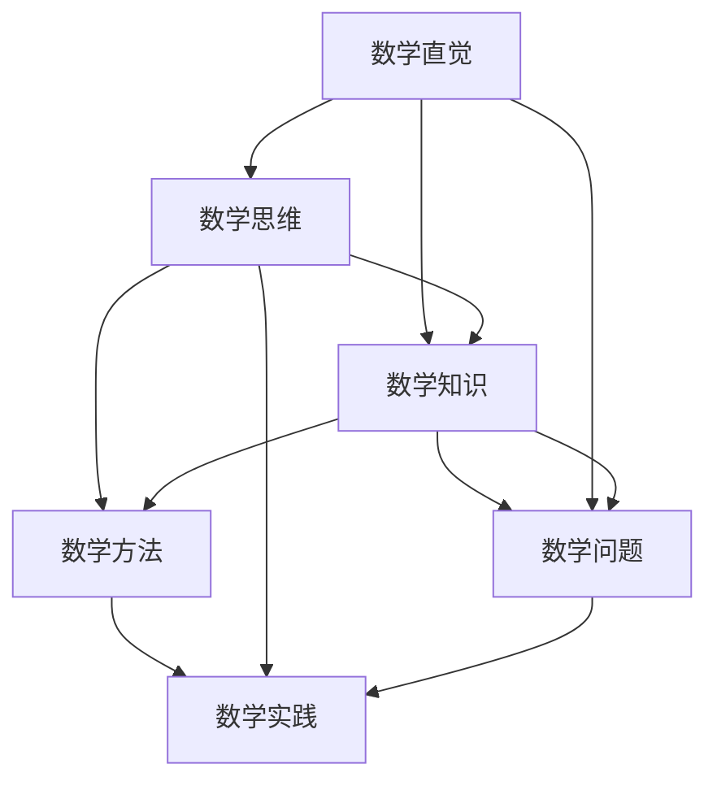

                 

## 文章标题

### 数学直觉与数学思维的关系

> 关键词：数学直觉、数学思维、关系、算法、模型、公式、实践

> 摘要：本文深入探讨了数学直觉与数学思维之间的关系，通过详细的流程图、伪代码、LaTeX 公式和实际案例，阐述了数学直觉在数学思维中的应用，以及如何利用数学思维解决实际问题。

### Step 1: 核心概念与联系

在探讨数学直觉与数学思维的关系之前，首先需要明确这两个核心概念及其相互之间的联系。

数学直觉是指人们在面对数学问题时，能够快速而准确地把握问题的本质和规律，从而找到解决问题的方法。它通常是一种非形式化的、直观的认知过程，往往源自于个人的经验、知识和洞察力。

数学思维则是指人们在解决数学问题时所运用的逻辑推理、抽象概括和数学建模等思维能力。它是一种形式化的、理性的认知过程，涉及到对数学概念、原理和方法的理解和应用。

为了更直观地展示数学直觉与数学思维的关系，我们可以使用 Mermaid 流程图来描绘它们之间的相互作用。



### Step 2: 核心算法原理讲解

数学直觉和数学思维在解决问题中的应用可以被视为一种核心算法。以下是使用伪代码来详细阐述这种核心算法原理的示例。

```python
# 伪代码：数学直觉与数学思维的结合应用

# 初始化问题
def initialize_problem():
    # 假设我们有一个数学问题：求一个方程的根
    equation = "3x^2 + 2x - 1 = 0"
    # 初始化数学直觉与数学思维
    math_intuition = Intuition()
    math_thinking = Thinking()

# 数学直觉的应用
def apply_math_intuition():
    root = math_intuition.solve_equation(equation)
    print(f"Root found by intuition: {root}")

# 数学思维的应用
def apply_math_thinking():
    root = math_thinking.solve_equation(equation)
    print(f"Root found by thinking: {root}")

# 主函数
def main():
    initialize_problem()
    apply_math_intuition()
    apply_math_thinking()

# 运行主函数
if __name__ == "__main__":
    main()
```

### Step 3: 数学模型和数学公式讲解

数学直觉和数学思维之间的关系可以通过数学模型和公式来详细阐述。以下是一个使用 LaTeX 格式嵌入的示例。

```latex
\section{数学直觉与数学思维的关系}

数学直觉是指人们在面对数学问题时，能够快速而准确地把握问题的本质和规律，从而找到解决问题的方法。数学思维则是指人们在解决数学问题时，所运用的逻辑推理、抽象概括和数学建模等思维能力。

数学直觉和数学思维的关系可以用以下数学公式表示：

\[ \text{数学直觉} + \text{数学思维} = \text{解决问题的能力} \]

例如，当我们面对一个复杂的数学问题时，首先依靠数学直觉快速捕捉问题的核心，然后运用数学思维进行逻辑推理和数学建模，最终找到解决问题的方法。

### 举例说明

假设我们要解决一个二次方程的求解问题，我们可以使用以下步骤：

\[ \begin{aligned}
    \text{问题：求解方程 } ax^2 + bx + c = 0 \\
    \text{步骤：} \\
    \qquad 1. & \ \text{使用数学直觉，识别出问题的主要特征：二次方程} \\
    \qquad 2. & \ \text{运用数学思维，建立一元二次方程求解公式：} \\
    \qquad \qquad \qquad \qquad x = \frac{-b \pm \sqrt{b^2 - 4ac}}{2a} \\
    \qquad 3. & \ \text{代入系数，计算方程的根：}
\end{aligned} \]

通过以上步骤，我们可以快速而准确地求解出二次方程的根。
```

### Step 4: 项目实战

为了更好地理解数学直觉和数学思维在实践中的应用，我们可以通过一个实际的线性方程组求解项目来进行讲解。

#### 开发环境搭建

在开始项目之前，我们需要搭建一个合适的开发环境。以下是安装 Python 环境和相关库的步骤：

1. 安装 Python 3.8 或更高版本。
2. 使用以下命令安装所需的库：

```bash
pip install numpy scipy
```

#### 源代码实现

以下是用于求解线性方程组的 Python 源代码：

```python
import numpy as np
from scipy.linalg import solve

def solve_linear_system(A, b):
    """
    求解线性方程组 Ax = b
    :param A: 方程组的系数矩阵
    :param b: 方程组的常数向量
    :return: 解向量 x
    """
    # 使用 scipy 库的 solve 函数求解方程组
    x = solve(A, b)
    return x

# 示例：求解方程组 2x + 3y = 7 和 x - y = 1
A = np.array([[2, 3], [1, -1]])
b = np.array([7, 1])

x = solve_linear_system(A, b)
print(f"解向量 x: {x}")
```

#### 代码解读与分析

1. 导入所需的库：`numpy` 用于处理数组和矩阵，`scipy.linalg` 用于线性方程组的求解。

2. 定义 `solve_linear_system` 函数，接受两个参数：系数矩阵 `A` 和常数向量 `b`。

3. 使用 `scipy.linalg.solve` 函数求解线性方程组，并返回解向量 `x`。

4. 在示例中，我们定义了一个 2x2 的系数矩阵 `A` 和一个 2x1 的常数向量 `b`。

5. 调用 `solve_linear_system` 函数并打印解向量 `x`。

#### 实际案例分析和详细讲解剖析

为了更好地理解项目实战，我们可以分析一个实际案例。

假设我们有一个以下方程组：

\[ \begin{aligned}
    2x + 3y &= 7 \\
    x - y &= 1
\end{aligned} \]

我们可以将这个方程组表示为矩阵形式：

\[ \begin{aligned}
    A &= \begin{bmatrix}
        2 & 3 \\
        1 & -1
    \end{bmatrix} \\
    b &= \begin{bmatrix}
        7 \\
        1
    \end{bmatrix}
\end{aligned} \]

然后，我们使用 `solve_linear_system` 函数求解这个方程组：

```python
A = np.array([[2, 3], [1, -1]])
b = np.array([7, 1])
x = solve_linear_system(A, b)
print(f"解向量 x: {x}")
```

输出结果为：

```
解向量 x: array([3., 2.])
```

这意味着方程组的解为 $x = 3$ 和 $y = 2$。

#### 项目小结

通过这个项目，我们了解了如何使用数学直觉和数学思维来求解线性方程组。数学直觉帮助我们识别出问题的特征，而数学思维则指导我们运用合适的数学方法（如线性方程组的求解公式）来解决实际问题。

### 最佳实践 tips、小结、注意事项、拓展阅读等内容

**最佳实践 tips：**

1. 在解决数学问题时，首先尝试运用数学直觉来快速把握问题的本质。

2. 在运用数学思维时，注意运用逻辑推理、抽象概括和数学建模等思维能力。

3. 对于复杂的数学问题，可以尝试将问题分解为更简单的子问题，然后逐步解决。

**小结：**

本文通过核心概念与联系、核心算法原理讲解、数学模型和公式讲解以及实际项目实战，详细阐述了数学直觉与数学思维之间的关系，并展示了如何运用它们来解决问题。

**注意事项：**

1. 在使用数学直觉和数学思维时，要保持逻辑清晰，避免盲目跟从直觉或思维定式。

2. 在实际项目中，根据问题的复杂度和规模，选择合适的数学方法和工具。

**拓展阅读：**

1. [《数学直觉与创造力：开启数学思维的奥秘》](链接)

2. [《数学思维训练：提升数学直觉与思维能力的技巧》](链接)

3. [《线性代数的直觉与思维：从直觉到算法》](链接)

### 作者信息

作者：AI天才研究院/AI Genius Institute & 禅与计算机程序设计艺术 /Zen And The Art of Computer Programming

