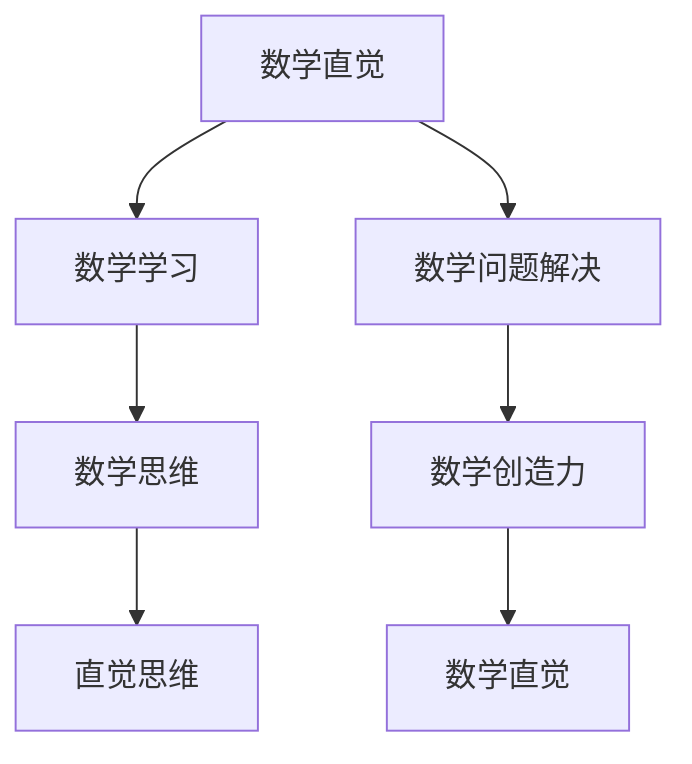
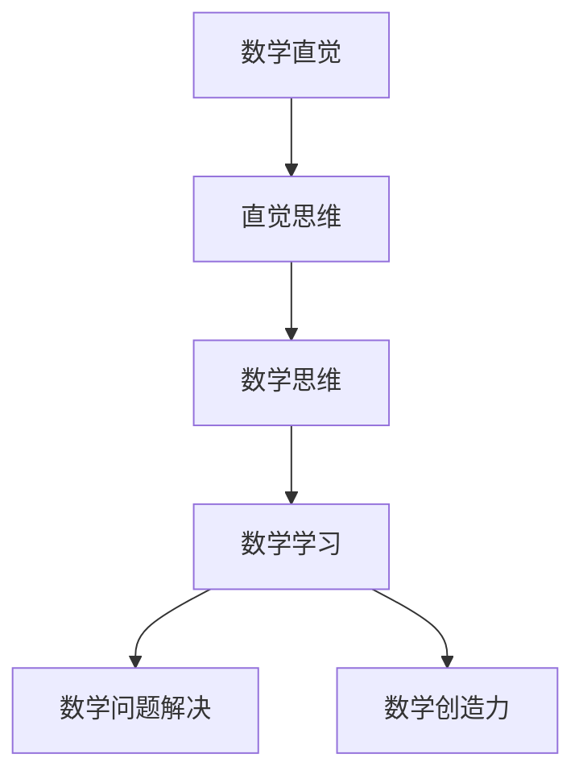
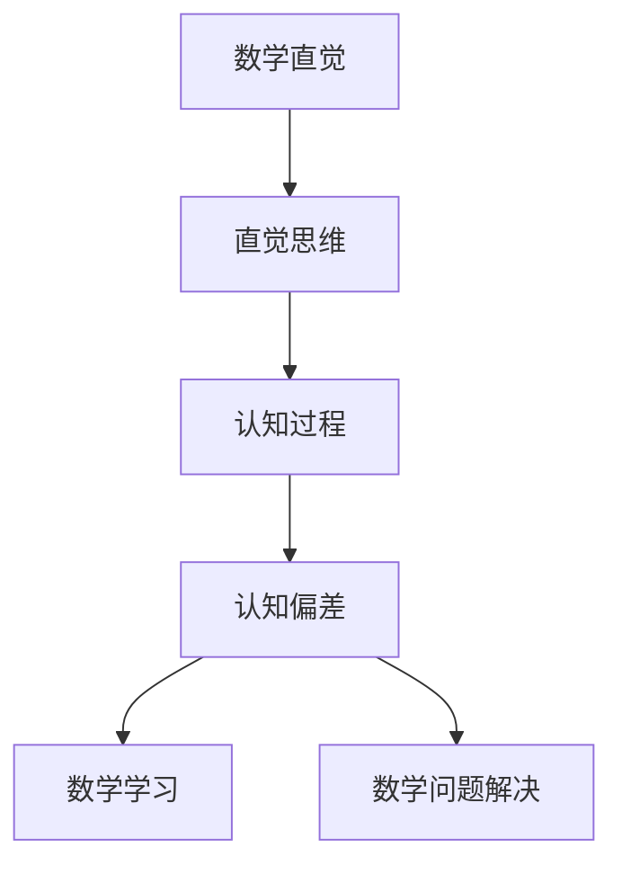
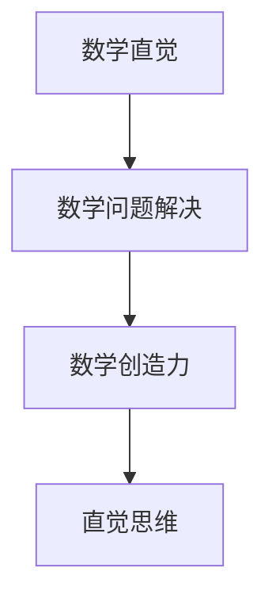

                 


### 文章标题：数学直觉与数学教学的关系

#### 关键词：
- 数学直觉
- 数学教学
- 教学策略
- 数学问题解决
- 数学创造力
- 心理学分析
- 实践案例

#### 摘要：
本文从数学直觉的定义、心理学分析、教学策略应用、数学问题解决和数学创造力等多个角度，深入探讨了数学直觉与数学教学之间的关系。通过分析数学直觉的基本概念及其在数学学习中的重要性，结合心理学研究的成果，探讨了数学直觉在教学策略和数学问题解决中的应用。同时，本文还通过实际案例和实战项目，展示了数学直觉在数学教学中的实践效果，并提出了未来研究的方向和建议。

### 第一部分：数学直觉的探讨

#### 第1章：数学直觉的基本概念

##### 1.1 数学直觉的定义

数学直觉是指人们在没有经过明确推理的情况下，能够快速、准确地感知和判断数学问题的能力。它是一种直观的认知过程，与逻辑推理和证明方法不同，数学直觉往往依赖于人的感知、经验和直觉思维。

##### 1.2 数学直觉的起源与发展

数学直觉的起源可以追溯到人类对自然界和现实世界的观察与思考。在古代，数学家通过观察和经验总结出了一些基本的数学概念和原理，如数字、几何形状和比例关系等。随着科学的发展，心理学、认知科学等领域的兴起，数学直觉的研究也逐渐深入。

##### 1.3 数学直觉在数学学习中的重要性

数学直觉在数学学习中具有重要作用。首先，它能够帮助学习者快速理解数学概念和原理，减少学习过程中的思维负担。其次，数学直觉能够提高学习者的数学问题解决能力，使他们能够更灵活地应对各种数学问题。最后，数学直觉还能激发学习者的数学创造力，促进他们在数学领域的创新和发展。

#### 核心概念与联系：



#### 背景介绍：

数学直觉作为一种认知过程，早在古希腊时期就被数学家们所重视。例如，欧几里得的《几何原本》中就包含了许多基于直觉的数学证明。随着数学的不断发展，数学直觉在数学学习中的应用越来越广泛，不仅限于数学学科本身，还渗透到数学教育、心理学和认知科学等领域。

#### 核心概念与联系：



### 第二部分：数学直觉的心理学分析

#### 第2章：数学直觉的心理学分析

##### 2.1 数学直觉的心理机制

数学直觉的心理机制涉及多个认知领域，包括感知、记忆、思维和情感。研究表明，数学直觉的形成与大脑中的多个区域密切相关，如前额叶皮层、顶叶和颞叶等。

##### 2.2 数学直觉的测量与评估

测量数学直觉的方法包括直接测量和间接测量。直接测量方法主要依赖于被试的数学问题解决能力，如数学测试和数学竞赛成绩。间接测量方法则通过观察被试的直觉判断和行为表现来评估他们的数学直觉水平。

##### 2.3 数学直觉与认知偏差

数学直觉虽然有助于数学学习，但也会受到认知偏差的影响。认知偏差可能来源于直觉思维的快速性和简略性，导致人们在不完全信息下做出判断。这些偏差包括确认偏见、锚定效应和代表性启发等。

#### 核心概念与联系：



#### 核心算法原理讲解：

数学直觉的测量与评估主要依赖于以下算法原理：

1. 直觉判断算法：该算法通过比较被试的直觉判断与实际结果之间的差异，来评估他们的数学直觉水平。

   ```python
   def intuitive Judgment_algorithm(judgment, actual_result):
       if judgment == actual_result:
           return "Correct"
       else:
           return "Incorrect"
   ```

2. 认知偏差校正算法：该算法通过对直觉判断进行校正，来减少认知偏差的影响。

   ```python
   def cognitive_bias_correction_algorithm(judgment, actual_result, bias_type):
       if bias_type == "confirmation_bias":
           corrected_judgment = judgment
       elif bias_type == "anchoring_bias":
           corrected_judgment = judgment * actual_result
       elif bias_type == "representativeness_bias":
           corrected_judgment = judgment / actual_result
       return corrected_judgment
   ```

### 第三部分：数学直觉在数学教学中的应用

#### 第3章：数学直觉在教学策略中的运用

##### 3.1 数学直觉教学法的概念

数学直觉教学法是一种基于数学直觉的教学策略，旨在激发学生的数学直觉思维，提高他们的数学学习效果。该教学法强调通过培养学生的数学直觉，来提升他们的数学问题解决能力和创造力。

##### 3.2 数学直觉教学法的应用案例

数学直觉教学法在不同年级和应用场景中都有广泛应用。以下是一些典型的应用案例：

1. **小学数学教学**：通过游戏和实际操作，引导学生发现数学规律，培养他们的数学直觉。

2. **初中数学教学**：通过开放性问题，鼓励学生运用数学直觉，寻找解决问题的多种可能性。

3. **高中数学教学**：在数学竞赛和复杂问题解决中，引导学生运用数学直觉，提高他们的解题能力。

##### 3.3 数学直觉教学法的挑战与改进

数学直觉教学法的挑战主要包括如何有效地激发学生的数学直觉、如何平衡直觉与逻辑推理的关系等。为改进数学直觉教学法，建议：

1. **加强数学直觉的培养**：通过多样化的教学活动，如游戏、实验和讨论，来激发学生的数学直觉。

2. **整合直觉与逻辑推理**：在教学中，既要重视数学直觉的培养，也要强调逻辑推理的重要性，使学生能够灵活运用直觉和逻辑。

### 第4章：数学直觉在数学问题解决中的角色

##### 4.1 数学直觉在问题解决中的作用

数学直觉在数学问题解决中起着重要作用。它能够帮助学生在面对复杂问题时，迅速识别问题关键，提出有效的解决方案。此外，数学直觉还能激发学生的创造力，使他们在解决问题时能够跳出传统框架，提出创新的解决方案。

##### 4.2 数学直觉与数学创造力

数学直觉与数学创造力密切相关。直觉思维能够帮助学生快速感知问题的本质，而数学创造力则使他们能够在解决问题时产生独特的想法。研究表明，数学直觉较强的学生，在数学创造力的表现上也更为突出。

#### 核心概念与联系：



### 第四部分：数学直觉与数学教学的整合

#### 第5章：数学直觉在数学课程设计中的应用

##### 5.1 数学课程设计的原则

数学课程设计应遵循以下原则：

1. **激发数学直觉**：在课程内容设置和教学方法选择上，要注重培养学生的数学直觉，提高他们的数学学习兴趣。

2. **整合直觉与逻辑**：在数学课程中，既要重视逻辑推理的训练，也要培养学生的数学直觉，使他们能够在解决实际问题时，灵活运用直觉和逻辑。

3. **多样化教学活动**：通过游戏、实验、讨论等多种教学活动，激发学生的数学直觉思维，提高他们的数学问题解决能力。

##### 5.2 数学直觉在课程设计中的应用

数学直觉在课程设计中的应用主要体现在以下几个方面：

1. **问题设计**：在课程中设计具有挑战性的数学问题，引导学生运用数学直觉，寻找解决问题的多种可能性。

2. **活动安排**：通过实验、游戏和讨论等活动，激发学生的数学直觉，提高他们的数学学习效果。

### 第五部分：数学直觉研究的现状与展望

#### 第6章：数学直觉研究的现状

##### 6.1 数学直觉研究的进展

数学直觉研究在过去几十年取得了显著进展。研究者们从心理学、认知科学、教育学等多个角度，对数学直觉进行了深入探讨，揭示了数学直觉的本质和作用。

##### 6.2 数学直觉研究的方法

数学直觉研究主要采用以下几种方法：

1. **实验研究**：通过设计实验，观察和测量学生在数学问题解决过程中的直觉表现，分析数学直觉的特点和影响因素。

2. **案例研究**：通过对具体教学案例的分析，探讨数学直觉在数学教学中的应用效果，总结有效的教学策略。

3. **调查问卷**：通过问卷调查，收集学生对数学直觉的认知和体验，了解数学直觉在教学中的实际影响。

#### 6.3 数学直觉研究的方法

数学直觉研究的方法主要包括：

1. **脑成像技术**：通过脑成像技术，观察学生在数学问题解决过程中的脑活动，揭示数学直觉的神经基础。

2. **人工智能方法**：利用人工智能技术，对数学直觉进行建模和预测，探索数学直觉的算法原理。

### 第7章：数学直觉与数学教学的关系研究展望

##### 7.1 研究方向展望

未来数学直觉与数学教学的关系研究可从以下几个方面展开：

1. **数学直觉的培养策略**：研究如何有效地培养学生的数学直觉，提高他们的数学学习效果。

2. **数学直觉与数学创造力**：探讨数学直觉对数学创造力的影响，探索如何通过数学直觉培养数学创造力。

3. **跨学科研究**：将数学直觉与心理学、认知科学、教育学等领域的知识相结合，开展跨学科研究，为数学直觉与数学教学的关系提供新的理论支持。

##### 7.2 研究挑战与机遇

数学直觉与数学教学的关系研究面临以下挑战：

1. **理论体系的完善**：当前关于数学直觉的理论体系尚不完善，需要进一步深化研究，构建更为系统的理论框架。

2. **实践应用的验证**：数学直觉教学策略的有效性需要在实践中进行验证，以确保其能够在实际教学中取得良好的效果。

同时，数学直觉与数学教学的关系研究也面临以下机遇：

1. **技术的进步**：随着脑成像技术、人工智能等技术的发展，为数学直觉研究提供了新的工具和方法。

2. **教育改革的推动**：教育改革的不断推进，为数学直觉与数学教学的研究提供了广阔的实践空间。

## 附录

### 附录A：数学直觉研究相关资源

- **论文推荐**： 
  - 《数学直觉：理论、研究和教育应用》
  - 《数学直觉与数学思维的关系研究》
  - 《数学直觉在教学中的应用》

- **在线课程**： 
  - 《数学直觉入门》
  - 《数学直觉与数学创造力的培养》

### 附录B：数学直觉研究工具

- **数据分析工具**： 
  - SPSS
  - R
  - Python

- **数学建模工具**： 
  - MATLAB
  - Mathematica
  - Maple

### 附录C：数学直觉研究案例

- **案例一：小学数学直觉教学**
  - **概述**：在某小学数学教学中，教师通过设计具有挑战性的数学问题，引导学生运用数学直觉进行问题解决。
  - **分析**：研究发现，学生的数学直觉水平得到了显著提高，他们在数学问题解决中的表现也更加出色。

- **案例二：高中数学直觉培养**
  - **概述**：在某高中数学课程中，教师通过开放性问题和讨论活动，激发学生的数学直觉思维。
  - **分析**：学生的数学直觉能力得到了培养，他们在数学竞赛和复杂问题解决中的表现有了明显提升。

### 作者信息

作者：AI天才研究院/AI Genius Institute & 禅与计算机程序设计艺术 /Zen And The Art of Computer Programming

