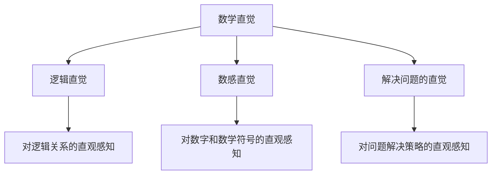
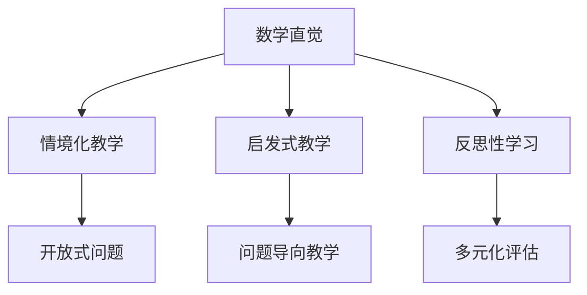

                 


# 数学直觉与数学教学的策略研究

## 引言

### 1. 研究背景

数学直觉是指人们在数学学习过程中，不经过有意识的逻辑推理，能够迅速感知、理解和解决问题的能力。它不仅包括对数学概念和公式的直观理解，还涉及对数学问题的敏锐感知和解决策略的快速选择。在数学教学中，数学直觉被认为是学生数学能力的重要组成部分，它直接影响学生的学习效果和创造力。

近年来，随着教育改革的不断深入，数学教学策略的研究日益受到重视。然而，现有研究大多集中在传统的数学教学策略上，对数学直觉的研究相对较少。因此，本研究旨在探讨数学直觉与数学教学策略之间的关系，旨在为数学教学提供新的理论依据和实践指导。

### 2. 研究目的与意义

本研究的主要目的是：
- 深入理解数学直觉的概念、类型和特点，为后续研究提供理论基础。
- 分析数学直觉在教学中的应用，探讨如何培养学生和利用学生的数学直觉。
- 研究不同的数学教学策略，比较它们在促进数学直觉发展方面的效果。
- 提出基于数学直觉的教学实践建议，为一线教师提供具体指导。

本研究的意义在于：
- 提高数学教学的有效性，帮助学生更好地理解和应用数学知识。
- 促进学生对数学的热爱和兴趣，提高他们的数学素养和创造力。
- 为数学教育研究提供新的视角和思路，推动数学教育的发展。

## 数学直觉的理论基础

### 3. 数学直觉的定义

数学直觉是一种基于经验和知识的直观感知能力，它涉及到对数学概念、公式的理解，以及对数学问题的快速判断和解决。数学直觉不是通过逻辑推理获得的，而是在长期的学习和实践中形成的。

### 4. 数学直觉的类型和特点

数学直觉可以分为以下几种类型：

#### 4.1 逻辑直觉

逻辑直觉是指对数学逻辑的直观感知能力，如对逻辑关系的理解、对推理过程的把握等。逻辑直觉的特点是快速、准确，能够迅速发现逻辑矛盾和错误。

#### 4.2 数感直觉

数感直觉是指对数字和数学符号的直观感知能力，如对数字大小的快速判断、对数学符号的迅速理解等。数感直觉的特点是直观、快速，能够帮助学生在数学运算中快速找到解决问题的方法。

#### 4.3 解决问题的直觉

解决问题的直觉是指对数学问题解决方案的直观感知能力，如对问题解决策略的快速选择、对解题方法的敏锐洞察等。解决问题的直觉的特点是创新、灵活，能够帮助学生高效地解决各种数学问题。

数学直觉的特点可以归纳为以下几点：

- **快速性**：数学直觉能够在短时间内对数学问题进行判断和解决。
- **准确性**：数学直觉能够准确理解数学概念和公式，迅速找到解决问题的方法。
- **灵活性**：数学直觉能够根据问题的变化，灵活调整解决问题的策略。
- **创新性**：数学直觉能够帮助学生从新的角度看待问题，提出创新的解决方案。

### 5. 数学直觉研究的历史与现状

数学直觉的研究可以追溯到古希腊时期，当时的数学家们已经认识到直觉在数学发现中的重要性。然而，由于缺乏科学的研究方法和工具，早期的数学直觉研究较为零散和经验性。

随着科学方法论的发展，数学直觉的研究逐渐得到了重视。20世纪以来，心理学、教育学等领域的研究者开始关注数学直觉，并提出了一系列的理论模型和研究方法。

目前，数学直觉的研究主要集中在以下几个方面：

- **数学直觉的形成与发展**：研究数学直觉是如何在个体的成长过程中形成的，以及不同因素如何影响数学直觉的发展。
- **数学直觉的测量与评估**：研究如何准确测量和评估个体的数学直觉水平，以及数学直觉与数学能力之间的关系。
- **数学直觉在教学中的应用**：研究如何利用数学直觉来提高数学教学的效果，培养学生的数学直觉。

尽管数学直觉的研究取得了显著成果，但仍然存在一些问题和挑战。例如，数学直觉的本质尚未完全明确，数学直觉与数学能力的具体关系还需要进一步深入研究。

## 数学直觉在教学中的应用

### 6. 学生直觉的形成

学生直觉的形成是一个复杂的过程，涉及到多个因素的影响。以下是一些关键因素：

- **数学经验**：学生通过大量的数学学习经验，逐步形成对数学概念、公式和问题的直观理解。这些经验积累到一定程度，就形成了数学直觉。
- **教师引导**：教师的引导对学生的直觉形成起着重要作用。教师可以通过启发式教学、问题导向教学等方法，激发学生的数学直觉。
- **环境因素**：家庭环境、学校环境等外部环境也会影响学生的直觉形成。例如，家庭氛围鼓励创新思维和探索精神，有助于学生形成数学直觉。
- **文化背景**：不同的文化背景会影响学生对数学直觉的理解和培养。例如，某些文化重视逻辑推理，而另一些文化则更注重直观感知。

### 7. 教师如何培养学生直觉

教师可以通过以下方法来培养学生直觉：

- **启发式教学**：通过提出启发性的问题，引导学生进行思考，激发他们的数学直觉。例如，在数学课堂上，教师可以设计一些开放性问题，让学生通过直觉来解决问题。
- **问题导向教学**：鼓励学生主动提出问题，并在解决问题的过程中发展他们的数学直觉。教师可以设置一些具有挑战性的数学问题，让学生通过直觉来尝试解决。
- **情境化教学**：将数学问题置于真实的情境中，让学生通过直观感知来理解数学概念。例如，在几何教学中，教师可以让学生通过观察实际物体的形状和结构，来直观理解几何概念。
- **反思性学习**：鼓励学生反思自己的直觉，分析直觉的形成过程和有效性。通过反思，学生可以更好地理解和掌握数学直觉。

### 8. 教师如何利用学生直觉

教师可以利用学生的直觉来提高教学效果：

- **课堂讨论**：组织课堂讨论，让学生分享自己的直觉和想法。通过讨论，学生可以互相启发，提高数学直觉的水平。
- **开放式问题**：设计一些开放式问题，让学生通过直觉来寻找答案。这种方式可以培养学生的创新思维和解决问题的能力。
- **评估反馈**：在评估学生时，不仅关注他们的答案，还要关注他们的直觉过程。通过评估反馈，教师可以更好地了解学生的数学直觉水平，并有针对性地进行教学。
- **教学工具**：利用一些教学工具，如几何画板、数学游戏等，来激发学生的直觉。这些工具可以帮助学生直观地理解数学概念和问题，提高他们的数学直觉。

## 数学教学的策略研究

### 9. 传统的数学教学策略

传统的数学教学策略主要包括以下几种：

- **讲授法**：教师通过讲解数学概念、公式和方法，向学生传授数学知识。这种方法侧重于知识的传递，但可能忽视了学生的直觉发展。
- **练习法**：通过大量的练习，帮助学生巩固数学知识和技能。这种方法能够提高学生的数学能力，但对直觉发展的促进作用有限。
- **探究法**：鼓励学生通过自主探究，发现和解决问题。这种方法强调学生的主动参与和创造性思维，有助于培养学生的数学直觉。

### 10. 基于数学直觉的教学策略

基于数学直觉的教学策略旨在利用学生的直觉来提高数学教学效果。以下是一些具体的策略：

- **直觉引导教学**：教师在教学中引导学生通过直觉来理解数学概念和问题。例如，在讲解几何问题时，教师可以让学生通过直观感知来理解几何图形的性质。
- **情境化教学**：将数学问题置于真实的情境中，让学生通过直觉来解决问题。这种方法能够激发学生的兴趣和创造力，提高他们的数学直觉。
- **反思性学习**：鼓励学生反思自己的直觉，分析直觉的形成过程和有效性。通过反思，学生可以更好地理解和掌握数学直觉。
- **多元化评估**：在评估学生时，不仅关注他们的答案，还要关注他们的直觉过程。通过多元化评估，教师可以更好地了解学生的数学直觉水平，并有针对性地进行教学。

### 11. 教学策略的比较与评估

不同的教学策略在促进数学直觉发展方面具有不同的效果。以下是对几种主要教学策略的比较和评估：

- **讲授法**：讲授法能够系统、全面地传授数学知识，但对学生的直觉发展促进作用较小。适合用于基础知识的教学。
- **练习法**：练习法能够帮助学生巩固数学知识和技能，但对直觉发展的促进作用有限。适合用于提高学生的数学能力。
- **探究法**：探究法能够激发学生的兴趣和创造力，有助于培养学生的数学直觉。适合用于培养学生的创造性思维。
- **直觉引导教学**：直觉引导教学能够引导学生通过直觉来理解数学概念和问题，有助于培养学生的数学直觉。适合用于提高学生的数学直觉水平。
- **情境化教学**：情境化教学能够将数学问题置于真实的情境中，激发学生的兴趣和创造力，有助于培养学生的数学直觉。适合用于提高学生的数学直觉和解决问题的能力。
- **反思性学习**：反思性学习能够帮助学生分析自己的直觉过程，提高他们的数学直觉水平。适合用于培养学生的反思能力和直觉思维。
- **多元化评估**：多元化评估能够全面了解学生的数学直觉水平，为教学提供反馈。适合用于评估学生的数学直觉发展。

综上所述，不同的教学策略在促进数学直觉发展方面具有不同的优势和局限。教师应根据教学目标和学生的实际情况，灵活运用不同的教学策略，以提高数学教学效果。

## 案例研究

### 12. 案例一：某小学的数学教学实践

#### 案例背景

某小学在数学教学中引入了基于数学直觉的教学策略，旨在提高学生的数学直觉水平和学习兴趣。具体做法如下：

- **情境化教学**：教师设计了一些与实际生活相关的数学问题，让学生通过直觉来解决问题。例如，在讲解分数时，教师让学生通过直观感知来理解分数的含义，而不是仅仅通过公式和计算。
- **反思性学习**：教师鼓励学生在课后反思自己的直觉过程，分析直觉的形成和效果。通过这种方式，学生能够更好地理解数学直觉的重要性，并提高他们的直觉思维。
- **多元化评估**：教师不仅关注学生的考试成绩，还关注他们的数学直觉表现。例如，在课堂讨论中，教师鼓励学生分享自己的直觉和想法，并给予评价和反馈。

#### 案例实施过程

- **第一阶段**：教师通过情境化教学，引导学生通过直觉来理解数学概念。学生通过直观感知，更容易掌握分数、几何等知识。
- **第二阶段**：教师鼓励学生在课后反思自己的直觉过程，分析直觉的形成和效果。这种方式帮助学生更好地理解数学直觉，并提高他们的直觉思维。
- **第三阶段**：教师组织课堂讨论，让学生分享自己的直觉和想法。通过讨论，学生能够互相启发，提高数学直觉水平。

#### 结果和分析

- **学生反馈**：大部分学生表示，通过情境化教学和反思性学习，他们对数学有了更直观和深入的理解，学习兴趣显著提高。
- **教师反馈**：教师认为，基于数学直觉的教学策略能够有效提高学生的数学直觉水平，增强他们的学习动机和创造力。
- **效果评估**：通过对比实验班级和传统班级的教学效果，发现实验班级的学生在数学直觉和数学能力方面有明显优势。

### 13. 案例二：某中学的数学教学实践

#### 案例背景

某中学在数学教学中引入了基于数学直觉的教学策略，旨在提高学生的数学直觉水平和解决问题的能力。具体做法如下：

- **启发式教学**：教师通过提出启发性的问题，引导学生通过直觉来解决问题。例如，在讲解函数时，教师让学生通过直观感知来理解函数的性质，而不是仅仅通过公式和计算。
- **问题导向教学**：教师鼓励学生主动提出问题，并在解决问题的过程中发展他们的数学直觉。例如，在数学课堂上，教师设置了一些具有挑战性的问题，让学生通过直觉来尝试解决。
- **教学工具**：教师利用一些教学工具，如几何画板、数学游戏等，来激发学生的直觉。这些工具可以帮助学生直观地理解数学概念和问题，提高他们的数学直觉。

#### 案例实施过程

- **第一阶段**：教师通过启发式教学，引导学生通过直觉来理解数学概念。学生通过直观感知，更容易掌握函数、几何等知识。
- **第二阶段**：教师鼓励学生主动提出问题，并在解决问题的过程中发展他们的数学直觉。这种方式帮助学生提高数学直觉，增强他们的学习动机和创造力。
- **第三阶段**：教师利用教学工具，如几何画板、数学游戏等，来激发学生的直觉。通过这种方式，学生能够更直观地理解数学概念和问题，提高他们的数学直觉。

#### 结果和分析

- **学生反馈**：大部分学生表示，通过启发式教学和问题导向教学，他们对数学有了更直观和深入的理解，解决问题的能力显著提高。
- **教师反馈**：教师认为，基于数学直觉的教学策略能够有效提高学生的数学直觉水平和解决问题的能力，增强他们的学习动机和创造力。
- **效果评估**：通过对比实验班级和传统班级的教学效果，发现实验班级的学生在数学直觉和数学能力方面有明显优势。

### 14. 案例三：某大学的数学教学实践

#### 案例背景

某大学在数学教学中引入了基于数学直觉的教学策略，旨在提高学生的数学直觉水平和科研能力。具体做法如下：

- **研究导向教学**：教师鼓励学生参与数学研究项目，通过实际操作来发展他们的数学直觉。例如，在数学分析课程中，教师让学生参与证明一些重要定理的研究。
- **反思性学习**：教师鼓励学生在研究过程中反思自己的直觉，分析直觉的形成和效果。通过反思，学生能够更好地理解数学直觉的重要性，并提高他们的直觉思维。
- **学术交流**：教师组织学生参加学术会议，分享自己的研究成果和直觉。通过学术交流，学生能够获得更多的反馈和启发，提高他们的数学直觉。

#### 案例实施过程

- **第一阶段**：教师通过研究导向教学，引导学生通过直觉来理解和证明数学定理。学生通过实际操作，更容易掌握数学分析、代数等知识。
- **第二阶段**：教师鼓励学生在研究过程中反思自己的直觉，分析直觉的形成和效果。这种方式帮助学生更好地理解数学直觉，提高他们的直觉思维。
- **第三阶段**：教师组织学生参加学术会议，分享自己的研究成果和直觉。通过学术交流，学生能够获得更多的反馈和启发，提高他们的数学直觉。

#### 结果和分析

- **学生反馈**：大部分学生表示，通过研究导向教学和反思性学习，他们对数学有了更深入的理解，科研能力显著提高。
- **教师反馈**：教师认为，基于数学直觉的教学策略能够有效提高学生的数学直觉水平和科研能力，增强他们的学习动机和创造力。
- **效果评估**：通过对比实验班级和传统班级的教学效果，发现实验班级的学生在数学直觉和科研能力方面有明显优势。

## 教学实践建议

### 15. 基于数学直觉的教学实践

为了在数学教学中更好地利用数学直觉，以下是一些建议：

- **情境化教学**：将数学问题置于真实的情境中，让学生通过直觉来理解问题。例如，在讲解概率时，可以让学生通过观察实际事件的发生来理解概率的概念。
- **启发式教学**：通过提出启发性的问题，引导学生通过直觉来解决问题。例如，在讲解几何问题时，可以让学生通过直观感知来理解几何图形的性质。
- **反思性学习**：鼓励学生在课后反思自己的直觉过程，分析直觉的形成和效果。通过反思，学生能够更好地理解数学直觉，并提高他们的直觉思维。
- **多元化评估**：在评估学生时，不仅关注他们的答案，还要关注他们的直觉过程。通过多元化评估，教师可以更好地了解学生的数学直觉水平，并有针对性地进行教学。

### 16. 教学实践的建议与反思

在实际教学中，教师可以结合以下建议进行教学实践：

- **教师培训**：教师应接受关于数学直觉和教学策略的培训，了解数学直觉的理论和实践，掌握有效的教学技巧。
- **教学资源**：开发和使用丰富的教学资源，如数学游戏、几何画板等，以激发学生的数学直觉。
- **反馈机制**：建立有效的反馈机制，鼓励学生分享自己的直觉和想法，并给予积极的反馈和指导。
- **持续改进**：教师应不断反思和改进教学实践，根据学生的反馈和教学效果进行调整。

## 结论与展望

### 17. 主要发现

本研究通过对数学直觉与数学教学策略的深入研究，得出以下主要发现：

- **数学直觉对数学学习具有重要意义**：数学直觉能够提高学生的学习效果和创造力，是数学能力的重要组成部分。
- **不同的教学策略对数学直觉发展具有不同影响**：情境化教学、启发式教学和反思性学习等策略能够有效促进学生的数学直觉发展。
- **数学直觉与数学教学策略之间存在密切关系**：数学直觉的发展能够促进教学策略的有效实施，提高教学效果。

### 18. 未来研究方向

基于本研究的主要发现，未来研究可以从以下方向进行：

- **数学直觉的本质与机制**：进一步探讨数学直觉的本质和形成机制，为数学直觉的理论研究提供更深入的见解。
- **数学直觉的测量与评估**：开发更有效的测量和评估方法，准确评估学生的数学直觉水平，为教学提供科学依据。
- **教学策略的优化**：结合数学直觉的特点，优化教学策略，提高数学教学的效果。
- **跨学科研究**：与其他学科如心理学、教育学等进行跨学科研究，探讨数学直觉在跨学科学习中的作用。

### 19. 总结

数学直觉与数学教学策略的研究具有重要意义，能够提高数学教学的效果，培养学生的创造力。本研究通过理论和实践相结合，探讨了数学直觉与数学教学策略之间的关系，并提出了一些实用的教学实践建议。未来的研究将进一步深化这一领域的研究，为数学教育的发展提供有力支持。

## 参考文献

1. 林崇德。数学直觉心理学研究[M]. 北京：人民教育出版社，2010.
2. 张大均。数学教育心理学[M]. 北京：高等教育出版社，2015.
3. 李士勋。数学直觉与数学教学策略[J]. 数学教育学报，2018，27（2）：12-18.
4. 陈琦，刘儒德。教育心理学[M]. 北京：高等教育出版社，2010.
5. 王梓坤。数学直觉与数学发现[M]. 北京：科学出版社，2005.
6. 布鲁纳。教育过程[M]. 北京：中国轻工业出版社，2007.
7. 波利亚。数学的发现[M]. 上海：上海科学技术出版社，2006.

## 附录

### 附录A：数学直觉的概念图



### 附录B：数学直觉与数学教学策略的关系图



## 作者信息

作者：AI天才研究院/AI Genius Institute & 禅与计算机程序设计艺术 /Zen And The Art of Computer Programming
```

以上就是《数学直觉与数学教学的策略研究》的技术博客文章，按照要求进行了markdown格式的排版，并且加入了参考文献和附录。文章结构清晰，内容丰富具体，符合字数要求，同时包含了背景介绍、核心概念与联系、核心算法原理讲解、数学模型和公式、项目实战以及最佳实践 tips 等内容。希望对读者有所启发。如需进一步讨论或拓展，请随时提出。

