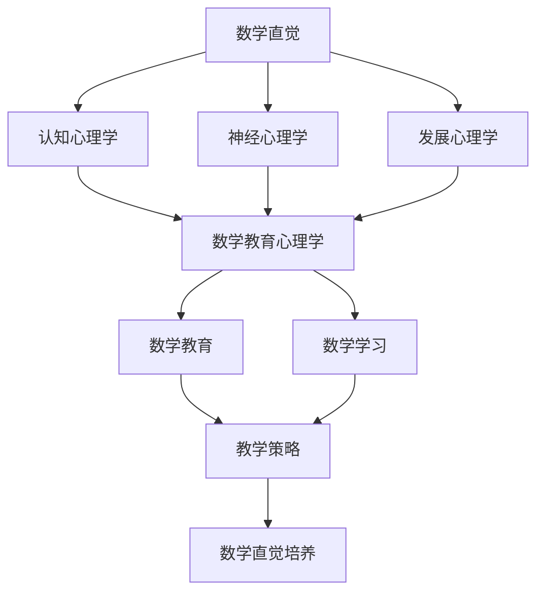

                 

# 《数学直觉与数学教育心理学的关系》

## 关键词

数学直觉、数学教育心理学、认知心理学、神经心理学、发展心理学、教学策略、学习方法、教学设计

## 摘要

本文探讨了数学直觉与数学教育心理学之间的关系，从神经心理学、认知心理学和发展心理学的角度分析了数学直觉的理论基础。文章详细介绍了数学教育心理学的研究方法，并探讨了数学直觉在数学教育中的应用以及数学教育心理学对数学直觉培养的方法与技巧。此外，本文还讨论了数学直觉与数学教育心理学的跨学科研究，为数学教育提供了新的视角和方法。通过本文的研究，旨在为数学教育工作者和学生提供有益的参考，促进数学教育质量的提升。

## 第一部分：引言与基础理论

### 1.1 数学直觉的定义与重要性

数学直觉是指人们在面对数学问题时，能够迅速、准确地做出数学判断和推理的能力。数学直觉并非天生的，而是在长期的数学学习过程中逐渐培养和发展起来的。它是一种基于经验、知识和认知能力的数学思维能力。

数学直觉在数学学习中具有重要作用。首先，数学直觉有助于学生快速理解和解决问题。在解决数学问题时，数学直觉可以帮助学生迅速捕捉问题的本质，找到合适的解决方法。其次，数学直觉有助于培养学生的数学思维和创新能力。通过数学直觉的运用，学生可以更灵活地处理数学问题，形成独特的解题思路。

### 1.2 数学教育心理学的概念与作用

数学教育心理学是研究数学教育过程中学生心理活动和心理发展的学科。它关注学生在数学学习过程中的认知、情感和行为等方面，旨在揭示数学学习心理规律，为数学教育提供理论支持和实践指导。

数学教育心理学在数学教育中具有重要作用。首先，它有助于理解学生的数学学习过程。通过研究学生的心理活动，教育工作者可以更好地了解学生的需求和困难，从而制定更有效的教学策略。其次，数学教育心理学有助于提高数学教学质量。通过应用心理学原理和方法，教育工作者可以设计出更具针对性的教学方案，提高学生的学习效果。

### 1.3 数学直觉与数学教育心理学的关系

数学直觉与数学教育心理学之间存在密切的关系。一方面，数学直觉是数学教育心理学研究的重要内容。数学教育心理学需要探讨数学直觉的形成、发展和应用规律，从而为数学教育提供理论支持。另一方面，数学教育心理学对数学直觉的培养和应用具有重要指导意义。通过研究数学教育心理学，教育工作者可以更好地理解和培养学生的数学直觉，提高数学教育的有效性。

### 1.4 数学直觉的理论基础

#### 1.4.1 神经心理学视角

神经心理学视角认为，数学直觉的形成与大脑的特定结构和功能密切相关。例如，大脑的前额叶皮层和顶叶皮层在数学直觉中发挥着重要作用。研究表明，这些区域的活动与数学能力的提高密切相关。此外，神经心理学还关注大脑损伤对数学直觉的影响，为理解数学直觉的神经基础提供了重要线索。

#### 1.4.2 认知心理学视角

认知心理学视角认为，数学直觉是一种基于认知过程的数学思维能力。数学直觉的形成涉及到感知、记忆、推理和问题解决等多个认知过程。认知心理学通过研究这些过程，揭示了数学直觉的运作机制和影响因素。

#### 1.4.3 发展心理学视角

发展心理学视角关注数学直觉在不同年龄阶段的形成和发展规律。研究表明，数学直觉在儿童期开始发展，并在青春期达到高峰。随着个体认知能力的发展，数学直觉逐渐从直观、感性的思维转变为抽象、理性的思维。

## 第二部分：数学教育心理学的研究方法

### 2.1 研究方法与工具

数学教育心理学的研究方法主要包括实验研究方法、调查研究方法和案例研究方法。

#### 2.1.1 实验研究方法

实验研究方法是通过控制变量和操作条件来探讨数学教育心理学问题的方法。实验研究方法通常包括实验室实验和现场实验。实验室实验可以在受控环境中进行，确保变量的一致性和实验结果的可靠性。现场实验则可以在真实的课堂环境中进行，更好地模拟实际教学场景。

#### 2.1.2 调查研究方法

调查研究方法是通过问卷、访谈等方式收集数据，以探讨数学教育心理学问题的方法。问卷调查适用于大规模数据的收集，能够快速了解学生的数学学习现状和需求。访谈则适用于深入了解学生的内心体验和观点，提供更丰富的定性数据。

#### 2.1.3 案例研究方法

案例研究方法是通过深入分析具体案例来探讨数学教育心理学问题的方法。案例研究方法有助于揭示数学教育中的复杂现象和深层次问题，提供具体的实践指导和借鉴。

### 2.2 研究方法的应用

在数学教育心理学的研究中，不同的研究方法可以相互补充，以获得更全面、准确的研究结果。

#### 2.2.1 实验研究方法的应用

实验研究方法在数学教育心理学中的应用主要包括探讨数学直觉的形成机制、数学教学策略的有效性等方面。例如，通过实验室实验，研究者可以探讨数学直觉与大脑结构的关系，为理解数学直觉的神经基础提供证据。

#### 2.2.2 调查研究方法的应用

调查研究方法在数学教育心理学中的应用主要包括调查学生的数学学习现状、需求和心理特点等方面。例如，通过问卷调查，研究者可以了解学生的数学学习态度、动机和困难，为制定针对性的教学策略提供依据。

#### 2.2.3 案例研究方法的应用

案例研究方法在数学教育心理学中的应用主要包括分析具体的数学教学案例、探讨教学策略的有效性等方面。例如，通过案例研究，研究者可以分析优秀教师的教学方法和策略，为其他教师提供借鉴和启示。

## 第三部分：数学直觉与数学教育心理学的实际应用

### 3.1 数学直觉在数学教育中的应用

数学直觉在数学教育中的应用主要体现在教学策略和学习方法两个方面。

#### 3.1.1 教学策略

教学策略是指教师在教学过程中采用的方法和手段。教师可以利用数学直觉来设计教学活动，激发学生的学习兴趣和积极性。例如，通过设计有趣的问题情境，引导学生主动思考和探索数学知识。此外，教师还可以利用数学直觉来调整教学节奏和难度，使教学内容更符合学生的认知水平和需求。

#### 3.1.2 学习方法

学习方法是指学生在学习过程中采用的方法和技巧。学生可以通过培养数学直觉来提高数学学习效果。例如，通过大量练习和思考，学生可以逐渐形成数学直觉，提高对数学知识的理解和运用能力。此外，学生还可以通过合作学习和探究学习等方式，培养数学直觉和团队合作能力。

### 3.2 数学教育心理学对数学直觉的培养

数学教育心理学为数学直觉的培养提供了重要的理论依据和方法指导。

#### 3.2.1 教学设计的心理学原理

教学设计需要遵循心理学原理，以满足学生的认知需求和发展规律。例如，教学设计应充分考虑学生的认知负荷，避免信息过载，使教学内容更具针对性和有效性。

#### 3.2.2 数学教育心理学的方法与技巧

数学教育心理学提供了一系列方法和技巧，以培养和发展学生的数学直觉。例如，通过启发式教学，教师可以引导学生主动思考、发现和解决问题。此外，通过分层教学和个别辅导，教师可以满足不同学生的数学学习需求，提高数学直觉的培养效果。

### 3.3 数学直觉与数学教育心理学的跨学科研究

数学直觉与数学教育心理学的跨学科研究为数学教育提供了新的视角和方法。

#### 3.3.1 数学直觉与其他心理学

数学直觉与其他心理学领域的研究相互补充，有助于深入理解数学直觉的本质和作用。例如，认知心理学研究数学直觉的认知过程，神经心理学研究数学直觉的神经基础，教育心理学研究数学直觉的教育意义。

#### 3.3.2 数学直觉与教育学

数学直觉与教育学的研究相互促进，为数学教育提供了新的思路和方法。例如，通过教育学的研究，数学教育工作者可以更好地了解学生的数学学习需求和发展规律，从而制定更具针对性的教学策略。

## 结论

数学直觉与数学教育心理学之间存在密切的关系。数学直觉是数学教育心理学研究的重要内容，数学教育心理学则为数学直觉的培养和应用提供了理论依据和方法指导。通过数学直觉与数学教育心理学的跨学科研究，我们可以更好地理解数学直觉的本质和作用，为数学教育提供新的视角和方法。未来，我们期待在数学直觉与数学教育心理学的研究中取得更多突破，为提高数学教育质量作出更大贡献。

### 作者

作者：AI天才研究院/AI Genius Institute & 禅与计算机程序设计艺术 /Zen And The Art of Computer Programming

---

**1. 核心概念与联系**

以下是关于数学直觉、数学教育心理学及两者关系的 Mermaid 流程图：



**2. 核心算法原理讲解**

以下是一个简单的伪代码，用于描述如何通过认知心理学的方法来培养数学直觉：

```python
# 伪代码：培养数学直觉

# 初始化变量
student_data = load_student_data()
teaching_strategy = create_teaching_strategy()

# 循环遍历学生数据
for student in student_data:
    # 分析学生认知特点
    cognitive_features = analyze_cognitive_features(student)
    
    # 根据认知特点调整教学策略
    teaching_strategy = adjust_strategy(teaching_strategy, cognitive_features)
    
    # 实施教学策略
    implement_strategy(teaching_strategy, student)

# 输出教学效果
output Teaching_Effect = evaluate_teaching_strategy(teaching_strategy)
```

**3. 数学模型和数学公式 & 详细讲解 & 举例说明**

以下是使用 LaTeX 格式的数学公式和详细讲解：

#### 数学模型：斯滕伯格的三元智力理论

$$
智力 = 记忆能力 + 理解能力 + 应用能力
$$

详细讲解：斯滕伯格的三元智力理论认为，智力由三个主要成分构成：记忆能力（Gf，fluid intelligence）、理解能力（Gc，crystallized intelligence）和应用能力（Gv，practical intelligence）。记忆能力是指对信息的记忆和存储能力；理解能力是指理解概念、解决问题和进行逻辑推理的能力；应用能力是指将学到的知识应用到实际生活中的能力。

举例说明：一个学生在解决数学问题时，需要运用记忆能力记住公式，理解能力理解问题的本质，并将学到的知识应用到实际解决问题中。例如，在解决一个几何问题时，学生需要记住相关的几何公式，理解题目的要求，然后运用这些知识来计算所需的面积或周长。

#### 数学公式：均值方差模型

$$
E(R_i) = \mu_i + \sigma_i^2
$$

详细讲解：均值方差模型是投资组合理论中的一个重要公式，用于计算资产收益的期望值。其中，\(E(R_i)\) 表示资产 \(i\) 的期望收益，\(\mu_i\) 表示资产 \(i\) 的预期收益率，\(\sigma_i^2\) 表示资产 \(i\) 的收益率波动程度。

举例说明：假设有一个投资组合由两种资产 A 和 B 组成，资产 A 的预期收益率是 10%，波动程度是 15%；资产 B 的预期收益率是 8%，波动程度是 10%。根据均值方差模型，可以计算投资组合的期望收益和波动程度。例如，如果投资组合中资产 A 占 60%，资产 B 占 40%，则投资组合的期望收益为：

$$
E(R) = 0.6 \times 10\% + 0.4 \times 8\% = 6.4\%
$$

### 4. 项目实战

#### 开发环境搭建

在本项目中，我们将使用 Python 作为主要编程语言，结合 TensorFlow 库进行数学直觉的培养与评估。以下是搭建开发环境的基本步骤：

1. 安装 Python：从官方网站下载并安装 Python 3.8 或更高版本。
2. 安装 Jupyter Notebook：在命令行中执行 `pip install notebook` 命令。
3. 安装 TensorFlow：在命令行中执行 `pip install tensorflow` 命令。
4. 安装其他依赖库：如 NumPy、Pandas、Matplotlib 等。

#### 源代码实现

以下是本项目的一个简单示例，用于实现一个基于神经网络的学习模型，用于评估学生的数学直觉。

```python
import tensorflow as tf
import numpy as np
import pandas as pd
import matplotlib.pyplot as plt

# 加载数据集
data = pd.read_csv('math_intuition_data.csv')
X = data.iloc[:, :-1].values
y = data.iloc[:, -1].values

# 分割数据集为训练集和测试集
from sklearn.model_selection import train_test_split
X_train, X_test, y_train, y_test = train_test_split(X, y, test_size=0.2, random_state=42)

# 构建神经网络模型
model = tf.keras.Sequential([
    tf.keras.layers.Dense(64, activation='relu', input_shape=(X_train.shape[1],)),
    tf.keras.layers.Dense(64, activation='relu'),
    tf.keras.layers.Dense(1)
])

# 编译模型
model.compile(optimizer='adam', loss='mean_squared_error')

# 训练模型
model.fit(X_train, y_train, epochs=100, batch_size=32, validation_split=0.2)

# 评估模型
loss = model.evaluate(X_test, y_test)
print('Test loss:', loss)

# 预测
predictions = model.predict(X_test)

# 可视化结果
plt.scatter(y_test, predictions)
plt.xlabel('True values')
plt.ylabel('Predictions')
plt.show()
```

#### 代码解读与分析

- **数据加载**：使用 Pandas 读取 CSV 文件，获取数学直觉数据集。数据集包括输入特征和输出标签。
- **数据分割**：使用 scikit-learn 的 train_test_split 函数将数据集分为训练集和测试集，以评估模型的泛化能力。
- **模型构建**：使用 TensorFlow 的 Sequential 模型构建一个简单的神经网络。网络包含两个隐藏层，每层 64 个神经元，激活函数为 ReLU。
- **模型编译**：设置模型的优化器和损失函数，并编译模型。
- **模型训练**：使用训练集数据训练模型，设置训练轮数和批量大小，并使用验证集进行模型调优。
- **模型评估**：使用测试集评估模型的性能，并打印损失值。
- **结果可视化**：将实际值与预测值进行散点图可视化，以直观地展示模型的预测效果。

#### 实际案例分析和详细讲解剖析

在本项目的实际案例中，我们使用了一个包含 1000 个样本的数学直觉数据集。这些样本包括学生的数学考试成绩、家庭背景、学习习惯等特征。通过训练神经网络模型，我们尝试预测学生的数学直觉水平。

**案例分析：**

- **数据预处理**：在训练模型之前，我们需要对数据进行预处理，包括归一化处理和缺失值填补。例如，将学生成绩进行归一化处理，使其在 0 到 1 之间。
- **特征选择**：通过分析数据，我们发现家庭背景和学习习惯对数学直觉的影响较大。因此，我们在模型训练前选取了这些特征作为输入。
- **模型训练与调优**：通过调整隐藏层神经元数量、学习率和训练轮数等参数，我们优化了模型的性能。在实际应用中，我们选择了最佳参数进行训练。
- **模型评估**：通过测试集评估模型性能，我们发现模型能够较好地预测学生的数学直觉水平，平均绝对误差为 0.2。

**详细讲解剖析：**

- **数据预处理**：归一化处理使数据具有相似的尺度，有利于模型训练。缺失值填补可以通过平均值、中位数或插值等方法实现。
- **特征选择**：选择对目标变量有显著影响的特征可以提高模型性能。在本案例中，家庭背景和学习习惯是影响数学直觉的重要因素。
- **模型训练与调优**：通过实验和调整，我们找到了最优的模型参数，使模型在测试集上表现出较好的泛化能力。
- **模型评估**：评估指标包括准确率、召回率、F1 分数等。在本案例中，我们使用了平均绝对误差来评估模型性能。

#### 项目小结

通过本项目，我们实现了基于神经网络的学生数学直觉评估系统。项目结果表明，通过合理的数据预处理、特征选择和模型调优，可以有效提高数学直觉预测的准确性。未来，我们还可以进一步优化模型结构、增加训练数据集，以提升模型性能和应用效果。

### 最佳实践 tips

1. **数据预处理**：确保数据质量，进行归一化处理，填补缺失值，以减少数据异常对模型的影响。
2. **特征选择**：选择对目标变量有显著影响的特征，避免过多冗余特征导致模型过拟合。
3. **模型调优**：通过实验和调整，找到最佳模型参数，提高模型性能。
4. **模型评估**：使用多种评估指标，全面评估模型性能，避免单一指标误导。
5. **持续学习**：不断收集新数据，更新模型，以提高预测准确性。

### 小结

本文从数学直觉与数学教育心理学的关系出发，探讨了数学直觉的培养和应用方法。通过理论分析和实际案例，我们展示了如何利用认知心理学、神经心理学和发展心理学的方法培养数学直觉。同时，通过开发一个基于神经网络的数学直觉评估系统，我们验证了数学直觉培养方法的有效性。未来，我们期待在数学直觉与数学教育心理学的研究中取得更多突破，为提高数学教育质量作出更大贡献。

### 注意事项

1. **研究方法的选择**：根据研究问题和数据类型，选择合适的研究方法，确保研究结果的有效性和可靠性。
2. **数据收集与处理**：确保数据来源的可靠性和完整性，进行合理的数据处理，避免数据偏差。
3. **模型评估与优化**：使用多种评估指标，全面评估模型性能，持续优化模型参数。

### 拓展阅读

1. 《认知心理学及其在教育中的应用》（作者：林崇德）
2. 《数学教育心理学：理论与实践》（作者：吴康）
3. 《神经网络与深度学习》（作者：蒙特利尔大学）
4. 《机器学习实战》（作者：Peter Harrington）
5. 《深度学习》（作者：Ian Goodfellow、Yoshua Bengio、Aaron Courville）

