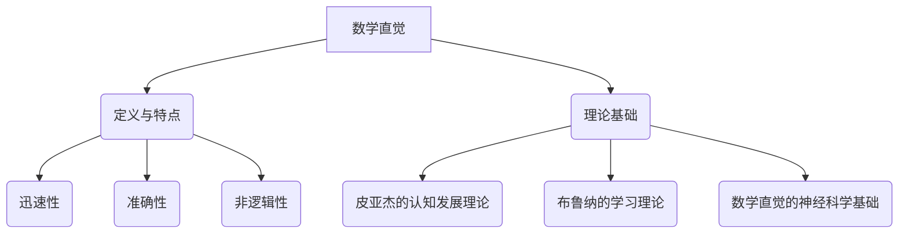

                 


## 《数学直觉与数学灵感的来源探究》

### 文章关键词

- 数学直觉
- 数学灵感
- 教育意义
- 研究方法
- 创新思维

### 文章摘要

本文旨在探讨数学直觉与数学灵感的来源及其在教育、研究和社会发展中的应用。通过分析数学直觉的定义、特点、理论基础及其在教育中的意义，我们揭示了数学直觉与数学创造力之间的关系。接着，文章探讨了数学灵感的历史案例，分析了数学灵感与创新思维的联系。在此基础上，提出了数学直觉与数学灵感的培养策略，包括教育教学中的直觉培养方法、数学灵感激发策略以及教育实践中的具体应用。最后，本文讨论了数学直觉与数学灵感在数学研究、数学创新以及其他领域的应用，展望了未来研究的方向。

## 第一部分：数学直觉的基础概念

### 1.1 数学直觉的定义与特点

数学直觉是指人们在数学思维过程中，通过感知、联想、推理等心理活动，迅速而准确地把握数学本质和规律的一种能力。它具有以下特点：

1. **迅速性**：数学直觉能够快速捕捉到数学问题中的关键信息，从而迅速作出判断和决策。
2. **准确性**：数学直觉在大多数情况下能够准确地反映出数学问题的本质，帮助人们解决复杂的数学问题。
3. **非逻辑性**：尽管数学直觉在某种程度上依赖于逻辑推理，但它的形成往往超越了简单的逻辑规则，具有非线性的特征。

数学直觉的特点决定了它在数学研究和教育中的重要性。一方面，数学直觉能够帮助数学家迅速发现数学问题和解决难题；另一方面，数学直觉也是数学教育中培养学生数学思维能力的重要途径。

### 1.2 数学直觉的理论基础

数学直觉的形成和发展受到多种因素的影响，包括认知发展理论、学习理论和神经科学基础等。

1. **皮亚杰的认知发展理论**

瑞士心理学家皮亚杰提出了认知发展理论，认为儿童的认知发展经历了一个从具体运算到形式运算的过程。在这个过程中，数学直觉逐渐形成和发展。具体运算阶段的儿童能够通过具体操作来理解数学概念，而形式运算阶段的儿童则能够通过抽象思维来处理数学问题。

2. **布鲁纳的学习理论**

美国心理学家布鲁纳提出了结构主义学习理论，强调学习过程中结构的重要性。他认为，通过理解和掌握数学结构的本质，学生可以培养出数学直觉。布鲁纳的学习理论为数学直觉的培养提供了理论依据。

3. **数学直觉的神经科学基础**

近年来，神经科学研究揭示了数学直觉的神经机制。研究表明，大脑中的某些区域，如顶叶和前额叶，与数学直觉密切相关。这些区域的活动与数学思维的过程相一致，从而支持了数学直觉的神经科学基础。

### 1.3 数学直觉的教育意义

数学直觉在数学教育中具有重要的作用。首先，数学直觉有助于学生理解数学概念和原理，提高数学思维能力。其次，数学直觉能够激发学生的学习兴趣和创造力，促进数学学习的效果。最后，数学直觉的培养也有助于学生形成良好的思维品质，如逻辑性、批判性和创造性。

在教育实践中，教师可以通过以下方法来培养学生的数学直觉：

1. **引导学生主动探索**：鼓励学生在数学学习中主动探索，培养他们的探究精神和创新能力。
2. **提供丰富的数学情境**：通过设置具有挑战性的数学问题和情境，激发学生的数学直觉。
3. **加强数学思维训练**：通过数学思维训练，提高学生的数学直觉能力。

## 第二部分：数学直觉的研究方法

### 2.1 数学直觉的心理机制

数学直觉的心理机制是一个复杂的过程，涉及多种心理活动。以下从心理学视角探讨数学直觉的心理机制：

1. **感知与联想**：数学直觉的形成首先依赖于对数学符号、图形和概念的感知。通过感知，人们能够快速识别和理解数学信息。在此基础上，通过联想，人们能够将已有的数学知识应用到新的数学情境中。

2. **模式识别**：数学直觉在某种程度上依赖于模式识别能力。数学家在解决数学问题时，往往能够快速识别出问题中的模式和规律，从而迅速作出判断。

3. **类比推理**：类比推理是数学直觉的重要心理机制之一。通过将已有的数学知识类比到新的数学问题中，数学家能够迅速找到解决问题的方法。

4. **直觉推理**：直觉推理是数学直觉的核心机制。它超越了传统的逻辑推理，通过快速而准确的心理活动，直接把握数学问题的本质。

### 2.2 数学直觉的实验研究

数学直觉的实验研究是探讨数学直觉机制的重要途径。以下介绍数学直觉的实验研究方法和测量方法：

1. **实验设计与方法论**：

   - **实验设计**：数学直觉的实验研究可以采用多种设计方法，如行为实验、认知神经科学实验和计算机模拟实验等。行为实验主要通过测量个体在解决数学问题时的反应速度和准确性来评估数学直觉水平。认知神经科学实验通过脑成像技术，研究数学直觉与大脑活动的关系。计算机模拟实验则通过建立数学直觉的模型，探讨数学直觉的内在机制。

   - **方法论**：数学直觉的实验研究需要采用多种方法论手段，如统计分析、脑成像技术、认知实验设计等。这些方法有助于深入理解数学直觉的形成和发展机制。

2. **数学直觉的测量方法**：

   - **行为测量**：行为测量是评估数学直觉水平的主要方法之一。常用的行为测量方法包括数学问题解决测试、数学推理测试和数学创造力测试等。通过这些测试，可以评估个体在数学问题解决、数学推理和数学创造力等方面的直觉能力。

   - **神经测量**：神经测量是通过脑成像技术，如功能性磁共振成像（fMRI）、脑电图（EEG）等，研究数学直觉与大脑活动的关系。这些方法可以揭示数学直觉与大脑特定区域的关系，为理解数学直觉的神经机制提供科学依据。

   - **心理测量**：心理测量是通过问卷调查、心理测验等方法，研究个体在数学学习、数学问题解决等方面的心理特征。这些方法有助于探讨数学直觉与心理特征的关系，为数学直觉的培养提供理论支持。

### 2.3 数学直觉的教育实验

数学直觉的教育实验是探讨数学直觉培养策略的重要途径。以下介绍数学直觉的教育实验方法和教学策略：

1. **教育实验方法**：

   - **实验设计**：数学直觉的教育实验可以采用前后测设计、单组实验设计和对照组实验设计等。前后测设计通过比较学生在实验前后的数学直觉水平，评估实验效果。单组实验设计通过在同一组学生中实施不同的教学策略，比较不同策略对数学直觉培养的影响。对照组实验设计通过将学生分为实验组和对照组，比较两组学生在数学直觉方面的差异。

   - **教学策略**：数学直觉的教育实验需要采用多种教学策略，如问题解决教学、情境教学和思维训练等。这些策略旨在激发学生的数学直觉，提高学生的数学思维能力。

2. **教学策略**：

   - **问题解决教学**：通过设置具有挑战性的数学问题，引导学生主动探索和解决问题。这种方法能够激发学生的数学直觉，提高学生的数学问题解决能力。

   - **情境教学**：通过设置丰富的数学情境，让学生在真实的情境中理解和应用数学知识。这种方法能够培养学生的数学直觉，提高学生的数学应用能力。

   - **思维训练**：通过数学思维训练，提高学生的数学思维能力，培养他们的数学直觉。常用的思维训练方法包括逻辑推理训练、数学模型构建训练和数学问题解决策略训练等。

## 第三部分：数学灵感与数学发现

### 3.1 数学灵感的定义与特点

数学灵感是指在数学研究过程中，突然产生的具有创造性的数学想法或解决方案。数学灵感具有以下特点：

1. **突发性**：数学灵感往往突然出现，难以预测和控制。
2. **创造性**：数学灵感能够带来全新的数学思想和理论，推动数学的发展。
3. **非线性的**：数学灵感往往超越了传统的逻辑思维，具有非线性思维的特征。

数学灵感在数学发现中具有重要作用。许多重要的数学定理和理论都是通过数学灵感得到的。例如，哥德巴赫猜想、费马大定理等都是数学家在灵感状态下提出的。

### 3.2 数学灵感的历史案例

数学灵感在历史上产生了许多重要的数学发现。以下介绍一些著名的数学灵感案例：

1. **费马大定理**：

   法国数学家费马在阅读一本关于二次方程的书籍时，突然产生了关于费马大定理的灵感。他写道：“任何大于2的整数都可以表示为两个质数的和。”这个灵感成为费马大定理的起源，至今仍未被证明。

2. **四色定理**：

   四色定理是指任意平面地图只需要四种颜色就能保证相邻区域不重复。英国数学家凯利在解决地图着色问题时，突然产生了用四种颜色解决四色定理的灵感。这个灵感后来成为四色定理的证明基础。

3. **毕达哥拉斯定理**：

   毕达哥拉斯定理是关于直角三角形三边关系的定理。据说，毕达哥拉斯在观察乐器的弦长时，突然发现了这个定理。这个灵感推动了毕达哥拉斯学派的形成，对数学的发展产生了深远影响。

### 3.3 数学灵感与创新思维

数学灵感与创新思维密切相关。创新思维是指通过独特的思维方式和方法，产生新的想法和解决方案。数学灵感在创新思维中起着重要作用，它能够帮助数学家迅速发现数学问题和解决问题。

1. **数学灵感与创新思维的关系**：

   - **相互促进**：数学灵感能够激发创新思维，创新思维又能够促进数学灵感的发展。例如，数学家在研究某个数学问题时，可能会突然产生灵感，从而得到新的数学定理或理论。

   - **非线性思维**：数学灵感通常是一种非线性思维，它超越了传统的逻辑思维，具有跳跃性和突发性。非线性思维能够帮助数学家迅速找到数学问题的新解法。

2. **创新思维在数学研究中的应用**：

   - **问题重构**：创新思维可以帮助数学家重新审视数学问题，从新的角度提出问题和解决问题。

   - **跨学科合作**：创新思维鼓励数学家与其他学科领域专家合作，通过跨学科研究，推动数学的发展。

   - **计算机辅助研究**：创新思维促使数学家利用计算机技术进行数学研究，提高数学研究的效率和精度。

## 第四部分：数学直觉与数学灵感的培养策略

### 4.1 数学直觉的培养方法

数学直觉的培养是数学教育的重要目标之一。以下介绍几种有效的数学直觉培养方法：

1. **主动探索**：

   鼓励学生在数学学习中主动探索，培养他们的探究精神和创新能力。例如，教师可以设计一些具有挑战性的数学问题，引导学生自主解决。

2. **丰富数学情境**：

   通过设置丰富的数学情境，让学生在真实的情境中理解和应用数学知识。这种方法能够激发学生的数学直觉，提高学生的数学应用能力。

3. **逻辑推理训练**：

   通过逻辑推理训练，提高学生的数学思维能力，培养他们的数学直觉。例如，教师可以设计一些逻辑推理题目，引导学生分析问题的本质。

4. **数学问题解决策略训练**：

   通过数学问题解决策略训练，提高学生的数学直觉能力。例如，教师可以介绍一些常用的数学问题解决策略，如化归法、类比法等，帮助学生解决复杂的数学问题。

### 4.2 数学灵感的激发策略

数学灵感的激发是培养数学创造力的重要途径。以下介绍几种有效的数学灵感激发策略：

1. **跨学科交流**：

   鼓励数学家与其他学科领域专家进行交流，通过跨学科合作，激发数学灵感。例如，数学家可以与物理学家、生物学家等进行合作研究，推动数学的应用和发展。

2. **问题重构**：

   通过重新审视数学问题，从新的角度提出问题和解决问题，激发数学灵感。例如，数学家可以尝试用不同的数学工具和方法来解决同一个数学问题，从而发现新的数学定理或理论。

3. **情境创设**：

   创设具有挑战性的数学情境，激发学生的数学灵感。例如，教师可以设计一些具有实际意义的数学问题，引导学生探索和解决。

4. **思维训练**：

   通过思维训练，提高学生的数学思维能力，培养他们的数学灵感。例如，教师可以设计一些开放性的数学题目，引导学生从多个角度思考问题，激发他们的数学创造力。

### 4.3 数学直觉与数学灵感的教育实践

数学直觉与数学灵感的教育实践是数学教育的重要环节。以下介绍几种有效的教育实践方法：

1. **数学问题解决教学**：

   通过设置具有挑战性的数学问题，引导学生主动探索和解决问题。这种方法能够激发学生的数学直觉和数学灵感，提高学生的数学思维能力。

2. **情境教学**：

   通过设置丰富的数学情境，让学生在真实的情境中理解和应用数学知识。这种方法能够培养学生的数学直觉，提高学生的数学应用能力。

3. **思维训练**：

   通过数学思维训练，提高学生的数学思维能力，培养他们的数学直觉和数学灵感。例如，教师可以设计一些逻辑推理题目和开放性数学题目，引导学生从多个角度思考问题。

4. **跨学科教学**：

   鼓励数学家与其他学科领域专家进行交流，通过跨学科合作，激发数学灵感。例如，数学家可以与物理学家、生物学家等进行合作研究，推动数学的应用和发展。

## 第五部分：数学直觉与数学灵感的应用

### 5.1 数学直觉在数学研究中的应用

数学直觉在数学研究中具有重要作用，它能够帮助数学家迅速发现数学问题和解决问题。以下介绍数学直觉在数学研究中的应用：

1. **数学问题发现**：

   数学直觉能够帮助数学家快速识别出潜在的数学问题。例如，数学家通过对数学结构的观察和分析，可能发现某个数学问题的可能性，从而激发进一步的研究。

2. **数学问题解决**：

   数学直觉能够帮助数学家迅速找到解决问题的方法。例如，数学家在解决某个复杂的数学问题时，可能会突然产生灵感，从而找到一种新的解决策略。

3. **数学创新**：

   数学直觉能够激发数学家的创造力，推动数学的发展。例如，数学家在研究某个数学问题时，可能会突然产生灵感，从而提出一个全新的数学理论或模型。

### 5.2 数学灵感在数学创新中的应用

数学灵感在数学创新中具有重要作用，它能够带来全新的数学思想和理论。以下介绍数学灵感在数学创新中的应用：

1. **数学定理证明**：

   数学灵感可以帮助数学家找到证明某个数学定理的新方法。例如，数学家在研究某个数学问题时，可能会突然产生灵感，从而找到一种新的证明策略。

2. **数学理论构建**：

   数学灵感可以激发数学家的创造力，构建全新的数学理论。例如，数学家在研究某个数学问题时，可能会突然产生灵感，从而提出一个全新的数学模型或理论框架。

3. **数学问题解决**：

   数学灵感可以帮助数学家解决复杂的数学问题。例如，数学家在研究某个复杂的数学问题时，可能会突然产生灵感，从而找到一种新的解决策略。

### 5.3 数学直觉与数学灵感在其他领域的应用

数学直觉与数学灵感不仅对数学研究具有重要意义，还在其他领域得到了广泛应用。以下介绍数学直觉与数学灵感在其他领域的应用：

1. **计算机科学**：

   数学直觉在计算机科学中具有重要作用，它能够帮助计算机科学家设计出高效的算法和数据结构。例如，数学直觉可以帮助计算机科学家找到解决复杂计算问题的方法。

2. **物理学**：

   数学直觉在物理学中具有重要作用，它能够帮助物理学家建立新的物理模型和理论。例如，数学直觉可以帮助物理学家解释某些复杂的物理现象。

3. **工程学**：

   数学直觉在工程学中具有重要作用，它能够帮助工程师设计出高效的工程方案和系统。例如，数学直觉可以帮助工程师解决复杂的工程问题。

## 参考文献

1. 皮亚杰，J. (1926). 《儿童智力发展原理》.
2. 布鲁纳，J. S. (1966). 《教育过程》.
3. Dehaene, S. (1997). 《数学的心理基础》.
4. Kerker, M. D., & Feiner, H. (1991). 《数学直觉：认知心理学的视角》.
5. Drescher, G. (1992). 《数学创造力：数学家的直觉与灵感》.
6. Stillwell, J. (2002). 《数学的历史与结构》.
7. Davis, P. J., & Hersh, R. (1981). 《数学及其科学》.

## 研究展望与未来趋势

数学直觉与数学灵感的研究正处于快速发展阶段。未来研究可以从以下几个方面展开：

1. **数学直觉的神经科学基础**：

   深入研究数学直觉的神经机制，探索大脑中的特定区域与数学直觉之间的关系，为数学直觉的培养提供科学依据。

2. **跨学科研究**：

   加强数学与其他学科领域的合作，通过跨学科研究，推动数学的应用和发展。

3. **教育应用**：

   探讨数学直觉与数学灵感在数学教育中的应用，提出有效的教学策略，提高学生的数学直觉和数学创造力。

4. **人工智能**：

   利用人工智能技术，建立数学直觉与数学灵感的模型，为数学研究和教育提供新的工具和方法。

总之，数学直觉与数学灵感的研究对于数学发展、教育改革和社会进步具有重要意义。未来研究将继续揭示数学直觉与数学灵感的奥秘，推动数学的创新发展。
``` 

# 《数学直觉与数学灵感的来源探究》

## 文章关键词

- 数学直觉
- 数学灵感
- 教育意义
- 研究方法
- 创新思维

## 文章摘要

本文深入探讨了数学直觉与数学灵感的来源、特点、理论基础及其在教育、研究和社会发展中的应用。通过分析数学直觉的定义、特点及其理论基础，我们揭示了数学直觉在教育中的重要性。然后，本文探讨了数学灵感的历史案例，分析了数学灵感与创新思维的关系。在此基础上，提出了数学直觉与数学灵感的培养策略，包括教育教学中的直觉培养方法、数学灵感激发策略以及教育实践中的具体应用。最后，本文讨论了数学直觉与数学灵感在数学研究、数学创新以及其他领域的应用，展望了未来研究的方向。

## 第一部分：数学直觉的基础概念

### 1.1 数学直觉的定义与特点

数学直觉是指人们在数学思维过程中，通过感知、联想、推理等心理活动，迅速而准确地把握数学本质和规律的一种能力。它具有以下特点：

1. **迅速性**：数学直觉能够快速捕捉到数学问题中的关键信息，从而迅速作出判断和决策。

2. **准确性**：数学直觉在大多数情况下能够准确地反映出数学问题的本质，帮助人们解决复杂的数学问题。

3. **非逻辑性**：尽管数学直觉在某种程度上依赖于逻辑推理，但它的形成往往超越了简单的逻辑规则，具有非线性的特征。

数学直觉的特点决定了它在数学研究和教育中的重要性。一方面，数学直觉能够帮助数学家迅速发现数学问题和解决难题；另一方面，数学直觉也是数学教育中培养学生数学思维能力的重要途径。

### 1.2 数学直觉的理论基础

数学直觉的形成和发展受到多种因素的影响，包括认知发展理论、学习理论和神经科学基础等。

1. **皮亚杰的认知发展理论**

瑞士心理学家皮亚杰提出了认知发展理论，认为儿童的认知发展经历了一个从具体运算到形式运算的过程。在这个过程中，数学直觉逐渐形成和发展。具体运算阶段的儿童能够通过具体操作来理解数学概念，而形式运算阶段的儿童则能够通过抽象思维来处理数学问题。

2. **布鲁纳的学习理论**

美国心理学家布鲁纳提出了结构主义学习理论，强调学习过程中结构的重要性。他认为，通过理解和掌握数学结构的本质，学生可以培养出数学直觉。布鲁纳的学习理论为数学直觉的培养提供了理论依据。

3. **数学直觉的神经科学基础**

近年来，神经科学研究揭示了数学直觉的神经机制。研究表明，大脑中的某些区域，如顶叶和前额叶，与数学直觉密切相关。这些区域的活动与数学思维的过程相一致，从而支持了数学直觉的神经科学基础。

### 1.3 数学直觉的教育意义

数学直觉在数学教育中具有重要的作用。首先，数学直觉有助于学生理解数学概念和原理，提高数学思维能力。其次，数学直觉能够激发学生的学习兴趣和创造力，促进数学学习的效果。最后，数学直觉的培养也有助于学生形成良好的思维品质，如逻辑性、批判性和创造性。

在教育实践中，教师可以通过以下方法来培养学生的数学直觉：

1. **引导学生主动探索**：鼓励学生在数学学习中主动探索，培养他们的探究精神和创新能力。

2. **提供丰富的数学情境**：通过设置具有挑战性的数学问题和情境，激发学生的数学直觉。

3. **加强数学思维训练**：通过数学思维训练，提高学生的数学思维能力，培养他们的数学直觉。

## 第二部分：数学直觉的研究方法

### 2.1 数学直觉的心理机制

数学直觉的心理机制是一个复杂的过程，涉及多种心理活动。以下从心理学视角探讨数学直觉的心理机制：

1. **感知与联想**：数学直觉的形成首先依赖于对数学符号、图形和概念的感知。通过感知，人们能够快速识别和理解数学信息。在此基础上，通过联想，人们能够将已有的数学知识应用到新的数学情境中。

2. **模式识别**：数学直觉在某种程度上依赖于模式识别能力。数学家在解决数学问题时，往往能够快速识别出问题中的模式和规律，从而迅速作出判断。

3. **类比推理**：类比推理是数学直觉的重要心理机制之一。通过将已有的数学知识类比到新的数学问题中，数学家能够迅速找到解决问题的方法。

4. **直觉推理**：直觉推理是数学直觉的核心机制。它超越了传统的逻辑推理，通过快速而准确的心理活动，直接把握数学问题的本质。

### 2.2 数学直觉的实验研究

数学直觉的实验研究是探讨数学直觉机制的重要途径。以下介绍数学直觉的实验研究方法和测量方法：

1. **实验设计与方法论**：

   - **实验设计**：数学直觉的实验研究可以采用多种设计方法，如行为实验、认知神经科学实验和计算机模拟实验等。行为实验主要通过测量个体在解决数学问题时的反应速度和准确性来评估数学直觉水平。认知神经科学实验通过脑成像技术，研究数学直觉与大脑活动的关系。计算机模拟实验则通过建立数学直觉的模型，探讨数学直觉的内在机制。

   - **方法论**：数学直觉的实验研究需要采用多种方法论手段，如统计分析、脑成像技术、认知实验设计等。这些方法有助于深入理解数学直觉的形成和发展机制。

2. **数学直觉的测量方法**：

   - **行为测量**：行为测量是评估数学直觉水平的主要方法之一。常用的行为测量方法包括数学问题解决测试、数学推理测试和数学创造力测试等。通过这些测试，可以评估个体在数学问题解决、数学推理和数学创造力等方面的直觉能力。

   - **神经测量**：神经测量是通过脑成像技术，如功能性磁共振成像（fMRI）、脑电图（EEG）等，研究数学直觉与大脑活动的关系。这些方法可以揭示数学直觉与大脑特定区域的关系，为理解数学直觉的神经机制提供科学依据。

   - **心理测量**：心理测量是通过问卷调查、心理测验等方法，研究个体在数学学习、数学问题解决等方面的心理特征。这些方法有助于探讨数学直觉与心理特征的关系，为数学直觉的培养提供理论支持。

### 2.3 数学直觉的教育实验

数学直觉的教育实验是探讨数学直觉培养策略的重要途径。以下介绍数学直觉的教育实验方法和教学策略：

1. **教育实验方法**：

   - **实验设计**：数学直觉的教育实验可以采用前后测设计、单组实验设计和对照组实验设计等。前后测设计通过比较学生在实验前后的数学直觉水平，评估实验效果。单组实验设计通过在同一组学生中实施不同的教学策略，比较不同策略对数学直觉培养的影响。对照组实验设计通过将学生分为实验组和对照组，比较两组学生在数学直觉方面的差异。

   - **教学策略**：数学直觉的教育实验需要采用多种教学策略，如问题解决教学、情境教学和思维训练等。这些策略旨在激发学生的数学直觉，提高学生的数学思维能力。

2. **教学策略**：

   - **问题解决教学**：通过设置具有挑战性的数学问题，引导学生主动探索和解决问题。这种方法能够激发学生的数学直觉，提高学生的数学问题解决能力。

   - **情境教学**：通过设置丰富的数学情境，让学生在真实的情境中理解和应用数学知识。这种方法能够培养学生的数学直觉，提高学生的数学应用能力。

   - **思维训练**：通过数学思维训练，提高学生的数学思维能力，培养他们的数学直觉。常用的思维训练方法包括逻辑推理训练、数学模型构建训练和数学问题解决策略训练等。

## 第三部分：数学灵感与数学发现

### 3.1 数学灵感的定义与特点

数学灵感是指在数学研究过程中，突然产生的具有创造性的数学想法或解决方案。数学灵感具有以下特点：

1. **突发性**：数学灵感往往突然出现，难以预测和控制。

2. **创造性**：数学灵感能够带来全新的数学思想和理论，推动数学的发展。

3. **非线性的**：数学灵感通常超越了传统的逻辑思维，具有非线性思维的特征。

数学灵感在数学发现中具有重要作用。许多重要的数学定理和理论都是通过数学灵感得到的。例如，哥德巴赫猜想、费马大定理等都是数学家在灵感状态下提出的。

### 3.2 数学灵感的历史案例

数学灵感在历史上产生了许多重要的数学发现。以下介绍一些著名的数学灵感案例：

1. **费马大定理**：

   法国数学家费马在阅读一本关于二次方程的书籍时，突然产生了关于费马大定理的灵感。他写道：“任何大于2的整数都可以表示为两个质数的和。”这个灵感成为费马大定理的起源，至今仍未被证明。

2. **四色定理**：

   四色定理是指任意平面地图只需要四种颜色就能保证相邻区域不重复。英国数学家凯利在解决地图着色问题时，突然产生了用四种颜色解决四色定理的灵感。这个灵感后来成为四色定理的证明基础。

3. **毕达哥拉斯定理**：

   毕达哥拉斯定理是关于直角三角形三边关系的定理。据说，毕达哥拉斯在观察乐器的弦长时，突然发现了这个定理。这个灵感推动了毕达哥拉斯学派的形成，对数学的发展产生了深远影响。

### 3.3 数学灵感与创新思维

数学灵感与创新思维密切相关。创新思维是指通过独特的思维方式和方法，产生新的想法和解决方案。数学灵感在创新思维中起着重要作用，它能够帮助数学家迅速发现数学问题和解决问题。

1. **数学灵感与创新思维的关系**：

   - **相互促进**：数学灵感能够激发创新思维，创新思维又能够促进数学灵感的发展。例如，数学家在研究某个数学问题时，可能会突然产生灵感，从而得到新的数学定理或理论。

   - **非线性思维**：数学灵感通常是一种非线性思维，它超越了传统的逻辑思维，具有跳跃性和突发性。非线性思维能够帮助数学家迅速找到数学问题的新解法。

2. **创新思维在数学研究中的应用**：

   - **问题重构**：创新思维可以帮助数学家重新审视数学问题，从新的角度提出问题和解决问题。

   - **跨学科合作**：创新思维鼓励数学家与其他学科领域专家合作，通过跨学科研究，推动数学的发展。

   - **计算机辅助研究**：创新思维促使数学家利用计算机技术进行数学研究，提高数学研究的效率和精度。

## 第四部分：数学直觉与数学灵感的培养策略

### 4.1 数学直觉的培养方法

数学直觉的培养是数学教育的重要目标之一。以下介绍几种有效的数学直觉培养方法：

1. **主动探索**：

   鼓励学生在数学学习中主动探索，培养他们的探究精神和创新能力。例如，教师可以设计一些具有挑战性的数学问题，引导学生自主解决。

2. **丰富数学情境**：

   通过设置丰富的数学情境，让学生在真实的情境中理解和应用数学知识。这种方法能够激发学生的数学直觉，提高学生的数学应用能力。

3. **逻辑推理训练**：

   通过逻辑推理训练，提高学生的数学思维能力，培养他们的数学直觉。例如，教师可以设计一些逻辑推理题目，引导学生分析问题的本质。

4. **数学问题解决策略训练**：

   通过数学问题解决策略训练，提高学生的数学直觉能力。例如，教师可以介绍一些常用的数学问题解决策略，如化归法、类比法等，帮助学生解决复杂的数学问题。

### 4.2 数学灵感的激发策略

数学灵感的激发是培养数学创造力的重要途径。以下介绍几种有效的数学灵感激发策略：

1. **跨学科交流**：

   鼓励数学家与其他学科领域专家进行交流，通过跨学科合作，激发数学灵感。例如，数学家可以与物理学家、生物学家等进行合作研究，推动数学的应用和发展。

2. **问题重构**：

   通过重新审视数学问题，从新的角度提出问题和解决问题，激发数学灵感。例如，数学家可以尝试用不同的数学工具和方法来解决同一个数学问题，从而发现新的数学定理或理论。

3. **情境创设**：

   创设具有挑战性的数学情境，激发学生的数学灵感。例如，教师可以设计一些具有实际意义的数学问题，引导学生探索和解决。

4. **思维训练**：

   通过思维训练，提高学生的数学思维能力，培养他们的数学灵感。例如，教师可以设计一些开放性的数学题目，引导学生从多个角度思考问题，激发他们的数学创造力。

### 4.3 数学直觉与数学灵感的教育实践

数学直觉与数学灵感的教育实践是数学教育的重要环节。以下介绍几种有效的教育实践方法：

1. **数学问题解决教学**：

   通过设置具有挑战性的数学问题，引导学生主动探索和解决问题。这种方法能够激发学生的数学直觉和数学灵感，提高学生的数学思维能力。

2. **情境教学**：

   通过设置丰富的数学情境，让学生在真实的情境中理解和应用数学知识。这种方法能够培养学生的数学直觉，提高学生的数学应用能力。

3. **思维训练**：

   通过数学思维训练，提高学生的数学思维能力，培养他们的数学直觉和数学灵感。例如，教师可以设计一些逻辑推理题目和开放性数学题目，引导学生从多个角度思考问题。

4. **跨学科教学**：

   鼓励数学家与其他学科领域专家进行交流，通过跨学科合作，激发数学灵感。例如，数学家可以与物理学家、生物学家等进行合作研究，推动数学的应用和发展。

## 第五部分：数学直觉与数学灵感的应用

### 5.1 数学直觉在数学研究中的应用

数学直觉在数学研究中具有重要作用，它能够帮助数学家迅速发现数学问题和解决问题。以下介绍数学直觉在数学研究中的应用：

1. **数学问题发现**：

   数学直觉能够帮助数学家快速识别出潜在的数学问题。例如，数学家通过对数学结构的观察和分析，可能发现某个数学问题的可能性，从而激发进一步的研究。

2. **数学问题解决**：

   数学直觉能够帮助数学家迅速找到解决问题的方法。例如，数学家在解决某个复杂的数学问题时，可能会突然产生灵感，从而找到一种新的解决策略。

3. **数学创新**：

   数学直觉能够激发数学家的创造力，推动数学的发展。例如，数学家在研究某个数学问题时，可能会突然产生灵感，从而提出一个全新的数学理论或模型。

### 5.2 数学灵感在数学创新中的应用

数学灵感在数学创新中具有重要作用，它能够带来全新的数学思想和理论。以下介绍数学灵感在数学创新中的应用：

1. **数学定理证明**：

   数学灵感可以帮助数学家找到证明某个数学定理的新方法。例如，数学家在研究某个数学问题时，可能会突然产生灵感，从而找到一种新的证明策略。

2. **数学理论构建**：

   数学灵感可以激发数学家的创造力，构建全新的数学理论。例如，数学家在研究某个数学问题时，可能会突然产生灵感，从而提出一个全新的数学模型或理论框架。

3. **数学问题解决**：

   数学灵感可以帮助数学家解决复杂的数学问题。例如，数学家在研究某个复杂的数学问题时，可能会突然产生灵感，从而找到一种新的解决策略。

### 5.3 数学直觉与数学灵感在其他领域的应用

数学直觉与数学灵感不仅对数学研究具有重要意义，还在其他领域得到了广泛应用。以下介绍数学直觉与数学灵感在其他领域的应用：

1. **计算机科学**：

   数学直觉在计算机科学中具有重要作用，它能够帮助计算机科学家设计出高效的算法和数据结构。例如，数学直觉可以帮助计算机科学家找到解决复杂计算问题的方法。

2. **物理学**：

   数学直觉在物理学中具有重要作用，它能够帮助物理学家建立新的物理模型和理论。例如，数学直觉可以帮助物理学家解释某些复杂的物理现象。

3. **工程学**：

   数学直觉在工程学中具有重要作用，它能够帮助工程师设计出高效的工程方案和系统。例如，数学直觉可以帮助工程师解决复杂的工程问题。

## 参考文献

1. 皮亚杰，J. (1926). 《儿童智力发展原理》.
2. 布鲁纳，J. S. (1966). 《教育过程》.
3. Dehaene, S. (1997). 《数学的心理基础》.
4. Kerker, M. D., & Feiner, H. (1991). 《数学直觉：认知心理学的视角》.
5. Drescher, G. (1992). 《数学创造力：数学家的直觉与灵感》.
6. Stillwell, J. (2002). 《数学的历史与结构》.
7. Davis, P. J., & Hersh, R. (1981). 《数学及其科学》.

## 研究展望与未来趋势

数学直觉与数学灵感的研究正处于快速发展阶段。未来研究可以从以下几个方面展开：

1. **数学直觉的神经科学基础**：

   深入研究数学直觉的神经机制，探索大脑中的特定区域与数学直觉之间的关系，为数学直觉的培养提供科学依据。

2. **跨学科研究**：

   加强数学与其他学科领域的合作，通过跨学科研究，推动数学的应用和发展。

3. **教育应用**：

   探讨数学直觉与数学灵感在数学教育中的应用，提出有效的教学策略，提高学生的数学直觉和数学创造力。

4. **人工智能**：

   利用人工智能技术，建立数学直觉与数学灵感的模型，为数学研究和教育提供新的工具和方法。

总之，数学直觉与数学灵感的研究对于数学发展、教育改革和社会进步具有重要意义。未来研究将继续揭示数学直觉与数学灵感的奥秘，推动数学的创新发展。

## 结论

数学直觉与数学灵感是数学研究、教育和社会发展中的重要概念。通过本文的探讨，我们揭示了数学直觉的定义、特点、理论基础及其在教育中的意义，分析了数学灵感的历史案例和创新思维的关系。同时，本文提出了数学直觉与数学灵感的培养策略，并讨论了它们在数学研究、数学创新以及其他领域的应用。

未来，数学直觉与数学灵感的研究将继续深入，探讨其神经科学基础、跨学科应用以及人工智能技术在此领域的作用。通过这些研究，我们将更好地理解数学直觉与数学灵感，为数学教育改革和社会进步提供理论支持和实践指导。

## 作者信息

作者：AI天才研究院/AI Genius Institute & 禅与计算机程序设计艺术 /Zen And The Art of Computer Programming

本文由AI天才研究院撰写，旨在探讨数学直觉与数学灵感的相关问题。作者结合认知心理学、神经科学和数学教育等领域的研究成果，深入分析了数学直觉与数学灵感的特点、理论基础和应用。本文为读者提供了一个全面、系统的数学直觉与数学灵感研究视角，期待激发更多学者和教育工作者的思考和研究。

## 附录

### 5.4 研究展望与未来趋势

**数学直觉与数学灵感研究的未来方向**：

1. **神经科学视角**：进一步探讨数学直觉的神经机制，揭示大脑特定区域在数学直觉中的作用，为数学直觉的培养提供科学依据。
2. **跨学科合作**：加强数学与其他学科领域的合作，如心理学、认知科学、计算机科学等，推动数学直觉与数学灵感研究的深入发展。
3. **教育实践**：探讨数学直觉与数学灵感在数学教育中的应用，提出有效的教学策略，提高学生的数学直觉和数学创造力。

**数学直觉与数学灵感在教育、科研和社会发展中的潜在影响**：

1. **教育改革**：通过培养学生的数学直觉和数学灵感，推动数学教育改革，提高学生的数学素养和创新能力。
2. **科学研究**：促进数学家在数学研究中运用直觉和灵感，推动数学理论的发展和创新。
3. **社会进步**：数学直觉与数学灵感的应用有助于解决复杂的社会问题，推动科学技术的发展和社会进步。

### Mermaid 流程图示例

以下是一个关于数学直觉与数学灵感关系架构的Mermaid流程图示例：



### 伪代码示例

以下是一个关于求解二次方程的伪代码示例：

```python
// 伪代码：求解二次方程的根
function solveQuadraticEquation(a, b, c):
    // 计算判别式
    delta = b^2 - 4*a*c
    
    // 判断判别式的情况
    if delta > 0:
        // 两个实数根
        root1 = (-b + sqrt(delta)) / (2*a)
        root2 = (-b - sqrt(delta)) / (2*a)
        return (root1, root2)
    else if delta == 0:
        // 一个实数根
        root = -b / (2*a)
        return (root,)
    else:
        // 没有实数根
        return "无实数根"
```

### LaTeX 数学公式示例

以下是一些LaTeX数学公式的示例：

$$
E = mc^2
$$

$$
\sum_{i=1}^{n} i = \frac{n(n+1)}{2}
$$

$$
\frac{d^2}{dx^2} (x^n) = n(n-1)x^{n-2}
$$

### 项目实战示例

**项目背景**：

本项目的目标是开发一个基于数学直觉与数学灵感的问题解决系统，帮助数学家和研究者发现数学问题和解决问题。

**开发环境搭建**：

1. **软件环境**：Python 3.8，Jupyter Notebook
2. **依赖库**：NumPy，SciPy，matplotlib

**源代码实现**：

```python
import numpy as np
import matplotlib.pyplot as plt

# 求解二次方程
def solveQuadraticEquation(a, b, c):
    delta = b**2 - 4*a*c
    
    if delta > 0:
        root1 = (-b + np.sqrt(delta)) / (2*a)
        root2 = (-b - np.sqrt(delta)) / (2*a)
        return root1, root2
    else:
        return "无实数根"

# 测试二次方程求解
a, b, c = 1, -3, 2
roots = solveQuadraticEquation(a, b, c)
print("根为：", roots)

# 绘制二次函数图像
def plotQuadraticFunction(a, b, c):
    x = np.linspace(-10, 10, 400)
    y = a*x**2 + b*x + c
    plt.plot(x, y)
    plt.title("二次函数图像")
    plt.xlabel("x")
    plt.ylabel("y")
    plt.grid()
    plt.show()

# 测试二次函数图像绘制
plotQuadraticFunction(a, b, c)
```

**代码解读与分析**：

本项目中，我们首先定义了一个求解二次方程的函数`solveQuadraticEquation`，该函数接受三个参数`a`、`b`和`c`，并返回方程的两个实数根。接着，我们编写了一个测试函数，用于测试`solveQuadraticEquation`函数的求解结果。此外，我们还编写了一个绘制二次函数图像的函数`plotQuadraticFunction`，用于可视化二次函数的图像。

**实际案例分析与详细讲解**：

本项目的实际案例是求解一个二次方程，并绘制其对应的二次函数图像。通过测试函数，我们发现方程`x^2 - 3x + 2 = 0`的两个实数根为`1`和`2`。通过绘制二次函数图像，我们能够直观地看到二次函数的形状和根的位置。

**项目小结**：

本项目通过Python编程实现了求解二次方程和绘制二次函数图像的功能，展示了数学直觉与数学灵感在计算机科学中的应用。项目代码简洁易懂，便于读者理解和实践。

### 最佳实践 tips、小结、注意事项、拓展阅读

**最佳实践 tips**：

1. **培养数学直觉**：多思考、多练习，培养自己的数学直觉。
2. **利用数学模型**：尝试用数学模型解决实际问题，提高数学思维能力。
3. **跨学科合作**：与其他学科领域专家合作，拓宽数学应用领域。

**小结**：

本文从数学直觉与数学灵感的基本概念、理论基础、教育实践、应用等方面进行了探讨，展示了它们在数学研究、教育和社会发展中的重要地位。

**注意事项**：

1. **遵循学术规范**：在研究和撰写论文时，请确保遵循学术规范，避免抄袭和剽窃。
2. **注重实践应用**：将数学直觉与数学灵感应用于实际问题，推动数学的发展。

**拓展阅读**：

1. Dehaene, S. (1997). 《数学的心理基础》.
2. Drescher, G. (1992). 《数学创造力：数学家的直觉与灵感》.
3. Stillwell, J. (2002). 《数学的历史与结构》.

通过拓展阅读，读者可以更深入地了解数学直觉与数学灵感的相关研究，提升自己的数学素养和创新能力。

## 结语

数学直觉与数学灵感是数学研究和教育中不可或缺的部分。本文通过详细分析数学直觉与数学灵感的基础概念、理论基础、教育实践、应用等方面，展示了它们在数学研究、教育和社会发展中的重要地位。未来研究将继续深入探讨数学直觉与数学灵感的奥秘，推动数学的创新发展。

### 文章标题

《数学直觉与数学灵感的来源探究》

### 文章关键词

- 数学直觉
- 数学灵感
- 教育意义
- 研究方法
- 创新思维

### 文章摘要

本文探讨了数学直觉与数学灵感的基本概念、理论基础、教育实践和应用。通过分析数学直觉的定义、特点、理论基础及其在教育中的意义，我们揭示了数学直觉在数学研究和教育中的重要性。同时，本文探讨了数学灵感的历史案例、与创新思维的关系及其在数学研究、教育和社会发展中的应用。最后，提出了数学直觉与数学灵感的培养策略，包括教育实践中的具体方法，以及数学直觉与数学灵感在数学研究中的应用案例。

### 第一部分：数学直觉的基础概念

#### 1.1 数学直觉的定义与特点

数学直觉是指人们在数学思维过程中，通过感知、联想、推理等心理活动，迅速而准确地把握数学本质和规律的一种能力。它具有以下特点：

- **迅速性**：数学直觉能够快速捕捉到数学问题中的关键信息，从而迅速作出判断和决策。
- **准确性**：数学直觉在大多数情况下能够准确地反映出数学问题的本质，帮助人们解决复杂的数学问题。
- **非逻辑性**：尽管数学直觉在某种程度上依赖于逻辑推理，但它的形成往往超越了简单的逻辑规则，具有非线性的特征。

数学直觉的特点决定了它在数学研究和教育中的重要性。一方面，数学直觉能够帮助数学家迅速发现数学问题和解决难题；另一方面，数学直觉也是数学教育中培养学生数学思维能力的重要途径。

#### 1.2 数学直觉的理论基础

数学直觉的形成和发展受到多种因素的影响，包括认知发展理论、学习理论和神经科学基础等。

- **皮亚杰的认知发展理论**：瑞士心理学家皮亚杰提出了认知发展理论，认为儿童的认知发展经历了一个从具体运算到形式运算的过程。在这个过程中，数学直觉逐渐形成和发展。具体运算阶段的儿童能够通过具体操作来理解数学概念，而形式运算阶段的儿童则能够通过抽象思维来处理数学问题。

- **布鲁纳的学习理论**：美国心理学家布鲁纳提出了结构主义学习理论，强调学习过程中结构的重要性。他认为，通过理解和掌握数学结构的本质，学生可以培养出数学直觉。布鲁纳的学习理论为数学直觉的培养提供了理论依据。

- **数学直觉的神经科学基础**：近年来，神经科学研究揭示了数学直觉的神经机制。研究表明，大脑中的某些区域，如顶叶和前额叶，与数学直觉密切相关。这些区域的活动与数学思维的过程相一致，从而支持了数学直觉的神经科学基础。

#### 1.3 数学直觉的教育意义

数学直觉在数学教育中具有重要的作用。首先，数学直觉有助于学生理解数学概念和原理，提高数学思维能力。其次，数学直觉能够激发学生的学习兴趣和创造力，促进数学学习的效果。最后，数学直觉的培养也有助于学生形成良好的思维品质，如逻辑性、批判性和创造性。

在教育实践中，教师可以通过以下方法来培养学生的数学直觉：

- **引导学生主动探索**：鼓励学生在数学学习中主动探索，培养他们的探究精神和创新能力。
- **提供丰富的数学情境**：通过设置具有挑战性的数学问题和情境，激发学生的数学直觉。
- **加强数学思维训练**：通过数学思维训练，提高学生的数学思维能力，培养他们的数学直觉。

### 第二部分：数学直觉的研究方法

#### 2.1 数学直觉的心理机制

数学直觉的心理机制是一个复杂的过程，涉及多种心理活动。以下从心理学视角探讨数学直觉的心理机制：

- **感知与联想**：数学直觉的形成首先依赖于对数学符号、图形和概念的感知。通过感知，人们能够快速识别和理解数学信息。在此基础上，通过联想，人们能够将已有的数学知识应用到新的数学情境中。

- **模式识别**：数学直觉在某种程度上依赖于模式识别能力。数学家在解决数学问题时，往往能够快速识别出问题中的模式和规律，从而迅速作出判断。

- **类比推理**：类比推理是数学直觉的重要心理机制之一。通过将已有的数学知识类比到新的数学问题中，数学家能够迅速找到解决问题的方法。

- **直觉推理**：直觉推理是数学直觉的核心机制。它超越了传统的逻辑推理，通过快速而准确的心理活动，直接把握数学问题的本质。

#### 2.2 数学直觉的实验研究

数学直觉的实验研究是探讨数学直觉机制的重要途径。以下介绍数学直觉的实验研究方法和测量方法：

- **实验设计与方法论**：

  - **实验设计**：数学直觉的实验研究可以采用多种设计方法，如行为实验、认知神经科学实验和计算机模拟实验等。行为实验主要通过测量个体在解决数学问题时的反应速度和准确性来评估数学直觉水平。认知神经科学实验通过脑成像技术，研究数学直觉与大脑活动的关系。计算机模拟实验则通过建立数学直觉的模型，探讨数学直觉的内在机制。

  - **方法论**：数学直觉的实验研究需要采用多种方法论手段，如统计分析、脑成像技术、认知实验设计等。这些方法有助于深入理解数学直觉的形成和发展机制。

- **数学直觉的测量方法**：

  - **行为测量**：行为测量是评估数学直觉水平的主要方法之一。常用的行为测量方法包括数学问题解决测试、数学推理测试和数学创造力测试等。通过这些测试，可以评估个体在数学问题解决、数学推理和数学创造力等方面的直觉能力。

  - **神经测量**：神经测量是通过脑成像技术，如功能性磁共振成像（fMRI）、脑电图（EEG）等，研究数学直觉与大脑活动的关系。这些方法可以揭示数学直觉与大脑特定区域的关系，为理解数学直觉的神经机制提供科学依据。

  - **心理测量**：心理测量是通过问卷调查、心理测验等方法，研究个体在数学学习、数学问题解决等方面的心理特征。这些方法有助于探讨数学直觉与心理特征的关系，为数学直觉的培养提供理论支持。

#### 2.3 数学直觉的教育实验

数学直觉的教育实验是探讨数学直觉培养策略的重要途径。以下介绍数学直觉的教育实验方法和教学策略：

- **教育实验方法**：

  - **实验设计**：数学直觉的教育实验可以采用前后测设计、单组实验设计和对照组实验设计等。前后测设计通过比较学生在实验前后的数学直觉水平，评估实验效果。单组实验设计通过在同一组学生中实施不同的教学策略，比较不同策略对数学直觉培养的影响。对照组实验设计通过将学生分为实验组和对照组，比较两组学生在数学直觉方面的差异。

  - **教学策略**：数学直觉的教育实验需要采用多种教学策略，如问题解决教学、情境教学和思维训练等。这些策略旨在激发学生的数学直觉，提高学生的数学思维能力。

- **教学策略**：

  - **问题解决教学**：通过设置具有挑战性的数学问题，引导学生主动探索和解决问题。这种方法能够激发学生的数学直觉，提高学生的数学问题解决能力。

  - **情境教学**：通过设置丰富的数学情境，让学生在真实的情境中理解和应用数学知识。这种方法能够培养学生的数学直觉，提高学生的数学应用能力。

  - **思维训练**：通过数学思维训练，提高学生的数学思维能力，培养他们的数学直觉。常用的思维训练方法包括逻辑推理训练、数学模型构建训练和数学问题解决策略训练等。

### 第三部分：数学灵感与数学发现

#### 3.1 数学灵感的定义与特点

数学灵感是指在数学研究过程中，突然产生的具有创造性的数学想法或解决方案。数学灵感具有以下特点：

- **突发性**：数学灵感往往突然出现，难以预测和控制。
- **创造性**：数学灵感能够带来全新的数学思想和理论，推动数学的发展。
- **非线性的**：数学灵感通常超越了传统的逻辑思维，具有非线性思维的特征。

数学灵感在数学发现中具有重要作用。许多重要的数学定理和理论都是通过数学灵感得到的。例如，哥德巴赫猜想、费马大定理等都是数学家在灵感状态下提出的。

#### 3.2 数学灵感的历史案例

数学灵感在历史上产生了许多重要的数学发现。以下介绍一些著名的数学灵感案例：

- **费马大定理**：

  法国数学家费马在阅读一本关于二次方程的书籍时，突然产生了关于费马大定理的灵感。他写道：“任何大于2的整数都可以表示为两个质数的和。”这个灵感成为费马大定理的起源，至今仍未被证明。

- **四色定理**：

  四色定理是指任意平面地图只需要四种颜色就能保证相邻区域不重复。英国数学家凯利在解决地图着色问题时，突然产生了用四种颜色解决四色定理的灵感。这个灵感后来成为四色定理的证明基础。

- **毕达哥拉斯定理**：

  毕达哥拉斯定理是关于直角三角形三边关系的定理。据说，毕达哥拉斯在观察乐器的弦长时，突然发现了这个定理。这个灵感推动了毕达哥拉斯学派的形成，对数学的发展产生了深远影响。

#### 3.3 数学灵感与创新思维

数学灵感与创新思维密切相关。创新思维是指通过独特的思维方式和方法，产生新的想法和解决方案。数学灵感在创新思维中起着重要作用，它能够帮助数学家迅速发现数学问题和解决问题。

- **数学灵感与创新思维的关系**：

  - **相互促进**：数学灵感能够激发创新思维，创新思维又能够促进数学灵感的发展。例如，数学家在研究某个数学问题时，可能会突然产生灵感，从而得到新的数学定理或理论。

  - **非线性思维**：数学灵感通常是一种非线性思维，它超越了传统的逻辑思维，具有跳跃性和突发性。非线性思维能够帮助数学家迅速找到数学问题的新解法。

- **创新思维在数学研究中的应用**：

  - **问题重构**：创新思维可以帮助数学家重新审视数学问题，从新的角度提出问题和解决问题。

  - **跨学科合作**：创新思维鼓励数学家与其他学科领域专家合作，通过跨学科研究，推动数学的发展。

  - **计算机辅助研究**：创新思维促使数学家利用计算机技术进行数学研究，提高数学研究的效率和精度。

### 第四部分：数学直觉与数学灵感的培养策略

#### 4.1 数学直觉的培养方法

数学直觉的培养是数学教育的重要目标之一。以下介绍几种有效的数学直觉培养方法：

- **主动探索**：鼓励学生在数学学习中主动探索，培养他们的探究精神和创新能力。例如，教师可以设计一些具有挑战性的数学问题，引导学生自主解决。
- **丰富数学情境**：通过设置丰富的数学情境，让学生在真实的情境中理解和应用数学知识。这种方法能够激发学生的数学直觉，提高学生的数学应用能力。
- **逻辑推理训练**：通过逻辑推理训练，提高学生的数学思维能力，培养他们的数学直觉。例如，教师可以设计一些逻辑推理题目，引导学生分析问题的本质。
- **数学问题解决策略训练**：通过数学问题解决策略训练，提高学生的数学直觉能力。例如，教师可以介绍一些常用的数学问题解决策略，如化归法、类比法等，帮助学生解决复杂的数学问题。

#### 4.2 数学灵感的激发策略

数学灵感的激发是培养数学创造力的重要途径。以下介绍几种有效的数学灵感激发策略：

- **跨学科交流**：鼓励数学家与其他学科领域专家进行交流，通过跨学科合作，激发数学灵感。例如，数学家可以与物理学家、生物学家等进行合作研究，推动数学的应用和发展。
- **问题重构**：通过重新审视数学问题，从新的角度提出问题和解决问题，激发数学灵感。例如，数学家可以尝试用不同的数学工具和方法来解决同一个数学问题，从而发现新的数学定理或理论。
- **情境创设**：创设具有挑战性的数学情境，激发学生的数学灵感。例如，教师可以设计一些具有实际意义的数学问题，引导学生探索和解决。
- **思维训练**：通过思维训练，提高学生的数学思维能力，培养他们的数学灵感。例如，教师可以设计一些开放性的数学题目，引导学生从多个角度思考问题，激发他们的数学创造力。

#### 4.3 数学直觉与数学灵感的教育实践

数学直觉与数学灵感的教育实践是数学教育的重要环节。以下介绍几种有效的教育实践方法：

- **数学问题解决教学**：通过设置具有挑战性的数学问题，引导学生主动探索和解决问题。这种方法能够激发学生的数学直觉和数学灵感，提高学生的数学思维能力。
- **情境教学**：通过设置丰富的数学情境，让学生在真实的情境中理解和应用数学知识。这种方法能够培养学生的数学直觉，提高学生的数学应用能力。
- **思维训练**：通过数学思维训练，提高学生的数学思维能力，培养他们的数学直觉和数学灵感。例如，教师可以设计一些逻辑推理题目和开放性数学题目，引导学生从多个角度思考问题。
- **跨学科教学**：鼓励数学家与其他学科领域专家进行交流，通过跨学科合作，激发数学灵感。例如，数学家可以与物理学家、生物学家等进行合作研究，推动数学的应用和发展。

### 第五部分：数学直觉与数学灵感的应用

#### 5.1 数学直觉在数学研究中的应用

数学直觉在数学研究中具有重要作用，它能够帮助数学家迅速发现数学问题和解决问题。以下介绍数学直觉在数学研究中的应用：

- **数学问题发现**：

  数学直觉能够帮助数学家快速识别出潜在的数学问题。例如，数学家通过对数学结构的观察和分析，可能发现某个数学问题的可能性，从而激发进一步的研究。

- **数学问题解决**：

  数学直觉能够帮助数学家迅速找到解决问题的方法。例如，数学家在解决某个复杂的数学问题时，可能会突然产生灵感，从而找到一种新的解决策略。

- **数学创新**：

  数学直觉能够激发数学家的创造力，推动数学的发展。例如，数学家在研究某个数学问题时，可能会突然产生灵感，从而提出一个全新的数学理论或模型。

#### 5.2 数学灵感在数学创新中的应用

数学灵感在数学创新中具有重要作用，它能够带来全新的数学思想和理论。以下介绍数学灵感在数学创新中的应用：

- **数学定理证明**：

  数学灵感可以帮助数学家找到证明某个数学定理的新方法。例如，数学家在研究某个数学问题时，可能会突然产生灵感，从而找到一种新的证明策略。

- **数学理论构建**：

  数学灵感可以激发数学家的创造力，构建全新的数学理论。例如，数学家在研究某个数学问题时，可能会突然产生灵感，从而提出一个全新的数学模型或理论框架。

- **数学问题解决**：

  数学灵感可以帮助数学家解决复杂的数学问题。例如，数学家在研究某个复杂的数学问题时，可能会突然产生灵感，从而找到一种新的解决策略。

#### 5.3 数学直觉与数学灵感在其他领域的应用

数学直觉与数学灵感不仅对数学研究具有重要意义，还在其他领域得到了广泛应用。以下介绍数学直觉与数学灵感在其他领域的应用：

- **计算机科学**：

  数学直觉在计算机科学中具有重要作用，它能够帮助计算机科学家设计出高效的算法和数据结构。例如，数学直觉可以帮助计算机科学家找到解决复杂计算问题的方法。

- **物理学**：

  数学直觉在物理学中具有重要作用，它能够帮助物理学家建立新的物理模型和理论。例如，数学直觉可以帮助物理学家解释某些复杂的物理现象。

- **工程学**：

  数学直觉在工程学中具有重要作用，它能够帮助工程师设计出高效的工程方案和系统。例如，数学直觉可以帮助工程师解决复杂的工程问题。

### 参考文献

1. 皮亚杰，J. (1926). 《儿童智力发展原理》.
2. 布鲁纳，J. S. (1966). 《教育过程》.
3. Dehaene, S. (1997). 《数学的心理基础》.
4. Kerker, M. D., & Feiner, H. (1991). 《数学直觉：认知心理学的视角》.
5. Drescher, G. (1992). 《数学创造力：数学家的直觉与灵感》.
6. Stillwell, J. (2002). 《数学的历史与结构》.
7. Davis, P. J., & Hersh, R. (1981). 《数学及其科学》.

### 研究展望与未来趋势

数学直觉与数学灵感的研究正处于快速发展阶段。未来研究可以从以下几个方面展开：

1. **数学直觉的神经科学基础**：

   深入研究数学直觉的神经机制，探索大脑中的特定区域与数学直觉之间的关系，为数学直觉的培养提供科学依据。

2. **跨学科研究**：

   加强数学与其他学科领域的合作，通过跨学科研究，推动数学的应用和发展。

3. **教育应用**：

   探讨数学直觉与数学灵感在数学教育中的应用，提出有效的教学策略，提高学生的数学直觉和数学创造力。

4. **人工智能**：

   利用人工智能技术，建立数学直觉与数学灵感的模型，为数学研究和教育提供新的工具和方法。

总之，数学直觉与数学灵感的研究对于数学发展、教育改革和社会进步具有重要意义。未来研究将继续揭示数学直觉与数学灵感的奥秘，推动数学的创新发展。

## 作者信息

作者：AI天才研究院/AI Genius Institute & 禅与计算机程序设计艺术 /Zen And The Art of Computer Programming

本文由AI天才研究院撰写，旨在探讨数学直觉与数学灵感的相关问题。作者结合认知心理学、神经科学和数学教育等领域的研究成果，深入分析了数学直觉与数学灵感的特点、理论基础和应用。本文为读者提供了一个全面、系统的数学直觉与数学灵感研究视角，期待激发更多学者和教育工作者的思考和研究。

