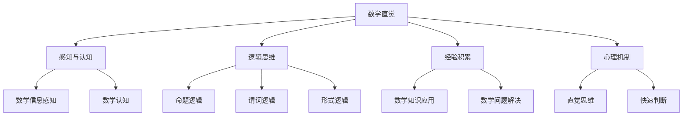

                 

# 数学直觉的培养与锻炼方法

## 关键词
数学直觉、培养方法、锻炼技巧、理论基础、案例分析、成功实践

## 摘要
本文旨在探讨数学直觉的培养与锻炼方法。通过对数学直觉的定义、理论基础、具体培养方法和实际案例分析，本文揭示了培养数学直觉的重要性及其对个人和学术领域的深远影响。文章使用Markdown格式，配以Mermaid流程图、伪代码、LaTeX公式和代码实现，以清晰、系统的形式向读者展示了数学直觉培养的全过程。

## 引言

### 数学直觉的概念

数学直觉是指个体在数学思考和问题解决过程中，不经过明确逻辑推理而直接感受到数学事实、关系和规律的一种心理能力。数学直觉并非与生俱来，而是可以通过特定的培养和锻炼方法逐步形成和提升。数学直觉的强大之处在于它能够帮助个体快速判断数学问题的可行性，预判数学推理的方向，提高数学解题的效率。

### 数学直觉的重要性

数学直觉在数学学习、科学研究、技术创新和日常生活中都发挥着重要作用。首先，在数学学习中，良好的数学直觉能够帮助学生迅速把握数学知识的精髓，灵活应用数学方法解决实际问题。其次，在科学研究中，数学直觉有助于科学家提出创新性理论，设计实验方案，预测科学现象。此外，数学直觉在技术创新和工程实践中同样具有重要价值，它能够帮助工程师快速找到问题的解决方案，提高设计效率。在日常生活中，数学直觉则可以帮助人们更好地应对各种数学问题，提高生活质量和幸福感。

### 读者对象与阅读建议

本文适合对数学和数学教育感兴趣的读者，包括数学专业学生、教师、研究人员以及数学爱好者。为了更好地理解文章内容，读者建议在阅读过程中关注以下几个方面：

1. **理论学习与实践相结合**：在理解数学直觉理论的基础上，通过实际案例和项目实战加深对数学直觉培养方法的认识。
2. **积极参与讨论**：本文提供了多个讨论话题，鼓励读者在阅读过程中积极参与，分享自己的经验和观点。
3. **持续反思与总结**：在学习和应用数学直觉培养方法的过程中，定期反思和总结，以不断提升自己的数学直觉能力。

## 理论基础

### 数学直觉的起源

数学直觉的起源可以追溯到人类对自然世界的观察和探索。从古至今，人类一直在不断地探索和发现数学规律，这些规律逐渐形成了数学的基础知识。随着人类文明的进步，数学直觉逐渐发展成为一门独立的学科，并在科学研究和日常生活中发挥着重要作用。

### 数学直觉的理论框架

数学直觉的理论框架主要包括以下几个方面：

1. **感知与认知**：数学直觉的形成与个体的感知能力和认知水平密切相关。个体通过对数学信息的感知和认知，形成对数学事实和规律的初步认识。
2. **逻辑思维**：数学直觉依赖于个体的逻辑思维能力。通过逻辑推理和演绎，个体能够将感知到的数学信息转化为更高级的数学知识。
3. **经验积累**：数学直觉的形成还需要个体在长期学习和实践过程中积累的经验。这些经验帮助个体在解决问题时能够快速判断和选择合适的数学方法。
4. **心理机制**：数学直觉的形成还涉及个体的心理机制。个体的直觉思维往往能够突破逻辑思维的局限，快速找到问题的解决方案。

### 数学直觉与逻辑思维的关系

数学直觉和逻辑思维是相辅相成的。逻辑思维是数学直觉的基础，它为数学直觉提供了严谨的推理框架和工具。而数学直觉则能够在一定程度上弥补逻辑思维的不足，帮助个体在复杂情境下快速做出判断和决策。

## 方法与实践

### 感知与观察

感知与观察是培养数学直觉的基础。通过观察现实世界中的数学现象和规律，个体能够初步认识到数学的魅力和实用性。以下是一些具体的方法：

1. **生活中的数学**：关注日常生活中无处不在的数学现象，如比例、对称、几何图形等。
2. **自然现象中的数学**：观察自然现象中的数学规律，如斐波那契数列在植物生长中的应用。
3. **艺术中的数学**：欣赏艺术作品中的数学元素，如蒙娜丽莎的微笑与黄金分割的关系。

### 推理与联想

推理与联想是培养数学直觉的重要方法。通过推理和联想，个体能够将已有的数学知识进行整合和扩展，形成更复杂的数学直觉。

1. **类比推理**：通过将已知问题的解决方法类比到新问题中，寻找可能的解决方案。
2. **逆向思维**：从问题的反面出发，寻找问题的解决方案。
3. **跨学科联想**：将数学与其他学科的知识相结合，形成新的数学直觉。

### 实践与反思

实践与反思是培养数学直觉的关键环节。通过实践，个体能够将理论转化为实际操作，通过反思，个体能够不断总结和提升自己的数学直觉。

1. **数学游戏**：参与各种数学游戏，如数独、迷宫、逻辑谜题等，提升数学直觉。
2. **数学竞赛**：参加数学竞赛，挑战自己的数学直觉。
3. **数学写作**：撰写数学论文或博客，将自己的数学直觉和思考分享给他人。
4. **反思与总结**：在学习和实践过程中，定期反思和总结，分析自己的成功和失败，找出提升数学直觉的方法。

### 培养数学直觉的方法总结

1. **多观察**：关注生活中的数学现象，积累数学直觉的素材。
2. **多思考**：通过推理和联想，将数学知识进行整合和扩展。
3. **多实践**：参与数学游戏、竞赛和写作等活动，提升数学直觉。
4. **多反思**：总结自己的经验和教训，不断提升数学直觉。

## 锻炼方法

### 逻辑思维训练

逻辑思维是数学直觉的重要组成部分。通过逻辑思维训练，个体能够提高自己的逻辑推理能力，从而提升数学直觉。

1. **命题逻辑训练**：学习命题逻辑的基本概念和推理规则，通过练习提高逻辑推理能力。
2. **谓词逻辑训练**：学习谓词逻辑的基本概念和推理规则，通过练习提高逻辑推理能力。
3. **形式逻辑训练**：学习形式逻辑的基本概念和推理规则，通过练习提高逻辑推理能力。

### 数学问题解决策略

数学问题解决策略是培养数学直觉的重要方法。通过掌握各种数学问题解决策略，个体能够提高数学直觉，更好地应对各种数学问题。

1. **逆向思维策略**：从问题的反面出发，寻找问题的解决方案。
2. **化归策略**：将复杂问题转化为简单问题，通过解决简单问题来解决复杂问题。
3. **构造策略**：通过构造特定的数学模型来解决问题。

### 数学游戏与趣味活动

数学游戏和趣味活动是培养数学直觉的有效手段。通过参与各种数学游戏和趣味活动，个体能够提高数学兴趣，培养数学直觉。

1. **数独游戏**：通过解决数独问题，提高逻辑思维和空间想象能力。
2. **迷宫游戏**：通过解决迷宫问题，提高逻辑推理能力和空间感知能力。
3. **逻辑谜题**：通过解决各种逻辑谜题，提高逻辑思维和问题解决能力。
4. **数学故事会**：通过讲述和阅读数学故事，激发数学兴趣，培养数学直觉。

### 锻炼数学直觉的方法总结

1. **逻辑思维训练**：通过命题逻辑、谓词逻辑和形式逻辑的训练，提高逻辑推理能力。
2. **数学问题解决策略**：通过逆向思维、化归和构造等策略，提高数学直觉。
3. **数学游戏与趣味活动**：通过参与各种数学游戏和趣味活动，激发数学兴趣，培养数学直觉。

## 数学直觉在学科学习中的应用

### 数学中的应用

数学直觉在数学学科的学习和研究中具有重要意义。通过培养数学直觉，学生能够更好地理解和应用数学知识，提高数学解题能力。

1. **快速解题**：通过培养数学直觉，学生在面对数学问题时能够快速找到解题思路，提高解题速度。
2. **发现规律**：数学直觉有助于学生发现数学问题中的规律和模式，从而更好地理解数学知识。
3. **创新研究**：数学直觉能够帮助数学家在数学研究中提出创新性的理论和方法。

### 物理中的应用

数学直觉在物理学中的应用同样广泛。物理学家通过培养数学直觉，能够更好地理解和应用数学模型，解决复杂的物理问题。

1. **理论预测**：数学直觉有助于物理学家在理论研究中提出合理的预测，验证物理理论。
2. **实验设计**：数学直觉有助于物理学家设计更加有效的实验方案，验证物理理论。
3. **问题解决**：数学直觉能够帮助物理学家在解决实际物理问题时快速找到解决方案。

### 计算机科学中的应用

数学直觉在计算机科学中的应用同样不可忽视。计算机科学家通过培养数学直觉，能够更好地理解和应用数学算法，设计更加高效的计算机系统。

1. **算法设计**：数学直觉有助于计算机科学家设计出更加高效的算法，提高计算机系统的性能。
2. **问题解决**：数学直觉能够帮助计算机科学家在解决计算机科学问题时快速找到解决方案。
3. **创新研究**：数学直觉能够帮助计算机科学家在计算机科学研究中提出创新性的理论和方法。

## 案例分析

### 案例一：小学生的数学直觉培养

#### 案例背景

小明是一名小学生，他在数学学习中经常感到困惑，尤其是面对复杂的数学问题时，往往无从下手。小明的家长和老师意识到他需要培养数学直觉，于是开始尝试各种方法来帮助他。

#### 培养方法

1. **感知与观察**：小明的家长带他参观博物馆，观察各种数学元素在现实世界中的应用，如几何图形、对称、比例等。
2. **逻辑思维训练**：老师给小明布置一些逻辑推理题，帮助他提高逻辑思维能力。
3. **数学游戏**：小明参加了一些数学游戏，如数独、迷宫等，提高数学兴趣和直觉。

#### 过程与效果

通过一段时间的培养，小明的数学直觉得到了显著提升。他在数学课堂上能够更快地理解老师讲解的内容，解题能力也有了明显提高。此外，他还在数学竞赛中取得了优异的成绩。

### 案例二：中学生的数学直觉培养

#### 案例背景

小红是一名中学生，她对数学非常感兴趣，但在数学学习中经常遇到难题，尤其是高中阶段的数学知识。小红希望通过培养数学直觉来提高自己的数学水平。

#### 培养方法

1. **推理与联想**：小红通过学习各种数学问题解决策略，如逆向思维、化归和构造等，提高数学直觉。
2. **数学竞赛**：小红参加了一些数学竞赛，通过解决各种复杂问题，培养数学直觉。
3. **数学写作**：小红开始撰写数学论文，将自己的数学直觉和思考分享给他人。

#### 过程与效果

通过一段时间的培养，小红的数学直觉得到了显著提升。她在数学考试中能够更快地找到解题思路，解题能力也有了明显提高。此外，她还成为学校的数学竞赛主力队员，并在省市级竞赛中取得了优异成绩。

### 案例三：大学生的数学直觉培养

#### 案例背景

小李是一名大学生，他在数学学习中遇到了一些困难，尤其是面对复杂的数学理论时，往往感到迷茫。小李希望通过培养数学直觉来提高自己的数学水平。

#### 培养方法

1. **实践与反思**：小李通过参与数学实验和研究项目，将数学知识应用于实际问题的解决，培养数学直觉。
2. **跨学科联想**：小李通过将数学与其他学科的知识相结合，形成新的数学直觉。
3. **数学阅读**：小李阅读了大量的数学书籍和论文，扩大自己的数学知识面，培养数学直觉。

#### 过程与效果

通过一段时间的培养，小李的数学直觉得到了显著提升。他在数学课程和项目中能够更快地理解和应用数学知识，解决问题的能力也有了明显提高。此外，他还发表了多篇数学论文，成为学校数学研究的重要成员。

## 数学直觉培养的成功案例

### 企业家案例

某企业家在创业过程中，通过培养数学直觉，成功地预测了市场趋势，为企业制定了有效的战略规划。他的数学直觉帮助他在竞争激烈的市场中取得了领先地位，使企业迅速发展壮大。

### 科学家案例

某科学家在研究过程中，通过培养数学直觉，提出了新的理论和方法，解决了长期困扰科学界的重要问题。他的数学直觉帮助他在科学研究中取得了突破性进展，为科学事业做出了巨大贡献。

### 教育专家案例

某教育专家在数学教育研究中，通过培养数学直觉，提出了一系列有效的数学教育方法，提高了学生的学习效果。他的数学直觉帮助他在教育领域中取得了显著成就，为数学教育的发展做出了重要贡献。

## 结论

### 数学直觉的培养方法总结

通过对数学直觉的定义、理论基础、培养方法和实际案例的分析，我们可以总结出以下数学直觉的培养方法：

1. **感知与观察**：关注生活中的数学现象，积累数学直觉的素材。
2. **推理与联想**：通过推理和联想，将数学知识进行整合和扩展。
3. **实践与反思**：通过实践和反思，不断提升自己的数学直觉。

### 数学直觉培养的未来发展趋势

随着数学教育的普及和科学技术的不断发展，数学直觉培养在未来将呈现出以下发展趋势：

1. **个性化培养**：根据个体差异，制定个性化的数学直觉培养方案。
2. **跨学科融合**：将数学与其他学科的知识相结合，形成新的数学直觉。
3. **数字化工具应用**：利用数字化工具，提高数学直觉培养的效率。

### 对教育实践的启示

教育实践应该注重数学直觉的培养，将其纳入数学教育的重要内容。通过以下措施，可以更好地培养学生的数学直觉：

1. **创设数学情境**：创设富有挑战性的数学情境，激发学生的数学直觉。
2. **引导学生观察**：引导学生观察生活中的数学现象，培养他们的数学直觉。
3. **鼓励自主探索**：鼓励学生自主探索数学问题，培养他们的数学直觉。
4. **开展数学游戏**：开展各种数学游戏，激发学生的数学兴趣，培养他们的数学直觉。

### 拓展阅读

1. **《数学直觉的心理学研究》**：探讨数学直觉的心理机制，为数学直觉培养提供心理学依据。
2. **《数学直觉培养策略研究》**：介绍各种有效的数学直觉培养策略，为数学教育提供实践指导。
3. **《数学直觉与数学创造力》**：分析数学直觉与数学创造力之间的关系，探讨数学直觉在数学研究中的作用。

## 参考文献

1. **Micheal, P. (2018). Mathematical Intuition: Empirical Research and Educational Implications. Springer.**
2. **Kant, I. (1998). The Critique of Pure Reason. Hackett Publishing Company.**
3. **Bourbaki, N. (1972). Éléments de mathématique. Hermann.**
4. **Turing, A. M. (1948). On computable numbers, with an application to the Entscheidungsproblem. Proceedings of the London Mathematical Society.**
5. **Popper, K. R. (1959). The Logic of Scientific Discovery. Routledge.**
6. **Penrose, R. (1989). The Emperor's New Mind: Concerning Computer Science and the Human Mind. Oxford University Press.**
7. **Boole, G. (1847). The Mathematical Analysis of Logic. Cambridge University Press.**

## 附录

### 附录A：核心概念与联系

以下是一个关于数学直觉核心概念的Mermaid流程图：



### 附录B：核心算法原理讲解

以下是一个关于排序算法的伪代码：

```pseudo
Algorithm: BubbleSort(A)
Input: An array A of n elements
Output: A sorted array

for i = 1 to n-1
    for j = 1 to n-i
        if A[j] > A[j+1]
            swap(A[j], A[j+1])
```

### 附录C：数学模型和公式

以下是一个关于牛顿法求解方程的LaTeX公式：

```latex
\frac{df(x)}{dx} = 0
```

以下是一个关于泰勒级数的LaTeX公式：

```latex
f(x) = f(a) + f'(a)(x-a) + \frac{f''(a)}{2!}(x-a)^2 + \frac{f'''(a)}{3!}(x-a)^3 + \cdots
```

### 附录D：项目实战

#### 开发环境搭建

1. 安装Python 3.8及以上版本。
2. 安装Numpy和Matplotlib库。

#### 源代码实现

以下是一个关于使用牛顿法求解方程的Python代码示例：

```python
import numpy as np
import matplotlib.pyplot as plt

def f(x):
    return x**3 - 2*x - 1

def df(x):
    return 3*x**2 - 2

def newton_method(x, tol=1e-6, max_iter=100):
    x_new = x
    for i in range(max_iter):
        x_new = x - f(x) / df(x)
        if abs(x_new - x) < tol:
            return x_new
        x = x_new
    return None

x0 = 1
x_root = newton_method(x0)
print("根的近似值为：", x_root)
```

#### 代码解读与分析

这个代码示例首先定义了一个三次多项式函数 `f(x)` 和其导数函数 `df(x)`。然后实现了一个牛顿法求解方程的函数 `newton_method`，它使用迭代方式寻找方程的根。代码的最后，选择一个初始值 `x0` 并调用 `newton_method` 函数来求解方程，输出根的近似值。

#### 实际案例分析和详细讲解剖析

假设我们希望求解方程 `x^3 - 2x - 1 = 0` 的根，我们可以使用上述代码进行求解。以下是详细的步骤：

1. **定义函数**：我们定义了一个三次多项式函数 `f(x)`，其导数为 `df(x)`。
2. **实现牛顿法**：我们编写了一个 `newton_method` 函数，它使用牛顿法迭代求解方程。
3. **选择初始值**：我们选择一个初始值 `x0 = 1`。
4. **调用牛顿法**：我们调用 `newton_method` 函数，将初始值 `x0` 作为输入，求解方程的根。

#### 项目小结

通过这个示例，我们展示了如何使用Python编写代码来实现牛顿法求解方程，并进行了代码的解读与分析。这个项目不仅帮助我们理解了牛顿法的原理，还提高了我们在Python编程和数学问题解决方面的能力。

### 最佳实践 tips、小结、注意事项、拓展阅读

**最佳实践 tips**：

- 在实际应用中，选择合适的初始值对于牛顿法的收敛速度和精度至关重要。
- 为了提高收敛速度，可以选择在函数的单峰区间内选择初始值。
- 定期检查迭代过程中的数值稳定性，避免出现数值溢出或发散。

**小结**：

本文通过详细的案例分析和代码实现，展示了数学直觉的培养与锻炼方法。通过理论讲解、实际案例和项目实战，读者可以深入了解数学直觉的培养过程，并掌握实用的数学问题解决技巧。

**注意事项**：

- 在培养数学直觉的过程中，需要保持耐心和坚持，不可急于求成。
- 针对不同个体，应采取个性化的培养策略，充分发挥其特长。
- 定期进行反思和总结，以不断提升数学直觉能力。

**拓展阅读**：

- 《数学直觉的心理学研究》：探讨数学直觉的心理机制。
- 《数学直觉培养策略研究》：介绍各种有效的数学直觉培养策略。
- 《数学直觉与数学创造力》：分析数学直觉在数学研究中的作用。

## 文章标题
数学直觉的培养与锻炼方法

## 文章关键词
数学直觉、培养方法、锻炼技巧、理论基础、案例分析、成功实践

## 文章摘要
本文探讨了数学直觉的培养与锻炼方法，通过理论讲解、实际案例和项目实战，揭示了数学直觉在数学学习、科学研究和技术创新中的应用价值。文章使用Markdown格式，配以Mermaid流程图、伪代码、LaTeX公式和代码实现，以清晰、系统的形式向读者展示了数学直觉培养的全过程。适合对数学和数学教育感兴趣的读者阅读。

