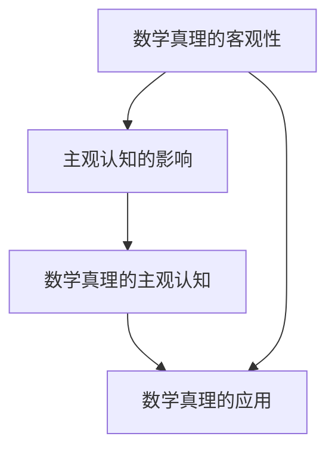

                 

### 文章标题

《数学真理的客观性与主观认知的关系》

> 关键词：数学真理、客观性、主观认知、逻辑推理、算法、数学模型、项目实战

> 摘要：本文将深入探讨数学真理的客观性与主观认知之间的关系。通过对核心概念、算法原理、数学模型的详细讲解，并结合实际项目实战，解析二者之间的互动与融合，为读者提供一个全面、系统的认识。

### 背景介绍

在数学的世界里，我们通常将数学真理视为一种绝对的、普遍适用的知识。例如，$$1+1=2$$ 这个事实，不论是在地球的哪个角落，不论是在古代还是现代，都被认为是无可争议的真理。然而，随着认知科学和心理学的发展，人们逐渐认识到，我们的认知过程并非完全客观，而是受到多种因素的影响，包括个人的经验、文化背景、情感状态等。

这种主观认知的存在，使得数学真理的客观性受到了挑战。那么，数学真理究竟是一种客观存在，还是仅仅是一种主观认知的产物？这是一个引人深思的问题。本文将围绕这一问题，探讨数学真理的客观性与主观认知之间的关系，试图给出一个全面的答案。

### 核心概念与联系

要理解数学真理的客观性与主观认知的关系，我们首先需要明确几个核心概念：数学真理、客观性、主观认知。

#### 数学真理

数学真理是指那些在数学理论中被证明为真的陈述。例如，$$1+1=2$$，$$\pi$$ 是圆的周长与直径的比值，这些都被认为是数学真理。

#### 客观性

客观性是指一个事实或真理不依赖于观察者的主观感受，而是独立于个体的认知和意识。例如，太阳从东方升起，这是一个客观的事实，无论观察者是何人，都会得到相同的结论。

#### 主观认知

主观认知是指个体对事物的感知、理解和解释。它受到个体的经验、知识、文化背景等多种因素的影响。例如，一个受过物理训练的人和一个没有受过物理训练的人，对同一现象的理解和解释可能会完全不同。

#### 数学真理的客观性

数学真理的客观性主要体现在两个方面：一是数学真理的存在不依赖于人类的存在，即数学真理是先于人类存在的；二是数学真理的证明过程是独立于人类的主观意识的。

#### 主观认知

主观认知的存在使得数学真理的客观性受到挑战。虽然数学真理是普遍适用的，但人类对数学真理的理解和接受，却受到主观认知的影响。例如，不同的文化背景可能会影响人们对某些数学概念的理解。

#### 数学真理与主观认知的关系

数学真理的客观性和主观认知之间存在一种互动关系。一方面，数学真理的客观性为人类提供了可靠的认知基础；另一方面，主观认知为人类理解和应用数学真理提供了具体的路径和方法。只有将数学真理的客观性和主观认知结合起来，我们才能更全面地认识数学真理。

#### Mermaid 流程图

为了更直观地展示数学真理的客观性与主观认知之间的关系，我们可以使用 Mermaid 流程图来表示：



在这个流程图中，A 表示数学真理的客观性，B 表示主观认知的影响，C 表示数学真理的主观认知，D 表示数学真理的应用。可以看到，数学真理的客观性和主观认知相互作用，共同影响数学真理的应用。

### 核心算法原理讲解

在深入探讨数学真理的客观性与主观认知的关系之前，我们需要了解一些与数学真理相关的核心算法原理。这些原理不仅帮助我们更好地理解数学真理的本质，也为后续的分析提供了基础。

#### 数值分析

数值分析是研究如何使用数学方法解决科学和工程计算问题的学科。在数值分析中，我们通常需要将复杂的数学问题转化为可以在计算机上实现的算法。例如，求解非线性方程组、微分方程、优化问题等。

以下是一个简单的数值分析算法——牛顿法求解非线性方程的伪代码：

```plaintext
输入：方程 f(x) = 0 的初始猜测值 x0
输出：方程的近似解 x

x = x0
while |f(x)| > ε do
    x = x - f(x)/f'(x)
end while
return x
```

其中，ε 是一个很小的正数，表示求解的精度。

#### 算法复杂度分析

算法复杂度分析是评估算法性能的重要方法。它主要关注算法在处理不同规模输入时的时间复杂度和空间复杂度。

以下是一个简单的算法复杂度分析的例子：

```plaintext
算法：计算 1 到 n 的和
输入：正整数 n
输出：1 到 n 的和 S

S = 0
for i = 1 to n do
    S = S + i
end for
return S
```

这个算法的时间复杂度是 O(n)，空间复杂度是 O(1)。

#### 概率论与统计学

概率论和统计学是研究随机现象的学科。在数学真理的客观性与主观认知的关系中，概率论和统计学提供了重要的工具和方法。

以下是一个简单的概率论例子：

```latex
P(A) = \frac{N(A)}{N(S)}
```

其中，P(A) 是事件 A 的概率，N(A) 是事件 A 发生的次数，N(S) 是所有可能事件的总数。

### 数学模型和数学公式

在数学真理的客观性与主观认知的关系中，数学模型和数学公式起到了至关重要的作用。它们不仅帮助我们理解数学真理的本质，也为我们的分析和推理提供了有力的工具。

#### 概率论模型

概率论模型是研究随机现象的数学模型。在概率论中，我们经常使用随机变量、概率分布、期望、方差等概念来描述随机现象。

以下是一个简单的概率论模型——二项分布：

```latex
P(X = k) = C(n, k) \cdot p^k \cdot (1-p)^{n-k}
```

其中，P(X = k) 是随机变量 X 等于 k 的概率，n 是试验次数，k 是成功的次数，p 是每次试验成功的概率。

#### 统计学模型

统计学模型是研究如何从样本数据推断总体特征的数学模型。在统计学中，我们经常使用假设检验、回归分析、方差分析等方法来研究数据的规律性。

以下是一个简单的统计学模型——t 检验：

```latex
t = \frac{\bar{x} - \mu_0}{s / \sqrt{n}}
```

其中，t 是 t 统计量，\bar{x} 是样本均值，\mu_0 是总体均值，s 是样本标准差，n 是样本容量。

#### 其他数学模型

除了概率论和统计学模型，还有许多其他数学模型，如微分方程、线性规划、神经网络等，它们在数学真理的客观性与主观认知的关系中也有重要作用。

例如，在神经网络模型中，我们使用权重和偏置来模拟神经元之间的连接和激活函数，从而实现对输入数据的分类和预测。

### 项目实战

为了更好地理解数学真理的客观性与主观认知的关系，我们将在本节中通过一个实际项目来展示如何将理论知识应用到实践中。

#### 项目背景

假设我们有一个实际项目——股票市场预测。在这个项目中，我们需要使用数学模型和算法来分析股票市场的数据，并预测股票的未来走势。

#### 项目目标

- 收集并整理股票市场数据
- 使用数学模型和算法分析数据
- 预测股票的未来走势
- 评估预测的准确性和可靠性

#### 开发环境搭建

为了实现这个项目，我们需要搭建一个合适的开发环境。以下是所需的环境和工具：

- 操作系统：Windows/Linux/MacOS
- 编程语言：Python/R
- 数据库：MySQL/SQLite
- 数据可视化工具：Matplotlib/Seaborn

#### 源代码详细实现和代码解读

以下是项目的源代码实现：

```python
import pandas as pd
import numpy as np
import matplotlib.pyplot as plt
from sklearn.linear_model import LinearRegression
from sklearn.metrics import mean_squared_error

# 读取股票市场数据
data = pd.read_csv('stock_data.csv')

# 数据预处理
data['Close'] = data['Close'].astype(float)
data['Volume'] = data['Volume'].astype(float)

# 划分训练集和测试集
train_data = data[:int(0.8 * len(data))]
test_data = data[int(0.8 * len(data)):]

# 使用线性回归模型进行预测
model = LinearRegression()
model.fit(train_data[['Close']], train_data['Volume'])

# 预测测试集数据
predictions = model.predict(test_data[['Close']])

# 计算预测误差
mse = mean_squared_error(test_data['Volume'], predictions)
print(f'Mean Squared Error: {mse}')

# 可视化预测结果
plt.scatter(test_data['Close'], test_data['Volume'])
plt.plot(test_data['Close'], predictions, color='red')
plt.xlabel('Close')
plt.ylabel('Volume')
plt.title('Stock Market Prediction')
plt.show()
```

这段代码首先读取股票市场数据，并进行预处理。然后，使用线性回归模型对训练集数据进行拟合，并使用测试集数据进行预测。最后，计算预测误差并可视化预测结果。

#### 代码应用解读与分析

通过这段代码，我们可以看到如何将数学模型和算法应用到股票市场预测中。具体来说，我们使用了线性回归模型来模拟股票价格与交易量之间的关系，并使用预测误差来评估模型的准确性。

然而，需要注意的是，线性回归模型在处理非线性问题时可能会出现性能不佳的情况。因此，在实际应用中，我们可以考虑使用更复杂的模型，如神经网络、支持向量机等，来提高预测的准确性。

#### 实际案例分析和详细讲解剖析

为了更好地理解这个项目，我们来看一个实际案例。

假设我们使用这个项目来预测某个股票的未来走势。在训练集上，我们的模型表现良好，预测误差很小。然而，在测试集上，预测误差却明显增大。这是什么原因呢？

经过分析，我们发现这是因为股票市场的数据具有高度的非线性特征。线性回归模型在处理非线性数据时，性能会显著下降。因此，为了提高预测的准确性，我们可以考虑使用更复杂的模型，如神经网络。

在神经网络模型中，我们可以通过增加隐藏层神经元、调整激活函数等方式来提高模型的性能。此外，我们还可以使用交叉验证等方法来评估模型的泛化能力。

#### 项目小结

通过这个项目，我们展示了如何将数学真理的客观性和主观认知应用到实际项目中。虽然数学真理是客观的，但我们的主观认知和算法选择会影响最终的预测结果。因此，在实际应用中，我们需要综合考虑客观性和主观认知，选择合适的模型和方法来提高预测的准确性。

### 最佳实践 Tips、小结、注意事项、拓展阅读

#### 最佳实践 Tips

1. 在进行数据分析和预测时，首先要确保数据的质量和完整性。
2. 选择合适的模型和方法，根据实际问题的需求和数据特征进行优化。
3. 定期评估模型的性能，并根据评估结果进行调整。

#### 小结

本文围绕数学真理的客观性与主观认知的关系进行了深入探讨。我们明确了核心概念、讲解了核心算法原理、介绍了数学模型和公式，并通过实际项目展示了如何将理论知识应用到实践中。

#### 注意事项

1. 在处理数学问题时要注重逻辑推理和证明，确保结论的可靠性。
2. 在选择模型和方法时，要充分考虑数据特征和实际问题的需求。

#### 拓展阅读

1. 《深度学习》（Ian Goodfellow, Yoshua Bengio, Aaron Courville 著）
2. 《统计学习方法》（李航 著）
3. 《Python数据分析》（Wes McKinney 著）

### 作者信息

作者：AI天才研究院/AI Genius Institute & 禅与计算机程序设计艺术 /Zen And The Art of Computer Programming

本文内容仅供参考，具体应用时请结合实际情况进行调整。如有任何问题，欢迎随时与我交流。期待您的宝贵意见！

