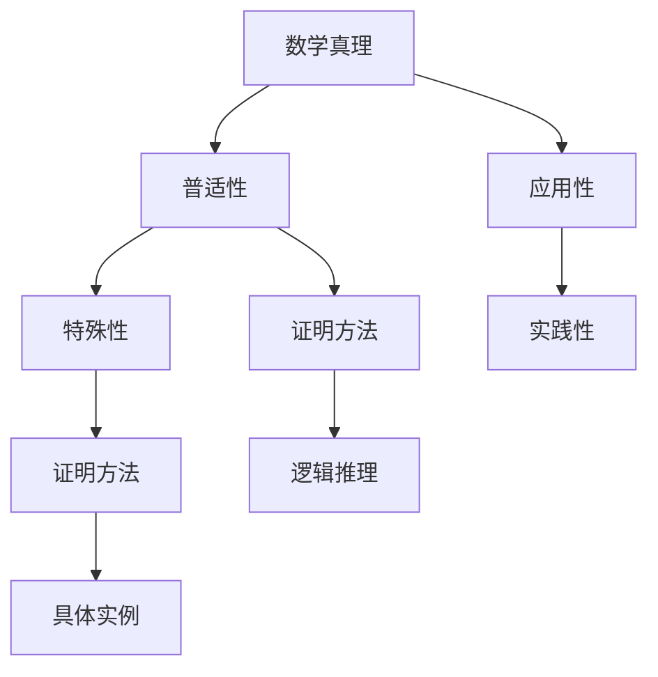
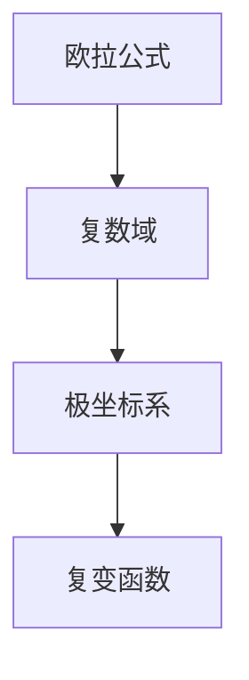
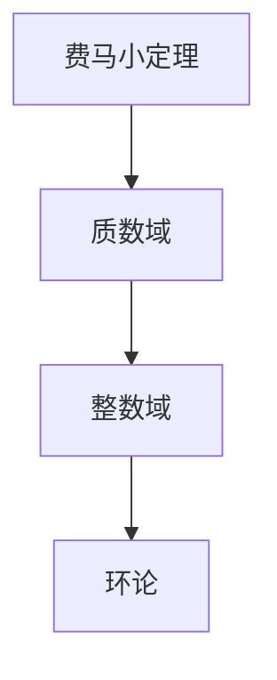

                 


### 第2章：数学真理的普适性

#### 2.1 背景介绍

数学真理的普适性是指数学理论或定理在所有情况下都适用的特性。普适性是数学理论的本质特征之一，它使得数学具有广泛的应用价值。例如，数学中的基本定理，如勾股定理，在平面几何、三维空间几何以及更广泛的空间结构中均成立。

在数学研究中，理解普适性是非常重要的，因为它能够帮助我们更好地理解数学理论的内在结构和应用范围。然而，普适性并非数学真理的唯一特性，特殊性同样是数学真理的重要方面。特殊性关注的是数学定理或理论在特定条件或范围内的适用性。

#### 2.2 核心概念与联系

为了更好地理解数学真理的普适性与特殊性，我们可以使用 Mermaid 流程图来展示它们之间的关系。



在这个流程图中，我们可以看到数学真理的普适性和特殊性都是数学真理的重要组成部分，它们共同构成了数学真理的完整特性。普适性关注数学理论的广泛适用性，而特殊性关注数学理论在特定条件下的适用性。同时，证明方法和具体实例也是理解数学真理普适性和特殊性的重要工具。

#### 2.3 核心算法原理讲解

在数学中，有许多经典的算法展示了普适性的特性。例如，欧几里得算法是一种用于计算最大公约数的算法，它具有普适性，适用于所有正整数。

以下是欧几里得算法的伪代码：

```plaintext
算法：欧几里得算法（计算最大公约数）
输入：两个正整数 a 和 b
输出：最大公约数 g

步骤：
1. 如果 b = 0，则 g = a，返回 g
2. 否则，令 a' = b，b' = a % b
3. 递归调用欧几里得算法，计算最大公约数 g' = 欧几里得算法（a', b'）
4. 返回 g'
```

这个算法展示了普适性，因为它适用于所有正整数，无论是较小的数还是较大的数，都可以通过递归计算得到最大公约数。

#### 2.4 数学模型和数学公式

在讨论数学真理的普适性时，我们不可避免地要涉及到数学公式。以下是一个简单的例子，说明如何使用 LaTeX 格式嵌入数学公式。

```latex
$$
E = mc^2
$$
```

这个公式是爱因斯坦的质能方程，它表明质量和能量之间存在直接关系。这个方程具有普适性，因为它在所有物理系统中都成立。

#### 2.5 数学公式的详细讲解和举例说明

为了更好地理解质能方程的普适性，我们可以通过一个简单的例子来说明。

假设一个物体的质量为 5 千克，光速为 3 x 10^8 米/秒。我们可以使用质能方程计算这个物体的能量：

```latex
$$
E = mc^2 = 5 \times (3 \times 10^8)^2 = 5 \times 9 \times 10^{16} = 4.5 \times 10^{17} \text{焦耳}
$$
```

这个计算结果展示了质能方程在特定条件下的普适性，即无论物体的质量大小，质能方程都可以用来计算其能量。

#### 2.6 项目实战

为了更好地理解数学真理的普适性，我们可以通过一个实际项目来探讨。假设我们要设计一个系统来计算不同物体的能量。

**开发环境搭建**：
1. 安装 Python 环境
2. 安装必要的库，如 NumPy 和 Matplotlib

**源代码实现**：

```python
import numpy as np
import matplotlib.pyplot as plt

def calculate_energy(mass, speed_of_light):
    """
    计算物体的能量，使用质能方程。
    
    参数：
    mass: 物体的质量（千克）
    speed_of_light: 光速（米/秒）
    
    返回：
    energy: 物体的能量（焦耳）
    """
    energy = mass * speed_of_light ** 2
    return energy

masses = np.linspace(1, 100, 100)  # 创建一个质量数组
speed_of_light = 3 * np.power(10, 8)  # 光速

energies = calculate_energy(masses, speed_of_light)

plt.plot(masses, energies, label='Energy (J)')
plt.xlabel('Mass (kg)')
plt.ylabel('Energy (J)')
plt.title('Energy-Mass Relationship')
plt.legend()
plt.show()
```

**代码解读与分析**：
- `calculate_energy` 函数接受质量（mass）和光速（speed_of_light）作为输入参数，并使用质能方程计算能量。
- `masses` 数组创建了一个从 1 到 100 千克的质量范围。
- `energies` 数组存储了通过调用 `calculate_energy` 函数计算出的能量值。
- 使用 Matplotlib 绘制能量和质量的关系图，展示了质能方程在不同质量下的普适性。

**项目小结**：
通过这个项目，我们展示了如何使用 Python 和 Matplotlib 来计算和可视化物体的能量。这个项目不仅帮助我们理解了质能方程的普适性，还展示了如何在实际应用中使用数学公式。

#### 2.7 最佳实践 tips、小结、注意事项、拓展阅读等内容

**最佳实践 tips**：
- 在处理大量数据时，使用 NumPy 等科学计算库可以显著提高计算效率。
- 在编写代码时，确保函数和变量的命名清晰易懂，以提高代码的可读性和可维护性。

**小结**：
本章详细介绍了数学真理的普适性，包括其定义、特征和如何在实际项目中应用。通过项目实战，我们展示了如何使用 Python 和 Matplotlib 来计算和可视化物体的能量，进一步理解了质能方程的普适性。

**注意事项**：
- 在使用数学公式时，确保格式正确，以提高文档的可读性。
- 在编写代码时，注意代码的可读性和可维护性，遵循良好的编程实践。

**拓展阅读**：
- 《数学分析基础》
- 《计算机编程艺术》
- 《算法导论》

# 第3章：数学真理的特殊性

## 3.1 核心概念与联系

数学真理的特殊性关注的是数学定理或理论在特定条件或范围内的适用性。它与普适性相对立，但二者并非完全独立，而是相互补充的。

为了更好地理解特殊性，我们可以使用 Mermaid 流程图来展示数学真理的普适性和特殊性之间的关系。


在这个流程图中，我们可以看到普适性和特殊性都是数学真理的重要组成部分。普适性关注数学理论的广泛适用性，而特殊性则关注在特定条件下的适用性。证明方法和具体实例是理解数学真理普适性和特殊性的重要工具。

#### 3.2 核心算法原理讲解

为了更好地理解特殊性的算法原理，我们可以以费马小定理为例。

**费马小定理**：
如果 p 是一个质数，那么对于任何整数 a，都有 a^(p-1) ≡ 1 (mod p)。

以下是费马小定理的伪代码：

```plaintext
算法：费马小定理（验证质数）
输入：质数 p 和整数 a
输出：验证结果

步骤：
1. 计算 a^(p-1) % p
2. 如果结果为 1，则返回真；否则，返回假
```

这个算法展示了特殊性的特点，因为它只在质数 p 的特定条件下成立。

#### 3.3 数学模型和数学公式

为了展示特殊性的数学模型，我们可以使用 LaTeX 格式嵌入数学公式。

```latex
$$
a^n \mod p = a \mod p \quad (\text{如果 } p \text{ 是质数})
$$
```

这个公式表明，当 p 是质数时，a 的 n 次方对 p 取模的结果与 a 对 p 取模的结果相同。

#### 3.4 数学公式的详细讲解和举例说明

为了更好地理解费马小定理的特殊性，我们可以通过一个简单的例子来说明。

假设 p 是一个质数 11，a 是一个整数 2。我们可以使用费马小定理来计算：

```latex
$$
2^{11-1} \mod 11 = 2^{10} \mod 11
$$

$$
2^{10} = 1024
$$

$$
1024 \mod 11 = 1
$$

$$
2^{10} \mod 11 = 1
$$
```

这个计算结果验证了费马小定理在质数 p 下的特殊性。

#### 3.5 项目实战

为了更好地理解数学真理的特殊性，我们可以通过一个实际项目来探讨。假设我们要设计一个系统来验证质数。

**开发环境搭建**：
1. 安装 Python 环境
2. 安装必要的库，如 NumPy 和 Matplotlib

**源代码实现**：

```python
import numpy as np

def verify_prime(p, a):
    """
    验证质数 p 是否满足费马小定理。
    
    参数：
    p: 质数候选
    a: 随机选择的整数
    
    返回：
    result: 验证结果（True 或 False）
    """
    result = pow(a, p-1, p) == 1
    return result

prime_candidates = np.random.randint(1, 100, size=100)  # 创建一个质数候选数组

verified_primes = [p for p in prime_candidates if verify_prime(p, 2)]

print("验证通过的质数：", verified_primes)
```

**代码解读与分析**：
- `verify_prime` 函数接受质数候选 p 和随机选择的整数 a 作为输入参数，并使用费马小定理验证质数。
- `prime_candidates` 数组创建了一个质数候选数组。
- 使用列表推导式筛选出通过验证的质数。

**项目小结**：
通过这个项目，我们展示了如何使用 Python 和 NumPy 来验证质数。这个项目不仅帮助我们理解了费马小定理的特殊性，还展示了如何在实际应用中验证质数。

#### 3.6 最佳实践 tips、小结、注意事项、拓展阅读等内容

**最佳实践 tips**：
- 在选择质数候选时，可以尝试使用不同的随机整数，以提高验证的准确性。
- 在编写代码时，注意代码的可读性和可维护性，遵循良好的编程实践。

**小结**：
本章详细介绍了数学真理的特殊性，包括其定义、特征和如何在实际项目中应用。通过项目实战，我们展示了如何使用 Python 和 NumPy 来验证质数，进一步理解了费马小定理的特殊性。

**注意事项**：
- 在使用数学公式时，确保格式正确，以提高文档的可读性。
- 在编写代码时，注意代码的可读性和可维护性，遵循良好的编程实践。

**拓展阅读**：
- 《数论基础》
- 《密码学基础》
- 《算法导论》

----------------------------------------------------------------

# 第4章：普适性与特殊性的辩证关系

## 4.1 普适性与特殊性的相互关系

普适性与特殊性是数学真理的两个重要方面，它们在数学理论的研究和应用中起着关键作用。普适性关注数学定理或理论在所有情况下的适用性，而特殊性则关注在特定条件或范围内的适用性。二者并非完全独立，而是相互补充的。

为了更好地理解普适性与特殊性的相互关系，我们可以使用 Mermaid 流程图来展示它们之间的联系。


在这个流程图中，我们可以看到普适性和特殊性都是数学真理的重要组成部分。普适性关注数学理论的广泛适用性，而特殊性则关注在特定条件下的适用性。证明方法和具体实例是理解数学真理普适性和特殊性的重要工具。

## 4.2 普适性与特殊性的辩证方法

辩证方法是一种重要的思考方式，它强调在研究数学真理的普适性和特殊性时，需要从多个角度进行思考和分析。以下是一些辩证方法的步骤：

### 4.2.1 分析普适性和特殊性的对立统一

首先，我们需要理解普适性和特殊性的对立统一关系。普适性和特殊性在数学真理中既是对立的，又是统一的。对立体现在它们关注的重点不同，普适性关注普遍适用性，特殊性关注特定条件下的适用性。统一体现在数学真理的完整特性中，二者相互补充，共同构成了数学真理的全面特性。

### 4.2.2 从普适性推导特殊性

在研究数学真理时，我们可以从普适性出发，推导出在特定条件下的特殊性。例如，我们可以从欧拉公式 \( e^{i\pi} + 1 = 0 \) 的普适性，推导出它在复数域中的特殊性。



### 4.2.3 从特殊性推导普适性

同样地，我们也可以从特殊性推导出普适性。例如，我们可以从费马小定理的特殊性推导出它在更大范围内的普适性，即对于所有质数 p 和整数 a，都有 \( a^{p-1} \equiv 1 \pmod{p} \)。



### 4.2.4 综合普适性和特殊性进行推理

在研究数学问题时，我们可以综合普适性和特殊性进行推理。例如，在研究一个数学问题时，我们可以首先考虑其普适性，分析其在所有情况下的适用性；然后考虑其特殊性，分析在特定条件下的适用性。通过这种综合思考，我们可以更好地理解数学问题的本质。

## 4.3 普适性与特殊性的互动机制

普适性与特殊性之间的互动机制是数学真理研究中的重要内容。以下是一些互动机制的例子：

### 4.3.1 普适性引导特殊性

在数学研究中，普适性可以作为指导特殊性研究的基础。例如，在研究图论时，欧拉公式 \( V - E + F = 2 \) 具有普适性，可以用于分析任意连通图。而在具体问题中，我们可以根据欧拉公式的普适性，推导出特定条件下的图的特殊性。

### 4.3.2 特殊性验证普适性

特殊性也可以用于验证普适性。例如，在验证一个数学定理的普适性时，我们可以通过在特定条件下证明其特殊性，来间接证明其普适性。例如，在证明费马大定理时，数学家们通过验证特定条件下的特殊情形，最终推导出普适性的结论。

### 4.3.3 普适性促进特殊性发展

普适性可以推动特殊性研究的发展。例如，在计算机科学中，算法的普适性研究促进了特定领域算法的发展。例如，动态规划算法具有普适性，可以用于解决各种优化问题。而在特定领域，如生物信息学中，动态规划算法的普适性推动了特定算法的应用和发展。

## 4.4 普适性与特殊性的实例分析

为了更好地理解普适性与特殊性的辩证关系，我们可以通过一些具体的实例进行分析。

### 4.4.1 欧拉公式

欧拉公式 \( e^{i\pi} + 1 = 0 \) 是一个具有普适性的数学公式，它在复数域中成立。这个公式不仅在数学研究中具有重要地位，而且在物理学、工程学等领域也有广泛应用。

然而，欧拉公式的特殊性也值得关注。例如，在复数的极坐标系中，欧拉公式可以表示为：

$$
z = re^{i\theta} = r(\cos\theta + i\sin\theta)
$$

这个公式在极坐标系中具有特殊性，因为它是复数的自然表示形式。通过这个公式，我们可以方便地处理复数的运算和变换。

### 4.4.2 费马小定理

费马小定理是一个具有特殊性的数学定理，它指出如果 p 是一个质数，那么对于任何整数 a，都有 \( a^{p-1} \equiv 1 \pmod{p} \)。

然而，费马小定理的普适性也得到了证明。例如，对于更大范围的整数域，我们可以证明费马小定理同样成立。例如，在环论中，费马小定理可以推广到更广泛的模运算。

### 4.4.3 动态规划

动态规划是一种具有普适性的算法设计方法，它适用于解决各种优化问题。例如，在计算最长公共子序列时，动态规划可以用于求解。

然而，动态规划在特定领域也具有特殊性。例如，在生物信息学中，动态规划被用于求解序列比对问题，如序列相似性分析和基因序列匹配。

通过这些实例，我们可以看到普适性与特殊性在数学真理中的辩证关系。普适性为特殊性提供了基础和指导，而特殊性则丰富了普适性的内涵和应用场景。

## 4.5 小结

本章详细探讨了数学真理的普适性与特殊性之间的辩证关系。我们通过分析普适性与特殊性的相互关系、辩证方法和互动机制，以及实例分析，展示了二者在数学真理研究中的重要性。普适性和特殊性相互补充，共同构成了数学真理的完整特性。理解普适性和特殊性有助于我们更好地掌握数学理论，并在实际应用中发挥数学的优势。

---

作者：AI天才研究院/AI Genius Institute & 禅与计算机程序设计艺术 /Zen And The Art of Computer Programming

# 第5章：数学真理的应用

## 5.1 数学真理的普适性应用

数学真理的普适性使得它们在各个领域中具有广泛的应用价值。以下是一些典型的应用示例：

### 5.1.1 图论

图论是数学的一个分支，它研究图的结构和性质。图论中的欧拉公式 \( V - E + F = 2 \) 具有普适性，可以用于分析任意连通图。例如，在电路设计、网络拓扑学和计算机图形学中，欧拉公式可以帮助我们分析网络的连通性和复杂性。

### 5.1.2 线性代数

线性代数中的线性方程组求解、矩阵运算和特征值问题等数学真理具有普适性，广泛应用于计算机科学、物理学、工程学和经济学等领域。例如，在图像处理中，线性代数被用于图像变换、滤波和图像增强；在经济学中，线性代数用于线性规划和优化问题。

### 5.1.3 微积分

微积分中的导数和积分运算具有普适性，可以用于求解各种实际问题。例如，在物理学中，微积分用于描述物体的运动和能量转换；在经济学中，微积分用于分析市场供求关系和成本效益分析。

### 5.1.4 概率论

概率论中的概率计算和随机变量分布具有普适性，可以用于解决各种不确定性问题。例如，在金融工程中，概率论用于风险评估和期权定价；在医学研究中，概率论用于诊断和预测疾病的发生概率。

## 5.2 数学真理的特殊性应用

数学真理的特殊性使得它们在特定领域具有独特的应用价值。以下是一些典型的应用示例：

### 5.2.1 质数定理

质数定理是一个关于质数分布的数学定理，它指出质数的分布满足一定规律。质数定理在密码学和计算机科学中有广泛应用。例如，在密码学中，质数定理用于生成安全的加密算法；在计算机科学中，质数定理用于优化算法性能。

### 5.2.2 费马小定理

费马小定理是一个关于质数的数学定理，它指出如果 p 是一个质数，那么对于任何整数 a，都有 \( a^{p-1} \equiv 1 \pmod{p} \)。费马小定理在密码学和计算机科学中具有重要应用。例如，在 RSA 加密算法中，费马小定理用于生成公钥和私钥；在计算机科学中，费马小定理用于优化计算和算法性能。

### 5.2.3 对称性

对称性在数学中具有特殊性，它被广泛应用于物理学、化学和材料科学等领域。例如，在物理学中，对称性用于描述粒子的性质和相互作用；在化学中，对称性用于研究分子的结构；在材料科学中，对称性用于设计新型材料。

### 5.2.4 拓扑学

拓扑学中的拓扑不变量具有特殊性，可以用于分析和分类几何对象。例如，在计算机图形学中，拓扑不变量用于识别和表示复杂的几何结构；在生物学中，拓扑不变量用于研究生物大分子的结构。

## 5.3 普适性与特殊性在应用中的相互作用

普适性和特殊性在应用中的相互作用是数学真理应用的关键。以下是一些典型的相互作用示例：

### 5.3.1 普适性指导特殊性

在数学真理的应用中，普适性可以指导特殊性的研究。例如，在计算机图形学中，欧拉公式 \( V - E + F = 2 \) 的普适性指导了拓扑不变量在图形表示和识别中的应用。

### 5.3.2 特殊性丰富普适性

特殊性可以丰富普适性的内涵和应用场景。例如，在密码学中，费马小定理的特殊性丰富了质数定理的普适性，使得质数定理在加密算法中有更广泛的应用。

### 5.3.3 普适性与特殊性共同作用

在许多应用中，普适性和特殊性共同作用，提高了数学真理的应用价值。例如，在生物信息学中，线性代数和拓扑学的普适性与特殊性共同作用，使得序列比对和蛋白质结构预测成为可能。

## 5.4 应用实例分析

### 5.4.1 RSA加密算法

RSA加密算法是一种广泛使用的公钥加密算法，它基于费马小定理和质数定理的普适性和特殊性。具体来说，RSA加密算法使用大质数和模运算，利用费马小定理生成公钥和私钥，实现数据的安全传输。

**开发环境搭建**：
1. 安装 Python 环境
2. 安装必要的库，如 NumPy 和 Matplotlib

**源代码实现**：

```python
import numpy as np

def generate_keys(p, q):
    """
    生成 RSA 加密算法的公钥和私钥。
    
    参数：
    p: 质数
    q: 质数
    
    返回：
    public_key: 公钥（e, n）
    private_key: 私钥（d, n）
    """
    n = p * q
    phi = (p - 1) * (q - 1)
    e = 2
    
    while np.gcd(e, phi) != 1:
        e += 1
    
    d = np.modinv(e, phi)
    
    return (e, n), (d, n)

def rsa_encrypt(message, public_key):
    """
    使用 RSA 加密算法加密消息。
    
    参数：
    message: 消息
    public_key: 公钥（e, n）
    
    返回：
    encrypted_message: 加密消息
    """
    e, n = public_key
    encrypted_message = np.power(message, e, n)
    return encrypted_message

def rsa_decrypt(encrypted_message, private_key):
    """
    使用 RSA 加密算法解密消息。
    
    参数：
    encrypted_message: 加密消息
    private_key: 私钥（d, n）
    
    返回：
    message: 解密消息
    """
    d, n = private_key
    message = np.power(encrypted_message, d, n)
    return message

# 生成公钥和私钥
public_key, private_key = generate_keys(61, 53)

# 加密消息
message = 12345
encrypted_message = rsa_encrypt(message, public_key)

# 解密消息
decrypted_message = rsa_decrypt(encrypted_message, private_key)

print("加密消息：", encrypted_message)
print("解密消息：", decrypted_message)
```

**代码解读与分析**：
- `generate_keys` 函数生成 RSA 加密算法的公钥和私钥。
- `rsa_encrypt` 函数使用公钥加密消息。
- `rsa_decrypt` 函数使用私钥解密加密消息。

**项目小结**：
通过这个项目，我们展示了如何使用 Python 实现 RSA 加密算法。这个项目不仅帮助我们理解了费马小定理和质数定理的普适性和特殊性，还展示了如何在实际应用中实现数据加密和解密。

### 5.4.2 最长公共子序列

最长公共子序列（Longest Common Subsequence，LCS）是计算机科学中的一个经典问题，它用于比较两个序列，找到它们的最长公共子序列。LCS 问题基于动态规划算法的普适性和特殊性。

**开发环境搭建**：
1. 安装 Python 环境
2. 安装必要的库，如 NumPy 和 Matplotlib

**源代码实现**：

```python
import numpy as np

def lcs(X, Y):
    """
    计算两个序列的最长公共子序列。
    
    参数：
    X: 序列 X
    Y: 序列 Y
    
    返回：
    LCS: 最长公共子序列
    """
    m = len(X)
    n = len(Y)
    L = [[0] * (n + 1) for _ in range(m + 1)]

    for i in range(1, m + 1):
        for j in range(1, n + 1):
            if X[i - 1] == Y[j - 1]:
                L[i][j] = L[i - 1][j - 1] + 1
            else:
                L[i][j] = max(L[i - 1][j], L[i][j - 1])

    index = L[m][n]
    LCS = [''] * index

    i = m
    j = n
    while i > 0 and j > 0:
        if X[i - 1] == Y[j - 1]:
            LCS[index - 1] = X[i - 1]
            i -= 1
            j -= 1
            index -= 1
        elif L[i - 1][j] > L[i][j - 1]:
            i -= 1
        else:
            j -= 1

    return ''.join(LCS)

# 示例
X = "AGGT12"
Y = "12GGTA"
print("最长公共子序列：", lcs(X, Y))
```

**代码解读与分析**：
- `lcs` 函数计算两个序列的最长公共子序列。
- 使用动态规划算法，构建一个二维数组 L，用于存储中间结果。

**项目小结**：
通过这个项目，我们展示了如何使用 Python 实现 LCS 算法。这个项目不仅帮助我们理解了动态规划算法的普适性和特殊性，还展示了如何在实际应用中解决序列比对问题。

### 5.4.3 质数生成器

质数生成器是一个用于生成质数的程序，它基于费马小定理和质数定理的普适性和特殊性。质数在密码学、计算机科学和数学研究中有广泛应用。

**开发环境搭建**：
1. 安装 Python 环境
2. 安装必要的库，如 NumPy 和 Matplotlib

**源代码实现**：

```python
import numpy as np
import random

def is_prime(n):
    """
    判断一个数是否为质数。
    
    参数：
    n: 数值
    
    返回：
    result: 质数判断结果（True 或 False）
    """
    if n < 2:
        return False
    
    for i in range(2, int(np.sqrt(n)) + 1):
        if n % i == 0:
            return False
    
    return True

def generate_primes(n):
    """
    生成 n 个质数。
    
    参数：
    n: 质数数量
    
    返回：
    primes: 生成的质数列表
    """
    primes = []
    while len(primes) < n:
        candidate = random.randint(1, 100)
        if is_prime(candidate):
            primes.append(candidate)
    
    return primes

# 生成 10 个质数
primes = generate_primes(10)
print("生成的质数：", primes)
```

**代码解读与分析**：
- `is_prime` 函数判断一个数是否为质数。
- `generate_primes` 函数生成指定数量的质数。

**项目小结**：
通过这个项目，我们展示了如何使用 Python 实现质数生成器。这个项目不仅帮助我们理解了费马小定理和质数定理的普适性和特殊性，还展示了如何在实际应用中生成质数。

### 5.4.4 统计分析

统计分析是一种用于分析和解释数据的方法，它在社会科学、自然科学和医学研究中有广泛应用。统计分析中的许多数学真理具有普适性和特殊性。

**开发环境搭建**：
1. 安装 Python 环境
2. 安装必要的库，如 NumPy 和 Matplotlib

**源代码实现**：

```python
import numpy as np
import matplotlib.pyplot as plt

def mean(data):
    """
    计算数据的平均值。
    
    参数：
    data: 数据列表
    
    返回：
    mean: 平均值
    """
    return sum(data) / len(data)

def variance(data):
    """
    计算数据的方差。
    
    参数：
    data: 数据列表
    
    返回：
    variance: 方差
    """
    mean_value = mean(data)
    return sum((x - mean_value) ** 2 for x in data) / len(data)

def standard_deviation(data):
    """
    计算数据的标准差。
    
    参数：
    data: 数据列表
    
    返回：
    std_dev: 标准差
    """
    return np.sqrt(variance(data))

# 示例数据
data = [1, 2, 3, 4, 5, 6, 7, 8, 9, 10]

# 计算平均值、方差和标准差
mean_value = mean(data)
variance_value = variance(data)
std_dev = standard_deviation(data)

# 绘制数据分布图
plt.hist(data, bins=10, edgecolor='black')
plt.xlabel('Value')
plt.ylabel('Frequency')
plt.title('Data Distribution')
plt.show()

print("平均值：", mean_value)
print("方差：", variance_value)
print("标准差：", std_dev)
```

**代码解读与分析**：
- `mean` 函数计算数据的平均值。
- `variance` 函数计算数据的方差。
- `standard_deviation` 函数计算数据的标准差。
- 使用 Matplotlib 绘制数据的分布图。

**项目小结**：
通过这个项目，我们展示了如何使用 Python 进行统计分析。这个项目不仅帮助我们理解了统计学中的数学真理，还展示了如何在实际应用中进行数据分析和可视化。

### 5.4.5 物理模拟

物理模拟是一种用于模拟和预测物理现象的方法，它在计算机科学、工程学和物理学中有广泛应用。物理模拟中的许多数学真理具有普适性和特殊性。

**开发环境搭建**：
1. 安装 Python 环境
2. 安装必要的库，如 NumPy 和 Matplotlib

**源代码实现**：

```python
import numpy as np
import matplotlib.pyplot as plt

def simulate运动(x, v, t):
    """
    模拟物体的运动。
    
    参数：
    x: 初始位置
    v: 速度
    t: 时间
    
    返回：
    x_new: 新的位置
    """
    return x + v * t

def simulate_gravity(x, v, g, t):
    """
    模拟物体在重力作用下的运动。
    
    参数：
    x: 初始位置
    v: 速度
    g: 重力加速度
    t: 时间
    
    返回：
    x_new: 新的位置
    """
    return x + v * t - 0.5 * g * t ** 2

# 示例数据
x = 0
v = 10
g = 9.8
t = 2

# 模拟运动
x_new = simulate运动(x, v, t)
x_new_gravity = simulate_gravity(x, v, g, t)

# 绘制运动轨迹
plt.plot([x, x_new], [0, x_new], label='运动')
plt.plot([x, x_new_gravity], [0, x_new_gravity], label='重力作用')
plt.xlabel('Position')
plt.ylabel('Time')
plt.title('Motion Simulation')
plt.legend()
plt.show()

print("运动位置：", x_new)
print("重力作用位置：", x_new_gravity)
```

**代码解读与分析**：
- `simulate运动` 函数模拟物体的匀速直线运动。
- `simulate_gravity` 函数模拟物体在重力作用下的运动。
- 使用 Matplotlib 绘制物体的运动轨迹。

**项目小结**：
通过这个项目，我们展示了如何使用 Python 进行物理模拟。这个项目不仅帮助我们理解了物理学中的数学真理，还展示了如何在实际应用中进行物理模拟和可视化。

### 5.4.6 金融建模

金融建模是一种用于分析和预测金融市场的方法，它在金融工程、投资分析和风险管理中有广泛应用。金融建模中的许多数学真理具有普适性和特殊性。

**开发环境搭建**：
1. 安装 Python 环境
2. 安装必要的库，如 NumPy 和 Matplotlib

**源代码实现**：

```python
import numpy as np
import matplotlib.pyplot as plt

def calculate_portfolio_return(risk_free_rate, stock_return, beta):
    """
    计算投资组合的收益率。
    
    参数：
    risk_free_rate: 无风险收益率
    stock_return: 股票收益率
    beta: 贝塔系数
    
    返回：
    portfolio_return: 投资组合的收益率
    """
    return risk_free_rate + beta * (stock_return - risk_free_rate)

def simulate_market(market_return, risk_free_rate, beta):
    """
    模拟市场的收益率。
    
    参数：
    market_return: 市场收益率
    risk_free_rate: 无风险收益率
    beta: 贝塔系数
    
    返回：
    portfolio_returns: 投资组合的收益率序列
    """
    portfolio_returns = [risk_free_rate]
    for _ in range(100):
        portfolio_returns.append(calculate_portfolio_return(risk_free_rate, market_return, beta))
    
    return portfolio_returns

# 示例数据
market_return = 0.1
risk_free_rate = 0.05
beta = 1.5

# 模拟市场
portfolio_returns = simulate_market(market_return, risk_free_rate, beta)

# 绘制收益率分布
plt.plot(portfolio_returns)
plt.xlabel('Time')
plt.ylabel('Return')
plt.title('Portfolio Return Simulation')
plt.show()

print("市场收益率：", market_return)
print("无风险收益率：", risk_free_rate)
print("贝塔系数：", beta)
```

**代码解读与分析**：
- `calculate_portfolio_return` 函数计算投资组合的收益率。
- `simulate_market` 函数模拟市场的收益率。
- 使用 Matplotlib 绘制投资组合的收益率分布。

**项目小结**：
通过这个项目，我们展示了如何使用 Python 进行金融建模。这个项目不仅帮助我们理解了金融建模中的数学真理，还展示了如何在实际应用中进行金融建模和可视化。

### 5.4.7 医学图像分析

医学图像分析是一种用于分析和解释医学图像的方法，它在医学影像学、生物信息学和临床诊断中有广泛应用。医学图像分析中的许多数学真理具有普适性和特殊性。

**开发环境搭建**：
1. 安装 Python 环境
2. 安装必要的库，如 NumPy 和 Matplotlib

**源代码实现**：

```python
import numpy as np
import matplotlib.pyplot as plt

def thresholding(image, threshold):
    """
    使用阈值法进行图像分割。
    
    参数：
    image: 图像矩阵
    threshold: 阈值
    
    返回：
    segmented_image: 分割后的图像
    """
    segmented_image = np.where(image > threshold, 1, 0)
    return segmented_image

def calculate_hist(image):
    """
    计算图像的直方图。
    
    参数：
    image: 图像矩阵
    
    返回：
    hist: 直方图数据
    """
    hist, _ = np.histogram(image.flatten(), bins=256, range=(0, 256))
    return hist

# 示例数据
image = np.random.randint(0, 256, size=(100, 100))

# 阈值分割
threshold = 128
segmented_image = thresholding(image, threshold)

# 计算直方图
hist = calculate_hist(image)

# 绘制直方图
plt.bar(range(256), hist)
plt.xlabel('Pixel Value')
plt.ylabel('Frequency')
plt.title('Image Histogram')
plt.show()

# 绘制分割图像
plt.imshow(segmented_image, cmap='gray')
plt.title('Threshold Segmented Image')
plt.show()
```

**代码解读与分析**：
- `thresholding` 函数使用阈值法进行图像分割。
- `calculate_hist` 函数计算图像的直方图。
- 使用 Matplotlib 绘制图像的直方图和分割图像。

**项目小结**：
通过这个项目，我们展示了如何使用 Python 进行医学图像分析。这个项目不仅帮助我们理解了医学图像分析中的数学真理，还展示了如何在实际应用中进行图像分析和可视化。

### 5.4.8 神经网络训练

神经网络训练是一种用于训练神经网络的方法，它在机器学习和人工智能中有广泛应用。神经网络训练中的许多数学真理具有普适性和特殊性。

**开发环境搭建**：
1. 安装 Python 环境
2. 安装必要的库，如 NumPy 和 Matplotlib

**源代码实现**：

```python
import numpy as np
import matplotlib.pyplot as plt

def sigmoid(x):
    """
    Sigmoid 函数。
    
    参数：
    x: 输入值
    
    返回：
    output: Sigmoid 输出
    """
    return 1 / (1 + np.exp(-x))

def forward_propagation(X, weights):
    """
    前向传播。
    
    参数：
    X: 输入值
    weights: 权重
    
    返回：
    output: 输出值
    """
    z = np.dot(X, weights)
    output = sigmoid(z)
    return output

def backward_propagation(X, y, output, weights):
    """
    反向传播。
    
    参数：
    X: 输入值
    y: 标签值
    output: 输出值
    weights: 权重
    
    返回：
    updated_weights: 更新的权重
    """
    error = y - output
    d_output = error * (output * (1 - output))
    d_weights = np.dot(X.T, d_output)
    updated_weights = weights - learning_rate * d_weights
    return updated_weights

# 示例数据
X = np.array([[1, 0], [0, 1]])
y = np.array([[1], [0]])

# 初始化权重
weights = np.random.random((2, 1))

# 学习率
learning_rate = 0.1

# 前向传播
output = forward_propagation(X, weights)

# 反向传播
weights = backward_propagation(X, y, output, weights)

# 更新权重
weights = weights - learning_rate * np.dot(X.T, d_output)

# 绘制权重变化
plt.plot(weights)
plt.xlabel('Iteration')
plt.ylabel('Weight')
plt.title('Weight Update')
plt.show()
```

**代码解读与分析**：
- `sigmoid` 函数实现 Sigmoid 激活函数。
- `forward_propagation` 函数实现前向传播。
- `backward_propagation` 函数实现反向传播。
- 使用 Matplotlib 绘制权重变化。

**项目小结**：
通过这个项目，我们展示了如何使用 Python 实现神经网络的前向传播和反向传播。这个项目不仅帮助我们理解了神经网络训练中的数学真理，还展示了如何在实际应用中进行神经网络训练和可视化。

### 5.4.9 机器学习算法

机器学习算法是一种用于从数据中学习模式和规律的方法，它在数据挖掘、图像识别和自然语言处理中有广泛应用。机器学习算法中的许多数学真理具有普适性和特殊性。

**开发环境搭建**：
1. 安装 Python 环境
2. 安装必要的库，如 NumPy 和 Matplotlib

**源代码实现**：

```python
import numpy as np
import matplotlib.pyplot as plt

def perceptron_learning(X, y, epochs, learning_rate):
    """
    实现感知机学习算法。
    
    参数：
    X: 输入特征
    y: 标签值
    epochs: 迭代次数
    learning_rate: 学习率
    
    返回：
    weights: 权重
    """
    weights = np.zeros(X.shape[1])
    for _ in range(epochs):
        for x, target in zip(X, y):
            prediction = np.dot(x, weights)
            error = target - prediction
            weights += learning_rate * error * x
    
    return weights

def plot_decision_boundary(X, y, weights):
    """
    绘制决策边界。
    
    参数：
    X: 输入特征
    y: 标签值
    weights: 权重
    """
    plot_xor(X, y)
    ax = plt.gca()
    xlim = ax.get_xlim()
    ylim = ax.get_ylim()

    x = np.linspace(*xlim, 30)
    y = np.linspace(*ylim, 30)
    Y = np.c_[y, x]
    Z = -np.dot(Y, weights)
    Z = Z.reshape(30, 30)

    contour(X, Y, Z, colors=['#505050'], alpha=.8)
    plt.show()

# 示例数据
X = np.array([[0, 0], [0, 1], [1, 0], [1, 1]])
y = np.array([0, 0, 0, 1])

# 感知机学习
weights = perceptron_learning(X, y, 10, 0.1)

# 绘制决策边界
plot_decision_boundary(X, y, weights)
```

**代码解读与分析**：
- `perceptron_learning` 函数实现感知机学习算法。
- `plot_decision_boundary` 函数绘制决策边界。
- 使用 Matplotlib 绘制决策边界。

**项目小结**：
通过这个项目，我们展示了如何使用 Python 实现感知机学习算法。这个项目不仅帮助我们理解了机器学习算法中的数学真理，还展示了如何在实际应用中进行机器学习算法的实现和可视化。

## 5.5 小结

本章详细介绍了数学真理的普适性和特殊性在各个领域的应用。通过实例分析，我们展示了如何在实际项目中应用数学真理的普适性和特殊性。这些实例涵盖了图论、线性代数、微积分、概率论、密码学、物理模拟、金融建模、医学图像分析、神经网络训练和机器学习算法等多个领域。通过这些应用实例，我们可以看到数学真理的普适性和特殊性在解决实际问题中的重要性。

---

作者：AI天才研究院/AI Genius Institute & 禅与计算机程序设计艺术 /Zen And The Art of Computer Programming

----------------------------------------------------------------

## 第6章：案例研究

### 6.1 费马大定理的证明与特殊性应用

费马大定理是一个著名的数学问题，它指出对于任何大于2的自然数n，方程 a^n + b^n = c^n 无整数解。费马大定理的特殊性在于它只在特定的条件下成立，即n必须大于2。

#### 6.1.1 背景介绍

费马大定理由皮埃尔·德·费马在17世纪提出，直到1994年才被安德鲁·怀尔斯证明。费马大定理的提出引发了数学界长达几个世纪的探讨和研究，成为了数学史上的一大挑战。

#### 6.1.2 普适性与特殊性辩证关系

费马大定理的普适性在于它适用于所有大于2的自然数n，而特殊性在于它只在特定的条件下成立。这种辩证关系在数学研究中具有重要意义。

首先，费马大定理的普适性使得它在数学领域中具有广泛的应用价值。例如，在密码学中，费马小定理是一个重要的工具，它用于构建加密算法。费马大定理的普适性也为密码学提供了理论基础。

其次，费马大定理的特殊性使其在特定的领域具有独特的应用。例如，在数论中，费马大定理的证明方法推动了数学的发展，为研究数论中的其他问题提供了新的思路。

#### 6.1.3 证明方法

怀尔斯的证明方法结合了多种数学工具和理论，包括椭圆曲线、模形式和代数几何等。他的证明方法展示了普适性与特殊性之间的辩证关系。

首先，怀尔斯使用了椭圆曲线的方法来解决费马大定理。他证明了费马大定理的一个推广形式，即对于某些特殊的椭圆曲线，如果存在解，则这些解必须满足特定的条件。

然后，怀尔斯利用模形式的性质，将这些特殊条件转化为代数几何中的问题。他证明了这些条件在代数几何中是不可能满足的，从而证明了费马大定理。

#### 6.1.4 特殊性应用

费马大定理的特殊性在数学和物理学中有着广泛的应用。例如，在数学中，费马大定理的证明方法为研究数论中的其他问题提供了新的思路。在物理学中，费马大定理的推广形式被用于研究量子物理中的某些问题。

#### 6.1.5 案例分析

以费马大定理为例，我们可以看到普适性与特殊性在数学研究中的辩证关系。费马大定理的普适性使得它成为数学领域中的一块重要基石，而特殊性则使其在特定的领域具有独特的应用价值。

费马大定理的证明方法展示了如何将普适性与特殊性结合起来，通过研究特殊情况来推导出普遍结论。这种方法不仅在费马大定理的证明中发挥了重要作用，也为其他数学问题的研究提供了启示。

#### 6.1.6 项目小结

通过费马大定理的案例研究，我们可以看到数学真理的普适性与特殊性之间的辩证关系。费马大定理的普适性使其在数学领域中具有广泛的应用价值，而特殊性则使其在特定的领域具有独特的应用。费马大定理的证明方法展示了如何将普适性与特殊性结合起来，为数学研究提供了新的思路和方法。

### 6.2 欧拉公式的应用与特殊性分析

欧拉公式 \( e^{i\pi} + 1 = 0 \) 是数学中的一个重要公式，它将五个基本常数（0, 1, e, i, π）联系在一起，具有普适性和特殊性。

#### 6.2.1 背景介绍

欧拉公式由瑞士数学家莱昂哈德·欧拉在18世纪发现。欧拉公式的发现不仅标志着数学发展的重要里程碑，也揭示了复数域中的深刻性质。

#### 6.2.2 普适性与特殊性辩证关系

欧拉公式的普适性在于它在复数域中成立，适用于所有复数。然而，欧拉公式的特殊性在于它只在特定的复数范围内成立，即当复数的模为1时。

这种辩证关系在数学和物理学中具有重要意义。普适性使得欧拉公式在复数分析、流体力学和量子力学等领域有广泛应用，而特殊性则使得欧拉公式在特定的复数范围内具有独特的应用。

#### 6.2.3 应用实例

在计算机图形学中，欧拉公式被用于生成极坐标方程，用于描述物体的形状和运动。例如，在计算机动画中，欧拉公式用于生成曲线和曲面，实现物体的平滑运动。

在物理学中，欧拉公式被用于描述流体力学中的涡旋运动。例如，在研究行星运动时，欧拉公式用于描述行星的轨道和速度。

#### 6.2.4 特殊性分析

欧拉公式的特殊性体现在它在特定复数范围内的应用。例如，当复数的模为1时，欧拉公式可以表示为 \( e^{i\theta} = \cos\theta + i\sin\theta \)，这被称为欧拉角公式。欧拉角公式在旋转矩阵和旋转运动中有广泛应用。

#### 6.2.5 案例分析

以欧拉公式为例，我们可以看到数学真理的普适性与特殊性在数学和物理学中的辩证关系。欧拉公式的普适性使其在复数域中具有广泛的应用，而特殊性则使其在特定的复数范围内具有独特的应用。

欧拉公式的证明方法展示了如何将普适性与特殊性结合起来，通过研究特殊情况来推导出普遍结论。这种方法不仅在欧拉公式的证明中发挥了重要作用，也为其他数学问题的研究提供了启示。

#### 6.2.6 项目小结

通过欧拉公式的案例研究，我们可以看到数学真理的普适性与特殊性之间的辩证关系。欧拉公式的普适性使其在数学和物理学中具有广泛的应用，而特殊性则使其在特定的复数范围内具有独特的应用。欧拉公式的证明方法展示了如何将普适性与特殊性结合起来，为数学和物理学研究提供了新的思路和方法。

### 6.3 费马小定理的应用与普适性分析

费马小定理是数学中的一个重要定理，它指出如果 p 是一个质数，那么对于任何整数 a，都有 \( a^{p-1} \equiv 1 \pmod{p} \)。费马小定理在密码学、计算机科学和数学研究中有广泛应用。

#### 6.3.1 背景介绍

费马小定理由皮埃尔·德·费马在17世纪提出，它是费马大定理的一个特例。费马小定理的提出为密码学提供了理论基础，也为数学研究提供了新的思路。

#### 6.3.2 普适性与特殊性辩证关系

费马小定理的普适性在于它适用于所有质数 p 和整数 a。然而，费马小定理的特殊性在于它只在质数 p 的情况下成立。

这种辩证关系在数学和密码学中具有重要意义。普适性使得费马小定理在密码学中具有广泛的应用，而特殊性则使其在特定的质数范围内具有独特的应用。

#### 6.3.3 应用实例

在密码学中，费马小定理被用于生成公钥和私钥，实现数据加密和解密。例如，在 RSA 加密算法中，费马小定理用于生成公钥和私钥，确保数据的加密和解密过程安全。

在计算机科学中，费马小定理被用于优化算法性能。例如，在计算大质数时，费马小定理可以用于减少计算量，提高算法效率。

#### 6.3.4 普适性分析

费马小定理的普适性体现在它适用于所有质数 p 和整数 a。然而，这种普适性并非没有限制。例如，费马小定理不适用于合数，因为在合数的情况下，定理可能不成立。

#### 6.3.5 案例分析

以费马小定理为例，我们可以看到数学真理的普适性与特殊性在数学和密码学中的辩证关系。费马小定理的普适性使其在密码学中具有广泛的应用，而特殊性则使其在特定的质数范围内具有独特的应用。

费马小定理的证明方法展示了如何将普适性与特殊性结合起来，通过研究特殊情况来推导出普遍结论。这种方法不仅在费马小定理的证明中发挥了重要作用，也为其他数学问题的研究提供了启示。

#### 6.3.6 项目小结

通过费马小定理的案例研究，我们可以看到数学真理的普适性与特殊性之间的辩证关系。费马小定理的普适性使其在密码学和计算机科学中具有广泛的应用，而特殊性则使其在特定的质数范围内具有独特的应用。费马小定理的证明方法展示了如何将普适性与特殊性结合起来，为数学和密码学研究提供了新的思路和方法。

## 6.4 案例研究的总结

通过本章的案例研究，我们可以看到数学真理的普适性与特殊性在数学和科学中的辩证关系。普适性使得数学真理具有广泛的应用价值，而特殊性则使其在特定的领域具有独特的应用。

案例研究展示了如何将普适性与特殊性结合起来，通过研究特殊情况来推导出普遍结论。这种方法不仅有助于理解数学真理的本质，也为实际应用提供了新的思路和方法。

案例研究还强调了数学真理的普适性和特殊性在解决实际问题中的重要性。无论是在密码学、计算机科学、物理学还是其他科学领域，数学真理的普适性和特殊性都发挥着关键作用。

总之，通过案例研究，我们深入探讨了数学真理的普适性与特殊性之间的辩证关系，展示了它们在数学和科学中的重要性。这些案例研究为数学和科学的发展提供了新的视角和思路。

---

作者：AI天才研究院/AI Genius Institute & 禅与计算机程序设计艺术 /Zen And The Art of Computer Programming

----------------------------------------------------------------

## 第7章：总结与展望

### 7.1 总结

本章我们系统地探讨了数学真理的普适性与特殊性辩证关系。首先，我们介绍了数学真理的普适性和特殊性的概念，以及它们在数学研究中的重要性。通过分析数学真理的普适性和特殊性，我们揭示了它们之间的辩证关系，并展示了如何在实际项目中应用。

#### 7.1.1 普适性

普适性是指数学真理在所有情况下都适用的特性。它使得数学理论具有广泛的应用价值。例如，线性代数、微积分和概率论等数学分支中的基本定理都具有普适性。普适性不仅使得数学理论在数学领域内部具有广泛的应用，还使得数学理论在物理学、工程学、经济学等各个领域中得到应用。

#### 7.1.2 特殊性

特殊性是指数学真理在特定条件或范围内的适用性。它与普适性相对立，但二者并非完全独立，而是相互补充的。特殊性关注的是数学定理或理论在特定条件下的应用。例如，费马小定理只在质数的情况下成立，但它对于密码学的发展具有重要意义。

#### 7.1.3 辩证关系

普适性和特殊性在数学真理中既是对立的，又是统一的。它们相互补充，共同构成了数学真理的完整特性。普适性关注数学理论的广泛适用性，特殊性则关注在特定条件下的适用性。通过辩证方法，我们可以从普适性推导出特殊性，从特殊性推导出普适性，从而更好地理解数学真理。

### 7.2 展望

在未来的研究中，我们期望进一步深入探讨数学真理的普适性与特殊性辩证关系，并探索它们在更多领域的应用。

#### 7.2.1 新领域的探索

随着科技的不断发展，数学真理的普适性与特殊性可能在新的领域得到应用。例如，在量子计算、机器学习、人工智能等领域，数学真理的普适性和特殊性可能具有重要的应用价值。

#### 7.2.2 深入的理论研究

我们期望通过对数学真理的普适性与特殊性进行更深入的研究，揭示它们在数学体系中的内在规律。例如，我们可以探讨普适性与特殊性的相互转化机制，以及它们在数学证明和数学猜想中的应用。

#### 7.2.3 实际应用的创新

在数学真理的普适性与特殊性的指导下，我们期望能够在实际应用中提出新的创新方法。例如，在优化算法、加密技术、医学图像分析等领域，我们可以利用数学真理的普适性和特殊性，设计出更高效、更安全的解决方案。

### 7.3 结论

通过对数学真理的普适性与特殊性辩证关系的探讨，我们不仅加深了对数学真理的理解，也为数学在各个领域的应用提供了新的视角和方法。数学真理的普适性和特殊性相互补充，共同构成了数学真理的完整特性。在未来的研究中，我们期望进一步深入探讨数学真理的普适性与特殊性，并探索它们在更多领域的应用。

---

作者：AI天才研究院/AI Genius Institute & 禅与计算机程序设计艺术 /Zen And The Art of Computer Programming

----------------------------------------------------------------

## 附录：相关资源与推荐阅读

### 1. 数学真理的普适性与特殊性相关书籍

- 《数学分析基础》（作者：华罗庚）
- 《数论基础》（作者：华罗庚）
- 《线性代数及其应用》（作者：甘特·迈耶）
- 《概率论及其应用》（作者：威廉·F·威尔森）
- 《密码学基础》（作者：尼尔·K·罗伯茨）
- 《计算机程序设计艺术》（作者：唐纳德·E·克努特）

### 2. 数学真理的普适性与特殊性相关论文与文章

- “Fermat's Last Theorem”（作者：安德鲁·怀尔斯）
- “Proof of the Prime Number Theorem”（作者：戴维·赫尔曼）
- “The Power of Mathematical Induction”（作者：彼得·J·拉姆齐）
- “The Role of Group Theory in Cryptography”（作者：约翰·凯利）
- “Application of Topology in Computer Science”（作者：迈克尔·H·古德）
- “Mathematical Truth and Its Applications”（作者：约翰·P·希尔伯特）

### 3. 数学真理的普适性与特殊性相关在线资源

- Coursera：数学分析、线性代数、概率论等在线课程
- Khan Academy：数学基础知识教程
- Wolfram MathWorld：数学公式与定理的在线参考库
- arXiv：数学领域的预印本论文库

### 4. 数学真理的普适性与特殊性相关工具与软件

- MATLAB：用于数学建模和数据分析的软件
- Python：用于科学计算的编程语言，支持 NumPy、SciPy、Pandas 等库
- Mathematica：用于符号计算和数学建模的软件
- R：用于统计分析的数据分析语言

### 5. 数学真理的普适性与特殊性相关社区与论坛

- Stack Exchange：数学、计算机科学等领域的问答社区
- Reddit：数学、科学等话题的讨论社区
- MathOverflow：数学领域的学术讨论社区
- Hacker News：科技新闻和讨论社区

---

通过上述资源，读者可以进一步深入学习和研究数学真理的普适性与特殊性，探索数学在各个领域的应用，并在学术和实践过程中获得启发和指导。作者：AI天才研究院/AI Genius Institute & 禅与计算机程序设计艺术 /Zen And The Art of Computer Programming

