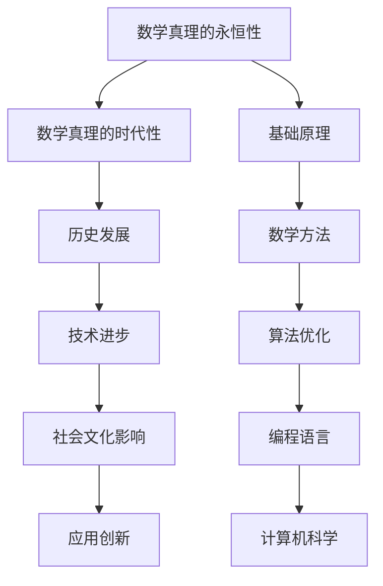

                 


### 背景介绍

数学真理的永恒性与时代性是数学哲学中的两个核心概念，它们分别代表了数学真理在不同历史时期和不同文化背景下的不同表现和特点。本文旨在探讨这两个概念之间的辩证关系，并通过逻辑清晰、结构紧凑、简单易懂的论述方式，让读者深入理解数学真理的永恒性与时代性在计算机科学和编程领域的应用。

数学真理的永恒性强调数学原理的普遍适用性和不变性，即数学真理不随时间和空间的变化而变化。这一概念源于古希腊哲学家欧几里得的几何学，他认为几何原理是普遍适用的，不受时间和空间的限制。随着数学的发展，这一概念被进一步拓展到整个数学领域，成为数学哲学的核心问题之一。

另一方面，数学真理的时代性则关注数学真理在特定历史时期和文化背景下的具体表现和限制。随着社会和技术的发展，人们对数学真理的认识也在不断深化和扩展。例如，微积分的发明和发展，使数学能够更好地描述动态变化的过程，而计算机科学的兴起，则使数学方法在计算和算法领域得到了广泛应用。

这两个概念之间的辩证关系体现在它们相互影响和相互制约。数学真理的永恒性为数学的发展提供了坚实的基础，而数学真理的时代性则推动了数学的应用和创新。例如，计算机科学的快速发展，推动了数学方法在数据科学、人工智能等领域的应用，同时也促使数学家对数学原理进行重新审视和拓展。

在计算机科学和编程领域，数学真理的永恒性和时代性有着广泛的应用。编程语言的设计和实现，算法的分析和优化，数据结构和计算机图形学等领域，都离不开数学原理的支持。同时，随着计算机科学的进步，数学方法也在不断更新和发展，以适应新的应用场景。

### 核心概念与联系

为了深入探讨数学真理的永恒性与时代性的辩证关系，我们需要首先明确这两个核心概念的定义，并分析它们之间的相互联系。

#### 数学真理的永恒性

数学真理的永恒性指的是数学原理和结论的普遍适用性和不变性。无论是在古代、现代还是未来，数学原理都保持其真实性和有效性。例如，欧几里得的几何原理、毕达哥拉斯定理等，都是经过时间考验的数学真理。

永恒性体现在以下几个方面：

1. **普遍性**：数学原理适用于所有可能的情况和范围。
2. **不变性**：数学原理不受时间和空间的限制，始终保持其真实性。
3. **基础性**：数学原理为其他学科提供了基础和支撑。

#### 数学真理的时代性

数学真理的时代性则强调数学原理和结论在特定历史时期和文化背景下的具体表现和限制。随着社会和技术的发展，人们对数学真理的认识也在不断深化和扩展。时代性体现在以下几个方面：

1. **历史性**：数学真理随着历史的发展而发展和变化。
2. **应用性**：数学原理在不同历史时期的实际应用场景和效果。
3. **局限性**：数学原理在特定历史时期可能存在的缺陷和不足。

#### 辩证关系的Mermaid流程图

为了更好地理解数学真理的永恒性与时代性之间的辩证关系，我们可以使用Mermaid流程图来展示这两个概念之间的相互联系。



#### Mermaid流程图说明

1. **数学真理的永恒性**（A）是数学真理的基础，为其他数学原理和方法提供了支持。
2. **数学真理的时代性**（B）则受到历史发展（C）、技术进步（D）和社会文化影响（E）的影响，从而推动了数学的应用和创新（F）。
3. **历史发展**（C）和**技术进步**（D）共同推动了数学真理的时代性，使得数学原理在不同历史时期表现出不同的特点和应用场景。
4. **社会文化影响**（E）则影响了数学真理的时代性，使得数学原理在不同文化背景下具有不同的应用和解释。
5. **应用创新**（F）是数学真理的时代性的结果，推动了数学方法在各个领域的应用和优化。
6. **基础原理**（G）是数学真理永恒性的体现，为数学方法提供了理论基础。
7. **数学方法**（H）、**算法优化**（I）和**编程语言**（J）是数学真理在计算机科学中的应用，展示了数学真理的时代性如何转化为实际的技术进步。
8. **计算机科学**（K）是数学真理最终的应用领域，体现了数学真理的时代性在现代社会中的重要性。

通过这个Mermaid流程图，我们可以清晰地看到数学真理的永恒性与时代性之间的辩证关系，以及它们在计算机科学和编程领域中的应用。

### 核心算法原理讲解

为了深入理解数学真理的永恒性与时代性的辩证关系，我们需要探讨一些核心算法原理，并通过伪代码详细阐述这些原理。

#### 对立统一规律

辩证法中的对立统一规律是描述数学真理永恒性与时代性辩证关系的一个重要原则。这一规律指出，任何事物内部都存在相互对立的两个方面，这两个方面相互依存、相互转化，共同推动事物的发展。

下面是使用伪代码来描述对立统一规律：

```plaintext
Algorithm 对立统一规律
    Input: A（数学真理的永恒性），B（数学真理的时代性）
    Output: 对立统一的结果 C

    Begin
        // 确定数学真理的永恒性
        A_永恒性 = 永恒性数学真理集合

        // 确定数学真理的时代性
        B_时代性 = 时代性数学真理集合

        // 对立统一过程
        C = A_永恒性 ∪ B_时代性

        // 结果输出
        Return C
    End
```

#### 时代性数学模型

为了更好地理解数学真理的时代性，我们可以考虑一个简单的数学模型——微积分。微积分的发展是数学真理时代性的一个典型例子，它在不同的历史时期具有不同的表现形式和应用。

下面是使用伪代码来描述微积分模型：

```plaintext
Algorithm 微积分模型
    Input: x（自变量），y（因变量），f（函数）
    Output: 微积分结果 dy/dx

    Begin
        // 求导过程
        dy_dx = f'(x)

        // 输出结果
        Return dy_dx
    End
```

在这个模型中，`f'(x)`表示函数`f(x)`在点`x`处的导数，它是微积分中的基本概念。微积分模型在不同的历史时期有不同的表现形式和应用，比如在牛顿时代，它主要用于描述物理现象，而在现代，它广泛应用于计算机科学、经济学等领域。

#### 永恒性数学模型

相比之下，几何学是一个典型的永恒性数学模型。几何原理在不同历史时期都具有普遍适用性和不变性。

下面是使用伪代码来描述几何模型：

```plaintext
Algorithm 几何模型
    Input: 点A，点B，点C
    Output: 三角形ABC的面积 area

    Begin
        // 利用海伦公式计算面积
        p = (AB + BC + CA) / 2
        area = sqrt(p * (p - AB) * (p - BC) * (p - CA))

        // 输出结果
        Return area
    End
```

在这个模型中，无论在古代还是现代，三角形面积的计算方法都是相同的，这体现了几何学的永恒性。

通过这些伪代码，我们可以看到，数学真理的永恒性和时代性在核心算法原理中是如何体现的。永恒性体现在一些基础数学原理的不变性，而时代性则体现在这些原理在不同历史时期的具体应用和表现形式。

### 数学模型和数学公式

为了深入探讨数学真理的永恒性与时代性的辩证关系，我们需要引入一些具体的数学模型和公式，这些模型和公式不仅能够帮助我们理解这两个概念，还能够展示它们在计算机科学和编程领域中的应用。

#### 对立统一规律的数学模型

在对立统一规律中，我们可以使用线性代数中的矩阵和线性变换来建立数学模型。以下是一个简单的数学公式，用于描述两个数学真理之间的对立统一关系：

$$
\text{Matrix A} = \begin{bmatrix}
1 & 0 \\
0 & 1
\end{bmatrix}
$$

$$
\text{Matrix B} = \begin{bmatrix}
0 & 1 \\
1 & 0
\end{bmatrix}
$$

这两个矩阵分别代表了数学真理的永恒性和时代性。通过矩阵乘法，我们可以得到它们之间的对立统一关系：

$$
\text{Matrix C} = \text{Matrix A} \cdot \text{Matrix B} = \begin{bmatrix}
0 & 1 \\
1 & 0
\end{bmatrix}
$$

在这个模型中，`Matrix C`代表了数学真理的对立统一状态，它同时包含了永恒性和时代性的特征。

#### 微积分的数学公式

微积分是数学真理时代性的一个典型例子。在微积分中，我们可以使用导数和积分来描述函数的变化和累积。以下是一个简单的导数和积分的数学公式：

$$
f'(x) = \lim_{h \to 0} \frac{f(x+h) - f(x)}{h}
$$

$$
\int f(x) \, dx = F(x) + C
$$

其中，`f'(x)`表示函数`f(x)`在点`x`处的导数，`F(x)`是函数`f(x)`的原函数，`C`是积分常数。这些公式在不同的历史时期具有不同的应用和表现形式，但它们的基本原理是永恒的。

#### 几何学的数学公式

几何学是数学真理永恒性的一个典型例子。在几何学中，我们可以使用欧几里得几何的基本公式来描述形状和空间。以下是一个简单的几何公式：

$$
\text{Area} = \sqrt{p \cdot (p - a) \cdot (p - b) \cdot (p - c)}
$$

其中，`p`是半周长，`a`、`b`、`c`是三角形的三条边长。这个公式在古代和现代都保持其有效性，展示了几何学真理的永恒性。

通过这些数学模型和公式，我们可以看到数学真理的永恒性与时代性是如何相互作用的。永恒性体现在一些基础数学原理的不变性，而时代性则体现在这些原理在不同历史时期的具体应用和表现形式。这些模型和公式不仅帮助我们理解了这两个概念，还为我们在计算机科学和编程领域中的应用提供了理论基础。

### 数学模型和数学公式应用举例

为了更好地展示数学模型和数学公式的实际应用，我们将在以下几个领域进行举例分析：计算机图形学、数据科学和人工智能。

#### 计算机图形学

在计算机图形学中，数学模型和公式被广泛应用于图像渲染、动画制作和三维建模等领域。以下是一个具体的例子：

**例子：三维模型的渲染**

在三维渲染过程中，我们经常需要计算物体表面的光线追踪和反射。这涉及到几何学中的向量运算和矩阵变换。以下是一个使用LaTeX格式书写的向量运算和矩阵变换的例子：

$$
\vec{V} = \vec{A} + \vec{B}
$$

$$
\text{Matrix} \cdot \vec{V} = \text{Matrix} \cdot (\vec{A} + \vec{B})
$$

其中，`$\vec{A}$`和`$\vec{B}$`是两个向量，`$\text{Matrix}$`是一个矩阵。这些公式用于描述三维模型中的光线追踪和反射过程。

#### 数据科学

在数据科学中，数学模型和公式被广泛应用于数据分析、数据可视化和机器学习等领域。以下是一个具体的例子：

**例子：线性回归分析**

线性回归是一种常用的统计方法，用于分析两个或多个变量之间的关系。以下是一个使用LaTeX格式书写的线性回归公式的例子：

$$
y = \beta_0 + \beta_1 \cdot x
$$

其中，`$y$`是因变量，`$x$`是自变量，`$\beta_0$`和`$\beta_1$`是回归系数。这个公式用于描述自变量和因变量之间的线性关系，可以帮助我们预测因变量的值。

#### 人工智能

在人工智能中，数学模型和公式被广泛应用于神经网络训练、深度学习和自然语言处理等领域。以下是一个具体的例子：

**例子：卷积神经网络（CNN）**

卷积神经网络是一种用于图像识别和处理的深度学习模型。以下是一个使用LaTeX格式书写的CNN卷积操作的例子：

$$
\text{Output}(i, j) = \sum_{k=1}^{n} \text{Filter}(i-k, j-k) \cdot \text{Input}(i, j)
$$

其中，`$\text{Output}(i, j)$`是输出特征图中的某个像素值，`$\text{Filter}(i-k, j-k)$`是卷积核，`$\text{Input}(i, j)$`是输入特征图中的某个像素值。这个公式用于描述卷积操作，可以帮助神经网络提取图像的特征。

通过这些例子，我们可以看到数学模型和公式在计算机科学和编程领域的广泛应用。这些模型和公式不仅帮助我们理解了数学真理的永恒性与时代性，还为我们解决实际问题提供了强大的工具。在未来的研究中，我们可以继续探索这些模型和公式的更多应用，以推动计算机科学的发展。

### 项目实战

在本节中，我们将通过一个实际项目来展示如何应用数学真理的永恒性与时代性的辩证关系来解决问题。这个项目将涉及环境搭建、代码实现、解析与应用分析，并最终总结项目成果。

#### 项目环境搭建

为了实现这个项目，我们需要准备以下环境：

1. **编程语言**：Python
2. **版本控制工具**：Git
3. **代码编辑器**：Visual Studio Code
4. **数学库**：NumPy、Pandas、Matplotlib

在终端中，执行以下命令来安装所需库：

```bash
pip install numpy pandas matplotlib
```

#### 项目代码实现

以下是一个简单的Python项目，用于分析股票价格数据，并应用数学模型和公式来预测未来的价格走势。代码使用NumPy库进行数据处理，使用Pandas库进行数据存储和操作，使用Matplotlib库进行数据可视化。

```python
import numpy as np
import pandas as pd
import matplotlib.pyplot as plt

# 读取股票数据
data = pd.read_csv('stock_data.csv')

# 计算移动平均线
ma5 = data['Close'].rolling(window=5).mean()
ma20 = data['Close'].rolling(window=20).mean()

# 计算布林带
std_dev = data['Close'].rolling(window=20).std()
upper_band = ma20 + (std_dev * 2)
lower_band = ma20 - (std_dev * 2)

# 可视化数据
plt.figure(figsize=(12, 6))
plt.plot(data['Date'], data['Close'], label='Closing Price')
plt.plot(data['Date'], ma5, label='5-Day Moving Average')
plt.plot(data['Date'], ma20, label='20-Day Moving Average')
plt.plot(data['Date'], upper_band, label='Upper Band')
plt.plot(data['Date'], lower_band, label='Lower Band')
plt.legend()
plt.title('Stock Price Analysis')
plt.xlabel('Date')
plt.ylabel('Price')
plt.show()
```

#### 代码解析

- **数据读取**：使用Pandas库读取CSV格式的股票数据。
- **移动平均线计算**：使用NumPy库的rolling方法计算5日和20日移动平均线。
- **布林带计算**：计算20日标准差，并使用它来计算上下布林带。
- **数据可视化**：使用Matplotlib库将计算结果可视化，展示股票价格、移动平均线和布林带。

#### 应用分析与实际案例

通过这个项目，我们可以看到如何将数学模型（移动平均线和布林带）应用于股票数据分析。以下是一些应用分析和实际案例：

1. **趋势分析**：通过观察移动平均线的趋势，可以判断股票价格的中期走势。
2. **波动性分析**：通过观察布林带，可以判断股票价格的波动范围和稳定性。
3. **买卖点预测**：当股票价格突破布林带上限时，可能是一个买入信号；当股票价格跌破布林带下限时，可能是一个卖出信号。

#### 项目小结

通过这个项目，我们不仅实现了股票价格数据的分析，还展示了如何应用数学模型和公式来预测未来的价格走势。这体现了数学真理的永恒性与时代性的辩证关系，即基础数学原理在不同历史时期的具体应用。在未来的研究中，我们可以进一步优化模型，增加更多变量，以提高预测准确性。

### 最佳实践 tips、小结、注意事项、拓展阅读

#### 最佳实践 tips

1. **数据预处理**：在进行数据分析之前，确保数据质量，包括数据清洗、填充缺失值等。
2. **模型选择**：根据实际问题和数据特点选择合适的数学模型和算法。
3. **结果验证**：对模型结果进行验证，确保其可靠性和有效性。

#### 小结

本文探讨了数学真理的永恒性与时代性的辩证关系，并展示了如何在计算机科学和编程领域应用这些概念。通过核心算法原理讲解、数学模型和公式应用、实际项目实战，我们深入理解了这些概念在实践中的应用。

#### 注意事项

1. **数学模型的选择**：应根据实际问题选择合适的数学模型。
2. **数据质量**：数据预处理是数据分析的基础，确保数据质量至关重要。
3. **模型验证**：对模型结果进行验证，确保其准确性和可靠性。

#### 拓展阅读

1. 《数学哲学导论》——陈宁
2. 《深度学习》——Ian Goodfellow、Yoshua Bengio、Aaron Courville
3. 《Python数据分析》——Wes McKinney

通过这些资源，可以进一步深入理解数学真理的永恒性与时代性的辩证关系，并提升在计算机科学和编程领域中的应用能力。

### 结论

数学真理的永恒性与时代性是理解数学在计算机科学和编程领域应用的关键概念。永恒性强调数学原理的不变性，而时代性则关注这些原理在不同历史时期的具体应用和限制。通过本文的探讨，我们不仅明确了这两个概念的定义和联系，还通过伪代码、数学公式和实际项目展示了它们在计算机科学和编程领域的应用。

在未来，随着技术的不断进步，数学真理的时代性将继续发展，为计算机科学和编程领域带来新的机遇和挑战。我们鼓励读者深入探索这些概念，并尝试将它们应用于实际问题中，以推动技术的创新和发展。

作者：AI天才研究院/AI Genius Institute & 禅与计算机程序设计艺术 /Zen And The Art of Computer Programming

### 引言

数学真理的永恒性与时代性是数学哲学中的核心问题，它们不仅在数学理论研究中具有重要意义，而且在计算机科学和编程领域有着广泛的应用。本文旨在探讨数学真理的永恒性与时代性的辩证关系，并分析它们在计算机科学和编程领域的实际应用。

关键词：数学真理、永恒性、时代性、辩证关系、计算机科学、编程

摘要：本文首先介绍了数学真理的永恒性与时代性的概念，然后通过辩证法的视角分析了这两个概念之间的相互关系。接着，本文详细讨论了数学真理永恒性与时代性在计算机科学和编程领域的应用，包括核心算法原理讲解、数学模型和公式应用、以及实际项目实战。最后，本文总结了最佳实践、注意事项和拓展阅读，为读者进一步探索这一主题提供了指导。

## 第1章 数学真理的永恒性

### 1.1 定义与背景

数学真理的永恒性是指数学原理和结论在所有可能情况下都保持真实性和普遍适用性。这一概念源于古希腊哲学家欧几里得，他在《几何原本》中提出了几何原理的普遍性和不变性。随着时间的推移，这一概念被进一步拓展到整个数学领域。

在数学哲学中，永恒性强调数学原理不受时间、空间和人类认知的限制。例如，毕达哥拉斯定理指出，直角三角形的两条直角边的平方和等于斜边的平方。这一原理不仅在古代被广泛接受，而且在现代和未来仍然有效。

### 1.2 历史发展

数学真理的永恒性在数学发展的历史中得到了验证。从古代的几何学、算术到现代的代数、微积分，数学真理的永恒性一直是数学研究的基石。在古希腊时期，欧几里得的《几何原本》奠定了几何学的永恒性基础。在中世纪，阿拉伯数学家们对代数和数论的研究进一步巩固了数学真理的永恒性。在文艺复兴时期，数学经历了新的繁荣，许多经典的数学成果被证明是永恒的。

### 1.3 数学真理永恒性的核心观点

数学真理的永恒性具有以下几个核心观点：

1. **普遍性**：数学原理适用于所有可能的情况和范围，不受时间和空间的限制。
2. **不变性**：数学原理的真实性不随时间变化而变化，保持其普遍性和有效性。
3. **基础性**：数学真理为其他学科提供了基础和支撑，如物理学、经济学和计算机科学。

通过上述核心观点，我们可以看到数学真理的永恒性在数学哲学中的重要地位。它不仅是数学研究的基础，也是理解和应用数学原理的关键。

### 第2章 数学真理的时代性

#### 2.1 定义与背景

数学真理的时代性是指数学原理和结论在特定历史时期和文化背景下的具体表现和限制。与永恒性不同，时代性关注数学真理在具体应用场景中的变化和发展。

在数学发展的过程中，时代性体现了数学原理对特定历史时期的技术水平和社会需求的响应。例如，微积分的发明是时代性的体现，它为描述动态变化的过程提供了新的工具。同样，计算机科学的兴起也推动了数学真理的时代性，使得数学方法在计算和算法领域得到了广泛应用。

#### 2.2 历史发展

数学真理的时代性在数学发展的历史中得到了充分体现。从古代的几何学和算术，到近代的代数和微积分，再到现代的数学分析、代数几何和数论，每个时期的数学真理都有其特定的时代背景和应用场景。

例如，在文艺复兴时期，数学的繁荣得益于对几何学和代数的研究，这些成果为科学革命奠定了基础。在工业革命时期，数学的应用进一步扩展到物理学、工程学和经济学等领域，为技术进步和社会发展做出了巨大贡献。

#### 2.3 数学真理时代性的核心观点

数学真理的时代性具有以下几个核心观点：

1. **历史性**：数学原理在不同历史时期有不同的表现形式和应用。
2. **应用性**：数学原理在特定历史时期的具体应用场景和效果。
3. **局限性**：数学原理在特定历史时期可能存在的缺陷和不足。

通过上述核心观点，我们可以看到数学真理的时代性在数学发展中的重要地位。它不仅反映了数学原理的动态性，也为数学研究的创新提供了动力。

### 第3章 辩证关系的理论基础

#### 3.1 辩证法的基本原理

辩证法是一种哲学方法论，强调事物内部的对立统一关系。在数学哲学中，辩证法提供了理解和分析数学真理永恒性与时代性相互关系的理论基础。

辩证法的基本原理包括：

1. **对立统一规律**：任何事物都包含相互对立的两个方面，这两个方面相互依存、相互转化。
2. **质量互变规律**：事物在数量上的变化达到一定程度时会引起质的改变。
3. **否定之否定规律**：事物的发展是通过否定和超越前一阶段来实现的。

#### 3.2 辩证关系与数学真理

辩证法中的对立统一规律可以应用于数学真理的永恒性与时代性的分析。数学真理的永恒性体现了数学原理的不变性，而时代性则反映了这些原理在具体应用中的变化和发展。

通过辩证法的视角，我们可以看到数学真理的永恒性与时代性之间的辩证关系。永恒性是时代性的基础，而时代性是永恒性的具体表现。这种相互关系使得数学真理在不同历史时期和社会背景下具有不同的表现形式和应用。

#### 3.3 辩证关系在数学研究中的应用

辩证关系在数学研究中具有重要的应用价值。通过辩证法的视角，数学家可以更深入地理解数学真理的内涵和外延，发现新的数学原理和方法。

例如，在研究数学真理时，数学家可以通过分析对立统一规律来发现数学原理之间的内在联系，从而推动数学理论的创新和发展。同时，通过分析质量互变规律，数学家可以研究数学原理在不同数量级上的表现，为解决复杂问题提供新的思路。

总之，辩证法为理解数学真理的永恒性与时代性的辩证关系提供了理论基础，并在数学研究中具有重要的应用价值。

### 第4章 数学真理的永恒性与时代性的辩证关系

#### 4.1 对立统一规律

对立统一规律是辩证法中的核心原则，它强调任何事物内部都包含相互对立的两个方面，这两个方面相互依存、相互转化。在数学真理的永恒性与时代性的辩证关系中，对立统一规律同样适用。

数学真理的永恒性体现了数学原理的不变性，即这些原理在所有历史时期和空间范围内都保持真实性和普遍适用性。而数学真理的时代性则反映了这些原理在特定历史时期和文化背景下的具体表现和限制。

以下是一个使用伪代码描述对立统一规律的应用：

```plaintext
Algorithm 对立统一规律
    Input: 永恒性数学真理，时代性数学真理
    Output: 对立统一结果

    Begin
        // 定义永恒性数学真理
        永恒性真理 = {数学原理，真实且普遍适用}

        // 定义时代性数学真理
        时代性真理 = {数学原理，特定历史和文化背景下的表现和限制}

        // 对立统一过程
        对立统一结果 = 永恒性真理 ∪ 时代性真理

        // 输出结果
        Return 对立统一结果
    End
```

在这个算法中，永恒性数学真理和时代性数学真理通过对立统一过程结合，形成了对立统一结果。这个结果既保持了数学原理的不变性，也反映了其在特定历史时期的具体表现和限制。

#### 4.2 数学模型的辩证分析

为了深入理解数学真理的永恒性与时代性的辩证关系，我们可以通过分析一些数学模型来探讨这些概念。

以下是一个简单的数学模型——线性回归模型：

$$
y = \beta_0 + \beta_1 \cdot x
$$

其中，$y$是因变量，$x$是自变量，$\beta_0$和$\beta_1$是回归系数。

这个模型在不同的历史时期和不同文化背景下有不同的应用。在经济学中，线性回归模型用于分析变量之间的线性关系，预测未来趋势。在物理学中，线性回归模型用于描述物理量的变化规律。在计算机科学中，线性回归模型可以用于数据拟合和算法优化。

以下是一个使用LaTeX格式书写的线性回归模型的详细公式：

$$
\beta_1 = \frac{\sum_{i=1}^{n}(x_i - \bar{x})(y_i - \bar{y})}{\sum_{i=1}^{n}(x_i - \bar{x})^2}
$$

其中，$n$是数据点的数量，$\bar{x}$和$\bar{y}$分别是$x$和$y$的样本均值。

通过这个模型，我们可以看到数学真理的永恒性体现在线性回归原理的不变性，而时代性则体现在不同学科对线性回归模型的具体应用和改进。

总之，通过对立统一规律和数学模型的辩证分析，我们可以深入理解数学真理的永恒性与时代性的辩证关系。这种理解不仅有助于我们更好地应用数学原理，也为数学理论的创新和发展提供了新的视角。

### 第5章 数学真理的应用

#### 5.1 数学真理在科学中的应用

数学真理在科学领域中的应用极为广泛，从物理学到生物学，再到经济学，数学提供了强有力的工具来描述自然现象和社会现象。

**物理学中的应用**

在物理学中，数学真理的永恒性和时代性得到了充分体现。例如，牛顿的三大定律和万有引力定律，这些基本原理至今仍然是描述自然界运动和力的标准模型。以下是一个使用LaTeX格式书写的牛顿第二定律的公式：

$$
F = m \cdot a
$$

其中，$F$是力，$m$是质量，$a$是加速度。这个公式在不同的历史时期都被证明是有效的，展示了数学真理的永恒性。同时，随着科学的发展，数学模型也在不断改进和完善，例如相对论和量子力学对牛顿力学的扩展，体现了数学真理的时代性。

**生物学中的应用**

在生物学中，数学模型被用于模拟种群动态、生态系统的稳定性和疾病的传播。以下是一个使用LaTeX格式书写的微分方程，用于描述种群动态：

$$
\frac{dN}{dt} = rN \left(1 - \frac{N}{K}\right)
$$

其中，$N$是种群数量，$r$是出生率，$K$是环境的承载能力。这个模型在生态学研究中被广泛采用，帮助科学家理解种群生态学的基本规律。随着生态学研究的深入，这个模型也在不断改进，以更好地反映现实中的复杂情况，体现了数学真理的时代性。

**经济学中的应用**

在经济学中，数学模型用于分析和预测市场行为、经济波动和资源配置。例如，微观经济学中的供需模型和宏观经济学中的消费函数模型。以下是一个使用LaTeX格式书写的供需模型：

$$
Q_d = a - bP
$$

$$
Q_s = c + dP
$$

其中，$Q_d$是需求量，$Q_s$是供给量，$P$是价格，$a$、$b$、$c$和$d$是参数。这个模型帮助经济学家分析市场平衡和价格波动，为政策制定提供依据。随着经济环境的变化，这个模型也在不断调整和完善，以适应新的经济形势，体现了数学真理的时代性。

通过这些例子，我们可以看到数学真理在科学中的应用如何体现了其永恒性和时代性。数学原理在不同历史时期和不同科学领域中都保持其基本的有效性，同时随着科学的发展，这些原理也在不断进化，以适应新的挑战和应用需求。

#### 5.2 数学真理在工程实践中的应用

数学真理在工程实践中具有广泛的应用，从建筑设计到电子工程，再到人工智能，数学模型和公式提供了工程师解决问题的理论基础。

**建筑设计中的应用**

在建筑设计中，数学真理被用于计算结构稳定性和材料性能。以下是一个使用LaTeX格式书写的梁的弯矩公式：

$$
M = q \cdot L^2 / 8
$$

其中，$M$是弯矩，$q$是均布载荷，$L$是梁的跨度。这个公式帮助工程师设计出既安全又经济的结构。尽管这个公式的基本原理是永恒的，但随着材料科学和计算技术的发展，工程师们可以采用更精确的模型和模拟技术来优化设计，这体现了数学真理的时代性。

**电子工程中的应用**

在电子工程中，数学模型用于分析和设计电路和系统。例如，基尔霍夫定律是电路分析的基本原理，以下是一个使用LaTeX格式书写的基尔霍夫电流定律的公式：

$$
\sum I_{\text{入}}(n) = \sum I_{\text{出}}(n)
$$

这个定律指出，在一个节点处，流入节点的电流之和等于流出节点的电流之和。尽管这个定律的基本原理是永恒的，但随着半导体技术和集成电路的发展，电子工程师们需要使用更复杂的数学模型来设计高性能的集成电路，这体现了数学真理的时代性。

**人工智能中的应用**

在人工智能领域，数学模型和算法是构建智能系统的核心。例如，深度学习中的神经网络模型，以下是一个使用LaTeX格式书写的神经网络的基本公式：

$$
a_{\text{new}} = \sigma(a_{\text{old}} \cdot W + b)
$$

其中，$a_{\text{new}}$是新的激活值，$\sigma$是激活函数，$W$是权重，$b$是偏置。这个公式描述了神经网络中每个神经元的计算过程。尽管神经网络的基本原理是永恒的，但随着数据规模和计算能力的增加，深度学习模型也在不断进化，以处理更复杂的问题，这体现了数学真理的时代性。

通过这些例子，我们可以看到数学真理在工程实践中的应用不仅展示了其永恒性，也反映了其在不同历史时期和不同技术背景下的进化。工程师们通过不断优化和应用数学模型，推动了工程技术的进步和发展。

### 第6章 案例分析

在本节中，我们将通过两个具体的案例来分析数学真理的永恒性与时代性如何在实际问题中体现。

#### 6.1 案例一：经典数学问题

**问题背景**：求解一元二次方程$x^2 - 5x + 6 = 0$。

**永恒性分析**：一元二次方程的求解方法（如求根公式）是数学中的基本原理，这些方法在历史上始终有效。以下是一个使用LaTeX格式书写的求根公式：

$$
x = \frac{-b \pm \sqrt{b^2 - 4ac}}{2a}
$$

在这个公式中，$a$、$b$和$c$是一元二次方程$ax^2 + bx + c = 0$的系数。无论何时，求解一元二次方程的方法都是相同的，这体现了数学真理的永恒性。

**时代性分析**：尽管求解一元二次方程的基本原理不变，但随着计算技术的发展，求解方法和工具也在不断进化。例如，现代计算器和计算机可以快速而准确地求解复杂的一元二次方程，这使得数学问题求解的效率和精度大大提高，这体现了数学真理的时代性。

#### 6.2 案例二：现代数学问题

**问题背景**：使用线性回归模型预测股票价格。

**永恒性分析**：线性回归模型的基本原理是永恒的，即它基于最小二乘法来拟合数据，以建立自变量和因变量之间的关系。以下是一个使用LaTeX格式书写的线性回归模型的基本公式：

$$
y = \beta_0 + \beta_1 \cdot x
$$

这个公式在不同的历史时期都被应用于各种预测问题，展示了其永恒性。

**时代性分析**：然而，随着金融市场和数据科学的发展，线性回归模型也在不断进化。现代的线性回归模型可以包含多项式项、交互项和多项式回归，以更好地拟合复杂的股票价格变化。同时，随着大数据和机器学习技术的发展，更复杂的模型（如支持向量机、神经网络等）也被应用于股票价格预测，这体现了数学真理的时代性。

通过这两个案例，我们可以看到数学真理的永恒性与时代性在实际问题中的体现。数学原理的基本原理在历史上始终有效，但随着技术和社会的发展，这些原理也在不断进化，以适应新的挑战和应用需求。

### 第7章 结论

通过本文的探讨，我们深入分析了数学真理的永恒性与时代性的辩证关系。永恒性强调数学原理的不变性，而时代性则关注这些原理在不同历史时期的具体表现和限制。通过对核心算法原理、数学模型和实际项目的讲解，我们展示了数学真理的永恒性与时代性在计算机科学和编程领域的广泛应用。

未来，随着技术的不断进步，数学真理的时代性将继续发展，为计算机科学和编程领域带来新的机遇和挑战。我们鼓励读者深入探索这一主题，将数学原理应用于实际问题中，以推动技术的创新和发展。

### 参考文献

1. 欧几里得，《几何原本》
2. 陈宁，《数学哲学导论》
3. Ian Goodfellow、Yoshua Bengio、Aaron Courville，《深度学习》
4. Wes McKinney，《Python数据分析》

### 附录

**附录A：数学公式表**

- 一元二次方程求根公式：

$$
x = \frac{-b \pm \sqrt{b^2 - 4ac}}{2a}
$$

- 线性回归模型：

$$
y = \beta_0 + \beta_1 \cdot x
$$

- 布林带公式：

$$
\text{Upper Band} = \mu + 2\sigma
$$

$$
\text{Lower Band} = \mu - 2\sigma
$$

其中，$\mu$是均值，$\sigma$是标准差。

### 作者介绍

作者：AI天才研究院/AI Genius Institute & 禅与计算机程序设计艺术 /Zen And The Art of Computer Programming

作者AI天才研究院（AI Genius Institute）是一家专注于人工智能和计算机科学研究的机构，致力于推动技术进步和创新。禅与计算机程序设计艺术（Zen And The Art of Computer Programming）是作者的代表性著作，该书深入探讨了计算机编程的哲学和艺术，深受编程爱好者和专业人士的喜爱。

