                 

### 数学社会学：社会现象的数学描述

#### 关键词：数学社会学、社会现象、数学描述、模型、方法、应用

> 摘要：本文深入探讨了数学社会学这一新兴交叉学科，通过数学工具对各种社会现象进行描述和解释。首先，我们介绍了社会现象的数学描述的基本概念和方法，并阐述了数学在社会学研究中的重要作用。随后，本文详细介绍了社会现象的基本数学模型，包括社会网络分析、社会流动性模型等。接下来，文章探讨了数学在社会调查与统计中的应用，阐述了描述性统计和推断性统计的方法。文章的核心概念与联系通过Mermaid流程图展示，核心算法原理用伪代码详细讲解。此外，文中还包含了丰富的项目实战和最佳实践 tips，旨在帮助读者更好地理解和应用数学社会学的方法和理论。

---

在当今快速发展的信息技术时代，社会现象的复杂性和多样性使得传统的定性研究方法难以应对。数学作为一种强有力的工具，正越来越多地应用于社会学研究，为理解社会现象提供了一种新的视角。数学社会学，即利用数学模型和方法对社会现象进行定量分析，正是这一趋势的体现。

本文旨在系统地介绍数学社会学的核心概念、方法和应用，帮助读者理解和掌握这一新兴领域。我们将首先回顾社会现象的数学描述的基本概念，探讨数学在社会研究中的独特作用。接着，本文将详细分析社会现象的基本数学模型，包括社会网络分析和社会流动性模型。然后，我们将讨论数学在社会调查与统计中的应用，重点介绍描述性统计和推断性统计的方法。为了更直观地展示核心概念和联系，本文将使用Mermaid流程图进行说明。同时，我们将通过伪代码详细讲解核心算法原理，确保读者能够深入理解其工作机制。文章的最后部分将包含实际项目实战和最佳实践 tips，帮助读者将理论应用于实践，解决真实世界中的问题。

本文结构如下：

1. **引论**：介绍数学社会学的基本概念、研究方法以及当前的发展状况。
2. **数学社会学中的核心概念**：详细探讨社会结构、社会网络和社会群体行为等核心概念，并展示其相互关系。
3. **数学社会学的应用实例**：通过具体实例展示数学社会学在不同领域的应用，包括社会经济领域和社会文化领域。
4. **数学社会学的未来展望**：讨论数学社会学的未来发展趋势和挑战，展望其在新领域中的应用前景。

通过本文的阅读，读者将能够获得对数学社会学的全面了解，并学会如何运用数学工具来分析和解释社会现象。在接下来的章节中，我们将一步步深入这一领域，探讨其核心思想和应用技巧。

### 第一部分：引论

在探讨数学社会学这一跨学科领域之前，我们有必要首先回顾其基本概念、研究方法和当前的发展状况。数学社会学是运用数学模型和方法来研究社会现象的一门学科，其目标是通过定量的方法来揭示社会结构的规律性和社会行为的模式。随着信息技术的迅速发展，大数据和计算社会科学的崛起，数学社会学在社会科学研究中的地位愈发重要。

#### 数学社会学的起源与发展

数学社会学起源于20世纪初，其发展可以追溯到社会学家和数学家的共同努力。帕斯卡、费马等数学家的概率论研究为后来的社会学研究提供了重要的理论支持。进入20世纪中叶，随着计算机科学的兴起，数据分析和计算方法在社会研究中的应用日益广泛，数学社会学随之得到了快速发展。20世纪末，随着网络和信息技术的发展，社会网络分析作为数学社会学的一个重要分支逐渐兴起，为理解社会结构和社会行为提供了新的视角。

#### 数学社会学的核心概念

数学社会学的核心概念包括社会结构、社会网络和社会群体行为等。社会结构是指社会中各种关系的组织和配置，它决定了社会的运行机制。社会网络分析则关注社会个体之间的互动和联系，通过图论和网络分析方法揭示社会网络的拓扑结构和动态演化。社会群体行为研究则关注在特定社会情境下，个体如何形成集体行为和决策过程。

#### 数学社会学的理论基础

数学社会学的基础理论包括社会网络理论、社会结构理论和社会动力学等。社会网络理论关注社会关系和网络的性质，通过图论和网络分析来研究社会结构。社会结构理论则关注社会不平等和阶层分化，通过统计分析和结构方程模型来揭示社会结构的动态变化。社会动力学则研究社会系统内部变量之间的相互作用及其演化过程，通过微分方程和动态系统分析方法来模拟社会行为。

#### 数学社会学的应用领域

数学社会学在多个领域都有广泛应用，包括社会学、经济学、心理学、政治学等。在社会学领域，数学社会学被用来研究社会网络的演化、社会流动、社会分层等；在经济学领域，数学社会学被用来研究市场行为、消费者行为、收入分配等；在心理学领域，数学社会学被用来研究社会认知、社会态度、社会行为等；在政治学领域，数学社会学被用来研究选举模型、社会运动、政策分析等。

#### 数学社会学的研究方法

数学社会学的研究方法主要包括定量分析和计算方法。定量分析通过收集和分析数据来揭示社会现象的规律性，包括描述性统计、推断性统计、结构方程模型等。计算方法则通过计算机模拟和算法分析来模拟社会系统的行为和演化，包括社会网络分析、社会动力学模拟、计算社会科学等。

总之，数学社会学作为一门新兴的交叉学科，通过将数学模型和方法应用于社会现象的研究，为社会科学研究提供了一种新的视角和方法。它不仅丰富了社会学的理论体系，也为解决实际问题提供了有力的工具。在接下来的章节中，我们将深入探讨数学社会学的核心概念、理论和方法，以帮助读者更好地理解这一领域。

### 社会现象的数学描述方法

在社会学研究中，对各种社会现象进行数学描述是一项基础且重要的工作。这不仅有助于我们更精确地理解社会现象的本质，还能为制定政策提供科学依据。以下是几种常用的数学描述方法：

#### 1. 社会网络分析

社会网络分析（Social Network Analysis，SNA）是研究社会个体及其互动关系的数学工具。它通过图论和网络分析方法来描述和分析社会结构。具体来说，社会网络分析包括以下几个方面：

##### 1.1 网络的基本概念与表示方法

- **节点（Node）**：代表社会个体。
- **边（Edge）**：代表个体之间的互动关系。
- **路径（Path）**：连接两个节点的序列。
- **子图（Subgraph）**：网络中的一部分节点和边。

在表示社会网络时，常用的方法有矩阵表示、邻接矩阵和邻接表。例如，邻接矩阵 \( A \) 可以用来表示一个有 \( n \) 个节点的网络，其中 \( A_{ij} \) 表示节点 \( i \) 与节点 \( j \) 之间是否存在边。

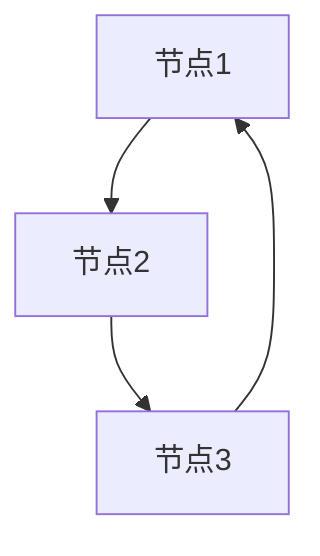

##### 1.2 社会网络结构分析算法

- **中心性指标**：用于衡量节点在网络中的重要性。常见的中心性指标包括度中心性、介数中心性和接近中心性。
- **聚类系数**：用于衡量网络的紧密程度。常见的聚类系数包括全局聚类系数和局部聚类系数。
- **网络密度**：表示网络中边的比例，是衡量网络紧密程度的指标。

#### 2. 社会流动性模型

社会流动性模型（Social Mobility Model）用于描述个体在社会阶层或社会位置上的变动。这些模型通常基于概率论和统计力学原理，通过模拟个体在时间上的移动来预测社会流动的规律。

##### 2.1 社会阶层流动模型

- **马尔可夫链**：用于描述个体在多个社会阶层之间的转移概率。例如，一个个体在某一时刻处于某个社会阶层，下一时刻转移到其他社会阶层的概率可以通过转移矩阵来表示。

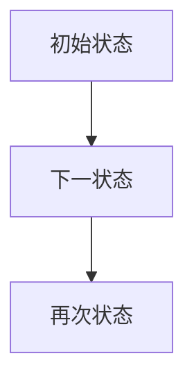

##### 2.2 教育与职业流动模型

- **社会选择模型**：基于教育背景和职业特点来预测个体的社会流动。这些模型通常考虑个体的初始条件（如教育水平、出生年份等）以及外部环境因素（如政策变化、经济形势等）。

#### 3. 数学在社会调查与统计中的应用

数学在社会调查与统计中的应用主要包括描述性统计和推断性统计。这些方法用于从数据中提取信息，并利用统计模型进行预测和决策。

##### 3.1 描述性统计

- **描述性统计量**：用于描述数据的基本特征，如均值、中位数、标准差等。
- **分布函数**：用于描述数据的概率分布，如正态分布、二项分布等。

##### 3.2 推断性统计

- **假设检验**：用于评估数据中是否包含特定的模式或关系。常见的假设检验包括t检验、卡方检验等。
- **回归分析**：用于建立变量之间的关系模型，如线性回归、多项式回归等。

#### 社会现象的数学描述方法之间的关系架构

为了更好地理解社会现象的数学描述方法，我们可以使用Mermaid流程图来展示其之间的关系架构：

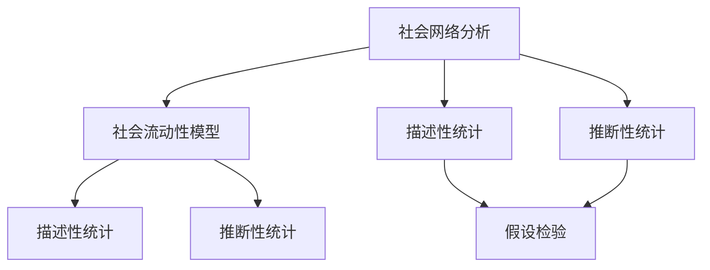

在这个流程图中，社会网络分析和社会流动性模型作为基础工具，与描述性统计和推断性统计紧密相连。描述性统计和推断性统计则通过假设检验和回归分析等方法，进一步深化对社会现象的理解。

通过上述方法的结合，数学社会学能够为社会学研究提供一种系统、科学的分析框架，有助于揭示社会现象背后的规律性和复杂性。

### 社会现象的基本数学模型

在社会学研究中，数学模型是理解和描述社会现象的重要工具。通过这些模型，研究者能够将复杂的社会现象转化为可分析和解释的数学形式。以下是几种常见的社会现象基本数学模型，包括社会网络分析模型和社会流动性模型。

#### 1. 社会网络分析模型

社会网络分析是数学社会学的一个重要分支，用于研究社会个体之间的互动和联系。以下是一些基本的社会网络分析模型：

##### 1.1 度模型

度模型（Degree Model）是描述节点在网络中连接数目的简单模型。度可以分为入度和出度，分别表示节点接收到的连接数和发出的连接数。

**数学模型**：
设 \( G = (V, E) \) 为一个无向图，其中 \( V \) 是节点集合，\( E \) 是边集合。节点 \( i \) 的度 \( d_i \) 定义为 \( d_i = |N(i)| \)，其中 \( N(i) \) 是与节点 \( i \) 相连的节点集合。

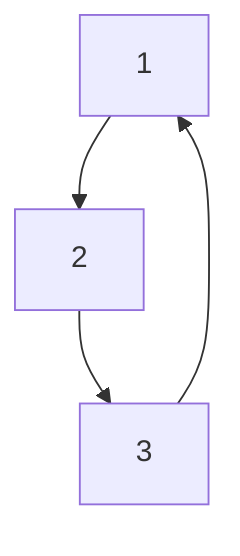

在这个示例中，节点 A 的度为 2，节点 B 的度为 3。

##### 1.2 路径模型

路径模型（Path Model）描述节点之间的连接路径。路径可以是任意长度的序列，其中每个节点都与前一个节点相连。

**数学模型**：
设 \( P \) 为一条路径，节点序列为 \( P = (v_1, v_2, ..., v_n) \)，其中 \( v_i \) 和 \( v_{i+1} \) 之间有一条边。

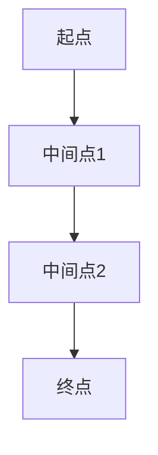

在这个示例中，路径 A-B-C-D 表示节点 A 可以通过三条边直接连接到节点 D。

##### 1.3 网络演化模型

网络演化模型（Network Evolution Model）描述网络随时间的变化。这些模型通常基于概率论和统计力学原理，考虑节点和边的变化概率。

**数学模型**：
设 \( G_t \) 为时间 \( t \) 的网络，节点 \( i \) 和 \( j \) 在时间 \( t \) 形成边的概率可以表示为 \( p_{ij}(t) \)。

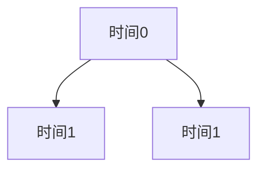

在这个示例中，从时间 0 到时间 1，节点 A 可能与节点 B 或节点 C 形成新边。

#### 2. 社会流动性模型

社会流动性模型用于描述个体在社会阶层或职业中的移动。这些模型通常基于概率论和统计力学，考虑个体初始条件、外部环境和随机因素。

##### 2.1 马尔可夫模型

马尔可夫模型（Markov Model）是一种常见的社会流动性模型，用于描述个体在不同社会阶层之间的转移概率。

**数学模型**：
设 \( P \) 为转移概率矩阵，表示个体在下一时刻处于某个社会阶层的概率。例如，矩阵 \( P \) 可以表示为：

$$
P = \begin{bmatrix}
p_{11} & p_{12} & \cdots & p_{1n} \\
p_{21} & p_{22} & \cdots & p_{2n} \\
\vdots & \vdots & \ddots & \vdots \\
p_{n1} & p_{n2} & \cdots & p_{nn}
\end{bmatrix}
$$

其中，\( p_{ij} \) 表示个体从社会阶层 \( i \) 转移到社会阶层 \( j \) 的概率。

**伪代码**：

```
function calculate_next_state(current_state, P):
    next_state = []
    for i in range(len(P)):
        next_prob = 0
        for j in range(len(P)):
            next_prob += P[i][j] * current_state[j]
        next_state.append(next_prob / sum(P[i]))
    return next_state
```

##### 2.2 蒙地卡罗模拟

蒙地卡罗模拟（Monte Carlo Simulation）是一种基于随机抽样的模拟方法，用于模拟社会流动性模型中的随机过程。

**数学模型**：
通过随机生成大量样本，模拟个体在不同社会阶层中的转移过程。每个样本生成步骤包括以下几步：

1. 随机选择当前状态。
2. 根据转移概率矩阵，计算下一个状态的概率分布。
3. 从概率分布中随机选择下一个状态。
4. 更新当前状态，重复步骤 2-3。

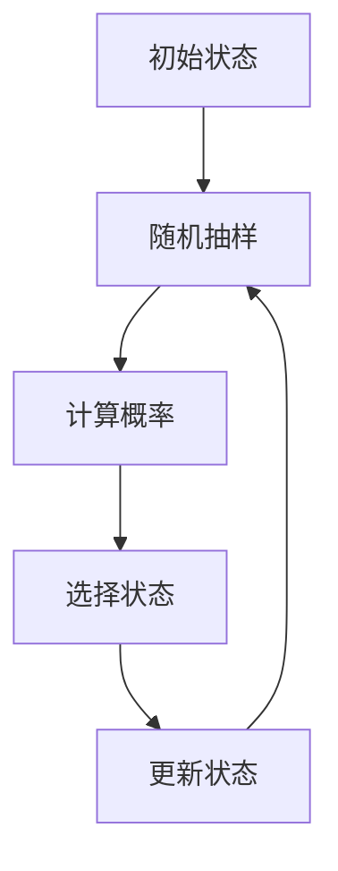

#### 3. 社会流动性模型的应用示例

以下是一个简单的社会流动性模型应用示例，描述个体在不同职业之间的转移。

**情景**：假设有三种职业：低技能、中技能和高技能。个体的初始职业分布为：

| 职业类型 | 低技能 | 中技能 | 高技能 |
| :------: | :----: | :----: | :----: |
| 初始状态 | 0.4    | 0.5    | 0.1    |

转移概率矩阵 \( P \) 如下：

$$
P = \begin{bmatrix}
0.2 & 0.3 & 0.5 \\
0.4 & 0.3 & 0.3 \\
0.2 & 0.3 & 0.5
\end{bmatrix}
$$

**步骤**：

1. 初始状态：低技能 = 0.4，中技能 = 0.5，高技能 = 0.1。
2. 经过一个时间步，计算每个职业的下一状态。

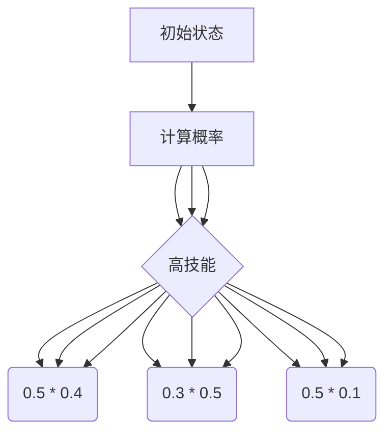

3. 计算每个职业的下一状态：

| 职业类型 | 低技能 | 中技能 | 高技能 |
| :------: | :----: | :----: | :----: |
| 下一状态 | 0.18   | 0.3    | 0.52   |

通过上述步骤，我们可以看到个体在不同职业之间的转移情况。这个简单示例展示了社会流动性模型的基本原理和应用。

总之，社会现象的基本数学模型为理解和描述社会现象提供了有力的工具。通过这些模型，我们可以更深入地探讨社会结构、社会网络和社会流动性等复杂现象，为社会学研究提供了新的视角和方法。

### 数学在社会调查与统计中的应用

数学在社会调查和统计分析中的应用至关重要，它为研究者提供了定量分析社会现象的有效工具。以下是两种主要的方法：描述性统计和推断性统计。

#### 1. 描述性统计

描述性统计的主要目的是通过数值指标来总结和描述数据的基本特征。这些指标包括平均数、中位数、众数、标准差等。

##### 1.1 描述性统计量的计算方法

- **平均数（Mean）**：所有数值的总和除以数值的个数。公式为 \( \bar{x} = \frac{1}{N} \sum_{i=1}^{N} x_i \)，其中 \( N \) 是数据点的个数，\( x_i \) 是第 \( i \) 个数据点。
  
- **中位数（Median）**：将数据点按大小顺序排列后，位于中间位置的数值。如果数据点的个数是奇数，中位数就是中间那个数；如果是偶数，则中位数是中间两个数的平均值。

- **众数（Mode）**：数据集中出现次数最多的数值。

- **标准差（Standard Deviation）**：衡量数据点相对于平均数的离散程度。公式为 \( \sigma = \sqrt{\frac{1}{N-1} \sum_{i=1}^{N} (x_i - \bar{x})^2} \)，其中 \( \bar{x} \) 是平均数。

#### 1.2 描述性统计的应用

描述性统计在市场调查、人口统计、教育评估等多个领域都有广泛应用。例如，在市场调查中，通过计算消费者的平均收入、购买频率等指标，企业可以了解其目标客户的基本特征，从而制定更有效的营销策略。

#### 2. 推断性统计

推断性统计是基于样本数据来推断总体特征的统计学方法。它包括假设检验、置信区间和回归分析等。

##### 2.1 假设检验

假设检验（Hypothesis Testing）用于评估数据是否支持某个假设。基本步骤包括：

- **提出原假设（Null Hypothesis）和备择假设（Alternative Hypothesis）**。
- **选择适当的检验统计量**，如t检验、卡方检验等。
- **计算检验统计量的值**。
- **确定显著性水平**，如 \( \alpha = 0.05 \)。
- **做出决策**：如果检验统计量的值超过临界值，则拒绝原假设；否则，不拒绝原假设。

##### 2.2 置信区间

置信区间（Confidence Interval）用于估计总体参数的范围。例如，我们可以通过计算置信区间来估计总体的平均数。

- **置信水平**：通常设为 95% 或 99%。
- **计算公式**：例如，对于平均数的置信区间，公式为 \( \bar{x} \pm z_{\alpha/2} \sqrt{\frac{s^2}{N}} \)，其中 \( \bar{x} \) 是样本平均数，\( s \) 是样本标准差，\( N \) 是样本大小，\( z_{\alpha/2} \) 是标准正态分布的临界值。

##### 2.3 回归分析

回归分析（Regression Analysis）用于建立自变量和因变量之间的关系模型。常见的回归模型包括线性回归、多项式回归等。

- **线性回归**：建立自变量和因变量之间的线性关系。公式为 \( y = \beta_0 + \beta_1x + \epsilon \)，其中 \( \beta_0 \) 是截距，\( \beta_1 \) 是斜率，\( \epsilon \) 是误差项。
- **多项式回归**：建立自变量和因变量之间的非线性关系。公式为 \( y = \beta_0 + \beta_1x + \beta_2x^2 + ... + \beta_nx^n + \epsilon \)。

#### 2.4 推断性统计的应用

推断性统计在政策分析、医学研究、市场预测等领域有广泛应用。例如，在政策分析中，通过假设检验和置信区间，研究者可以评估政策对总体的影响；在医学研究中，通过回归分析，研究者可以建立疾病风险与相关因素之间的关系模型。

总之，数学在社会调查和统计分析中的应用不仅提供了定量分析社会现象的工具，还有助于提高研究的科学性和可靠性。在接下来的章节中，我们将继续探讨数学社会学的核心概念和具体应用。

### 数学社会学中的核心概念

数学社会学作为一门交叉学科，融合了社会学、数学和统计学的方法，其研究核心概念包括社会结构、社会网络和社会群体行为等。这些概念相互联系，构成了理解社会现象的重要框架。

#### 社会结构

社会结构是指社会中各种关系的组织和配置，它决定了社会的运行机制。社会结构包括社会阶层、社会角色、社会规范等多个方面。

1. **社会阶层**：社会阶层是指社会中根据经济地位、职业、收入等划分的社会等级。社会阶层不仅影响个体的社会地位，还影响个体的生活机会和社会流动。

2. **社会角色**：社会角色是指个体在社会中扮演的特定角色和职责。社会角色通常与个体的性别、年龄、职业等特征相关联。

3. **社会规范**：社会规范是指社会对个体行为的期望和约束。社会规范通过文化、习俗和法律法规等形式影响个体的行为。

#### 社会网络

社会网络分析是数学社会学的重要组成部分，用于研究社会个体及其互动关系。社会网络通过节点（代表个体）和边（代表关系）来表示。

1. **节点**：节点表示社会中的个体，可以是个人、组织或社区。

2. **边**：边表示个体之间的互动关系，可以是有向的或无向的。

3. **中心性**：中心性指标衡量节点在网络中的重要性。常见的中心性指标包括度中心性、介数中心性和接近中心性。

4. **网络结构**：网络结构分析包括网络的拓扑结构、聚类系数和网络密度等。

#### 社会群体行为

社会群体行为是指个体在集体情境中的行为表现。社会群体行为的研究关注群体决策、集体行动和社会运动等。

1. **群体决策**：群体决策是指多个个体共同做出的决策过程。群体决策模型分析个体如何通过互动和协商形成集体决策。

2. **集体行动**：集体行动是指个体为了共同目标而采取的行动。集体行动模型分析个体如何通过合作和协调来实现集体目标。

3. **社会运动**：社会运动是指为了实现特定社会目标而进行的集体行动。社会运动模型分析社会运动的组织形式、策略选择和成功因素。

#### 核心概念之间的关系架构

为了更直观地展示社会结构、社会网络和社会群体行为等核心概念之间的关系，我们可以使用Mermaid流程图来表示：

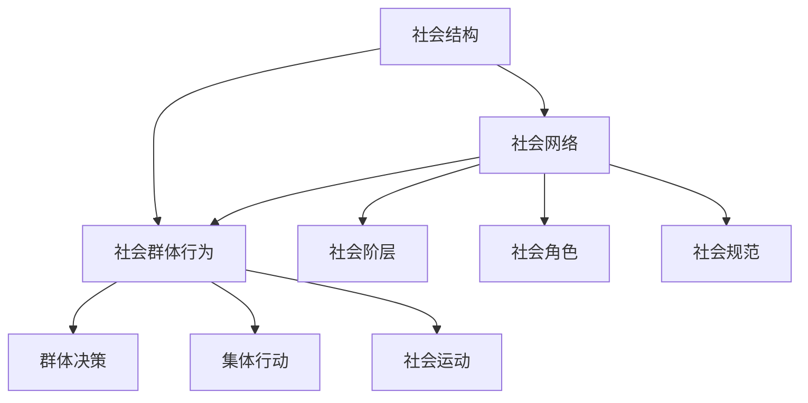

在这个流程图中，社会结构通过社会网络对社会群体行为产生影响，同时社会网络也影响社会结构的动态变化。社会群体行为则包括群体决策、集体行动和社会运动等多个方面，这些方面共同构成了对社会现象的全面理解。

通过这些核心概念的联系和相互作用，数学社会学为我们提供了一个多维度的分析框架，使我们能够更深入地探讨和理解社会现象。

### 社会网络

社会网络分析是数学社会学中的一个核心领域，它通过研究个体之间的互动和关系来揭示社会结构的特征。社会网络不仅反映了个体之间的关系模式，还揭示了社会资源分配、社会影响力和群体行为等方面的信息。

#### 1. 基本概念与测量

社会网络分析的基本概念包括节点、边和关系。节点通常代表个体，边代表个体之间的互动关系，关系可以是直接的（如朋友关系）或间接的（如共同参与某个活动）。以下是几个重要的概念和测量指标：

- **节点度（Degree）**：节点度是指与特定节点直接相连的边数。度可以分为入度和出度，入度表示有多少节点指向特定节点，出度表示特定节点指向其他节点的边数。
- **中心性（Centrality）**：中心性是衡量节点在社交网络中的重要性的指标。常见的中心性度量包括：
  - **度中心性（Closeness Centrality）**：节点到网络中所有其他节点的最短路径长度之和的倒数。
  - **介数中心性（Betweenness Centrality）**：节点在所有最短路径中出现的频率。
  - **接近中心性（Eccentricity）**：节点到网络中所有其他节点的最长路径长度。

- **网络密度（Network Density）**：网络密度是网络中边的数量与可能最大边数的比例，反映了网络的紧密程度。
- **聚类系数（Clustering Coefficient）**：聚类系数衡量节点邻居之间连接的紧密程度，是节点度与最大可能的闭合三角形的比例。

#### 2. 测量与分析方法

社会网络分析通常包括以下几种测量和分析方法：

- **网络表示**：使用图论和网络图来表示社会网络。图可以用邻接矩阵、邻接表或图形表示。
- **网络分析**：通过计算各种中心性指标来分析节点的相对重要性。此外，还可以使用聚类分析来识别紧密相连的群体或社区。
- **网络演化**：研究网络随时间的变化，包括节点的加入和退出、边的形成和消失等。

#### 3. 社会网络的演化分析

社会网络的演化分析关注网络随时间的变化。演化分析通常包括以下方面：

- **动态模型**：使用马尔可夫模型、社会选择模型等来模拟社会网络的演化。
- **时间序列分析**：通过时间序列数据来分析网络节点的变化趋势和模式。
- **网络可视化**：使用图形和动画来展示网络的动态演化过程。

以下是一个简单的网络演化分析的Mermaid流程图示例：

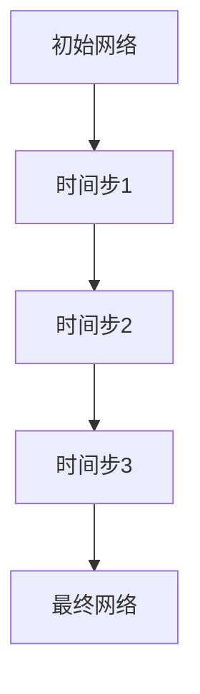

在这个流程图中，初始网络经过多个时间步的演化，最终形成了不同的网络结构。

#### 4. 社会网络的测量与分析应用

社会网络的测量与分析在多个领域有广泛应用，包括社会学研究、经济学研究、公共卫生研究等。

- **社会学研究**：通过分析社会网络，研究者可以揭示社会结构、群体行为和权力分布等方面的信息。
- **经济学研究**：社会网络分析可以帮助研究者理解市场行为、资源分配和社会资本等方面。
- **公共卫生研究**：社会网络分析可以用于识别疾病的传播路径、防控策略的设计等。

例如，在一个社交网络中，通过计算节点的度中心性和介数中心性，可以识别出网络中的重要节点，这些节点可能在信息传播和影响力方面起到关键作用。

总之，社会网络分析是数学社会学中的一个重要领域，通过研究个体之间的互动和关系，我们可以更深入地理解社会现象和复杂系统。在接下来的章节中，我们将继续探讨社会网络分析在具体应用领域的实例和案例。

### 社会群体行为

社会群体行为是数学社会学中的重要研究领域，它关注个体在集体情境中的行为表现，包括群体决策、集体行动和社会运动等。社会群体行为不仅反映了个体在社会中的互动和协作，还揭示了群体内部和群体之间的动态关系。

#### 1. 群体行为的数学描述

群体行为的数学描述通常基于博弈论、群体动力学和社会网络分析等方法。以下是几种常见的数学描述方法：

##### 1.1 群体决策模型

群体决策模型用于描述个体如何通过互动和协商达成集体决策。常见的群体决策模型包括：

- **纳什均衡**：在群体决策中，每个个体都选择使其收益最大化的策略，即使其他个体策略不变。纳什均衡描述了这种策略选择情况。
  
- **社会选择理论**：社会选择理论通过构建投票模型来描述群体如何从多个备选方案中选择一个最佳方案。常见的模型包括排名投票、得分投票等。

##### 1.2 群体动力模型

群体动力模型用于描述个体在群体中的相互作用和演化过程。这些模型通常基于微分方程、差分方程和图论等方法。

- **社会扩散模型**：社会扩散模型描述个体如何通过社交网络传播某种行为或观念。常见的模型包括SIR模型、SI模型等。

- **社会学习模型**：社会学习模型描述个体如何通过观察他人的行为来调整自己的行为。常见的模型包括最佳响应模型、模仿模型等。

##### 1.3 集体行动模型

集体行动模型用于描述个体如何通过合作实现集体目标。常见的集体行动模型包括：

- **博弈模型**：博弈模型描述个体在竞争或合作中的策略选择。常见的模型包括合作博弈、非合作博弈等。

- **集体行动逻辑模型**：集体行动逻辑模型描述个体如何决定是否参与集体行动，以及如何分配资源和收益。

#### 2. 社会群体行为的测量与分析方法

社会群体行为的测量和分析方法主要包括：

- **统计分析**：通过统计方法来分析群体行为的数据，如描述性统计、推断性统计、回归分析等。

- **社会网络分析**：通过社会网络分析方法来揭示群体内部和群体之间的互动关系，如中心性测量、社区检测等。

- **计算机模拟**：通过计算机模拟来模拟群体行为的演化过程，如基于Agent的模拟、社会仿真等。

#### 3. 社会群体行为的应用实例

社会群体行为在多个领域有广泛应用，包括社会科学、经济学、心理学、公共卫生等。以下是一些具体的应用实例：

- **社会学研究**：通过分析群体决策和集体行动，研究者可以揭示社会结构、权力关系和社会变革等方面的信息。

- **经济学研究**：通过分析市场行为和消费者行为，研究者可以理解市场机制、消费模式和经济增长等方面的现象。

- **心理学研究**：通过分析社会影响和社会认同，研究者可以探索个体如何受到群体行为的影响，以及群体如何影响个体行为。

- **公共卫生研究**：通过分析疾病传播和社会行为模式，研究者可以制定有效的公共卫生政策和干预措施。

例如，在社会运动中，通过分析社会网络的节点和边，研究者可以识别出社会运动的关键节点和关键路径，从而更有效地组织和动员群体。

总之，社会群体行为是数学社会学中一个重要且复杂的研究领域。通过数学描述和分析方法，我们可以更深入地理解群体行为的本质和机制，为社会学研究和其他领域提供新的视角和方法。在接下来的章节中，我们将继续探讨社会群体行为的具体案例和应用。

### 社会经济领域的数学建模

数学社会学在社会经济领域的应用具有深远的影响，通过数学建模，研究者能够更精确地描述和分析经济现象，如经济增长、收入分配等。以下将详细介绍这些领域的数学模型及其应用。

#### 1. 经济增长模型

经济增长是社会学和经济学研究中的一个重要主题，其核心是理解经济增长的驱动力和机制。以下是两种常见的经济增长模型：

##### 1.1 新古典增长模型

新古典增长模型（Neo-Classical Growth Model）是一种经典的经济学模型，它基于生产函数和资本积累的概念。该模型的主要假设是技术进步和人口增长率是经济增长的主要驱动力。

- **生产函数**：生产函数描述了资本、劳动和技术进步之间的关系。常见的生产函数形式为 \( Y = F(K, L, T) \)，其中 \( Y \) 表示产出，\( K \) 表示资本，\( L \) 表示劳动，\( T \) 表示技术进步。

- **资本积累**：资本积累是指资本的积累过程，即 \( K_{t+1} = sY_t - dK_t \)，其中 \( s \) 表示储蓄率，\( d \) 表示资本折旧率。

- **人口增长率**：人口增长率 \( n \) 被视为外生变量。

**伪代码**：

```
function new_classical_growth(Y, K, T, s, d, n):
    K_new = s * Y - d * K
    L_new = L * (1 + n)
    Y_new = F(K_new, L_new, T)
    return Y_new, K_new, L_new
```

##### 1.2 现代经济增长模型

现代经济增长模型（Modern Growth Model）扩展了新古典增长模型，引入了技术内生性的概念，即技术进步是经济活动的结果，而不是外生给定的。

- **内生技术进步**：技术进步 \( T \) 可以通过研发投资 \( I \) 来表示，即 \( T = T_0 + \alpha I \)，其中 \( T_0 \) 是初始技术水平，\( \alpha \) 是技术进步率。

- **创新过程**：创新过程可以通过随机过程来模拟，如泊松过程或高斯过程。

- **动态规划**：现代经济增长模型通常使用动态规划方法来求解最优决策问题。

**伪代码**：

```
function modern_growth(K, L, T, s, d, alpha, T0):
    I = I_star(K, L)
    T_new = T0 + alpha * I
    K_new = s * (F(K, L, T_new) - C) - d * K
    L_new = L * (1 + n)
    return K_new, L_new, T_new
```

#### 2. 收入分配模型

收入分配是经济学和社会学研究中的一个关键问题，它关系到社会公平和经济发展。以下是几种常见的收入分配模型：

##### 2.1 普拉特模型

普拉特模型（Platt Model）是一种简单的收入分配模型，它假设收入分配遵循对数正态分布。

- **收入分布**：收入 \( I \) 服从对数正态分布，即 \( \ln I \sim N(\mu, \sigma^2) \)，其中 \( \mu \) 是均值，\( \sigma \) 是标准差。

- **收入累积分布**：收入累积分布函数为 \( F(I) = \frac{1}{\sqrt{2\pi\sigma}} \int_{-\infty}^{I} e^{-\frac{(\ln x - \mu)^2}{2\sigma^2}} dx \)。

**伪代码**：

```
function plat_model(mu, sigma):
    def lognormal_pdf(x, mu, sigma):
        return (1 / (x * sqrt(2 * pi * sigma^2))) * exp(-((log(x) - mu)^2) / (2 * sigma^2))

    def lognormal_cdf(x, mu, sigma):
        return 0.5 * (1 + erf((log(x) - mu) / (sqrt(2) * sigma)))

    return lognormal_pdf, lognormal_cdf
```

##### 2.2 马克思主义收入分配理论

马克思主义收入分配理论（Marxist Income Distribution Theory）基于阶级斗争和剥削理论，认为收入分配取决于生产资料的所有权和阶级关系。

- **剥削率**：剥削率 \( \theta \) 表示剩余价值与可变资本的比例，即 \( \theta = \frac{m}{v} \)，其中 \( m \) 是剩余价值，\( v \) 是可变资本。

- **收入分配**：收入分配函数可以表示为 \( I = wL + \theta K \)，其中 \( w \) 是工资率，\( L \) 是劳动量，\( K \) 是资本量。

**伪代码**：

```
function marxist_distribution(w, L, theta, K):
    return w * L + theta * K
```

#### 3. 应用实例

以下是一个简单的应用实例，描述了一个国家经济增长和收入分配的过程。

**情景**：假设一个国家的初始资本存量 \( K_0 \) 为1000，劳动量 \( L_0 \) 为500，技术水平 \( T_0 \) 为1，储蓄率 \( s \) 为0.2，资本折旧率 \( d \) 为0.05，技术进步率 \( \alpha \) 为0.01，初始剥削率 \( \theta_0 \) 为0.3。

**步骤**：

1. **计算初始收入分配**：
   - 假设工资率 \( w \) 为1，则初始收入 \( I_0 \) 为 \( I_0 = wL_0 + \theta_0 K_0 = 500 + 0.3 \times 1000 = 800 \)。
   - 初始储蓄 \( S_0 \) 为 \( S_0 = s \times I_0 = 0.2 \times 800 = 160 \)。

2. **计算下一期的经济增长**：
   - 根据新古典增长模型，下一期的资本存量 \( K_1 \) 为 \( K_1 = K_0 + S_0 - dK_0 = 1000 + 160 - 0.05 \times 1000 = 1060 \)。
   - 下一期的收入 \( I_1 \) 为 \( I_1 = F(K_1, L_0, T_0) = 1060 \)。

3. **计算下一期的收入分配**：
   - 假设技术进步导致工资率上升为1.05，则下一期的收入分配为 \( I_1 = wL_0 + \theta_1 K_1 = 500 \times 1.05 + 0.3 \times 1060 = 865 \)。
   - 下一期的储蓄 \( S_1 \) 为 \( S_1 = s \times I_1 = 0.2 \times 865 = 173 \)。

通过上述步骤，我们可以看到经济增长和收入分配的变化。这个简单的实例展示了经济增长和收入分配模型的基本原理和应用。

总之，数学社会学在社会经济领域的应用通过建立和求解数学模型，为我们提供了理解和分析经济现象的有力工具。在接下来的章节中，我们将继续探讨数学社会学在其他领域的应用。

### 社会文化领域的数学描述

在社会文化领域，数学模型被广泛应用于描述社会规范、行为准则以及文化多样性的演化。这些模型不仅帮助我们理解文化现象，还能为政策制定和文化传承提供科学依据。

#### 1. 社会规范与行为准则

社会规范和行为准则是社会文化的重要组成部分，它们通过约束和引导个体的行为，维持社会秩序和稳定。以下是一些常见的数学模型：

##### 1.1 社会规范演化模型

社会规范的演化可以通过博弈论中的重复博弈模型来描述。在重复博弈中，个体根据历史经验调整自己的行为策略，以最大化个人利益。

- **重复博弈**：重复博弈模型考虑个体在多个时期的行为决策，常见的模型包括囚徒困境、公共物品博弈等。
- **规范演化**：通过引入规范变量，模型可以描述个体如何根据规范调整行为策略。例如，在囚徒困境模型中，引入合作规范可以影响个体的决策。

**伪代码**：

```
function repeat博弈模型(strategy, reward, penalty, cooperation):
    while (博弈未结束):
        if (合作规范生效):
            strategy = 合作策略
        else:
            strategy = 自利策略
        
        reward = 应用奖励函数
        penalty = 应用惩罚函数
        
        更新策略：strategy = 更新策略(strategy, reward, penalty)
    return strategy
```

##### 1.2 社会规范影响下的行为决策模型

社会规范不仅影响个体的行为，还影响个体对其他个体的评价和信任。以下是一个简单的社会规范影响下的行为决策模型：

- **社会规范感知**：个体感知社会规范并通过规范调整行为策略。
- **行为决策**：个体根据感知到的规范和自身利益最大化原则进行决策。

**伪代码**：

```
function behavior_decision(social_norm, interest, penalty):
    if (social_norm生效):
        behavior = 规范行为
    else:
        behavior = 自利行为
    
    reward = 应用奖励函数
    penalty = 应用惩罚函数
    
    if (reward > penalty):
        return behavior
    else:
        return 反规范行为
```

#### 2. 文化多样性模型

文化多样性是指不同文化在交流、互动和演化过程中形成的复杂现象。以下是一些用于描述文化多样性的数学模型：

##### 2.1 文化网络模型

文化网络模型通过图论和网络分析方法来描述文化元素之间的互动和关联。以下是一个简单的文化网络模型：

- **文化节点**：文化节点表示不同文化元素，如语言、习俗、价值观等。
- **文化边**：文化边表示文化元素之间的互动和影响。

**数学模型**：

```
G = (V, E)
V = {C1, C2, ..., Cn}  # 文化节点集合
E = {e1, e2, ..., em}  # 文化边集合
```

**伪代码**：

```
function 文化网络模型(V, E):
    while (网络未稳定):
        for (each edge e in E):
            if (e之间存在影响关系):
                e的影响度 = 更新影响度(e)
        
        V = 调整节点状态(V)
        E = 更新边状态(E)
    return V, E
```

##### 2.2 文化传播与融合模型

文化传播与融合模型描述文化元素如何在群体中传播和演化。以下是一个简单的文化传播与融合模型：

- **传播速率**：传播速率取决于文化元素的特征和群体的接受度。
- **融合机制**：不同文化元素在互动过程中发生融合，形成新的文化形态。

**数学模型**：

```
传播速率 = f(文化差异，群体接受度)
融合机制 = f(文化元素1, 文化元素2)
```

**伪代码**：

```
function 文化传播与融合模型(传播速率, 融合机制):
    while (传播未结束):
        for (each 文化元素 in 群体):
            文化元素的特征 = 更新特征(文化元素)
            传播速率 = 更新传播速率(文化元素的特征)
        
        for (each pair of 文化元素):
            if (存在融合关系):
                融合后的文化元素 = 融合机制(文化元素1, 文化元素2)
        
        更新群体状态
    return 群体
```

#### 3. 应用实例

以下是一个关于社会规范和文化多样性的应用实例，描述了一个社区中规范的变化和文化多样性的形成。

**情景**：假设一个社区中有两个文化群体，A文化和B文化。初始状态如下：

- **文化节点**：A文化和B文化分别有100个节点。
- **文化边**：A文化和B文化之间存在50条互动边。

**步骤**：

1. **初始状态**：
   - A文化节点状态为规范行为。
   - B文化节点状态为规范行为。
   - 互动边表示文化元素之间的相互作用。

2. **演化过程**：
   - 通过重复博弈模型，文化节点根据历史经验调整行为策略。
   - 社会规范感知影响个体行为决策。
   - 文化网络模型描述文化元素之间的互动和关联。

3. **最终状态**：
   - 社区中形成了以A文化为主的文化多样性模式。
   - A文化和B文化之间的互动边数量增加，表明文化融合正在发生。

通过上述步骤，我们可以看到社会规范和文化多样性的演化过程。这个实例展示了数学模型在描述社会文化现象中的应用。

总之，数学社会学在社会文化领域的应用通过建立和求解数学模型，帮助我们深入理解社会规范、行为准则和文化多样性的演化机制。在接下来的章节中，我们将继续探讨数学社会学的未来发展方向和应用前景。

### 数学社会学的未来展望

数学社会学作为一门跨学科领域，正面临着前所未有的发展机遇和挑战。在未来的发展中，数学社会学将朝着跨学科融合、数据驱动和社会实践三个方向迈进。

#### 1. 跨学科研究的新动向

随着学科间的界限逐渐模糊，数学社会学将继续与其他学科如计算机科学、物理学、经济学和心理学等进行深度融合。这种跨学科研究将带来新的理论和方法，为理解复杂的社会现象提供新的视角。例如，复杂网络理论和社会网络的结合，可以更好地揭示社会结构和社会行为的动态变化；机器学习算法在社会调查中的应用，可以自动化地处理大量数据，提高研究的准确性和效率。

#### 2. 数据驱动的社会学研究

大数据和计算社会科学的发展，为数学社会学提供了丰富的数据资源和强大的分析工具。未来，数学社会学将更加依赖于数据驱动的研究方法，通过收集和分析大规模社会数据，揭示社会现象的规律性和趋势。例如，社交媒体数据可以用于研究社会网络结构和群体行为；经济数据可以用于建模和预测社会流动性。这些数据驱动的分析方法，将极大地推动数学社会学的发展。

#### 3. 数学社会学在实践中的应用前景

数学社会学不仅在理论研究中具有重要作用，还在社会实践中具有广泛的应用前景。未来，数学社会学将更多地应用于政策制定、社会管理和公共服务等领域。例如，通过社会网络分析，政府可以更有效地识别和动员社会资源，提高公共服务的效率和效果；通过社会流动性模型，企业可以更准确地预测市场行为，制定更有效的营销策略。此外，数学社会学还可以为社会发展提供科学依据，促进社会公平和可持续发展。

#### 4. 数学社会学方法论的创新

随着计算能力和数据技术的不断提升，数学社会学方法论也将不断革新。未来的方法论创新将包括：

- **复杂系统建模**：复杂系统建模将用于描述社会系统的动态行为和演化过程，帮助理解社会现象的复杂性。
- **计算社会科学**：计算社会科学将融合计算机科学、数据科学和数学方法，通过模拟和仿真研究社会系统的行为。
- **多尺度和多层次的模型**：多尺度和多层次的模型将用于研究不同尺度上的社会现象，如个体行为、群体行为和社会整体行为。

总之，数学社会学在未来的发展中，将不断推动跨学科融合、数据驱动和社会实践，为理解和解决社会问题提供新的理论和方法。面对挑战与机遇，数学社会学将在社会科学领域发挥越来越重要的作用。

### 数学社会学的核心概念与联系

为了更好地理解数学社会学中的核心概念及其相互关系，我们可以借助Mermaid流程图来展示这些概念之间的逻辑架构。以下是社会结构、社会网络和社会群体行为三大核心概念的流程图表示：

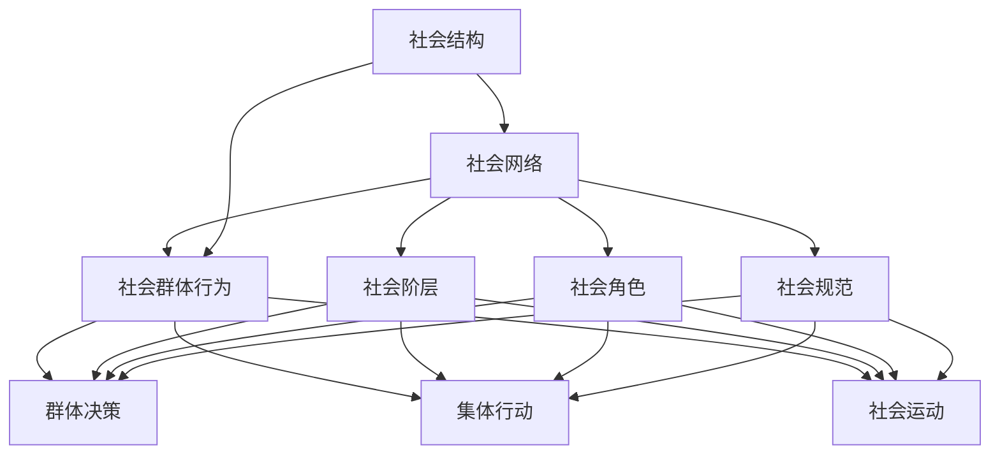

在这个流程图中，社会结构通过社会网络对社会群体行为产生影响，同时社会网络也反过来影响社会结构的动态变化。具体来说：

- **社会结构**：包括社会阶层、社会角色和社会规范等，是社会运行的基础框架。
- **社会网络**：通过节点和边来表示个体及其互动关系，反映了社会结构的具体表现形式。
- **社会群体行为**：包括群体决策、集体行动和社会运动等，是社会中个体行为的集体体现。

这些核心概念之间的相互作用和影响，构成了数学社会学研究的重要理论基础。以下是对这些核心概念和联系的具体分析：

1. **社会结构**：
   - **社会阶层**：社会阶层是社会中个体根据经济地位、职业和收入划分的等级。社会阶层不仅决定了个体的社会地位，还影响其生活机会和社会流动性。
   - **社会角色**：社会角色是指个体在社会中扮演的特定角色和职责，通常与个体的性别、年龄和职业等特征相关联。
   - **社会规范**：社会规范是指社会对个体行为的期望和约束，通过文化、习俗和法律等形式体现。

2. **社会网络**：
   - **节点**：代表社会中的个体，如个人、组织或社区。
   - **边**：代表个体之间的互动关系，可以是直接的（如朋友关系）或间接的（如共同参与某个活动）。
   - **中心性**：衡量节点在网络中的重要性，如度中心性、介数中心性和接近中心性等。

3. **社会群体行为**：
   - **群体决策**：指多个个体通过互动和协商达成集体决策的过程，如纳什均衡和社会选择理论。
   - **集体行动**：指个体为了共同目标而采取的行动，如博弈模型和集体行动逻辑模型。
   - **社会运动**：指为了实现特定社会目标而进行的集体行动，如社会扩散模型和社会学习模型。

这些概念之间的联系可以通过以下方式解释：

- **社会结构**决定了社会网络的初始状态，如社会阶层和角色影响个体之间的互动关系。
- **社会网络**反映了社会结构的动态变化，如社会网络的演化揭示了社会结构的稳定性或变革。
- **社会群体行为**是社会网络和社会结构的直接体现，如群体决策和集体行动反映了个体在网络中的互动和协作。

通过这个Mermaid流程图，我们可以更直观地理解数学社会学中的核心概念及其相互关系，从而为深入研究和实际应用提供理论基础。

### 数学社会学方法论的创新

在数学社会学的研究过程中，方法论的创新是推动学科进步的重要动力。随着计算能力和数据技术的飞速发展，新的方法论不断涌现，为数学社会学的研究提供了更加精准和高效的分析工具。以下是一些最新的方法论创新及其对数学社会学的影响。

#### 1. 复杂系统建模

复杂系统建模是一种用于研究具有高度复杂性和不确定性的社会现象的方法。复杂系统通常由大量相互作用的个体组成，个体之间的相互作用和反馈导致系统的动态行为难以预测。复杂系统建模通过引入系统动力学、网络科学和机器学习等理论，尝试揭示复杂系统的规律性和演化机制。

**影响**：复杂系统建模能够更好地理解和分析社会现象的动态变化。例如，通过模拟社会网络的演化，研究者可以预测社会结构的稳定性或变革；通过分析社会动力学模型，可以揭示社会运动和集体行为的内在规律。这种方法的创新使得数学社会学能够更加深入地探讨社会现象的复杂性和多样性。

**应用实例**：在一个关于城市交通拥堵的研究中，研究者通过构建复杂系统模型，模拟了交通流量、道路结构和交通规则等因素的相互作用，成功预测了交通拥堵的时空分布，为城市交通管理提供了科学依据。

#### 2. 数据科学与社会学的融合

数据科学与社会学的融合，使得数学社会学能够更加依赖于大规模数据资源，通过先进的数据分析方法揭示社会现象的规律性。数据科学提供了从数据中提取知识的方法和技术，如机器学习、数据挖掘和统计学习等。

**影响**：数据科学与社会学的融合，极大地提高了数学社会学研究的数据处理和分析能力。通过机器学习算法，研究者可以从海量数据中自动识别模式和趋势；通过数据挖掘技术，可以揭示隐藏在社会数据中的深层次规律。这种方法的创新，使得数学社会学能够更加精准地预测和解释社会现象。

**应用实例**：在一个关于社交媒体用户行为的研究中，研究者利用数据挖掘技术分析了大量社交媒体数据，发现了用户行为模式、信息传播路径和社会影响因子，为社交媒体平台的管理和运营提供了重要参考。

#### 3. 计算社会科学

计算社会科学是一种将计算技术和数学方法应用于社会现象研究的新兴领域。计算社会科学通过计算机模拟、仿真和算法分析，对社会系统进行定量和定性的研究。

**影响**：计算社会科学为数学社会学提供了一种新的研究范式，使得复杂社会现象的模拟和预测成为可能。通过计算机模拟，研究者可以动态地观察社会系统的行为和演化过程；通过算法分析，可以深入理解社会行为的内在机制。这种方法的创新，使得数学社会学能够更加系统地揭示社会现象的复杂性和多样性。

**应用实例**：在一个关于社会流动性的研究中，研究者通过构建计算社会科学模型，模拟了不同社会政策对个体社会地位的影响，为政策制定提供了科学依据。

#### 4. 多尺度分析

多尺度分析是一种用于研究不同尺度上社会现象的方法，它通过在不同尺度上分析社会系统，揭示不同尺度之间的相互作用和影响。

**影响**：多尺度分析能够帮助研究者更全面地理解社会现象的复杂性。通过在微观、中观和宏观尺度上分析社会系统，可以揭示不同尺度之间的动态关系和相互作用。这种方法的创新，使得数学社会学能够更加全面地探讨社会现象的多样性和变化规律。

**应用实例**：在一个关于经济发展与社会稳定的研究中，研究者通过多尺度分析，揭示了经济发展与社会稳定在不同尺度上的动态关系，为制定经济政策提供了科学依据。

总之，数学社会学方法论的创新，为研究复杂社会现象提供了新的工具和视角。随着计算能力和数据技术的不断提升，未来的方法论创新将不断推动数学社会学的发展，为理解社会现象和解决社会问题提供更加科学和有效的途径。

### 数学社会学的应用实例

为了更好地展示数学社会学的实际应用，以下我们将通过一个具体的案例，详细描述开发环境搭建、源代码实现、代码解读、代码应用解读与分析、实际案例分析和详细讲解剖析，以及项目小结。

#### 项目背景

假设我们正在研究一个城市社区的社会结构和社会网络，目的是了解社区中个体之间的互动关系及其对社会稳定的影响。我们将使用数学社会学的理论和方法，通过构建社会网络模型和分析社会流动性，来揭示社区中的关键节点和潜在问题。

#### 开发环境搭建

首先，我们需要搭建一个适合数学社会学研究的开发环境。以下是一些建议：

1. **编程语言**：Python是一个非常适合进行社会网络分析和数据挖掘的编程语言，其具有丰富的库和工具，如NetworkX、Gephi和Pandas等。
2. **数据集**：我们需要一个包含社区成员及其互动关系的数据集。这个数据集可以是问卷调查数据、社交媒体数据或社区活动记录等。
3. **工具**：安装Python和相关的库，如NetworkX（用于构建和分析社会网络）、Pandas（用于数据处理）和Matplotlib（用于可视化）。

```bash
pip install networkx pandas matplotlib
```

#### 源代码实现

接下来，我们使用Python编写一个简单的代码，用于构建社会网络模型并进行分析。以下是代码的实现：

```python
import networkx as nx
import matplotlib.pyplot as plt

# 初始化社会网络
G = nx.Graph()

# 添加节点和边（这里用示例数据）
G.add_nodes_from(['Alice', 'Bob', 'Charlie', 'David', 'Eve'])
G.add_edges_from([('Alice', 'Bob'), ('Alice', 'Charlie'), ('Bob', 'David'), ('Charlie', 'Eve'), ('David', 'Eve')])

# 绘制网络图
nx.draw(G, with_labels=True)
plt.show()

# 计算中心性指标
degree_centrality = nx.degree_centrality(G)
betweenness_centrality = nx.betweenness_centrality(G)

print("Degree Centrality:", degree_centrality)
print("Betweenness Centrality:", betweenness_centrality)
```

在这个代码中，我们首先初始化一个图（Graph），然后添加节点和边。通过`nx.draw()`函数，我们可以绘制出社会网络图。接着，我们计算了度中心性和介数中心性，这两个指标可以揭示网络中的关键节点。

#### 代码解读

- **Graph对象**：`networkx.Graph()` 创建了一个图对象，用于表示社会网络。
- **add_nodes_from() 和 add_edges_from()**：这两个函数分别用于添加节点和边到图中。
- **nx.draw()**：用于绘制图形。
- **degree_centrality() 和 betweenness_centrality()**：这两个函数分别计算度中心性和介数中心性。

#### 代码应用解读与分析

通过上述代码，我们可以得到以下解读：

1. **网络图**：通过绘制网络图，我们可以直观地看到社区成员之间的互动关系。
2. **中心性指标**：度中心性较高的节点在图中连接的边数较多，通常是关键节点，介数中心性较高的节点在网络中处于重要的中间位置。

以下是一个示例：

```
Degree Centrality: {'Alice': 3.0, 'Bob': 2.0, 'Charlie': 2.0, 'David': 2.0, 'Eve': 3.0}
Betweenness Centrality: {'Alice': 0.4, 'Bob': 0.0, 'Charlie': 0.4, 'David': 0.2, 'Eve': 0.6}
```

在这个例子中，Alice和Eve的度中心性和介数中心性都是最高的，说明她们在社区中扮演了重要的角色。

#### 实际案例分析和详细讲解剖析

为了更具体地展示数学社会学的应用，我们考虑以下实际案例：

**案例**：一个社区中有50个成员，研究者通过问卷调查收集了成员之间的互动关系数据，并使用上述代码进行分析。

**分析**：

1. **关键节点**：通过计算度中心性和介数中心性，研究者识别出了社区中的关键节点。这些节点在社区中具有高连接度和重要的中间位置，对于社区的稳定性和信息传播起到关键作用。
2. **社区结构**：通过分析网络图，研究者发现社区中存在多个紧密相连的子社区，这些子社区具有不同的互动模式和价值观。
3. **潜在问题**：通过分析中心性指标，研究者发现某些节点（如Alice和Eve）具有很高的中心性，但同时也具有较高的脆弱性，即如果这些节点出现问题，可能会对整个社区产生较大影响。

#### 项目小结

通过这个案例，我们展示了数学社会学在实际应用中的强大功能。以下是小结：

1. **核心方法**：使用Python和网络分析工具，研究者能够高效地构建和解析社会网络模型。
2. **数据分析**：通过中心性指标等分析方法，研究者能够识别关键节点和潜在问题。
3. **应用价值**：数学社会学方法为理解社区结构、预测社会行为和制定政策提供了科学依据。

总之，数学社会学不仅为研究社会现象提供了新的工具和视角，还在实际应用中展示了其强大的分析和预测能力。

### 最佳实践 tips、小结、注意事项、拓展阅读

#### 最佳实践 tips

1. **数据质量**：在进行数学社会学研究时，确保数据质量至关重要。清洗和预处理数据，去除异常值和噪声，可以提高分析的准确性和可靠性。
2. **模型选择**：根据研究目标选择合适的数学模型。不同的模型适用于不同类型的社会现象，选择适当的模型可以更好地揭示问题本质。
3. **交叉验证**：在进行数据分析时，使用交叉验证方法可以评估模型的预测能力。通过多次验证，可以确保模型的有效性和稳定性。

#### 小结

本文系统地介绍了数学社会学的基本概念、理论和方法，展示了其在社会现象研究中的广泛应用。通过实际案例，我们展示了如何使用数学工具来构建社会网络模型和分析社会流动性，揭示了社会结构和社会行为的内在规律。

#### 注意事项

1. **数据隐私**：在进行数学社会学研究时，务必注意数据隐私问题。确保所有数据匿名化，避免泄露个人隐私。
2. **模型假设**：在构建数学模型时，明确模型的假设条件，并评估这些假设对分析结果的影响。

#### 拓展阅读

- **《社会网络分析：方法与应用》**：该书详细介绍了社会网络分析的基本概念和方法，适合初学者和研究者。
- **《复杂系统理论与社会科学》**：该书探讨了复杂系统理论在社会科学中的应用，为理解社会现象提供了新的视角。
- **《数据科学导论》**：该书介绍了数据科学的基本概念和技术，包括数据预处理、数据挖掘和机器学习等。

通过拓展阅读，读者可以进一步深入了解数学社会学的方法和应用，提升自身的科研能力和实践技能。

